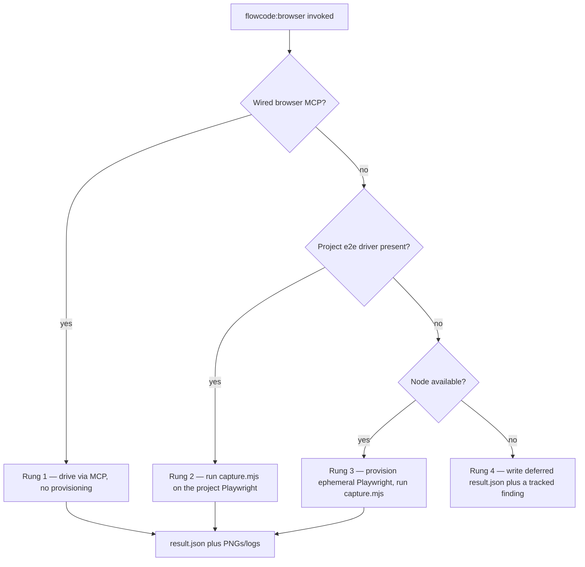

# Browser Driver Provisioning Ladder

- The procedure the worker follows to resolve a concrete driver and run a capture/smoke pass; the worker references this file rather than restating the commands.
- Four rungs, tried in order — only the last is a deferral, never a silent skip: wired MCP → project e2e driver → ephemeral Playwright → tracked `[deferred]` finding with a repro command.
- Rungs 2–3 run the vendored `capture.mjs` engine; rung 1 drives the MCP directly; rung 4 writes the deferral `result.json` shape itself (`browser-config.schema.md`).
- The unattended gap is closed whenever Node is present — the overwhelming common case, since flowcode's own engine already requires `node >= 14`.
- Boot only what you must: attach to an already-answering `baseUrl`; otherwise start the dev command, poll until ready, then tear down **only** the process you started.
- The ephemeral runtime lives at `.flowcode/logs/browser/.runtime/` and is reused across runs, so the install + browser download is paid once.

---

## Conventions

The worker substitutes these before running any command:

| Placeholder | Value |
|-------------|-------|
| `ENGINE` | Absolute path to the engine — `references/capture.mjs` inside the `flowcode:browser` skill directory (the skill passes it). |
| `CFG` | Absolute path to the `browser-config.json` the worker just wrote (`browser-config.schema.md`). |
| `BASE_URL` | The App-Run base URL (e.g. `http://localhost:3000`). |
| `DEV_CMD` | The dev-server command from `project-overview.md § App Run` → `flowcode-tools.md § Project Tools` (e.g. `npm run dev`). |
| `RUNTIME` | `.flowcode/logs/browser/.runtime` — the persistent ephemeral install prefix. |
| `BROWSERS` | `.flowcode/logs/browser/.runtime/.pw-browsers` — `PLAYWRIGHT_BROWSERS_PATH`. |
| `RUNLOG` | `.flowcode/logs/browser/{YYYY-MM-DD-HHMM}/` — this run's raw boot + engine logs. |

---

## The ladder



### Rung 1 — Wired browser MCP

**Probe:** a browser-automation MCP is wired into the session (its tools are listed) — `claude-in-chrome` (preferred) or a `playwright-mcp` / `microsoft/playwright-mcp` server.

**Action:** drive the capture/smoke through the MCP's own navigate + screenshot + DOM-query tools — **no provisioning, no `capture.mjs`**. Synthesize the `result.json` shape (`browser-config.schema.md`) from the MCP's responses so downstream routing is identical. `driver: "mcp:<name>"`.

> Prefer a wired MCP when present, but never *require* one — avoid hand-wiring `microsoft/playwright-mcp` (≈4× token cost vs. direct Playwright for the same outcome — `ui-mockup-discipline.md § MCP Preferences`).

### Rung 2 — Project's own e2e driver

**Probe (any hit):**

```bash
ls playwright.config.* cypress.config.* 2>/dev/null
ls node_modules/.bin/playwright node_modules/.bin/cypress 2>/dev/null
```

**Action:** the project ships Playwright, so the engine's plain `import('playwright')` resolves the project copy (ESM walks up from `capture.mjs`, which lives under the project tree in a host install) — run it **without** `FLOWCODE_PW_RUNTIME`:

```bash
node "$ENGINE" --config "$CFG"
```

Set `driver: "project-playwright"` in the config. (A Cypress-only project has no Playwright to import — fall through to Rung 3 to provision one, or drive the project's own `cypress run` if you prefer its runner; the engine standardizes on Playwright.)

### Rung 3 — Ephemeral Playwright (the gap-closer)

**Probe:** `node --version` succeeds and Rungs 1–2 missed. Provision into `RUNTIME` once, reuse thereafter:

```bash
# 1. install the Playwright package into the persistent runtime prefix (idempotent)
npm install --no-save --no-fund --no-audit --prefix "$RUNTIME" playwright@latest

# 2. download the chromium binary into the same runtime (paid once; skipped if present)
PLAYWRIGHT_BROWSERS_PATH="$BROWSERS" "$RUNTIME/node_modules/.bin/playwright" install chromium

# 3. run the engine, pointing it at the ephemeral install + browser
FLOWCODE_PW_RUNTIME="$RUNTIME" PLAYWRIGHT_BROWSERS_PATH="$BROWSERS" node "$ENGINE" --config "$CFG"
```

Set `driver: "playwright-ephemeral"` in the config.

> **Why `FLOWCODE_PW_RUNTIME`, not `NODE_PATH`.** `capture.mjs` is ESM, and ESM bare-specifier resolution ignores `NODE_PATH` and resolves from the *importing file's* location — which is the skill dir, not the scratch runtime. The engine therefore reads `FLOWCODE_PW_RUNTIME` and resolves `playwright` explicitly from `$RUNTIME/node_modules` via `createRequire`. `PLAYWRIGHT_BROWSERS_PATH` (read by Playwright itself) keeps the chromium binary in the same runtime so step 2 is one-time.

**Engine exit codes** (the ladder signal): `0` = ran, read `result.json`; `2` = bad config, fix the input; `3` = Playwright still unavailable (install failed) → fall to Rung 4.

### Rung 4 — Honest deferral (never a silent skip)

**When:** no MCP, no project driver, and Node/provisioning is unavailable or step-1/2 failed.

**Action:** the worker writes the deferral `result.json` itself (engine not run) — the `{ deferred: true, reason, repro }` shape in `browser-config.schema.md` — where `repro` is the exact one-liner a human / CI runs:

```bash
npm install --no-save --prefix .flowcode/logs/browser/.runtime playwright@latest \
  && PLAYWRIGHT_BROWSERS_PATH=.flowcode/logs/browser/.runtime/.pw-browsers \
     .flowcode/logs/browser/.runtime/node_modules/.bin/playwright install chromium \
  && FLOWCODE_PW_RUNTIME=.flowcode/logs/browser/.runtime \
     PLAYWRIGHT_BROWSERS_PATH=.flowcode/logs/browser/.runtime/.pw-browsers \
     node <skill>/references/capture.mjs --config <browser-config.json>
```

The worker then routes a tracked `[deferred]` finding (capture → visual-parity bucket; smoke → e2e finding) carrying this command — the closure of the dead-end prose note this capability exists to replace.

---

## Boot / attach / teardown

Resolve the App-Run recipe first (`SKILL.md § resolve recipe`), then:

1. **Attach if it already answers.** Probe the base URL — if it responds, do **not** boot; reuse the running server and skip teardown:

   ```bash
   node -e "fetch(process.argv[1]).then(()=>process.exit(0)).catch(()=>process.exit(1))" "$BASE_URL"
   ```

2. **Else boot in the background**, capturing the PID and streaming output to the run log:

   ```bash
   mkdir -p "$RUNLOG"
   ( $DEV_CMD ) > "$RUNLOG/boot.log" 2>&1 &
   DEV_PID=$!
   ```

3. **Poll until ready or timeout** (e.g. 60s), re-using the probe from step 1 between sleeps. If it never answers, capture `boot.log`, tear down, and defer with the boot failure as the reason.

4. **Run** the resolved rung's engine command; tee the engine's stdout/stderr to `"$RUNLOG/engine.log"`.

5. **Tear down only what you started.** If you booted in step 2, kill that process tree; **never** kill a server you merely attached to:

   ```bash
   kill "$DEV_PID" 2>/dev/null; pkill -P "$DEV_PID" 2>/dev/null || true
   ```

Raw `boot.log` + `engine.log` + the run's `browser-config.json` stay under `RUNLOG` (parallels `logs/qa-runs/`); the worker returns a compact report, not the raw logs or PNGs.
