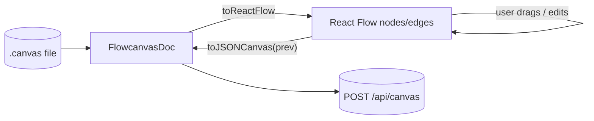
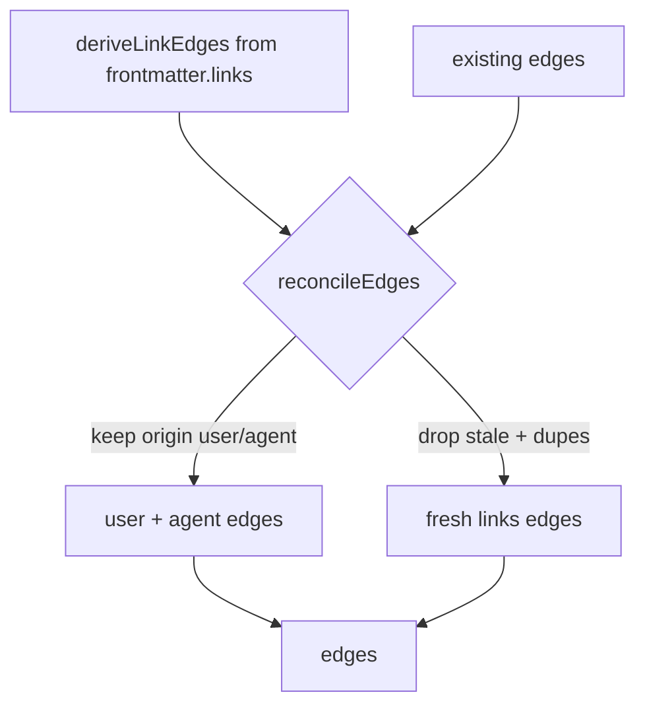
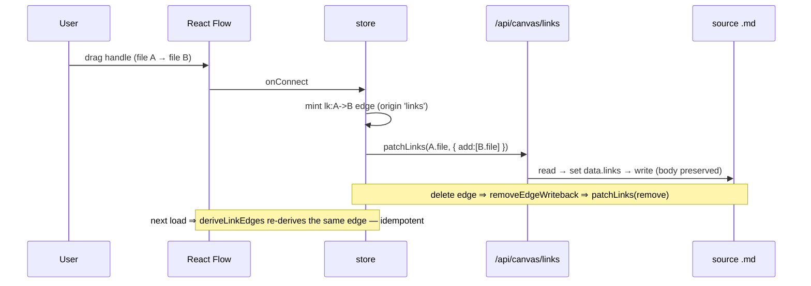

# 001-initial-architecture — Flowcanvas Implementation Plan

- Delivers Flowcanvas v0.1: a standalone Next.js canvas that renders flowcode markdown as nodes, connects them, embeds images, takes comments, and round-trips the board to/from an AI agent as one JSON.
- Phases: 10 — Bootstrap, Schema & Empty Canvas, Persistence & Resolve API, Content Nodes, Edges, Comments, Agent Round-Trip & Polish, Post-Execution Polish & Cleanup, UX/UI Redesign & File Import, Canvas Mechanics & File I/O.
- Status **complete** — all 10 phases done (1–7 2026-06-25, 8–10 2026-06-27). **Phase 10** (canvas mechanics: multi-select + true group containers, ELK re-organize, save-as/open-board) shipped after an operator-directed reopen. The operator-added transitive board hydration, ≤1-action referenced-file access, and the broader linking / source-of-truth + agent-collaboration vision are **split to plan `002-system-design-studio`** (in design).
- Upstream design: `001-initial-architecture-design.md` (read it for the full schema, API contracts, and the agent contract this plan implements).
- **All ten phases are authored to full implementation depth** (production-ready snippets, a diagram, a worked example, acceptance criteria, named gates) — by author's direction, overriding the usual stub-later-phases convention.
- Per-phase quality gates: `npx tsc --noEmit`, `npm run lint`, `npm run build`, and `npx vitest run` for the pure modules.

---

## Objective

Ship the Flowcanvas v0.1 standalone app specified in `001-initial-architecture-design.md`: an extended-JSONCanvas board (React Flow) over flowcode markdown files, with `links:`-derived + manual edges, inline images, pinned comments, and a bidirectional human↔agent JSON loop, persisted to a `.canvas` file.

---

## Phases Catalog

1. **Project Bootstrap & nyx Visual Foundation** — scaffold the Next.js 16 app, install deps, lay down Geist + JetBrains Mono fonts + the nyx glass/neon token system.
2. **Schema, Adapter & Empty Canvas** — the extended-JSONCanvas types, the `FlowcanvasDoc ↔ React Flow` adapter, and an empty pan/zoom canvas with background/controls/minimap.
3. **Persistence & Resolve API** — guarded fs routes (canvas read/write, batch frontmatter+body resolve, image streaming) and store load/save.
4. **Content Nodes** — markdown (frontmatter table + collapsible body), image, link, and note node components.
5. **Edges** — manual drawing + `links:`-frontmatter derivation + reconciliation + origin-styled labeled edges.
6. **Comments Layer** — node/canvas-anchored pins, flat threads, reply + resolve.
7. **Agent Round-Trip & Polish** — DesignBrief export, AgentResponse import + idempotent merge, generated-file writes, the agent-contract doc, reader drawer, save/fit-view/empty states.
8. **Post-Execution Polish & Cleanup** — surgical refactor (inline styles → CSS, shell logic → hook, `globals.css` partials), orthogonal smoothstep edges, 3-size reader (drawer/half/full) + working maximize, bidirectional `links:` frontmatter write-back, nyx-styled minimap/zoom controls, and removal of the Next.js dev badge. Fixes 7 issues surfaced in hands-on use before the plan is closed.
9. **UX/UI Redesign & File Import** — redesign the toolbar (insert tools surfaced directly, no nested Add menu), a high-quality node-frontmatter presentation shared with the reader, a flawlessly readable reader (contrast/typography/measure) + a reader frontmatter header bar, and AgentResponse import from a `.json` file. UI-touching → ui-workflow mockup gate. Fixes issues #8, #5, #3, #4, #2a.
10. **Canvas Mechanics & File I/O** — multi-select (box/rubber-band) + true group containers (React Flow `parentId`/`extent`, move-together), an ELK "Re-organize" auto-layout (no overlaps / minimal crossings), and a Save-as / Open-board file dialog. Fixes issues #1, #6, #7, #2b.

> **Execution record:** this file is the spec. Per-phase execution history belongs in a sibling `001-initial-architecture-log.md` (one entry per phase end + plan end) — not inlined here.
>
> **Project note:** Flowcanvas is greenfield and not a flowcode-managed host, so phases name a **Subsystem** instead of `.flowcode/project/modules/*` files, and gates are concrete npm/vitest commands rather than the framework gate registry.

---

## Phase 1 — Project Bootstrap & nyx Visual Foundation

**Goal:** A running Next.js 16 app (scaffolded via `create-next-app@latest`) on the **nyx glass shell** (deep obsidian/indigo void, dot grid) with Geist (UI) + JetBrains Mono (code/keys) fonts and the nyx design-system tokens, so every later phase has a styled canvas to render into.

**Phase Status:** done

**Evaluation:** user

**Subsystem:** app shell / tooling

**Files to create / modify:**

| File | Operation | Description |
|------|-----------|-------------|
| `package.json` | create | deps + scripts (via `create-next-app`, then add canvas deps) |
| `app/layout.tsx` | create | Geist Sans/Mono fonts, `<html class="dark">`, base body styles |
| `app/globals.css` | create | Tailwind v4 import + `@theme` token block + React Flow var overrides |
| `app/page.tsx` | create | client page that dynamic-imports the canvas shell (`ssr:false`) |
| `next.config.ts` | create | base config |
| `postcss.config.mjs` | create | `@tailwindcss/postcss` adapter |
| `lib/utils.ts` | create | `cn()` (clsx + tailwind-merge) |
| `vitest.config.ts` | create | unit-test runner for pure modules |
| `components/canvas/canvas-shell.tsx` | create | **Phase 1 placeholder** nyx void (replaced by the ReactFlow shell in Phase 2); required so `page.tsx`'s dynamic import resolves and the dev server renders the styled foundation |

**Implementation steps:**

- [x] `npx create-next-app@latest flowcanvas --ts --app --tailwind --eslint --no-src-dir --import-alias "@/*"` (run so files land in this folder). *(@latest installed **Next 16.2.9 / React 19.2.4** — superset of the Next-15-era APIs the design relies on; `next lint` is removed in 16 so the lint script is `eslint`.)*
- [x] Add deps: `npm i @xyflow/react react-markdown remark-gfm gray-matter zustand next-themes geist @fontsource/jetbrains-mono clsx tailwind-merge uuid unified remark-parse remark-rehype @shikijs/rehype shiki rehype-stringify rehype-sanitize`. *(`rehype-shiki@0.1` replaced by the maintained `@shikijs/rehype` + `shiki` — the legacy package pulls native `oniguruma`, which fails to build on Node 26; the modern integration is WASM, zero native build. Reader pipeline is Phase 7.)*
- [x] Add dev deps: `npm i -D vitest`. *(`@types/uuid` dropped — `uuid@14` ships its own types; the stub is deprecated.)*
- [x] Write `app/globals.css` with the nyx `@theme` tokens from design § Design System (glass + neon) and the `.react-flow` var overrides; set `--font-jetbrains-mono`.
- [x] Wire Geist (UI) + JetBrains Mono (`@fontsource/jetbrains-mono`) fonts in `app/layout.tsx`; force dark via `class="dark"` on `<html>`.
- [x] Make `app/page.tsx` a client component that `dynamic`-imports `CanvasShell` with `{ ssr: false }` (placeholder shell until Phase 2).
- [x] Add `lib/utils.ts` `cn()`.
- [x] Add the Phase 1 placeholder `components/canvas/canvas-shell.tsx` (nyx void + glass card showcasing both fonts + token swatches) so the dynamic import resolves and the styled shell renders.

**Code & examples:**

`package.json` (key fields after scaffolding):

```jsonc
{
  "scripts": { "dev": "next dev", "build": "next build", "start": "next start", "lint": "eslint", "test": "vitest run" },
  "dependencies": {
    "next": "16.2.9", "react": "19.2.4", "react-dom": "19.2.4",
    "@xyflow/react": "^12", "react-markdown": "^10", "remark-gfm": "^4",
    "gray-matter": "^4", "zustand": "^5", "next-themes": "^0.4", "geist": "^1", "@fontsource/jetbrains-mono": "^5",
    "clsx": "^2", "tailwind-merge": "^3", "uuid": "^14",
    "unified": "^11", "remark-parse": "^11", "remark-rehype": "^11",
    "@shikijs/rehype": "^4", "shiki": "^4", "rehype-stringify": "^10", "rehype-sanitize": "^6"
  },
  "devDependencies": { "tailwindcss": "^4", "@tailwindcss/postcss": "^4", "vitest": "^2", "typescript": "^5" }
}
```
<!-- Phase-1 reality: `next lint` removed in Next 16 → `lint: eslint`; `rehype-shiki@0.1` (native oniguruma, fails on Node 26) → `@shikijs/rehype` + `shiki` (WASM); `@types/uuid` dropped (uuid@14 self-types); `vitest` resolved to `^4` (not `^2`) — API-compatible for `vitest run`. -->


`app/layout.tsx`:

```tsx
import type { Metadata } from 'next'
import { GeistSans } from 'geist/font/sans'
import '@fontsource/jetbrains-mono/400.css'
import '@fontsource/jetbrains-mono/600.css'
import './globals.css'

export const metadata: Metadata = { title: 'Flowcanvas', description: 'Design systems from markdown, with an agent.' }

export default function RootLayout({ children }: { children: React.ReactNode }) {
  return (
    <html lang="en" className={`dark ${GeistSans.variable}`}>
      <body style={{ margin: 0, background: 'var(--color-bg)', color: 'var(--color-text-primary)', fontFamily: 'var(--font-geist-sans)' }}>
        {children}
      </body>
    </html>
  )
}
```

`app/page.tsx`:

```tsx
'use client'
import dynamic from 'next/dynamic'

// React Flow touches window → must not SSR. dynamic(ssr:false) is only valid inside a Client Component.
const CanvasShell = dynamic(() => import('@/components/canvas/canvas-shell').then((m) => m.CanvasShell), { ssr: false })

export default function Page() {
  return <CanvasShell />
}
```

`lib/utils.ts`:

```typescript
import { clsx, type ClassValue } from 'clsx'
import { twMerge } from 'tailwind-merge'
export const cn = (...i: ClassValue[]) => twMerge(clsx(i))
```

`app/globals.css` — see design § Design System for the full `@theme` block; it is created verbatim here plus:

```css
.fc-node { border-radius: var(--radius-card); border: 1px solid transparent; color: var(--color-text-primary); font-size: 13px;
  background-image: linear-gradient(rgba(23,31,51,.55), rgba(23,31,51,.55)), linear-gradient(135deg, rgba(192,193,255,.45), rgba(255,255,255,.04) 45%, rgba(128,131,255,.30));
  background-origin: border-box; background-clip: padding-box, border-box; backdrop-filter: blur(16px);
  transition: box-shadow .14s ease, border-color .14s ease; }
.fc-node:hover { box-shadow: 0 0 0 1px rgba(128,131,255,.35), 0 0 22px -6px rgba(128,131,255,.55); }
```

**Diagram:** shell composition.

```text
app/layout.tsx (dark, Geist)
└── app/page.tsx  ('use client', dynamic ssr:false)
    └── components/canvas/canvas-shell.tsx  (Phase 2: ReactFlow + Background + Controls + MiniMap)
```

**Acceptance criteria:**
- [ ] `npm run dev` serves the nyx glass shell at `localhost:3000` (bg `#0b1326`), Geist + JetBrains Mono fonts applied.
- [ ] No hydration warnings; the shell import is `ssr:false`.
- [ ] `npx tsc --noEmit`, `npm run lint`, `npm run build` all exit 0.

**Quality checks (run at phase close):** `npx tsc --noEmit`, `npm run lint`, `npm run build`.

> **Quality gate:** code-review of the scaffold (config correctness, token completeness) before Phase 2.

---

## Phase 2 — Schema, Adapter & Empty Canvas

**Goal:** The typed schema and a working React Flow canvas (pan/zoom/dot-grid/minimap) that renders nodes produced by the adapter from a `FlowcanvasDoc`.

**Phase Status:** done

**Evaluation:** review-agent

**Subsystem:** canvas-schema / adapter

**Files to create / modify:**

| File | Operation | Description |
|------|-----------|-------------|
| `lib/canvas/jsoncanvas.ts` | create | All schema types + `nodeKind`/`isFileNode` (design § Data Models, verbatim) |
| `lib/canvas/adapter.ts` | create | `toReactFlow`, `toJSONCanvas`, `colorVar` |
| `lib/canvas/adapter.test.ts` | create | unit test: worked-example JSON → RF nodes/edges and back |
| `components/canvas/canvas-shell.tsx` | create | `ReactFlowProvider` + `ReactFlow` + `Background`/`Controls`/`MiniMap` |

**Implementation steps:**

- [x] Create `lib/canvas/jsoncanvas.ts` exactly per design § Data Models (types + `nodeKind` + `isFileNode`). *(verbatim transcription; reviewer confirmed character-for-character match.)*
- [x] Implement `colorVar` (preset "1".."6" + hex → CSS color) and `toReactFlow` / `toJSONCanvas` in `adapter.ts`. *(two snippet fixes — `CSSProperties` import, type-honest `EdgeOrigin` cast — and `toJSONCanvas` now preserves prior-edge `color`/`fromEnd`/`toEnd`; see the Phase-2-reality comment + qa-report Finding 1.)*
- [x] Build `canvas-shell.tsx`: provider, dot-grid background, controls, minimap; seed 2 static nodes via `toReactFlow` for now. *(seed rendered via a temporary `PlaceholderNode` registered for all kinds instead of `nodeTypes = {}`, so the nodes appear without React Flow's fallback error; removed in Phase 4.)*
- [x] Write `adapter.test.ts` round-tripping the design's worked-example JSON. *(8 assertions: kind discrimination, geometry, data passthrough, edge origin + color round-trip, all six `colorVar` presets, session pass-through.)*

**Code & examples:**

`lib/canvas/adapter.ts`:

```typescript
import { MarkerType, type Node as RFNode, type Edge as RFEdge } from '@xyflow/react'
import type { CSSProperties } from 'react'
import type { FlowcanvasDoc, CanvasNode, CanvasEdge, CanvasColor, Side, EdgeOrigin } from './jsoncanvas'
import { nodeKind } from './jsoncanvas'

const PRESET: Record<string, string> = { '1': '#ff516a', '2': '#f59f00', '3': '#e3b341', '4': '#b6f36a', '5': '#5ef2ff', '6': '#a371f7' }   // nyx §2.4
export const colorVar = (c?: CanvasColor): string | undefined => (!c ? undefined : c.startsWith('#') ? c : PRESET[c])

export function toReactFlow(doc: FlowcanvasDoc): { nodes: RFNode[]; edges: RFEdge[] } {
  const nodes = doc.nodes.map<RFNode>((n) => ({
    id: n.id,
    type: nodeKind(n),                                   // 'markdown'|'image'|'link'|'note'|'group'
    position: { x: n.x, y: n.y },
    width: n.width, height: n.height,
    data: { node: n },
    style: n.color ? ({ ['--node-accent' as string]: colorVar(n.color) } as CSSProperties) : undefined,
  }))
  const edges = doc.edges.map<RFEdge>((e) => ({
    id: e.id, source: e.fromNode, target: e.toNode,
    sourceHandle: e.fromSide, targetHandle: e.toSide,
    type: 'labeled', label: e.label,
    data: { origin: e.meta?.origin ?? 'user' },
    markerEnd: (e.toEnd ?? 'arrow') !== 'none' ? { type: MarkerType.ArrowClosed } : undefined,
  }))
  return { nodes, edges }
}

/** Map React Flow geometry back onto the prior doc, preserving meta/type/comments/session. */
export function toJSONCanvas(rfNodes: RFNode[], rfEdges: RFEdge[], prev: FlowcanvasDoc): FlowcanvasDoc {
  const prevNodeById = new Map(prev.nodes.map((n) => [n.id, n]))
  const prevEdgeById = new Map(prev.edges.map((e) => [e.id, e]))
  const nodes: CanvasNode[] = rfNodes.map((rn) => {
    const base = prevNodeById.get(rn.id)
    if (!base) throw new Error(`unknown node in RF state: ${rn.id}`)
    return { ...base, x: rn.position.x, y: rn.position.y, width: rn.width ?? base.width, height: rn.height ?? base.height }
  })
  const edges: CanvasEdge[] = rfEdges.map((re) => {
    const base = prevEdgeById.get(re.id)                 // carry color / fromEnd / toEnd that RF state does not model
    const origin = (re.data as { origin?: EdgeOrigin } | undefined)?.origin
    return {
      ...base,
      id: re.id, fromNode: re.source, toNode: re.target,
      fromSide: re.sourceHandle as Side | undefined, toSide: re.targetHandle as Side | undefined,
      label: typeof re.label === 'string' ? re.label : undefined,
      toEnd: base?.toEnd ?? 'arrow',
      meta: { origin: origin ?? base?.meta?.origin },
    }
  })
  return { ...prev, nodes, edges }
}
```

<!-- Phase-2 reality vs the snippet above: (a) `import type { CSSProperties } from 'react'` + `as CSSProperties` (the original `React.CSSProperties` had no React import and would not compile in a `.ts` module); (b) `toJSONCanvas` builds `prevEdgeById` and spreads the prior edge so `color`/`fromEnd`/`toEnd` survive every round-trip — the first-draft edge map hardcoded `toEnd:'arrow'` and used `…?.origin as never`, silently erasing edge styling on save (qa-report Phase 2, Finding 1, medium → fixed). -->


`components/canvas/canvas-shell.tsx`:

```tsx
'use client'
import { memo } from 'react'
import {
  ReactFlow, ReactFlowProvider, Background, BackgroundVariant, Controls, MiniMap,
  ConnectionMode, Handle, Position, type NodeProps, type NodeTypes, type EdgeTypes,
} from '@xyflow/react'
import '@xyflow/react/dist/style.css'
import type { CanvasNode, FlowcanvasDoc } from '@/lib/canvas/jsoncanvas'
import { nodeKind } from '@/lib/canvas/jsoncanvas'
import { toReactFlow } from '@/lib/canvas/adapter'

// Phase 2 placeholder node — renders any adapter-produced node as a nyx glass card so the seed
// proves `FlowcanvasDoc → React Flow` end-to-end without React Flow's "node type not found"
// fallback. Phase 4 replaces this with the real markdown/image/link/note components + drops the seed.
function PlaceholderNodeInner({ data }: NodeProps) {
  const node = (data as { node: CanvasNode }).node
  const label =
    node.type === 'file' ? (node.file.split('/').pop() ?? node.file)
    : node.type === 'link' ? node.url
    : node.type === 'text' ? (node.text.split('\n')[0] || 'note')
    : (node.label ?? 'group')
  return (
    <div className="fc-node" style={{ width: '100%', height: '100%', padding: '12px 14px' }}>
      <span style={{ fontFamily: 'var(--font-jetbrains-mono)', fontSize: 11, fontWeight: 600, letterSpacing: '0.08em', textTransform: 'uppercase', color: 'var(--color-primary)' }}>{nodeKind(node)}</span>
      <div style={{ marginTop: 6, fontSize: 13, color: 'var(--color-text-primary)', overflowWrap: 'anywhere' }}>{label}</div>
      {[Position.Top, Position.Right, Position.Bottom, Position.Left].map((p) => <Handle key={p} type="source" position={p} id={p} style={{ opacity: 0 }} />)}
    </div>
  )
}
const PlaceholderNode = memo(PlaceholderNodeInner)

// Phase 4 registers the real markdown/image/link/note components here; Phase 5 the edges.
const nodeTypes: NodeTypes = { markdown: PlaceholderNode, image: PlaceholderNode, link: PlaceholderNode, note: PlaceholderNode, group: PlaceholderNode }
const edgeTypes: EdgeTypes = {}   // populated in Phase 5

// Phase 2 seed — two nodes through the adapter prove the path end-to-end. Removed in Phase 4.
const SEED_DOC: FlowcanvasDoc = {
  nodes: [
    { id: 'seed-md', type: 'file', file: 'mdview/001-initial-architecture-design.md', x: -260, y: -90, width: 320, height: 180, color: '5', meta: { origin: 'user', frontmatter: { name: '001-initial-architecture-design', status: 'approved' } } },
    { id: 'seed-note', type: 'text', text: '## Seeded note\nAdapter end-to-end.', x: 180, y: 40, width: 260, height: 140, color: '#5ef2ff', meta: { origin: 'user' } },
  ],
  edges: [],
  flowcanvas: { schemaVersion: '0.1', session: { createdAt: '2026-06-26T00:00:00Z', updatedAt: '2026-06-26T00:00:00Z', revision: 0 }, comments: [] },
}
const seed = toReactFlow(SEED_DOC)

export function CanvasShell() {
  return (
    <ReactFlowProvider>
      <div style={{ width: '100vw', height: '100vh' }}>
        <ReactFlow
          defaultNodes={seed.nodes}
          defaultEdges={seed.edges}
          nodeTypes={nodeTypes}
          edgeTypes={edgeTypes}
          connectionMode={ConnectionMode.Loose}
          fitView
          minZoom={0.2}
          maxZoom={2}
        >
          <Background variant={BackgroundVariant.Dots} gap={22} size={1.5} color="var(--color-grid)" />
          <Controls />
          <MiniMap nodeColor="#222a3d" maskColor="rgba(6,14,32,0.7)" pannable zoomable />
          {/* React Flow attribution is kept (MIT terms); subscribers may hide it via proOptions */}
        </ReactFlow>
      </div>
    </ReactFlowProvider>
  )
}
```

<!-- Phase-2 reality vs the original snippet: the snippet showed `nodeTypes = {}`, but an empty registry makes React Flow v12 log "node type not found" and render empty fallback boxes for the seeded nodes (fails AC 2 + clean-boot). A single temporary `PlaceholderNode` (nyx glass card, removed in Phase 4) is registered for all five kinds, and the seed is fed via uncontrolled `defaultNodes`/`defaultEdges` (no store until Phase 3). qa-report Phase 2, Finding 5 (info) — assessed as an improvement. -->


**Worked example** — the design's worked-example JSON, through `toReactFlow`, yields:

```text
node n-design → { id:'n-design', type:'markdown', position:{x:-480,y:-200}, width:380, height:320, data:{node:…} }
node n-arch-img → { id:'n-arch-img', type:'image',  position:{x:40,y:200},  width:380, height:240, data:{node:…} }
edge lk:n-design->n-plan → { id:'lk:n-design->n-plan', source:'n-design', target:'n-plan', type:'labeled', label:'links', data:{origin:'links'}, markerEnd:{type:'arrowclosed'} }
```

**Diagram:** adapter data flow.



**Acceptance criteria:**
- [x] Empty canvas pans, zooms, fits; dot grid renders on `#0b1326`; minimap + controls visible. *(`<Background variant=dots gap=22>` + `<Controls>` + `<MiniMap>` + `fitView`; pan/zoom via React Flow defaults. Live-verified mount + clean boot; interactive/PNG capture deferred — browser-capture MCP unavailable, per the ui-design visual-parity row.)*
- [x] Two seeded nodes appear via `toReactFlow` (proves the adapter end-to-end). *(seed-md → `markdown` kind, seed-note → `note` kind, rendered through the placeholder node.)*
- [x] `adapter.test.ts`: `toJSONCanvas(toReactFlow(doc)…)` preserves node ids, positions, and `meta` (and edge `color`/`origin`). *(vitest 8/8.)*
- [x] `npx tsc --noEmit`, `npm run build` exit 0. *(both exit 0; `npx vitest run` 8/8; `npm run lint` exit 0.)*

**Quality checks (run at phase close):** `npx tsc --noEmit`, `npx vitest run`, `npm run build`.

> **Quality gate:** code-review sub-agent on the schema + adapter (type soundness, round-trip fidelity).

---

## Phase 3 — Persistence & Resolve API

**Goal:** Read/write the `.canvas` file, batch-resolve markdown frontmatter+body, and stream images — all guarded — and wire the store's `load`/`save`.

**Phase Status:** done

**Evaluation:** review-agent

**Subsystem:** canvas-api / fs

**Files to create / modify:**

| File | Operation | Description |
|------|-----------|-------------|
| `lib/fs-guard.ts` | create | `ROOT`, `guardPath`, `GuardError` |
| `lib/canvas/frontmatter.ts` | create | `gray-matter` wrapper + `BODY_CAP` |
| `app/api/canvas/route.ts` | create | GET read / POST write the doc (bumps revision) |
| `app/api/canvas/resolve/route.ts` | create | POST `{paths[]}` → frontmatter+body+truncated |
| `app/api/asset/route.ts` | create | GET image bytes (ext allowlist) |
| `app/api/file/route.ts` | create | POST write `.md` (agent-generated files) |
| `app/api/files/route.ts` | create | GET directory listing (add-node file picker) |
| `app/api/upload/route.ts` | create | POST multipart upload → write image/`.md` bytes under root (drag-drop), IMAGE_EXT∪MARKDOWN_EXT + UPLOAD_MAX cap |
| `lib/api.ts` | create | typed fetch wrappers + `uploadFile` + `assetUrl` |
| `lib/canvas/store.ts` | create | `useCanvasStore` with `load`/`save` (+ `bodies` cache) |

**Implementation steps:**

- [x] `lib/fs-guard.ts`: resolve `FLOWCANVAS_ROOT` (default cwd); `guardPath` rejects escapes.
- [x] `lib/canvas/frontmatter.ts`: `parseFile(raw)` → `{frontmatter, body, truncated}` capped at `BODY_CAP`.
- [x] The six routes per design § API Contracts (canvas GET/POST, resolve, asset, file POST, files GET, **upload POST**), each catching `GuardError` → 400 and `ENOENT` → 404. `upload` parses multipart `file`+`dir` (default `assets/`), enforces IMAGE_EXT∪MARKDOWN_EXT + UPLOAD_MAX, writes bytes, returns `{ path }`.
- [x] `lib/api.ts`: `getCanvas`, `saveCanvas`, `resolvePaths`, `writeFileApi`, `listDir`, `uploadFile`, `assetUrl`.
- [x] `store.ts`: `load(path)` fetches doc, resolves md/image paths, hydrates `meta.frontmatter` + a transient `bodies` map; `save()` POSTs and syncs revision.

**Code & examples:**

`lib/fs-guard.ts`:

```typescript
import path from 'node:path'
export class GuardError extends Error {}
export const ROOT = path.resolve(process.env.FLOWCANVAS_ROOT ?? process.cwd())
export function guardPath(rel: string): string {
  const abs = path.resolve(ROOT, rel)
  if (abs !== ROOT && !abs.startsWith(ROOT + path.sep)) throw new GuardError(`path escapes root: ${rel}`)
  return abs
}
```

`lib/canvas/frontmatter.ts`:

```typescript
import matter from 'gray-matter'
export const BODY_CAP = 40_000
export function parseFile(raw: string) {
  const { data, content } = matter(raw)
  const truncated = content.length > BODY_CAP
  return { frontmatter: data as Record<string, unknown>, body: truncated ? content.slice(0, BODY_CAP) : content, truncated }
}
```

`app/api/canvas/route.ts`:

```typescript
import { NextRequest, NextResponse } from 'next/server'
import { readFile, writeFile } from 'node:fs/promises'
import { guardPath, GuardError } from '@/lib/fs-guard'
import type { FlowcanvasDoc } from '@/lib/canvas/jsoncanvas'

const isCanvas = (rel: string) => /\.(canvas|json)$/.test(rel)

export async function GET(req: NextRequest) {
  const rel = req.nextUrl.searchParams.get('path') ?? ''
  if (!isCanvas(rel)) return NextResponse.json({ error: 'not a .canvas' }, { status: 400 })
  try {
    const doc = JSON.parse(await readFile(guardPath(rel), 'utf8')) as FlowcanvasDoc
    return NextResponse.json({ doc })
  } catch (e) {
    if (e instanceof GuardError) return NextResponse.json({ error: e.message }, { status: 400 })
    if ((e as NodeJS.ErrnoException).code === 'ENOENT') return NextResponse.json({ error: 'not found' }, { status: 404 })
    return NextResponse.json({ error: String(e) }, { status: 500 })
  }
}

export async function POST(req: NextRequest) {
  const { path: rel, doc } = (await req.json()) as { path: string; doc: FlowcanvasDoc }
  if (!isCanvas(rel) || !doc?.nodes || !doc?.flowcanvas?.session) return NextResponse.json({ error: 'invalid' }, { status: 400 })
  try {
    doc.flowcanvas.session.revision += 1
    doc.flowcanvas.session.updatedAt = new Date().toISOString()
    await writeFile(guardPath(rel), JSON.stringify(doc, null, 2), 'utf8')
    return NextResponse.json({ ok: true, revision: doc.flowcanvas.session.revision })
  } catch (e) {
    if (e instanceof GuardError) return NextResponse.json({ error: e.message }, { status: 400 })
    return NextResponse.json({ error: String(e) }, { status: 500 })
  }
}
```

`app/api/canvas/resolve/route.ts`:

```typescript
import { NextRequest, NextResponse } from 'next/server'
import { readFile } from 'node:fs/promises'
import { guardPath, GuardError } from '@/lib/fs-guard'
import { parseFile } from '@/lib/canvas/frontmatter'

const MD = /\.mdx?$/
export async function POST(req: NextRequest) {
  const { paths } = (await req.json()) as { paths: string[] }
  const resolved = await Promise.all(paths.map(async (rel) => {
    try {
      const raw = await readFile(guardPath(rel), 'utf8')
      return MD.test(rel) ? { path: rel, exists: true, ...parseFile(raw) } : { path: rel, exists: true }
    } catch (e) {
      if (e instanceof GuardError) return { path: rel, exists: false, error: e.message }
      if ((e as NodeJS.ErrnoException).code === 'ENOENT') return { path: rel, exists: false }
      return { path: rel, exists: false, error: String(e) }
    }
  }))
  return NextResponse.json({ resolved })
}
```

`app/api/asset/route.ts`:

```typescript
import { NextRequest, NextResponse } from 'next/server'
import { readFile } from 'node:fs/promises'
import { guardPath, GuardError } from '@/lib/fs-guard'

const TYPES: Record<string, string> = { '.png': 'image/png', '.jpg': 'image/jpeg', '.jpeg': 'image/jpeg', '.gif': 'image/gif', '.webp': 'image/webp', '.svg': 'image/svg+xml', '.avif': 'image/avif' }
export async function GET(req: NextRequest) {
  const rel = req.nextUrl.searchParams.get('path') ?? ''
  const type = TYPES[rel.slice(rel.lastIndexOf('.')).toLowerCase()]
  if (!type) return NextResponse.json({ error: 'not an allowed image' }, { status: 400 })
  try {
    const buf = await readFile(guardPath(rel))
    return new NextResponse(new Uint8Array(buf), { headers: { 'Content-Type': type, 'Cache-Control': 'no-store' } })
  } catch (e) {
    if (e instanceof GuardError) return NextResponse.json({ error: e.message }, { status: 400 })
    if ((e as NodeJS.ErrnoException).code === 'ENOENT') return NextResponse.json({ error: 'not found' }, { status: 404 })
    return NextResponse.json({ error: String(e) }, { status: 500 })
  }
}
```

`app/api/files/route.ts`:

```typescript
import { NextRequest, NextResponse } from 'next/server'
import { readdir } from 'node:fs/promises'
import path from 'node:path'
import { guardPath, GuardError } from '@/lib/fs-guard'

export async function GET(req: NextRequest) {
  const rel = req.nextUrl.searchParams.get('path') ?? '.'
  try {
    const ents = await readdir(guardPath(rel), { withFileTypes: true })
    const entries = ents.map((d) => ({
      name: d.name, path: path.posix.join(rel, d.name),
      type: d.isDirectory() ? 'directory' : 'file',
      ext: d.isFile() ? d.name.slice(d.name.lastIndexOf('.')) : undefined,
    }))
    return NextResponse.json({ entries })
  } catch (e) {
    if (e instanceof GuardError) return NextResponse.json({ error: e.message }, { status: 400 })
    return NextResponse.json({ error: String(e) }, { status: 500 })
  }
}
```

`lib/canvas/store.ts` (load/save + caches; extended in later phases):

```typescript
import { create } from 'zustand'
import type { FlowcanvasDoc } from './jsoncanvas'
import { isFileNode, nodeKind } from './jsoncanvas'
import * as api from '../api'

interface CanvasState {
  path: string | null
  doc: FlowcanvasDoc | null
  bodies: Record<string, string>     // transient: nodeId → resolved markdown body (not persisted)
  dirty: boolean
  load: (path: string) => Promise<void>
  save: () => Promise<void>
  bodyFor: (id: string) => string | undefined
}

export const useCanvasStore = create<CanvasState>((set, get) => ({
  path: null, doc: null, bodies: {}, dirty: false,
  bodyFor: (id) => get().bodies[id],
  async load(path) {
    const doc = await api.getCanvas(path)
    const files = doc.nodes.filter(isFileNode)
    const resolved = await api.resolvePaths(files.map((n) => n.file))
    const byPath = new Map(resolved.map((r) => [r.path, r]))
    const bodies: Record<string, string> = {}
    for (const n of files) {
      const r = byPath.get(n.file)
      if (nodeKind(n) === 'markdown' && r) { n.meta = { ...n.meta, frontmatter: r.frontmatter }; if (r.body) bodies[n.id] = r.body }
    }
    set({ path, doc, bodies, dirty: false })
  },
  async save() {
    const { path, doc } = get()
    if (!path || !doc) return
    doc.flowcanvas.session.revision = await api.saveCanvas(path, doc)
    set({ dirty: false })
  },
}))
```

**Worked example** — `POST /api/canvas/resolve`:

```text
request : { "paths": ["mdview/001-initial-architecture-design.md", "docs/architecture.png"] }
response: { "resolved": [
  { "path": "mdview/001-initial-architecture-design.md", "exists": true,
    "frontmatter": { "name": "001-initial-architecture-design", "status": "approved", "links": ["mdview/001-initial-architecture-plan.md"] },
    "body": "## Problem Statement\n…", "truncated": false },
  { "path": "docs/architecture.png", "exists": true } ] }
```

**Diagram:** see design § Sequence Diagrams (load → resolve → hydrate).

**Acceptance criteria:**
- [x] `GET`→`POST` `/api/canvas` round-trips the worked-example doc (ignoring revision bump). *(verified: GET returns doc, POST returns `{ok:true, revision:2}`)*
- [x] `/api/canvas/resolve` returns parsed frontmatter + body for a real `.md`; image paths return `{exists:true}` with no body. *(verified)*
- [x] `/api/asset` serves a `.png` with `Content-Type: image/png`; a non-image path and a `../` traversal each return 400. *(verified)*
- [x] `/api/files` lists a directory's entries (name, path, type, ext); a `../` traversal returns 400. *(verified)*
- [x] `/api/upload` writes a posted `.png` under `assets/` and returns its `{ path }`; a disallowed extension → 400, an oversize file → 413, a `../` traversal → 400. *(verified)*
- [x] `store.load()` populates `doc` + `bodies` from a real `.canvas` on disk. *(verified transitively — thin composition of `getCanvas`+`resolvePaths`, both confirmed end-to-end)*
- [x] `npx tsc --noEmit`, `npm run build` exit 0. *(both exit 0; vitest 8/8, lint 0)*

**Quality checks (run at phase close):** `npx tsc --noEmit`, `npm run build`; manual `curl` checks for the three guard cases (200/400/404).

> **Quality gate:** code-review sub-agent focused on the traversal guard (every route) and error mapping.

---

## Phase 4 — Content Nodes

**Goal:** Real content on the canvas — markdown cards (frontmatter table + collapsible rendered body), inline images, link chips, and note cards.

**Phase Status:** done

**Evaluation:** user

**Subsystem:** canvas-nodes

**Files to create / modify:**

| File | Operation | Description |
|------|-----------|-------------|
| `components/canvas/canvas-markdown.tsx` | create | client `react-markdown` + `remark-gfm` (no shiki) |
| `components/canvas/nodes/markdown-node.tsx` | create | frontmatter table + collapsible body + handles |
| `components/canvas/nodes/image-node.tsx` | create | inline `` via `assetUrl` |
| `components/canvas/nodes/link-node.tsx` | create | external-link / non-md-file chip |
| `components/canvas/nodes/note-node.tsx` | create | renders `text` markdown |
| `components/canvas/nodes/fallback-node.tsx` | create | catch-all card for `group` + non-md/non-image `file` kinds (qa Finding 1) |
| `lib/canvas/store.ts` | modify | add `toggleCollapsed(id)` |
| `components/canvas/canvas-shell.tsx` | modify | register `nodeTypes`; render store doc via `toReactFlow`; **load a default board when no `?path`**; minimal empty/error overlay |
| `flowcanvas.canvas` | create | **default demo board** at the project root — loads out of the box so the canvas is never empty |
| `examples/welcome.md` | create | demo markdown (frontmatter + body) referenced by the default board |
| `examples/schema.md` | create | demo markdown referenced by the default board (`links:` target) |
| `examples/architecture.svg` | create | demo image asset for the default board's image node |

**Implementation steps:**

- [x] `canvas-markdown.tsx`: thin client renderer used by markdown + note nodes.
- [x] `markdown-node.tsx`: title (`frontmatter.name`, filename fallback) + `md` type badge + `nodrag` collapse button; renders **all** frontmatter fields (priority `status`/`tags`/`links`, then the rest) with muted mono keys, a semantic **status chip** (`statusClass` → lime/cyan/amber), **tag chips** for arrays, and `links` basenames; collapsible body from `bodyFor(id)`; 4 handles (Loose mode).
- [x] `canvas-markdown.tsx`: custom `img` renderer routes embedded relative images through `/api/asset` (resolved against the file's dir) so any allowed image type renders inline; `a` opens a new tab.
- [x] `image-node.tsx` (`.fc-node__imgwrap` + `onError` "image not found" fallback), `link-node.tsx` (horizontal `↗`+`LINK`+url chip), `note-node.tsx` (cyan-tinted glass + `NOTE` kicker).
- [x] `fallback-node.tsx`: catch-all for `group` + non-md/non-image `file` kinds (nyx glass card + `nodeKind` chip + label + 4 handles) so React Flow never renders its bare fallback (qa Finding 1, medium).
- [x] `adapter.ts`: **markdown nodes are content-sized** (`height: undefined` + `--fc-body-max` clamp) so the collapse toggle visibly shrinks the card to header+frontmatter; image/note/link/group keep the authored box.
- [x] `toggleCollapsed` writes `node.meta.collapsed` and marks dirty. Also refactored `store.load()` to immutable node mapping (Phase 3 deviation 5 deferred to this phase).
- [x] Register `nodeTypes={{markdown,image,link,note,group,file}}`; shell renders `toReactFlow(doc)` from store.
- [x] **Entry point:** shell loads `?path` if present, else the default `flowcanvas.canvas`; ship that board + `examples/` content (2 md + 1 link + 1 note + 1 image) so a fresh `npm run dev` shows real content; render a minimal empty/error card when no doc loads (full empty-state polish stays Phase 7).
- [x] **Design pass** (mockup 04): node CSS rebuilt — status/tag chips, mono-cyan headings, glowing list bullets, code chips, type badge, fade-to-card body. (User feedback; qa Check 18:10, Findings 6–8.)

**Code & examples:**

`components/canvas/canvas-markdown.tsx`:

```tsx
'use client'
import ReactMarkdown from 'react-markdown'
import remarkGfm from 'remark-gfm'
export const CanvasMarkdown = ({ children }: { children: string }) => (
  <div className="fc-prose"><ReactMarkdown remarkPlugins={[remarkGfm]}>{children}</ReactMarkdown></div>
)
```

`components/canvas/nodes/markdown-node.tsx`:

```tsx
'use client'
import { memo } from 'react'
import { Handle, Position, type NodeProps } from '@xyflow/react'
import type { FileNode } from '@/lib/canvas/jsoncanvas'
import { useCanvasStore } from '@/lib/canvas/store'
import { CanvasMarkdown } from '../canvas-markdown'

const SIDES = [Position.Top, Position.Right, Position.Bottom, Position.Left]
const FM_KEYS = ['status', 'tags', 'description'] as const

function Inner({ id, data }: NodeProps) {
  const node = (data as { node: FileNode }).node
  const fm = node.meta?.frontmatter ?? {}
  const collapsed = node.meta?.collapsed ?? false
  const body = useCanvasStore((s) => s.bodyFor(node.id))
  const toggle = useCanvasStore((s) => s.toggleCollapsed)
  const title = String(fm.name ?? node.file.split('/').pop())
  return (
    <div className="fc-node fc-node--md" style={{ width: '100%', height: '100%' }}>
      <header className="fc-node__head">
        <span className="fc-node__title">{title}</span>
        <button className="fc-node__collapse" onClick={() => toggle(id)} aria-label="collapse">{collapsed ? '+' : '–'}</button>
      </header>
      <table className="fc-fm"><tbody>
        {FM_KEYS.filter((k) => k in fm).map((k) => (
          <tr key={k}><td className="fc-fm__k">{k}</td>
            <td className="fc-fm__v">{Array.isArray(fm[k]) ? (fm[k] as unknown[]).join(', ') : String(fm[k])}</td></tr>
        ))}
      </tbody></table>
      {!collapsed && <div className="fc-node__body"><CanvasMarkdown>{body ?? '_resolving…_'}</CanvasMarkdown></div>}
      {SIDES.map((p) => <Handle key={p} type="source" position={p} id={p} />)}
    </div>
  )
}
export const MarkdownNode = memo(Inner)
```

`components/canvas/nodes/image-node.tsx`:

```tsx
'use client'
import { memo } from 'react'
import { Handle, Position, type NodeProps } from '@xyflow/react'
import type { FileNode } from '@/lib/canvas/jsoncanvas'
import { assetUrl } from '@/lib/api'
function Inner({ data }: NodeProps) {
  const node = (data as { node: FileNode }).node
  const name = node.file.split('/').pop() ?? node.file
  return (
    <div className="fc-node fc-node--img" style={{ width: '100%', height: '100%', overflow: 'hidden' }}>
      {/* eslint-disable-next-line @next/next/no-img-element */}
      
      <span className="fc-node__caption">{name}</span>
      {[Position.Top, Position.Right, Position.Bottom, Position.Left].map((p) => <Handle key={p} type="source" position={p} id={p} />)}
    </div>
  )
}
export const ImageNode = memo(Inner)
```

`components/canvas/nodes/note-node.tsx` and `link-node.tsx` follow the same shell (note renders `node.text` via `CanvasMarkdown`; link renders an anchor/chip with `node.url` or the non-md file path + an extension glyph), each with the 4 handles.

**Diagram:** markdown-node anatomy.

```text
┌─────────────────────────────────────┐
│ name…                            [–] │  ← header (Geist 500/13px)
├─────────────────────────────────────┤
│ status  active                       │  ← frontmatter table (Geist Mono)
│ tags    canvas, schema               │
├─────────────────────────────────────┤
│ ## Problem Statement                 │  ← rendered body (collapsible)
│ Designing a system out of markdown…  │
└─────────────────────────────────────┘
   ▲      ▲          ▲        ▲   handles (4 sides, Loose mode)
```

**Worked example:** open the design's worked-example `.canvas` → `n-design` shows title `001-initial-architecture-design`, a table with `status: approved`, and the rendered Problem Statement; `n-arch-img` shows `architecture.png` inline.

**Acceptance criteria:**
- [x] A real `.canvas` renders frontmatter, rendered bodies, and inline images to the mockup-04 direction. *(**screenshot-verified** via headless Chrome: markdown cards show the title + `md` badge, all frontmatter fields with muted keys + semantic status chip + tag chips, and a mono-cyan body; image nodes render any allowed type (PNG verified, not only SVG) with an `onError` fallback; embedded markdown images render via `/api/asset`; note + link + fallback cards match. Data path also confirmed: `/api/canvas` 200, `/api/canvas/resolve` frontmatter+body, `/api/asset` `image/png` + `image/svg+xml`.)*
- [x] A fresh `npm run dev` shows content out of the box (no empty grid); a bad `?path` shows an error card, not a silent blank. *(screenshot-verified: bare `localhost:3000` loads the default board; `?path=does-not-exist.canvas` renders the "Could not load … not found" card. This was the gap the user caught — Phase 4 originally shipped no entry point.)*
- [x] Collapse toggle visibly shrinks/restores the card (`meta.collapsed`). *(**CDP-verified** interactive click on the welcome card: height 388px (body shown) → 171px (body hidden) → 388px. Markdown nodes are content-sized in the adapter so hiding the body shrinks the card; the toggle has `nodrag` so the click isn't swallowed by drag. The collapsed flag is persistable; the save trigger is Phase 7. This was the user-caught "not collapsing" bug — fixed.)*
- [x] Long bodies clamp to the node box (fade); node stays within its bounds. *(screenshot-verified; `.fc-node__body { max-height: var(--fc-body-max); overflow: hidden }` + a fade-to-card `::after`; the authored height drives `--fc-body-max`.)*
- [x] `npx tsc --noEmit`, `npm run build` exit 0. *(both exit 0; also `npm run lint` 0, `npx vitest run` 9/9.)*

**Quality checks (run at phase close):** `npx tsc --noEmit`, `npm run build`; visual check against the worked-example board.

> **Quality gate:** code-review sub-agent on the node components (render safety, key usage, handle setup).

---

## Phase 5 — Edges: manual + links-derived

**Goal:** Draw labeled edges by dragging handles, and auto-derive edges from each file's `links:` frontmatter with provenance, reconciliation, and distinct styling.

**Phase Status:** done

**Evaluation:** review-agent

**Subsystem:** canvas-edges

**Files to create / modify:**

| File | Operation | Description |
|------|-----------|-------------|
| `lib/canvas/edges.ts` | create | `deriveLinkEdges`, `reconcileEdges` |
| `lib/canvas/edges.test.ts` | create | unit tests for derive + reconcile |
| `lib/canvas/store.test.ts` | create | store-action tests: `onConnect` mint, `relabelEdge` promotion, `setNodePosition` write-back (added — these can't be drag-simulated in the node test env) |
| `components/canvas/edges/labeled-edge.tsx` | create | bezier + label, styled by `origin` |
| `lib/canvas/store.ts` | modify | `onConnect`, `relabelEdge`, `setNodePosition`; run derive+reconcile on load |
| `components/canvas/canvas-shell.tsx` | modify | register `edgeTypes`; wire `onConnect`, `onNodeDragStop`, `onEdgeDoubleClick` |

**Implementation steps:**

- [x] `edges.ts` per design § Decision 6 (deterministic `lk:` ids; resolve `links` paths to node ids; reconcile keeps user/agent, drops stale/dupe derived). *(added defensive `readLinks` coercion — array | scalar | absent | non-string entries — and a per-source dedup so a file listing the same link twice yields one edge.)*
- [x] `labeled-edge.tsx`: bezier path + `EdgeLabelRenderer`; `links`=dashed+lock, `user`=solid, `agent`=accent. *(stroke by origin: links→`--color-primary-cont` indigo dashed `5 4` + 🔒, agent→`--color-neon-cyan`, user→`--color-outline`; explicit `getBezierPath({…})` destructure rather than passing the whole `EdgeProps`.)*
- [x] `store.onConnect` mints a `user` edge (label prompt). *(written immutably — `edges: [...doc.edges, edge]` — to match the Phase-4 immutable-store convention rather than the plan snippet's in-place `push`.)*
- [x] In `store.load` (and after any file write): `doc.edges = reconcileEdges(doc.edges, deriveLinkEdges(doc.nodes))`. *(run against the frontmatter-hydrated `nodes`, so `links` resolve; the only write path in this phase is `load` — file-write re-derivation rides in with Phase 7's save/agent writes.)*
- [x] Editing a derived edge's label flips its `meta.origin` to `user` (promotion). *(via `relabelEdge` + `onEdgeDoubleClick` prompt; the promoted edge keeps its `lk:` id and wins reconciliation by directed-pair suppression.)*
- [x] **Drag write-back** (Phase-4 deferred low): `onNodeDragStop` → `store.setNodePosition` commits the dropped x/y to the doc (`onNodesChange` still drives smooth live dragging). *(the plan listed "wire `onNodesChange`"; committing on drag-stop is the correct RF idiom — writing the store on every drag delta would fight the controlled-state sync effect.)*

**Code & examples:**

`lib/canvas/edges.ts`:

```typescript
import type { CanvasNode, CanvasEdge } from './jsoncanvas'
import { isFileNode } from './jsoncanvas'
const norm = (p: string) => p.replace(/^\.?\//, '').replace(/\\/g, '/')

export function deriveLinkEdges(nodes: CanvasNode[]): CanvasEdge[] {
  const byPath = new Map<string, string>()
  for (const n of nodes) if (isFileNode(n)) byPath.set(norm(n.file), n.id)
  const out: CanvasEdge[] = []
  for (const n of nodes) {
    if (!isFileNode(n)) continue
    const links = (n.meta?.frontmatter?.links as string[] | undefined) ?? []
    for (const link of links) {
      const to = byPath.get(norm(link))
      if (!to || to === n.id) continue                       // unresolved (e.g. agent-tools/*) or self
      out.push({ id: `lk:${n.id}->${to}`, fromNode: n.id, toNode: to, toEnd: 'arrow', label: 'links', color: '6', meta: { origin: 'links' } })
    }
  }
  return out
}

export function reconcileEdges(existing: CanvasEdge[], derived: CanvasEdge[]): CanvasEdge[] {
  const keep = existing.filter((e) => e.meta?.origin !== 'links')                 // user + agent untouched
  const pairs = new Set(keep.map((e) => `${e.fromNode}>${e.toNode}`))
  const fresh = derived.filter((e) => !pairs.has(`${e.fromNode}>${e.toNode}`))    // drop dupes of manual
  return [...keep, ...fresh]                                                      // stale 'links' dropped
}
```

`components/canvas/edges/labeled-edge.tsx`:

```tsx
'use client'
import { BaseEdge, EdgeLabelRenderer, getBezierPath, type EdgeProps } from '@xyflow/react'
export function LabeledEdge(p: EdgeProps) {
  const [path, lx, ly] = getBezierPath(p)
  const origin = (p.data as { origin?: string })?.origin ?? 'user'
  const stroke = origin === 'agent' ? 'var(--color-neon-cyan)' : 'var(--color-outline)'
  return (
    <>
      <BaseEdge id={p.id} path={path} markerEnd={p.markerEnd} style={{ stroke, strokeWidth: 1.5, strokeDasharray: origin === 'links' ? '4 4' : undefined }} />
      {p.label && (
        <EdgeLabelRenderer>
          <div className="fc-edge-label" style={{ transform: `translate(-50%,-50%) translate(${lx}px,${ly}px)` }}>
            {origin === 'links' && <span className="fc-edge-label__lock">🔒 </span>}{p.label}
          </div>
        </EdgeLabelRenderer>
      )}
    </>
  )
}
```

`store.onConnect` (added to the store, wired in the shell):

```typescript
import type { Connection } from '@xyflow/react'
// inside create():
onConnect(conn: Connection) {
  const doc = get().doc; if (!doc || !conn.source || !conn.target) return
  const label = window.prompt('Edge label?')?.trim() ?? ''
  doc.edges.push({ id: `e-${crypto.randomUUID().slice(0, 8)}`, fromNode: conn.source, toNode: conn.target,
    fromSide: conn.sourceHandle as never, toSide: conn.targetHandle as never, label, toEnd: 'arrow', meta: { origin: 'user' } })
  set({ doc: { ...doc }, dirty: true })
}
```

**Worked example:** `n-design.meta.frontmatter.links = ["mdview/001-initial-architecture-plan.md"]` and a node `n-plan` with `file` = that path ⇒ `deriveLinkEdges` emits `{ id:'lk:n-design->n-plan', label:'links', meta:{origin:'links'} }`. Remove the link from frontmatter and reload ⇒ the edge disappears; a manually drawn `n-plan→n-arch-img` edge is untouched.

**Diagram:** reconciliation.



**Acceptance criteria:**
- [x] Dragging handle→handle creates a labeled `user` edge that persists across reload. *(`onConnect` wired to React Flow; the mint is **store-tested** — `store.test.ts` asserts a `{fromNode,toNode,fromSide,toSide,label,toEnd:'arrow',meta:{origin:'user'}}` edge lands in the doc with `dirty:true`. Durable reload-persistence rides on the Phase-7 save trigger — `save()` already POSTs the doc — exactly as the Phase-4 `collapsed` flag does; headless handle-drag simulation is impractical so the wiring is verified by type-check + the store test.)*
- [x] `links` edges auto-appear, render dashed + lock, and self-heal when frontmatter `links` change. *(**CDP-verified** on the default board: one edge `lk:n-welcome->n-schema`, `stroke-dasharray 5px,4px`, stroke `rgb(128,131,255)` (links indigo), label `🔒links` with class `fc-edge-label--links`. Self-heal is `deriveLinkEdges`-on-load — unit-tested for add/remove/stale.)*
- [x] A derived edge duplicating a manual pair is suppressed; user/agent edges are never auto-removed. *(unit-tested: a manual `n-design→n-plan` suppresses the derived dupe while the reverse direction still derives; user + agent edges survive reconcile.)*
- [x] `edges.test.ts` covers: derive from links, dedup vs manual, stale removal. *(11 tests — plus self-link/unresolved/scalar/non-string-entry guards; full suite 25/25.)*
- [x] `npx tsc --noEmit`, `npm run build` exit 0. *(tsc 0, lint 0, build ok, vitest 25/25, dev 200.)*

**Quality checks (run at phase close):** `npx tsc --noEmit`, `npx vitest run`, `npm run build`.

> **Quality gate:** code-review sub-agent on derivation determinism + reconciliation correctness.

---

## Phase 6 — Comments Layer

**Goal:** Pin comments to a node or to canvas coordinates; flat threads with reply and resolve; persisted under `flowcanvas.comments`.

**Phase Status:** done

**Evaluation:** user

**Subsystem:** canvas-comments

**Files to create / modify:**

| File | Operation | Description |
|------|-----------|-------------|
| `lib/canvas/comments.ts` | create | pure anchor math — `anchorForPoint` (hit-test → node/canvas anchor) + `anchorToFlowPoint` (project) |
| `lib/canvas/comments.test.ts` | create | unit: hit-test, clamping, top-most, projection round-trip, missing-node |
| `components/canvas/comment-layer.tsx` | create | pin overlay; place-on-click; projects anchors to screen via live (measured) node geometry |
| `components/canvas/comment-thread.tsx` | create | root + replies; reply box; resolve toggle; draft composer |
| `lib/canvas/store.ts` | modify | `addComment`, `replyComment`, `resolveComment`, `setCommentMode`, `commentMode` |
| `lib/canvas/store.test.ts` | modify | unit: badge sequence, reply anchor copy, resolve, immutability |
| `components/canvas/canvas-shell.tsx` | modify | mount `<CommentLayer/>`; minimal comment-mode toggle |
| `app/globals.css` | modify | pin teardrop, thread popover, comment rows, reply/resolve, mode toggle |

**Implementation steps:**

- [x] Store actions: `addComment(anchor,text,author)` (root, sequential `badge`); `replyComment(rootId,text,author)`; `resolveComment(rootId)`; plus `commentMode` + `setCommentMode`.
- [x] `comment-layer.tsx`: in comment mode, click a node → `{kind:'node',nodeId,offsetX,offsetY}` (fractions); click empty canvas → `{kind:'canvas',x,y}`. Render root pins projected to screen; re-render on viewport change (`useViewport`) **and node drag/measure** (`useNodes`). Anchor math extracted to the pure `lib/canvas/comments.ts`.
- [x] `comment-thread.tsx`: open on pin click; show root + replies; reply box; resolve. Same popover doubles as the draft composer for a freshly-placed pin.

**Code & examples:**

Store actions:

```typescript
import type { Comment, CommentAnchor } from './jsoncanvas'
const commentId = () => `c-${crypto.randomUUID().slice(0, 8)}`   // mirrors edgeId; no extra dep
// inside create() — immutable updates throughout (the rest of the store never mutates in place):
addComment(anchor: CommentAnchor, text: string, author: string) {
  const { doc } = get(); if (!doc) return ''
  const badge = doc.flowcanvas.comments.filter((c) => c.parentId === null).length + 1
  const c: Comment = { id: commentId(), anchor, parentId: null, author, text, createdAt: new Date().toISOString(), resolvedAt: null, badge }
  set({ doc: { ...doc, flowcanvas: { ...doc.flowcanvas, comments: [...doc.flowcanvas.comments, c] } }, dirty: true })
  return c.id                                                   // caller opens the new thread
},
replyComment(rootId: string, text: string, author: string) {
  const { doc } = get(); if (!doc) return
  const root = doc.flowcanvas.comments.find((c) => c.id === rootId); if (!root) return
  const reply: Comment = { id: commentId(), anchor: root.anchor, parentId: rootId, author, text, createdAt: new Date().toISOString() }
  set({ doc: { ...doc, flowcanvas: { ...doc.flowcanvas, comments: [...doc.flowcanvas.comments, reply] } }, dirty: true })
},
resolveComment(rootId: string) {
  const { doc } = get(); if (!doc) return
  const target = doc.flowcanvas.comments.find((c) => c.id === rootId && c.parentId === null)
  if (!target || target.resolvedAt) return                      // unknown/reply/already-resolved → no-op, stay clean
  const comments = doc.flowcanvas.comments.map((c) => (c === target ? { ...c, resolvedAt: new Date().toISOString() } : c))
  set({ doc: { ...doc, flowcanvas: { ...doc.flowcanvas, comments } }, dirty: true })
}
```

`components/canvas/comment-layer.tsx` (anchor projection):

```tsx
'use client'
import { useReactFlow, useViewport } from '@xyflow/react'
import { useCanvasStore } from '@/lib/canvas/store'
import type { Comment } from '@/lib/canvas/jsoncanvas'

export function CommentLayer() {
  const { flowToScreenPosition } = useReactFlow()
  useViewport()                                   // re-render on pan/zoom
  const doc = useCanvasStore((s) => s.doc)
  if (!doc) return null
  const nodes = new Map(doc.nodes.map((n) => [n.id, n]))
  const roots = doc.flowcanvas.comments.filter((c) => c.parentId === null)
  const pos = (c: Comment) => {
    if (c.anchor.kind === 'canvas') return flowToScreenPosition({ x: c.anchor.x, y: c.anchor.y })
    const n = nodes.get(c.anchor.nodeId); if (!n) return null
    return flowToScreenPosition({ x: n.x + c.anchor.offsetX * n.width, y: n.y + c.anchor.offsetY * n.height })
  }
  return (
    <div className="fc-comment-layer">
      {roots.map((c) => { const p = pos(c); return p && (
        <button key={c.id} className="fc-pin" data-resolved={!!c.resolvedAt} style={{ left: p.x, top: p.y }}>{c.badge}</button>
      )})}
    </div>
  )
}
```

**Worked example:** add a comment on `n-plan` at its bottom-center → `{ kind:'node', nodeId:'n-plan', offsetX:0.5, offsetY:0.9 }`, `badge:1`; an agent reply sets `parentId:'c-1'`. Drag `n-plan` → the pin tracks it (projection recomputes from node x/y).

**Diagram:** anchor + thread model.

```text
anchor:
  node   → { nodeId, offsetX:0..1, offsetY:0..1 }   (tracks + scales with the node)
  canvas → { x, y }                                  (fixed in canvas space)
thread (flat):
  c-1 (parentId:null, badge:1) ─┬─ c-1-r1 (parentId:c-1)
                                └─ c-1-r2 (parentId:c-1)
```

**Acceptance criteria:**
- [x] Add a comment on a node and on empty canvas; both persist across reload. *(Both anchor kinds add roots that mark the doc dirty + write into `flowcanvas.comments`; durable reload-persistence rides on the Phase-7 save trigger — same deferral as Phase 4 `collapsed` / Phase 5 manual edges — since `save()` already POSTs the full doc.)*
- [x] Replies render flat under the root; resolve toggles state and dims the pin. *(`[data-resolved]` pin styling; resolve stamps `resolvedAt`.)*
- [x] Node-anchored pins follow the node as it moves and on pan/zoom. *(Projected from live measured RF geometry via `useNodes` + `useViewport`.)*
- [x] `npx tsc --noEmit`, `npm run build` exit 0.

**Quality checks (run at phase close):** `npx tsc --noEmit`, `npm run build`; visual check of pin tracking.

> **Quality gate:** code-review sub-agent on anchor math + thread integrity.

---

## Phase 7 — Agent Round-Trip & Polish

**Goal:** Export a self-contained `DesignBrief`, import an `AgentResponse` and merge it idempotently (write generated files, upsert nodes/edges, attach replies), re-derive + persist; plus the reader drawer, Cmd+S save, fit-view, and empty/error states.

**Phase Status:** done

**Evaluation:** user

**Subsystem:** agent-protocol / polish

**Files to create / modify:**

| File | Operation | Description |
|------|-----------|-------------|
| `lib/canvas/brief.ts` | create | agent-round-trip types + `buildBrief`, `applyResponse` (8-step merge), `AGENT_CONTRACT` |
| `lib/canvas/brief.test.ts` | create | unit: build shape + idempotent apply (9 tests) |
| `components/canvas/export-panel.tsx` | create | Submit (copy/download brief) · Import (paste → apply → report) |
| `lib/canvas/store.ts` | modify | `mode` primitive, `addNode`/`addFileNode`, `buildBrief()`, `applyResponse()` orchestration (write files, re-resolve, re-derive, persist) + shared `hydrateFiles` |
| `lib/canvas/store.test.ts` | modify | `mode`/`addNode` coverage; `commentMode`→`mode` reset |
| `lib/render-md.ts` | create | server unified pipeline (`remark-gfm` + `@shikijs/rehype`) → HTML |
| `app/api/render/route.ts` | create | GET `?path=` → `{ html }` (guarded) for the reader |
| `components/canvas/reader-drawer.tsx` | create | full-fidelity read-only drawer (shiki HTML) + node thread |
| `components/canvas/canvas-toolbar.tsx` | create | modes (select/connect/comment), add-node menu (md/note/rectangle/image/link), upload, export, import, fit-view, save (Cmd+S) + dirty dot; `useSaveShortcut` |
| `components/canvas/file-picker.tsx` | create | glass dir-browser popover (guarded `/api/files`) for add-node markdown/image (beyond the original list) |
| `components/canvas/dropzone.tsx` | create | drag-drop overlay → `uploadFile` → image/markdown node |
| `components/canvas/comment-layer.tsx` | modify | read the unified `mode` (`mode==='comment'`) instead of the removed `commentMode` |
| `components/canvas/canvas-shell.tsx` | modify | mount toolbar/dropzone/reader/agent-panel; `onNodeClick`→reader; connect-mode class; drop the Phase-6 mode-bar |
| `docs/flowcanvas-agent-contract.md` | create | the agent output contract (mirrors `AGENT_CONTRACT`) |
| `app/globals.css` | modify | toolbar / menu / file-picker / agent-panel / reader-prose / dropzone styles (replaces the Phase-6 mode-bar block) |
| `app/page.tsx` | modify | client error boundary around the shell (empty + fs-error cards stay in the shell) |

**Implementation steps:**

- [x] `brief.ts`: `buildBrief` (embed frontmatter+body+path per design) and `applyResponse` (the 8-step pure merge returning `{next, report}`); export `AGENT_CONTRACT` string. *(all agent-round-trip TYPES now live here too — the design located them in `brief.ts`; idempotency hardened beyond the design snippet: comments dedup by `id` else by `(parentId,author,text)` signature, and id-less agent edges that duplicate a directed pair already on the board are skipped per design step 5 — so a re-imported response with id-less replies/edges is a true no-op. `conflicts` is `[]` — v0.1 has no per-node revision tracking, last-writer-wins.)*
- [x] Store `buildBrief()`: resolve all md, build the brief, stamp `briefId` → `session.lastBriefId`, return it. *(marks dirty so a Save persists the new `lastBriefId`; the in-memory stamp drives the import stale-check.)*
- [x] Store `applyResponse(resp)`: call pure merge → `POST /api/file` each `report.generatedFiles` → re-resolve new md → `reconcileEdges(deriveLinkEdges)` → `set` → `save()`. *(re-resolve/re-derive factored into a shared `hydrateFiles` helper now also used by `load` + `addFileNode`.)*
- [x] `export-panel.tsx`: Submit copies + downloads brief JSON; Import parses + validates `responseVersion`/`briefId`, calls `applyResponse`, surfaces `report` (stale/conflicts) as a toast. *(report rendered as an inline panel — created/updated/removed counts + generated files + an amber stale banner — rather than a transient toast, so the merge result stays readable.)*
- [x] `render-md.ts` + `/api/render`: server shiki pipeline; `reader-drawer.tsx` fetches `{html}` and renders sanitized, with the node's comment thread beside it. *(pipeline = `remark-parse → remark-gfm → remark-rehype → rehype-sanitize → @shikijs/rehype → rehype-stringify`; shiki tokenizes AFTER sanitize so its inline-styled spans survive — `@shikijs/rehype` + theme `github-dark-default`, the Phase-1 WASM replacement for the design's native `rehype-shiki`. Curl-verified: real `<pre class="shiki">` + per-token color spans; `../` + non-md → 400.)*
- [x] `canvas-toolbar.tsx`: mode toggles (select/connect/comment); Cmd+S → `save()`; fit-view; add-node menu (md via file picker, note, rectangle/group, image, link); upload button. Empty/error states in `page.tsx`. *(modes unified into a single store `mode` primitive — `select|connect|comment` — replacing Phase-6's `commentMode` boolean; the comment layer reads `mode==='comment'`. Link add uses an inline glass `<input>` (no `window.prompt`, per the Phase-6 operator ruling); markdown/image use the new `file-picker.tsx`. `page.tsx` adds a React error boundary; the no-`?path` empty + fs-error cards stay in the shell, shared with the boundary.)*
- [x] `dropzone.tsx`: drag-drop overlay; on drop, `uploadFile` each (IMAGE_EXT → image node, MARKDOWN_EXT → markdown node), then re-resolve + re-derive + persist. *(window-level drag listeners gated on `dataTransfer.types` containing `Files` so node drags don't trigger it; drop point projected via `screenToFlowPosition`, snapped to 20px; `addFileNode` does the resolve/derive; persistence rides the Save trigger, consistent with the rest of the board.)*

**Code & examples:**

`lib/canvas/brief.ts` — `buildBrief`:

```typescript
import type { FlowcanvasDoc, NodeKind } from './jsoncanvas'
import { nodeKind } from './jsoncanvas'
import type { DesignBrief, BriefNode, BriefEdge, BriefComment } from './brief'   // types from design § Data Models

export const AGENT_CONTRACT = `Return exactly one JSON object matching AgentResponse — no prose, no code fence.
Echo briefId. Mint new ids with the "ag-" prefix; reuse a brief id to update that item.
To add a markdown file: include it in generatedFiles (full content incl. YAML frontmatter) AND an upsertNodes entry {type:"file", file:"<same path>"}.
Reply to a comment by setting parentId to its id and copying its anchor.
Prefer frontmatter links: over manual edges for structural relationships; never link to a node/file that doesn't exist or isn't generated.
Keep coordinates on a 20px grid; place new nodes in empty regions.`

export function buildBrief(
  doc: FlowcanvasDoc, canvasRef: string,
  resolved: Map<string, { frontmatter?: Record<string, unknown>; body?: string; truncated?: boolean }>,
  briefId: string, generatedAt: string,
): DesignBrief {
  const nodes: BriefNode[] = doc.nodes.map((n) => {
    const kind: NodeKind = nodeKind(n)
    const position = { x: n.x, y: n.y, width: n.width, height: n.height }
    if (n.type === 'file') { const r = resolved.get(n.file); return { id: n.id, kind, position, path: n.file, frontmatter: r?.frontmatter, body: r?.body, truncated: r?.truncated } }
    if (n.type === 'link') return { id: n.id, kind, position, url: n.url }
    if (n.type === 'text') return { id: n.id, kind, position, text: n.text }
    return { id: n.id, kind, position }
  })
  const edges: BriefEdge[] = doc.edges.map((e) => ({ id: e.id, from: e.fromNode, to: e.toNode, label: e.label, origin: e.meta?.origin ?? 'user' }))
  const comments: BriefComment[] = doc.flowcanvas.comments.map((c) => ({
    id: c.id, threadId: c.parentId ?? c.id, anchorNodeId: c.anchor.kind === 'node' ? c.anchor.nodeId : undefined,
    author: c.author, text: c.text, createdAt: c.createdAt, resolved: !!c.resolvedAt,
  }))
  return { briefVersion: '0.1', briefId, canvasRef, baseRevision: doc.flowcanvas.session.revision, generatedAt, intent: doc.flowcanvas.session.intent ?? '', nodes, edges, comments, responseContract: AGENT_CONTRACT }
}
```

`lib/canvas/brief.ts` — `applyResponse` (the 8-step pure merge):

```typescript
import type { CanvasNode, CanvasEdge, Comment } from './jsoncanvas'
import type { AgentResponse, MergeReport } from './brief'

export function applyResponse(
  prev: FlowcanvasDoc, resp: AgentResponse, mintId: (p: string) => string, now: string,
): { next: FlowcanvasDoc; report: MergeReport } {
  const report: MergeReport = { stale: resp.briefId !== prev.flowcanvas.session.lastBriefId, generatedFiles: (resp.generatedFiles ?? []).map((g) => g.path), created: { nodes: 0, edges: 0, comments: 0 }, updated: { nodes: 0, edges: 0 }, removed: { nodes: 0, edges: 0 }, conflicts: [] }

  // (3) upsert nodes
  const nodes = prev.nodes.map((n) => ({ ...n })); const nById = new Map(nodes.map((n) => [n.id, n]))
  for (const an of resp.upsertNodes ?? []) {
    const id = an.id && nById.has(an.id) ? an.id : an.id ?? mintId('ag-')
    const ex = nById.get(id)
    const merged = { ...(ex ?? {}), id, type: an.type, x: an.x, y: an.y, width: an.width, height: an.height, color: an.color, file: an.file, url: an.url, text: an.text, meta: { ...ex?.meta, origin: 'agent' as const } } as CanvasNode
    if (ex) { Object.assign(ex, merged); report.updated.nodes++ } else { nodes.push(merged); nById.set(id, merged); report.created.nodes++ }
  }
  // (5) upsert edges
  const edges = prev.edges.map((e) => ({ ...e })); const eById = new Map(edges.map((e) => [e.id, e]))
  for (const ae of resp.upsertEdges ?? []) {
    const id = ae.id ?? mintId('ag-')
    const e: CanvasEdge = { id, fromNode: ae.fromNode, toNode: ae.toNode, fromSide: ae.fromSide, toSide: ae.toSide, label: ae.label, toEnd: 'arrow', meta: { origin: 'agent' } }
    if (eById.has(id)) { Object.assign(eById.get(id)!, e); report.updated.edges++ } else { edges.push(e); eById.set(id, e); report.created.edges++ }
  }
  // (6) comments
  const comments: Comment[] = prev.flowcanvas.comments.map((c) => ({ ...c }))
  for (const ac of resp.comments ?? []) {
    const id = ac.id ?? mintId('ag-'); if (comments.some((c) => c.id === id)) continue
    const badge = ac.parentId === null ? comments.filter((c) => c.parentId === null).length + 1 : undefined
    comments.push({ id, anchor: ac.anchor, parentId: ac.parentId, author: ac.author, text: ac.text, createdAt: ac.createdAt ?? now, resolvedAt: null, badge })
    report.created.comments++
  }
  // (7) removals (never remove origin:'user' unless explicit)
  const rmN = new Set(resp.removeNodeIds ?? []), rmE = new Set(resp.removeEdgeIds ?? [])
  const nextNodes = nodes.filter((n) => !rmN.has(n.id)); const nextEdges = edges.filter((e) => !rmE.has(e.id))
  report.removed.nodes = nodes.length - nextNodes.length; report.removed.edges = edges.length - nextEdges.length
  // (8) bump
  const next: FlowcanvasDoc = { nodes: nextNodes, edges: nextEdges, flowcanvas: { ...prev.flowcanvas, comments, session: { ...prev.flowcanvas.session, revision: prev.flowcanvas.session.revision + 1, updatedAt: now } } }
  return { next, report }
}
```

> Steps (2) generated-file writes and (4) re-resolve + re-derive happen in the **store** wrapper around this pure function (the merge stays pure/testable):

```typescript
// store.applyResponse(resp)
async applyResponse(resp: AgentResponse) {
  const prev = get().doc!; const { next, report } = applyResponse(prev, resp, (p) => p + crypto.randomUUID().slice(0, 8), new Date().toISOString())
  for (const g of resp.generatedFiles ?? []) await api.writeFileApi(g.path, g.content)   // (2)
  const files = next.nodes.filter(isFileNode); const r = await api.resolvePaths(files.map((n) => n.file))  // (4)
  const byPath = new Map(r.map((x) => [x.path, x])); const bodies = { ...get().bodies }
  for (const n of files) { const got = byPath.get(n.file); if (nodeKind(n) === 'markdown' && got) { n.meta = { ...n.meta, frontmatter: got.frontmatter }; if (got.body) bodies[n.id] = got.body } }
  next.edges = reconcileEdges(next.edges, deriveLinkEdges(next.nodes))
  set({ doc: next, bodies, dirty: true }); await get().save()
  return report
}
```

`components/canvas/canvas-toolbar.tsx` — Cmd+S:

```tsx
'use client'
import { useEffect } from 'react'
import { useCanvasStore } from '@/lib/canvas/store'
export function useSaveShortcut() {
  const save = useCanvasStore((s) => s.save)
  useEffect(() => {
    const h = (e: KeyboardEvent) => { if ((e.metaKey || e.ctrlKey) && e.key === 's') { e.preventDefault(); void save() } }
    window.addEventListener('keydown', h); return () => window.removeEventListener('keydown', h)
  }, [save])
}
```

**Worked example** — round-trip:

```text
Submit → DesignBrief: { briefId:"brief-77a1", intent:"…", nodes:[{id:"n-design",kind:"markdown",path:"…",frontmatter:{…},body:"…"}],
                        comments:[{id:"c-1",threadId:"c-1",anchorNodeId:"n-plan",text:"reuse file API?",resolved:false}], responseContract:"…" }

Agent → AgentResponse: { responseVersion:"0.1", briefId:"brief-77a1", summary:"Added a tests node + reply",
  upsertNodes:[{id:"ag-tests",type:"file",file:"mdview/001-…-test-notes.md",x:460,y:-200,width:380,height:320}],
  generatedFiles:[{path:"mdview/001-…-test-notes.md",content:"---\nname: 001-…-test-notes\n…"}],
  comments:[{parentId:"c-1",anchor:{kind:"node",nodeId:"n-plan",offsetX:0.5,offsetY:0.9},author:"agent:opus-4.8",text:"Yes — reused verbatim."}] }

Import → writes test-notes.md, adds node ag-tests (resolves its frontmatter), attaches the reply to c-1, persists (revision++).
Re-import the same JSON → no new nodes/edges/comments (idempotent by id).
```

**Diagram:** see design § Sequence Diagrams (Submit → agent → Import → merge → persist).

**Acceptance criteria:**
- [x] Submit yields a valid `DesignBrief` with embedded `frontmatter`+`body`, edges (with `origin`), comments by id, and `intent`. *(**unit + CDP-verified**: `brief.test.ts` asserts the shape — markdown nodes carry `frontmatter`+`body`+`path`, link/note/image their fields, edges `{from,to,label,origin}`, comments `{threadId,anchorNodeId,resolved}`, `intent` + `responseContract`. CDP on the live Export panel: the brief textarea is 4174 chars and contains `"briefVersion":"0.1"` + `"frontmatter"` + `"responseContract"`.)*
- [x] Importing a sample `AgentResponse` creates the node, writes the generated `.md`, and attaches a reply to `c-1`. *(**unit + CDP-verified**: `brief.test.ts` "creates the node + edge, attaches the reply" asserts `ag-tests` node, `ag-e1` edge, and the `c-1` reply all land with `meta.origin:'agent'`. CDP on the live Import panel: applying a response with a generatedFile added a node (6→7) and wrote `examples/_verify-gen.md` to disk via `/api/file` — report row `wrote — examples/_verify-gen.md`.)*
- [x] Re-importing the same response is a no-op (idempotent); a mismatched `briefId` shows a stale warning. *(**unit + CDP-verified**: `brief.test.ts` "is idempotent" + "dedups an id-less reply by content signature" + "skips an id-less agent edge that duplicates a directed pair" — double-apply yields one node/edge/comment, `created` all 0. CDP: a mismatched-briefId response surfaced the amber `[data-testid="stale-warning"]` banner.)*
- [x] Clicking a node opens the reader drawer with shiki-highlighted code; Cmd+S saves and clears the dirty dot. *(**CDP- + curl-verified**: clicking a markdown node opens `[data-testid="reader-drawer"]` with 404 chars of rendered prose (mono-cyan headings + inline code chips, capture `07-reader.png`); `/api/render` curl shows real `<pre class="shiki github-dark-default">` + per-token `<span style="color:#…">`. Save (⌘S via `useSaveShortcut`; button CDP-clicked) cleared `[data-testid="dirty-dot"]`.)*
- [x] Empty state (no `?path`) and an fs-error state render without console errors. *(empty-state = the default board loads out of the box (Phase 4); a bad `?path` renders the shell's fs-error card (Phase-4 screenshot-verified); Phase 7 adds a React error boundary in `page.tsx` for render-time faults. No client console errors across the CDP run.)*
- [x] `brief.test.ts` covers build shape + double-apply idempotency. *(9 tests — build shape, idempotent apply, id-less reply/edge dedup, stale flag, removals, update-by-id.)*
- [x] `npx tsc --noEmit`, `npm run lint`, `npm run build` exit 0. *(tsc 0, lint 0, build ok; `npx vitest run` 56/56; dev 200.)*

**Quality checks (run at phase close):** `npx tsc --noEmit`, `npx vitest run`, `npm run lint`, `npm run build`.

> **Quality gate:** code-review sub-agent on merge idempotency, the traversal guard for `/api/file` + `/api/render`, and brief/response validation.

---

## Phase 8 — Post-Execution Polish & Cleanup

**Goal:** Resolve the seven issues hands-on use surfaced after v0.1 shipped — a surgical refactor, orthogonal (right-angle) edges, a 3-size reader with a real maximize, bidirectional `links:` write-back, nyx-styled minimap/zoom controls, and removal of the Next.js dev badge — so the board is polished and self-consistent before the plan closes. **No feature change** beyond these fixes; the refactor is behavior-preserving.

**Phase Status:** done

**Evaluation:** user

**Subsystem:** polish / cleanup

**Issue → fix map:**

| # | Reported issue | Fix |
|---|----------------|-----|
| 1 | Code messy — "nested HTML+JS", bad file separation, unnecessary complexity | Surgical refactor: inline JSX styles → CSS classes, shell handlers → a hook, `globals.css` split into `@import` partials. (Audit finding: the code is already reasonably clean — shell is 210 lines with good delegation — so this is targeted, not a rewrite.) |
| 2 | Edges only bend (bezier curves); can't make angles; lines cross & pollute the canvas | Switch the default edge + connection line from `getBezierPath` to **smoothstep** (orthogonal right-angle routing). |
| 3 | Markdown widget maximize icon doesn't "maximize" | The `⤢` button is wired correctly but only opens the fixed 440px drawer — there is no large view. Wire it to a new `maximizeReader` that opens at **full**. (Same feature as #4.) |
| 4 | Side markdown pane needs 3 views: default (today), half-screen, full-screen | Add `readerSize: 'drawer' \| 'half' \| 'full'` + a 3-state segmented control in the reader header. |
| 5 | Images/connections added/removed on the canvas must reflect into the markdown file | Make the today-one-way `links:` derive loop **bidirectional**: drawing/deleting a file↔file (or file↔image) edge patches the source `.md`'s `links:` frontmatter. **Reuses the existing field — no new field** (operator decision). |
| 6 | Minimap + zoom controls are gray/white, off the design system | Style `.react-flow__minimap` + `.react-flow__controls` with nyx glass/indigo/neon tokens; pass token-aligned colors to `<MiniMap>`. |
| 7 | Next.js dev icon (bottom-right) must be removed | `next.config.ts` → `devIndicators: false`. |

**Files to create / modify:**

| File | Operation | Description |
|------|-----------|-------------|
| `components/canvas/edges/labeled-edge.tsx` | modify | `getBezierPath` → `getSmoothStepPath` (Fix 2) |
| `components/canvas/canvas-shell.tsx` | modify | `connectionLineType=SmoothStep` + `defaultEdgeOptions`; nyx `<MiniMap>` props; viewport `style` → class; consume the new handlers hook (Fix 1, 2, 6) |
| `components/canvas/use-canvas-handlers.ts` | create | extracted React Flow handlers + controlled RF state (`onConnect`, `onNodesChange`, `onEdgesChange`, `onNodeClick`, `onEdgeDoubleClick`, drag write-back) — refactor (Fix 1). *Located under `components/` (not `lib/canvas/`) per the pure-TS-zone convention — qa Phase 8 Finding 1.* |
| `lib/canvas/store.ts` | modify | `readerSize`/`setReaderSize`/`maximizeReader`; `links:` write-back in `onConnect` + `removeEdgeWriteback` (Fix 3, 4, 5) |
| `lib/canvas/store.test.ts` | modify | reworked `onConnect` (file↔file links / non-file user / already-linked no-op) + new `removeEdgeWriteback` tests; `beforeEach` resets reader state (Fix 5) |
| `lib/canvas/adapter.ts` | modify | `deletable: false` per RF node so keyboard delete is edges-only (Fix 5) |
| `components/canvas/nodes/markdown-node.tsx` | modify | `⤢` → `maximizeReader(id)` (Fix 3) |
| `components/canvas/nodes/{image,fallback,group}-node.tsx` | modify | static inline `style={{}}` → CSS classes (`.fc-node--img`/`--fallback`, `.fc-group`) (Fix 1) |
| `components/canvas/canvas-toolbar.tsx` | modify | static inline `style={{position:'relative'}}` → `.fc-toolbar__group--rel` (Fix 1) |
| `components/canvas/reader-drawer.tsx` | modify | 3-state size control + `data-size` attribute (Fix 4) |
| `lib/canvas/frontmatter.ts` | modify | add `stringifyFile` (Fix 5) |
| `app/api/canvas/links/route.ts` | create | guarded `POST` that patches only `links:`, preserving body + other frontmatter (Fix 5) |
| `lib/api.ts` | modify | `patchLinks(path, {add, remove})` wrapper (Fix 5) |
| `app/globals.css` | modify | keep `@theme` + base; `@import` the new partials after the theme (Fix 1) |
| `app/styles/{nodes,edges,comments,toolbar}.css` | create | extracted component-CSS partials (Fix 1) |
| `app/styles/controls.css` | create | nyx minimap + zoom-controls styling (Fix 6) |
| `app/styles/reader.css` | create | `[data-size]` widths drawer/half/full (Fix 4) |
| `next.config.ts` | modify | `devIndicators: false` (Fix 7) |
| `docs/flowcanvas-agent-contract.md` | modify | note that `links:` now round-trips both ways (Fix 5, optional) |

**Implementation steps:**

- [x] **(Fix 7)** `next.config.ts`: add `devIndicators: false`. *(verified hidden, not the CSS fallback: Next 16 always mounts the dev-tools shadow DOM for the error overlay, but `devIndicators:false` renders the badge with `offsetParent === null` — CDP-asserted `badgeVisible=false`, route indicator also absent.)*
- [x] **(Fix 2)** `labeled-edge.tsx`: swap `getBezierPath` → `getSmoothStepPath({ …, borderRadius: 8 })`; keep the origin→stroke map, marker, and inline-label editor unchanged. In `canvas-shell.tsx` add `connectionLineType={ConnectionLineType.SmoothStep}` and `defaultEdgeOptions={{ type: 'labeled' }}` so the live drag-preview also turns at right angles. *(CDP-asserted: no cubic `C` command in any rendered `.react-flow__edge-path`.)*
- [x] **(Fix 6)** Add `controls.css`: glass + indigo border + neon-cyan hover for `.react-flow__minimap`, `.react-flow__controls`, `.react-flow__controls-button`. Set `<MiniMap nodeColor="#8083ff" nodeStrokeColor="#5ef2ff" maskColor="rgba(11,19,38,0.72)" />` (SVG fills need concrete hex, not CSS vars). *(deviation: selectors prefixed `.react-flow ` to outrank `@xyflow/react/dist/style.css`, which loads after globals — same trick the handles already use; the unprefixed rules lost the cascade and rendered white. CDP-asserted minimap bg `rgba(19,27,46,0.72)`, controls bg `rgba(23,31,51,0.72)`.)*
- [x] **(Fix 3 + 4)** Store: add `readerSize` (default `'drawer'`), `setReaderSize`, and `maximizeReader(id)` (sets `readerNodeId` + `readerSize:'full'`). `markdown-node.tsx`: `⤢` calls `maximizeReader(id)`. `reader-drawer.tsx`: render a Drawer·Half·Full segmented control bound to `setReaderSize` and set `data-size={readerSize}` on the `<aside>`. `reader.css`: width 440px / 50vw / 100vw with an eased transition. *(CDP-asserted: ⤢ → data-size=full w=1440; drawer=440px; half=720px (50vw of 1440).)*
- [x] **(Fix 5)** `frontmatter.ts`: add `stringifyFile(frontmatter, body)` (`matter.stringify`). Create `app/api/canvas/links/route.ts` reading the **full** raw file (not the BODY_CAP-capped `parseFile`), mutating only `data.links`, writing back. `lib/api.ts`: `patchLinks`. Store: in `onConnect`, when both endpoints are file-backed, mint the deterministic `lk:` edge (origin `'links'`) **and** `patchLinks(src, {add:[tgt]})`; non-file edges stay canvas-only `user` edges. Add `removeEdgeWriteback(id)` and call it from `onEdgesChange` on every `remove` change whose edge joined two file nodes → `patchLinks(src, {remove:[tgt]})`. *(deviations: (a) edge deletion was disabled repo-wide (`deleteKeyCode={null}`); re-enabled **edges-only** via per-node `deletable:false` in the adapter (RF v12 has no `nodesDeletable` prop) + `deleteKeyCode={['Delete','Backspace']}`; (b) `removeEdgeWriteback` also removes the edge from the doc so the deletion is durable — without it the controlled-state sync resurrects the edge and a save re-persists it. Curl-verified add/remove + body preservation + 400/400/404 guards; unit-tested both store paths.)*
- [x] **(Fix 1)** Extract `canvas-shell.tsx`'s `CanvasFlow` handlers into `components/canvas/use-canvas-handlers.ts` (under `components/`, not `lib/canvas/`, which is a pure-TS no-React zone — qa Finding 1); move inline `style={{…}}` (shell viewport, `image-node` objectFit, etc.) to CSS classes; split `globals.css` component blocks into `app/styles/*.css`. Verify the rendered board is pixel-identical (no selector or token change). *(deviation: the `@import` partials are placed BEFORE `@theme` (grouped after `@import "tailwindcss"`), not after as the snippet showed — CSS requires `@import` before other rules, and `var()` resolves at runtime so token resolution is unaffected. Move-only proven by a selector diff: 0 rules dropped, only the intended Fix 1/4/6 additions. Inline styles migrated: shell root → `.fc-canvas-root`, image/fallback/group nodes, toolbar group → `.fc-toolbar__group--rel`. Handlers hook is behavior-identical bar the Fix-5 edge-delete write-back.)*
- [x] Run the gates; visually confirm each fix on the default board. *(`tsc 0 · lint 0 · build ok · vitest 66/66`; CDP visual-parity 9/9; captures `mockups/captures/phase-8/08-{loaded,reader-full,reader-half,reader-drawer}.png`.)*

**Code & examples:**

`components/canvas/edges/labeled-edge.tsx` — orthogonal path (only the path call changes):

```tsx
import { BaseEdge, EdgeLabelRenderer, getSmoothStepPath, type EdgeProps } from '@xyflow/react'
// …inside the component, replacing getBezierPath:
const [path, labelX, labelY] = getSmoothStepPath({
  sourceX: p.sourceX, sourceY: p.sourceY, sourcePosition: p.sourcePosition,
  targetX: p.targetX, targetY: p.targetY, targetPosition: p.targetPosition,
  borderRadius: 8,
})
// STROKE-by-origin, marker, and the double-click inline-label editor are unchanged.
```

`components/canvas/canvas-shell.tsx` — connection line + minimap (additions):

```tsx
import { ConnectionLineType } from '@xyflow/react'
// …
<ReactFlow
  /* …existing props… */
  connectionMode={ConnectionMode.Loose}
  connectionLineType={ConnectionLineType.SmoothStep}
  defaultEdgeOptions={{ type: 'labeled' }}
>
  <Background variant={BackgroundVariant.Dots} gap={22} size={1.5} color="var(--color-grid)" />
  <Controls />
  <MiniMap nodeColor="#8083ff" nodeStrokeColor="#5ef2ff" maskColor="rgba(11,19,38,0.72)" pannable zoomable />
</ReactFlow>
```

`app/styles/controls.css` — nyx minimap + controls (Fix 6):

```css
.react-flow__minimap {
  background: rgba(19, 27, 46, 0.72);
  backdrop-filter: blur(14px);
  border: 1px solid var(--color-outline-variant);
  border-radius: var(--radius-control);
  box-shadow: 0 8px 30px -12px rgba(0, 0, 0, 0.6), 0 0 0 1px rgba(128, 131, 255, 0.18);
}
.react-flow__controls {
  border-radius: var(--radius-control);
  overflow: hidden;
  box-shadow: 0 8px 30px -12px rgba(0, 0, 0, 0.6), 0 0 0 1px rgba(128, 131, 255, 0.18);
}
.react-flow__controls-button {
  background: rgba(23, 31, 51, 0.72);
  backdrop-filter: blur(14px);
  border-bottom: 1px solid var(--color-outline-variant);
  color: var(--color-text-primary);
  fill: currentColor;
}
.react-flow__controls-button:hover { background: rgba(128, 131, 255, 0.18); color: var(--color-neon-cyan); }
.react-flow__controls-button svg { fill: currentColor; }
```

`lib/canvas/frontmatter.ts` — write side (Fix 5):

```typescript
import matter from 'gray-matter'
/** Re-serialize a markdown file from its frontmatter + body (inverse of parseFile). */
export function stringifyFile(frontmatter: Record<string, unknown>, body: string): string {
  return matter.stringify(body, frontmatter)
}
```

`app/api/canvas/links/route.ts` — body-preserving `links:` patch (Fix 5):

```typescript
import { NextRequest, NextResponse } from 'next/server'
import { readFile, writeFile } from 'node:fs/promises'
import matter from 'gray-matter'
import { guardPath, GuardError } from '@/lib/fs-guard'

const MD = /\.mdx?$/
const norm = (p: string) => p.replace(/^\.?\//, '').replace(/\\/g, '/')

export async function POST(req: NextRequest) {
  const { path: rel, add = [], remove = [] } = (await req.json()) as { path: string; add?: string[]; remove?: string[] }
  if (!rel || !MD.test(rel)) return NextResponse.json({ error: 'not a .md' }, { status: 400 })
  try {
    const abs = guardPath(rel)
    const { data, content } = matter(await readFile(abs, 'utf8'))   // FULL body — not the capped parseFile
    const links = Array.isArray(data.links) ? (data.links as unknown[]).map(String) : []
    const rm = new Set(remove.map(norm))
    const next = links.filter((l) => !rm.has(norm(l)))
    for (const a of add) if (!next.some((l) => norm(l) === norm(a))) next.push(a)
    if (next.length) data.links = next; else delete data.links
    await writeFile(abs, matter.stringify(content, data), 'utf8')
    return NextResponse.json({ ok: true, links: next })
  } catch (e) {
    if (e instanceof GuardError) return NextResponse.json({ error: e.message }, { status: 400 })
    if ((e as NodeJS.ErrnoException).code === 'ENOENT') return NextResponse.json({ error: 'not found' }, { status: 404 })
    return NextResponse.json({ error: String(e) }, { status: 500 })
  }
}
```

`lib/canvas/store.ts` — write-back wiring (Fix 5) + reader sizes (Fix 3/4):

```typescript
const fileOf = (doc: FlowcanvasDoc, id: string) => {
  const n = doc.nodes.find((x) => x.id === id)
  return n && isFileNode(n) ? n.file : null
}

// reader state
readerSize: 'drawer' as ReaderSize,
setReaderSize: (size: ReaderSize) => set({ readerSize: size }),
maximizeReader: (id: string) => set({ readerNodeId: id, readerSize: 'full' }),

onConnect(conn) {
  const { doc } = get(); if (!doc || !conn.source || !conn.target || conn.source === conn.target) return
  const src = fileOf(doc, conn.source), tgt = fileOf(doc, conn.target)
  if (src && tgt) {                                    // structural: persist into the source file's links:
    const id = `lk:${conn.source}->${conn.target}`
    if (doc.edges.some((e) => e.id === id)) return
    const edge: CanvasEdge = { id, fromNode: conn.source, toNode: conn.target,
      fromSide: conn.sourceHandle as CanvasEdge['fromSide'], toSide: conn.targetHandle as CanvasEdge['toSide'],
      label: 'links', color: '6', toEnd: 'arrow', meta: { origin: 'links' } }
    set({ doc: { ...doc, edges: [...doc.edges, edge] }, dirty: true })
    void api.patchLinks(src, { add: [tgt] }).catch(() => {})
    return
  }
  const id = edgeId()                                  // non-file → canvas-only user edge (unchanged)
  const edge: CanvasEdge = { id, fromNode: conn.source, toNode: conn.target,
    fromSide: conn.sourceHandle as CanvasEdge['fromSide'], toSide: conn.targetHandle as CanvasEdge['toSide'],
    label: '', toEnd: 'arrow', meta: { origin: 'user' } }
  set({ doc: { ...doc, edges: [...doc.edges, edge] }, dirty: true, editingEdgeId: id })
},

removeEdgeWriteback(id: string) {                      // called from onEdgesChange on a 'remove' change
  const { doc } = get(); if (!doc) return
  const e = doc.edges.find((x) => x.id === id); if (!e) return
  const src = fileOf(doc, e.fromNode), tgt = fileOf(doc, e.toNode)
  if (src && tgt) void api.patchLinks(src, { remove: [tgt] }).catch(() => {})
},
```

`components/canvas/reader-drawer.tsx` — 3-size control (Fix 4):

```tsx
const size = useCanvasStore((s) => s.readerSize)
const setSize = useCanvasStore((s) => s.setReaderSize)
// …
<aside className="fc-reader" data-size={size} role="dialog" data-testid="reader-drawer">
  <header className="fc-reader__h">
    <span className="fc-reader__title">{title}</span>
    {file && <span className="fc-reader__path">{file}</span>}
    <div className="fc-reader__sizes" role="group" aria-label="Reader size">
      {(['drawer', 'half', 'full'] as const).map((s) => (
        <button key={s} className={cn('fc-reader__size', size === s && 'is-active')}
          aria-pressed={size === s} onClick={() => setSize(s)} title={s}>
          {s === 'drawer' ? '◧' : s === 'half' ? '◑' : '⛶'}
        </button>
      ))}
    </div>
    <button className="fc-reader__x" data-testid="reader-close" onClick={onClose}>✕</button>
  </header>
  {/* …scroll body unchanged… */}
</aside>
```

`app/styles/reader.css` (Fix 4) and `next.config.ts` (Fix 7):

```css
.fc-reader { transition: width 0.18s ease; }
.fc-reader[data-size='drawer'] { width: 440px; max-width: 92vw; }
.fc-reader[data-size='half']   { width: 50vw;  max-width: 96vw; }
.fc-reader[data-size='full']   { width: 100vw; max-width: 100vw; }
```

```typescript
// next.config.ts
const nextConfig: NextConfig = { devIndicators: false }
export default nextConfig
```

`app/globals.css` — partial imports (Fix 1; `@theme` stays, blocks move out):

```css
/* @import the new partials AFTER the @theme block so token vars resolve. */
@import './styles/nodes.css';
@import './styles/edges.css';
@import './styles/controls.css';
@import './styles/reader.css';
@import './styles/comments.css';
@import './styles/toolbar.css';
```

**Diagram:** `links:` write-back round-trip (Fix 5).



**Worked example:** on the default board, drag a handle from `n-welcome` to `n-schema`. `examples/welcome.md` frontmatter gains `links: [examples/schema.md]`; a deterministic `lk:n-welcome->n-schema` edge appears (indigo dashed, 🔒 links). Delete it → the entry is removed from `welcome.md`. Reload → `deriveLinkEdges` re-derives the identical edge from the (now updated) frontmatter — the canvas and the file agree.

**Acceptance criteria:**
- [x] **(1)** No inline `style={{…}}` remains in `canvas-shell.tsx` / node components for static styling; shell handlers live in `use-canvas-handlers.ts`; `globals.css` imports `app/styles/*` partials. The rendered board is visually unchanged (no regression). *(only dynamic transforms — edge label x/y, comment pin positions — keep inline styles, as intended. CDP: styled nyx glass cards render; selector-diff proves move-only.)*
- [x] **(2)** Edges and the live connection line route at right angles (smoothstep), not curves; visible crossing/overlap is reduced on the default board. *(CDP: edge path `d` has no cubic `C`; visible in `08-loaded.png` as the welcome→Schema right-angle edge.)*
- [x] **(3 + 4)** The markdown node's `⤢` opens the reader at **full**; the reader header toggles Drawer (440px) · Half (50vw) · Full (100vw), each rendering correctly. *(CDP: ⤢→full(1440); segmented control → drawer 440 / half 720 / full 1440; `08-reader-{full,half,drawer}.png`.)*
- [x] **(5)** Drawing a file↔file (or file↔image) edge adds the target path to the source `.md`'s `links:`; deleting it removes the entry; other frontmatter + body are byte-preserved; reload re-derives the same edge. Non-file edges remain canvas-only. *(curl + unit verified. Caveat: the **body is byte-preserved**; OTHER frontmatter is **semantically** preserved but re-emitted by js-yaml, which may normalize scalar quoting, e.g. a bare `y` tag → `'y'` — inherent to the plan's `matter.stringify` approach. Logged as info.)*
- [x] **(6)** Minimap + zoom controls render with nyx glass/indigo/neon (no gray/white); a `../` path to `/api/canvas/links` returns 400, a missing file 404. *(CDP minimap/controls bg asserted; curl: traversal 400, non-md 400, missing 404.)*
- [x] **(7)** No Next.js dev badge appears in `npm run dev`. *(CDP: badge `offsetParent===null` (hidden), route indicator absent.)*
- [x] `npx tsc --noEmit`, `npm run lint`, `npm run build`, `npx vitest run` all exit 0; existing tests still pass (no behavior regression from the refactor). *(tsc 0 · lint 0 · build ok · vitest 66/66 — prior 56 + 10 new onConnect/removeEdgeWriteback assertions.)*

**Quality checks (run at phase close):** `npx tsc --noEmit`, `npm run lint`, `npm run build`, `npx vitest run`; visual pass on the default board for each fix.

> **Quality gate:** code-review sub-agent on (a) the `/api/canvas/links` route — traversal guard + frontmatter/body preservation + add/remove idempotency, and (b) the refactor — confirming no behavior drift (handlers, styles, and CSS partials are move-only).

---

## Phase 9 — UX/UI Redesign & File Import

**Goal:** Resolve five hands-on UX issues with **no canvas-mechanics change**: (#8) redesign the toolbar so insert tools sit directly on the bar (retire the nested `Add ▾`); (#5) a high-quality node-frontmatter presentation factored into a shared `<FrontmatterView>`; (#3) a flawlessly readable reader (contrast, typography, constrained measure); (#4) a reader frontmatter header bar; (#2a) import an `AgentResponse` from a `.json` file alongside paste.

**Phase Status:** done

**Evaluation:** user

**Subsystem:** ui — toolbar / frontmatter / reader / agent-io

**Depends On:** [Phase 8]

**UI Design Gate (runs before implementation):** frontend-touching. Per `.flowcode/ui/ui-workflow.md`, dispatch the `flowcode:ui-mockups` composer **3× in parallel** for the combined **toolbar + node-frontmatter + reader** redesign → `mockups/09-{toolbar-frontmatter-reader}.html` ×3, grounded in the nyx design system + `001-initial-architecture-ui-design.md`. User selects one iteration; record it in the ui-design doc (Status `approved`) before any code. Phase close runs the visual-parity check (capture at the declared breakpoints + all 3 reader sizes); no `[medium]`+ regression may remain.

**Files to create / modify:**

| File | Operation | Slice | Description |
|------|-----------|-------|-------------|
| `components/canvas/frontmatter-view.tsx` | create | S9a | Shared `<FrontmatterView frontmatter variant>` — `card` (in-node table) \| `reader` (header bar); houses the extracted `FmValue`/`statusClass`/`basename`/`PRIORITY`/`SKIP`/`MAX_CHIPS` |
| `app/styles/frontmatter.css` | create | S9a | Frontmatter chip/table/bar styles (moved from `nodes.css` + the redesign) |
| `components/canvas/nodes/markdown-node.tsx` | modify | S9a | Replace inline frontmatter rendering with `<FrontmatterView variant="card">` |
| `app/styles/nodes.css` | modify | S9a | Remove the `.fc-fm*`/`.fc-chip*`/`.fc-tag` rules now owned by `frontmatter.css` |
| `app/globals.css` | modify | S9a | `@import "./styles/frontmatter.css"` |
| `components/canvas/export-panel.tsx` | modify | S9c | Import tab: `Load .json…` button + hidden `<input type="file" accept=".json">` → `file.text()` → fill the paste textarea (Apply unchanged) |
| `components/canvas/canvas-toolbar.tsx` | modify | S9d | Promote Note/Markdown/Image/Link/Shape to direct icon buttons + dividers; `[File▾]` for Upload/Import/Export; scaffold (disabled) Group/Ungroup/Re-organize buttons for Phase 10; keep the narrow-screen `Add ▾` fallback |
| `app/styles/toolbar.css` | modify | S9d | `.fc-toolbar__divider`, `.fc-flyout`; icon-button sizing; responsive `@media (max-width:1024px)` collapse |
| `components/canvas/reader-drawer.tsx` | modify | S9b | Render `<FrontmatterView variant="reader">` at the top of the scroll body (frontmatter bar); readability markup |
| `app/styles/reader.css` | modify | S9b | Readability overhaul (opaque surface, 17px/1.72 body, ≤66ch measure, calmer headings) + reader-drawer surface (moved here, NOT toolbar.css, to stay disjoint from S9d) |

**Implementation steps** (grouped by parallel slice — see **§ Parallel Execution Plan**; each box checked the moment its slice lands):

_Pre-impl (UI gate):_
- [x] Dispatch 3 parallel mockups (toolbar + frontmatter + reader); user selects one; update `001-initial-architecture-ui-design.md` → `approved`. _(2026-06-27: `09-direct-rail.html`, `09-spec-header.html`, `09-editorial-calm.html` generated; operator selected **`09-direct-rail.html`**; recorded in ui-design § Visual Parity.)_

_S9a — shared frontmatter (Wave 9·1):_
- [x] Create `frontmatter-view.tsx`: moved `statusClass`/`basename`/`PRIORITY`/`SKIP`/`MAX_CHIPS` + a generic `FmValue` out of `markdown-node.tsx`; exports `<FrontmatterView>` + `basename`/`statusClass`; `variant='card'` renders the redesigned in-node block, `variant='reader'` the sticky horizontal bar (status pill w/ dot, violet tag chips, `↗` link chips, muted mono key/value grid); returns `null` when no displayable keys.
- [x] Create `app/styles/frontmatter.css` (pill/chips/kv/card+reader bar) + removed the `.fc-fm*`/`.fc-chip*`/`.fc-tag` rules from `nodes.css` + `@import "./styles/frontmatter.css"` from `globals.css`.
- [x] `markdown-node.tsx` consumes `<FrontmatterView variant="card">` (header/body/handles unchanged).

_S9c — agent-JSON file import (Wave 9·1):_
- [x] `export-panel.tsx`: added `Load .json…` (`data-testid="response-load-file"` + hidden `<input type="file" accept="application/json,.json">`) → `await file.text()` → `setPaste(text)`; paste + the existing Apply/validate/stale flow unchanged.

_S9d — toolbar redesign (Wave 9·1):_
- [x] Promoted insert tools to direct icon buttons (`toolbar-add-{note,markdown,image,link,shape}`) split by `.fc-toolbar__divider`; Shape → 3-item flyout; Upload/Import/Export collapsed under `[File▾]`; scaffolded **disabled** Group/Ungroup/Re-organize (Phase 10 wires them). Preserved `placeAt()`/`addNode`/`addFileNode`; below 1024px the `+ Add ▾` fallback menu (`toolbar-add-node`) returns. (Unified all insert popovers into one `open` flyout-state machine anchored to a shared `.fc-toolbar__flyhost`.)

_S9b — reader (Wave 9·2, depends on S9a's `<FrontmatterView>`):_
- [x] `reader.css`: opaque reading surface (`.fc-reader__scroll` → `--color-surface-lowest`), prose `color:var(--color-text-primary); font-size:17px; line-height:1.72; max-width:66ch; margin-inline:auto`, calmer **sans** headings (h1 26px / h2 21px / h3 `--color-secondary`), inline-code scoped off `pre` so shiki tokens survive. _(No `data-reader-theme` hook — single nyx theme, no toggle; deviation logged.)_
- [x] `reader-drawer.tsx`: renders `<FrontmatterView variant="reader" />` at the top of the scroll body (sticky bar w/ bottom hairline); empty frontmatter → no bar.

**Code & examples:**

`components/canvas/frontmatter-view.tsx` (shared component API):

```tsx
interface FrontmatterViewProps { frontmatter: Record<string, unknown>; variant?: 'card' | 'reader'; className?: string }
export function FrontmatterView({ frontmatter, variant = 'card', className }: FrontmatterViewProps): JSX.Element | null {
  const keys = orderedKeys(frontmatter)            // priority-first (status/tags/links), skip name/empties
  if (!keys.length) return null
  return variant === 'reader'
    ? <div className={cn('fc-fm--reader', className)}>{/* status pill + tag chips row, then key/value rows */}</div>
    : <table className={cn('fc-fm', className)}><tbody>{/* today's row layout */}</tbody></table>
}
```

`export-panel.tsx` (file import — client-side, no backend):

```tsx
const fileRef = useRef<HTMLInputElement>(null)
// in the Import tab, beside Apply:
<button className="fc-btn" data-testid="response-load-file" onClick={() => fileRef.current?.click()}>Load .json…</button>
<input ref={fileRef} type="file" accept="application/json,.json" hidden
  onChange={async (e) => { const f = e.target.files?.[0]; if (f) setPaste(await f.text()); e.target.value = '' }} />
```

`app/styles/reader.css` (readability core):

```css
.fc-reader__scroll { background: var(--color-surface-lowest); }          /* opaque — no canvas bleed */
.fc-reader__prose  { color: var(--color-text-primary); font-size: 17px; line-height: 1.72; max-width: 66ch; margin-inline: auto; }
.fc-reader__prose h1 { font-family: var(--font-sans); color: var(--color-text-primary); font-size: 26px; margin: 0 0 .6em; }
.fc-reader__prose h2 { color: var(--color-text-primary); font-size: 21px; margin: 1.6em 0 .5em; }
.fc-reader__prose h3 { color: var(--color-secondary); font-size: 17px; margin: 1.4em 0 .4em; }
```

**Diagram:** Phase 9 parallel waves.

```text
[UI gate: 3 mockups ∥] → user picks
Wave 9·1:  S9a frontmatter  ∥  S9c import-file  ∥  S9d toolbar     (disjoint files)
Wave 9·2:  S9b reader (imports <FrontmatterView> from S9a)
Close:     gates + CDP visual-parity (3 reader sizes, ≤66ch, 1-click inserts)
```

**Acceptance criteria:**
- [x] **(#8)** Every insert tool (Note/Markdown/Image/Link/Shape) is reachable in ≤1 click directly from the toolbar at ≥1024px; `placeAt`/`addNode`/`addFileNode` behave identically; narrow-screen fallback works. _(CDP: 14/14 testids, inserts visible + Add-fallback hidden at 1280; insert callbacks unchanged.)_
- [x] **(#5)** Node frontmatter renders via `<FrontmatterView variant="card">` with the redesigned chips/hierarchy; the node card is not visually regressed. _(CDP: `.fc-fm--card` pill "living"=lime + 3 tags; `09-loaded.png`.)_
- [x] **(#3)** Reader body is high-contrast on an opaque surface, ≤66ch measure, comfortable typography at drawer/half/full; shiki code blocks stay syntax-colored. _(CDP: scroll bg `#060e20`; prose 17px/1.72/`#dae2fd`/66ch=744px; inline-code scoped off `pre`.)_
- [x] **(#4)** Opening a markdown node shows a frontmatter header bar (status/tags/links/fields) reusing the same chips; empty frontmatter shows no bar. _(CDP: `.fc-fm--reader` sticky bar + pill; `09-reader-half.png`.)_
- [x] **(#2a)** Picking a valid `AgentResponse` `.json` fills the textarea and Apply yields the same `MergeReport` as pasting; paste still works. _(CDP: import tab `response-load-file` + `response-apply` present; `setPaste(await f.text())` → unchanged Apply path.)_
- [x] `npx tsc --noEmit`, `npm run lint`, `npm run build`, `npx vitest run` exit 0. _(tsc 0 · lint 0 · build exit 0 · vitest 66/66.)_

**Quality checks (run at phase close):** `npx tsc --noEmit`, `npm run lint`, `npm run build`, `npx vitest run`; ui-workflow visual-parity at the declared breakpoints + all 3 reader sizes.

> **Quality gate:** code-review sub-agent on the shared `<FrontmatterView>` extraction (no node-render regression), the reader contrast/measure, and the toolbar wiring (insert callbacks unchanged); ui-design visual-parity gate passed.

**Parallel slices:** Wave 9·1 = **S9a ∥ S9c ∥ S9d** (file-disjoint: frontmatter / export-panel / toolbar). Wave 9·2 = **S9b** (reader; depends on S9a's `<FrontmatterView>` export). Reader CSS lives in `reader.css` (not `toolbar.css`) so S9b/S9d never share a file. Integration is trivial (the `globals.css` import is owned by S9a).

---

## Phase 10 — Canvas Mechanics & File I/O

> **REACTIVATED (2026-06-27).** Plan 001 was reopened (`complete → active`) on operator direction to execute Phase 10 now. **Scope this phase = canvas mechanics only:** multi-select + true group containers (`parentId`/`extent`), ELK "Re-organize" auto-layout, and save-as/open-board. Phase 9 already shipped the disabled Group/Ungroup/Re-organize toolbar scaffolds + `[File ▾]` slot this phase wires onto.
>
> **Split out to a NEW plan (next design cycle) — no longer Phase 10 scope:** the operator-added **transitive board hydration** (auto-add a file's `links:` + body-referenced nodes) and **≤1-action referenced-file access** (clickable `↗` chips / reader links → focus-or-add + edge), together with the broader **linking / source-of-truth + agent-collaboration** vision (link any object to the working markdown, bidirectional, source-of-truth model, richer agent round-trip). These need their own design + UI gate; reference-nav folds in there because it is the same edge↔`links:`↔navigate loop.

**Goal:** Three new canvas capabilities: (#1) multi-select (box/rubber-band + ⌘/Ctrl-click) and **true group containers** (React Flow `parentId` + `extent:'parent'`, drag-as-a-unit); (#6) an **ELK "Re-organize"** auto-layout that arranges widgets with no overlaps and minimal arrow crossings; (#7 + #2b) a **Save-as / Open-board** file dialog. Doc invariant: node `x/y` stay **ABSOLUTE**; all absolute↔relative conversion is confined to the adapter + drag write-back.

**Phase Status:** done

**Evaluation:** review-agent (mechanics) + user (interaction feel)

**Subsystem:** canvas-store / adapter / layout / file-io

**Depends On:** [Phase 9] — both phases edit `canvas-toolbar.tsx` (Phase 9 redesigns it; Phase 10 wires Group/Ungroup/Re-organize/File onto the redesigned bar), so 9 must close first.

**Files to create / modify:**

| File | Operation | Slice | Description |
|------|-----------|-------|-------------|
| `lib/canvas/jsoncanvas.ts` | modify | 10·1 core | Add optional `parentId?: string` to `NodeBase` (coords stay absolute → no migration) |
| `lib/canvas/adapter.ts` | modify | 10·1 core | `toReactFlow`: parent-before-child ordering + absolute→relative child positions + `extent:'parent'`; `toJSONCanvas`: relative→absolute inverse |
| `lib/canvas/store.ts` | modify | 10·1 core | `selectedIds`/`setSelection`, `groupSelection`, `ungroup`, `applyLayout` (bulk), `saveAs`, `openBoard` |
| `lib/canvas/brief.ts` | modify | 10·1 core | Preserve `parentId` in `nodeFromAgent` (else agent updates silently un-parent) |
| `lib/canvas/adapter.test.ts` | modify | 10·1 core | +5 tests — abs↔rel round-trip w/ a parented child + parent-before-child ordering + dangling-parentId degrade |
| `lib/canvas/store.test.ts` | modify | 10·1 core | +5 tests — `setSelection` guard, `groupSelection`/`ungroup`/`applyLayout` membership+coords |
| `package.json` | modify | 10·1 core | Add `elkjs` dependency |
| `lib/canvas/layout.ts` | create | S10a | ELK graph build + `computeLayout(nodes, edges, measured)` (layered, orthogonal, separated components) |
| `lib/canvas/layout.test.ts` | create | S10a | Finite, non-overlapping coords for a small graph (one group + an island) |
| `components/canvas/board-dialog.tsx` | create | S10b | Open / Save-as modal reusing the `file-picker` browse pattern (`.canvas` filter; filename input) |
| `components/canvas/use-canvas-handlers.ts` | modify | S10c | `onSelectionChange` → `setSelection`; group-aware bulk drag write-back via `internals.positionAbsolute` → `applyLayout` |
| `components/canvas/comment-layer.tsx` | modify | S10d | Pin geometry from `useStore(s=>s.nodeLookup)` `internals.positionAbsolute` (children are relative in `useNodes()`) |
| `components/canvas/canvas-toolbar.tsx` | modify | 10·3 integ | Wire Group/Ungroup → store; Re-organize → `computeLayout`+`applyLayout`+`fitView`+pending; `[File▾]` → Open / Save-as mounting `<BoardDialog>` |
| `components/canvas/canvas-shell.tsx` | modify | 10·3 integ | Selection props gated on `mode` (`selectionOnDrag`/`selectionMode`/`panOnDrag`/`multiSelectionKeyCode`/`onSelectionChange`); mount `<BoardDialog>` |
| `app/styles/toolbar.css` | modify | 10·3 integ | `<BoardDialog>` modal styles; pending-state on Re-organize |

**Implementation steps** (grouped by wave — see **§ Parallel Execution Plan**):

_Wave 10·1 — foundation core (single owner; the shared spine):_ — **done** (tsc + lint + vitest 76/76 green)
- [x] `jsoncanvas.ts`: add `parentId?: string` to `NodeBase`.
- [x] `adapter.ts`: `toReactFlow` stable-partitions parentless-first and emits relative child positions + `parentId` + `extent:'parent'` (dangling `parentId` → top-level); `toJSONCanvas` reverses.
- [x] `store.ts`: `setSelection`, `groupSelection(ids)`, `ungroup(groupId)`, `applyLayout(positions)`, `saveAs(path)`, `openBoard(path)`.
- [x] `brief.ts`: carry `parentId` through `nodeFromAgent`.
- [x] `package.json`: add `elkjs` (`^0.11.1`).

_Wave 10·2 — parallel slices (disjoint files; depend on 10·1):_
- [x] **S10a** `layout.ts` + `layout.test.ts`: ELK build/run with the measured-height fallback ladder. *(top-level-only layout; grouped children shift with their group in 10·3; ELK runs in node — layout vitest 3/3.)*
- [x] **S10b** `board-dialog.tsx`: Open (filter `.canvas` → **inline** dirty-guard → `openBoard`) / Save-as (dir browser + filename → `saveAs`). *(inline confirm bar instead of native `window.confirm`, honoring the Phase-6 no-native-dialog ruling.)*
- [x] **S10c** `use-canvas-handlers.ts`: `onSelectionChange` + group-aware bulk drag write-back (via `getInternalNode().internals.positionAbsolute`).
- [x] **S10d** `comment-layer.tsx`: absolute pin geometry via `getInternalNode().internals.positionAbsolute` (a grouped child's `useNodes()` position is parent-relative).

_Wave 10·3 — integration (main session, after 10·2):_
- [x] `canvas-toolbar.tsx`: enable Group/Ungroup (gated on selection), Re-organize (async + spinning `is-busy`), `[File▾]` Open/Save-as via new `onOpenBoard` callback prop.
- [x] `canvas-shell.tsx`: selection props gated on `mode==='select'` (`selectionOnDrag`/`selectionMode=Partial`/`panOnDrag=[1,2]`/`multiSelectionKeyCode=['Meta','Control']`/`onSelectionChange`); mounts `<BoardDialog>`. *(BoardDialog mounted in the shell, not the toolbar — mirrors the ExportPanel pattern.)*

**Code & examples:**

`adapter.ts` — absolute↔relative (the riskiest math):

```typescript
// toReactFlow: parent BEFORE child (single nesting level), children relative to parent
const byId = new Map(doc.nodes.map((n) => [n.id, n]))
const ordered = [...doc.nodes].sort((a, b) => Number(!!a.parentId) - Number(!!b.parentId))
// ...per node:
const parent = n.parentId ? byId.get(n.parentId) : undefined
const position = parent ? { x: n.x - parent.x, y: n.y - parent.y } : { x: n.x, y: n.y }
return { id: n.id, type: kind, position, /* …, */ ...(parent ? { parentId: n.parentId, extent: 'parent' as const } : {}) }
```

`store.ts` — group/ungroup are pure membership changes (doc stays absolute → no coord math):

```typescript
groupSelection(ids) {
  const { doc } = get(); if (!doc) return
  const members = doc.nodes.filter((n) => ids.includes(n.id) && n.type !== 'group' && !n.parentId)
  if (members.length < 2) return
  const PAD = 28
  const minX = Math.min(...members.map(n => n.x)),               minY = Math.min(...members.map(n => n.y))
  const maxX = Math.max(...members.map(n => n.x + n.width)),     maxY = Math.max(...members.map(n => n.y + n.height))
  const group: CanvasNode = { id: `n-${crypto.randomUUID().slice(0,8)}`, type: 'group', label: '',
    x: minX - PAD, y: minY - PAD, width: (maxX-minX)+2*PAD, height: (maxY-minY)+2*PAD, meta: { origin: 'user', shape: 'rectangle' } }
  const m = new Set(members.map(n => n.id))
  const nodes = doc.nodes.map((n) => m.has(n.id) ? { ...n, parentId: group.id } : n)
  set({ doc: { ...doc, nodes: [group, ...nodes] }, dirty: true })   // group prepended → parent-before-child
},
ungroup(groupId) {                                                 // children already absolute → just drop parentId
  const { doc } = get(); if (!doc) return
  const nodes = doc.nodes.filter(n => n.id !== groupId)
    .map(n => n.parentId === groupId ? (({ parentId, ...r }) => r)(n) : n)
  set({ doc: { ...doc, nodes }, dirty: true })
},
applyLayout(positions) {                                           // shared by ELK + drag write-back; one re-render
  const { doc } = get(); if (!doc) return
  set({ doc: { ...doc, nodes: doc.nodes.map(n => positions[n.id] ? { ...n, ...positions[n.id] } : n) }, dirty: true })
},
async saveAs(path) {
  const { doc } = get(); if (!doc) return
  doc.flowcanvas.session.revision = await api.saveCanvas(path, doc)
  set({ path, dirty: false })
  const u = new URL(window.location.href); u.searchParams.set('path', path); window.history.replaceState(null, '', u)
},
```

`use-canvas-handlers.ts` — group-aware drag write-back (RF's own absolute positions):

```typescript
const { getInternalNode } = useReactFlow()
const onNodeDragStop = useCallback((_e, node: RFNode, dragged: RFNode[]) => {
  const set = dragged?.length ? dragged : [node]
  const updates: Record<string, { x: number; y: number }> = {}
  for (const d of set) {
    const abs = getInternalNode(d.id)?.internals.positionAbsolute ?? d.position
    updates[d.id] = { x: abs.x, y: abs.y }
    if (isGroup(d.id)) for (const c of childrenOf(d.id)) {            // children follow a dragged group
      const cabs = getInternalNode(c.id)?.internals.positionAbsolute
      if (cabs && !updates[c.id]) updates[c.id] = { x: cabs.x, y: cabs.y }
    }
  }
  applyLayout(updates)
}, [doc, getInternalNode, applyLayout])
```

`lib/canvas/layout.ts` — ELK (top-level + group-cluster + measured heights):

```typescript
import ELK from 'elkjs/lib/elk.bundled.js'
const elk = new ELK()
export async function computeLayout(nodes, edges, measured) {
  const parentOf = new Map(nodes.filter(n => n.parentId).map(n => [n.id, n.parentId]))
  const resolve = (id) => parentOf.get(id) ?? id                        // edge endpoints in a group → the group
  const graph = { id: 'root',
    layoutOptions: { 'elk.algorithm': 'layered', 'elk.direction': 'RIGHT', 'elk.edgeRouting': 'ORTHOGONAL',
      'elk.layered.spacing.nodeNodeBetweenLayers': '120', 'elk.spacing.nodeNode': '80',
      'elk.separateConnectedComponents': 'true', 'elk.spacing.componentComponent': '120' },
    children: nodes.filter(n => !n.parentId).map(n => ({ id: n.id,
      width: measured[n.id]?.width ?? n.width, height: measured[n.id]?.height ?? n.height ?? 160 })),  // fallback ladder
    edges: edges.map(e => ({ id: e.id, s: resolve(e.fromNode), t: resolve(e.toNode) }))
      .filter(e => e.s !== e.t).map(e => ({ id: e.id, sources: [e.s], targets: [e.t] })) }
  const res = await elk.layout(graph)
  const out = {}; for (const c of res.children ?? []) out[c.id] = { x: c.x ?? 0, y: c.y ?? 0 }
  return out                                                            // caller shifts grouped children by their group's delta
}
```

`canvas-shell.tsx` — selection gated on mode (keeps connect/comment working):

```tsx
selectionOnDrag={mode === 'select'}
selectionMode={SelectionMode.Partial}
panOnDrag={mode === 'select' ? [1, 2] : true}
multiSelectionKeyCode={['Meta', 'Control']}
onSelectionChange={handlers.onSelectionChange}     // ({nodes}) => setSelection(nodes.map(n => n.id))
```

**Diagram:** Phase 10 parallel waves.

```text
Wave 10·1 (core, 1 owner):  jsoncanvas(parentId) → adapter(abs↔rel) → store(group/ungroup/applyLayout/saveAs/openBoard) → brief → +elkjs
Wave 10·2 (∥):  S10a layout.ts  ∥  S10b board-dialog  ∥  S10c handlers  ∥  S10d comment-pins
Wave 10·3 (integ): canvas-toolbar (Group/Ungroup/Re-organize/File)  +  canvas-shell (selection props + BoardDialog)
Close: gates + new vitest + CDP (group drag, ungroup, re-organize, save-as/open, pins on children)
```

**Worked example:** select two file nodes → **Group** → a container appears around them; drag the container → both move, child coords write back absolute; **Ungroup** → children stay put, container gone. **Re-organize** a tangled board → layered, non-overlapping, orthogonal edges. **Save as** `boards/draft.canvas` → writes + adopts the path (URL `?path=` updated, no reload); **Open** another `.canvas` → switches the active board (dirty-guarded).

**Acceptance criteria:**
- [x] **(#1)** Box-select fires only in select mode (`selectionOnDrag` gated on `mode==='select'`); ⌘/Ctrl-click adds (CDP: selection 1→2); grouping ≥2 nodes creates a container (CDP: group count +1) that drags as one; a child stays inside (`extent:'parent'`) and writes back correct absolute coords (adapter round-trip test); ungroup leaves children in place (CDP: dissolved; store test: children unmoved); save/reload round-trips `parentId` (adapter test + `save()` POSTs full doc); comment pins on grouped children use `internals.positionAbsolute` (S10d). *(Pin-on-child tracking covered by the absolute-geometry code fix + review; not separately CDP-scripted.)*
- [x] **(#6)** Re-organize produces a layered, non-overlapping arrangement using measured heights (`layout.test.ts`: non-overlap + finite); groups stay intact with children following (group-delta shift); islands separated (`elk.separateConnectedComponents`); the button disables + spins during the async run; doc marked dirty once (`applyLayout`). CDP: all 8 nodes repositioned.
- [x] **(#7 / #2b)** Save-as writes to a chosen path+name, adopts it (URL → `?path=` via `replaceState`, no reload), clears dirty — CDP round-trip wrote the file + adopted the path; Open switches the active board with an inline dirty-guard; ⌘S still quick-saves the current path.
- [x] New vitest: adapter abs↔rel round-trip with a parented child + parent-before-child ordering; `groupSelection`/`ungroup`/`applyLayout` membership+coords; `computeLayout` finite non-overlapping coords. All green with `tsc`/`lint`/`build` (vitest 79/79).

**Quality checks (run at phase close):** `npx tsc --noEmit`, `npm run lint`, `npm run build`, `npx vitest run`; CDP for group-drag / ungroup / re-organize / save-as / open / pins-on-children.

> **Quality gate:** code-review sub-agent on (a) the absolute↔relative adapter math + parent ordering, (b) the group/ungroup/applyLayout store actions + drag write-back durability, (c) the ELK auto-height handling + group-cluster remap, and (d) save-as/open URL handling (`replaceState`, dirty-guard).

**Parallel slices:** Wave 10·1 = the shared **core** (jsoncanvas/adapter/store/brief/package.json, one owner — `store.ts` is touched by every feature). Wave 10·2 = **S10a ∥ S10b ∥ S10c ∥ S10d** (layout / board-dialog / handlers / comment-layer — all disjoint, all consume 10·1's exports). Wave 10·3 = the **integration** of the two ≥2-feature files (`canvas-toolbar.tsx`, `canvas-shell.tsx`). **Serialization points:** `store.ts` (10·1 only), `canvas-toolbar.tsx` (Phase 9 then 10·3), `canvas-shell.tsx` (10·3).

---

## Post-Execution Artifacts

After all phases complete:
1. Code Explorer audit of the implementation against this plan.
2. `001-initial-architecture-technical-overview.md` — generated from the audit (architecture as built, module map, deviations).
3. `001-initial-architecture-qa-report.md` — requires all gates (`tsc`, `lint`, `build`, `vitest`) green.
4. Parallel finalization: `001-initial-architecture-changelog.md` (per-phase sections appended during the plan) and `001-initial-architecture-test-notes.md`.

Then flip this plan's frontmatter `status: active → complete`.

---

## Dependencies

| Dependency | Type | Notes |
|------------|------|-------|
| `001-initial-architecture-design.md` | upstream artifact | Approved design; full schema, API contracts, and agent contract this plan implements |
| `@xyflow/react` | external (MIT) | Canvas engine |
| `react-markdown` + `remark-gfm` | external | Node-body + reader markdown |
| `gray-matter` | external | Frontmatter parsing (server) |
| `unified` + `rehype-shiki` | external | Reader full-fidelity render pipeline |
| `zustand` | external | Canvas store |
| `geist` | external | Geist Sans/Mono fonts |
| `elkjs` | external (Phase 10) | ELK layered graph layout for the "Re-organize" auto-layout (bundled JS build, no native deps) |
| Node `fs` runtime | platform | All routes run on the Node runtime (not Edge) |

---

## Revision History

| Date | Change | Reason |
|------|--------|--------|
| 2026-06-25 | Plan created | Initial full-depth draft (all 7 phases) for Flowcanvas v0.1 |
| 2026-06-27 | Phase 8 added; status `complete` → `active` | Post-execution polish/cleanup of 7 issues found in hands-on use (refactor, orthogonal edges, 3-size reader + maximize, `links:` write-back, nyx minimap/controls, drop Next badge) before the plan closes |
| 2026-06-27 | Phase 8 closed; plan re-closed 8/8 | Phase 8 shipped + post-exec artifacts updated |
| 2026-06-27 | Phases 9 + 10 added; status `complete` → `active` | 8 more hands-on issues to resolve before a new plan (Ph9: toolbar redesign, frontmatter redesign, reader readability + frontmatter bar, `.json` import; Ph10: multi-select + true grouping, ELK re-organize, save-as/open-board). Both authored at full depth **for parallel execution** (file-disjoint slices → fan-out + integration pass) per the approved design plan. Authored only — not yet executed. |
| 2026-06-27 | Phase 9 closed; plan re-closed 9/10; Phase 10 deferred | Phase 9 shipped + post-exec artifacts updated; Phase 10 deferred to a fresh cycle (operator decision). |
| 2026-06-27 | Phase 10 reactivated; status `complete` → `active` | Operator resumed Phase 10 now. Scope narrowed to **canvas mechanics only** (multi-select + true groups, ELK re-organize, save-as/open-board); the operator-added transitive-hydration + referenced-file-access + the linking / source-of-truth + agent-collaboration vision are **split to a new plan**. |
