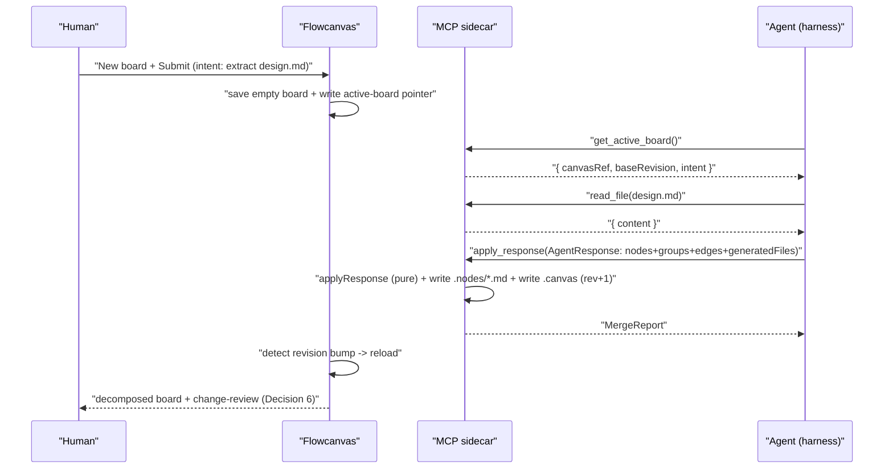
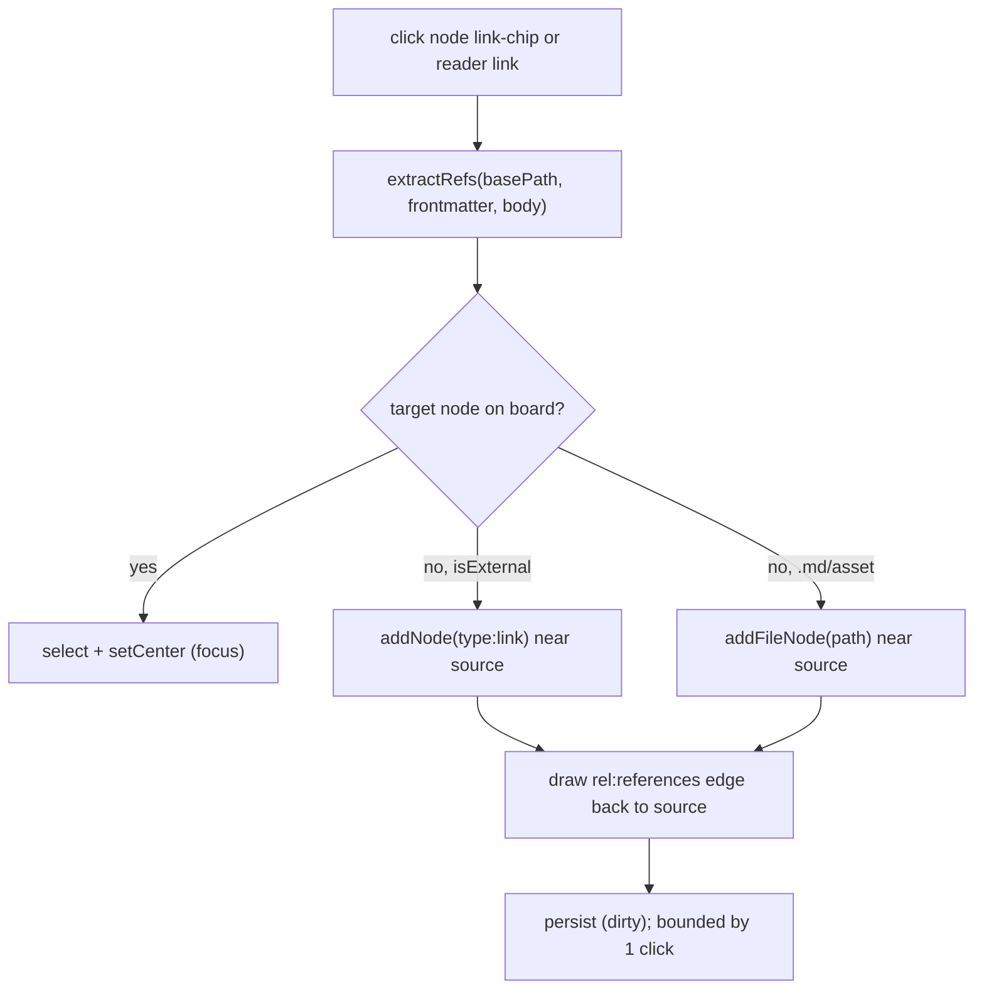

# 002-system-design-studio — Flowcanvas System Design Studio (v2) Design

- Promotes `.canvas` from a layout/edge/comment store into the **single system-of-record for the design graph** — typed/labeled relationships across all endpoint types, agent-creatable groups, plus the visual/session state it already owns.
- **Content stays in live `.md` files** so the board remains a true, git-diffable view over real flowcode artifacts; nothing forks into the canvas.
- **`links:` is demoted** from a co-truth (Phase-8 bidirectional write-back retired) to an extraction *input* + an export *projection*.
- **Import is agent-driven**: a documented canvas-schema + extraction spec lets any agent convert a flowcode design/plan doc into the initial `.canvas`; the source doc stays an accessible reference, not a forced node.
- **Native round-trip over MCP** (`get_board` / `apply_response` / file ops) + a thin Submit panel; no clipboard, no in-app LLM runtime, no external-service boundary crossed.
- **Agent change-review** diffs each round against the submit-time snapshot — every new/updated/removed node, edge, comment, and file, with round-level accept-or-discard.
- **Reference navigation** (≤1 action), a **template library**, and **bundle export** (portable folder/zip) all read and write the one canvas graph — no second source to reconcile.
- Scope — in: canvas-schema v2, extraction spec, agent-driven import, typed linking, reference navigation/hydration, templates, richer agent loop, MCP wire, change-review, `links:` demotion, bundle export, load-time reconcile. Out: in-app LLM chat, live file-watching, multi-level nesting (plus BL-003…BL-008).
- Key decisions: source-of-truth → canvas-authoritative (content in md); import → agent-driven extraction; agent transport → MCP-native + harness-relay.
- Status `draft`; author human (scope) + `flowcode:designer-agent` (technical depth); dated 2026-06-27. Sibling plan `002-system-design-studio-plan.md` created after this design is approved. Builds on plan 001 Phase 10 (multi-select + true groups, ELK, save/open-board).

---

## Problem Statement

Flowcanvas today is a markdown *viewer board*: it renders existing `.md` files as cards and derives edges only from `links:` frontmatter, which holds **file paths only**. It cannot serve as a system-design surface. There is no way to (a) turn the rich design documents flowcode produces into a visual architecture, (b) link *arbitrary* objects — other docs, images, external links, notes, reusable templates — to the design with **typed/labeled** relationships, or (c) run a true human↔agent round-trip where the agent reasons over the **full visual architecture** (nodes, edges, groups, comments, intent) and answers back **in the same board format** for visual review, comment, edit, and iteration.

Two structural gaps block this: the **relation model is split and file-only** (bare adjacency in md `links:`, semantics stranded on canvas edges, no home for non-file endpoints), and there is **no defined schema + extraction contract** for converting markdown design docs into a canvas or for an agent to author board-format output. The result also has **no portable, self-contained export** of an assembled design.

### Success Criteria

1. **Agent-driven import works end-to-end** — given a documented canvas schema + extraction spec, any agent converts a flowcode design/plan `.md` into an initial `.canvas`; importing it yields a coherent decomposed board (nodes, typed edges, groups) with relationships traceable to the source doc, which stays an accessible on-disk reference.
2. **Link any object, typed** — any node connects to any endpoint (md, image, external URL, note, template instance) with a typed/labeled relationship that persists across reload and survives the agent round-trip merge unchanged.
3. **Reference navigation in ≤1 action** — clicking a node's link chip or an inline reader link focuses the node if on-board, else adds it and draws the edge back to the source; follows frontmatter refs and body refs (links + image embeds); cheap (parse-time extraction), bounded by clicks.
4. **Template library** — a browsable library of reusable node / diagram / document templates; dragging one instantiates the scaffold on the board.
5. **Full-architecture agent round-trip** — the brief carries the complete visual architecture; the agent answers in the same schema and can upsert diagram elements, files, typed links, groups, and comments; the human reviews, comments, edits, and iterates over multiple rounds.
6. **Canvas-authoritative with safe reconcile** — on load the canvas is truth; when source md frontmatter/refs diverge on disk, a diff surfaces with an explicit "re-sync from disk" (never a silent overwrite).
7. **Portable bundle export** — export produces a self-contained folder/zip (FMS md + assets + resolved links + `.canvas`) that re-imports cleanly.
8. **Native agent wire (MCP)** — flowcanvas exposes board-read + apply-response + file ops over MCP so an MCP-capable harness operates the board natively (no clipboard); a thin Submit/prompt panel kicks off a round in-app.
9. **Agent change-review (diff)** — after a round, flowcanvas diffs the result against the submit-time snapshot and presents a navigable review of every new/updated/removed node, edge, comment, and generated file, with round-level accept-or-discard before commit.

## Scope

Builds on plan 001 **Phase 10** (multi-select + true group containers, ELK re-organize, save/open-board) as foundation — does not duplicate it.

**In scope:**

- **Canvas schema v2** — extend `.canvas` to be the authoritative graph: typed/labeled relationships on edges (relationship type + label) across all endpoint types; agent-creatable groups; relationship metadata.
- **Extraction/generation spec** — a documented contract (canvas schema + how to map a flowcode design doc → initial `.canvas`) handed to the agent as part of its contract.
- **Agent-driven import** — agent generates the initial `.canvas` from a design doc; import it; source doc stays an accessible reference (read/link/re-extract), not forced onto the board.
- **Typed linking model** — link any object (md, image, URL, note, template) to any node with a typed/labeled relationship; canvas-authoritative; persists across reload and the agent merge.
- **Reference navigation & hydration** — ↗ chip / inline reader link → focus-or-add + draw edge back; follows frontmatter refs and body refs (links + image embeds); parse-time extraction; bounded by clicks.
- **Template library** — reusable node / diagram / document templates; drag to instantiate; provenance tracked in the canvas.
- **Richer agent round-trip** — brief carries the full visual architecture (nodes, edges, groups, comments, intent); agent answers in the same schema; upserts diagram elements, files, typed links, groups, comments.
- **MCP wire + Submit panel** — MCP server (`get_board` / `apply_response` / file ops) + a thin Submit/prompt panel; harness-relay.
- **Agent change-review (diff)** — snapshot-diff review surface of every agent change, navigable, with round-level accept-or-discard before commit.
- **`links:` demotion** — retire the Phase-8 bidirectional write-back; `links:` becomes extraction input + export projection only.
- **Bundle export** — portable folder/zip (FMS md + assets + resolved links + `.canvas`); re-imports cleanly.
- **On-load reconcile** — canvas-truth; disk-divergence surfaces a diff with explicit re-sync (no silent overwrite).

**Out of scope:**

- In-app LLM chat / API-key runtime — chosen against for v2; possible later phase.
- Filesystem watchers / live external-edit sync — reconcile happens at load, not via live file-watching.
- Multi-level group nesting beyond Phase 10's single level.
- Parked in backlog (not v2): real-time multi-user collaboration / presence / CRDT (**BL-003**); auth / multi-tenancy / cloud hosting (**BL-004**); flowcode-agnostic import (**BL-005**); deterministic in-tool markdown→canvas parser (**BL-006**); rich import of arbitrary non-flowcode markdown (**BL-007**); per-change cherry-pick reject / branching history / full undo (**BL-008**).

## Solution Overview

**Make the canvas the single system-of-record for the *design*, keep content in live md, and turn the agent into the import engine.** v2 promotes `.canvas` from a layout/edge/comment store into the authoritative relation graph: typed/labeled relationships across all endpoint types (md, image, URL, note, template), agent-creatable groups, and the visual/session state it already owns. Document content stays in real `.md` files on disk so the board remains a true, git-diffable view over actual flowcode artifacts — nothing forks. `links:` is demoted from a co-truth (the Phase-8 bidirectional write-back is retired) to a one-way extraction *input* (a signal the agent reads when generating a board) and an export *projection* (materialized into the portable bundle so output stays flowcode-native). On load, the canvas is truth; when a source file's frontmatter/refs diverge on disk, the tool surfaces a diff with an explicit "re-sync from disk" rather than silently overwriting either side.

**The lifecycle is agent-driven and conversational, not parser-driven.** We define two artifacts: the canvas schema (extended `.canvas`) and an extraction/generation spec that becomes part of the agent contract — it tells any agent how to read a flowcode design/plan doc and emit an initial `.canvas` (decomposed into nodes, typed edges, and groups, with relationships traced back to the source). The human asks an agent to generate that board, imports it, and designs from there; the source doc stays an easily-accessible reference (read/link/re-extract), not a forced node. From then on the round-trip runs over **MCP** (`get_board` / `apply_response` / file ops) so a connected harness operates the board natively — no clipboard — kicked off by a thin **Submit** panel (intent + send). After each round, flowcanvas diffs the result against the submit-time snapshot and opens a change-review surface listing every new/updated/removed node, edge, comment, and generated file, with round-level **accept-or-discard** before commit. **Bundle export** produces a self-contained folder/zip (md + assets + resolved links + `.canvas`) that re-imports cleanly.

**On top of the authoritative graph sits the linking, navigation, and template layer.** Any object links to any node with a typed/labeled relationship that persists across reload and survives the agent merge. Reference navigation is ≤1 action: clicking a node's ↗ chip or an inline reader link focuses the target if on-board, else adds it and draws the edge back to the source — following both frontmatter refs and body refs (links + image embeds), extracted cheaply at parse time and bounded by clicks. A template library offers reusable node / diagram / document scaffolds the human drags onto the board, with provenance tracked in the canvas. All four facets (linking, hydration, templates, the richer agent loop) read and write the one canvas graph — no second source to reconcile. Why this wins over the alternatives below: a single authoritative relation graph removes the multi-store merge tax that every v2 capability would otherwise pay, while keeping content in live md preserves flowcanvas's reason to exist as a board over real artifacts, and MCP reuses the existing brief/response contract as a thin native transport.

## Alternatives Considered

High-level approach alternatives evaluated before this design was locked in. Per-component decisions live under Architecture Decisions.

| Approach | Why considered | Why rejected |
|----------|---------------|--------------|
| Defined split — md SoR for file↔file `links:`, canvas owns the rest | Preserves the proven Phase-8 reconcile loop; md stays self-describing with no export step | Rich relation graph stays split across two stores; every consumer (agent, hydration, export) must merge both; the parallel-surfaces cost grows as relation types multiply |
| Markdown owns ALL relations — typed `relations:` frontmatter + body-refs as edges | Maximally portable/self-describing; nothing to reconcile canvas-side | Can't represent non-file endpoints without inventing file identities; bloats frontmatter; body-ref-as-edge explodes the graph; largest divergence from working code |
| Content absorbed into `.canvas` — inline node bodies/frontmatter | One self-contained workspace file; trivial agent round-trip; perfect snapshotting | Forks board content from the repo's md; breaks flowcanvas's core job as a live view over real flowcode artifacts; harder to git-diff content |
| Deterministic in-tool markdown→canvas parser | Avoids an agent dependency for import; repeatable | Fragile and lossy; agent reasoning decomposes a design doc far better — parked as **BL-006** |
| In-app LLM chat with server-side API key | Fully self-contained chat-in-app UX | Crosses the project's "no external services / no auth" boundary; adds an LLM runtime + secret management — MCP-native + harness-relay chosen instead |

**Chosen:** the canvas-authoritative model in Solution Overview — content in live md, agent-driven extraction import, MCP-native round-trip.
**Key rationale:** one authoritative relation graph removes the multi-store merge tax every v2 capability would otherwise pay; content-in-md keeps the board a true view over repo artifacts; MCP reuses the existing brief/response contract as a thin transport without crossing the no-external-service boundary.

## Architecture Decisions

### Decision 1: Typed-relationship representation on `CanvasEdge`

Today `CanvasEdge` carries a free-form `label?` plus `meta?: { origin?: EdgeOrigin }` (`lib/canvas/jsoncanvas.ts:42-50`); relationship *semantics* live only as a display string and the JSONCanvas core fields stay drop-safe. v2 needs a machine-readable relationship *type* without breaking JSONCanvas portability or the `toReactFlow`/`toJSONCanvas` round-trip (`lib/canvas/adapter.ts:36-78`).

**Options considered:**

| Option | Pros | Cons |
|--------|------|------|
| A — New top-level `relationship` field on `CanvasEdge` | Reads cleanly; not buried in meta | Violates "`meta` = always-safe-to-drop" contract; a non-JSONCanvas top-level field breaks spec-clean export |
| B — Extend `meta` with `rel?: RelationshipType`, keep top-level `label?` | `meta` is the existing Flowcanvas extension namespace (drop-safe); zero JSONCanvas-core change; minimal adapter/merge churn; `label` stays the human display | Two fields to keep coherent (type + display label) |
| C — Encode type into the `label` string (`"depends-on: foo"`) | No schema change at all | Lossy and fragile to parse; can't separate semantic type from display text; defeats querying/styling/projection |

**Decision:** Option B — `meta: { origin?: EdgeOrigin; rel?: RelationshipType }`; `label?` stays the free-form display string (defaulting to the `rel`'s display name, still inline-editable via `relabelEdge`, `lib/canvas/store.ts:278-288`). **Non-file endpoints become first-class** by deleting the `fileOf(src) && fileOf(tgt)` branch in `onConnect` (`lib/canvas/store.ts:122-149`): every drawn edge — between *any* node pair (md, image, link, note, group) — mints one typed `user` edge and opens the inline label editor. Edges already key purely on node id in the adapter and merge, so no other endpoint-type plumbing is required.
**Rationale:** keeps the `.canvas` JSONCanvas-clean for export (Decision 10), preserves the proven adapter round-trip, and the file-only special-case it removes is exactly the bidirectional write-back retired in Decision 4.

### Decision 2: Extraction / generation spec format

The agent must convert a flowcode design/plan `.md` into an initial board. The decision is what wire format the agent emits and how nodes/edges/groups/provenance map.

**Options considered:**

| Option | Pros | Cons |
|--------|------|------|
| A — Agent emits a full `FlowcanvasDoc` (`.canvas` JSON) directly | Import = write file + open | Agent must hand-author `session`/`comments`/`schemaVersion` scaffolding; duplicates the response contract; brittle |
| B — Agent emits an `AgentResponse` against a fresh empty board, reusing `applyResponse` | Reuses the entire pure merge verbatim (`lib/canvas/brief.ts:210-320`); import is the same code path as a normal round; idempotent | `AgentNode` cannot yet create groups (`type: 'file'\|'link'\|'text'`, `lib/canvas/brief.ts:75-86`) — must be extended |
| C — A bespoke `ExtractionSpec` schema | Tailored to extraction | A third schema to version and maintain; rejected as parallel-surface bloat |

**Decision:** Option B, extended. The extraction spec is a documented section appended to `AGENT_CONTRACT` (`lib/canvas/brief.ts:129-135`) that maps a design doc onto the response: each major concept / `## Module Boundaries` row / component → a node; each subsystem cluster → a `group` node; each documented relationship/arrow → a typed edge (`rel` + `label`); every extracted node carries `meta.source = { path, anchor }` pointing back at the source doc + heading slug so **relationships trace to the source**. `AgentNode` gains `type:'group'`, `label?`, `shape?`, `parentId?`, `source?`; `AgentEdge` gains `rel?` (see Data Models). The source doc stays on disk as a referenceable node/file — never consumed or deleted.
**Rationale:** one merge path for both import and iteration; the agent already understands `AgentResponse`; provenance via `meta.source` is the cheapest way to make every node re-traceable and re-extractable.

### Decision 3: Where agent-extracted node content lives (resolves Open Question 1)

Locked: content stays in live `.md`, never inlined into `.canvas`. The remaining choice is the *granularity* of that content for decomposed nodes.

**Options considered:**

| Option | Pros | Cons |
|--------|------|------|
| A — Inline as `text` nodes (content in `.canvas`) | Self-contained workspace | **Rejected by the locked decision** — forks content from the repo; not git-diffable per node |
| B — One small generated `.md` per node, written via `generatedFiles` + `POST /api/file` | Content stays live + git-diffable; reuses `writeFileApi`/resolve/reader unchanged; round-trips through bundle export naturally; carries `source:` provenance | File proliferation; needs a directory convention |
| C — Pointer into the source doc (`FileNode.subpath` anchor, no new file) | Zero new files; single source | The resolve/reader pipeline renders whole files, not slices (`app/api/render/route.ts`, `app/api/canvas/resolve/route.ts:7-20`); many nodes on one file can't be edited independently |

**Decision:** Hybrid — **B is the default, C is an explicit mode, A is scratch-only.** The agent decomposes into small generated `.md` files (one per node) under a board-scoped directory `<board-dir>/<board-stem>.nodes/<slug>.md`, each with frontmatter `source: { path, anchor }`. When a node is purely a *view* of one source section, the agent may instead emit a `file` node pointing at the source with `subpath` (the heading slug) — a pointer, no new file. `text` notes remain for genuinely ephemeral scratch only. Bundle export (Decision 10) copies these real files, so the choice round-trips cleanly.
**Rationale:** honors content-in-md, keeps every node independently editable/diffable/readable through the existing pipeline, and avoids inventing a slice-renderer; pointers cover the "don't duplicate the source" case without a second store.

### Decision 4: `links:` demotion mechanics

Phase 8 made `links:` a co-truth: drawing/deleting a file↔file edge patched the source `.md` via `POST /api/canvas/links` + `patchLinks` (`lib/canvas/store.ts:122-162`, `lib/api.ts:83-93`, `app/api/canvas/links/route.ts`), and every load re-derived `links:` edges via `reconcileEdges(deriveLinkEdges(...))` (`lib/canvas/store.ts:94-100`, `lib/canvas/edges.ts:19-50`). v2 makes the canvas authoritative.

**Options considered:**

| Option | Pros | Cons |
|--------|------|------|
| A — Keep the bidirectional write-back (status quo) | Md stays self-describing; no export step | Co-truth merge tax on every consumer; `links:` is file-only so typed cross-endpoint edges can't live there; contradicts canvas-authoritative |
| B — Demote: canvas authoritative; `links:` read at extraction, projected at export | Removes the multi-store merge; one source for the graph; `links:` still emitted for flowcode-native output | One-time migration needed for boards that relied on live derivation |
| C — Remove `links:` support entirely | Simplest internally | Breaks compatibility with flowcode's own link graph; export can no longer speak `links:` |

**Decision:** Option B. Retire `POST /api/canvas/links`, drop `patchLinks` from `lib/api.ts`, and remove the `patchLinks` calls + the file↔file branch from `onConnect`/`removeEdgeWriteback` (`lib/canvas/store.ts:122-162`). `deriveLinkEdges` is repurposed, not deleted: it runs (1) **once** at v2 first-load migration to bake any previously-live-only `links:` edges into persisted edges, and (2) inside the export projection (Decision 10) to materialize canvas edges back into each md's `links:`. `load` stops calling `reconcileEdges` as a per-load co-truth step; `doc.edges` from disk is authoritative.
**Migration:** on first load of a `schemaVersion:'0.1'` board, run `deriveLinkEdges` over the resolved nodes, merge any not-yet-persisted derived edges into `doc.edges` as `origin:'links'`, bump to `schemaVersion:'0.2'`, and save — so no edge silently disappears for boards that never saved their derived set.
**Rationale:** the demotion is the structural move that makes every other v2 capability cheap; keeping `deriveLinkEdges` for migration + export preserves flowcode-native output without re-introducing the co-truth.

### Decision 5: MCP server runtime (resolves Open Question 5)

The round-trip must run over MCP with no in-app LLM runtime and no API keys. The choice is where the MCP server runs and how it binds to the active board.

**Options considered:**

| Option | Pros | Cons |
|--------|------|------|
| A — In-process MCP inside a Next.js route handler | Shares `FLOWCANVAS_ROOT`, `fs-guard`, `brief.ts` | Next route handlers are request/response; MCP needs a persistent stdio/SSE transport; binding to the client-only "active board" from a stateless server is awkward |
| B — Sidecar stdio MCP process (harness-spawned) over the existing HTTP API / shared `fs` | Clean lifecycle owned by the harness (harness-relay); reuses the guarded routes + the pure `brief.ts` merge; "active board" passed as `canvasRef`; no Next transport surgery | A second process to run; needs the board path + app base URL |
| C — Custom Node server alongside Next | Full transport control | Abandons Next's managed server; heavy; over-engineered |

**Decision:** Option B — a thin **sidecar** stdio MCP server (`mcp/flowcanvas-mcp.ts`, run by the harness) whose tools wrap the existing guarded surface and the pure `brief.ts`/`edges.ts`/`frontmatter.ts` modules. Tools: `get_board` (→ `DesignBrief` via `buildBrief`), `apply_response` (`AgentResponse` → `applyResponse` → write generated files + merged `.canvas`, returns `MergeReport`), `read_file`, `write_file`, `list_dir`, `resolve_paths`, and `get_active_board`. **Board binding:** on every `load`/`openBoard` the app writes a guarded pointer `.flowcanvas/active-board.json` = `{ canvasRef, baseRevision, intent }` under `FLOWCANVAS_ROOT`; `get_active_board` reads it so the harness operates on whatever board is open. `get_board`/`apply_response` read/write the persisted `.canvas` on disk, so the **Submit panel saves first** (disk == in-memory before a round). After `apply_response` bumps `session.revision`, the app reloads and opens change-review (Decision 6).
**Rationale:** reuses the entire pure contract as the transport payload with zero new schema; the harness already is the MCP client (no in-app LLM, no keys, no external boundary); disk-as-truth + save-before-submit sidesteps the stateless-server-vs-live-state problem.

### Decision 6: Agent change-review / diff (resolves Open Question 6)

After a round the human must review every change and accept or discard the whole round (per-change cherry-pick is BL-008, out of scope).

**Options considered:**

| Option | Pros | Cons |
|--------|------|------|
| A — Trust `MergeReport` counts only | Already produced (`lib/canvas/brief.ts:115-122`) | Counts aren't navigable; can't step element-by-element |
| B — Structural diff of submit-time snapshot vs merged doc, attributed via `meta.origin:'agent'` + the revision window | Navigable + precise; survives reload; reuses existing origin stamping | Must persist the snapshot across reload/restart |
| C — Per-change event log | Maximally granular | Heavy; trends toward BL-008 (cherry-pick/history) — out of scope |

**Decision:** Option B. At **Submit**, capture the board exactly as saved (`baseRevision = session.revision`) into a sibling guarded file `<board-stem>.review.json` = `ReviewState { baseRevision, briefId, capturedAt, snapshot, roundGeneratedFiles }` via a new `POST /api/canvas/review`. After `apply_response` bumps the revision, the app reloads, reads the review state (`GET /api/canvas/review`), and computes `ReviewDiff` = structural diff(`snapshot`, `currentDoc`) keyed by id (added / updated / removed for nodes + edges, added for comments) cross-checked against `meta.origin:'agent'`. The review surface steps through each entry. **Round-level outcome:**
- **Accept** → `DELETE /api/canvas/review`, keep the doc, clear `session.pendingReview`, save.
- **Discard** → restore the doc from `snapshot` (POST it back via `/api/canvas`, revision N+2), delete exactly the files in `roundGeneratedFiles` from disk, then `DELETE /api/canvas/review`.
**Rationale:** a snapshot+structural-diff is the smallest mechanism that is navigable, reload-durable, and reversible; tracking `roundGeneratedFiles` makes "discard the round" cleanly roll back disk side-effects without an inverse-merge.

### Decision 7: Typed-relationship vocabulary (resolves Open Question 3)

How the relationship type space is constrained and communicated to the agent.

**Options considered:**

| Option | Pros | Cons |
|--------|------|------|
| A — Fixed enum only | Machine-clean; consistent styling/export | Too rigid for genuine design nuance; users hit the wall |
| B — Free-form labels only | Maximally expressive | No machine semantics; can't style/query/project reliably; the status-quo `label` already does this |
| C — Small curated enum (`rel`) + free-form `label` | Machine-usable type for styling/export + human expressivity; the agent gets an explicit allowed set | Two coupled fields (mitigated: `label` defaults from `rel`) |

**Decision:** Option C. `meta.rel: RelationshipType` from a curated catalog (`references`, `depends-on`, `implements`, `derives-from`, `calls`, `produces`, `informs`, `related`); `label` is the editable display string defaulting to the type's display name. `contains` is **not** an edge type — containment is group membership (`parentId`). The legacy `origin:'links'` edges map to `rel:'references'`. A manually-drawn edge defaults to `rel:'related'` with an empty label (preserving today's inline-editor flow). The allowed set ships inline in the extended `AGENT_CONTRACT` so the agent never invents types.
**Rationale:** the enum gives every downstream consumer (edge styling, future querying, export projection) a stable key, while the free-form label keeps the board human-readable; defaulting the label from the type keeps authoring one click.

### Decision 8: Template storage model (resolves Open Question 2)

A template must scaffold reusable structure — often a multi-node, multi-edge sub-graph — onto the board.

**Options considered:**

| Option | Pros | Cons |
|--------|------|------|
| A — One `.md` per template | Reuses file node + resolve | Can't express a multi-node + edge diagram scaffold; a template is usually a sub-graph |
| B — `.canvas` fragments (sub-graph JSON: nodes + edges, relative coords, no session) | A template *is* a board fragment; instantiate = clone with fresh ids at the drop point; reuses adapter + types; naturally multi-node | Needs a small fragment schema (trimmed doc) |
| C — Bespoke JSON template definitions | Tailored | A third schema; rejected as parallel-surface bloat |

**Decision:** Option B. Templates live as `.canvas` fragments under a `templates/` directory (root-relative; `flowcanvas/templates/*.canvas` for shipped, plus any under `FLOWCANVAS_ROOT/templates/`). A template = `CanvasTemplate { id, kind, name, description?, nodes, edges, files? }` with coords relative to the fragment top-left. Instantiation clones nodes/edges with fresh `n-*` ids, offsets to the drop point, stamps `meta.origin:'user'` + `meta.template:<id>` provenance, and — for `kind:'document'` — writes its `files` md scaffolds via `writeFileApi`. `TemplateKind = 'node' | 'diagram' | 'document'`. Listing/reading is served by a new `GET /api/templates`.
**Rationale:** a template and a board are the same shape, so cloning is trivial and reuses the existing types/adapter; `meta.template` gives provenance with one field; document templates fold into the same generated-file path as Decision 3.

### Decision 9: Reference navigation / hydration

Clicking a node's ↗ chip or an inline reader link must focus the target on-board or add it and draw the edge — following frontmatter refs **and** body refs (`[..](x.md)`, ``), cheaply.

**Options considered:**

| Option | Pros | Cons |
|--------|------|------|
| A — Reuse `deriveLinkEdges` (frontmatter `links:` only) | Already exists | Misses body links + image embeds; tied to the demoted derivation |
| B — A pure `extractRefs(basePath, frontmatter, body)` returning typed refs, + a `navigateRef` store action (focus-or-add + edge) | Covers frontmatter + body + images; parse-time over the already-resolved body; bounded by clicks; decoupled from `links:` demotion | New pure module + a click handler on reader prose |
| C — Server-side ref index | Centralized | Overkill; needs a build/index step; the body is already in memory |

**Decision:** Option B. New pure `lib/canvas/refs.ts` `extractRefs` (regex over the resolved body for `[text](rel.md)` and `` plus frontmatter `links:`), returning `DocRef[]`. The FrontmatterView ↗ chips (today static spans, `components/canvas/frontmatter-view.tsx:96-105`) become buttons that call a store `navigateRef(sourceNodeId, ref)`; the reader prose (`dangerouslySetInnerHTML`, `components/canvas/reader-drawer.tsx:88`) gets a delegated click handler intercepting `a[href]` to relative `.md`/asset targets. `navigateRef`: if a node with that path/url exists → select + `setCenter`; else `addFileNode`/`addNode` at an empty slot near the source + draw a `rel:'references'` edge back to the source.
**Rationale:** parse-time extraction over the in-memory body is the cheapest path, covers every ref kind in scope, and reuses `addFileNode` (`lib/canvas/store.ts:318-327`) + the adapter for hydration; decoupling from `deriveLinkEdges` keeps it alive after the `links:` demotion.

### Decision 10: Bundle export format + load-time reconcile UX (resolves Open Question 4)

Export must produce a portable, self-contained, re-importable bundle; load must treat the canvas as truth while surfacing disk divergence.

**Options considered (bundle):**

| Option | Pros | Cons |
|--------|------|------|
| A — Single fat JSON inlining all content | One file | Forks content; not git-diffable; violates content-in-md |
| B — Folder/zip: `.canvas` + referenced md (with `links:` projected from canvas edges) + assets, paths rebased, + a manifest | Self-contained yet stays flowcode-native md; re-imports by unzip + open | Needs a zip route + path rebasing |
| C — git bundle / patch | VCS-native | Requires git in the loop; out of scope |

**Decision (bundle):** Option B — `GET /api/canvas/bundle?path=` streams a zip containing the `.canvas`, every referenced `.md` (rewritten with `links:` **projected** from the authoritative canvas edges via `deriveLinkEdges`'s inverse — the export-projection half of Decision 4), every referenced image asset, all under a portable root, plus `bundle-manifest.json` mapping original→bundled paths. Re-import = unzip into `FLOWCANVAS_ROOT` + open the `.canvas`.

**Decision (reconcile, per-file granularity):** On `load`, after re-resolving frontmatter/body, compare each file's disk-derived refs/frontmatter against the canvas; if a file diverged, raise a **non-blocking** "disk diverged" banner listing each diverged file with a per-file diff and two explicit actions: **re-sync from disk** (re-derive *that file's* `links:` edges + refresh its `meta.frontmatter` cache, leaving user/agent edges and all other files untouched) or **keep canvas**. Never a silent overwrite; granularity is per-file, not per-field.
**Rationale:** the bundle stays flowcode-native (live md + projected `links:`) so it re-imports into any flowcanvas; per-file reconcile is the simplest granularity that respects canvas-authority while giving the human an explicit, scoped re-sync.

---

## Technical Design

### Data Models

All additions extend the real types in `lib/canvas/jsoncanvas.ts` and `lib/canvas/brief.ts`. v2 boards persist `schemaVersion:'0.2'`; every new field is optional so a `0.1` doc still parses.

```ts
// ── lib/canvas/jsoncanvas.ts — v2 additions ──────────────────────────────

// Decision 7 — curated relationship catalog. `contains` is NOT here: containment
// is group membership (parentId). Free-form display still lives in CanvasEdge.label.
export type RelationshipType =
  | 'references' | 'depends-on' | 'implements' | 'derives-from'
  | 'calls' | 'produces' | 'informs' | 'related'

// Decision 4 — 'links' stays for legacy/migrated edges; 'import' marks extraction-seeded.
export type EdgeOrigin = 'links' | 'user' | 'agent' | 'import'

// Decision 2 — provenance back to the source design/plan doc a node was extracted from.
export interface NodeSource {
  path: string            // root-relative source doc
  anchor?: string         // heading slug within the source, e.g. 'module-boundaries'
}

export interface NodeMeta {
  origin?: NodeOrigin
  collapsed?: boolean
  shape?: NodeShape
  frontmatter?: Record<string, unknown>   // CACHE ONLY — disk is truth (unchanged)
  source?: NodeSource                      // v2 (Decision 2)
  template?: string                        // v2: template id this node came from (Decision 8)
}

export interface CanvasEdge {
  id: string
  fromNode: string; toNode: string
  fromSide?: Side; toSide?: Side
  fromEnd?: EdgeEnd; toEnd?: EdgeEnd
  color?: CanvasColor
  label?: string                                          // free-form display (unchanged)
  meta?: { origin?: EdgeOrigin; rel?: RelationshipType }  // v2: + rel (Decision 1)
}

export interface SessionMeta {
  title?: string
  intent?: string
  createdAt: string
  updatedAt: string
  revision: number
  lastBriefId?: string
  baseRevision?: number     // v2: session.revision captured at Submit (review window start)
  pendingReview?: boolean   // v2: an agent round landed; open change-review on next load
}

export interface FlowcanvasExt {
  schemaVersion: '0.1' | '0.2'   // v2 boards persist '0.2'
  session: SessionMeta
  comments: Comment[]
}
```

```ts
// ── lib/canvas/review.ts — Decision 6 (agent change-review) ───────────────

import type { FlowcanvasDoc } from './jsoncanvas'

/** Persisted to the sibling file <board-stem>.review.json at Submit; deleted on accept/discard. */
export interface ReviewState {
  baseRevision: number
  briefId: string
  capturedAt: string          // ISO 8601
  snapshot: FlowcanvasDoc     // the board exactly as saved at Submit
  roundGeneratedFiles: string[]   // files the round wrote — deleted on discard
}

/** Navigable structural diff(snapshot, currentDoc), keyed by id, attributed via meta.origin. */
export interface ReviewDiff {
  nodes: { added: string[]; updated: string[]; removed: string[] }
  edges: { added: string[]; updated: string[]; removed: string[] }
  comments: { added: string[] }
  files: string[]             // == roundGeneratedFiles
}

export function diffDocs(snapshot: FlowcanvasDoc, current: FlowcanvasDoc): ReviewDiff
```

```ts
// ── lib/canvas/templates.ts — Decision 8 (template library) ───────────────

import type { CanvasNode, CanvasEdge } from './jsoncanvas'
import type { GeneratedFile } from './brief'

export type TemplateKind = 'node' | 'diagram' | 'document'

export interface CanvasTemplate {
  id: string                  // 'tpl-<slug>'
  kind: TemplateKind
  name: string
  description?: string
  nodes: CanvasNode[]         // coords RELATIVE to the fragment top-left (0,0)
  edges: CanvasEdge[]
  files?: GeneratedFile[]     // kind:'document' — md scaffolds written on instantiate
}

/** Clone a template at (dropX, dropY): fresh n-* ids, rebased coords, meta.template stamped. */
export function instantiateTemplate(
  t: CanvasTemplate, dropX: number, dropY: number, mint: (p: string) => string,
): { nodes: CanvasNode[]; edges: CanvasEdge[]; files: GeneratedFile[] }
```

```ts
// ── lib/canvas/refs.ts — Decision 9 (reference navigation) ────────────────

export type RefKind = 'frontmatter' | 'link' | 'image'

export interface DocRef {
  kind: RefKind
  target: string        // root-relative path OR absolute URL
  anchor?: string       // heading slug after '#', when present
  isExternal: boolean   // true for http(s) URLs
}

/** Pure: frontmatter links: + body [text](x.md) + . No fs, no DOM. */
export function extractRefs(
  basePath: string,
  frontmatter: Record<string, unknown> | undefined,
  body: string | undefined,
): DocRef[]
```

```ts
// ── lib/canvas/brief.ts — v2 contract additions (Decision 2) ──────────────

export interface BriefNode {
  id: string
  kind: NodeKind
  position: { x: number; y: number; width: number; height: number }
  path?: string; url?: string; text?: string
  frontmatter?: Record<string, unknown>; body?: string; truncated?: boolean
  parentId?: string          // v2: group membership the agent should see
  label?: string             // v2: group label
  source?: NodeSource        // v2: extraction provenance
  refs?: DocRef[]            // v2: parsed frontmatter+body refs (Decision 9)
}

export interface BriefEdge {
  id: string; from: string; to: string
  label?: string
  rel?: RelationshipType     // v2: typed relationship (Decision 1)
  origin: EdgeOrigin
}

export interface AgentNode {
  id?: string
  type: 'file' | 'link' | 'text' | 'group'   // v2: + 'group' (agent-creatable)
  x: number; y: number; width: number; height: number
  file?: string; url?: string; text?: string
  label?: string             // v2: group label
  shape?: NodeShape          // v2: group shape
  parentId?: string          // v2: group membership
  color?: CanvasColor
  source?: NodeSource        // v2: extraction provenance
}

export interface AgentEdge {
  id?: string
  fromNode: string; toNode: string
  fromSide?: Side; toSide?: Side
  label?: string
  rel?: RelationshipType     // v2: typed relationship
}

// AgentResponse, GeneratedFile, AgentComment, MergeReport unchanged (lib/canvas/brief.ts:71-122).
// applyResponse extends nodeFromAgent to carry label/shape/parentId/source for type:'group'.
```

### Enums & Constants

```ts
// Decision 7 — RelationshipType catalog (the agent's allowed set, shipped inline in AGENT_CONTRACT).
RELATIONSHIP_TYPES = [
  'references',    // generic structural reference (legacy origin:'links' maps here)
  'depends-on',    // A requires B to function
  'implements',    // A is a concrete realization of B
  'derives-from',  // A was extracted/generated from B (pairs with meta.source)
  'calls',         // A invokes B at runtime
  'produces',      // A emits/creates B (artifact, event, file)
  'informs',       // A is context/input for B (non-blocking)
  'related',       // default for a manually-drawn edge; empty label, inline editor
]

// Decision 8 — TemplateKind
TEMPLATE_KINDS = ['node', 'diagram', 'document']

// Decision 4 — EdgeOrigin (extended)
EDGE_ORIGINS = ['links', 'user', 'agent', 'import']

// Schema version
SCHEMA_VERSIONS = ['0.1', '0.2']   // v2 persists '0.2'

// Decision 5 — MCP tool names (sidecar)
MCP_TOOLS = [
  'get_board',        // -> DesignBrief (buildBrief over the active/given .canvas)
  'apply_response',   // AgentResponse -> MergeReport (applyResponse + writes)
  'read_file',        // path -> { content }
  'write_file',       // { path, content } -> { ok }  (.md/.mdx only, guarded)
  'list_dir',         // path -> DirEntry[]
  'resolve_paths',    // paths -> ResolvedFile[]
  'get_active_board', // -> { canvasRef, baseRevision, intent }
]

// Decision 6 — review-state sibling file + active-board pointer + bundle paths
REVIEW_FILE_SUFFIX   = '.review.json'              // <board-stem>.review.json
ACTIVE_BOARD_POINTER = '.flowcanvas/active-board.json'
NODE_CONTENT_DIR     = '<board-stem>.nodes'        // Decision 3: one md per extracted node
TEMPLATES_DIR        = 'templates'                 // Decision 8: *.canvas fragments
BUNDLE_MANIFEST      = 'bundle-manifest.json'      // Decision 10
```

Existing constants unchanged and reused: `IMAGE_EXT` (`lib/canvas/jsoncanvas.ts:95`), `BODY_CAP = 40_000` (`lib/canvas/frontmatter.ts:3`), `PRESET` color map (`lib/canvas/adapter.ts:6`), edge-id pattern `lk:<from>-><to>` (`lib/canvas/edges.ts:31`), `ag-`/`e-`/`n-` id prefixes (`lib/canvas/store.ts:60-64`, `lib/canvas/brief.ts:133`).

### API / Interface Contracts

**HTTP routes — new and changed.** All follow the existing pattern: `guardPath` first, map `GuardError`→400, `ENOENT`→404, else→500 (`app/api/canvas/route.ts:9-36`).

| Route | Method | Purpose |
|-------|--------|---------|
| `/api/canvas/review` | GET / POST / DELETE | read / write / clear `<board-stem>.review.json` (Decision 6) |
| `/api/canvas/bundle` | GET | stream a portable zip bundle (Decision 10) |
| `/api/templates` | GET | list + read `.canvas` template fragments (Decision 8) |
| `/api/canvas/active` | GET / POST | read / write the active-board pointer (Decision 5) |
| `/api/canvas/links` | — | **removed** — Phase-8 `links:` write-back retired (Decision 4) |

```ts
// ── New HTTP contracts (request -> response) ──────────────────────────────

// POST /api/canvas/review  — capture the submit-time snapshot
//   req:  { path: string; review: ReviewState }
//   res:  { ok: true }
// GET  /api/canvas/review?path=<board>  — read it back after the agent round
//   res:  { review: ReviewState | null }
// DELETE /api/canvas/review?path=<board>  — accept (drop snapshot)
//   res:  { ok: true }

// GET /api/canvas/bundle?path=<board>  — Content-Type: application/zip
//   body: zip { <board>.canvas, **/*.md (links: projected), assets/**, bundle-manifest.json }

// GET /api/templates            — res: { templates: CanvasTemplate[] }  (metadata + fragments)
// GET /api/templates?id=<id>    — res: { template: CanvasTemplate }

// GET  /api/canvas/active       — res: { canvasRef: string; baseRevision: number; intent: string } | { active: null }
// POST /api/canvas/active       — req: { canvasRef; baseRevision; intent }  res: { ok: true }
```

```ts
// ── MCP sidecar tool signatures — mcp/flowcanvas-mcp.ts (Decision 5) ──────
// Each reuses brief.ts / the guarded routes; no new schema.

get_board(input: { canvasRef?: string })           // default: active-board pointer
  -> DesignBrief                                     // == buildBrief output

apply_response(input: { canvasRef?: string; response: AgentResponse })
  -> MergeReport                                     // writes generatedFiles + merged .canvas

read_file(input: { path: string })      -> { content: string }
write_file(input: { path: string; content: string }) -> { ok: true }   // .md/.mdx only
list_dir(input: { path?: string })      -> DirEntry[]
resolve_paths(input: { paths: string[] }) -> ResolvedFile[]
get_active_board()                       -> { canvasRef: string; baseRevision: number; intent: string }
```

```ts
// ── Store actions — lib/canvas/store.ts (additions / changes) ─────────────
submitToAgent(intent: string): Promise<void>   // save -> POST /api/canvas/review (snapshot)
                                               //      -> POST /api/canvas/active -> relay note
reviewDiff(): ReviewDiff | null                // diffDocs(snapshot, doc) when pendingReview
acceptRound(): Promise<void>                   // DELETE review, clear pendingReview, save
discardRound(): Promise<void>                  // restore snapshot, delete roundGeneratedFiles, save
navigateRef(sourceNodeId: string, ref: DocRef): Promise<void>   // focus-or-add + edge (Decision 9)
addTemplate(t: CanvasTemplate, x: number, y: number): Promise<void>  // instantiate (Decision 8)
resyncFile(path: string): void                 // re-derive one file's edges + refresh frontmatter (Decision 10)
// CHANGED — onConnect: drop the file↔file patchLinks branch; every pair -> typed user edge (Decision 1)
// REMOVED — patchLinks usage in onConnect / removeEdgeWriteback (Decision 4)
```

```text
// ── Extended AGENT_CONTRACT (appended to lib/canvas/brief.ts:129-135) ─────
EXTRACTION (design doc -> initial board):
- Map each major concept / Module-Boundaries row / component to one node; each subsystem
  cluster to a group node (type:"group", give it a label + optional shape, set members'
  parentId to it). Map each documented relationship/arrow to a typed edge.
- Decompose node content into small generated .md files (one per node) under
  "<board-stem>.nodes/<slug>.md", each with frontmatter source: { path, anchor } pointing
  back at the design doc + heading slug. For a pure view of one section, instead emit a
  type:"file" node with subpath:"<anchor>" (no new file). Use type:"text" only for scratch.
- Never inline document prose into the .canvas; never delete or rewrite the source doc.
TYPED EDGES:
- Set meta via the edge: choose rel from [references, depends-on, implements, derives-from,
  calls, produces, informs, related]. Set label to a short human display (defaults to rel).
  Do NOT invent rel values. Use containment (parentId) for "contains", not an edge.
GROUPS:
- type:"group" carries label, optional shape (rectangle|ellipse|diamond); children set parentId.
```

### Sequence / Flow Diagrams

Agent-driven extraction import (Decision 2):



MCP round-trip with change-review (Decisions 5 + 6):

```mermaid
sequenceDiagram
  participant H as "Human"
  participant App as "Flowcanvas"
  participant API as "Route handlers"
  participant MCP as "MCP sidecar"
  participant Ag as "Agent"
  H->>App: "Submit (intent + send)"
  App->>API: "POST /api/canvas (save, rev=N)"
  App->>API: "POST /api/canvas/review (snapshot @ N)"
  App->>API: "POST /api/canvas/active (canvasRef, N, intent)"
  Ag->>MCP: "get_board(canvasRef)"
  MCP-->>Ag: "DesignBrief"
  Ag->>MCP: "apply_response(canvasRef, AgentResponse)"
  MCP->>API: "writes generated files + merged .canvas (rev=N+1)"
  MCP-->>Ag: "MergeReport"
  App->>API: "GET /api/canvas (rev N+1) + GET /api/canvas/review"
  App->>App: "diffDocs(snapshot, doc) -> ReviewDiff; step through"
  alt "Accept"
    H->>App: "Accept round"
    App->>API: "DELETE /api/canvas/review + save (clear pendingReview)"
  else "Discard"
    H->>App: "Discard round"
    App->>API: "POST /api/canvas (restore snapshot, rev=N+2) + delete roundGeneratedFiles + DELETE review"
  end
```

Reference-navigation hydration (Decision 9):



### Module Boundaries

| Module | Responsibility | Changes Required |
|--------|---------------|-----------------|
| `lib/canvas/jsoncanvas.ts` | Core types | Add `RelationshipType`, `NodeSource`; extend `EdgeOrigin`, `NodeMeta` (`source`, `template`), `CanvasEdge.meta.rel`, `SessionMeta` (`baseRevision`, `pendingReview`), `schemaVersion:'0.2'` |
| `lib/canvas/brief.ts` | Brief + merge contract | Extend `BriefNode`/`BriefEdge`/`AgentNode`/`AgentEdge` (group, rel, source, refs); teach `nodeFromAgent` group fields; append extraction + typed-edge rules to `AGENT_CONTRACT` |
| `lib/canvas/edges.ts` | `links:` derivation | Keep `deriveLinkEdges` for one-time migration + export projection only; stop per-load co-truth use |
| `lib/canvas/review.ts` | NEW — change-review | `ReviewState`, `ReviewDiff`, pure `diffDocs(snapshot, current)` |
| `lib/canvas/templates.ts` | NEW — templates | `CanvasTemplate`, `TemplateKind`, pure `instantiateTemplate` |
| `lib/canvas/refs.ts` | NEW — references | `DocRef`, pure `extractRefs` |
| `lib/canvas/store.ts` | Zustand actions | Drop `patchLinks`/file↔file branch in `onConnect`+`removeEdgeWriteback`; stop per-load `reconcileEdges`; add `submitToAgent`, `reviewDiff`, `acceptRound`, `discardRound`, `navigateRef`, `addTemplate`, `resyncFile`; migration on `0.1` load |
| `lib/canvas/adapter.ts` | RF translation | Carry `meta.rel` onto `RFEdge.data` for typed-edge styling; otherwise unchanged |
| `lib/api.ts` | Fetch wrappers | Remove `patchLinks`; add `getReview`/`putReview`/`clearReview`, `getBundle`, `listTemplates`, `getActive`/`putActive` |
| `app/api/canvas/links/route.ts` | `links:` patch | **Delete** (Decision 4) |
| `app/api/canvas/review/route.ts` | NEW | GET/POST/DELETE review state |
| `app/api/canvas/bundle/route.ts` | NEW | GET zip bundle |
| `app/api/templates/route.ts` | NEW | GET template list/fragment |
| `app/api/canvas/active/route.ts` | NEW | GET/POST active-board pointer |
| `mcp/flowcanvas-mcp.ts` | NEW — MCP sidecar | 7 tools over `brief.ts` + guarded routes (Decision 5) |
| `components/canvas/export-panel.tsx` | Agent panel | Add a Submit tab (intent + send) + the change-review surface; keep Export/Import for the no-MCP fallback |
| `components/canvas/frontmatter-view.tsx` | Frontmatter chips | Make ↗ link chips clickable → `navigateRef` |
| `components/canvas/reader-drawer.tsx` | Reader | Delegated click handler on prose links → `navigateRef` |
| `components/canvas/edges/labeled-edge.tsx` | Edge label | Render `rel` affordance: typed pill + a rel picker on the inline editor |
| `components/canvas/canvas-toolbar.tsx` | Toolbar | Add Submit trigger + Template-tray trigger + Bundle-export entry in the File menu |
| `components/canvas/template-tray.tsx` | NEW | Browsable template library; drag-to-instantiate (`addTemplate`) |
| `components/canvas/review-panel.tsx` | NEW | Step through `ReviewDiff`; round-level accept/discard |

---

## Constraints & Risks

| Constraint / Risk | Impact | Mitigation |
|-------------------|--------|-----------|
| Load-time reconcile / drift — disk md edited outside the tool diverges from the canvas | Stale frontmatter cache or missing edges; silent overwrite would lose work either way | Canvas-authoritative load + non-blocking per-file "disk diverged" banner with explicit "re-sync from disk" vs "keep canvas" (Decision 10); never auto-overwrite |
| Agent-extraction lossiness — agent decomposition misses or misclassifies concepts/relationships | An import that under/over-represents the source design | `meta.source` provenance keeps every node re-traceable; change-review (Decision 6) gates every import before commit; re-extract is one Submit; deterministic parser parked as BL-006 |
| MCP transport / runtime — sidecar must bind to the right board + see committed state | Agent operates on the wrong/stale board; lost edits | Save-before-submit so disk == in-memory; `active-board.json` pointer + `canvasRef` arg (Decision 5); `baseRevision`/`briefId` concurrency check surfaces a stale round in the report |
| `links:` demotion migration — boards relied on live-derived `links:` edges never persisted | Edges vanish on first v2 load | One-time `deriveLinkEdges` bake on `schemaVersion:'0.1'` load → persist as `origin:'links'` → bump to `0.2` + save (Decision 4); no edge dropped silently |
| Review snapshot durability + size — snapshot must survive reload/restart and not bloat the `.canvas` | Lost review state; doc bloat / recursion if nested in the doc | Store snapshot in a sibling `<board-stem>.review.json`, not inside `flowcanvas.review` (Decision 6); delete on accept/discard |
| Node-file proliferation — one md per extracted node under `<board-stem>.nodes/` | Many small files; directory clutter | Board-scoped subdirectory keeps them grouped + git-diffable; pointer mode (`subpath`) avoids new files for pure views; bundle export keeps them together (Decision 3) |
| Bundle path rebasing — referenced files may live outside `FLOWCANVAS_ROOT` or collide on rebase | Broken bundle that won't re-import | `guardPath` every entry; `bundle-manifest.json` records original→bundled mapping; skip + report out-of-root refs rather than fail the whole zip (Decision 10) |

## Research References

No research is cached yet (`researches-index.md` is empty). The MCP wire (Decision 5) is the one area with non-inferable external behavior — gather before that phase.

| Topic | File | Key Finding |
|-------|------|-------------|
| MCP TypeScript SDK — stdio server, tool registration, types | `.flowcode/researches/mcp-typescript-sdk-research.md` | recommended before the MCP phase — not yet gathered |
| Next.js 16 Node-runtime + a sidecar process reaching the guarded routes | `.flowcode/researches/nextjs-node-runtime-mcp-sidecar-research.md` | recommended before the MCP phase — not yet gathered |
| Zip streaming in a Node route handler (bundle export, no heavy dep) | `.flowcode/researches/node-zip-streaming-research.md` | recommended before the bundle-export phase — not yet gathered |

## Open Questions

- [ ] Where does agent-extracted/decomposed node content live — inline canvas text, small generated md files (one per node), or pointers into the source doc — and how does that choice round-trip through bundle export?
- [ ] Template storage model — md files, `.canvas` fragments (sub-graphs), or JSON definitions — and where templates live in the tree.
- [ ] Typed-relationship vocabulary — fixed enum, free-form labels, or a small enum plus free-form label; how the agent is told the allowed set.
- [ ] Load-time reconcile UX granularity when disk frontmatter/refs diverge — per-file vs per-field diff, and what "re-sync from disk" replaces vs merges.
- [ ] MCP server runtime — in-process with the Next.js app vs a sidecar process — and how it authenticates/binds to the active board.
- [ ] Change-review "discard the round" mechanics — restore from the submit-time snapshot vs inverse-merge — and how generated files on disk are rolled back.
