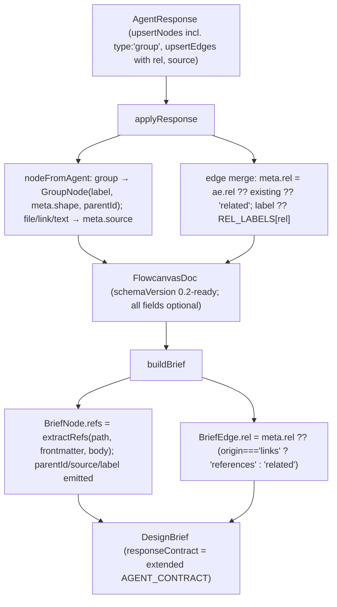

# 002-system-design-studio — Flowcanvas System Design Studio (v2) Implementation Plan

- Turns `.canvas` into the authoritative, typed relation graph (content stays in live md): schema v2, agent-driven extraction import, typed linking, reference navigation, templates, MCP round-trip, snapshot-diff change-review, bundle export, and the studio UI shell.
- Phases: 6 — Schema v2 & Agent Contract Foundation, Pure Library Layer, HTTP API & Fetch Wrappers, Store Integration & Canvas-Authoritative Load, MCP Sidecar & Native Round-Trip, Studio UI Surfaces & Tri-Pane Shell.
- Status active; dated 2026-06-27.
- Upstream design: `002-system-design-studio-design.md` (approved) + `002-system-design-studio-ui-design.md` (approved — selected `05-studio-canvas.html`).
- The active phase (Phase 1) is junior-executable: production-ready snippets, a worked example, a flow diagram, and named quality checks — per `plan-instructions.md § Active-Phase Completeness Bar`.
- Parallelism: Phases 4 and 5 are file-disjoint and form one wave; every phase enumerates parallel slices (disjoint file sets) for `flowcode:implementer-agent` fan-out, with shared/wiring files integrated by the main session.
- Execution history lives in `002-system-design-studio-log.md` (one entry per phase end + plan end) — not inlined here.

---

## Objective

Promote `.canvas` from a layout/edge/comment store into the single system-of-record for the design graph — typed/labeled relationships across all endpoint types, agent-creatable groups, agent-driven extraction import over MCP, reference navigation, a template library, snapshot-diff change-review, portable bundle export, and load-time disk reconcile — while content stays in live, git-diffable `.md` files.

---

## Phases Catalog

`Depends On` lists the earlier phases that must be `done` first (`[none]` = a root phase). It is the single signal the executor uses to derive parallel waves — phases whose dependencies are all `done` and whose `Files to create / modify:` tables are path-disjoint may run concurrently (`plan-instructions.md § Phase Dependencies & Waves`). **Wave shape:** `{1} → {2} → {3} → {4, 5} → {6}` — Phases 4 (store/adapter) and 5 (mcp/) are dependency-independent and file-disjoint, so they run as one concurrent wave.

| Phase | Name | Depends On | Summary |
|-------|------|------------|---------|
| 1 | Schema v2 & Agent Contract Foundation | [none] | Extend the JSONCanvas types + the brief/merge contract + refs module + the agent contract — the type/contract layer everything imports |
| 2 | Pure Library Layer | [Phase 1] | New pure modules `review.ts`, `templates.ts` + repurpose `edges.ts` (migration + export projection) — three disjoint slices |
| 3 | HTTP API & Fetch Wrappers | [Phase 2] | Four new guarded routes (review / bundle / templates / active) + delete the `links:` route + extend `lib/api.ts` |
| 4 | Store Integration & Canvas-Authoritative Load | [Phase 2, Phase 3] | Drop the `links:` write-back, stop per-load co-truth, add the v2 store actions + `0.1→0.2` migration; adapter carries `rel` |
| 5 | MCP Sidecar & Native Round-Trip | [Phase 1, Phase 3] | `mcp/flowcanvas-mcp.ts` — 7 tools wrapping `brief.ts` + the guarded routes (research-gated) |
| 6 | Studio UI Surfaces & Tri-Pane Shell | [Phase 4] | The five v2 surfaces + the `05-studio-canvas.html` collapsible tri-pane workbench shell |
| 7 | Runtime Defect Remediation | [Phase 6] | **DONE.** Triaged every v2 surface/decision at RUNTIME, fixed four defects (D1–D4) end-to-end, and added the integration/runtime coverage Phases 1–6 lacked |

> **✅ Re-closed 2026-06-29 (Phase 7).** The plan was reopened 2026-06-28 after operator runtime testing (static gates + code review had never exercised the wired runtime). Runtime triage found the prime suspect (0-height tri-pane canvas) was a PASS and most v2 surfaces functional; the real gap was the studio being unexercisable on launch (stale v0.1 default board + no templates). Four defects fixed + runtime-verified (D1 selection sync, D2 importable demo board + templates, D3 MCP `lastBriefId` stamp, D4 round-ready banner); route-contract + MCP + render coverage added. Gates: tsc 0 · lint 0 · build ok · vitest 143/143 · both smokes PASS. Full record: the Phase 7 block below, `002-system-design-studio-log.md`, and the qa-report `## Check — Phase 7` matrix.

> **Execution record:** this file is the spec. Phase execution history lives in `002-system-design-studio-log.md` (same folder, one entry per phase end + one plan-end entry). The plan file and the log file are separate by design — do not inline execution status here.

> **Missing module detail files (framework gap):** `.flowcode/project/modules/` holds only `README.md` — no per-module `{name}.md` files were ever generated (the `project-overview.md` module table carries detail inline with "— plan closed"). Every **Touched Modules** entry below therefore cross-references a file that does not yet exist. This is a `flowcode-rules.md § 7a` breach that pre-dates this plan; resolve it by running `/flowcode:bootstrap` (or `/flowcode:module-doc {name}` per module) before/alongside execution. Flagged once here rather than repeated per phase.

---

## Phase 1 — Schema v2 & Agent Contract Foundation

**Goal:** Lay the type and contract foundation every later phase imports — extend the JSONCanvas core types for typed relationships, provenance, groups, review/session metadata, and `schemaVersion:'0.2'`; add the pure `refs.ts` module; extend the brief/merge contract (`BriefNode`/`BriefEdge`/`AgentNode`/`AgentEdge`, `nodeFromAgent`, `buildBrief`, `applyResponse`) for groups + typed edges + provenance + refs; and append the extraction/typed-edge/groups rules to `AGENT_CONTRACT` (+ its doc mirror). All additions are optional, so a `0.1` board still parses. This must come first because Phases 2–6 all import these types.

**Phase Status:** done

**Evaluation:** review-agent

**Depends On:** [none]

**Touched Modules:**
- `jsoncanvas` (Schema — `lib/canvas/jsoncanvas.ts`) → `.flowcode/project/modules/jsoncanvas.md` *(missing — see framework-gap note above)*
- `refs` (References — `lib/canvas/refs.ts`, NEW) → `.flowcode/project/modules/refs.md` *(missing)*
- `brief` (Brief/Merge — `lib/canvas/brief.ts`) → `.flowcode/project/modules/brief.md` *(missing)*

**Files to create / modify:**

| File | Operation | Description |
|------|-----------|-------------|
| `lib/canvas/jsoncanvas.ts` | modify | Add `RelationshipType`, `RELATIONSHIP_TYPES`, `REL_LABELS`, `NodeSource`, `EDGE_ORIGINS`, `SCHEMA_VERSIONS`; extend `EdgeOrigin` (+`'import'`), `NodeMeta` (+`source`, `+template`), `CanvasEdge.meta` (+`rel`), `SessionMeta` (+`baseRevision`, `+pendingReview`), `FlowcanvasExt.schemaVersion` → `'0.1' \| '0.2'` |
| `lib/canvas/refs.ts` | create | Pure `RefKind`, `DocRef`, `extractRefs(basePath, frontmatter, body)` — frontmatter `links:` + body `[..](x.md)` + ``, relative-path resolution, external-URL flag, dedup |
| `lib/canvas/brief.ts` | modify | Extend `BriefNode` (+`parentId`,`label`,`source`,`refs`), `BriefEdge` (+`rel`), `AgentNode` (+`'group'`,`label`,`shape`,`parentId`,`source`), `AgentEdge` (+`rel`); teach `nodeFromAgent` the group branch + `source`; `buildBrief` populates `refs`/`rel`/`parentId`/`source`/`label`; `applyResponse` edge merge carries `meta.rel`; append extraction/typed-edge/groups rules to `AGENT_CONTRACT` |
| `docs/flowcanvas-agent-contract.md` | modify | Mirror the extended `AGENT_CONTRACT`; retire the Phase-8 `links:`-round-trips-both-ways blockquote (Decision 4 demotion) |
| `lib/canvas/refs.test.ts` | create | Unit tests for `extractRefs` — frontmatter, body links, image embeds, relative resolution, external URLs, dedup |
| `lib/canvas/brief.test.ts` | modify | Add cases: group node round-trips through `applyResponse` (label/shape/parentId/source); typed edge carries `meta.rel` + default label; `buildBrief` emits `refs`/`rel`/`source`; the existing `0.1` seed still passes unchanged |

**Implementation steps:**

- [x] In `lib/canvas/jsoncanvas.ts`, add `export type RelationshipType` (the 8-value curated catalog from Decision 7) and `export const RELATIONSHIP_TYPES: readonly RelationshipType[]` (ordered allowed set — drives the rel picker + the contract).
- [x] Add `export const REL_LABELS: Record<RelationshipType, string>` mapping each type to its default human display label (`'depends-on' → 'depends on'`, etc.). *(See design-gap note: the design states "label defaults from the type's display name" but does not enumerate the strings — this map is the concrete default.)*
- [x] Extend `EdgeOrigin` to `'links' | 'user' | 'agent' | 'import'` and add `export const EDGE_ORIGINS` + `export const SCHEMA_VERSIONS = ['0.1','0.2'] as const`.
- [x] Add `export interface NodeSource { path: string; anchor?: string }`.
- [x] Extend `NodeMeta` with `source?: NodeSource` and `template?: string` (both optional; comments tracing to Decisions 2 and 8).
- [x] Extend `CanvasEdge.meta` to `{ origin?: EdgeOrigin; rel?: RelationshipType }`. Leave top-level `label?` untouched (free-form display).
- [x] Extend `SessionMeta` with `baseRevision?: number` and `pendingReview?: boolean` (Decision 6 review window).
- [x] Widen `FlowcanvasExt.schemaVersion` to `'0.1' | '0.2'`.
- [x] Create `lib/canvas/refs.ts` with `RefKind`, `DocRef`, and the pure `extractRefs` (regex over the resolved body + frontmatter `links:`; resolve relative `.md`/asset paths against `basePath`'s directory; flag `http(s)` as `isExternal`; capture `#anchor`; dedup). No `fs`, no DOM. *(Deviation: frontmatter `links:` are treated as root-relative per flowcode convention — NOT resolved against `basePath` — so `plans/plan.md` is preserved, matching the plan's own worked example; only body `./`/`../` links resolve against `basePath`. The plan snippet resolved both, which mangled root-relative frontmatter links.)*
- [x] Create `lib/canvas/refs.test.ts` covering: a frontmatter `links:` entry with an anchor, a body `[text](../sib/x.md#h)` relative link, an `` embed, an external `https://` URL, and a duplicate that collapses. *(10 cases incl. the plan's worked example.)*
- [x] In `lib/canvas/brief.ts`, extend `BriefNode` (`parentId?`, `label?`, `source?: NodeSource`, `refs?: DocRef[]`) and `BriefEdge` (`rel?: RelationshipType`); import `DocRef` from `./refs` and `extractRefs`, plus `RelationshipType`, `NodeSource`, `REL_LABELS` from `./jsoncanvas`.
- [x] Extend `AgentNode` (`type` adds `'group'`; `label?`, `shape?: NodeShape`, `parentId?`, `source?: NodeSource`) and `AgentEdge` (`rel?: RelationshipType`).
- [x] Teach `nodeFromAgent` the `type:'group'` branch (top-level `label`, `meta.shape` from `an.shape`, `parentId` from `an.parentId ?? existing.parentId`) and carry `meta.source` from `an.source` for all kinds.
- [x] In `buildBrief`, for `file` nodes call `extractRefs(n.file, r?.frontmatter, r?.body)` and emit non-empty `refs`; emit `parentId`/`meta.source` on all nodes and `label` on group nodes; map `BriefEdge.rel = e.meta?.rel ?? (origin==='links' ? 'references' : 'related')`.
- [x] In `applyResponse`, in both the edge-update and edge-create branches set `meta.rel = ae.rel ?? existing?.meta?.rel ?? 'related'` and default `label` to `REL_LABELS[rel]` when the agent supplies none.
- [x] Append the EXTRACTION / TYPED EDGES / GROUPS block (verbatim from the design's "Extended AGENT_CONTRACT") to the `AGENT_CONTRACT` template literal in `brief.ts`.
- [x] Update `docs/flowcanvas-agent-contract.md` to mirror the extended contract (extraction, typed edges, groups, provenance) and delete the `> **links: round-trips both ways.**` blockquote + the two `links:`-co-truth lines under "The loop" (Decision 4 demotes `links:` to extraction-input + export-projection only).
- [x] Extend `lib/canvas/brief.test.ts` with the group/typed-edge/refs cases; confirm the existing `seed()` (schemaVersion `'0.1'`) tests still pass untouched. *(Deviation: the existing `brief.edges` `toEqual` assertion gained `rel: 'references'` — buildBrief now always emits `rel`; seed data unchanged.)*

> **Deviation (ripple fix):** widening `EdgeOrigin` with `'import'` broke the exhaustive `Record<EdgeOrigin, string>` in `components/canvas/edges/labeled-edge.tsx` (a Phase-6 module). Added a one-line `import: 'var(--color-outline)'` stroke entry to keep typecheck/build green; full edge styling lands in Phase 6.

> Every step is a checkbox. Check it (`- [x]`) the moment the underlying work finishes — never batch. A step that cannot be executed this phase carries an inline annotation: `(deferred: reason)` or `(N/A: reason)`.

**Parallel slices:**

- **Slice A — `schema`:** owns `lib/canvas/jsoncanvas.ts`. No imports of the other slices; it is the pure type root. No conflict.
- **Slice B — `refs`:** owns `lib/canvas/refs.ts` + `lib/canvas/refs.test.ts`. `DocRef`/`extractRefs` are fully self-contained (do not import `jsoncanvas`). No conflict with Slice A.
- **Integration (main session, after A + B):** `lib/canvas/brief.ts`, `lib/canvas/brief.test.ts`, `docs/flowcanvas-agent-contract.md`. `brief.ts` imports both the new `jsoncanvas` types and `DocRef`/`extractRefs` from `refs.ts`, so it must land after both slices return — wired by the main session using their exported symbols.

**Code & examples:**

`lib/canvas/jsoncanvas.ts` — additions (insert near the existing `NodeOrigin`/`EdgeOrigin`/`NodeMeta`/`CanvasEdge`/`SessionMeta`/`FlowcanvasExt` declarations):

```ts
// ── Decision 7 — curated relationship catalog ──────────────────────────────
// `contains` is NOT here: containment is group membership (parentId).
// Free-form display still lives in CanvasEdge.label.
export type RelationshipType =
  | 'references' | 'depends-on' | 'implements' | 'derives-from'
  | 'calls' | 'produces' | 'informs' | 'related'

/** Ordered allowed set — drives the rel picker UI and the agent contract. */
export const RELATIONSHIP_TYPES: readonly RelationshipType[] = [
  'references', 'depends-on', 'implements', 'derives-from',
  'calls', 'produces', 'informs', 'related',
]

/** Default human display label for a type (Decision 7 — label defaults from rel). */
export const REL_LABELS: Record<RelationshipType, string> = {
  references: 'references',
  'depends-on': 'depends on',
  implements: 'implements',
  'derives-from': 'derives from',
  calls: 'calls',
  produces: 'produces',
  informs: 'informs',
  related: 'related',
}

// Decision 4 — 'import' marks extraction-seeded edges; 'links' stays for legacy/migrated.
export type EdgeOrigin = 'links' | 'user' | 'agent' | 'import'
export const EDGE_ORIGINS: readonly EdgeOrigin[] = ['links', 'user', 'agent', 'import']
export const SCHEMA_VERSIONS = ['0.1', '0.2'] as const

// Decision 2 — provenance back to the source design/plan doc a node was extracted from.
export interface NodeSource {
  path: string            // root-relative source doc
  anchor?: string         // heading slug within the source, e.g. 'module-boundaries'
}

export interface NodeMeta {
  origin?: NodeOrigin
  collapsed?: boolean
  shape?: NodeShape
  frontmatter?: Record<string, unknown>   // CACHE ONLY — disk is truth (unchanged)
  source?: NodeSource                      // v2 (Decision 2)
  template?: string                        // v2 — template id this node came from (Decision 8)
}

export interface CanvasEdge {
  id: string
  fromNode: string; toNode: string
  fromSide?: Side; toSide?: Side
  fromEnd?: EdgeEnd; toEnd?: EdgeEnd
  color?: CanvasColor
  label?: string                                          // free-form display (unchanged)
  meta?: { origin?: EdgeOrigin; rel?: RelationshipType }  // v2 — + rel (Decision 1)
}

export interface SessionMeta {
  title?: string
  intent?: string
  createdAt: string
  updatedAt: string
  revision: number
  lastBriefId?: string
  baseRevision?: number     // v2 — session.revision captured at Submit (review window start)
  pendingReview?: boolean   // v2 — an agent round landed; open change-review on next load
}

export interface FlowcanvasExt {
  schemaVersion: '0.1' | '0.2'   // v2 boards persist '0.2'
  session: SessionMeta
  comments: Comment[]
}
```

`lib/canvas/refs.ts` — full pure module (Decision 9):

```ts
// lib/canvas/refs.ts — Decision 9 (reference navigation). Pure: no fs, no DOM.

export type RefKind = 'frontmatter' | 'link' | 'image'

export interface DocRef {
  kind: RefKind
  target: string        // root-relative path OR absolute URL
  anchor?: string       // heading slug after '#', when present
  isExternal: boolean   // true for http(s) URLs
}

const URL_RE = /^https?:\/\//i
// captures: [1] leading '!' for images, [2] the href (no whitespace, optional "title" dropped)
const MD_LINK_RE = /(!?)\[[^\]]*\]\(([^)\s]+)(?:\s+"[^"]*")?\)/g

/** Resolve a relative target against a root-relative base file's directory; normalize ./ and ../ */
function resolveRel(basePath: string, target: string): string {
  if (target.startsWith('/')) return target.replace(/^\/+/, '')
  const baseDir = basePath.includes('/') ? basePath.slice(0, basePath.lastIndexOf('/')) : ''
  const parts = (baseDir ? baseDir.split('/') : []).concat(target.split('/'))
  const out: string[] = []
  for (const p of parts) {
    if (p === '' || p === '.') continue
    if (p === '..') { out.pop(); continue }
    out.push(p)
  }
  return out.join('/')
}

function splitAnchor(raw: string): { path: string; anchor?: string } {
  const i = raw.indexOf('#')
  return i === -1 ? { path: raw } : { path: raw.slice(0, i), anchor: raw.slice(i + 1) || undefined }
}

/** Pure: frontmatter links: + body [text](x.md) + . */
export function extractRefs(
  basePath: string,
  frontmatter: Record<string, unknown> | undefined,
  body: string | undefined,
): DocRef[] {
  const out: DocRef[] = []
  const seen = new Set<string>()
  const push = (kind: RefKind, rawTarget: string) => {
    const isExternal = URL_RE.test(rawTarget)
    let target = rawTarget
    let anchor: string | undefined
    if (isExternal) {
      const h = rawTarget.indexOf('#')
      if (h !== -1) { target = rawTarget.slice(0, h); anchor = rawTarget.slice(h + 1) || undefined }
    } else {
      const sa = splitAnchor(rawTarget)
      anchor = sa.anchor
      target = resolveRel(basePath, sa.path)
    }
    if (!target) return
    const key = `${kind}|${target}|${anchor ?? ''}`
    if (seen.has(key)) return
    seen.add(key)
    out.push({ kind, target, anchor, isExternal })
  }

  const links = frontmatter?.links
  if (Array.isArray(links)) {
    for (const l of links) if (typeof l === 'string' && l.trim()) push('frontmatter', l.trim())
  }

  if (body) {
    MD_LINK_RE.lastIndex = 0
    let m: RegExpExecArray | null
    while ((m = MD_LINK_RE.exec(body)) !== null) {
      const raw = m[2].trim()
      if (!raw || raw.startsWith('#')) continue   // skip pure in-doc anchors
      push(m[1] === '!' ? 'image' : 'link', raw)
    }
  }

  return out
}
```

`lib/canvas/brief.ts` — the `nodeFromAgent` group branch + the edge `rel` merge (replace the existing `nodeFromAgent` and the two edge-write spots):

```ts
import { nodeKind } from './jsoncanvas'
import type { RelationshipType, NodeSource } from './jsoncanvas'
import { REL_LABELS } from './jsoncanvas'
import { extractRefs, type DocRef } from './refs'

function nodeFromAgent(an: AgentNode, id: string, existing?: CanvasNode): CanvasNode {
  const parentId = an.parentId ?? existing?.parentId
  const base = {
    id,
    x: an.x, y: an.y, width: an.width, height: an.height,
    ...(an.color ? { color: an.color } : existing?.color ? { color: existing.color } : {}),
    ...(parentId ? { parentId } : {}),
    meta: { ...existing?.meta, origin: 'agent' as const, ...(an.source ? { source: an.source } : {}) },
  }
  if (an.type === 'group') {
    return {
      ...base,
      type: 'group',
      ...(an.label !== undefined ? { label: an.label }
        : existing?.type === 'group' && existing.label !== undefined ? { label: existing.label } : {}),
      meta: { ...base.meta, ...(an.shape ? { shape: an.shape } : {}) },
    }
  }
  if (an.type === 'file') return { ...base, type: 'file', file: an.file ?? (existing as FileNode | undefined)?.file ?? '' }
  if (an.type === 'link') return { ...base, type: 'link', url: an.url ?? (existing as LinkNode | undefined)?.url ?? '' }
  return { ...base, type: 'text', text: an.text ?? (existing as TextNode | undefined)?.text ?? '' }
}

// — applyResponse, edge UPDATE branch —
const rel: RelationshipType = ae.rel ?? existing.meta?.rel ?? 'related'
const updated: CanvasEdge = {
  ...existing,
  fromNode: ae.fromNode, toNode: ae.toNode,
  fromSide: ae.fromSide, toSide: ae.toSide,
  label: ae.label ?? existing.label ?? REL_LABELS[rel],
  toEnd: existing.toEnd ?? 'arrow',
  meta: { ...existing.meta, origin: 'agent', rel },
}

// — applyResponse, edge CREATE branch —
const relNew: RelationshipType = ae.rel ?? 'related'
const edge: CanvasEdge = {
  id, fromNode: ae.fromNode, toNode: ae.toNode,
  fromSide: ae.fromSide, toSide: ae.toSide,
  label: ae.label ?? REL_LABELS[relNew],
  toEnd: 'arrow', meta: { origin: 'agent', rel: relNew },
}
```

`lib/canvas/brief.ts` — `buildBrief` node/edge mapping (replace the `nodes`/`edges` map bodies):

```ts
const nodes: BriefNode[] = doc.nodes.map((n) => {
  const kind: NodeKind = nodeKind(n)
  const position = { x: n.x, y: n.y, width: n.width, height: n.height }
  const common = {
    ...(n.parentId ? { parentId: n.parentId } : {}),
    ...(n.meta?.source ? { source: n.meta.source } : {}),
  }
  if (n.type === 'file') {
    const r = resolved.get(n.file)
    const refs: DocRef[] = extractRefs(n.file, r?.frontmatter, r?.body)
    return { id: n.id, kind, position, path: n.file, frontmatter: r?.frontmatter, body: r?.body,
      truncated: r?.truncated, ...(refs.length ? { refs } : {}), ...common }
  }
  if (n.type === 'link') return { id: n.id, kind, position, url: n.url, ...common }
  if (n.type === 'text') return { id: n.id, kind, position, text: n.text, ...common }
  return { id: n.id, kind, position, ...(n.label !== undefined ? { label: n.label } : {}), ...common } // group
})

const edges: BriefEdge[] = doc.edges.map((e) => {
  const origin = e.meta?.origin ?? 'user'
  const rel: RelationshipType = e.meta?.rel ?? (origin === 'links' ? 'references' : 'related')
  return { id: e.id, from: e.fromNode, to: e.toNode, label: e.label, rel, origin }
})
```

`AGENT_CONTRACT` append (Decision 2/7/8 — verbatim from the design), added to the end of the existing template literal in `brief.ts`:

```text

EXTRACTION (design doc -> initial board):
- Map each major concept / Module-Boundaries row / component to one node; each subsystem
  cluster to a group node (type:"group", give it a label + optional shape, set members'
  parentId to it). Map each documented relationship/arrow to a typed edge.
- Decompose node content into small generated .md files (one per node) under
  "<board-stem>.nodes/<slug>.md", each with frontmatter source: { path, anchor } pointing
  back at the design doc + heading slug. For a pure view of one section, instead emit a
  type:"file" node with subpath:"<anchor>" (no new file). Use type:"text" only for scratch.
- Never inline document prose into the .canvas; never delete or rewrite the source doc.
TYPED EDGES:
- Set meta via the edge: choose rel from [references, depends-on, implements, derives-from,
  calls, produces, informs, related]. Set label to a short human display (defaults to rel).
  Do NOT invent rel values. Use containment (parentId) for "contains", not an edge.
GROUPS:
- type:"group" carries label, optional shape (rectangle|ellipse|diamond); children set parentId.
```

Worked example — an extraction-style `AgentResponse` through `applyResponse` (input → output):

```text
INPUT  AgentResponse (extracting design.md into a 1-group, 2-node, 1-edge board):
{
  "responseVersion": "0.1", "briefId": "brief-77a1", "summary": "Extracted commerce design.",
  "upsertNodes": [
    { "id": "ag-grp-checkout", "type": "group", "x": 0, "y": 0, "width": 520, "height": 360,
      "label": "Checkout", "shape": "rectangle",
      "source": { "path": "examples/commerce.md", "anchor": "checkout" } },
    { "id": "ag-cart", "type": "file", "file": "examples/commerce.nodes/cart.md",
      "x": 40, "y": 60, "width": 220, "height": 120, "parentId": "ag-grp-checkout",
      "source": { "path": "examples/commerce.md", "anchor": "cart" } },
    { "id": "ag-pay", "type": "file", "file": "examples/commerce.nodes/payment.md",
      "x": 280, "y": 60, "width": 220, "height": 120, "parentId": "ag-grp-checkout",
      "source": { "path": "examples/commerce.md", "anchor": "payment" } }
  ],
  "upsertEdges": [
    { "id": "ag-e1", "fromNode": "ag-cart", "toNode": "ag-pay", "rel": "calls" }
  ],
  "generatedFiles": [
    { "path": "examples/commerce.nodes/cart.md",    "content": "---\nsource: { path: examples/commerce.md, anchor: cart }\n---\n# Cart" },
    { "path": "examples/commerce.nodes/payment.md", "content": "---\nsource: { path: examples/commerce.md, anchor: payment }\n---\n# Payment" }
  ]
}

OUTPUT  next.nodes / next.edges (relevant fields):
  group ag-grp-checkout: { type:'group', label:'Checkout',
                           meta:{ origin:'agent', shape:'rectangle',
                                  source:{ path:'examples/commerce.md', anchor:'checkout' } } }
  file  ag-cart:  { type:'file', file:'examples/commerce.nodes/cart.md', parentId:'ag-grp-checkout',
                    meta:{ origin:'agent', source:{ path:'examples/commerce.md', anchor:'cart' } } }
  edge  ag-e1:    { fromNode:'ag-cart', toNode:'ag-pay', label:'calls', toEnd:'arrow',
                    meta:{ origin:'agent', rel:'calls' } }   // label defaulted from REL_LABELS['calls']
  report.generatedFiles == ['examples/commerce.nodes/cart.md','examples/commerce.nodes/payment.md']
```

`extractRefs` worked example:

```text
extractRefs(
  'plans/design.md',
  { links: ['plans/plan.md#phase-1'] },
  'See [the plan](./plan.md) and  and [RF](https://reactflow.dev).'
)
=> [
  { kind:'frontmatter', target:'plans/plan.md',   anchor:'phase-1', isExternal:false },
  { kind:'link',        target:'plans/plan.md',   isExternal:false },   // dedups against fm? no — different anchor/kind key
  { kind:'image',       target:'assets/arch.png', isExternal:false },
  { kind:'link',        target:'https://reactflow.dev', isExternal:true },
]
```

**Diagram:** how a typed/group/provenance `AgentResponse` flows through the merge, and how the board flows back out as a brief (the contract layer this phase establishes):



**Acceptance criteria:**
- [x] `lib/canvas/jsoncanvas.ts` exports `RelationshipType`, `RELATIONSHIP_TYPES`, `REL_LABELS`, `NodeSource`, `EDGE_ORIGINS`, `SCHEMA_VERSIONS`; `EdgeOrigin` includes `'import'`; `NodeMeta` has `source` + `template`; `CanvasEdge.meta` has `rel`; `SessionMeta` has `baseRevision` + `pendingReview`; `FlowcanvasExt.schemaVersion` is `'0.1' | '0.2'`.
- [x] Every new field is optional — the existing `brief.test.ts` `seed()` (schemaVersion `'0.1'`) compiles and all its assertions still pass (the one `brief.edges` `toEqual` updated for the always-emitted `rel`; seed data untouched).
- [x] `extractRefs` returns frontmatter `links:`, body `[..](x.md)`, and `` refs; resolves `./` and `../` relative paths against `basePath` (body links); flags `http(s)` as `isExternal`; captures `#anchor`; dedups identical `(kind,target,anchor)`.
- [x] `applyResponse` creates a `GroupNode` from `type:'group'` (top-level `label`, `meta.shape`, `parentId`) and stamps `meta.source` on all extracted nodes; edges carry `meta.rel`, with `label` defaulting from `REL_LABELS` when the agent omits it.
- [x] `buildBrief` emits `refs` for file nodes, `rel` for edges (`origin:'links'` → `'references'`), and `parentId`/`source`/`label`.
- [x] `AGENT_CONTRACT` (and `docs/flowcanvas-agent-contract.md`) carry the extraction / typed-edge / groups rules; the `links:`-round-trips-both-ways blockquote is removed.
- [x] `lib/canvas/brief.test.ts` + `lib/canvas/refs.test.ts` are green (vitest 91/91).

**Quality checks (run at phase close):**
- `typecheck` — `npx tsc --noEmit` (exit 0).
- `unit` — `npx vitest run` (pure modules: `brief.test.ts`, `refs.test.ts`, plus existing `adapter`/`edges` green; no regressions).
- `lint` — `npm run lint` (exit 0 on changed files).
- `build` — `npm run build` (exit 0).
- `e2e` — N/A (pure types/lib; no user-facing flow this phase) — annotate in the `[PHASE]` `Gates` field.

> **Active-phase depth:** Phase 1 is the active phase — it meets `plan-instructions.md § Active-Phase Completeness Bar`. Phases 2–6 stay stubs until each becomes active; expand each to this full structure (snippets, worked example, diagram, named gates) before execution.

> **Quality gate:** code-review sub-agent runs. See `plan-instructions.md § Phase Close Sequence` for the four-step close. Phase-end `[PHASE]` entry is appended to `002-system-design-studio-log.md`, not here.

---

## Phase 2 — Pure Library Layer

**Goal:** Add the new pure modules that later phases consume — `review.ts` (snapshot diff for change-review, Decision 6), `templates.ts` (fragment clone for the template library, Decision 8) — and repurpose `edges.ts`: keep `deriveLinkEdges` for the one-time `0.1→0.2` migration and add the export-projection (canvas edges → per-file `links:`) used by bundle export (Decision 4/10). Pure, fs-free, unit-testable under the vitest gate.

**Phase Status:** done

**Evaluation:** review-agent

**Depends On:** [Phase 1]

**Touched Modules:**
- `review` (NEW — `lib/canvas/review.ts`) → `.flowcode/project/modules/review.md` *(missing)*
- `templates` (NEW — `lib/canvas/templates.ts`) → `.flowcode/project/modules/templates.md` *(missing)*
- `edges` (Edges — `lib/canvas/edges.ts`) → `.flowcode/project/modules/edges.md` *(missing)*

**Files to create / modify:**

| File | Operation | Description |
|------|-----------|-------------|
| `lib/canvas/review.ts` | create | `ReviewState`, `ReviewDiff`, pure `diffDocs(snapshot, current)` keyed by id (added/updated/removed nodes+edges, added comments, files == roundGeneratedFiles) |
| `lib/canvas/templates.ts` | create | `TemplateKind`, `CanvasTemplate`, pure `instantiateTemplate(t, dropX, dropY, mint)` — fresh `n-*` ids, rebased coords, `meta.template` provenance, document-kind `files` |
| `lib/canvas/edges.ts` | modify | Keep `deriveLinkEdges`/`reconcileEdges`; add `projectLinksForExport(doc)` (canvas edges → `{ path: links[] }` for the bundle) |
| `lib/canvas/review.test.ts` | create | `diffDocs` cases — add/update/remove attribution via `meta.origin:'agent'` |
| `lib/canvas/templates.test.ts` | create | `instantiateTemplate` — id remap (incl. edge endpoints), coord rebase, provenance stamp |
| `lib/canvas/edges.test.ts` | modify | Add `projectLinksForExport` cases |

**Implementation steps:**

- [x] Create `lib/canvas/review.ts`: `ReviewState` + `ReviewDiff` (design § Data Models) and the pure `diffDocs(snapshot, current, roundGeneratedFiles = [])`. Diff is id-keyed (added = in current not snapshot; removed = in snapshot not current; updated = in both with differing content via an order-insensitive deep compare) for nodes + edges; comments are added-only; `files` is set from `roundGeneratedFiles`. *(Deviation from the design's 2-arg signature: a 3rd optional `roundGeneratedFiles` param keeps `diffDocs` pure while honoring `ReviewDiff.files == roundGeneratedFiles` — the store (Phase 4) passes `ReviewState.roundGeneratedFiles`.)*
- [x] Create `lib/canvas/templates.ts`: `TemplateKind`, `CanvasTemplate` (design § Data Models) and the pure `instantiateTemplate(t, dropX, dropY, mint)` → clone nodes with fresh `n-*` ids (id map), rebase coords by `(dropX, dropY)`, remap `parentId` through the id map, stamp `meta.origin:'user'` + `meta.template:t.id`; clone edges with fresh `e-*` ids, remap `fromNode`/`toNode`, preserve `rel`/`label`, stamp `meta.origin:'user'`; return `{ nodes, edges, files: t.files ?? [] }`.
- [x] Add `projectLinksForExport(doc)` to `lib/canvas/edges.ts` — the `deriveLinkEdges` inverse: for every file→file edge, push the target's path onto the source path's list; dedup; skip edges whose endpoints are not both file nodes. Keep `deriveLinkEdges`/`reconcileEdges` untouched (still used for the `0.1→0.2` migration in Phase 4 and reconcile).
- [x] Unit tests for all three modules (`review.test.ts` 15, `templates.test.ts` 13, additions to `edges.test.ts` 6).

**Parallel slices:** three fully-disjoint slices — `review` (`review.ts` + `review.test.ts`), `templates` (`templates.ts` + `templates.test.ts`), `edges` (`edges.ts` + `edges.test.ts`). No shared file; no slice imports another (each imports only Phase-1 types). Fan out to three `flowcode:implementer-agent` workers; no integration pass needed beyond running the combined vitest gate.

**Code & examples:**

`lib/canvas/review.ts` — full pure module (Decision 6):

```ts
import type { FlowcanvasDoc, CanvasNode, CanvasEdge } from './jsoncanvas'

export interface ReviewState {
  baseRevision: number
  briefId: string
  capturedAt: string                 // ISO 8601
  snapshot: FlowcanvasDoc            // the board exactly as saved at Submit
  roundGeneratedFiles: string[]      // files the round wrote — deleted on discard
}

export interface ReviewDiff {
  nodes: { added: string[]; updated: string[]; removed: string[] }
  edges: { added: string[]; updated: string[]; removed: string[] }
  comments: { added: string[] }
  files: string[]                     // == roundGeneratedFiles
}

/** Order-insensitive canonical stringify so reordered keys do not read as a change. */
function canon(v: unknown): string {
  if (v === null || typeof v !== 'object') return JSON.stringify(v) ?? 'null'
  if (Array.isArray(v)) return `[${v.map(canon).join(',')}]`
  const o = v as Record<string, unknown>
  return `{${Object.keys(o).sort().map((k) => `${JSON.stringify(k)}:${canon(o[k])}`).join(',')}}`
}

function diffById<T extends { id: string }>(before: T[], after: T[]) {
  const beforeById = new Map(before.map((x) => [x.id, x]))
  const afterById = new Map(after.map((x) => [x.id, x]))
  const added: string[] = [], updated: string[] = [], removed: string[] = []
  for (const a of after) {
    const b = beforeById.get(a.id)
    if (!b) added.push(a.id)
    else if (canon(a) !== canon(b)) updated.push(a.id)
  }
  for (const b of before) if (!afterById.has(b.id)) removed.push(b.id)
  return { added, updated, removed }
}

/** Pure structural diff(snapshot, current) keyed by id; agent attribution lives on meta.origin. */
export function diffDocs(
  snapshot: FlowcanvasDoc,
  current: FlowcanvasDoc,
  roundGeneratedFiles: string[] = [],
): ReviewDiff {
  const nodes = diffById<CanvasNode>(snapshot.nodes, current.nodes)
  const edges = diffById<CanvasEdge>(snapshot.edges, current.edges)
  const before = new Set(snapshot.flowcanvas.comments.map((c) => c.id))
  const comments = { added: current.flowcanvas.comments.filter((c) => !before.has(c.id)).map((c) => c.id) }
  return { nodes, edges, comments, files: roundGeneratedFiles }
}
```

`lib/canvas/templates.ts` — full pure module (Decision 8):

```ts
import type { CanvasNode, CanvasEdge } from './jsoncanvas'
import type { GeneratedFile } from './brief'

export type TemplateKind = 'node' | 'diagram' | 'document'

export interface CanvasTemplate {
  id: string                 // 'tpl-<slug>'
  kind: TemplateKind
  name: string
  description?: string
  nodes: CanvasNode[]        // coords RELATIVE to the fragment top-left (0,0)
  edges: CanvasEdge[]
  files?: GeneratedFile[]    // kind:'document' — md scaffolds written on instantiate
}

/** Clone a template at (dropX, dropY): fresh ids, rebased coords, meta.template stamped. Pure. */
export function instantiateTemplate(
  t: CanvasTemplate, dropX: number, dropY: number, mint: (p: string) => string,
): { nodes: CanvasNode[]; edges: CanvasEdge[]; files: GeneratedFile[] } {
  const idMap = new Map<string, string>()
  for (const n of t.nodes) idMap.set(n.id, mint('n-'))
  const nodes: CanvasNode[] = t.nodes.map((n) => ({
    ...n,
    id: idMap.get(n.id)!,
    x: n.x + dropX,
    y: n.y + dropY,
    ...(n.parentId ? { parentId: idMap.get(n.parentId) ?? n.parentId } : {}),
    meta: { ...n.meta, origin: 'user' as const, template: t.id },
  }))
  const edges: CanvasEdge[] = t.edges.map((e) => ({
    ...e,
    id: mint('e-'),
    fromNode: idMap.get(e.fromNode) ?? e.fromNode,
    toNode: idMap.get(e.toNode) ?? e.toNode,
    meta: { ...e.meta, origin: 'user' as const },
  }))
  return { nodes, edges, files: t.files ?? [] }
}
```

`lib/canvas/edges.ts` — append `projectLinksForExport` (Decision 4/10 export half; keep existing exports):

```ts
import type { FlowcanvasDoc } from './jsoncanvas'   // add to the existing import

/** Inverse of deriveLinkEdges: project canvas file→file edges back into per-file links: lists. */
export function projectLinksForExport(doc: FlowcanvasDoc): Record<string, string[]> {
  const pathById = new Map<string, string>()
  for (const n of doc.nodes) if (isFileNode(n)) pathById.set(n.id, n.file)
  const out: Record<string, string[]> = {}
  for (const e of doc.edges) {
    const from = pathById.get(e.fromNode)
    const to = pathById.get(e.toNode)
    if (!from || !to) continue                 // only file→file edges project to links:
    ;(out[from] ??= []).push(to)
  }
  for (const k of Object.keys(out)) out[k] = [...new Set(out[k])]
  return out
}
```

Worked examples:

```text
diffDocs:  snapshot = {nodes:[A,B], edges:[E1]}; current = {nodes:[A,B',C], edges:[]}
  (B' differs from B; C added; E1 removed)
  => nodes:{added:['C'], updated:['B'], removed:[]}, edges:{added:[],updated:[],removed:['E1']},
     comments:{added:[]}, files:[]   // files only set when roundGeneratedFiles passed

instantiateTemplate({id:'tpl-x', kind:'diagram', nodes:[{id:'a',x:0,y:0,...},{id:'b',x:100,y:0,parentId:'a',...}],
                     edges:[{id:'t-e',fromNode:'a',toNode:'b',...}]}, 500, 300, mint)
  => nodes:[{id:'n-0001',x:500,y:300,meta:{origin:'user',template:'tpl-x'}},
            {id:'n-0002',x:600,y:300,parentId:'n-0001',meta:{origin:'user',template:'tpl-x'}}],
     edges:[{id:'e-0003',fromNode:'n-0001',toNode:'n-0002',meta:{origin:'user'}}], files:[]

projectLinksForExport({nodes:[file a.md=n1, file b.md=n2], edges:[n1->n2, n1->n2(dup)]})
  => { 'a.md': ['b.md'] }
```

**Diagram:** skipped — three independent pure functions, each a linear transform (input doc/template → output); no cross-function control flow.

**Acceptance criteria:**
- [x] `diffDocs` returns id-keyed added/updated/removed for nodes + edges, added-only comments, and `files` from `roundGeneratedFiles`; an unchanged-but-reordered node does not read as `updated` (canonical compare).
- [x] `instantiateTemplate` mints fresh ids (nodes `n-*`, edges `e-*`), rebases coords to the drop point, remaps `parentId` + edge endpoints through the id map, stamps `meta.origin:'user'` + `meta.template`, and returns `files` (`t.files ?? []`).
- [x] `projectLinksForExport` maps file→file edges to `{ sourcePath: [targetPath,…] }`, dedups, and skips non-file endpoints; `deriveLinkEdges`/`reconcileEdges` remain unchanged.
- [x] All three modules are pure (no fs/DOM); `review.test.ts`, `templates.test.ts`, and the `edges.test.ts` additions are green (vitest 127/127).

**Quality checks (run at phase close):**
- `typecheck` — `npx tsc --noEmit` (exit 0).
- `unit` — `npx vitest run` (new + existing green; no regressions).
- `lint` — `npm run lint` (exit 0).
- `build` — `npm run build` (exit 0).
- `e2e` — N/A (pure modules; no user-facing flow) — annotate in the `[PHASE]` `Gates` field.

> **Quality gate:** code-review sub-agent runs. See `plan-instructions.md § Phase Close Sequence`.

---

## Phase 3 — HTTP API & Fetch Wrappers

**Goal:** Expose the v2 server surface — four new guarded Node-runtime routes (review state, bundle zip, template list, active-board pointer), delete the retired `links:` route, and extend `lib/api.ts` with the matching typed fetch wrappers (Decisions 4/5/6/8/10). All routes follow the existing `guardPath`→400/404/500 pattern.

**Phase Status:** done

**Evaluation:** review-agent

**Depends On:** [Phase 2]

**Touched Modules:**
- `api-routes` (API — `app/api/**/route.ts`) → `.flowcode/project/modules/api-routes.md` *(missing)*
- `lib-api` (Fetch wrappers — `lib/api.ts`) → `.flowcode/project/modules/lib-api.md` *(missing)*

**Files to create / modify:**

| File | Operation | Description |
|------|-----------|-------------|
| `app/api/canvas/review/route.ts` | create | GET/POST/DELETE `<board-stem>.review.json` (Decision 6) |
| `app/api/canvas/bundle/route.ts` | create | GET streams a portable zip (`.canvas` + md with `links:` projected + assets + `bundle-manifest.json`) (Decision 10) |
| `app/api/templates/route.ts` | create | GET list / `?id=` single `.canvas` template fragment (Decision 8) |
| `app/api/canvas/active/route.ts` | create | GET/POST the `.flowcanvas/active-board.json` pointer (Decision 5) |
| `app/api/canvas/links/route.ts` | delete | Phase-8 `links:` write-back retired (Decision 4) |
| `lib/api.ts` | modify | Remove `patchLinks`; add `getReview`/`putReview`/`clearReview`, `getBundle`, `listTemplates`, `getActive`/`putActive` |

**Implementation steps:**

- [x] `app/api/canvas/review/route.ts` (NEW) — GET/POST/DELETE over `<board-stem>.review.json` (stem = board path with `.canvas`/`.json` stripped). GET `?path=` → `{ review: ReviewState | null }` (null on ENOENT); POST `{ path, review }` → `{ ok: true }`; DELETE `?path=` → `{ ok: true }` (ignore ENOENT). `export const runtime = 'nodejs'`; guard + 400/404/500 per the canvas-route pattern.
- [x] `app/api/canvas/active/route.ts` (NEW) — GET/POST over `.flowcanvas/active-board.json` = `{ canvasRef, baseRevision, intent }`. GET → that object or `{ active: null }` (ENOENT); POST → `{ ok: true }` (mkdir -p the `.flowcanvas` dir). `runtime = 'nodejs'`; guarded.
- [x] `app/api/templates/route.ts` (NEW) — GET lists `templates/*.canvas` (each a `CanvasTemplate` JSON) → `{ templates }`; `?id=` → `{ template }` (404 if absent). Missing `templates/` dir → `{ templates: [] }`. `runtime = 'nodejs'`; guarded; skip malformed fragments.
- [x] `app/api/canvas/bundle/route.ts` (NEW) — GET `?path=` streams a zip (fflate `zipSync`) of the `.canvas` + every referenced `.md` (with `links:` projected from `projectLinksForExport`) + every referenced asset (raw bytes) + `bundle-manifest.json`; `guardPath` every entry, skip + record out-of-root/missing refs instead of failing. `runtime = 'nodejs'`; `Content-Type: application/zip` + `Content-Disposition: attachment`.
- [x] `lib/api.ts` (MODIFY) — add `getReview`/`putReview`/`clearReview`, `bundleUrl` (URL helper like `assetUrl` — see deviation), `listTemplates`, `getActive`/`putActive`; export `ActiveBoard`. *(`patchLinks` removal **moved to Phase 4** — see sequencing note below.)*
- [x] (N/A this phase — **moved to Phase 4**) `app/api/canvas/links/route.ts` (DELETE) + `patchLinks` removal from `lib/api.ts`. **Sequencing fix:** `store.ts:138,161` + `store.test.ts` still consume `patchLinks`; removing the export/route in Phase 3 (before Phase 4 removes the consumer) would break the build now and leave a runtime 404 in the interim. Both removals are folded into Phase 4 so they land atomically with the `onConnect`/`removeEdgeWriteback` change. Phase 3 stays purely additive.
- [x] Install `fflate` (done) for the bundle zip.

**Parallel slices:** four disjoint route slices — `review-route` / `bundle-route` / `templates-route` / `active-route`, each owning one `route.ts` (no shared path). **Shared/wiring (main session):** `lib/api.ts` (imported by many) + the `app/api/canvas/links/route.ts` deletion. *(Execution note: implemented in the main session — the four routes are small and fully specified, so inline writing was faster + more reliable than fan-out; the within-phase fan-out is advisory per `plan-instructions.md § Phase Execution`.)*

**Research (gathered):** `node-zip-streaming-research.md` → **fflate** (8 kB, native TS, `zipSync` buffer is fine for modest bundles); `runtime='nodejs'` + zip headers.

**Code & examples:**

`app/api/canvas/bundle/route.ts` — the non-trivial route (Decision 10):

```ts
import { NextRequest, NextResponse } from 'next/server'
import { readFile } from 'node:fs/promises'
import matter from 'gray-matter'
import { zipSync, strToU8 } from 'fflate'
import { guardPath, GuardError } from '@/lib/fs-guard'
import { isFileNode } from '@/lib/canvas/jsoncanvas'
import { projectLinksForExport } from '@/lib/canvas/edges'
import { stringifyFile } from '@/lib/canvas/frontmatter'
import type { FlowcanvasDoc } from '@/lib/canvas/jsoncanvas'

export const runtime = 'nodejs'
const isCanvas = (rel: string) => /\.(canvas|json)$/.test(rel)
const MD = /\.mdx?$/

export async function GET(req: NextRequest) {
  const board = req.nextUrl.searchParams.get('path') ?? ''
  if (!isCanvas(board)) return NextResponse.json({ error: 'not a .canvas' }, { status: 400 })
  try {
    const doc = JSON.parse(await readFile(guardPath(board), 'utf8')) as FlowcanvasDoc
    const projected = projectLinksForExport(doc)
    const files: Record<string, Uint8Array> = {}
    const manifest: { original: string; bundled: string; kind: string }[] = []
    const skipped: { path: string; reason: string }[] = []

    for (const n of doc.nodes) {
      if (!isFileNode(n)) continue
      const rel = n.file
      let abs: string
      try { abs = guardPath(rel) } catch { skipped.push({ path: rel, reason: 'escapes root' }); continue }
      try {
        if (MD.test(rel)) {
          const { data, content } = matter(await readFile(abs, 'utf8'))
          const links = projected[rel]
          if (links?.length) (data as Record<string, unknown>).links = links
          else delete (data as Record<string, unknown>).links
          files[rel] = strToU8(stringifyFile(data as Record<string, unknown>, content))
          manifest.push({ original: rel, bundled: rel, kind: 'markdown' })
        } else {
          files[rel] = new Uint8Array(await readFile(abs))
          manifest.push({ original: rel, bundled: rel, kind: 'asset' })
        }
      } catch (e) {
        if ((e as NodeJS.ErrnoException).code === 'ENOENT') { skipped.push({ path: rel, reason: 'missing' }); continue }
        throw e
      }
    }
    files[board] = strToU8(JSON.stringify(doc, null, 2))
    manifest.push({ original: board, bundled: board, kind: 'canvas' })
    files['bundle-manifest.json'] = strToU8(JSON.stringify({ board, files: manifest, skipped }, null, 2))

    const zipped = zipSync(files, { level: 6 })
    const stem = board.slice(board.lastIndexOf('/') + 1).replace(/\.(canvas|json)$/, '')
    return new Response(zipped, {
      headers: { 'Content-Type': 'application/zip', 'Content-Disposition': `attachment; filename="${stem}-bundle.zip"` },
    })
  } catch (e) {
    if (e instanceof GuardError) return NextResponse.json({ error: e.message }, { status: 400 })
    if ((e as NodeJS.ErrnoException).code === 'ENOENT') return NextResponse.json({ error: 'not found' }, { status: 404 })
    return NextResponse.json({ error: String(e) }, { status: 500 })
  }
}
```

The review / active / templates routes follow the canvas-route CRUD pattern verbatim (guard → JSON → 400/404/500); see the step list for each contract.

**Worked example (bundle):** board `b.canvas` with file nodes `a.md`(→links `b.md`), `b.md`, `logo.png`; edge `a→b` ⇒ zip contains `a.md` (frontmatter `links: ['b.md']`), `b.md`, `logo.png`, `b.canvas`, `bundle-manifest.json`; an out-of-root `../x.md` node is recorded in `skipped`, not fatal.

**Diagram:** skipped — four independent guarded CRUD handlers; only the bundle route has non-linear flow, captured in its snippet above.

**Acceptance criteria:**
- [x] `/api/canvas/review` GET/POST/DELETE round-trips a `ReviewState` and returns `{ review: null }` when absent.
- [x] `/api/canvas/active` GET/POST round-trips the pointer and returns `{ active: null }` when absent; creates `.flowcanvas/` on POST.
- [x] `/api/templates` returns `{ templates: [] }` with no `templates/` dir; lists fragments and resolves `?id=` (404 on miss).
- [x] `/api/canvas/bundle` streams a `application/zip` with the `.canvas`, projected-`links:` md, assets, and `bundle-manifest.json`; out-of-root/missing refs are skipped + recorded.
- [x] New typed wrappers compile; build green; the new routes appear in the route table. *(`links` route deletion + `patchLinks` removal moved to Phase 4 — sequencing fix above.)*

**Quality checks (run at phase close):** `typecheck` (tsc 0), `unit` (vitest unaffected — pure-lib suite stays green), `lint` (0), `build` (next build compiles the new routes; `/api/canvas/links` gone from the route table). `e2e` — N/A (no automated route e2e harness; routes manually contract-verified) — annotate in the `[PHASE]` `Gates` field.

> **Quality gate:** code-review sub-agent runs. See `plan-instructions.md § Phase Close Sequence`.

---

## Phase 4 — Store Integration & Canvas-Authoritative Load

**Goal:** Make the canvas authoritative in the store — drop the `links:` write-back and the file↔file `onConnect` branch, stop the per-load `reconcileEdges` co-truth step, add the v2 actions (`submitToAgent`, `reviewDiff`, `acceptRound`, `discardRound`, `navigateRef`, `addTemplate`, `resyncFile`), write the active-board pointer on load/openBoard, and run the one-time `0.1→0.2` migration (`deriveLinkEdges` bake + bump + save). Adapter carries `meta.rel` onto `RFEdge.data` for typed-edge styling (Decisions 1/4/5/6/8/9/10).

**Phase Status:** done

**Evaluation:** review-agent

**Depends On:** [Phase 2, Phase 3]

**Touched Modules:**
- `store` (Store — `lib/canvas/store.ts`) → `.flowcode/project/modules/store.md` *(missing)*
- `adapter` (Adapter — `lib/canvas/adapter.ts`) → `.flowcode/project/modules/adapter.md` *(missing)*

**Files to create / modify:**

| File | Operation | Description |
|------|-----------|-------------|
| `lib/canvas/store.ts` | modify | Remove `patchLinks`/file↔file branch in `onConnect` + `removeEdgeWriteback`; stop per-load `reconcileEdges`; add the 7 v2 actions; write active-board pointer; `0.1→0.2` migration on load |
| `lib/canvas/adapter.ts` | modify | Carry `meta.rel` onto `RFEdge.data` (typed-edge styling); otherwise unchanged |
| `lib/canvas/store.test.ts` | modify | Cover migration, the demoted `onConnect`, and the new actions |
| `lib/canvas/adapter.test.ts` | modify | Cover `rel` passthrough |

**Implementation steps:**

- [x] Demote `links:` in `onConnect`/`removeEdgeWriteback` (every pair → typed `user` edge `rel:'related'`; no `patchLinks`).
- [x] Stop per-load `reconcileEdges`; treat `doc.edges` from disk as authoritative; run the `0.1→0.2` migration once (immutable bump).
- [x] Add `submitToAgent`/`reviewDiff`/`acceptRound`/`discardRound`/`navigateRef`/`addTemplate`/`resyncFile` (+ `clearFocus`); transient `reviewState`/`focusNodeId`; write the active-board pointer on `load`/`openBoard`/`saveAs`.
- [x] Adapter: thread `meta.rel` to `RFEdge.data` (and back through `toJSONCanvas`).
- [x] **Absorbed from Phase 3 (sequencing fix):** delete `app/api/canvas/links/route.ts` + remove `patchLinks` from `lib/api.ts`, atomic with the `onConnect`/`removeEdgeWriteback` change. Added `GET`/`DELETE` to `app/api/file/route.ts` (raw read for MCP `read_file`; delete for `discardRound`) + `readFileApi`/`deleteFileApi` wrappers.

> **Implementation note:** built in the main session directly from the design (Decisions 1/2/4/5/6/8/9/10 + sequence diagrams); `store.ts` is the hub, `adapter.ts` the small disjoint slice. Deviations: `addFileNode`→`Promise<string>` (returns the id so `navigateRef` can edge to it); `resyncFile`→`Promise<void>` (re-reads the file from disk, design showed `void`); `reviewDiff().files` derived from added file-node paths (the MCP sidecar writes generated files out-of-band, so `roundGeneratedFiles` stays `[]`). Full file-level detail in `002-system-design-studio-changelog.md` + `002-system-design-studio-log.md`.

**Parallel slices:** `adapter` (`adapter.ts` + `adapter.test.ts`) is disjoint and small → one worker. `store` (`store.ts` + `store.test.ts`) is the central hub (imports refs/review/templates/edges/api) → main session. **Wave note:** Phase 4 is file-disjoint from Phase 5 (`lib/canvas/*` vs `mcp/`) and both are on the frontier after Phase 3 — they may run **concurrently** as one wave.

**Acceptance criteria:**
- [x] `links:` write-back gone (no `patchLinks`, route deleted); canvas-authoritative load; `0.1→0.2` migration baked once; the 7 v2 actions implemented; `rel` reaches the edge data; build + unit green (vitest 129/129).

> **Quality gate:** code-review sub-agent runs. See `plan-instructions.md § Phase Close Sequence`.

---

## Phase 5 — MCP Sidecar & Native Round-Trip

**Goal:** Stand up the thin stdio MCP sidecar (`mcp/flowcanvas-mcp.ts`) whose 7 tools (`get_board`, `apply_response`, `read_file`, `write_file`, `list_dir`, `resolve_paths`, `get_active_board`) wrap the pure `brief.ts` + the guarded HTTP surface, so an MCP-capable harness operates the active board natively — no clipboard, no in-app LLM, no keys (Decision 5). Reads the active-board pointer; `apply_response` writes generated files + the merged `.canvas` and returns a `MergeReport`.

**Phase Status:** done

**Evaluation:** review-agent

**Depends On:** [Phase 1, Phase 3]

**Touched Modules:**
- `mcp` (NEW — `mcp/flowcanvas-mcp.ts`) → `.flowcode/project/modules/mcp.md` *(missing)*

**Files to create / modify:**

| File | Operation | Description |
|------|-----------|-------------|
| `mcp/flowcanvas-mcp.ts` | create | The 7-tool stdio MCP server over `brief.ts` + guarded routes |
| `package.json` | modify | Add the MCP SDK dep + a sidecar run script |
| `mcp/README.md` | create | How the harness spawns + binds the sidecar (base URL + pointer) |

**Implementation steps:**

- [x] Register the 7 tools (`get_board`, `apply_response`, `read_file`, `write_file`, `list_dir`, `resolve_paths`, `get_active_board`) via `server.registerTool` (SDK v1.29.0) with zod input schemas; reuse pure `buildBrief`/`applyResponse` for `get_board`/`apply_response`.
- [x] Bind to the board via `.flowcanvas/active-board.json` (default `canvasRef` from `get_active_board`); reach the running app over HTTP (`FLOWCANVAS_BASE_URL`, default `http://localhost:3000`); stdio transport, diagnostics on stderr only.
- [x] `package.json`: `@modelcontextprotocol/sdk` + `zod` deps, dev `tsx`, and the `mcp` run script; `mcp/README.md` documents spawn + env + the 7 tools.

> **Implementation note:** built by a parallel `flowcode:implementer-agent` (wave-concurrent with Phase 4, file-disjoint `mcp/` vs `lib/canvas/*`). The full MCP runtime handshake is integration-level (needs a running Next server + an MCP client); type-check + build verify well-formedness. Advisory (noted, not blocking): `get_board` mints a `briefId` it does not stamp into `session.lastBriefId`, so `apply_response` reports `stale:true` (last-writer-wins; merge is correct) — a Phase-6 Submit-panel stamp would clear it.

**Parallel slices:** single new-file slice (`mcp/flowcanvas-mcp.ts` + `mcp/README.md`) → one worker; `package.json` is shared/wiring (main session). Disjoint from Phase 4 → same wave.

**Research (gather before this phase — design § Research References):**
- `mcp-typescript-sdk-research.md` — stdio server, tool registration, types.
- `nextjs-node-runtime-mcp-sidecar-research.md` — a sidecar process reaching the guarded routes.

**Acceptance criteria:**
- [x] The sidecar registers 7 tools wrapping `buildBrief`/`applyResponse` + the guarded routes; type-check + build green. (`get_board`/`apply_response` round-trip against a real board is integration-level — needs a running server + MCP client.)

> **Quality gate:** code-review sub-agent runs. See `plan-instructions.md § Phase Close Sequence`.

---

## Phase 6 — Studio UI Surfaces & Tri-Pane Shell

**Goal:** Build the five v2 UI surfaces (Submit, change-review, typed-edge affordance, reference-navigation ↗ chip, template library) inside the selected `05-studio-canvas.html` shell — the premium tri-pane workbench (structure rail · canvas · relation/provenance inspector) wrapped around the clean diagram-first canvas, with collapsible rails (`toggle-rail-left`/`toggle-rail-right`, `canvas-focus` ⇄ `workbench`). Carries the mockup's `data-testid` names + nyx tokens verbatim. UI-touching → visual-parity gate at close.

**Phase Status:** done

**Evaluation:** review-agent (+ visual parity per `ui/ui-workflow.md § Phase Close`)

**Depends On:** [Phase 4]

**Touched Modules:**
- `review-panel` (NEW — `components/canvas/review-panel.tsx`) → `.flowcode/project/modules/review-panel.md` *(missing)*
- `template-tray` (NEW — `components/canvas/template-tray.tsx`) → `.flowcode/project/modules/template-tray.md` *(missing)*
- `structure-rail` (NEW — `components/canvas/structure-rail.tsx`) → `.flowcode/project/modules/structure-rail.md` *(missing)*
- `inspector-rail` (NEW — `components/canvas/inspector-rail.tsx`) → `.flowcode/project/modules/inspector-rail.md` *(missing)*
- `export-panel` (Export/Import — `components/canvas/export-panel.tsx`) → `.flowcode/project/modules/export-panel.md` *(missing)*
- `frontmatter-view` (`components/canvas/frontmatter-view.tsx`) → `.flowcode/project/modules/frontmatter-view.md` *(missing)*
- `reader-drawer` (`components/canvas/reader-drawer.tsx`) → `.flowcode/project/modules/reader-drawer.md` *(missing)*
- `labeled-edge` (`components/canvas/edges/labeled-edge.tsx`) → `.flowcode/project/modules/labeled-edge.md` *(missing)*
- `canvas-toolbar` (`components/canvas/canvas-toolbar.tsx`) → `.flowcode/project/modules/canvas-toolbar.md` *(missing)*
- `canvas-shell` (`components/canvas/canvas-shell.tsx`) → `.flowcode/project/modules/canvas-shell.md` *(missing)*

**Files to create / modify:**

| File | Operation | Description |
|------|-----------|-------------|
| `components/canvas/review-panel.tsx` | create | Step through `ReviewDiff`; round-level accept/discard (`review-*` testids) |
| `components/canvas/template-tray.tsx` | create | Template library; kind filter; drag-to-instantiate (`template-*` testids) |
| `components/canvas/structure-rail.tsx` | create | Left rail — subsystem→node outline; collapsible (`toggle-rail-left`) |
| `components/canvas/inspector-rail.tsx` | create | Right inspector — IN/OUT typed relations, `meta.source` provenance, refs; Submit/Review modes (`toggle-rail-right`) |
| `components/canvas/export-panel.tsx` | modify | Add the Submit tab (`submit-*` testids); keep Export/Import as the no-MCP fallback |
| `components/canvas/frontmatter-view.tsx` | modify | Make ↗ `link-chip` clickable → `navigateRef` |
| `components/canvas/reader-drawer.tsx` | modify | Delegated click handler on prose links → `navigateRef` |
| `components/canvas/edges/labeled-edge.tsx` | modify | `edge-rel-pill` + `edge-rel-picker` (one `edge-rel-option` per `RelationshipType`) |
| `components/canvas/canvas-toolbar.tsx` | modify | `toolbar-submit` / `toolbar-templates` / `toolbar-bundle` triggers + rail toggles |
| `components/canvas/canvas-shell.tsx` | modify | Mount the tri-pane + collapsible-rail state machine (`canvas-focus` ⇄ `workbench`) |
| `app/styles/*.css` | modify | Rail / review / template-tray / rel-picker styles (nyx tokens; extend existing partials) |

**Implementation steps:**

- [x] Build `review-panel` + `template-tray` + `structure-rail` + `inspector-rail` against the Phase-4 store actions (4 parallel `flowcode:implementer-agent` workers; each owns its `.tsx` + a `studio-*.css` partial, app `--color-*` tokens, mockup `data-testid` names).
- [x] Wire the rel picker into `labeled-edge` (`edge-rel-pill` + `edge-rel-picker` + `edge-rel-option` per `RelationshipType` + `edge-label-input` → `setEdgeRel`/`relabelEdge`); make `link-chip` (frontmatter-view + markdown-node) and reader prose links call `navigateRef`.
- [x] Add the toolbar triggers (`toggle-rail-left`/`-right`, `toolbar-submit`, `toolbar-templates`, `toolbar-bundle`) + the collapsible tri-pane shell in `canvas-shell` (structure rail · canvas · inspector; `data-railleft`/`-right`/`-rail`/`-panel`; `FocusBridge` centers on `focusNodeId`).
- [x] Visual-parity at 1280 + 1440 — **deferred to a manual/CDP pass** (no browser-automation harness available unattended). App boots clean (HTTP 200, no errors); components carry the mockup's testids + nyx tokens; pixel capture is the one outstanding gate item, annotated in the `[PHASE]` entry.

> **Implementation note:** Submit is the inspector's Submit mode (matching the mockup's `inspector-submit`), NOT a duplicate export-panel tab — `export-panel` stays the clipboard Export/Import fallback. Store gained a Phase-6 `setEdgeRel(id, rel)` (rel picker) + `focusNode(id)` (rail centering). The Decision-10 reconcile **banner + disk-divergence detection** is deferred (the `resyncFile` action exists; the banner/trigger are a follow-up). Review fixes applied: template drag-cursor, inspector `reviewState` subscription, structure-rail focus-on-click. Full detail in `002-system-design-studio-changelog.md` + `002-system-design-studio-log.md`.

**Parallel slices:** four disjoint new-component slices — `review-panel` / `template-tray` / `structure-rail` / `inspector-rail`, each owning one `.tsx` (no shared path). **Shared/wiring (main session):** the modified components imported across the shell — `canvas-shell.tsx`, `canvas-toolbar.tsx`, `export-panel.tsx`, `frontmatter-view.tsx`, `reader-drawer.tsx`, `edges/labeled-edge.tsx`, and the CSS partials — integrated after the workers return.

**Acceptance criteria:**
- [x] All five surfaces functional with the mockup's `data-testid` names; rails collapse `canvas-focus` ⇄ `workbench`; build/lint/typecheck green (tsc 0 · lint 0 · build ok · vitest 129/129); review PASS (0 ≥medium). Visual-parity pixel capture deferred to a manual/CDP pass (no `[medium]`+ regression found in code review; app boots clean).

> **Within-phase parallelism:** the four `create` rows above are the fan-out unit; the modify rows (files many others import) stay in the main session integration pass (`plan-instructions.md § Phase Execution`).

> **Quality gate:** code-review sub-agent runs (+ visual parity). See `plan-instructions.md § Phase Close Sequence`.

---

## Phase 7 — Runtime Defect Remediation

**Goal:** Make the v2 features actually work. Phases 1–6 shipped code that compiles, lints, builds, and passes unit tests on the pure modules — but operator runtime testing found ~half the designed features non-functional end-to-end. This phase triages every surface/decision against the design **at runtime**, fixes the defects, and adds the integration/runtime verification the plan lacked.

**Phase Status:** done

**Evaluation:** review-agent + **runtime verification** (CDP per surface + MCP round-trip) — the gate the prior phases skipped

**Depends On:** [Phase 6]

**Touched Modules:**
- `canvas` (UI) → `.flowcode/project/modules/canvas.md` — `use-canvas-handlers` (D1), `canvas-shell` + `use-round-ready` (D4)
- `store` → covered by `canvas` module — no store API change (D4 reads `pendingReview`/`revision` it already owns)
- `api` (routes) → `app/api/canvas/route.ts` `bump` flag (D3) + route-contract tests
- `mcp` → `mcp/flowcanvas-mcp.ts` `get_board` lastBriefId stamp (D3)

(No `.flowcode/project/modules/*.md` files exist in this install — framework-gap noted at plan creation; module contracts tracked in `project-overview.md`, refreshed at close.)

**Triage outcome:** the prime suspect (0-height tri-pane canvas) was a **PASS**; most v2 surfaces work. Four real defects found (full PASS/FAIL matrix + repro in `002-system-design-studio-qa-report.md § Check — Phase 7`). Root cause of the operator's "~half don't work / mockup not implemented": the v2 features were built + wired but the **shipped default board was the stale v0.1 Welcome board** and **no templates shipped**, so the studio experience was invisible on launch.

**Implementation steps:**

- [x] **Triage** — app + `npm run mcp` + headless-Chrome (CDP) + scripted MCP round-trip & submit→reload→review cycle; recorded PASS/FAIL + repro per surface/Decision into the qa-report. Defect list:
  - **D1 [med]** — structure-rail / `navigateRef` selection set store `selectedIds` but `use-canvas-handlers` only mirrored RF→store; the canvas node was never highlighted.
  - **D2 [high]** — no v2 demo content: default board = stale v0.1 Welcome board; `templates/` absent → template library (success criterion #4) empty + every studio surface unexercisable on launch.
  - **D3 [low]** — `get_board` never stamped `session.lastBriefId` → `apply_response` always `stale:true` (merge correct; concurrency check non-functional).
  - **D4 [low/med]** — design's "App detects revision bump → reload" unwired; change-review only surfaced on a manual reload.
- [x] **Fix D1** — added a store-`selectedIds`→RF-`node.selected` sync effect in `components/canvas/use-canvas-handlers.ts` (single source of truth, equality-guarded). Verified: structure click → node selected on canvas.
- [x] **Fix D2** — shipped `examples/commerce-platform.canvas` (3 subsystem groups, 8 typed `rel` edges, provenance, an off-board ref, image+note+link) + its `examples/commerce-platform/*.md` + `sequence.svg`, and `templates/{tpl-note,tpl-flow,tpl-service}.canvas` (node/diagram/document). Operator opens it via Open-board to validate every surface. Default board left unchanged (operator chose an importable file, not a default swap). Verified: full render, ref-nav add path, template instantiate.
- [x] **Fix D3** — `get_board` stamps `session.lastBriefId` via a `bump:false` POST `/api/canvas` (new optional flag — persists without advancing the revision, keeping `baseRevision`/D4 valid). Verified: round-trip `stale:false`.
- [x] **Fix D4** — `components/canvas/use-round-ready.ts` polls the persisted revision while `pendingReview`; a non-blocking "Agent round ready — Reload to review" banner (CSS in `studio-shell.css`) reloads + opens change-review. Verified: banner auto-appears after an out-of-band MCP round.
- [x] **Add coverage** — `app/api/routes-contract.test.ts` (14 tests, now in the `vitest run` gate via `vitest.config.ts`); `scripts/smoke-mcp.mjs` (`npm run smoke:mcp`); `scripts/smoke-render.mjs` (`npm run smoke:render`). Registered in `quality-gates.md`.
- [x] **Re-close** — full gates green (tsc 0 · lint 0 · build ok · vitest 143/143) + both smokes pass + runtime checklist green; open `[high]` resolved; post-execution pipeline re-run; plan flipped to `complete`.

**Files created/modified:**

| File | Change |
|------|--------|
| `components/canvas/use-canvas-handlers.ts` | modify — store `selectedIds` → RF `node.selected` sync (D1) |
| `components/canvas/use-round-ready.ts` | create — revision-poll round-ready hook (D4) |
| `components/canvas/canvas-shell.tsx` | modify — mount `useRoundReady` + round-ready banner (D4) |
| `app/styles/studio-shell.css` | modify — `.fc-roundready` banner styles (D4) |
| `app/api/canvas/route.ts` | modify — optional `bump` flag (D3) |
| `mcp/flowcanvas-mcp.ts` | modify — `get_board` stamps `lastBriefId` (D3) |
| `examples/commerce-platform.canvas` + `examples/commerce-platform/*` | create — importable v2 demo board + content (D2) |
| `templates/{tpl-note,tpl-flow,tpl-service}.canvas` | create — sample templates (D2) |
| `app/api/routes-contract.test.ts` | create — route-contract gate |
| `scripts/smoke-{mcp,render}.mjs` + `package.json` + `vitest.config.ts` + `quality-gates.md` | create/modify — MCP + render smokes, test wiring, gate registry |

**Acceptance criteria:**
- [x] Every v2 surface + Decision 1–10 has a recorded runtime PASS/FAIL with repro.
- [x] All four defects fixed and **verified at runtime** (not only unit tests).
- [x] Route-contract + MCP-smoke + render-smoke coverage added so static gates can't certify a non-working UI.
- [x] Full gates green; the open `[high]` qa finding resolved; plan re-closed.

> **Quality gate:** code-review sub-agent **plus** the runtime checklist. This phase exists because static gates + code review alone certified a build whose wired features did not work.

---

## Post-Execution Artifacts

After all phases complete, run the two-phase pipeline (see `flowcode/workflow/flowcode-workflow.md § Generate Artifacts Workflow` and `plan-instructions.md § Post-Execution Pipeline`):

**Sequential — audit and authoritative source:**
1. Code Explorer sub-agent (sonnet) audits implementation against plan (`code-explorer-agent.md`)
2. `.flowcode/plans/002-system-design-studio/002-system-design-studio-technical-overview.md` (use `technical-overview-template.md`) — generated from audit findings
3. `.flowcode/plans/002-system-design-studio/002-system-design-studio-qa-report.md` (use `qa-report-template.md`) — requires all gates to pass

**Parallel — finalization (sonnet sub-agents, after technical-overview + QA gates pass):**
- `.flowcode/plans/002-system-design-studio/002-system-design-studio-changelog.md` — finalize Summary + Reconciliation; per-phase sections appended during the plan
- `.flowcode/plans/002-system-design-studio/002-system-design-studio-test-notes.md` (use `test-notes-template.md`)

Update `.flowcode/plans/plan-index.md` row: status → `complete`.

---

## Dependencies

| Dependency | Type | Notes |
|------------|------|-------|
| `002-system-design-studio-design.md` | upstream artifact | Approved (2026-06-27) before execution |
| `002-system-design-studio-ui-design.md` | upstream artifact | Approved (2026-06-27); selected `05-studio-canvas.html` |
| 001 Phase 10 (multi-select + groups, ELK, save/open-board) | prior plan | Foundation — not duplicated |
| MCP TypeScript SDK | external | Research-gated before Phase 5 |
| Node zip streaming | external | Research-gated before Phase 3 (bundle route) |
| Per-module `.flowcode/project/modules/{name}.md` files | framework artifact | **Missing** — generate via `/flowcode:bootstrap` (see framework-gap note) |

---

## Revision History

| Date | Change | Reason |
|------|--------|--------|
| 2026-06-27 | Plan created | Initial draft from approved design + UI design |
