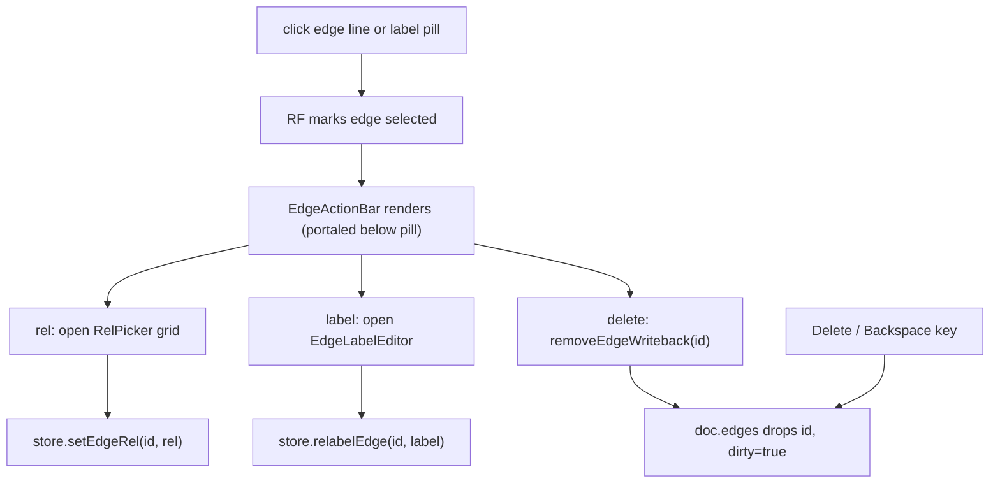
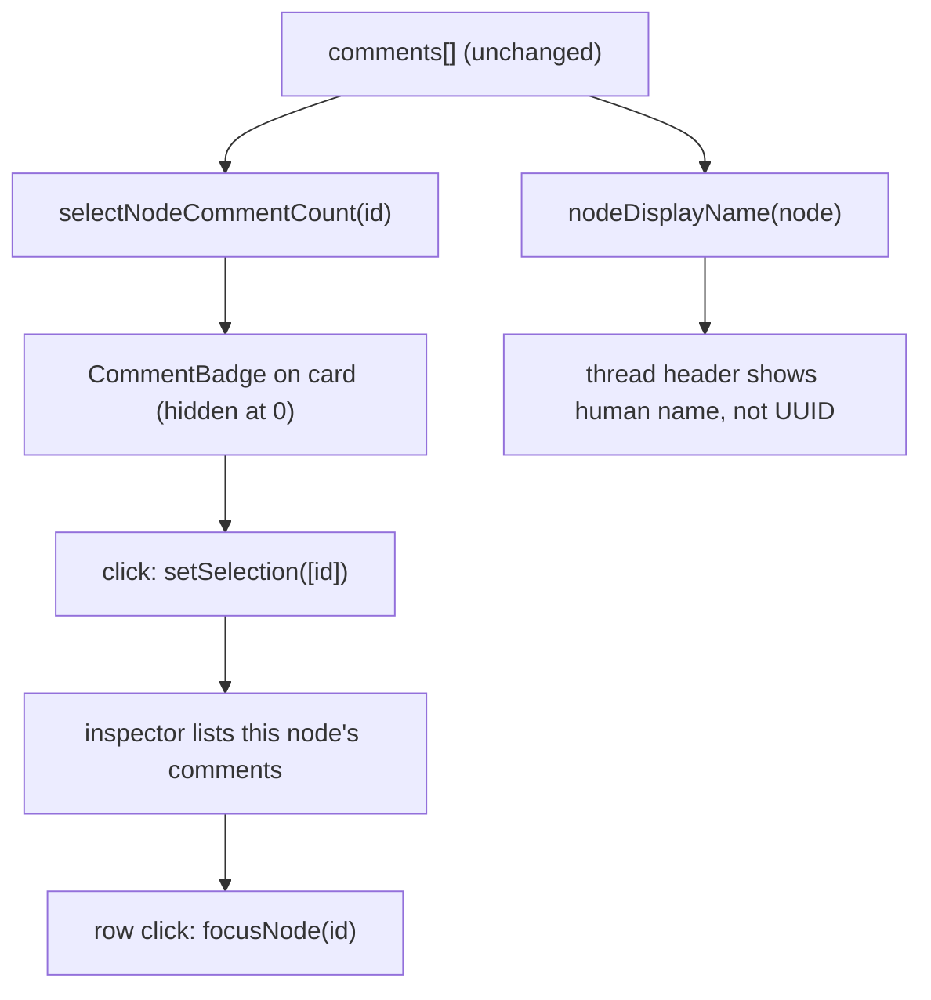

# 003 — Canvas Foundation & Visual Integrity Design

- Repairs the basic direct-manipulation surface v2 left incomplete: every widget resizes, every connection is visibly editable/deletable, comments are anchored *and* discoverable on the widget they annotate.
- One visual-integrity pass kills the always-on faded indigo/violet rings around inline editors, recalibrates the low-contrast `#ddb7ff` secondary, and reworks the reader's type/frontmatter/shrink behavior.
- Scope — in: universal `NodeResizer`, on-edge action affordance (relabel · rel · delete), comment↔widget connection (badge · name · navigation), visual/contrast/reader fixes, browser runtime verification. Out: the system-design component widget, the living core-markdown spine, the agent generation kit, and frictionless import — all Plan 004.
- Built entirely on existing primitives (`setNodeSize`, `relabelEdge`/`setEdgeRel`/`removeEdgeWriteback`, the comment anchor model, design tokens) — no schema, MCP, or contract changes — so risk stays low and verification is fast.
- Sequenced first deliberately: 004's new surfaces (component widgets, core-doc spine, linking) must land on a canvas where the basics work and look right, not repeat v2's plumbing-heavy / experience-light outcome.
- Status approved (2026-06-29); author agent (conversation) + human (scope approval); dated 2026-06-28. All Open Questions resolved at their recommended defaults on approval.
- Sibling plan: `003-canvas-foundation-plan.md` (created after this design is approved).

---

## Problem Statement

Flowcanvas v2 shipped the system-design *plumbing* — a typed-relation graph, the MCP round-trip loop, and change-review — but the canvas itself fails as a direct-manipulation tool, so it reads as unfinished. Most widgets cannot be resized: only `group-node.tsx` carries a `NodeResizer`; markdown, note, image, and link nodes have none. Editing or deleting a connection is hidden behind a tiny label-pill popover (the only delete button lives inside `RelPicker`, reached by single-clicking the pill at `labeled-edge.tsx:96`), so users reasonably conclude arrows can't be changed or removed at all. Comments are geometrically anchored to nodes but carry **no on-widget representation** — no count badge on the card, thread headers display a raw UUID instead of the node's name, and there is no path from a node to its comments — so they feel disconnected from the widgets they annotate. Finally, an always-on faded indigo ring around inline editors (`.fc-edge-input` ships `box-shadow: 0 0 0 3px rgba(192,193,255,.18)` on its *base* selector, not `:focus`, at `edges.css:45`; `.fc-note__edit` double-borders; `.fc-insp__src` is a faded-violet block), a low-contrast `#ddb7ff` secondary, and a frontmatter-bloated, non-shrinking reader make the tool boring and hard to read. These are basic interaction and visual defects that block daily use, and they must be solid before the larger generation-loop redesign (Plan 004) lands on top of them.

## Success Criteria

- Every node type — markdown · note · image · link · group — selects and **resizes** via visible handles; the new size persists to the `.canvas` file and survives a reload.
- A selected edge exposes **visible, one-click** affordances to relabel, retype (`rel`), and delete — no popover hunting required; keyboard delete still works.
- A widget that has comments shows an **on-card count badge**; opening a thread shows the node's **human name** (frontmatter `name` / group `label`), not a UUID; the inspector lists the selected node's comments with click-to-focus.
- **No always-on faded box or ring** around any inline editor or input — focus states are crisp and deliberate, present only on focus.
- Secondary/purple text clears a legibility-contrast bar on the dark surface; the reader uses a readable type system with **compact, non-dominating frontmatter** and proper shrink/fit behavior.
- All quality gates stay green (`tsc --noEmit` · `lint` · `build` · `vitest`) **and** every changed interaction/visual is runtime-verified in a real browser before the plan closes.

## Scope

**In scope:**

- Universal `NodeResizer` across the markdown, note, image, and link node components (min-size constraints; persisted through the existing `setNodeSize` store action) — group resize already works and is the reference pattern.
- Edge interaction: a visible action affordance on a *selected* edge (relabel · rel picker · ✕ delete) reusing `relabelEdge` / `setEdgeRel` / `removeEdgeWriteback`; make `selectable` / `deletable` explicit in the React Flow config in `canvas-shell.tsx`.
- Comment↔widget connection (read-side, over the existing anchor model): a derived per-node comment count driving an on-card badge, node-name resolution in the thread header, and an inspector "comments on this node" section with click-to-focus navigation.
- Visual-integrity pass: remove the always-on rings (`.fc-edge-input` `box-shadow`, `.fc-note__edit` double-border, `.fc-insp__src` violet block) and redesign focus states; recalibrate `--color-secondary` and its usages for contrast on the dark surface; rework the reader's type scale, frontmatter density (compact/collapsible), and shrink/fit behavior.
- Browser-harness runtime verification of each interaction + visual change.

**Out of scope (deferred to Plan 004 — Markdown-Core Generation Loop):**

- The first-class system-design **component widget** with semantic kinds (service / datastore / queue / actor / external / decision).
- The living **core-markdown spine**, bidirectional component↔section linking, and runtime markdown edit → re-submit.
- The **Agent Generation Kit** (system prompt + schema contracts + MCP how-to + worked example as a discoverable artifact, served over MCP and copy-paste).
- **Frictionless import** (JSON paste · `.canvas` file upload · drag-drop without breaking the md/image add-node drop).
- Any change to the MCP tool set, the `.canvas` schema, or the agent contract.

## Solution Overview

Three interaction fixes plus one visual-integrity pass, all built on **primitives that already exist**, so the change surface is small, the risk is low, and runtime verification is fast. The guiding principle is that almost nothing here is genuinely missing capability — it is missing *surface*: the store actions, the resize component, and the comment anchor model are all present and tested; what's absent is the on-canvas affordance, the universal application, and a coherent visual treatment.

Universal resize lifts the group node's proven `NodeResizer` usage into a shared wrapper applied uniformly across the remaining node components, writing through the existing `setNodeSize` action — no schema change, because `width`/`height` already persist. Edge UX surfaces a visible action affordance when an edge is selected (relabel · rel · delete), reusing `relabelEdge`, `setEdgeRel`, and `removeEdgeWriteback`, and makes `selectable`/`deletable` explicit rather than relying on React Flow's implicit defaults — this converts a hidden capability into an obvious one. Comments are connected to their widgets purely on the read side: a per-node count derived from the existing `comments[]` drives an on-card badge, the thread header resolves the anchored node's human name, and the inspector gains a comments section with click-to-focus — no change to how comments are created or anchored.

The visual-integrity pass is the cross-cutting closer: it removes the always-on faded rings and replaces them with deliberate focus-only states, recalibrates the `#ddb7ff` secondary (and the places it is applied — reader `h3`/`em`/links, comment authors) so text clears a contrast bar on the dark surface, and reworks the reader so frontmatter is compact rather than dominating and the column reads well and fits. Because every visual change is token- and component-scoped rather than a global theme rewrite, it can be verified piecewise in the browser. This approach is preferred over folding the work into Plan 004 (which would mix basics with vision across 10+ phases and repeat the v2 failure mode) and over treating the edge-delete gap as a documentation problem (users won't read docs; the affordance must be on the canvas).

## Alternatives Considered

High-level approach alternatives evaluated before this design was locked in. Per-component decisions live under Architecture Decisions.

| Approach | Why considered | Why rejected |
|----------|---------------|--------------|
| Fold the foundation work into Plan 004 | One coherent narrative for the whole redesign | Mixes "fix the basics" with "build the vision" across 10+ phases; reproduces v2's plumbing-heavy / experience-light outcome; no fast incremental win |
| Treat edge delete/change as "already works — just document it" | The capability technically exists (keyboard + popover) | Users won't read docs and won't find the buried popover; an undiscoverable feature is a missing feature |
| Global dark-theme / token rewrite for contrast | Would fix the purple in one sweep | Over-broad and risky for a foundation plan; targeted token + component-level fixes are lower-risk and sufficient |
| Hand-built resize handles per node component | Full control over per-type resize behavior | Reinvents React Flow's `NodeResizer`, which already works on groups; a shared wrapper reuses the proven path |

**Chosen:** the Solution Overview above — three primitive-reuse interaction fixes plus one scoped visual-integrity pass, sequenced before Plan 004.
**Key rationale:** the defects are missing *surface*, not missing *capability*; reusing existing store actions and components keeps the diff small and the runtime verification cheap.

## Architecture Decisions

### Decision 1: Universal resize — shared `NodeResizer` wrapper + the markdown auto-height resolution

`group-node.tsx:59-66` already proves the pattern: `<NodeResizer isVisible={!!selected} minWidth minHeight onResizeEnd={(_,p) => setNodeSize(id, round(p.width), round(p.height))}>`, persisting `width`/`height` to `doc.nodes` via the existing `store.ts:327` `setNodeSize` action (no schema change). The job is to apply it uniformly to `markdown-node.tsx`, `note-node.tsx`, `image-node.tsx`, `link-node.tsx`. Two facts constrain the shape: (a) each node component **returns a fragment** — the card `<div>` plus four `<Handle>`s as siblings (handles must never nest inside the `overflow:hidden` card), so the `<NodeResizer>` must also be a sibling; (b) markdown FileNodes render at **auto height** — `adapter.ts:29` sets `height: undefined` for `kind === 'markdown'` so the collapse toggle visibly shrinks the card, and `adapter.ts:21` derives `--fc-body-max = max(72, n.height - 88)` to clamp the rendered body. A `NodeResizer` that fixes a height fights that content-driven height.

**Options considered (the resizer shape):**

| Option | Pros | Cons |
|--------|------|------|
| A — Per-node hand-rolled resizer | Total per-type control | Reinvents `NodeResizer`; four copies to maintain; loses the proven group path |
| B — One shared `NodeResizeFrame` (resizer + 4 handles), each node wraps its card | Single source of truth; handles + resizer are guaranteed card-siblings; reuses `setNodeSize` | A thin new component to introduce |

**Options considered (the markdown auto-height tension):**

| Option | Pros | Cons |
|--------|------|------|
| A — Width-only resize for markdown | No flicker; never grows past content | No bottom handle; users expect to drag height; uneven with other nodes |
| B — Resize pins an explicit height; body scrolls (auto→fixed) | Familiar fixed-box behavior | Breaks the collapse-shrinks-card behavior; introduces an inner scrollbar in a card |
| C — Resize persists width + height; height re-derives `--fc-body-max`; card stays content-driven | Keeps collapse behavior + the existing clamp derivation; one `setNodeSize` path; no adapter change to markdown auto-height | Mid-drag the live `NodeResizer` momentarily fixes the box, so a release snaps back to auto-with-new-clamp (a small settle) |

**Decision:** Option B for the shape — a shared `NodeResizeFrame` component (renders `<NodeResizer>` + `children` + the four `<Handle>`s) wraps every non-group card. Option C for markdown — markdown stays auto-height in the adapter; a vertical drag persists `height`, which re-derives `--fc-body-max`, so height controls *how much body is revealed* (the card never exceeds its content) while width sizes the card freely. Note / image / link resize as **fixed boxes** (they already carry an explicit `height` in the adapter), exactly like the group node. `isVisible` is gated on `selected && mode !== 'comment'` so resize handles never swallow a pin-drop click in comment mode (see Risks). The group node keeps its bespoke resizer (it has the `:has(.fc-group)` pointer-events rules and the shape switcher) and remains the reference — it is *not* refactored, to keep the diff in scope.

**Rationale:** Option C is the only resolution that preserves the three behaviors the markdown card already balances — collapse-shrinks-card, the `--fc-body-max` body clamp, and now resize — without an adapter change or an inner scrollbar. The shared frame removes the four-way duplication risk and structurally guarantees the handles/resizer stay card-siblings (the exact bug the existing comments warn about).

### Decision 2: Visible selected-edge action affordance + explicit React Flow selection semantics

Edge edit/delete is **undiscoverable, not missing**. `labeled-edge.tsx` single-clicks the label pill to open `RelPicker` (the 2-col `RELATIONSHIP_TYPES` grid), and the *only* delete button is buried at `labeled-edge.tsx:96` inside that picker (`fc-relpick__del` → `removeEdgeWriteback`). Double-click opens `EdgeLabelEditor` → `relabelEdge`. Keyboard delete already works: `canvas-shell.tsx:210` `deleteKeyCode={['Delete','Backspace']}` → `use-canvas-handlers.ts:94-99` `onEdgesChange` remove → `removeEdgeWriteback` (`store.ts:168`). The `<ReactFlow>` (`canvas-shell.tsx:192-218`) sets **no** explicit `elementsSelectable` / `edgesFocusable`, and `adapter.ts:36-43` edges set **no** `selectable` / `deletable` — both rely on React Flow's implicit defaults (which happen to be `true`), so the contract is invisible to a reader and one default-flip away from breaking.

**Options considered:**

| Option | Pros | Cons |
|--------|------|------|
| A — Keep the pill→picker popover, document the delete | Zero new UI | The exact failure mode we are fixing; undiscoverable |
| B — Always-visible inline ✕ on every edge | Maximally discoverable | Clutters a dense graph; collides with the label at the midpoint |
| C — Portaled mini action bar shown only when the edge is `selected` (relabel · rel · ✕) | Discoverable on intent; no clutter at rest; reuses all three store actions | One new sub-component; needs explicit selection semantics |

**Decision:** Option C. `LabeledEdge` consumes the `selected` prop from `EdgeProps` and, when selected, renders an `EdgeLabelRenderer`-portaled `EdgeActionBar` anchored just below the label pill (≈ `labelY + 24`). The bar has three controls reusing the existing store actions: **rel ▾** toggles the existing `RelPicker` grid (`setEdgeRel`), **✎ label** opens `EdgeLabelEditor` (`setEditingEdge` → `relabelEdge`), **✕** calls `removeEdgeWriteback(id)`. The primary delete moves *out* of `RelPicker` into the bar (the `data-testid="edge-delete"` moves with it); `RelPicker` is reduced to the rel grid + free-form label field. The pill keeps double-click→relabel; clicking the edge line selects it (native RF) and reveals the bar. Selection semantics are made **explicit**: `adapter.ts` edges gain `selectable: true, deletable: true`, and `canvas-shell.tsx` sets `elementsSelectable` and `edgesFocusable` on `<ReactFlow>` so the contract is legible and stable.

**Rationale:** the bar is the smallest change that converts a hidden capability into an obvious one without adding graph clutter, and it reuses `relabelEdge` / `setEdgeRel` / `removeEdgeWriteback` verbatim. Making selection explicit costs two props but removes a silent dependence on framework defaults — a foundation-plan win.

### Decision 3: Connect comments to their widgets (read-side only)

Comments live in `doc.flowcanvas.comments[]` (`jsoncanvas.ts:95`), each with `anchor: {kind:'node', nodeId, offsetX, offsetY} | {kind:'canvas', x, y}`. Anchor math is pure (`comments.ts` `anchorForPoint` / `anchorToFlowPoint`) and the layer tracks drags via live measured geometry (`comment-layer.tsx:45-58`). Three read-side gaps make comments feel disconnected — and the fix must **not** touch how comments are created or anchored.

**Options considered:**

| Option | Pros | Cons |
|--------|------|------|
| A — Leave it; comments live only on the pin layer | No work | Pins float disconnected; UUID headers; no node→comment path |
| B — Re-anchor comments to nodes structurally (store on the node) | "Tighter" data model | Out of scope (changes creation/anchoring + schema); high risk |
| C — Pure read-side derivation: count badge + name resolution + inspector list | Zero schema/creation change; reuses `focusNode`; cheap to verify | Per-node count recomputes from `comments[]` (bounded by board size) |

**Decision:** Option C, three pieces. **(a) On-card badge** — a primitive-returning store selector `selectNodeCommentCount(id)` counts *unresolved root* comments whose `anchor.nodeId === id`; each non-group node renders a small `<CommentBadge>` (sibling of the card so it escapes `overflow:hidden`), hidden at zero, that calls `setSelection([id])` on click to populate the inspector. **(b) Name resolution** — a shared pure helper `nodeDisplayName(node)` (markdown FileNode → `meta.frontmatter.name` or file stem; group → `label`; link → url; text → first line; else short id) replaces `comment-layer.tsx:12` `anchorLabel`, which currently returns the raw UUID; the resolved string already flows to the thread header via the existing `anchorLabel` prop. **(c) Inspector section** — `inspector-rail.tsx` gains a "Comments on this node" list (root comments anchored to the selected node: badge #, author, text preview, resolved state), each row click-to-focus via the existing `focusNode(selectedNode.id)`.

**Rationale:** every piece reads the existing `comments[]` and reuses an existing action (`setSelection`, `focusNode`) — no new persisted state, no change to `addComment` / the anchor math. The primitive (`number`) selector keeps per-node subscriptions churn-free; a single map selector would return a fresh object each render and thrash the memoized node components.

### Decision 4: Visual integrity — kill always-on rings, recalibrate `--color-secondary`, redesign the reader

Four always-on faded rings/blocks read as accidental UI: `.fc-edge-input` ships `box-shadow: 0 0 0 3px rgba(192,193,255,.18)` on its **base** selector (`edges.css:44`, not `:focus`); `.fc-note__edit` carries an always-on indigo `border` + a second faded `:focus` ring (`nodes.css:315,324`); `.fc-insp__src` is a faded-violet block (`rgba(221,183,255,.08)` fill + `.25` border, `studio-inspector.css:128-129`); `.fc-agent__ta` is a recessed dark box (`toolbar.css:289`, minor). Separately the reader's `<FrontmatterView variant="reader">` dominates the column, and the prose type system reads poorly.

On `--color-secondary: #ddb7ff` (`globals.css:35`): the honest measurement is that it already **clears WCAG** on every app surface — ≈ 11.3:1 against the deepest reading surface `--color-surface-lowest #060e20`, ≈ 9.6:1 on the card surface `#171f33`, ≈ 7.2:1 as tag-chip text over its own `rgba(221,183,255,.13)` fill. The perceived "low contrast" is **hierarchy + saturation**, not raw ratio: one saturated light violet is doing too many jobs at once (reader `h3` `reader.css:36`, `em` `:40`, links `:41`, comment authors `:15`, and every FrontmatterView chip), and a saturated light hue used for *body em and inline links* at 17px reads hazy and competes with `--color-text-primary #dae2fd`.

**Options considered (secondary):**

| Option | Pros | Cons |
|--------|------|------|
| A — Leave `#ddb7ff`, change nothing | No ripple | Ignores the real perceptual complaint |
| B — Only bump the hex lighter | One-line token change | Marginal; a lighter violet washes out and still over-serves prose |
| C — Recalibrate to a crisper violet **and** reduce its prose roles | Fixes the actual hierarchy problem; small uniform ripple | Two-part change; must audit every usage |

**Decision:** Option C — a package. (1) Recalibrate `--color-secondary: #ddb7ff → #e4c6ff` (≈ 12.7:1 on `#060e20`, ≈ 10.8:1 on cards — a crisper, slightly higher-luminance violet that holds the tag/metadata identity). (2) **Reduce its roles in prose**: reader `em → --color-text-primary` (emphasis via weight, not a competing hue) and reader inline links `→ --color-primary` with the existing underline (indigo is the app's interactive accent and reads as "link"); `h3` keeps a violet accent. (3) **Kill the always-on rings** — move the `.fc-edge-input` 3px ring to `:focus` only (keep the drop shadow at rest, ring on focus); set `.fc-note__edit` rest border to `--color-outline-variant` with a crisp `--color-primary` `:focus` ring (drop the always-on indigo border + the faded second ring); reskin `.fc-insp__src` to a neutral glass surface (`--color-surface-low` + `--color-outline-variant`), letting the "source" label carry the violet via text only; lighten `.fc-agent__ta` to a surface token with a crisp `:focus` border. (4) **Reader redesign** — make `<FrontmatterView variant="reader">` **collapsible** (a `collapsible` prop + internal `open`; collapsed = one dense row of status pill + first tags + a count, with a `data-testid="reader-fm-toggle"` expander revealing the full kv grid + links); tune the prose ramp (keep Geist per design-system §0, but `font-feature-settings`/`text-rendering` for proper kerning, hold 17px/1.7, a touch more paragraph spacing). A dedicated long-form reading face is flagged in Open Questions (it touches §0 + adds a dependency).

**Rationale:** the truthful diagnosis is hierarchy, not a WCAG failure, so the highest-leverage move is role reduction paired with a modest recalibration — not a sweeping theme rewrite (rejected as over-broad for a foundation plan). Moving rings to focus-only is the standard, deliberate focus treatment the design system §0/§11 already calls for. Keeping Geist respects the §0 mandate while still materially improving the reading column; the bigger font question is deferred rather than guessed.

---

## Technical Design

### Data Models

This plan introduces **no new persisted fields and no `.canvas` schema change** — `schemaVersion` stays `0.2`. It only *reads* existing persisted shapes and adds transient/derived component-layer shapes. The persisted types consumed (unchanged):

```ts
// lib/canvas/jsoncanvas.ts — READ ONLY here; no field added/changed.
interface NodeBase {
  id: string
  x: number; y: number
  width: number; height: number          // ← resize persists here via setNodeSize (already wired)
  color?: CanvasColor
  parentId?: string
  meta?: NodeMeta                          // meta.frontmatter.name → node display name
}
interface CanvasEdge {
  id: string
  fromNode: string; toNode: string
  label?: string                           // ← relabelEdge
  meta?: { origin?: EdgeOrigin; rel?: RelationshipType }   // ← setEdgeRel
}
type CommentAnchor =
  | { kind: 'node';   nodeId: string; offsetX: number; offsetY: number }
  | { kind: 'canvas'; x: number; y: number }
interface Comment {
  id: string
  anchor: CommentAnchor                     // anchor.nodeId → on-card badge + inspector list
  parentId: string | null                  // null = root thread
  resolvedAt?: string | null               // unresolved roots only count toward the badge
  badge?: number
  author: string
  text: string
}
```

New **derived / transient** shapes (component layer — never persisted):

```ts
// lib/canvas/store.ts — a primitive-returning selector (churn-free per-node subscription).
export const selectNodeCommentCount =
  (id: string) =>
  (s: CanvasState): number =>
    s.doc?.flowcanvas.comments.reduce(
      (n, c) =>
        n + (c.parentId === null && !c.resolvedAt &&
             c.anchor.kind === 'node' && c.anchor.nodeId === id ? 1 : 0),
      0,
    ) ?? 0

// lib/canvas/node-name.ts — pure, DOM-free; shared by comment-layer, inspector, reader.
export function nodeDisplayName(n: CanvasNode): string
//   group → label || 'Group'
//   link  → url
//   text  → first line slice(0,50) || 'Note'
//   file(markdown) → String(meta.frontmatter.name) || basename(file)
//   file(other)    → basename(file)
```

### Enums & Constants

No new enumeration is introduced — the edge affordance reuses the existing 8-value `RELATIONSHIP_TYPES` / `REL_LABELS` catalog (`jsoncanvas.ts:20-35`) and `EdgeOrigin`. The plan adds presentational constants only:

```text
Per-kind resize minimums (NodeResizeFrame minWidth / minHeight, px):
  markdown : 240 x 140   (header + frontmatter need ≈ 88px before any body)
  note     : 180 x 120
  image    : 160 x 120
  link     : 180 x  56   (chip — short)
  group    : 120 x  80   (UNCHANGED — group-node.tsx:61-62, reference)

CommentBadge:
  COUNT_CAP = 9          (render "9+" above the cap; aria-label carries the exact number)
  hidden when count === 0

Recalibrated token (app/globals.css @theme):
  --color-secondary  before: #ddb7ff  (≈ 11.3:1 on #060e20 · ≈ 9.6:1 on cards)
  --color-secondary  after : #e4c6ff  (≈ 12.7:1 on #060e20 · ≈ 10.8:1 on cards)

Reader frontmatter:
  collapsible (reader variant only); default collapsed = status pill + first tags + "+N"
```

### API / Interface Contracts

```tsx
// components/canvas/nodes/node-frame.tsx — NEW. The shared resizer + handles wrapper.
// Renders <NodeResizer> (sibling), children (the card), and the 4 source <Handle>s (siblings).
import type { ReactNode } from 'react'
export interface NodeResizeFrameProps {
  id: string
  selected: boolean
  minWidth: number
  minHeight: number
  children: ReactNode
}
export function NodeResizeFrame(p: NodeResizeFrameProps): JSX.Element
//   const setNodeSize = useCanvasStore(s => s.setNodeSize)
//   const commentMode = useCanvasStore(s => s.mode === 'comment')
//   <NodeResizer isVisible={p.selected && !commentMode} minWidth minHeight
//     onResizeEnd={(_e, d) => setNodeSize(p.id, Math.round(d.width), Math.round(d.height))}
//     lineClassName="fc-rzline" handleClassName="fc-rzhandle" />
//   {p.children}
//   {SIDES.map(s => <Handle key={s} type="source" position={s} id={s} />)}
```

```tsx
// components/canvas/nodes/comment-badge.tsx — NEW. On-card unresolved-comment indicator.
export interface CommentBadgeProps { nodeId: string }   // subscribes selectNodeCommentCount(nodeId)
export function CommentBadge(p: CommentBadgeProps): JSX.Element | null
//   const count = useCanvasStore(selectNodeCommentCount(p.nodeId))
//   const select = useCanvasStore(s => s.setSelection)
//   if (count === 0) return null
//   <button className="fc-node__badge" data-testid="node-comment-badge"
//     aria-label={`${count} unresolved comment(s) — show in inspector`}
//     onClick={e => { e.stopPropagation(); select([p.nodeId]) }}>
//     {count > 9 ? '9+' : count}</button>
```

```tsx
// components/canvas/edges/labeled-edge.tsx — EXTENDED. Consume `selected`; render the bar.
// LabeledEdge now destructures `selected` from EdgeProps and renders:
function EdgeActionBar(p: {
  id: string
  rel: RelationshipType
  label: string
  x: number; y: number
  onRel: () => void          // toggle RelPicker
  onLabel: () => void        // setEditingEdge(id)
}): JSX.Element
//   portaled in EdgeLabelRenderer at (x, y + 24); 3 buttons:
//     "rel ▾"  → p.onRel()                         (reuses setEdgeRel via RelPicker)
//     "✎"      → p.onLabel()                       (reuses relabelEdge via EdgeLabelEditor)
//     "✕"      → removeEdgeWriteback(p.id)         data-testid="edge-delete"
// RelPicker loses its embedded fc-relpick__del (delete now lives in the bar).
```

```tsx
// components/canvas/frontmatter-view.tsx — EXTENDED. Collapsible reader variant.
interface FrontmatterViewProps {
  frontmatter: Record<string, unknown>
  variant?: 'card' | 'reader'
  className?: string
  sourceNodeId?: string
  collapsible?: boolean        // NEW — reader variant only; renders a fc-fm__toggle expander
}
// card variant is unchanged; collapsible defaults false for `card`, true when reader passes it.
```

Adapter + shell wiring (explicit selection semantics):

```ts
// lib/canvas/adapter.ts — toReactFlow edge mapping gains:
//   selectable: true, deletable: true   (was relying on RF defaults)
// canvas-shell.tsx <ReactFlow> gains:
//   elementsSelectable={true} edgesFocusable={true}
```

Node `Inner` signatures all add the props the frame needs:

```ts
// markdown-node / note-node / image-node / link-node:
function Inner({ id, selected, data }: NodeProps)   // was {id,data} | {data}
// each wraps its existing card + <CommentBadge> in <NodeResizeFrame id selected min…>
```

### Sequence / Flow Diagrams

Resize → persist (markdown re-derives the body clamp; others fix the box):

```mermaid
sequenceDiagram
  participant U as "User"
  participant NR as "NodeResizer (in NodeResizeFrame)"
  participant H as "useCanvasHandlers"
  participant S as "store.setNodeSize"
  participant A as "adapter.toReactFlow"
  U->>NR: "drag corner handle"
  NR->>H: "onNodesChange (dimensions) — live preview"
  NR-->>S: "onResizeEnd(width, height)"
  S->>S: "doc.nodes[id].width/height set, dirty=true"
  S->>A: "doc change rebuilds RF nodes"
  A-->>H: "markdown: height undefined + new --fc-body-max; others: fixed height"
  U->>S: "Save (Cmd-S) persists width/height to .canvas"
```

Select-edge → act (one visible affordance, three reused store actions):



Comment read-side connection (badge → inspector → focus):



### Module Boundaries

| File | Layer | Change |
|------|-------|--------|
| `components/canvas/nodes/node-frame.tsx` | NEW | Shared `NodeResizeFrame` (resizer + 4 handles); `isVisible = selected && mode !== 'comment'` |
| `components/canvas/nodes/comment-badge.tsx` | NEW | `CommentBadge`; subscribes `selectNodeCommentCount`; click → `setSelection` |
| `lib/canvas/node-name.ts` | NEW | Pure `nodeDisplayName(node)` helper |
| `components/canvas/nodes/markdown-node.tsx` | EXT | Add `selected`; wrap card in frame (min 240×140, auto-height kept); render badge |
| `components/canvas/nodes/note-node.tsx` | EXT | Add `selected`; wrap card in frame (min 180×120, fixed box); render badge |
| `components/canvas/nodes/image-node.tsx` | EXT | Add `id`/`selected`; wrap in frame (min 160×120); render badge |
| `components/canvas/nodes/link-node.tsx` | EXT | Add `id`/`selected`; wrap in frame (min 180×56); render badge |
| `lib/canvas/store.ts` | EXT | Export `selectNodeCommentCount(id)` selector (no state change) |
| `components/canvas/edges/labeled-edge.tsx` | EXT | Consume `selected`; add `EdgeActionBar`; strip `fc-relpick__del` (delete moved up) |
| `lib/canvas/adapter.ts` | EXT | Edge mapping: `selectable: true, deletable: true` |
| `components/canvas/canvas-shell.tsx` | EXT | `<ReactFlow>`: `elementsSelectable`, `edgesFocusable` explicit |
| `components/canvas/comment-layer.tsx` | EXT | `anchorLabel` resolves via `nodeDisplayName` over a `nodeById` map |
| `components/canvas/inspector-rail.tsx` | EXT | "Comments on this node" section; reuse `nodeDisplayName` + `focusNode` |
| `components/canvas/frontmatter-view.tsx` | EXT | Add `collapsible` (reader variant) + toggle |
| `components/canvas/reader-drawer.tsx` | EXT | Pass `collapsible` to `<FrontmatterView variant="reader">` |
| `app/globals.css` | EXT | `--color-secondary: #ddb7ff → #e4c6ff` (@theme token) |
| `app/styles/edges.css` | EXT | `.fc-edge-input` ring → `:focus` only; new `.fc-edge-actions` bar |
| `app/styles/nodes.css` | EXT | `.fc-note__edit` rest border neutral + focus ring; `.fc-rzline`/`.fc-rzhandle`; `.fc-node__badge` |
| `app/styles/studio-inspector.css` | EXT | `.fc-insp__src` neutral surface; comments-section styles |
| `app/styles/toolbar.css` | EXT | `.fc-agent__ta` lighten + crisp `:focus` |
| `app/styles/reader.css` | EXT | Prose `em → text-primary`, links `→ primary`; type tuning; collapsible-fm styles |
| `app/styles/frontmatter.css` | EXT | Reader collapsible toggle styles |

---

## Constraints & Risks

| Constraint / Risk | Impact | Mitigation |
|-------------------|--------|-----------|
| Markdown auto-height vs `NodeResizer` | Mid-drag the live resizer fixes the box, so a release snaps back to auto-with-new-clamp (a small settle); a markdown card cannot grow past its content | Decision 1 Option C (intended "reveal" semantic); `onResizeEnd` persists, adapter restores auto + new `--fc-body-max`; document the behavior; verify in browser |
| `NodeResizer` handles vs comment-mode click capture | A selected node in comment mode could show resize handles that swallow a pin-drop click | `isVisible = selected && mode !== 'comment'` in `NodeResizeFrame`; the `.fc-comment-layer` overlay still owns the drop |
| React Flow default selection semantics were implicit | Edge select/delete silently depended on RF defaults; a future default flip breaks delete | Make `selectable`/`deletable` explicit on adapter edges + `elementsSelectable`/`edgesFocusable` on `<ReactFlow>` |
| Box-select selects many edges → many action bars | Visual clutter on select-all | Bar renders per-edge on `selected`; acceptable at rest; not shown for unselected edges; verify multi-select |
| `--color-secondary` recalibration ripples beyond the reader | Token feeds tags/status-pill, link-node url/glyph, `.fc-insp__src` label, `STROKE.import` edge stroke, group switcher + reader-size active gradients | Small uniform lum/hue shift (benign ripple); full usage audit in Decision 4; the `globals.css:140` void-wash literal `rgba(221,183,255,.12)` stays unless explicitly aligned |
| Removing `em`/link violet from prose changes reader look | Expected visual drift in the reader column | This is intended (Decision 4); record as Expected drift (not a regression) in the UI design's visual-parity table |
| Per-node count selector recomputes over `comments[]` | O(nodes × comments) per render | Returns a primitive (number) → churn-free subscriptions; bounded by foundation board sizes; a map selector is explicitly rejected (object identity thrash) |
| Reader body font (Geist) flagged "poor for readability" | Long-form prose still feels UI-ish even after tuning | In scope: tune the ramp + feature-settings while keeping Geist (design-system §0); a dedicated reading face is an Open Question (adds a dependency + a §0 amendment) |

## Research References

No external research file is required — every change reuses an in-repo, already-shipped React Flow primitive whose behavior is verified by the existing group node, and the cache (`researches-index.md`) holds no React Flow entry to update.

| Topic | File | Key Finding |
|-------|------|-------------|
| `NodeResizer` usage + `onResizeEnd` persistence | `components/canvas/nodes/group-node.tsx:59-66` | In-repo reference: `isVisible`/`minWidth`/`minHeight`/`onResizeEnd` → `setNodeSize` already proven; the wrapper generalizes it |
| Edge `selected` + keyboard delete wiring | `components/canvas/edges/labeled-edge.tsx`, `use-canvas-handlers.ts:94-99` | `EdgeProps.selected` + `deleteKeyCode` → `onEdgesChange` remove → `removeEdgeWriteback` already function; only the visible affordance is missing |
| React Flow `NodeResizer` / edge-selection API | none — not cached | Stable `@xyflow/react` ^12 API; no fresh research needed; the in-repo references above are authoritative |

## Open Questions

- [x] **Dedicated long-form reading face for the reader?** Keeping Geist (design-system §0) is the in-scope choice; introducing a local reading serif/humanist face for reader prose only would improve readability but amends §0 and adds a `@fontsource` dependency + a token. Operator decision — defer to a follow-up unless approved now. → **Resolved 2026-06-29:** keep Geist; tune the ramp + feature-settings only. A dedicated reading face is deferred to a follow-up.
- [x] **`--color-secondary` recalibration: global token vs reader-scoped override?** A global `#e4c6ff` ripples to the `import`-edge stroke and the switcher/reader-size gradients (benign). Confirm a global shift is acceptable vs scoping the new value to prose/chips only. → **Resolved 2026-06-29:** global `@theme` token change (`#ddb7ff → #e4c6ff`); the benign ripple to the import-edge stroke + switcher/reader-size gradients is accepted.
- [x] **Markdown vertical resize semantics:** Decision 1 Option C makes height "how much body to reveal" (card never exceeds content). Confirm this over Option A (width-only) before implementation — it changes user expectation of the bottom handle. → **Resolved 2026-06-29:** Option C — vertical drag persists `height`, re-derives `--fc-body-max`, card stays content-driven (never exceeds content).
- [x] **`RelPicker` embedded delete:** the design moves the delete to the new action bar and strips `fc-relpick__del`. Confirm removing the redundant in-picker delete (vs keeping both surfaces). → **Resolved 2026-06-29:** move delete into the `EdgeActionBar`; strip `fc-relpick__del` from `RelPicker` (single delete surface).
- [x] **CommentBadge click target:** `setSelection([id])` (select only, no recenter) is chosen over `focusNode(id)` (select + viewport center) so a click on an already-visible node doesn't jump the canvas. Confirm. → **Resolved 2026-06-29:** `setSelection([id])` — select only, no viewport recenter.
