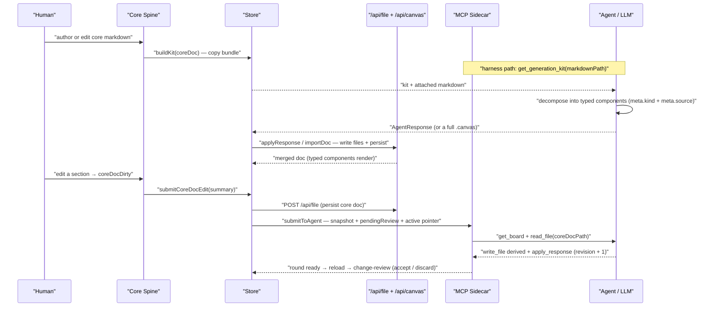
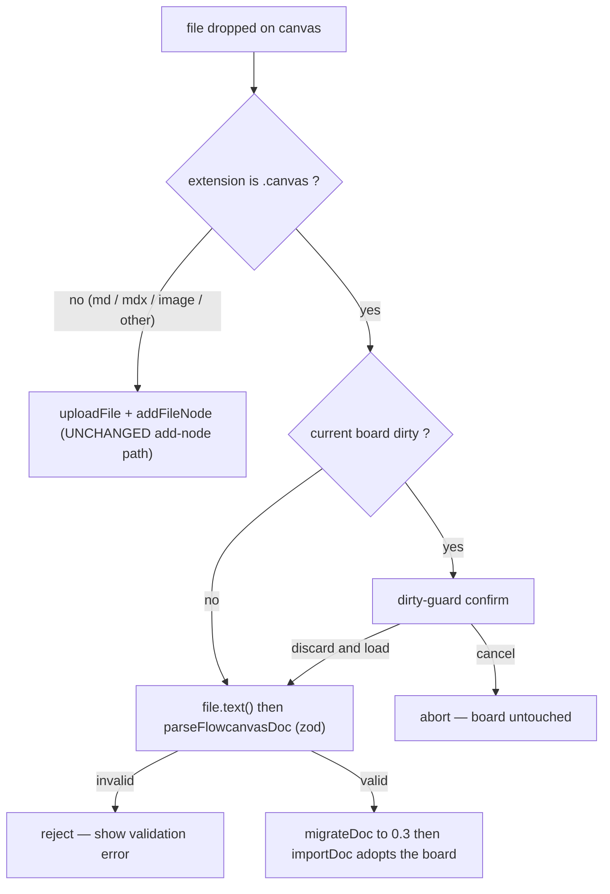
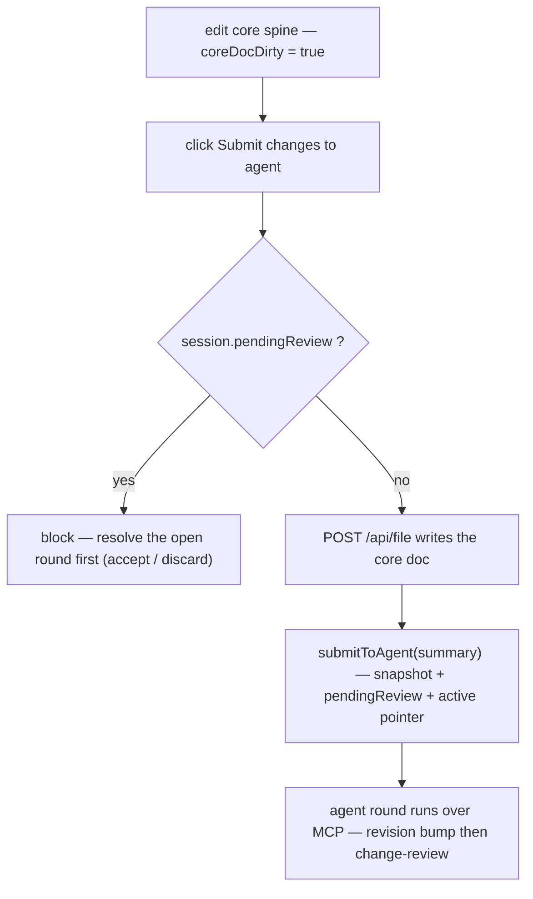

# 004 — Markdown-Core Generation Loop Design

- The headline capability, finally made real: a markdown design doc → handed to ANY LLM with a complete, discoverable kit (system prompt + schema contracts + MCP how-to + worked example) → a rich `.canvas` that reads as a **system-design diagram** (typed components + connections), not an arrangement of markdown-file cards.
- The markdown stays the **living core**: a first-class, beautifully-rendered, editable spine docked on the board — every component traces back to its section, edits flag the doc dirty, and the change re-submits to the agent over MCP for continued co-design.
- **System-design-centric reframe:** components become first-class widgets with semantic kinds (service · datastore · queue · actor · external · decision · …) via a `meta.kind` discriminator on existing node types — visual identity without a schema-breaking new node type.
- **Frictionless import:** a generated `.canvas` enters the app three ways — JSON paste · `.canvas` file upload · `.canvas` drag-drop — without breaking the existing md/image add-node drop.
- Scope — in: the Agent Generation Kit (MCP resource + copy-paste), the system-design component model (`meta.kind`), the living core-markdown spine (read/write/dirty/re-submit), bidirectional component↔section linking, frictionless `.canvas` import, and the UI/UX for all of it. Out: re-doing 003's foundation fixes, multi-human realtime collab, an in-app LLM runtime.
- Builds on **Plan 003** (the foundation must be solid first); 004 DOES change the schema (`meta.kind`), the MCP surface (kit resource + import), and the agent contract (kit + kind extraction) — all deferred here from 003 deliberately.
- Status approved; author agent (conversation) + human (scope approval); dated 2026-06-28, approved 2026-06-29 (5 Open Questions resolved — Q1/Q2 verified against the installed SDK + on-disk anchors, Q3 group-only, Q4 **spine switcher** per operator override, Q5 raw kit payload).
- Sibling plan: `004-generation-loop-plan.md` (created after this design is approved).

---

## Problem Statement

Flowcanvas's reason to exist — turn a markdown design doc into a rich, visual system-design canvas that any LLM can generate, and keep that markdown as the living, linked core of the board — is the one thing v2 left under-realized. Four gaps cause it. (1) The canvas reads as an **arrangement of markdown-file cards**: every extracted "component" becomes a `type:'file'` node rendering frontmatter + body, so the board looks like a pile of documents, not a system-design diagram of services, datastores, and queues. (2) The agent's "instruction kit" is a buried `responseContract` string inside `DesignBrief` plus a docs file — there is no **discoverable, complete manual** any LLM is handed (no MCP resource that returns the kit, no copy-paste system-prompt bundle, no worked example), so a fresh LLM cannot reliably produce a good board. (3) The core markdown is a **second-class overlay drawer** (`reader-drawer.tsx`) — transient, read-only, not editable at runtime, not a privileged spine the board is organized around, and not re-submittable when the human revises it. (4) There is **no frictionless way to import** a generated `.canvas` — no JSON paste of a full doc, no `.canvas` upload, no `.canvas` drag-drop — so getting an LLM's output onto the board is a manual file dance. Plan 003 makes the canvas a correct, good-looking direct-manipulation tool; 004 makes it the markdown-core generation loop it was always meant to be.

## Success Criteria

- A markdown design doc handed to ANY LLM **with the kit** produces a `.canvas` that renders as a **system-design diagram** — typed component widgets (service/datastore/queue/actor/external/decision) and typed connections — with each component carrying provenance back to the doc section it came from.
- Components are **visually first-class and kind-distinct** (icon + shape + accent per kind), not generic markdown cards; the kind is machine-readable (`meta.kind`).
- The **core markdown** is a first-class docked spine: rendered beautifully, **editable at runtime**, marked **dirty** on edit, and **re-submittable to the agent over MCP** so the agent reasons about the change and returns an updated board.
- **Bidirectional linking** works both ways: selecting/hovering a component highlights its section in the core doc, and selecting/hovering a doc section highlights its component(s) on the canvas.
- The **Agent Generation Kit** is discoverable and complete — served as an MCP resource/tool (so a connected harness can fetch it) AND as a one-click copy-paste bundle (system prompt + schema contracts + MCP loop how-to + worked example) for any LLM the human pastes into.
- A generated `.canvas` **imports three ways** — JSON paste, `.canvas` file upload, `.canvas` drag-drop — and the existing md/image add-node drag-drop still works unchanged.
- All gates green (tsc · lint · build · vitest) **and** the full loop (md doc → kit → LLM → import → board → edit core → re-submit → updated board) is **runtime-verified** end-to-end.

## Scope

**In scope:**

- **System-design component model** — a `meta.kind` enum (`service · datastore · queue · actor · external · decision · process · boundary`) on nodes + a kind-aware node renderer (icon/shape/accent per kind), so a component is a first-class design primitive, not a doc card. The agent emits kinds; existing node types (`text`/`file`) carry the discriminator (no schema-breaking new top-level type).
- **Agent Generation Kit** — a single source-of-truth kit (system prompt + node/edge/group/kind schema contracts + MCP loop how-to + a worked md→canvas example), exposed as (a) an MCP resource/tool the harness can fetch and (b) a copy-paste bundle in the UI for non-MCP LLMs, with the markdown payload attached.
- **Living core-markdown spine** — a docked (not overlay) core-doc panel: full-fidelity render, runtime edit, dirty flag, and a "submit changes to agent" action that ships the revised markdown over MCP for re-reasoning.
- **Bidirectional component↔section linking** — built on `meta.source { path, anchor }`: component-selected → scroll/highlight the doc section; section-selected/hovered → highlight the component(s); a visible "linked to §…" affordance on both sides.
- **Frictionless import** — JSON paste of a full `FlowcanvasDoc`, `.canvas` file upload, and `.canvas` drag-drop onto the board, dispatch-distinguished from the md/image add-node drop so neither breaks.
- The **UI/UX mockups** for all of the above (nyx-refined language, per the 003 selection).
- End-to-end runtime verification of the loop.

**Out of scope:**

- Re-doing Plan 003's foundation fixes (resize/edge/comments/visual) — assumed shipped.
- Real-time multi-human collaboration (the loop is human↔agent, not multi-human CRDT).
- An in-app LLM runtime / API keys — the agent stays external (MCP harness or copy-paste).
- A deterministic in-tool markdown→canvas parser (BL-006) — the kit makes the LLM do the reasoning.

## Solution Overview

The loop is one closed circuit with the markdown at its center, and the work is to make each arc of that circuit first-class. **Generation:** instead of the agent contract living as a buried brief field, 004 promotes it to a discoverable **Agent Generation Kit** — one canonical artifact (system prompt + schema contracts + MCP how-to + a worked example) served both as an MCP resource the harness fetches and as a copy-paste bundle for any LLM, with the human's markdown attached. The kit explicitly instructs the agent to decompose the doc into **typed system-design components** (not document cards), each stamped with `meta.kind` and `meta.source` provenance back to the section it came from. **Rendering:** a kind-aware node renderer turns those components into first-class widgets — a service looks like a service, a datastore like a store — so the board reads as a design diagram; this is a `meta.kind` discriminator over the existing node types, so no schema-breaking new type is introduced.

**The living core:** the markdown stops being a transient overlay drawer and becomes a docked spine the board is organized around — rendered at full fidelity, editable at runtime, dirty-flagged on edit, and re-submittable over MCP so the agent reasons about the human's revision and returns an updated board through the existing change-review window. **Linking:** `meta.source` already records which doc section each component came from; 004 makes that bidirectional and visible — select a component and its section highlights in the spine; select a section and its components light up on the canvas. **Import:** a generated `.canvas` enters trivially through JSON paste, file upload, or drag-drop, with the drop path dispatch-distinguished from the existing md/image add-node drop so the two never collide.

This approach is chosen over three alternatives: a deterministic in-tool parser (rejected — fragile/lossy; the kit lets any LLM reason far better, and it was already parked as BL-006); a brand-new top-level "component" node type (rejected — schema churn and a fork of the node infrastructure, where a `meta.kind` discriminator reuses all of it); and keeping the reader drawer as the markdown surface (rejected — the core doc needs a persistent, editable, linked spine, not a transient read-only overlay). Because 004 sits on the solid 003 foundation, each arc can be built and runtime-verified incrementally against a board whose basic mechanics and visuals already work.

## Alternatives Considered

High-level approach alternatives evaluated before this design was locked in. Per-component decisions live under Architecture Decisions.

| Approach | Why considered | Why rejected |
|----------|---------------|--------------|
| Deterministic in-tool markdown→canvas parser | No LLM dependency; fully offline | Fragile + lossy; agent reasoning decomposes a design doc far better; already parked as BL-006 |
| New top-level `component` node type | Cleanest conceptual model for a design widget | Schema-breaking; forks the node renderer/adapter/store; a `meta.kind` discriminator reuses all existing node infra |
| Keep the reader drawer as the markdown surface | Already built; less new UI | Transient, read-only overlay can't be the living, editable, linked core the loop needs |
| Kit as docs-only (keep it a brief string) | No new MCP surface | Not discoverable; a fresh LLM can't fetch it; no copy-paste path for non-MCP models — the core complaint |

**Chosen:** the Solution Overview above — promote the kit to a first-class discoverable artifact, render components as kind-typed widgets via `meta.kind`, dock the markdown as a living linked spine, and add three import paths, all on the 003 foundation.
**Key rationale:** the markdown is the center of the loop; every arc (generate · render · live-edit · link · import) must be first-class, and reusing existing node/MCP/review infrastructure (via `meta.kind` + an MCP resource + the existing change-review window) keeps the change tractable.

## Architecture Decisions

### Decision 1: Component-kind model — `ComponentKind` on `meta.kind`, kind-aware renderer, `schemaVersion` 0.2 → 0.3

**Options considered:**

| Option | Pros | Cons |
|--------|------|------|
| A — New top-level `component` node in the `CanvasNode` union | Cleanest conceptual model | Schema-breaking; forks `adapter`/`brief`/`store`/`nodeKind`; loses file/text body reuse |
| B — `ComponentKind` discriminator at `meta.kind` (chosen) | Additive, optional, reuses all node infra; agent emits `type:'file'`/`'text'` + `meta.kind` | Renderer must route on `meta.kind`; one careful schema bump |
| C — Encode kind in `color` or `frontmatter` | Zero schema change | Overloads a display field; not machine-addressable; collides with user colors |

**Decision:** Option B. Add a new enum **`ComponentKind`** (`service · datastore · queue · actor · external · decision · process · boundary`) and carry it at `NodeMeta.kind?`. The renderer routing lives in `adapter.toReactFlow`: a non-group node with `meta.kind` set maps to React Flow `type:'component'` → a new `component-node.tsx` that reads `COMPONENT_KIND_META` for its glyph, silhouette, and accent; a `group` node with `meta.kind:'boundary'` keeps `type:'group'` and applies the kind accent. Bump `schemaVersion` `0.2 → 0.3`; the migration is a **no-op version bump** because `meta.kind` is optional (kindless nodes render exactly as today via `nodeKind`).

**Naming constraint (load-bearing):** the identifier `NodeKind` is already taken — `jsoncanvas.ts:134` defines `NodeKind = 'markdown' | 'image' | 'file' | 'link' | 'note' | 'group'`, the *derived render kind* consumed by `nodeKind()`, `adapter`, `brief.BriefNode.kind`, and `structure-rail`. The new semantic enum is therefore named **`ComponentKind`**, not `NodeKind`. Reusing the name would silently corrupt every existing `nodeKind` call site.

**Rationale:** the discriminator gives a component visual + machine identity while reusing the entire node pipeline (resolve, brief, merge, review, structure rail). Routing in the adapter (not in `nodeKind`) keeps the content render-kind semantics intact for everything else. The optional field + no-op bump means zero risk to existing boards.

### Decision 2: Agent Generation Kit — single-source `buildKit()`, MCP tool primary + static resource, UI copy-paste bundle

**Options considered:**

| Option | Pros | Cons |
|--------|------|------|
| A — MCP **resource** only (`flowcanvas://generation-kit`) | Semantically a read-only manual; auto-discoverable | Attaching a board's markdown needs a templated URI (more SDK surface, not in cache); some harnesses ignore resources |
| B — MCP **tool** only (`get_generation_kit({markdownPath?})`) | Parameterized payload; zero new SDK surface (matches the 7 existing tools); fully covered by cached research | Tools are "actions"; less passively discoverable than a resource |
| C — **Tool primary + static resource secondary**, both from one `buildKit()` (chosen) | Parameterized fetch AND passive discoverability; single source kills drift | Two MCP registrations; resource API needs a one-line SDK verification |

**Decision:** Option C. Create `lib/canvas/generation-kit.ts` exporting `kitSections()` (structured) and `buildKit(markdown?)` (paste-ready string) as the **single source of truth**. Expose it three ways, all rendering from `buildKit`: (1) **MCP tool `get_generation_kit({ markdownPath? })`** — the load-bearing surface, parameterized so the harness fetches the kit with a specific doc attached; uses the exact `registerTool` + `{content:[{type:'text',text}]}` shape the seven existing tools use. (2) **MCP static resource `flowcanvas://generation-kit`** (`mimeType:'text/markdown'`) — the base, payload-less kit for passive discovery in resource listings. (3) **UI copy-paste bundle** — a "Kit" affordance in `export-panel.tsx` that copies `buildKit(coreDocMarkdown)` for any non-MCP LLM. `DesignBrief.responseContract` and `docs/flowcanvas-agent-contract.md` both become renders of `kitSections().schemaContract`, so the legacy standalone `AGENT_CONTRACT` string is no longer an independent copy.

**Rationale:** the tool is fully grounded in the cached MCP research (registration + return shape) and fits the existing tool-based harness; the resource adds discoverability for clients that surface resources; one `buildKit()` source means the MCP loop, the UI bundle, and `docs/` can never drift.

**Resolved (Q1, verified 2026-06-29):** `server.registerResource(name, uriOrTemplate, config, readCallback)` is confirmed verbatim against the installed `@modelcontextprotocol/sdk@1.29.0` (`node_modules/@modelcontextprotocol/sdk/dist/esm/server/mcp.d.ts:102-103`). The proposed `registerResource('generation-kit', 'flowcanvas://generation-kit', metadata, handler)` matches the **static-URI overload** exactly; the read callback receives `(uri: URL, extra)` and MUST return `{ contents: [{ uri, mimeType, text }] }` (`ReadResourceResult`, `spec.types.d.ts:684`). Ship **tool + static resource** as designed. The templated `flowcanvas://generation-kit/{markdownPath}` variant is **not** used — its `ResourceTemplate` constructor requires a mandatory `list` callback (extra surface for no payoff here); the parameterized `get_generation_kit({ markdownPath })` tool already covers the doc-attached case.

### Decision 3: Living core-markdown spine — `session.coreDocPath` pointer, docked editable panel, dirty → resubmit via `submitToAgent`

**Options considered:**

| Option | Pros | Cons |
|--------|------|------|
| A — Identify the core doc by `meta.source` consensus (majority/first) | No new field; derivable | Ambiguous on mixed-source boards; breaks when components are re-extracted; the source doc is often not a board node |
| B — Explicit `session.coreDocPath` pointer (chosen) | Unambiguous; survives re-extraction; points at a file that need not be on the board | One additive `SessionMeta` field |
| C — Keep `reader-drawer.tsx`, bolt edit onto it | Less new UI | Overlay is transient + node-scoped; cannot be the persistent, board-organizing spine |

**Decision:** Option B. Add `SessionMeta.coreDocPath?: string` and dock a new `core-spine.tsx` panel (a real pane in `canvas-shell`, not the overlay drawer) bound to that path. The spine has a render mode (full-fidelity HTML from the existing `/api/render`) and an edit mode (textarea over the raw markdown). Editing populates a transient `coreDocDraft` and flips `coreDocDirty`. The "Submit changes to agent" action: (1) persists the draft via the existing `POST /api/file` (`writeFileApi`, `.md`/`.mdx` only), (2) calls the existing `submitToAgent(intent)` to open the change-review window (snapshot + `pendingReview` + active-board pointer); the agent then reads the revised core doc over MCP (`read_file`), updates the derived per-section files (`write_file`) and the board (`apply_response`), and the human reviews via the existing `review.ts` / `diffDocs` / `pendingReview` machinery. **Conflict rule:** `submitCoreDocEdit` is **blocked while `session.pendingReview` is true** — only one open round at a time; the spine surfaces "resolve the pending round first (accept / discard)" instead of opening a second round.

**Rationale:** an explicit pointer is the only unambiguous identity for a doc that may not be a board node; reusing `submitToAgent` + `/api/file` + the review window means the spine adds a panel and three store actions, not a new round-trip. The pending-round block reuses the existing single-round invariant rather than inventing round queuing.

**Resolved (Q4 — operator override, 2026-06-29): mixed-source boards get a spine switcher, not pinned-only.** When a board's nodes cite several `meta.source.path` docs, the spine still binds to exactly one `session.coreDocPath` at a time, but the human can **repoint** it: `core-spine.tsx` renders a switcher control listing every distinct cited doc (newest/most-referenced first), and selecting one calls the existing `setCoreDoc(path)` action (already specified) to rebind the spine, its outline, and the `buildSourceIndex` highlight map to that doc. The set of choices comes from a new pure helper `citedDocPaths(nodes): string[]` in `lib/canvas/spine.ts` (distinct `meta.source.path` values, ordered). Components whose `meta.source.path` differs from the *current* `coreDocPath` are not in the active outline, but their provenance still shows on their inspector `§ path` row — so nothing is hidden, and the human chooses which doc is the spine. This is additive UI over the already-planned `setCoreDoc` action and one pure helper; no new persisted state (the active choice is just `session.coreDocPath`).

### Decision 4: Bidirectional component↔section linking — derived `Map<anchor, nodeId[]>`, pulse highlight, "§…" affordance both sides

**Options considered:**

| Option | Pros | Cons |
|--------|------|------|
| A — Persist explicit link records (node ↔ section) | Direct lookup both ways | New persisted state to keep in sync; drifts from `meta.source` |
| B — Derive a `sourceIndex` from `meta.source` at render (chosen) | Zero new persisted state; always consistent with provenance | Recompute on doc change (cheap; memoized) |
| C — Keep only component → section (today's `navigateRef`) | Already half-built | Misses the section → component direction the success criteria require |

**Decision:** Option B. A pure `buildSourceIndex(nodes, coreDocPath): Map<string, string[]>` (in a new `lib/canvas/spine.ts`) groups every node whose `meta.source.path === coreDocPath` by its `meta.source.anchor`, yielding `anchor → nodeId[]`. Highlight is transient store state: selecting a component sets `spineHighlightAnchor` (its `meta.source.anchor`) → the spine scrolls to `[id="<anchor>"]` and pulses it; hovering/selecting a spine heading calls `highlightComponents(anchor)` → sets `linkedNodeIds` → the canvas pulses those component nodes. The visible affordance: a `§ {anchor}` chip on each component (node + inspector) that triggers `highlightSpineSection`, and a gutter "{n} components" badge on each spine heading that triggers `highlightComponents`. Heading anchors are produced by a github-slugger-compatible `slugify` shared between the spine outline, the agent's `meta.source.anchor` convention (stated in the kit), and the render pipeline (add `rehype-slug` so `/api/render` headings carry matching `id`s).

**Rationale:** `meta.source` is already stamped on every extracted node — deriving the reverse index is free and never drifts. The pulse + chip pattern reuses the existing `focusNode`/`FocusBridge` transient-highlight idiom. Sharing one slugger across spine, agent, and renderer is what makes the two directions actually line up.

**Resolved (Q2, verified 2026-06-29): standardize on `github-slugger`.** The de-facto anchor convention already on disk is github-slug format — `examples/commerce-platform.canvas` stamps `edge`, `authentication`, `order-lifecycle`, `payments` from headings `## Edge` / `## Authentication` / `## Order lifecycle` / `## Payments`, and `extractRefs` (`lib/canvas/refs.ts:30-33`) stores link anchors **raw** (no transform), so adopting github-slugger introduces no break. Caveat the planner must honor: **neither `github-slugger` nor `rehype-slug` is a *direct* dependency today** (both are transitive only), and `lib/render-md.ts` currently has **no** heading-id step — so the implementation MUST (1) add `github-slugger` + `rehype-slug` as direct deps, (2) wrap `github-slugger` in the single `spine.ts:slugify()`, (3) insert `rehype-slug` into the `render-md.ts` pipeline **after `rehypeSanitize`**, and (4) state the slug rule in the kit's `schemaContract` so the agent stamps matching `meta.source.anchor` values. A unit test MUST assert three-way parity: `slugify("Order lifecycle") === "order-lifecycle"` === the rendered `<h2 id>` === the agent anchor.

### Decision 5: Frictionless import dispatch — zod `FlowcanvasDoc` validator, `importDoc` action, extension-dispatched Dropzone

**Options considered:**

| Option | Pros | Cons |
|--------|------|------|
| A — One server endpoint that sniffs content and decides | Client stays dumb | New route; server guesses intent; harder to dirty-guard before adopting |
| B — Client-side extension dispatch + zod validate + `importDoc` (chosen) | Existing md/image drop path literally untouched; validate before adopting; dirty-guard in the client where the board lives | Validation logic lives client-side (it is pure + tested) |
| C — Import-board modal only (no drag-drop) | Smallest change | Misses two of the three required import paths |

**Decision:** Option B. Add a pure `flowcanvasDocSchema` (zod) + `parseFlowcanvasDoc(json)` in `lib/canvas/validate.ts`, and a store `importDoc(doc, path?)` that runs `migrateDoc` (the `0.x → 0.3` ladder) then adopts the doc exactly like `newBoard`/`openBoard` (write `.canvas`, hydrate files, set active pointer, update `?path=`). Three entry paths feed it: **(a) JSON paste** — `export-panel.tsx` Import tab detects a pasted full doc (`flowcanvas` + `nodes` + `edges`, no `responseVersion`) and routes to `parseFlowcanvasDoc` → `importDoc`; **(b) `.canvas` upload** — a hidden file input → `importCanvasFile(file)` reads `file.text()` → parse → `importDoc`; **(c) `.canvas` drag-drop** — `dropzone.tsx` partitions the dropped `FileList` by extension: any `.canvas` entry routes to a dirty-guarded board load (handled exclusively), everything else (`.md`/`.mdx`/image) flows down the **unchanged** `uploadFile` + `addFileNode` path.

**Rationale:** dispatching on extension in the client means the existing add-node drop is genuinely untouched (only `.canvas` diverts), validation happens before any board is replaced, and the destructive "replace the whole board" action is gated behind the dirty-guard confirm where the dirty state actually lives.

---

## Technical Design

### Data Models

All changes are additive TypeScript edits to `lib/canvas/*` (this is a filesystem app — the `.canvas` JSON doc is the schema; there is no SQL DDL). Every new field is optional, so old `.canvas` files validate and render unchanged.

```ts
// lib/canvas/jsoncanvas.ts — EDIT (004)

// NEW: the semantic system-design kind. DISTINCT from the existing derived render
// NodeKind ('markdown'|'image'|'file'|'link'|'note'|'group') — do NOT reuse that name.
export type ComponentKind =
  | 'service' | 'datastore' | 'queue' | 'actor'
  | 'external' | 'decision' | 'process' | 'boundary'

export interface NodeMeta {
  origin?: NodeOrigin
  collapsed?: boolean
  shape?: NodeShape
  frontmatter?: Record<string, unknown>
  source?: NodeSource
  template?: string
  kind?: ComponentKind            // NEW (004) — optional, additive; absent ⇒ legacy card render
}

export interface SessionMeta {
  title?: string
  intent?: string
  createdAt: string
  updatedAt: string
  revision: number
  lastBriefId?: string
  baseRevision?: number
  pendingReview?: boolean
  briefScope?: string[]
  coreDocPath?: string            // NEW (004) — root-relative path of the living core-markdown spine
}

// schemaVersion ladder extended; 004 boards persist '0.3'
export const SCHEMA_VERSIONS = ['0.1', '0.2', '0.3'] as const
export interface FlowcanvasExt {
  schemaVersion: '0.1' | '0.2' | '0.3'
  session: SessionMeta
  comments: Comment[]
}
```

```ts
// lib/canvas/brief.ts — EDIT (004): carry ComponentKind through the round-trip

export interface BriefNode {
  // ...existing fields (id, kind, position, path, url, text, label, parentId, source, refs, frontmatter, body, truncated)...
  componentKind?: ComponentKind   // NEW — surfaces meta.kind so the agent preserves it
}

export interface AgentNode {
  // ...existing fields (id, type, x, y, width, height, file, url, text, label, shape, parentId, source, color)...
  kind?: ComponentKind            // NEW — agent emits the semantic kind; nodeFromAgent → meta.kind
}

export interface DesignBrief {
  // ...existing fields...
  coreDocPath?: string            // NEW — tells the agent which doc is the spine (read it on a round)
  // responseContract is now kitSections().schemaContract (single source — see generation-kit.ts)
}
```

```ts
// lib/canvas/store.ts — EDIT (004): transient core-spine + link-highlight state (never persisted)
interface CanvasState {
  // ...existing fields...
  coreDocBody: string | null        // resolved markdown of session.coreDocPath (render source)
  coreDocDraft: string | null       // in-progress edit buffer for the spine
  coreDocDirty: boolean             // coreDocDraft !== coreDocBody
  spineHighlightAnchor: string | null  // component-selected → spine scrolls/pulses this anchor
  linkedNodeIds: string[]           // spine-section-selected → canvas pulses these node ids
}
```

### Enums & Constants

```ts
// lib/canvas/jsoncanvas.ts — NEW (004)

/** Ordered allowed set — drives the kind picker UI and the agent contract. */
export const COMPONENT_KINDS: readonly ComponentKind[] = [
  'service', 'datastore', 'queue', 'actor',
  'external', 'decision', 'process', 'boundary',
]

/** Per-kind render hints consumed by component-node.tsx + the kind picker. */
export interface ComponentKindMeta {
  label: string        // human label on the widget + picker
  glyph: string        // icon key resolved by <KindGlyph> in component-node.tsx
  silhouette:          // SVG silhouette the renderer draws (NOT NodeShape — that stays group-only)
    | 'box' | 'cylinder' | 'lane' | 'circle'
    | 'cloud' | 'diamond' | 'gear' | 'frame'
  accent: CanvasColor  // nyx preset id ('1'..'6', mapped by adapter PRESET) → --node-accent
}

export const COMPONENT_KIND_META: Record<ComponentKind, ComponentKindMeta> = {
  service:   { label: 'Service',   glyph: 'server',   silhouette: 'box',      accent: '6' },
  datastore: { label: 'Datastore', glyph: 'database', silhouette: 'cylinder', accent: '5' },
  queue:     { label: 'Queue',     glyph: 'layers',   silhouette: 'lane',     accent: '2' },
  actor:     { label: 'Actor',     glyph: 'person',   silhouette: 'circle',   accent: '4' },
  external:  { label: 'External',  glyph: 'cloud',    silhouette: 'cloud',    accent: '3' },
  decision:  { label: 'Decision',  glyph: 'diamond',  silhouette: 'diamond',  accent: '1' },
  process:   { label: 'Process',   glyph: 'gear',     silhouette: 'gear',     accent: '6' },
  boundary:  { label: 'Boundary',  glyph: 'frame',    silhouette: 'frame',    accent: '5' },
}
```

Kind catalog — meaning of each value (this is the definition the kit hands the agent):

- **`service`** — a runtime process that executes logic: API server, microservice, worker, gateway, function. The default kind for "a thing that does work."
- **`datastore`** — persistent state: relational/NoSQL database, table, cache, object/blob store, file store, search index.
- **`queue`** — an asynchronous channel: message broker, topic, stream, event bus, job queue.
- **`actor`** — a human role or external human user interacting with the system: persona, operator, admin, end user.
- **`external`** — a third-party system or API outside the design's ownership boundary: payment gateway, SaaS provider, upstream/downstream system not built here.
- **`decision`** — a branch / gate / conditional in a flow: router, policy check, switch, guard. Typically diamond-silhouetted.
- **`process`** — a step / activity / transformation inside a flow that is not a standalone deployable service: a pipeline stage, a batch job, a transform.
- **`boundary`** — a system / trust / network / bounded-context container that frames other components. **Group-only (Q3, resolved 2026-06-29):** `meta.kind:'boundary'` is valid ONLY on a `type:'group'` node — the renderer keeps `type:'group'` and tints it; it is never a leaf widget. The kit's `schemaContract` MUST state this constraint, and `flowcanvasDocSchema` SHOULD reject `boundary` on a non-group node (or the renderer falls back to `nodeKind` for the stray case).

Unknown / absent kind: a node with no `meta.kind` (or, defensively, an unrecognized string surviving validation) renders via the existing `nodeKind` path — a plain markdown/note/file card. No kind is ever required.

### API / Interface Contracts

```ts
// lib/canvas/generation-kit.ts — NEW (004). Pure: no fs, no network, no DOM.
// SINGLE SOURCE OF TRUTH for the Agent Generation Kit. The MCP tool, the MCP resource,
// DesignBrief.responseContract, the UI copy bundle, and docs/flowcanvas-agent-contract.md
// all render FROM these functions so they cannot drift.

export interface KitSections {
  systemPrompt: string    // role + goal: decompose a design doc into a TYPED system-design board, not doc cards
  schemaContract: string  // node/edge/group/kind (AgentResponse) JSON contract incl. ComponentKind catalog + slug rule
  mcpHowTo: string        // loop: get_board → reason → write_file derived → apply_response; read session.coreDocPath
  workedExample: string   // a small md → AgentResponse example, kind-tagged + source-anchored
}

/** Assemble the four kit sections. Stable + side-effect free. */
export function kitSections(): KitSections

/** Render the full kit as one paste-ready markdown string; appends the doc payload slot when given. */
export function buildKit(markdown?: string): string
```

```ts
// lib/canvas/spine.ts — NEW (004). Pure.

export interface SpineHeading { anchor: string; text: string; depth: number }

/** github-slugger-compatible slug — MUST match meta.source.anchor + rehype-slug ids. */
export function slugify(heading: string): string

/** Headings of the core markdown → outline rows (for the spine TOC + per-heading component-count badges). */
export function outlineOf(markdown: string): SpineHeading[]

/** anchor → nodeIds, restricted to nodes whose meta.source.path === coreDocPath. Memoize on doc identity. */
export function buildSourceIndex(nodes: CanvasNode[], coreDocPath: string): Map<string, string[]>

/** Distinct meta.source.path values across the board, ordered — feeds the spine switcher (Q4). */
export function citedDocPaths(nodes: CanvasNode[]): string[]
```

```ts
// lib/canvas/validate.ts — NEW (004). Pure (zod over the FlowcanvasDoc shape).

export const flowcanvasDocSchema: z.ZodType<FlowcanvasDoc>   // nodes union + edges + flowcanvas ext (schemaVersion 0.1|0.2|0.3)

/** Parse + validate untrusted JSON into a FlowcanvasDoc. Throws ZodError → caller renders message. */
export function parseFlowcanvasDoc(json: unknown): FlowcanvasDoc

// lib/canvas/migrate.ts — NEW (004), extracted from store.load. Pure.
/** Version ladder: 0.1 → 0.2 (bake derived links edges) → 0.3 (no-op bump). Used by load AND importDoc. */
export function migrateDoc(doc: FlowcanvasDoc): { doc: FlowcanvasDoc; migrated: boolean }
```

```ts
// lib/canvas/store.ts — NEW actions (004)

setCoreDoc: (path: string) => Promise<void>            // stamp session.coreDocPath; resolve body → coreDocBody + coreDocDraft; dirty:false
editCoreDoc: (markdown: string) => void                // coreDocDraft = markdown; coreDocDirty = (markdown !== coreDocBody)
submitCoreDocEdit: (summary: string) => Promise<void>  // GUARD: throw/return if session.pendingReview; else writeFileApi(coreDocPath, draft) → submitToAgent(summary)
highlightSpineSection: (anchor: string) => void        // component → spine: set spineHighlightAnchor
highlightComponents: (anchor: string) => void          // spine → canvas: linkedNodeIds = buildSourceIndex(...).get(anchor) ?? []
clearLinkHighlight: () => void                          // spineHighlightAnchor = null; linkedNodeIds = []
importDoc: (doc: FlowcanvasDoc, path?: string) => Promise<void>  // migrateDoc → adopt (write .canvas, hydrate, active pointer, ?path=)
importCanvasFile: (file: File) => Promise<void>         // file.text() → parseFlowcanvasDoc → importDoc(doc, file.name)
```

```ts
// mcp/flowcanvas-mcp.ts — NEW surfaces (004)

// Tool (primary). Same registerTool + {content:[{type:'text',text}]} shape as the existing 7 tools.
server.registerTool('get_generation_kit', {
  description:
    'Return the full Flowcanvas Agent Generation Kit (system prompt + schema contracts + MCP loop ' +
    'how-to + worked example). Pass markdownPath to attach that document as the payload to convert.',
  inputSchema: {
    markdownPath: z.string().optional()
      .describe('Root-relative .md/.mdx to attach as the doc-to-convert; omit for the base kit.'),
  },
}, async ({ markdownPath }) => {
  const md = markdownPath
    ? (await apiGet<{ content: string }>(`/api/file?path=${encodeURIComponent(markdownPath)}`)).content
    : undefined
  return { content: [{ type: 'text' as const, text: buildKit(md) }] }
})

// Resource (secondary — passive discoverability; registerResource signature VERIFIED against @modelcontextprotocol/sdk@1.29.0, static-URI overload).
server.registerResource('generation-kit', 'flowcanvas://generation-kit',
  { title: 'Flowcanvas Agent Generation Kit', description: 'Turn a design doc into a typed .canvas', mimeType: 'text/markdown' },
  async (uri) => ({ contents: [{ uri: uri.href, mimeType: 'text/markdown', text: buildKit() }] }))
```

```ts
// lib/canvas/adapter.ts — EDIT (004): route meta.kind to the component renderer
const renderType = n.meta?.kind && n.type !== 'group' ? 'component' : nodeKind(n)
// component nodes keep their authored box (autoHeight stays false); group 'boundary' keeps type 'group'.

// components/canvas/canvas-shell.tsx — EDIT (004): register the renderer + dock the spine
const nodeTypes: NodeTypes = { markdown, image, link, note, group, file, component: ComponentNode }
// mount <CoreSpine /> as a docked pane when doc.flowcanvas.session.coreDocPath is set
```

### Sequence / Flow Diagrams

The full md → kit → LLM → import → board → edit → resubmit loop:



The `.canvas` drop-dispatch decision (keeps the existing md/image add-node drop untouched):



The core-doc submit conflict gate (single open round invariant):



### Module Boundaries

Touched files — NEW vs EDIT and the responsibility each carries for plan 004.

| File | New / Edit | Responsibility |
|------|-----------|----------------|
| `lib/canvas/jsoncanvas.ts` | EDIT | `ComponentKind` + `COMPONENT_KINDS` + `COMPONENT_KIND_META`; `NodeMeta.kind`; `SessionMeta.coreDocPath`; `schemaVersion '0.3'` + `SCHEMA_VERSIONS` |
| `lib/canvas/generation-kit.ts` | NEW | Single-source kit: `kitSections()` + `buildKit(markdown?)` |
| `lib/canvas/brief.ts` | EDIT | `AgentNode.kind`, `BriefNode.componentKind`, `DesignBrief.coreDocPath`; `nodeFromAgent` carries `kind` → `meta.kind`; `responseContract = kitSections().schemaContract` |
| `lib/canvas/spine.ts` | NEW | Pure `slugify` (wraps `github-slugger`), `outlineOf`, `buildSourceIndex` (anchor ↔ nodeId index), `citedDocPaths` (spine-switcher choices) |
| `lib/canvas/validate.ts` | NEW | `flowcanvasDocSchema` + `parseFlowcanvasDoc` (zod over `FlowcanvasDoc`) |
| `lib/canvas/migrate.ts` | NEW | `migrateDoc` version ladder (`0.1→0.2→0.3`), extracted from `store.load`, shared with `importDoc` |
| `lib/canvas/adapter.ts` | EDIT | Route `meta.kind` (non-group) → React Flow `type:'component'`; group `boundary` accent |
| `lib/canvas/store.ts` | EDIT | Core-spine + import + link-highlight transient state and actions; `load`/`newBoard` go through `migrateDoc` and persist `'0.3'` |
| `mcp/flowcanvas-mcp.ts` | EDIT | Register `get_generation_kit` tool + `flowcanvas://generation-kit` resource |
| `components/canvas/nodes/component-node.tsx` | NEW | Kind-aware widget: glyph + silhouette + accent from `COMPONENT_KIND_META`; `§ anchor` chip; 4 handles |
| `components/canvas/core-spine.tsx` | NEW | Docked editable spine: render (`/api/render`) + edit (textarea) + dirty + submit; heading anchors + per-heading badges; **spine switcher** over `citedDocPaths` → `setCoreDoc` (Q4) |
| `components/canvas/canvas-shell.tsx` | EDIT | Register `component` nodeType; mount `<CoreSpine>` when `coreDocPath` is set; pulse `linkedNodeIds` |
| `components/canvas/dropzone.tsx` | EDIT | Extension dispatch: `.canvas` → dirty-guarded `importCanvasFile`; md/image → unchanged `uploadFile`+`addFileNode` |
| `components/canvas/export-panel.tsx` | EDIT | Import tab: detect pasted full doc → `importDoc`; `.canvas` upload input; new "Kit" copy bundle (`buildKit`) |
| `components/canvas/inspector-rail.tsx` | EDIT | Component-kind row + `§ anchor` affordance → `highlightSpineSection` |
| `lib/render-md.ts` | EDIT | Add `rehype-slug` (after `rehypeSanitize`) so rendered headings carry `id`s matching `slugify` / `meta.source.anchor` |
| `package.json` | EDIT | Add direct deps `github-slugger` + `rehype-slug` (both transitive today, neither imported directly — Q2) |
| `docs/flowcanvas-agent-contract.md` | EDIT | Regenerate from `kitSections().schemaContract` (no longer an independent copy) |
| `app/styles/studio-spine.css` + `app/styles/nodes.css` | NEW + EDIT | Spine pane styling; component-node silhouettes + per-kind accents |

---

## Constraints & Risks

| Constraint / Risk | Impact | Mitigation |
|-------------------|--------|-----------|
| `schemaVersion` `0.2 → 0.3` migration on every existing board | A miswritten ladder could corrupt or refuse old boards | `meta.kind` is optional ⇒ `0.2→0.3` is a no-op bump; centralize in `migrateDoc` (load + import share it); fall-through preserves `0.1→0.2` link bake; covered by `migrate` unit tests |
| `.canvas` drop colliding with the md/image add-node drop | A stray board file could silently wipe the open board | Dispatch on extension in `dropzone.tsx`; only `.canvas` diverts (md/image path literally unchanged); `.canvas` handled exclusively behind a dirty-guard confirm |
| Core-doc edit submitted while an agent round is pending | Two open rounds would corrupt the single review window (`snapshot`/`pendingReview`) | `submitCoreDocEdit` is blocked while `session.pendingReview`; spine shows "resolve the open round first (accept / discard)" |
| Kit drift across MCP tool, UI bundle, `responseContract`, and `docs/` | Agents get a stale contract; boards regress | One `buildKit()` / `kitSections()` source; `responseContract` and `docs/flowcanvas-agent-contract.md` render from it; the standalone `AGENT_CONTRACT` copy is retired |
| `meta.kind` absent on nodes the agent did not tag | Untyped nodes look like plain cards on a "system-design" board | Kind is optional by contract; renderer falls back to `nodeKind` (markdown/note/file card); structure rail + brief unaffected; the kit pushes the agent to always tag |
| `ComponentKind` value the renderer does not know (unknown string survives import) | Crash or blank widget | `flowcanvasDocSchema` validates the enum on import; `component-node.tsx` defaults to a neutral `box` silhouette + falls back to `nodeKind` when the kind is unrecognized |
| Heading slug mismatch between agent anchors, the spine, and `/api/render` | Bidirectional links silently fail to resolve | One github-slugger-compatible `slugify` shared by `spine.ts`, the kit's `meta.source.anchor` rule, and `rehype-slug` in the render pipeline |
| `NodeKind` name collision (existing derived render-kind) | Reusing the name corrupts every `nodeKind` call site | New enum is named `ComponentKind`; called out in Decision 1 + Data Models |
| MCP `registerResource` signature (resource surface) | Resource surface may not compile / wire as written | **Resolved** — signature verified verbatim against `@modelcontextprotocol/sdk@1.29.0` (`mcp.d.ts:102-103`); ship the static-URI overload as written. Tool stays the load-bearing surface regardless |
| `github-slugger` / `rehype-slug` not direct deps; render pipeline has no heading-id step | Three-way slug parity (agent ↔ spine ↔ render) silently fails | Add both as direct deps; one `slugify()` wraps `github-slugger`; `rehype-slug` after `rehypeSanitize`; unit test asserts parity (Decision 4 Q2) |

## Research References

| Topic | File | Key Finding |
|-------|------|-------------|
| MCP TS SDK — tool registration | `.flowcode/researches/mcp-typescript-sdk-research.md` | `@modelcontextprotocol/sdk@1.29.0` + `zod@3`; `registerTool(name,{description,inputSchema},handler)` returning `{content:[{type:'text',text}]}` — directly backs `get_generation_kit` (the kit's primary, load-bearing surface) |
| MCP sidecar over HTTP to app routes | `.flowcode/researches/nextjs-node-runtime-mcp-sidecar-research.md` | Sidecar reaches app routes via `fetch` + `FLOWCANVAS_BASE_URL`; `get_generation_kit` reads the attached doc via `GET /api/file` rather than touching the filesystem directly |
| MCP resources API (resource-vs-tool) | installed `@modelcontextprotocol/sdk@1.29.0` `.d.ts` (`dist/esm/server/mcp.d.ts:102-103`, `spec.types.d.ts:684`) | **Verified 2026-06-29** (Q1): `registerResource(name, uriOrTemplate, config, readCallback)`; static-URI read callback `(uri:URL, extra) ⇒ { contents:[{uri,mimeType,text}] }`. Ship tool + static resource; skip the `ResourceTemplate` variant (mandatory `list` callback, no payoff). The cached `mcp-typescript-sdk-research.md` covers tools only |

## Open Questions

All five resolved 2026-06-29 (Q1/Q2 by verification, Q3/Q4/Q5 by operator decision) — the design above reflects each resolution. Retained here as the decision record.

- [x] **MCP `registerResource` signature** — **Resolved (verified).** `registerResource(name, uriOrTemplate, config, readCallback)` matches `@modelcontextprotocol/sdk@1.29.0` verbatim (`mcp.d.ts:102-103`); ship the **static-URI** overload (`'flowcanvas://generation-kit'`) returning `{ contents:[{uri,mimeType,text}] }`. Skip the templated `ResourceTemplate` variant (mandatory `list` callback, no payoff — the `get_generation_kit({markdownPath})` tool covers the doc-attached case). See Decision 2 + Research References.
- [x] **Heading slugger parity** — **Resolved (verified): `github-slugger`.** On-disk anchors are already github-slug format (`commerce-platform.canvas`: `edge`/`authentication`/`order-lifecycle`/`payments`) and `extractRefs` stores anchors raw, so no break. Implementation must add `github-slugger` + `rehype-slug` as **direct** deps (transitive today), wrap one `slugify()`, insert `rehype-slug` after `rehypeSanitize` in `render-md.ts`, and unit-test agent↔spine↔render parity. See Decision 4.
- [x] **`boundary` on non-group nodes** — **Resolved: group-only.** `meta.kind:'boundary'` is valid only on `type:'group'`; the kit's `schemaContract` states it and `flowcanvasDocSchema` rejects (or the renderer falls back) for the stray non-group case. See the kind catalog `boundary` entry.
- [x] **Mixed-source boards** — **Resolved: spine switcher** (operator override of the original "index pinned only" recommendation). The spine binds one `coreDocPath` at a time but the human repoints it via a switcher over `citedDocPaths(nodes)` → `setCoreDoc(path)`; off-spine components still show provenance on their inspector `§ path` row. See Decision 3.
- [x] **Copy-paste kit payload size** — **Resolved: raw, no warning.** The UI bundle attaches the full core markdown verbatim via `buildKit(coreDocMarkdown)` (no lossy trimming — the agent needs full fidelity); no size check/warning before the clipboard write. See Decision 2.
