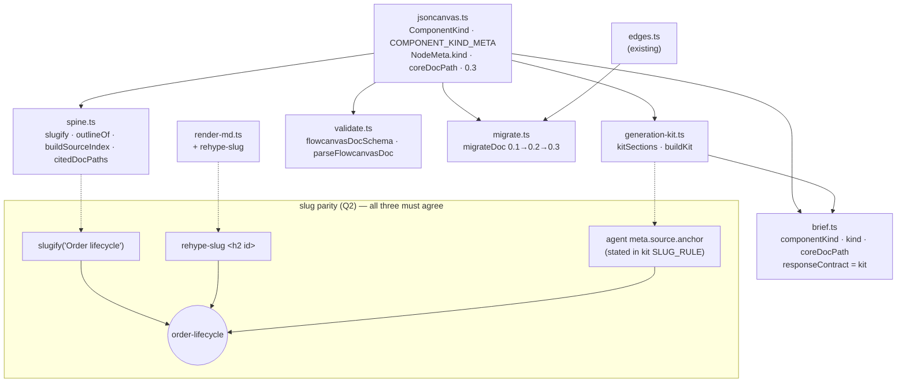

# 004-generation-loop — Markdown-Core Generation Loop Implementation Plan

- Delivers the closed generation loop: a markdown doc → a complete, discoverable Agent Generation Kit → a typed system-design `.canvas`, with that markdown kept as a living, editable, bidirectionally-linked core spine, and frictionless three-way import.
- Phases: 5 — Schema & Pure-Lib Foundation, System-Design Component Rendering, Agent Generation Kit Surfaces, Living Core Spine & Bidirectional Linking, Frictionless Import.
- Status active; dated 2026-06-29.
- Upstream design: `004-generation-loop-design.md` (approved 2026-06-29, 5 Open Questions resolved); UI: `004-generation-loop-ui-design.md` (approved — this is a frontend-touching plan).
- The active phase (Phase 1) is junior-executable: production-ready snippets, worked examples, a flow diagram, and named quality checks — per `plan-instructions.md § Active-Phase Completeness Bar`.
- Execution history lives in `004-generation-loop-log.md` (one entry per phase end + plan end) — not inlined here.

---

## Objective

Turn a markdown design doc into a rich, system-design-centric `.canvas` via any LLM (a complete, discoverable kit), keep that markdown as the living editable bidirectionally-linked core spine, and import a generated `.canvas` frictionlessly — all additively over the solid Plan 003 foundation (`schemaVersion 0.2 → 0.3`, `meta.kind` discriminator, kit MCP surface + UI bundle, docked spine + re-submit, reverse link index, extension-dispatched import).

---

## Phases Catalog

`Depends On` lists the earlier phases that must be `done` first (`[none]` = a root phase). It is the single signal the executor derives parallel waves from — phases whose dependencies are all `done` and whose `Files to create / modify:` tables are path-disjoint may run concurrently (`plan-instructions.md § Phase Dependencies & Waves`).

| Phase | Name | Depends On | Summary |
|-------|------|------------|---------|
| 1 | Schema & Pure-Lib Foundation | [none] | `ComponentKind`/`coreDocPath`/`0.3` schema bump + new pure libs (`spine`, `validate`, `migrate`, `generation-kit`), `brief` edits, `rehype-slug` in the renderer, deps. The base everything else imports. |
| 2 | System-Design Component Rendering | [Phase 1] | Route `meta.kind` → a kind-aware `component-node.tsx` widget (glyph/silhouette/accent); register the `component` nodeType. The canvas reads as a system-design diagram. |
| 3 | Agent Generation Kit Surfaces | [Phase 1] | Expose `buildKit` over MCP (`get_generation_kit` tool + `flowcanvas://generation-kit` static resource) and a UI "Copy full kit" bundle. |
| 4 | Living Core Spine & Bidirectional Linking | [Phase 1, Phase 2] | Docked editable `core-spine.tsx` (render/edit/dirty/submit + switcher) + reverse-index pulse highlighting both directions + inspector `§` affordance. |
| 5 | Frictionless Import | [Phase 1] | `importDoc`/`importCanvasFile` adoption path fed by JSON paste · `.canvas` upload · `.canvas` drag-drop (extension-dispatched), `migrateDoc` to `0.3`. |

**Wave schedule (illustrative — the executor recomputes the frontier at each close):**

- **Wave 1:** Phase 1 (root).
- **Wave 2:** Phase 2 + Phase 3 — both depend only on Phase 1 and their file sets are path-disjoint (Phase 2: `adapter`/`component-node`/`canvas-shell`/`nodes.css`; Phase 3: `mcp`/`export-panel`).
- **Wave 3:** Phase 4 — depends on Phase 1 + Phase 2 (edits `component-node.tsx` and `canvas-shell.tsx` created/registered in Phase 2).
- **Wave 4:** Phase 5 — depends only on Phase 1, but is serialized by the disjoint-Files guard: it shares `store.ts` with Phase 4 and `export-panel.tsx` with Phase 3. (Genuinely dependency-independent of Phases 2–4 — an executor MAY run it in Wave 2 alongside Phase 2 instead of Phase 3, since Phase 2 and Phase 5 are file-disjoint. Sequential execution is never a breach.)

> **Execution record:** this file is the spec. Phase execution history lives in `004-generation-loop-log.md` (same folder, one entry per phase end + one plan-end entry). Do not inline execution status here.

---

## Phase 1 — Schema & Pure-Lib Foundation

**Goal:** Land every additive type, enum, constant, and pure-library module the rest of the loop imports — the `ComponentKind` model on `meta.kind`, `SessionMeta.coreDocPath`, the `0.2 → 0.3` version bump, the four new pure libs (`spine`, `validate`, `migrate`, `generation-kit`), the `brief` round-trip edits, and the github-slugger ↔ `rehype-slug` parity wiring in the renderer. This must come first because Phases 2–5 (rendering, kit surfaces, spine/linking, import) all depend on these symbols. The phase is purely additive: no existing board changes behavior (every new field is optional; `0.2 → 0.3` is a no-op bump).

**Phase Status:** done

**Evaluation:** review-agent

**Depends On:** [none]

**Touched Modules:**
- `schema` → `.flowcode/project/modules/schema.md` (EDIT `lib/canvas/jsoncanvas.ts`)
- `brief` → `.flowcode/project/modules/brief.md` (EDIT `lib/canvas/brief.ts`)
- `render-md` → `.flowcode/project/modules/render-md.md` (EDIT `lib/render-md.ts`)
- `generation-kit` → `.flowcode/project/modules/generation-kit.md` (NEW — module doc does not exist yet; created at this phase close per the framework sync rule)
- `spine` → `.flowcode/project/modules/spine.md` (NEW — module doc does not exist yet; created at this phase close)
- `validate` → `.flowcode/project/modules/validate.md` (NEW — module doc does not exist yet; created at this phase close)
- `migrate` → `.flowcode/project/modules/migrate.md` (NEW — module doc does not exist yet; created at this phase close)

**Files to create / modify:**

| File | Operation | Description |
|------|-----------|-------------|
| `lib/canvas/jsoncanvas.ts` | modify | Add `ComponentKind` type, `COMPONENT_KINDS`, `ComponentKindMeta`, `COMPONENT_KIND_META`; add `NodeMeta.kind?`; add `SessionMeta.coreDocPath?`; extend `SCHEMA_VERSIONS` to `['0.1','0.2','0.3']` and widen `FlowcanvasExt.schemaVersion` to `'0.1'|'0.2'|'0.3'` |
| `lib/canvas/generation-kit.ts` | create | Single-source kit: `KitSections`, `kitSections()`, `buildKit(markdown?)`. Owns the canonical contract text (moved from `brief.AGENT_CONTRACT`) extended with the `ComponentKind` catalog + slug rule + boundary group-only constraint. Pure (no fs/network/DOM). |
| `lib/canvas/spine.ts` | create | Pure: `SpineHeading`, `slugify()` (wraps `github-slugger`), `outlineOf()`, `buildSourceIndex()`, `citedDocPaths()`. |
| `lib/canvas/validate.ts` | create | Pure (zod): `flowcanvasDocSchema`, `parseFlowcanvasDoc()`. Validates the node union + edges + `flowcanvas` ext (`schemaVersion 0.1\|0.2\|0.3`), the `ComponentKind` enum, and rejects `meta.kind:'boundary'` on a non-group node (Q3). |
| `lib/canvas/migrate.ts` | create | Pure: `migrateDoc(doc)` version ladder `0.1 → 0.2` (bake derived `links:` edges) `→ 0.3` (no-op bump). Mirrors the store's current one-time migration so `load` and `importDoc` can share it. |
| `lib/canvas/brief.ts` | modify | Add `BriefNode.componentKind?`, `AgentNode.kind?`, `DesignBrief.coreDocPath?`; `buildBrief` populates `componentKind`/`coreDocPath`; `nodeFromAgent` carries `an.kind` → `meta.kind`; `responseContract = kitSections().schemaContract`; retire the standalone copy (`AGENT_CONTRACT` becomes a re-export of `kitSections().schemaContract`). |
| `lib/render-md.ts` | modify | Insert `rehype-slug` immediately after `rehypeSanitize` so rendered headings carry `id`s matching `slugify` / `meta.source.anchor`. |
| `package.json` | modify | Add direct deps `github-slugger` + `rehype-slug` (both transitive today, neither imported directly — Q2). |
| `docs/flowcanvas-agent-contract.md` | modify | Regenerate from `kitSections().schemaContract` (no longer an independent copy). |
| `lib/canvas/spine.test.ts` | create | Unit tests: three-way slug parity (`slugify("Order lifecycle") === "order-lifecycle"` === rendered `<h2 id>` via `renderMarkdown`), `outlineOf`, `buildSourceIndex`, `citedDocPaths`. |
| `lib/canvas/validate.test.ts` | create | Unit tests: accepts valid `0.1/0.2/0.3` docs; rejects malformed JSON, unknown `ComponentKind`, and `boundary` on a non-group node. |
| `lib/canvas/migrate.test.ts` | create | Unit tests: `0.1 → 0.3` full ladder (link edges baked, version `0.3`); `0.2 → 0.3` no-op-but-bumped; `0.3 → 0.3` idempotent; `migrated` flag correctness. |
| `lib/canvas/generation-kit.test.ts` | create | Unit tests: `kitSections()` returns the 4 sections; `schemaContract` includes all 8 `COMPONENT_KINDS` + the slug rule + the boundary group-only line; `buildKit(md)` appends the payload; `buildKit()` omits it. |

**Implementation steps:**

- [x] In `lib/canvas/jsoncanvas.ts`, add the `ComponentKind` union DISTINCT from the existing `NodeKind` (do NOT reuse the name — `NodeKind` is the derived render kind consumed by `nodeKind()`, `adapter`, `brief.BriefNode.kind`, `structure-rail`): `export type ComponentKind = 'service' | 'datastore' | 'queue' | 'actor' | 'external' | 'decision' | 'process' | 'boundary'`.
- [x] Add the ordered `COMPONENT_KINDS: readonly ComponentKind[]` constant and the `ComponentKindMeta` interface + `COMPONENT_KIND_META: Record<ComponentKind, ComponentKindMeta>` table verbatim from the design Enums & Constants block (label/glyph/silhouette/accent per kind).
- [x] Add `kind?: ComponentKind` to `NodeMeta` (optional, additive — absent ⇒ legacy card render).
- [x] Add `coreDocPath?: string` to `SessionMeta` (root-relative path of the living core-markdown spine).
- [x] Change `SCHEMA_VERSIONS` to `['0.1', '0.2', '0.3'] as const` and widen `FlowcanvasExt.schemaVersion` to `'0.1' | '0.2' | '0.3'`. (Do NOT yet change where the store writes the version — that lands in Phase 5; the type must allow `'0.3'` now so `migrate.ts` and `validate.ts` compile.)
- [x] Create `lib/canvas/generation-kit.ts` exporting `KitSections`, `kitSections()`, and `buildKit(markdown?)`. Move the canonical contract text out of `brief.AGENT_CONTRACT` into this module's `schemaContract`, then extend it with the `ComponentKind` catalog (kind meanings + allowed set from `COMPONENT_KINDS`), the github-slug `meta.source.anchor` rule, and the explicit `boundary` group-only constraint (Q3). Keep it pure.
- [x] Create `lib/canvas/spine.ts`: `slugify()` wrapping a `new GithubSlugger()` reset per call (so it is deterministic and collision-free within one outline), `outlineOf(markdown)` (regex/line-scan ATX headings `#`..`######` → `{ anchor, text, depth }`), `buildSourceIndex(nodes, coreDocPath)` (group nodes whose `meta.source.path === coreDocPath` by `meta.source.anchor` → `Map<string, string[]>`), and `citedDocPaths(nodes)` (distinct `meta.source.path` values, ordered).
- [x] Create `lib/canvas/validate.ts`: build `flowcanvasDocSchema` (zod) over the `CanvasNode` union + `CanvasEdge` + `FlowcanvasExt` with `schemaVersion z.enum(['0.1','0.2','0.3'])`, validate `meta.kind` against `COMPONENT_KINDS`, and add a `superRefine` rejecting `meta.kind:'boundary'` on any node whose `type !== 'group'` (Q3). Export `parseFlowcanvasDoc(json)` that runs `flowcanvasDocSchema.parse(json)` and lets `ZodError` propagate to the caller.
- [x] Create `lib/canvas/migrate.ts`: `migrateDoc(doc)` returning `{ doc, migrated }` — `0.1 → 0.2` bakes `reconcileEdges(doc.edges, deriveLinkEdges(doc.nodes))` then sets `schemaVersion:'0.2'`; `0.2 → 0.3` is a pure no-op version bump; `0.3` passes through with `migrated:false`. Import `deriveLinkEdges`/`reconcileEdges` from `./edges`. Keep it pure (the store hydrates node frontmatter before calling it).
- [x] In `lib/canvas/brief.ts`: add `componentKind?: ComponentKind` to `BriefNode`, `kind?: ComponentKind` to `AgentNode`, and `coreDocPath?: string` to `DesignBrief`; import `ComponentKind` from `./jsoncanvas` and `kitSections` from `./generation-kit`.
- [x] In `buildBrief`: when `n.meta?.kind` is set, include `componentKind: n.meta.kind` on the `BriefNode`; set `coreDocPath: doc.flowcanvas.session.coreDocPath` on the returned brief; set `responseContract: kitSections().schemaContract`.
- [x] In `nodeFromAgent`: thread `an.kind` into the built node's `meta` (`...(an.kind ? { kind: an.kind } : {})`) so an agent-emitted kind round-trips to `meta.kind`.
- [x] Replace the `export const AGENT_CONTRACT = \`...\`` literal in `brief.ts` with `export const AGENT_CONTRACT = kitSections().schemaContract` (single source — no independent copy). Verify no other module relies on `AGENT_CONTRACT` being a module-load constant string (grep `AGENT_CONTRACT`). — verified: only `brief.test.ts` references it, asserting value-equality with `responseContract` (passes).
- [x] In `lib/render-md.ts`: `import rehypeSlug from 'rehype-slug'` and insert `.use(rehypeSlug)` immediately after `.use(rehypeSanitize)` and before `.use(rehypeShiki, ...)`. (Order matters: slug after sanitize so the heading text survives; before shiki so headings get ids regardless of code highlighting.)
- [x] Add `github-slugger` and `rehype-slug` to `package.json` `dependencies`, then run `npm install` so they resolve as direct deps (verify they appear in `package-lock.json` as direct). — resolved `github-slugger@2.0.0`, `rehype-slug@6.0.0` (transitive-absent before; now direct in `package-lock.json`).
- [x] Regenerate `docs/flowcanvas-agent-contract.md` from `kitSections().schemaContract` (paste the rendered string; add a one-line header note that it is generated, not hand-edited).
- [x] Write `lib/canvas/spine.test.ts`, `lib/canvas/validate.test.ts`, `lib/canvas/migrate.test.ts`, `lib/canvas/generation-kit.test.ts` per the acceptance criteria below (the slug-parity test is mandatory — Q2).

**Code & examples:**

`lib/canvas/jsoncanvas.ts` — schema additions (additive; place the `ComponentKind` block after the existing `NodeShape` line):

```ts
// ── 004 — semantic system-design kind. DISTINCT from the derived render NodeKind
//    ('markdown'|'image'|'file'|'link'|'note'|'group'). Do NOT reuse that name. ──
export type ComponentKind =
  | 'service' | 'datastore' | 'queue' | 'actor'
  | 'external' | 'decision' | 'process' | 'boundary'

/** Ordered allowed set — drives the kind picker UI and the agent contract. */
export const COMPONENT_KINDS: readonly ComponentKind[] = [
  'service', 'datastore', 'queue', 'actor',
  'external', 'decision', 'process', 'boundary',
]

/** Per-kind render hints consumed by component-node.tsx + the kind picker (Phase 2/4). */
export interface ComponentKindMeta {
  label: string
  glyph: string
  silhouette:
    | 'box' | 'cylinder' | 'lane' | 'circle'
    | 'cloud' | 'diamond' | 'gear' | 'frame'
  accent: CanvasColor   // nyx preset id '1'..'6' (mapped by adapter colorVar) → --node-accent
}

export const COMPONENT_KIND_META: Record<ComponentKind, ComponentKindMeta> = {
  service:   { label: 'Service',   glyph: 'server',   silhouette: 'box',      accent: '6' },
  datastore: { label: 'Datastore', glyph: 'database', silhouette: 'cylinder', accent: '5' },
  queue:     { label: 'Queue',     glyph: 'layers',   silhouette: 'lane',     accent: '2' },
  actor:     { label: 'Actor',     glyph: 'person',   silhouette: 'circle',   accent: '4' },
  external:  { label: 'External',  glyph: 'cloud',    silhouette: 'cloud',    accent: '3' },
  decision:  { label: 'Decision',  glyph: 'diamond',  silhouette: 'diamond',  accent: '1' },
  process:   { label: 'Process',   glyph: 'gear',     silhouette: 'gear',     accent: '6' },
  boundary:  { label: 'Boundary',  glyph: 'frame',    silhouette: 'frame',    accent: '5' },
}

// in interface NodeMeta { ... }
  kind?: ComponentKind            // 004 — optional, additive; absent ⇒ legacy card render

// in interface SessionMeta { ... }
  coreDocPath?: string            // 004 — root-relative path of the living core-markdown spine

// version ladder + discriminant widened
export const SCHEMA_VERSIONS = ['0.1', '0.2', '0.3'] as const
// interface FlowcanvasExt { schemaVersion: '0.1' | '0.2' | '0.3'; ... }
```

`lib/canvas/spine.ts` — pure helpers (NEW):

```ts
// lib/canvas/spine.ts — 004. Pure: no fs, no network, no DOM.
import GithubSlugger from 'github-slugger'
import type { CanvasNode } from './jsoncanvas'

export interface SpineHeading { anchor: string; text: string; depth: number }

/** github-slugger-compatible slug — MUST match meta.source.anchor + rehype-slug ids.
 *  A fresh slugger per call keeps slugify pure/deterministic (no cross-call dedup state). */
export function slugify(heading: string): string {
  return new GithubSlugger().slug(heading)
}

/** ATX headings of the core markdown → outline rows. One slugger instance so duplicate
 *  heading text gets the same -1/-2 suffixes rehype-slug produces in a single document. */
export function outlineOf(markdown: string): SpineHeading[] {
  const slugger = new GithubSlugger()
  const out: SpineHeading[] = []
  for (const line of markdown.split('\n')) {
    const m = /^(#{1,6})\s+(.+?)\s*#*\s*$/.exec(line)
    if (!m) continue
    const text = m[2].trim()
    out.push({ anchor: slugger.slug(text), text, depth: m[1].length })
  }
  return out
}

/** anchor → nodeIds, restricted to nodes whose meta.source.path === coreDocPath. */
export function buildSourceIndex(nodes: CanvasNode[], coreDocPath: string): Map<string, string[]> {
  const index = new Map<string, string[]>()
  for (const n of nodes) {
    const src = n.meta?.source
    if (!src || src.path !== coreDocPath || !src.anchor) continue
    const list = index.get(src.anchor) ?? []
    list.push(n.id)
    index.set(src.anchor, list)
  }
  return index
}

/** Distinct meta.source.path values across the board, in first-seen order — feeds the switcher (Q4). */
export function citedDocPaths(nodes: CanvasNode[]): string[] {
  const seen = new Set<string>()
  const out: string[] = []
  for (const n of nodes) {
    const p = n.meta?.source?.path
    if (p && !seen.has(p)) { seen.add(p); out.push(p) }
  }
  return out
}
```

`lib/canvas/migrate.ts` — pure ladder (NEW), mirroring the store's current one-time migration (`store.ts:127-143`):

```ts
// lib/canvas/migrate.ts — 004. Pure version ladder shared by store.load + importDoc.
import type { FlowcanvasDoc } from './jsoncanvas'
import { deriveLinkEdges, reconcileEdges } from './edges'

/** 0.1 → 0.2 (bake derived links: edges) → 0.3 (no-op bump). Returns whether anything changed. */
export function migrateDoc(doc: FlowcanvasDoc): { doc: FlowcanvasDoc; migrated: boolean } {
  let next = doc
  let migrated = false
  if (next.flowcanvas.schemaVersion === '0.1') {
    const edges = reconcileEdges(next.edges, deriveLinkEdges(next.nodes))
    next = { ...next, edges, flowcanvas: { ...next.flowcanvas, schemaVersion: '0.2' as const } }
    migrated = true
  }
  if (next.flowcanvas.schemaVersion === '0.2') {
    next = { ...next, flowcanvas: { ...next.flowcanvas, schemaVersion: '0.3' as const } }
    migrated = true
  }
  return { doc: next, migrated }
}
```

`lib/canvas/validate.ts` — zod validator (NEW), enforcing the `ComponentKind` enum + boundary group-only rule (Q3):

```ts
// lib/canvas/validate.ts — 004. Pure (zod over the FlowcanvasDoc shape).
import { z } from 'zod'
import type { FlowcanvasDoc } from './jsoncanvas'
import { COMPONENT_KINDS } from './jsoncanvas'

const componentKind = z.enum(COMPONENT_KINDS as unknown as [string, ...string[]])
const nodeMeta = z.object({ kind: componentKind.optional() }).passthrough().optional()

const nodeBase = { id: z.string(), x: z.number(), y: z.number(), width: z.number(), height: z.number(),
  color: z.string().optional(), parentId: z.string().optional(), meta: nodeMeta }
const node = z.discriminatedUnion('type', [
  z.object({ type: z.literal('file'),  file: z.string(), subpath: z.string().optional(), ...nodeBase }),
  z.object({ type: z.literal('link'),  url: z.string(), ...nodeBase }),
  z.object({ type: z.literal('text'),  text: z.string(), ...nodeBase }),
  z.object({ type: z.literal('group'), label: z.string().optional(), ...nodeBase }),
])

export const flowcanvasDocSchema = z.object({
  nodes: z.array(node),
  edges: z.array(z.object({ id: z.string(), fromNode: z.string(), toNode: z.string() }).passthrough()),
  flowcanvas: z.object({
    schemaVersion: z.enum(['0.1', '0.2', '0.3']),
    session: z.object({ createdAt: z.string(), updatedAt: z.string(), revision: z.number() }).passthrough(),
    comments: z.array(z.unknown()),
  }).passthrough(),
}).superRefine((doc, ctx) => {
  // Q3 — meta.kind:'boundary' is group-only.
  doc.nodes.forEach((n, i) => {
    if (n.meta?.kind === 'boundary' && n.type !== 'group') {
      ctx.addIssue({ code: z.ZodIssueCode.custom, path: ['nodes', i, 'meta', 'kind'],
        message: "meta.kind:'boundary' is valid only on a type:'group' node" })
    }
  })
}) as unknown as z.ZodType<FlowcanvasDoc>

/** Parse + validate untrusted JSON into a FlowcanvasDoc. Throws ZodError → caller renders message. */
export function parseFlowcanvasDoc(json: unknown): FlowcanvasDoc {
  return flowcanvasDocSchema.parse(json)
}
```

`lib/canvas/generation-kit.ts` — single-source kit (NEW; owns the contract text formerly in `brief.AGENT_CONTRACT`):

```ts
// lib/canvas/generation-kit.ts — 004. Pure: no fs, no network, no DOM.
// SINGLE SOURCE OF TRUTH. MCP tool + MCP resource (Phase 3), DesignBrief.responseContract,
// the UI copy bundle (Phase 3), and docs/flowcanvas-agent-contract.md all render FROM here.
import { COMPONENT_KINDS } from './jsoncanvas'

export interface KitSections {
  systemPrompt: string
  schemaContract: string
  mcpHowTo: string
  workedExample: string
}

const SCHEMA_CONTRACT_BASE = `Return exactly one JSON object matching AgentResponse — no prose, no code fence, nothing outside it.
Echo briefId from the brief (it is the concurrency token).
Mint new ids with the "ag-" prefix; reuse an existing brief id to update that item.
To add a markdown file: include it in generatedFiles (full content INCLUDING YAML frontmatter) AND a matching upsertNodes entry { type:"file", file:"<same path>" }.
Reply to a comment by setting parentId to that comment's id from the brief and copying its anchor.
Keep coordinates on a 20px grid and place new nodes in empty regions.

EXTRACTION (design doc -> typed system-design board, NOT document cards):
- Map each component to one node and stamp meta.kind (see COMPONENT KINDS). Map each subsystem
  cluster to a group node (type:"group", label + optional shape, set members' parentId to it).
  A system/trust container is a group with meta.kind:"boundary". Map each documented
  relationship/arrow to a typed edge.
- Decompose node content into small generated .md files (one per node) under
  "<board-stem>.nodes/<slug>.md", each with frontmatter source: { path, anchor }.
- Never inline document prose into the .canvas; never delete or rewrite the source doc.
TYPED EDGES:
- Set rel from [references, depends-on, implements, derives-from, calls, produces, informs, related].
  Set label to a short human display (defaults to rel). Do NOT invent rel values. Use containment
  (parentId) for "contains", not an edge.`

const KIND_CATALOG = `COMPONENT KINDS (set meta.kind on a node; absent ⇒ a plain card):
- service   — a runtime process that executes logic (API, microservice, worker, gateway, function).
- datastore — persistent state (database, table, cache, blob/object store, search index).
- queue     — an asynchronous channel (broker, topic, stream, event bus, job queue).
- actor     — a human role / external user (persona, operator, admin, end user).
- external  — a third-party system/API outside the ownership boundary (payment gateway, SaaS).
- decision  — a branch/gate/conditional in a flow (router, policy check, switch, guard).
- process   — a step/activity/transform inside a flow that is not a deployable service.
- boundary  — a system/trust/bounded-context container. GROUP-ONLY: meta.kind:"boundary" is valid
              ONLY on a type:"group" node, never on a leaf node.
Do NOT invent kinds. Allowed set: ${COMPONENT_KINDS.join(', ')}.`

const SLUG_RULE = `SECTION ANCHORS (provenance, bidirectional linking):
- Stamp meta.source = { path:"<core doc path>", anchor:"<github-slug of the heading>" } on every
  extracted node so it links back to the doc section it came from.
- The anchor MUST be the github-slugger slug of the heading text (lowercase, spaces→"-",
  punctuation dropped). e.g. "## Order lifecycle" ⇒ "order-lifecycle".`

const SYSTEM_PROMPT = `You are a system-design draftsperson. Given a markdown design document, decompose
it into a TYPED system-design board (services, datastores, queues, actors, externals, decisions,
processes, boundaries) — not an arrangement of document cards. Every component is a node with a
meta.kind and a meta.source anchor back to the section it came from; every documented relationship is
a typed edge; every subsystem is a group (a boundary group for a trust/system container). Return only
the AgentResponse JSON defined by the schema contract below.`

const MCP_HOW_TO = `MCP LOOP (connected harness):
1. get_board → the DesignBrief (nodes/edges/comments + intent + responseContract + coreDocPath).
2. If coreDocPath is set, read_file(coreDocPath) for the full living core markdown.
3. Reason: decompose into typed components (meta.kind + meta.source).
4. write_file each derived "<board-stem>.nodes/<slug>.md" (.md/.mdx only).
5. apply_response(AgentResponse) — echo briefId; the tool merges + persists + bumps the revision.`

const WORKED_EXAMPLE = `WORKED EXAMPLE — input "## Order lifecycle\\nCheckout calls Payments, which writes Orders DB."
=> {
  "responseVersion":"0.1","briefId":"<echo>","summary":"Extracted order lifecycle",
  "upsertNodes":[
    {"id":"ag-checkout","type":"file","file":"board.nodes/checkout.md","x":0,"y":0,"width":260,"height":120,
     "kind":"service","source":{"path":"commerce-design.md","anchor":"order-lifecycle"}},
    {"id":"ag-orders","type":"file","file":"board.nodes/orders-db.md","x":320,"y":0,"width":260,"height":120,
     "kind":"datastore","source":{"path":"commerce-design.md","anchor":"order-lifecycle"}}
  ],
  "upsertEdges":[{"id":"ag-e1","fromNode":"ag-checkout","toNode":"ag-orders","rel":"produces","label":"writes"}],
  "generatedFiles":[
    {"path":"board.nodes/checkout.md","content":"---\\nsource:\\n  path: commerce-design.md\\n  anchor: order-lifecycle\\n---\\nCheckout service."}
  ]
}`

export function kitSections(): KitSections {
  return {
    systemPrompt: SYSTEM_PROMPT,
    schemaContract: [SCHEMA_CONTRACT_BASE, KIND_CATALOG, SLUG_RULE].join('\n\n'),
    mcpHowTo: MCP_HOW_TO,
    workedExample: WORKED_EXAMPLE,
  }
}

/** Render the full kit as one paste-ready markdown string; appends the doc payload when given. */
export function buildKit(markdown?: string): string {
  const k = kitSections()
  const parts = [
    '# Flowcanvas Agent Generation Kit',
    `## 1 · System prompt\n\n${k.systemPrompt}`,
    `## 2 · Schema contract\n\n${k.schemaContract}`,
    `## 3 · MCP loop\n\n${k.mcpHowTo}`,
    `## 4 · Worked example\n\n${k.workedExample}`,
  ]
  if (markdown != null) parts.push(`## 5 · Your document to convert\n\n\`\`\`markdown\n${markdown}\n\`\`\``)
  return parts.join('\n\n')
}
```

`lib/canvas/brief.ts` — the round-trip edits (diff-style):

```ts
// imports
import { nodeKind, REL_LABELS } from './jsoncanvas'
import type { ComponentKind /* + existing */ } from './jsoncanvas'
import { kitSections } from './generation-kit'

// interface BriefNode { ... +  componentKind?: ComponentKind }
// interface AgentNode { ... +  kind?: ComponentKind }
// interface DesignBrief { ... + coreDocPath?: string }

// buildBrief — file/text/link/group BriefNode 'common' spread gains:
//   ...(n.meta?.kind ? { componentKind: n.meta.kind } : {})
// and the returned object gains:
//   coreDocPath: doc.flowcanvas.session.coreDocPath,
//   responseContract: kitSections().schemaContract,

// nodeFromAgent — base.meta gains the kind passthrough:
//   meta: { ...existing?.meta, origin: 'agent' as const,
//           ...(an.source ? { source: an.source } : {}),
//           ...(an.kind ? { kind: an.kind } : {}) },

// retire the standalone literal — single source:
export const AGENT_CONTRACT = kitSections().schemaContract
```

`lib/render-md.ts` — the one-line pipeline insert (Q2):

```ts
import rehypeSlug from 'rehype-slug'
// ...
const processor = unified()
  .use(remarkParse)
  .use(remarkGfm)
  .use(remarkRehype)
  .use(rehypeSanitize)
  .use(rehypeSlug)                                   // 004 — heading ids = slugify() = meta.source.anchor
  .use(rehypeShiki, { theme: 'github-dark-default' })
  .use(rehypeStringify)
```

The mandatory three-way slug-parity test (`lib/canvas/spine.test.ts`, Q2):

```ts
import { describe, it, expect } from 'vitest'
import { slugify, outlineOf, buildSourceIndex, citedDocPaths } from './spine'
import { renderMarkdown } from '../render-md'
import type { CanvasNode } from './jsoncanvas'

describe('spine slug parity (Q2)', () => {
  it('slugify === rendered heading id === agent anchor convention', async () => {
    const heading = 'Order lifecycle'
    const slug = slugify(heading)                       // 'order-lifecycle'
    expect(slug).toBe('order-lifecycle')
    const html = await renderMarkdown(`## ${heading}`)
    expect(html).toContain(`id="${slug}"`)             // rehype-slug emits the same id
  })

  it('outlineOf reads ATX headings; buildSourceIndex reverses meta.source', () => {
    expect(outlineOf('# A\n## Order lifecycle')).toEqual([
      { anchor: 'a', text: 'A', depth: 1 },
      { anchor: 'order-lifecycle', text: 'Order lifecycle', depth: 2 },
    ])
    const nodes: CanvasNode[] = [
      { id: 'n1', type: 'text', text: '', x: 0, y: 0, width: 1, height: 1,
        meta: { source: { path: 'd.md', anchor: 'order-lifecycle' } } },
      { id: 'n2', type: 'text', text: '', x: 0, y: 0, width: 1, height: 1,
        meta: { source: { path: 'other.md', anchor: 'x' } } },
    ]
    expect(buildSourceIndex(nodes, 'd.md').get('order-lifecycle')).toEqual(['n1'])
    expect(citedDocPaths(nodes)).toEqual(['d.md', 'other.md'])
  })
})
```

Worked example — `migrateDoc` behavior (pins the ladder):

```text
input  { flowcanvas: { schemaVersion: '0.2', ... }, nodes: [...], edges: [E] }
output { doc: { ...same, flowcanvas: { schemaVersion: '0.3', ... } }, migrated: true }
        # 0.2 → 0.3 is a pure version bump; edges/nodes untouched

input  { flowcanvas: { schemaVersion: '0.3', ... } }
output { doc: <same reference-equal flowcanvas content>, migrated: false }   # idempotent

input  { flowcanvas: { schemaVersion: '0.1', ... }, nodes with frontmatter.links }
output { schemaVersion: '0.3', edges: reconcileEdges(edges, deriveLinkEdges(nodes)), migrated: true }
```

Worked example — `parseFlowcanvasDoc` validation (Q3):

```text
parseFlowcanvasDoc({ nodes:[{ type:'group', id:'g', x:0,y:0,width:9,height:9,
  meta:{ kind:'boundary' } }], edges:[], flowcanvas:{ schemaVersion:'0.3',
  session:{ createdAt:'', updatedAt:'', revision:0 }, comments:[] } })
  => returns the FlowcanvasDoc (boundary on a group is valid)

parseFlowcanvasDoc({ nodes:[{ type:'text', id:'t', text:'', x:0,y:0,width:9,height:9,
  meta:{ kind:'boundary' } }], ... })
  => throws ZodError: "meta.kind:'boundary' is valid only on a type:'group' node"

parseFlowcanvasDoc({ nodes:[{ type:'file', id:'f', file:'a.md', x:0,y:0,width:9,height:9,
  meta:{ kind:'gateway' } }], ... })
  => throws ZodError (unknown ComponentKind 'gateway')
```

**Diagram:** the foundation dependency graph and the three-way slug-parity triangle this phase wires.



**Acceptance criteria:**
- [x] `lib/canvas/jsoncanvas.ts` exports `ComponentKind`, `COMPONENT_KINDS` (8 entries), `ComponentKindMeta`, `COMPONENT_KIND_META` (all 8 kinds present); `NodeMeta.kind?` and `SessionMeta.coreDocPath?` added; `SCHEMA_VERSIONS` is `['0.1','0.2','0.3']` and `FlowcanvasExt.schemaVersion` accepts `'0.3'`.
- [x] `lib/canvas/spine.ts` exports `slugify`, `outlineOf`, `buildSourceIndex`, `citedDocPaths`, `SpineHeading`; `slugify('Order lifecycle') === 'order-lifecycle'`.
- [x] `lib/canvas/spine.test.ts` asserts three-way parity: `slugify(h)` === the `rehype-slug` `id` produced by `renderMarkdown('## ' + h)` === the kit's stated anchor convention — test is green (Q2).
- [x] `lib/canvas/validate.ts` `parseFlowcanvasDoc` accepts valid `0.1/0.2/0.3` docs, rejects malformed JSON, rejects an unknown `ComponentKind`, and rejects `meta.kind:'boundary'` on a non-group node (Q3); covered by `validate.test.ts`.
- [x] `lib/canvas/migrate.ts` `migrateDoc` performs `0.1 → 0.3` (link edges baked) and `0.2 → 0.3` (no-op bump), is idempotent at `0.3`, and reports `migrated` correctly; covered by `migrate.test.ts`.
- [x] `lib/canvas/generation-kit.ts` `kitSections()` returns 4 non-empty sections; `schemaContract` contains all 8 `COMPONENT_KINDS`, the slug rule, and the boundary group-only line; `buildKit(md)` appends the markdown payload and `buildKit()` omits it; covered by `generation-kit.test.ts`.
- [x] `lib/canvas/brief.ts`: `BriefNode.componentKind`, `AgentNode.kind`, `DesignBrief.coreDocPath` added; `buildBrief` emits them; `nodeFromAgent` round-trips `an.kind → meta.kind`; `responseContract === kitSections().schemaContract` and `AGENT_CONTRACT` is a re-export of the same (single source).
- [x] `lib/render-md.ts` renders `## Order lifecycle` to HTML containing `id="order-lifecycle"` (rehype-slug after rehypeSanitize, before shiki).
- [x] `package.json` lists `github-slugger` and `rehype-slug` under `dependencies`; `package-lock.json` resolves them as direct deps.
- [x] `docs/flowcanvas-agent-contract.md` content equals `kitSections().schemaContract` (regenerated).
- [x] Gates green: `npx tsc --noEmit` exit 0, `npm run lint` exit 0, `npm run build` exit 0, `npx vitest run` all pass (157 prior + the 4 new suites = 173).

**Quality checks (run at phase close):** `build` → `npx tsc --noEmit` + `npm run build`; `lint` → `npm run lint`; `test` → `npx vitest run` (new `spine.test.ts`, `validate.test.ts`, `migrate.test.ts`, `generation-kit.test.ts` plus the existing 143). `e2e`/smoke (`npm run smoke:mcp`, `npm run smoke:render`) — N/A this phase (pure-lib + types + a renderer plugin verified by the new vitest render-parity test; no UI shipped). UI Design Gate — N/A (Phase 1 touches no frontend files).

> **Active-phase depth:** Phase 1 is the active phase — it meets `plan-instructions.md § Active-Phase Completeness Bar`. Phases 2–5 stay stubs until they become active.

> **Quality gate:** code-review sub-agent runs. See `plan-instructions.md § Phase Close Sequence` for the close. Phase-end `[PHASE]` entry is appended to `004-generation-loop-log.md`, not here. NEW module docs (`generation-kit`, `spine`, `validate`, `migrate`) are created at this phase close.

---

## Phase 2 — System-Design Component Rendering

**Goal:** Make the board read as a system-design diagram. Route `meta.kind` (non-group) to a new kind-aware `component-node.tsx` widget (glyph + silhouette + accent from `COMPONENT_KIND_META`, 4 handles), keep a `meta.kind:'boundary'` group as a tinted `type:'group'`, and register the `component` React Flow nodeType. Unrecognized/absent kind falls back to `nodeKind` (legacy card).

**Phase Status:** done

**Evaluation:** user

**Depends On:** [Phase 1]

**Touched Modules:**
- `adapter` → `.flowcode/project/modules/adapter.md`
- `canvas-nodes` → `.flowcode/project/modules/canvas-nodes.md` (NEW component `component-node.tsx` documented here)
- `canvas-shell` → `.flowcode/project/modules/canvas-shell.md`

**Files to create / modify (rough):**

| File | Operation | Description |
|------|-----------|-------------|
| `lib/canvas/adapter.ts` | modify | `toReactFlow`: `const renderType = n.meta?.kind && n.type !== 'group' ? 'component' : nodeKind(n)`; boundary group keeps `type:'group'` + kind accent |
| `components/canvas/nodes/component-node.tsx` | create | Kind-aware widget: `<KindGlyph>` + silhouette + accent from `COMPONENT_KIND_META`; one-line role; 4 handles; neutral `box` fallback for unknown kind |
| `components/canvas/canvas-shell.tsx` | modify | Register `component: ComponentNode` in `nodeTypes` |
| `app/styles/nodes.css` | modify | Component-node silhouettes + per-kind accent styling |

**Implementation steps:**
- [x] `adapter.toReactFlow`: compute `renderType = n.meta?.kind && n.type !== 'group' ? 'component' : nodeKind(n)`; set `type: renderType`; `autoHeight = renderType === 'markdown'` (component keeps its authored box). Import `COMPONENT_KIND_META`.
- [x] Boundary/colored group tint: `else if (n.meta?.kind && n.type === 'group') vars['--node-accent'] = colorVar(COMPONENT_KIND_META[n.meta.kind].accent)`; `nodes.css` `.fc-group` outline now honors `--node-accent` (fallback to `--color-primary`).
- [x] `component-node.tsx` (NEW): `NodeResizeFrame` (4 handles + resize) wrapping `.fc-cmp[data-testid=component-node][data-kind][data-silhouette]` — `KindGlyph` (inline SVG per `COMPONENT_KIND_META.glyph`), name (frontmatter `name`/basename/first text line), kind eyebrow (`COMPONENT_KIND_META.label`), one-line role, `§source` chip (`component-source-chip`), `CommentBadge`. Neutral `unknown` fallback.
- [x] `canvas-shell.tsx`: register `component: ComponentNode` in `nodeTypes` (kept `NodeKind`-exhaustive via `satisfies Record<NodeKind, …> & { component: … }`).
- [x] `nodes.css`: `.fc-cmp` glass widget + per-kind accent palette keyed off `data-kind` (service=cyan · datastore=lime · queue=amber · actor=violet · external=rose · decision=indigo · process=indigo-deep · boundary=violet), cylinder (datastore) + dashed (external) silhouettes, `§source` chip, selection ring.

**Acceptance criteria:**
- [x] A node with `meta.kind:'service'` renders the service widget (glyph + accent), not a markdown card; a `boundary` group keeps `type:'group'` and tints; kindless nodes render unchanged. Verified live: 6 widgets, all 6 leaf kinds, glyphs, §source chips, boundary group — clean console.
- [x] Gates green: tsc 0 · lint 0 · build ok · vitest 177/177 · `smoke:render` PASS (no 0-height regression) · kinded-fixture CDP verify PASS.

> **Quality gate:** code-review sub-agent + UI visual-parity check (`ui/ui-workflow.md § Phase Close`, testid `component-node` with `data-kind`) + app smoke. See `plan-instructions.md § Phase Close Sequence`.

> **Deviation:** the per-kind widget COLOR follows the ui-design "Design Tokens Introduced" palette / mockup (via `data-kind` CSS), not `COMPONENT_KIND_META.accent` (preset ids `1`–`6`, which don't include indigo and don't match the palette). `COMPONENT_KIND_META` drives glyph/silhouette/label (+ the boundary-group `--node-accent` tint); the leaf widget color is the palette. Also: a user-`color`ed group now tints its outline via `--node-accent` (was always indigo) — a minor, consistent enhancement.

---

## Phase 3 — Agent Generation Kit Surfaces

**Goal:** Expose the single-source `buildKit` everywhere a consumer needs it: the MCP tool `get_generation_kit({ markdownPath? })` (load-bearing, parameterized) + the static-URI resource `flowcanvas://generation-kit` (passive discovery), and a UI "Copy full kit" affordance that copies `buildKit(coreDocMarkdown)` for non-MCP LLMs (raw payload, no size warning — Q5).

**Phase Status:** done

**Evaluation:** review-agent

**Depends On:** [Phase 1]

**Touched Modules:**
- `mcp-sidecar` → `.flowcode/project/modules/mcp-sidecar.md`
- `canvas-toolbar` → `.flowcode/project/modules/canvas-toolbar.md` (export-panel)
- `api-client` → `.flowcode/project/modules/api-client.md` (if the kit copy reads a file via `readFileApi`)

**Files to create / modify (rough):**

| File | Operation | Description |
|------|-----------|-------------|
| `mcp/flowcanvas-mcp.ts` | modify | `registerTool('get_generation_kit', …)` (reads attached doc via `GET /api/file`) + `registerResource('generation-kit', 'flowcanvas://generation-kit', …)` static-URI overload (Q1) |
| `components/canvas/export-panel.tsx` | modify | "Kit" affordance copying `buildKit(coreDocMarkdown)` (testids `generation-kit-button`/`-modal`, `kit-copy`) |

**Implementation steps:**
- [x] `mcp/flowcanvas-mcp.ts`: `registerTool('get_generation_kit', { markdownPath? })` — reads the attached doc via `GET /api/file`, returns `buildKit(md)`; `registerResource('generation-kit', 'flowcanvas://generation-kit', { mimeType:'text/markdown' }, …)` static-URI returning `buildKit()`. Import `buildKit`.
- [x] `export-panel.tsx`: new `'kit'` tab (`generation-kit-modal`) — section nav (System prompt · Schema contracts · MCP loop · Worked example · + your markdown) over `kitSections()`, `<pre>` body, "Copy full kit" (`kit-copy`) copying `buildKit(coreDocMarkdown)` (raw, Q5; core doc read via `readFileApi(session.coreDocPath)` — base kit until the spine lands in Phase 4).
- [x] `canvas-toolbar.tsx`: "Generation Kit" button (`generation-kit-button`) → `onOpenAgent('kit')`; `onOpenAgent` prop widened to `'export'|'import'|'kit'`; `canvas-shell` agent-tab state widened to match. `toolbar.css` `.fc-tbtn--kit` + kit-tab styles.
- [x] `scripts/smoke-mcp.mjs`: assert 8 tools, exercise `get_generation_kit` (base + `markdownPath`), and `flowcanvas://generation-kit` resource list + read.

**Acceptance criteria:**
- [x] `get_generation_kit()` returns the base kit; `get_generation_kit({ markdownPath })` attaches the doc; the resource lists + reads; `smoke:mcp` exercises the tool + resource (PASS); the UI button opens the kit modal and copies the full kit (CDP verify PASS — modal + 5-section nav + Copy full kit, clean console).
- [x] Gates green: tsc 0 · lint 0 · build ok · vitest 177/177 · `smoke:mcp` PASS (8 tools).

> **Quality gate:** code-review sub-agent + `smoke:mcp` (MCP round-trip incl. new tool) + UI smoke for the kit modal. See `plan-instructions.md § Phase Close Sequence`.

---

## Phase 4 — Living Core Spine & Bidirectional Linking

**Goal:** Dock a first-class editable core-markdown spine (`core-spine.tsx`) bound to `session.coreDocPath` — full-fidelity render (via `/api/render`) + edit mode (textarea) + dirty flag + "Submit changes to agent" (persist via `/api/file` then `submitToAgent`, blocked while `pendingReview`), with a switcher over `citedDocPaths` → `setCoreDoc` (Q4). Wire bidirectional linking: component-selected → spine scroll/pulse via `spineHighlightAnchor`; spine-heading-selected → canvas pulse via `linkedNodeIds` from `buildSourceIndex`; `§ anchor` chip on the component + inspector.

**Phase Status:** done

**Evaluation:** user

**Depends On:** [Phase 1, Phase 2]

**Touched Modules:**
- `store` → `.flowcode/project/modules/store.md`
- `core-spine` → `.flowcode/project/modules/core-spine.md` (NEW — module doc does not exist yet; created at this phase close)
- `canvas-shell` → `.flowcode/project/modules/canvas-shell.md`
- `canvas-nodes` → `.flowcode/project/modules/canvas-nodes.md` (component-node `§` chip)
- `studio-rails` → `.flowcode/project/modules/studio-rails.md` (inspector-rail kind row + `§` affordance)
- `reader` → `.flowcode/project/modules/reader.md` (shares the `/api/render` pipeline)

**Files to create / modify (rough):**

| File | Operation | Description |
|------|-----------|-------------|
| `lib/canvas/store.ts` | modify | Transient `coreDocBody`/`coreDocDraft`/`coreDocDirty`/`spineHighlightAnchor`/`linkedNodeIds` + actions `setCoreDoc`, `editCoreDoc`, `submitCoreDocEdit` (pendingReview guard), `highlightSpineSection`, `highlightComponents`, `clearLinkHighlight` |
| `components/canvas/core-spine.tsx` | create | Docked render/edit/dirty/submit pane + switcher over `citedDocPaths` + per-heading badges from `buildSourceIndex` |
| `components/canvas/canvas-shell.tsx` | modify | Mount `<CoreSpine>` when `coreDocPath` set; pulse `linkedNodeIds` |
| `components/canvas/nodes/component-node.tsx` | modify | `§ anchor` chip → `highlightSpineSection` |
| `components/canvas/inspector-rail.tsx` | modify | Component-kind row + `§ anchor` affordance |
| `app/styles/studio-spine.css` | create | Spine pane styling |

**Implementation steps:**
- [x] `lib/canvas/store.ts`: transient `coreDocBody`/`coreDocDraft`/`coreDocDirty`/`spineHighlightAnchor`/`linkedNodeIds` + actions `setCoreDoc` (stamp `session.coreDocPath` + resolve body), `editCoreDoc`, `submitCoreDocEdit` (pendingReview guard → `writeFileApi` → `submitToAgent`), `highlightSpineSection`, `highlightComponents` (via `buildSourceIndex`), `clearLinkHighlight`. `load` resolves the core-doc body when `coreDocPath` is set.
- [x] `components/canvas/core-spine.tsx` (NEW): docked pane — `/api/render` prose (rehype-slug ids) + edit textarea + dirty flag + "Submit changes" (blocked while `pendingReview`); switcher over `citedDocPaths` → `setCoreDoc`; section outline from `outlineOf` with per-heading component-count badges from `buildSourceIndex`; component-selected → scroll+pulse the section; prose relative-link → focus-if-on-board. testids `core-spine`/`spine-switcher`/`spine-edit-toggle`/`spine-dirty`/`spine-submit`/`spine-section`/`spine-editor`/`spine-close`.
- [x] `components/canvas/canvas-shell.tsx`: mount `<CoreSpine>` (flex pane between canvas + inspector) when a core doc is bound or a doc is cited; pulse `linkedNodeIds` by tagging RF nodes `fc-rf--linked`; a collapsed-spine reopen strip (`spine-reopen`).
- [x] `components/canvas/nodes/component-node.tsx`: `§source` chip is now a `button.nodrag.nopan` → `highlightSpineSection(anchor)`.
- [x] `components/canvas/inspector-rail.tsx`: component-kind eyebrow (`inspector-kind`) + a `§` affordance (`inspector-spine-section`) → `highlightSpineSection`.
- [x] `app/styles/studio-spine.css` (NEW, `@import`ed in `globals.css`): spine pane + outline + editor + prose + the component-selected heading pulse + the section→canvas `fc-rf--linked` pulse + inspector kind eyebrow.

**Acceptance criteria:**
- [x] Spine renders (`/api/render`), edits, dirties, and submits; submit is blocked while `pendingReview`; switcher repoints via `setCoreDoc`; selecting a component (its §chip) pulses its spine section, and clicking a spine section pulses its component(s) on canvas. **Verified live** (CDP): spine docked · prose `#auth-service` id (three-way slug parity) · 6 outline rows · 4 badges · component→section highlight · section→component pulse · edit toggle reveals editor · clean console.
- [x] Gates green: tsc 0 · lint 0 · build ok · vitest 177/177 · spine CDP verify PASS.

> **Quality gate:** code-review sub-agent + UI visual-parity (testids `core-spine`, `spine-switcher`, `spine-edit-toggle`, `spine-dirty`, `spine-submit`, `spine-section`) + app smoke. NEW module doc `core-spine` created at this phase close. See `plan-instructions.md § Phase Close Sequence`.

---

## Phase 5 — Frictionless Import

**Goal:** Let a generated `.canvas` enter three ways without breaking the md/image add-node drop — JSON paste, `.canvas` file upload, `.canvas` drag-drop — all routed through `parseFlowcanvasDoc` → `migrateDoc` (to `0.3`) → a store `importDoc` that adopts the board like `openBoard`. Dispatch on extension in `dropzone.tsx` (only `.canvas` diverts, behind a dirty-guard); route `store.load`/`newBoard` through `migrateDoc` and persist `'0.3'`.

**Phase Status:** done

**Evaluation:** review-agent

**Depends On:** [Phase 1]

**Touched Modules:**
- `store` → `.flowcode/project/modules/store.md`
- `canvas-toolbar` → `.flowcode/project/modules/canvas-toolbar.md` (export-panel import tab + dropzone)
- `api-client` → `.flowcode/project/modules/api-client.md` (if a new wrapper is needed)

**Files to create / modify (rough):**

| File | Operation | Description |
|------|-----------|-------------|
| `lib/canvas/store.ts` | modify | `importDoc(doc, path?)` + `importCanvasFile(file)`; `load`/`newBoard` go through `migrateDoc` and persist `'0.3'` |
| `components/canvas/dropzone.tsx` | modify | Extension dispatch: `.canvas` → dirty-guarded `importCanvasFile`; md/image → unchanged `uploadFile`+`addFileNode` |
| `components/canvas/export-panel.tsx` | modify | Import tab: detect pasted full doc → `importDoc`; `.canvas` upload input (testids `import-button`/`-modal`/`-paste`/`-upload`/`-drop`) |

**Implementation steps:**
- [x] `lib/canvas/store.ts`: `importDoc(doc, path?)` — `migrateDoc` → `saveCanvas` to a minted collision-safe `<stem>-<rid>.canvas` → `load()` it (adopts via the normal hydrate / active-pointer / core-doc / transient-reset / `?path=` path); `importCanvasFile(file)` — `JSON.parse(file.text())` → `parseFlowcanvasDoc` (zod) → `importDoc`. `load` now routes through `migrateDoc` (0.1→0.2→0.3, persists `'0.3'`); `newBoard` mints `'0.3'`. Imports `migrateDoc` + `parseFlowcanvasDoc`; dropped the now-unused `reconcileEdges` import.
- [x] `components/canvas/dropzone.tsx`: extension dispatch — a `.canvas` in the drop is handled EXCLUSIVELY behind a dirty-guard confirm (`importCanvasFile`, error toast on invalid); md / image / other flow down the UNCHANGED `uploadFile` + `addFileNode` path.
- [x] `components/canvas/export-panel.tsx`: import tab (`import-modal`) — a pasted full board (`flowcanvas`+`nodes`+`edges`, no `responseVersion`) routes to `parseFlowcanvasDoc` → `importDoc`; an AgentResponse keeps the merge path; added an "Upload .canvas…" control (`import-upload`) → `importCanvasFile`. Paste box retestid'd `import-paste`.
- [x] `app/styles/toolbar.css`: dropzone overlay copy mentions `.canvas`; `.fc-dropzone__err` import-error toast.

**Acceptance criteria:**
- [x] JSON paste, `.canvas` upload, and `.canvas` drag-drop each validate → migrate → load a board; md/image drag-drop still adds nodes unchanged (only `.canvas` diverts); an invalid doc shows a validation error without replacing the board (zod throws before adoption). **Verified live** (CDP): paste a `0.2` full board → adopted at a minted `imported-*.canvas`, board replaced (2 nodes, the `kind:'service'` node renders as a component widget), no error, clean console.
- [x] Gates green: tsc 0 · lint 0 · build ok · vitest 178/178 · import CDP verify PASS.

> **Quality gate:** code-review sub-agent + UI visual-parity (import modal testids) + app smoke (import a `.canvas`, confirm md/image drop unaffected). See `plan-instructions.md § Phase Close Sequence`.

> **Deviation:** `importDoc` always writes to a minted `<stem>-<rid>.canvas` (collision-safe) rather than the dropped file's exact name, so an import never clobbers an existing board. md/image drop is the literal pre-004 path (only a `.canvas` in the FileList diverts). The `.canvas` drag-drop + upload share `importCanvasFile`→`importDoc` with the verified paste path (they differ only in reading the File), so the live CDP check drove the paste path end-to-end; upload/drop controls were asserted present.

---

## Post-Execution Artifacts

After all phases complete, run the two-phase pipeline (see `flowcode/workflow/flowcode-workflow.md § Generate Artifacts Workflow` and `plan-instructions.md § Post-Execution Pipeline`):

**Sequential — audit and authoritative source:**
1. Code Explorer sub-agent (sonnet) audits implementation against plan (`code-explorer-agent.md`)
2. `.flowcode/plans/004-generation-loop/004-generation-loop-technical-overview.md` (use `technical-overview-template.md`) — generated from audit findings
3. `.flowcode/plans/004-generation-loop/004-generation-loop-qa-report.md` (use `qa-report-template.md`) — requires all gates to pass

**Parallel — finalization (sonnet sub-agents, after technical-overview + QA gates pass):**
- `.flowcode/plans/004-generation-loop/004-generation-loop-changelog.md` — finalize Summary and Reconciliation; per-phase sections appended during the plan
- `.flowcode/plans/004-generation-loop/004-generation-loop-test-notes.md` (use `test-notes-template.md`)

Update `.flowcode/plans/plan-index.md` row: status → `complete`.

---

## Dependencies

| Dependency | Type | Notes |
|------------|------|-------|
| `004-generation-loop-design.md` | upstream artifact | Approved 2026-06-29 (5 Open Questions resolved) |
| `004-generation-loop-ui-design.md` | upstream artifact | Approved; frontend-touching — Phases 2/4/5 pass the UI Design Gate at close |
| Plan 003 (canvas-foundation) | upstream plan | The solid foundation 004 builds on |
| `github-slugger` | external | Direct dep added in Phase 1 (transitive today) |
| `rehype-slug` | external | Direct dep added in Phase 1 (transitive today) |
| `@modelcontextprotocol/sdk@1.29.0` | external | `registerResource` static-URI overload verified (Q1); used in Phase 3 |
| `zod@3` | external | Already a dep; `flowcanvasDocSchema` in Phase 1 |

---

## Revision History

| Date | Change | Reason |
|------|--------|--------|
| 2026-06-29 | Plan created | Initial draft from approved design — 5 phases, Phase 1 active at full depth |
