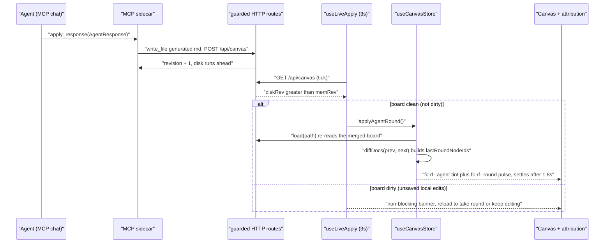
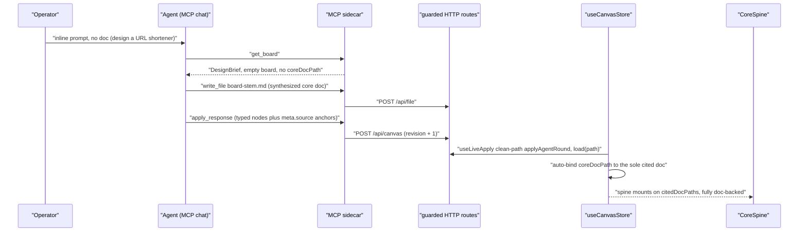

# 005-mcp-live-bridge — MCP-Native Live Bridge Design

- Reframe the 004 generation loop into an MCP-native **live** bridge: the agent self-serves over the existing MCP tools, its changes apply **live** with visible attribution, and you design either from a markdown doc or from an inline prompt — the copy-paste Generation Kit drops to a labeled non-MCP fallback.
- Scope — in: live-apply engine, node-origin attribution + last-round pulse, optional non-blocking change-review, from-scratch doc-backed entry, kit demotion + MCP headline; out: in-app prompt box, create-board MCP tool, schema bump, per-change undo (BL-008).
- Key architecture decisions: cockpit → the agent's own MCP chat; apply mode → live + persistent agent tint + last-round pulse; from-scratch → doc-backed (agent writes the core doc, then decomposes); board bootstrap → require a board open; kit → keep as a labeled fallback.
- Status **ABORTED 2026-06-30** (was draft; never planned or executed); author human (scope) + `flowcode:designer-agent` (technical depth); dated 2026-06-29.
- Sibling plan: `005-mcp-live-bridge-plan.md` (created after this design is approved).

---

> **✗ ABORTED — 2026-06-30 (david-ds-teles).** Design-only draft; never planned, never executed. A code-grounded re-analysis finds it **unnecessary as a plan**: the MCP round-trip it builds on already shipped (plan 004), and its substantive decisions already landed via two post-design direct-builds (the 2026-06-29 8-fix UX bugfix and the 2026-06-30 core-doc bugfix). What remained un-built is quickfix-scale **local** polish — and the "live" layer is a web-app disk-poll auto-refresh, **not** anything MCP-native, so the "MCP-Native Live Bridge" title over-frames it. The Vision-B *direction* was sound; the *plan* is redundant. Kept on disk as history; not deleted. See the per-decision tally below.

### Abort Analysis — 2026-06-30 (design vs. shipped code)

| Decision | Status today | Evidence |
|----------|--------------|----------|
| D1 cockpit = harness chat | **Shipped/moot** — no in-app chat; off-workflow `agent-fab` deleted | project-log 2026-06-29 |
| D2 always-on live auto-apply | **Un-built (only real nugget)** — `use-round-ready.ts` polls only while `pendingReview` + manual reload; a harness-driven round (no in-app Submit) never sets `pendingReview`, so it never surfaces live | `components/canvas/use-round-ready.ts:27,45` |
| D3 agent node tint + last-round pulse | **Un-built** — adapter threads edge origin only; no `fc-rf--agent`/`fc-rf--round`, no `agent-bridge.css` | `lib/canvas/adapter.ts:48` |
| D4 from-scratch synth + auto-bind coreDocPath | **Shipped** — FROM-SCRATCH contract in `generation-kit.ts`; `store.load` auto-binds the sole cited doc (tagged "005-D4") | `lib/canvas/generation-kit.ts:20-31`, `lib/canvas/store.ts:204-216` |
| D5 require board open; no `create_board` | **Shipped/moot** — reality; no tool added | `mcp/flowcanvas-mcp.ts` |
| D6 demote kit; passive MCP-bridge headline | **Partly moot / cosmetic** — worst kit entry (FAB) already gone; the "headline" is passive status the design admits the app can't truly probe | project-log 2026-06-29; § Decision 6 |
| D7 no schema bump (`0.3` stays) | **Premise stale** — board schema is now `0.4` (edges quickfix), unrelated to this plan | `lib/canvas/jsoncanvas.ts:188` |

> **Residual nugget (not silently dropped):** **D2** always-on live-apply is the one piece with genuine user value — without it a harness-driven round needs a manual reload to appear. It is local-poll plumbing (≈1 file), not MCP, and is parked here for a future quickfix decision, not carried as a plan.

> **✓ DIRECTION RESOLVED (2026-06-29).** An earlier review pushed for an in-app MCP *cockpit* (a chat panel inside Flowcanvas, model wired over MCP). A research spike disproved that wiring: MCP sampling is host-tool-initiated only, is unsupported by Claude Code, and is being deprecated (SEP-2322); MCP never vends a model (see § Research References). The operator therefore **locked Vision B — "agent-driven canvas": Flowcanvas is the live visual surface for the agent the operator already drives over MCP (Claude Code / Cursor); there is no in-app chat and no in-app model.** Decision 1 below (cockpit = the agent's own MCP chat) is the correct, now research-justified choice, and D2–D7 stand as the "watch it happen" layer. An in-app cockpit with its own configured/local model is a *different product* (Vision A), deferred and out of scope here.

## Problem Statement

Plan 004 shipped the agent generation loop with a **copy-paste "Generation Kit" as its headline** — the operator copies a prompt into an LLM and pastes JSON back. That frames Flowcanvas as manual prompt-engineering rather than the live, design-together bridge it was meant to be (the Antigravity / Codex model: connect once, then just talk to the agent and watch the work happen in the tool). The MCP plumbing to do it live already exists — `get_board`, `read_file` / `resolve_paths`, `write_file`, `apply_response` in `mcp/flowcanvas-mcp.ts` — but three things block the intended experience:

1. The app only watches disk **inside a submit→review window** (`use-round-ready.ts` polls only while `session.pendingReview === true`), so it never notices agent changes otherwise.
2. Agent changes land behind a **blocking banner→reload→change-review gate** rather than appearing live.
3. The agent has **no first-class way to design from an inline prompt** — `generation-kit.ts` frames everything as "decompose a markdown document," and the living core spine only appears when a doc backs the nodes.

Meanwhile the copy-paste kit is the most prominent entry point in the UI (a first-class toolbar button, the first `AgentFab` menu item, and the leftmost `ExportPanel` tab).

## Scope

**In scope:**
- Live-apply engine: always-on disk watch + auto-apply of the agent delta (replacing the `pendingReview`-gated poll), guarded so it never clobbers unsaved local edits.
- Node origin attribution: thread `meta.origin` through `adapter.ts` to a `data-origin` / CSS hook on the node widgets (mirroring the existing edge-origin styling) → a persistent agent tint.
- Last-round delta highlight: a transient pulse on the most-recent agent round's nodes/edges (reusing the `diffDocs` snapshot + the existing `fc-rf--linked` pulse pattern), settling after it has been seen.
- Optional, non-blocking change-review: keep `ReviewPanel` / `diffDocs` / accept-discard reachable on demand; remove the mandatory banner→reload→review gate.
- From-scratch entry: extend the single-source `generation-kit.ts` (system prompt, MCP loop how-to, and a second "synthesize-then-decompose" framing) and its propagation (`brief.responseContract`, `docs/flowcanvas-agent-contract.md`).
- Kit demotion + MCP headline: relabel / reorder the three kit entry points (toolbar `generation-kit-button`, `AgentFab`, `ExportPanel` tab); surface an MCP-bridge / status affordance as the new headline.

**Out of scope:**
- In-app prompt box / request channel — the cockpit is the agent's own chat.
- New MCP `create_board` tool — require a board open instead.
- Per-change cherry-pick reject / branching history / full undo stack (**BL-008**) · multi-user / presence / CRDT (BL-003) · auth / hosting (BL-004).
- Schema-version bump — `schemaVersion` stays `0.3` (`meta.origin` and `meta.source` already exist).
- Replacing the 3-second poll with WebSocket / SSE / file-watch push — always-on polling + auto-apply is the mechanism; a push transport is a possible later optimization, not part of this plan.

## Solution Overview

Reframe the loop around the MCP bridge as the primary surface, **reusing the existing plumbing rather than rebuilding it**. The agent self-serves over today's tools (`get_board`, `read_file` / `resolve_paths`, `write_file`, `apply_response`); the operator drives entirely from their MCP client's chat. Make the canvas watch disk continuously (not only during a review window) and auto-apply the agent's delta into the live board, guarded so it never overwrites unsaved local edits — this replaces the banner→reload→mandatory-review flow. Surface the `meta.origin` field that already exists: thread it through the adapter to a node CSS hook for a persistent agent tint (mirroring agent edges, which already glow neon cyan), and add a transient last-round pulse computed from the existing review snapshot / `diffDocs`; keep `ReviewPanel` / accept-discard reachable on demand as optional inspection, not a gate.

For entry points, extend the single-source `generation-kit.ts` contract with a second framing: *existing doc → decompose* (today's path); *inline prompt, no doc → synthesize a core markdown doc first (via `write_file`), then decompose it and stamp `meta.source` anchors* — so the living, editable, bidirectionally-linked core spine works identically whether the operator started from a doc or a prompt, and the operator only needs a board open for the agent to write to. Finally, demote the copy-paste kit: relabel / reorder its entry points so MCP is the visible headline (a bridge / connection affordance) and the kit is a clearly-marked "no-MCP fallback," with the underlying `buildKit` text unchanged.

This approach wins because it is almost entirely a **UX, contract, and visual reframe over plumbing that already exists and is already tested** — no schema change, no new persistence, no new MCP transport. It honors the four operator-locked decisions, reuses the proven edge-origin styling and the 004 spine investment, and keeps the non-MCP escape hatch intact.

## Alternatives Considered

High-level approach alternatives evaluated before this design was locked in. Per-component decisions live under Architecture Decisions.

| Approach | Why considered | Why rejected |
|----------|---------------|--------------|
| In-app prompt box (Flowcanvas as cockpit) | Single-surface UX; the operator never leaves Flowcanvas | A research spike proved it can't be powered over MCP (sampling is host-tool-initiated, unsupported by Claude Code, deprecating; MCP never vends a model) — it would need its own configured/local model, a separate product (Vision A, deferred). See § Research References |
| Canvas-native from-scratch (no backing doc) | Lighter for quick sketches; no doc-synthesis step | Breaks the living-core-spine symmetry 004 invested in; doc-backed keeps one model |
| Keep the mandatory change-review gate | Strongest human-in-the-loop safety | It is exactly the friction the operator is reacting to; demote to optional |
| Remove the copy-paste kit entirely | Cleanest, MCP-only surface | Cuts off agents that cannot connect over MCP; keep it as a labeled fallback |
| Add a create-board MCP tool | Lets the agent bootstrap a board autonomously | The app always has a board open and the operator is already watching Flowcanvas; needless surface |
| Replace the poll with WebSocket / SSE / file-watch | True push, lower latency | A transport rewrite for marginal gain; always-on 3s polling is "live enough" for design-together |

**Chosen:** the MCP-native live bridge described in Solution Overview.
**Key rationale:** the live bridge is already 80% built in plumbing; the work is reframing the experience (live apply, attribution, dual entry, kit demotion) without touching schema or persistence.

## Architecture Decisions

The seven operator-locked decisions (D1–D7) are formalized below, each with the rejected options it ruled out, followed by the implementation sub-decisions they imply.

### Decision 1: Cockpit is the agent's own MCP chat (D1)

**Options considered:**

| Option | Pros | Cons |
|--------|------|------|
| A — In-app prompt box / request channel | One surface; operator never leaves Flowcanvas | Needs a request channel + intent-polling surface the app does not have; duplicates the agent's own chat; net-new code; operator rejected it |
| B — The agent's own MCP chat (Claude Desktop / Cursor / Codex) | Zero new surface; matches the Antigravity / Codex model; operator-approved | Operator must run an MCP client; no in-app conversation transcript |

**Decision:** B — the operator types in their MCP client (the harness — Claude Code / Cursor); Flowcanvas is the live board, not the prompt box. **This is Vision B, locked by the operator 2026-06-29.**
**Rationale (research-backed):** an in-app chat cannot be powered "over MCP with no key." MCP *sampling* — the only way a server borrows the host's model — fires only inside a host-initiated tool handler (SDK v1.29.0), so Flowcanvas (the server) can never *initiate* a turn from an in-app panel; it is also unsupported by Claude Code and is being deprecated (SEP-2322); and no MCP role ever vends a model (see `mcp-sampling-research.md`, `mcp-client-capability-support-research.md`). An in-app cockpit would therefore need its own configured/local model — a separate product, deferred. The MCP sidecar already exposes the full round-trip (`get_board` / `write_file` / `apply_response`); the operator drives from the harness chat they already have. No `submitToAgent` text channel is added — `session.intent` continues to carry the framing the agent reads via the brief.

### Decision 2: Live auto-apply, dirty-guarded (D2)

**Options considered:**

| Option | Pros | Cons |
|--------|------|------|
| A — Keep the banner → reload → mandatory change-review gate | Strongest human-in-the-loop | Exactly the friction the operator is reacting to; not "live" |
| B — Always-on poll, auto-apply when clean, non-blocking banner when dirty | Live feel; reuses `use-round-ready` + `load` + `/api/canvas`; never clobbers unsaved edits | Up to ~3s lag; a dirty board defers the round; a subsequent operator Save can overwrite an un-applied round (mitigated, see Risks) |
| C — Auto-merge non-conflicting deltas while dirty | Never blocks | Needs a real per-field 3-way merge (BL-008); ambiguous last-writer; high risk for marginal gain |

**Decision:** B — replace the `pendingReview`-gated poll with an always-on watcher that auto-applies when the in-memory board is clean and surfaces a non-blocking banner when it is dirty.
**Rationale + sub-decisions:**
- **Always-on poll.** `use-round-ready.ts` becomes `use-live-apply.ts`: the poll runs whenever a board `path` is set (not only while `pendingReview`). `POLL_MS` stays `3000` (see § Enums & Constants).
- **Collision policy (resolves Open Question 1).** On `diskRev > memRev`: if the store is **not dirty**, call the new `applyAgentRound()` (reload the already-merged board from disk); if it **is dirty**, hold the round and show the non-blocking banner so the operator chooses *reload to take the round* (discards local edits) or *keep editing*. Never silently clobber either side. Merge-while-dirty (Option C) is explicitly deferred to BL-008.
- **Apply mechanism = reload.** Because the agent's `apply_response` writes the merged `.canvas` directly via `/api/canvas` (bypassing the store), disk is authoritative; `applyAgentRound()` reconciles by re-reading via the existing `load(path)` — no second merge in the client.

### Decision 3: Dual agent attribution — persistent tint + transient pulse (D3)

**Options considered:**

| Option | Pros | Cons |
|--------|------|------|
| A — Persistent origin tint only | Agent-authored nodes always distinguishable | A returning operator cannot tell what *this* round changed |
| B — Transient last-round pulse only | Draws the eye to the new delta | Nothing marks agent authorship at rest |
| C — Both: persistent tint + transient pulse | Authorship at rest *and* "what just changed" | Two visual channels to keep within accent discipline (§0 rule 10) |

**Decision:** C — both, mirroring the proven edge-origin styling.
**Rationale + sub-decisions:**
- **Node-origin → CSS data-flow.** Mirror the edge pattern (`adapter` sets `data:{origin}` → `labeled-edge` applies `fc-edge-label--${origin}`). `adapter.toReactFlow` gains one line: it stamps `className: 'fc-rf--agent'` on the React Flow wrapper when `n.meta?.origin === 'agent'` (the wrapper-class convention already used for `fc-rf--connect` / `fc-rf--linked`). No node component is edited; the tint rides on `.react-flow__node.fc-rf--agent`.
- **Tint token.** A low-alpha neon-cyan left accent + faint edge-glow keyed to `--color-neon-cyan` — the same hue agent edges already use (§0 rule 10), so origin reads consistently across nodes and edges. It is an accent, never a fill, and is paired with the inspector's existing origin/provenance row so color is not the only signal (§11).
- **Last-round pulse (resolves Open Question 4).** Reuse the `fc-rf--linked` mechanism: `applyAgentRound()` computes the changed set via the pure `diffDocs(prevDoc, nextDoc)`, stores it in transient `lastRoundNodeIds` / `lastRoundEdgeIds`, and `canvas-shell` injects a new one-shot class `fc-rf--round` (a cyan keyframe modeled on `fc-rf--linked`, kept separate so the agent pulse and the spine→canvas violet pulse stay independent). "Seen" = a fixed settle timer (`ROUND_PULSE_MS`) that calls `seenRound()` to clear the set; a new round re-arms it. Viewport-intersection tracking was rejected as over-engineered for a single-user board.
- **Change-review stays reachable.** `ReviewPanel` / `reviewDiff` / `acceptRound` / `discardRound` are unchanged and remain on the right-dock Review tab — now an on-demand inspector, no longer a gate.

### Decision 4: From-scratch is doc-backed — synthesize then decompose (D4)

**Options considered:**

| Option | Pros | Cons |
|--------|------|------|
| A — Canvas-native from-scratch (no backing doc) | Lighter for a quick sketch | Breaks living-core-spine symmetry; two divergent models to maintain |
| B — Doc-backed: agent synthesizes a core markdown doc, then decomposes it | One model; the spine works identically to the from-doc path | Depends on the agent's doc-synthesis quality; one extra `write_file` round-trip |

**Decision:** B — on an inline prompt with no doc, the agent first writes a core markdown design doc, then decomposes it and stamps `meta.source` anchors.
**Rationale + sub-decisions:**
- **Contract additions (single source).** Add a `FROM_SCRATCH` block to `generation-kit.ts` joined into `schemaContract` (so it propagates verbatim to `brief.responseContract`, `docs/flowcanvas-agent-contract.md`, the MCP `get_generation_kit` tool / resource, and the UI kit copy) plus a branch step in `mcpHowTo`. The block instructs: when the brief has no `coreDocPath` and the board is empty, `write_file` `"<board-stem>.md"` (frontmatter + ATX headings) first, include it in `generatedFiles`, then decompose *that* doc exactly as the doc-backed path — `meta.kind` per node, `meta.source = { path:"<board-stem>.md", anchor }` on every node.
- **Auto-bind `coreDocPath`.** Because `AgentResponse` carries no session field, `store.load()` gains a small rule: if `session.coreDocPath` is unset and `citedDocPaths(nodes).length === 1`, stamp that sole cited doc as `coreDocPath` (persisted on the next save). This makes the editable spine bind automatically, so the from-scratch path reaches the same living spine the from-doc path does with no extra operator click. `setCoreDoc` (the spine switcher) remains the manual override when multiple docs are cited.

### Decision 5: Require a board open — no `create_board` tool (D5)

**Options considered:**

| Option | Pros | Cons |
|--------|------|------|
| A — New `create_board` MCP tool | Agent can bootstrap a board headless | Needless surface; the app always has a board open and the operator is watching |
| B — Require a board open (reuse `get_active_board` / active-board pointer) | Zero new tool; the agent writes into the board the operator is looking at | Agent cannot bootstrap a board with no app open (acceptable — operator opens one) |

**Decision:** B — `resolveRef()` already throws `"No active board — open a board in Flowcanvas first"`; the empty-board state (`data-testid="empty-board"`, `empty-extract`) already routes the operator to open or extract. No MCP change.
**Rationale:** the bridge is a design-*together* loop; the operator is present and has a board (even an `untitled-*.canvas` from `newBoard`). A headless create tool would only serve a use case D1 already excluded.

### Decision 6: Demote the kit; MCP bridge status is the headline (D6)

**Options considered:**

| Option | Pros | Cons |
|--------|------|------|
| A — Remove the copy-paste kit entirely | Cleanest, MCP-only | Cuts off agents that cannot connect over MCP |
| B — Keep the kit first-class | No UI churn | Keeps the manual prompt-engineering framing the plan is correcting |
| C — Demote the kit to a labeled fallback; surface an MCP-bridge status headline | MCP is the visible primary path; escape hatch preserved | Bridge status is necessarily passive (no live MCP socket probe exists) |

**Decision:** C — relabel/reorder the three kit entry points as a fallback and make an MCP-bridge status affordance the headline.
**Rationale + sub-decisions (resolves Open Question 3):**
- **Headline = passive status, not an actionable connect.** The app cannot open or probe the agent's MCP socket (a live MCP-status probe was deferred in plan 002 and stays out of scope). The headline therefore reports what the app *can* know: the watcher is armed (a board is open and the poll is live) and the last applied round time, derived from the new transient `lastRoundAt`. A help popover explains how to point an MCP client at `flowcanvas-mcp` and references `get_generation_kit` / `flowcanvas://generation-kit`.
- **Demotion.** Relabel the toolbar `generation-kit-button` and demote it behind the bridge affordance; reorder `AgentFab` so the kit item (`agent-fab-kit`) drops to last and is labeled "no-MCP fallback"; move the `ExportPanel` `agent-tab-kit` to the trailing tab position with a one-line "MCP is the primary path" note. `buildKit` text is unchanged.

### Decision 7: No schema-version bump (D7)

**Options considered:**

| Option | Pros | Cons |
|--------|------|------|
| A — Bump to `0.4` to model new fields | Room for new persisted state | Migration ladder churn for fields nothing actually persists |
| B — Reuse `meta.origin` (`NodeOrigin`) + `meta.source` (`NodeSource`); stay `0.3` | Zero migration; attribution + provenance already on the model | None material |

**Decision:** B — `schemaVersion` stays `'0.3'`. Attribution reuses `NodeMeta.origin`; the spine reuses `NodeMeta.source`; every new field in this plan is transient store state (never written to disk).
**Rationale:** `nodeFromAgent` already stamps `meta.origin:'agent'` on every agent create/update (`brief.ts:259`), so agent items are already distinguishable in the persisted doc — this plan only *surfaces* what is already there.

---

## Technical Design

### Data Models

**No new persisted types and no schema change.** `schemaVersion` stays `'0.3'` (`FlowcanvasExt.schemaVersion`, `jsoncanvas.ts:168`); the `.canvas` JSON on disk is the only datastore and gains no fields. Attribution reuses `NodeMeta.origin` (`NodeOrigin = 'user'|'agent'|'import'`, `jsoncanvas.ts:8`) and the from-scratch spine reuses `NodeMeta.source` (`NodeSource`, `jsoncanvas.ts:82`) — both already present and already stamped by `nodeFromAgent` (`brief.ts:252`). `EdgeOrigin` (`jsoncanvas.ts:77`) is unchanged.

All new state is **transient Zustand store state**, never persisted (it sits alongside the existing transient fields like `linkedNodeIds` / `reviewState`):

```ts
// lib/canvas/store.ts — added to interface CanvasState (transient, never persisted)
interface CanvasState {
  // ...existing fields...
  lastRoundNodeIds: string[]   // node ids changed by the most recent auto-applied agent round → fc-rf--round pulse
  lastRoundEdgeIds: string[]   // edge ids changed by that round (mirrors nodes; edge pulse is optional)
  lastRoundAt: string | null   // ISO 8601 timestamp of the last applied round → drives the MCP-bridge "last round" label
}
// initial values: lastRoundNodeIds: [], lastRoundEdgeIds: [], lastRoundAt: null
// reset to []/null in newBoard / clearBoard / load alongside linkedNodeIds (same lifecycle)
```

The persisted `SessionMeta.pendingReview` / `baseRevision` / `coreDocPath` are reused unchanged. `pendingReview` now means only "an un-accepted round exists to review" (drives the Review-tab dot + loads `reviewState`); it no longer gates the watcher.

### Enums & Constants

```text
NodeOrigin (jsoncanvas.ts:8) — UNCHANGED, reused:
  'user'   — operator-authored node (no tint; rest state)
  'agent'  — agent-authored node → persistent fc-rf--agent tint (this plan surfaces it)
  'import' — extraction-/import-seeded node (no tint in v005; reserved)
  Only 'agent' is tinted on nodes — mirrors agent edges (neon cyan). user/import stay neutral.

New constants (no new enum):
  POLL_MS = 3000           — use-live-apply.ts disk-watch cadence; VALUE UNCHANGED from use-round-ready,
                             now ungated (runs whenever a board path is set). Resolves Open Question 2.
  ROUND_PULSE_MS = 1800    — settle timer; canvas-shell calls seenRound() after this to clear the pulse
                             set (one-shot fc-round-pulse keyframe is ~1.6s; the timer adds slack).

New CSS class / keyframe names (RF-wrapper convention, mirroring fc-rf--connect / fc-rf--linked):
  fc-rf--agent   — persistent agent-origin node tint (set by adapter on the RF wrapper)
  fc-rf--round   — transient last-round pulse (injected by canvas-shell, like fc-rf--linked)
  fc-round-pulse — the one-shot cyan keyframe for fc-rf--round
  Lives in a new partial app/styles/agent-bridge.css (@imported from globals.css, like agent-fab.css).

New / changed data-testids (UI gate selects the final shape):
  mcp-bridge          — toolbar bridge-status headline button (replaces generation-kit-button as headline)
  mcp-bridge-popover  — bridge help/status popover
  round-ready         — REPURPOSED: now the dirty-collision banner (was the mandatory round-ready banner)
  agent-fab-kit       — kept; reordered last + relabeled "no-MCP fallback"
  agent-tab-kit       — kept; moved to trailing tab + relabeled
```

### API / Interface Contracts

Concrete signatures for every new/changed symbol. Real types, grounded in the current code.

```ts
// ── lib/canvas/store.ts — NEW transient actions (existing actions unchanged) ──

// Clean-path auto-apply: snapshot the current doc, reload the already-merged board from disk
// (the agent persisted it over MCP), diff to find what the round changed, arm the pulse + stamp time.
applyAgentRound: () => Promise<void>
// implementation shape:
//   const { path, doc: prev } = get(); if (!path || !prev) return
//   await get().load(path)                                  // reuse the existing adoption path
//   const next = get().doc; if (!next) return
//   const d = diffDocs(prev, next)                          // pure, from lib/canvas/review.ts
//   set({ lastRoundNodeIds: [...d.nodes.added, ...d.nodes.updated],
//         lastRoundEdgeIds: [...d.edges.added, ...d.edges.updated],
//         lastRoundAt: new Date().toISOString() })

// Pulse settled (called by canvas-shell after ROUND_PULSE_MS) — clears the highlight sets only.
seenRound: () => void
//   set({ lastRoundNodeIds: [], lastRoundEdgeIds: [] })

// load(path) gains one internal rule (signature unchanged): after migrateDoc, if
// session.coreDocPath is unset AND citedDocPaths(next.nodes).length === 1, stamp that path as
// coreDocPath (Decision 4 auto-bind) before the set(); persisted on the next save.
```

```ts
// ── components/canvas/use-live-apply.ts — RENAMES/REPLACES use-round-ready.ts ──
export interface LiveApplyState {
  // Non-blocking dirty-collision banner: shown only when disk is ahead AND the board is dirty.
  banner: {
    show: boolean
    reload: () => void   // take the round: calls applyAgentRound() (discards local edits)
    dismiss: () => void  // hide the banner for this disk revision (re-arms on the next bump)
  }
}
export function useLiveApply(): LiveApplyState
// Always-on: effect keyed on [path] only. Each POLL_MS tick reads getCanvas(path).revision,
// compares to useCanvasStore.getState().doc revision, and reads .dirty fresh via getState():
//   diskRev > memRev && !dirty  -> void useCanvasStore.getState().applyAgentRound()
//   diskRev > memRev &&  dirty  -> setPendingRev(diskRev)  (drives banner.show)
//   else                        -> no-op
```

```ts
// ── lib/canvas/adapter.ts — toReactFlow: one added field on the RFNode (signature unchanged) ──
// Inside the nodes.map(...) return object, mirroring the edge data:{origin} pattern:
className: n.meta?.origin === 'agent' ? 'fc-rf--agent' : undefined,
// canvas-shell already composes className safely:
//   [n.className, 'fc-rf--round'].filter(Boolean).join(' ')   (existing fc-rf--linked memo)
```

```ts
// ── lib/canvas/generation-kit.ts — content grows; KitSections interface UNCHANGED ──
export interface KitSections {            // unchanged
  systemPrompt: string
  schemaContract: string
  mcpHowTo: string
  workedExample: string
}
// New private const joined into schemaContract so it propagates to brief.responseContract,
// docs/flowcanvas-agent-contract.md, the MCP get_generation_kit tool/resource, and UI kit copy:
const FROM_SCRATCH = `FROM SCRATCH (inline prompt, no core doc): ...`   // see Decision 4
// kitSections() change:
//   schemaContract: [SCHEMA_CONTRACT_BASE, KIND_CATALOG, SLUG_RULE, FROM_SCRATCH].join('\n\n')
//   mcpHowTo: + a branch step "1b. If get_board returns no coreDocPath and an empty board,
//             write_file '<board-stem>.md' FIRST (see FROM SCRATCH), then proceed."
// buildKit(markdown?) is UNCHANGED (still renders the same four sections + optional payload).
```

No MCP tool signatures change (no `create_board`; from-scratch uses the existing `write_file` + `apply_response`). `/api/canvas` POST is unchanged — its `bump`/`bump:false` semantics already support the loop. `docs/flowcanvas-agent-contract.md` is regenerated from `kitSections().schemaContract` (it is the generated mirror, "do not hand-edit").

### Sequence / Flow Diagrams

LIVE apply loop — agent writes over MCP, the always-on poll detects the revision bump, and the board auto-applies (clean) or defers to the banner (dirty), then tints + pulses.



From-scratch synthesize-then-decompose — inline prompt with no doc; the agent writes a core doc first, decomposes it with `meta.source` anchors, and the spine binds.



### Module Boundaries

| Module | Responsibility | Changes Required |
|--------|---------------|-----------------|
| `lib/canvas/store.ts` | Canvas state + agent round-trip + spine + review | Add transient `lastRoundNodeIds` / `lastRoundEdgeIds` / `lastRoundAt`; add `applyAgentRound` + `seenRound`; auto-bind `coreDocPath` in `load`; reset the new fields in `newBoard` / `clearBoard` / `load` |
| `lib/canvas/adapter.ts` | `FlowcanvasDoc` to React Flow translation | One added field in `toReactFlow`: `className: n.meta?.origin === 'agent' ? 'fc-rf--agent' : undefined` |
| `components/canvas/use-live-apply.ts` | Always-on disk watcher (renames `use-round-ready.ts`) | Ungate the poll (key on `path`, not `pendingReview`); clean→`applyAgentRound`, dirty→banner; export `LiveApplyState.banner` |
| `components/canvas/canvas-shell.tsx` | Tri-pane shell + RF mount + pulse injection | Swap `useRoundReady`→`useLiveApply`; inject `fc-rf--round` for `lastRoundNodeIds` (mirror the `linkedNodeIds` memo); `seenRound()` settle timer; render the dirty banner; mount the bridge headline |
| `lib/canvas/generation-kit.ts` · `lib/canvas/brief.ts` · `docs/flowcanvas-agent-contract.md` | Single-source agent contract | Add `FROM_SCRATCH` to `schemaContract` + an `mcpHowTo` branch; `brief.responseContract` inherits it automatically; regenerate the contract doc |
| `components/canvas/nodes/*` + CSS | Node widgets + styling | No component edits; add `app/styles/agent-bridge.css` (`.fc-rf--agent` tint, `.fc-rf--round` + `fc-round-pulse`) and `@import` it from `globals.css` |
| `components/canvas/canvas-toolbar.tsx` · `agent-fab.tsx` · `export-panel.tsx` | Kit entry points | Demote/relabel `generation-kit-button`, reorder `agent-fab-kit` last, move `agent-tab-kit` trailing; add the `mcp-bridge` status headline + `mcp-bridge-popover` help |
| `components/canvas/review-panel.tsx` | On-demand change-review | No logic change; remains reachable on the Review dock tab — now optional, not a gate |

---

## Constraints & Risks

| Constraint / Risk | Impact | Mitigation |
|-------------------|--------|-----------|
| Live apply over unsaved local edits (dirty-clobber) | Could lose operator edits or the agent round | Clean/dirty gate (Decision 2): auto-apply only when clean; dirty → non-blocking banner; operator picks reload-to-take or keep-editing; never silent |
| Operator Save while disk is ahead overwrites an un-applied round | `save()` bumps from `memRev` and writes over `diskRev`, losing the agent round on disk | Banner stays visible while disk is ahead with a one-click reload; single-user design-together loop; full reconcile/merge deferred to BL-008 |
| Always-on 3s poll latency + cost | Up to ~3s lag; one `GET /api/canvas` per 3s per open board | Local `fs` read is cheap; revision compare short-circuits before any apply; no new transport added; SSE/file-watch push is a documented later optimization (out of scope) |
| MCP `apply_response` bypasses the store (writes disk directly) | In-memory store can diverge from the authoritative disk doc | Disk is authoritative; `applyAgentRound` reconciles via `load(path)`; no client re-merge of the same revision; `get_board`'s `bump:false` stamp keeps `baseRevision` valid |
| From-scratch quality depends on the agent's doc synthesis | A weak synthesized core doc yields a weak board | `FROM_SCRATCH` makes the doc explicit (frontmatter + ATX headings + `meta.source`); doc-backed means the operator edits the spine + re-submits to refine; deterministic decomposition rules unchanged |
| Two cyan attribution channels vs accent discipline (§0 r10) | Agent tint + agent pulse + agent edges could over-saturate cyan | Persistent tint is a low-alpha left accent (not a fill); the pulse is one-shot and fades to nothing; `prefers-reduced-motion` honored; origin also shown in the inspector (color is not the only signal, §11) |
| Bridge "status" cannot truly probe the MCP socket | The headline may imply a connection the app cannot verify | Frame it as passive ("watching" + last-round time from `lastRoundAt`), never "connected"; the popover explains how to wire an MCP client; a live MCP-status probe stays deferred |

## Research References

A research spike (2026-06-29) settled the cockpit-wiring direction (D1) and ruled out the in-app-cockpit alternative:

| Research | Key finding | File |
|----------|-------------|------|
| MCP sampling | `sampling/createMessage` lets a server borrow the host's model, but only inside a host-initiated tool handler (SDK v1.29.0) — a server-hosted chat cannot initiate a turn; human-approval-gated | `.flowcode/researches/mcp-sampling-research.md` |
| MCP client support | Sampling is implemented by only a few clients (VS Code+Copilot, Cursor, Cline); **Claude Code and Claude Desktop do not** — and it is being deprecated (SEP-2322) | `.flowcode/researches/mcp-client-capability-support-research.md` |
| MCP elicitation | `elicitation/create` (spec 2025-06-18) gathers structured input from the *user*, not a model completion — not a brain, but usable to enrich the design loop | `.flowcode/researches/mcp-elicitation-research.md` |

No new library or transport is added — the MCP SDK (`@modelcontextprotocol/sdk` ^1.29.0) is already in use (`mcp/flowcanvas-mcp.ts`); React Flow / Zustand / Tailwind v4 are unchanged. The plan remains a UX, contract, and visual reframe over plumbing that already exists and is tested.

## Open Questions

All four scoping-stage questions are resolved by the decisions above. None block implementation.

- [x] Live auto-apply vs. unsaved local edits — **resolved (Decision 2):** auto-apply only when clean; non-blocking banner when dirty; operator chooses reload-to-take or keep-editing. Merge-while-dirty deferred to BL-008.
- [x] Always-on poll cost and interval — **resolved (§ Enums & Constants):** keep `POLL_MS = 3000`, now ungated; the local `fs` read is cheap and the revision compare short-circuits. A push transport is a later optimization, out of scope.
- [x] MCP-headline affordance — **resolved (Decision 6 + UI gate):** a passive "watching · last round HH:MM" status (from `lastRoundAt`) plus a help popover; not an actionable connect, because the app cannot probe the agent's MCP socket.
- [x] Last-round pulse lifecycle — **resolved (Decision 3):** a fixed `ROUND_PULSE_MS` settle timer calls `seenRound()` to clear the pulse; a new round re-arms it. Viewport-intersection tracking rejected as over-engineered.

Residual (non-blocking, not in this plan): a **live MCP-connection probe** (true "connected" status) remains deferred — the bridge headline reports watcher/last-round state only until a probe transport exists. **Resolved 2026-06-29:** the cockpit-wiring question (in-app vs. harness chat) is closed — the operator locked **Vision B** (agent-driven canvas; no in-app chat, no in-app model) after the research spike; an in-app, configured-model cockpit is a separate, deferred product.
