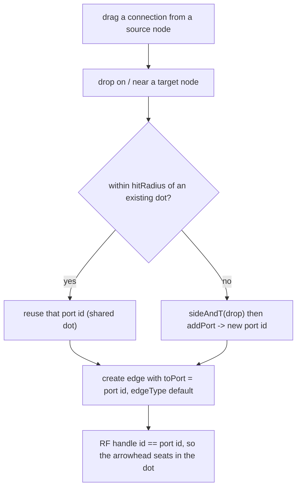
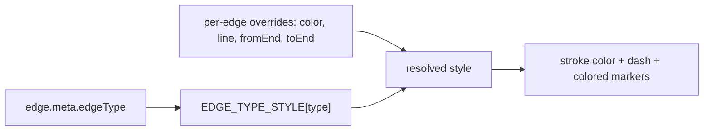

# 006-semantic-edges — Semantic Edges & Connection Ports Design

- Replaces the 005-edges free-form/floating edge model with three locked specs: dot-anchored **connection ports** (multiple per side, reused or created on connect), a **reusable color picker**, and **flow-typed edges** whose color + line + head encode the relationship.
- Scope — in: connection ports + dynamic handles, an `EdgeType` flow taxonomy + legend, a shared `<ColorPicker>`, schema `0.4 → 0.5` + migration, agent parity. Out: rewriting waypoints/label-drag (kept as-is), node-port auto-routing, a board-wide theme editor.
- Key decisions: ports are the single geometric source of truth (D1); the flow taxonomy drives a default `{color, line, head}` legend (D2); type sets the default, the picker overrides per-edge color (D3); ports materialize at load so render only reads them (D4); Shift held during a bend drag snaps segment angles to 45° increments (D5).
- Status approved; author david-ds-teles; dated 2026-06-30.
- Sibling plan: `006-semantic-edges-plan.md` (created after this design is approved).

---

## Problem Statement

The 005-edges work (shipped as a direct-build QUICKFIX, two correction rounds) regressed the connection model and missed two operator requirements. Concretely, verified against the code:

1. **Connection dots became useless.** Endpoints now float to the ray–perimeter intersection (`labeled-edge.tsx:368-379`) while the four side handle dots are hidden at rest (`edges.css:125-133`). Arrowheads land "loose" on the bare perimeter, never seated in a dot. The operator wants dots back as real anchors — and richer than before: **more than one dot per side, where a new line either reuses an existing dot or creates a new one.**

2. **No real color picker.** Edges expose only a six-preset swatch row (`labeled-edge.tsx:55,249-273`). The operator wants an actual color picker, built as a **shared component reused by other components** — the app already has the pattern (`node-format-bar.tsx` native `<input type="color">` for node text/fill) but it is node-only and not generalized.

3. **Edges carry no meaning.** Visual style is 100% decoupled from the relationship: setting a type (`store.setEdgeRel`, `store.ts:533-542`) changes only the label text — never color, line, or head. In a system-design tool, an arrow should be identifiable at a glance as data flow vs. a request vs. an event. Today it is arbitrary decoration.

Without this change the canvas cannot communicate system semantics, the connection affordance reads as broken, and color is unmanaged.

## Scope

**In scope:**
- `ConnectionPort` model (dots) — multiple per node side, stable ids, reuse-or-create on connect, drag to reposition along a side.
- Dynamic React Flow handles — one `<Handle>` per port; arrowheads seat exactly in the dot.
- `EdgeType` flow taxonomy (data flow · request · response · event · dependency · reference) + an `EDGE_TYPE_STYLE` legend mapping each type → `{color, line, fromEnd, toEnd}`.
- A visible legend UI that doubles as the edge-type picker.
- A shared `<ColorPicker>` component; wire edges to it (per-edge color override) and re-wire node text/fill to it.
- Style resolution: type default, overridden by explicit per-edge fields.
- **Shift-snap on bend drag** — holding Shift while creating/dragging a `meta.points` waypoint snaps each adjacent segment angle to 45° increments (so horizontal/vertical/diagonal align cleanly).
- Schema `0.4 → 0.5` (additive) + a migration that ports existing edges and maps old `rel` → `edgeType`.
- Full agent parity — `AgentEdge`/`BriefEdge`, `buildBrief`/`applyResponse`, the generation-kit contract + mirror doc.

**Out of scope:**
- The `meta.points` waypoint mechanics and `meta.labelT` label-drag stay as shipped — **except** waypoint create/drag gains Shift-snap angle alignment (Decision 5).
- Auto-routing / collision-avoidance between ports.
- A board-wide palette/theme editor (the legend palette is a constant this plan; editing it live is a later idea).
- Any node-content, MCP-transport, or reader change.

## Solution Overview

The edge endpoint stops being a transient floating point and becomes a **connection port** — a first-class dot on the node perimeter with a stable id, a `side`, and an offset `t` along that side. A node owns a list of ports (`meta.ports`). An edge references a port at each end (`fromPort`/`toPort`). Because ports have identity, two edges can share one dot (reuse) and a third can spawn a new dot on the same side (create) — exactly the operator's model. Rendering each port as a React Flow `<Handle>` makes the arrowhead seat in the dot for free, and dragging a dot moves every edge anchored to it. Ports are the single source of truth for endpoint geometry; the old `fromSide`/`toSide` survive only as authoring sugar that **normalizes into a port at load**, so the renderer only ever reads ports (D4). This is strictly better than the floating model: the "from the middle" feel is preserved by auto-placing a new dot where the natural center-to-center line crosses the perimeter, but the result is a real, reusable, movable dot rather than a loose endpoint.

Meaning comes from an `EdgeType` taxonomy oriented to system design — data flow, request, response, event, dependency, reference — each bound in a single constant `EDGE_TYPE_STYLE` to a default color, line style, and arrowhead. Setting an edge's type applies that visual; a board becomes a legible diagram you read by color/line/head, with a legend on canvas that doubles as the type picker. This closes the decoupling: the type is the primary control, and the per-edge style fields become overrides, not the only input.

The two-specs-in-tension problem (free color vs. color-as-meaning) resolves cleanly: the type sets the default color (the legend), and a **reusable `<ColorPicker>`** overrides color on a single edge when wanted. The picker is extracted from the existing node-format-bar native-picker pattern into `components/ui/color-picker.tsx` and reused by edges and by node text/fill, satisfying "use this color pick on other components as well." The legend stays the default truth; the picker is the escape hatch.

## Alternatives Considered

| Approach | Why considered | Why rejected |
|----------|---------------|--------------|
| Keep floating endpoints, just draw a dot at the float point | Smallest change; preserves the "from the middle" look | Dots stay non-reusable and non-shareable; can't have "more than one dot per side" addressably; fails the operator's stated model |
| Revert to 4 fixed side handles (classic React Flow) | Simple; arrowheads seat on dots | Only one anchor per side; no reuse/create; loses the aimed-from-center feel the operator earlier asked for |
| Connection ports with stable ids (chosen) | Multiple dots/side, reuse or create, drag-move, arrowheads seat in dots, agent-authorable | More schema + interaction work; justified by the spec |

**Chosen:** Connection ports with stable ids (Solution Overview).
**Key rationale:** It is the only model that satisfies "more than one dot per side, reuse an existing dot or create a new one" while seating arrowheads in dots — and it cleanly supports agent authoring and future dot-drag.

## Architecture Decisions

### Decision 1: Endpoint geometry — connection ports as the single source of truth

**Options considered:**

| Option | Pros | Cons |
|--------|------|------|
| A — ports derived inline from each edge `{side, t}` | No node registry | No shared identity; "reuse a dot" and drag-move are ambiguous |
| B — node-owned port registry with ids (chosen) | Stable identity → reuse, share, drag-move; maps 1:1 to RF handles | Adds `meta.ports` + a load-time normalize step |

**Decision:** B — `node.meta.ports: ConnectionPort[]`; edges carry `fromPort`/`toPort` (port ids).
**Rationale:** Identity is what "connect to the same dot or create a new one" requires. RF anchors an edge to a handle whose `id` equals the port id, so the arrowhead seats in the dot with no extra math.

### Decision 2: Meaning — a flow taxonomy bound to a visual legend

**Options considered:**

| Option | Pros | Cons |
|--------|------|------|
| A — reuse the existing 8 `RelationshipType` values | No taxonomy churn | Doc-oriented (references/implements/derives-from); not the flow language the operator named |
| B — new `EdgeType` flow set (chosen) | Matches "data flow, requests, events"; clean legend | Migration maps old `rel`; touches agent contract |

**Decision:** B — `EdgeType = data-flow · request · response · event · dependency · reference`, each bound in `EDGE_TYPE_STYLE` to `{color, line, fromEnd, toEnd}`. `meta.rel` is migrated to `meta.edgeType`; `RelationshipType` is retired from the edge UI.
**Rationale:** Operator selected the flow set. Binding the taxonomy to one constant makes the legend, the picker, the renderer, and the agent contract all read from a single table.

### Decision 3: Color model — type default, picker override

**Options considered:**

| Option | Pros | Cons |
|--------|------|------|
| A — type sets default; picker overrides per-edge (chosen) | Honors both specs: legend by default, freedom when needed | Two color sources to resolve (trivial: `edge.color ?? typeStyle.color`) |
| B — picker only edits the legend palette | Perfectly consistent | No per-edge custom color; less freedom |

**Decision:** A. Resolution order per field: explicit per-edge value, else `EDGE_TYPE_STYLE[type]`, else a neutral fallback.
**Rationale:** The operator asked for both a real picker and color-as-meaning; A is the only option that delivers both. (Operator left this question open with "fix everything" — both specs are satisfied; flagged in Open Questions for confirmation.)

### Decision 4: Ports materialize at load, render only reads

**Options considered:**

| Option | Pros | Cons |
|--------|------|------|
| A — lazily create ports during render | No migration pass | Render mutates state; non-deterministic; React-unfriendly |
| B — normalize ports at load + migration (chosen) | Render is pure; deterministic; migration heals old boards | A small normalize step in the load/migrate path |

**Decision:** B — migration `0.4 → 0.5` and a `normalizePorts(doc)` load step guarantee every edge endpoint resolves to a port (seeded from `fromPort` → `fromSide` midpoint → geometric auto-side). The renderer reads ports only.
**Rationale:** Keeps `labeled-edge.tsx` and the adapter side-effect-free and makes existing boards seat on dots the moment they open.

### Decision 5: Shift-snap angle alignment on bend drag

**Options considered:**

| Option | Pros | Cons |
|--------|------|------|
| A — snap to 45° increments (chosen) | Standard Shift-to-snap; yields horizontal/vertical AND diagonals; clean diagrams | Marginally more math than H/V only |
| B — orthogonal only (H/V, 90°) | Simplest | No diagonals; less expressive |

**Decision:** A — while `shiftKey` is held during a waypoint create/drag, constrain the dragged point so each adjacent segment angle snaps to the nearest 45° (0/45/90/…). Increment is a single tunable constant.
**Rationale:** Matches the operator's "hold shift and it automatically aligns the line angles" and the universal vector-tool convention; horizontal/vertical fall out as the 0°/90° cases. Pure helper `snapAngle(prev, p, stepDeg)` lives in `lib/canvas/edge-geometry.ts` (already the home of segment math + `nearestSegmentIndex`); `labeled-edge.tsx`'s waypoint drag handler reads `e.shiftKey` and applies it.

---

## Technical Design

### Data Models

```ts
// lib/canvas/jsoncanvas.ts — additive (schema 0.5)

/** A connection dot on a node perimeter. Stable id so edges can share/reuse it. */
export interface ConnectionPort {
  id: string        // 'p-<short>' minted via uuid
  side: Side        // which edge of the node box
  t: number         // 0..1 offset along that side (0 = start corner, 1 = end corner)
}

// NodeMeta gains:
//   ports?: ConnectionPort[]      // absent ⇒ no ports yet (legacy/never-connected node)

// CanvasEdge gains (and re-purposes):
//   fromPort?: string             // id of a ConnectionPort on fromNode (geometry source of truth)
//   toPort?: string               // id of a ConnectionPort on toNode
//   meta.edgeType?: EdgeType      // semantic flow type (drives the legend visual)
// CanvasEdge.fromSide/toSide RETAINED as authoring sugar only — normalized into a port at load.
// CanvasEdge.meta.rel REMOVED from the edge UI; migrated to meta.edgeType (kept readable for one version, then dropped).
```

### Enums & Constants

```ts
export type EdgeType =
  | 'data-flow' | 'request' | 'response'
  | 'event' | 'dependency' | 'reference'

/** Ordered allowed set — drives the legend, the type picker, and the agent contract. */
export const EDGE_TYPES: readonly EdgeType[] = [
  'data-flow', 'request', 'response', 'event', 'dependency', 'reference',
]

export interface EdgeTypeStyle {
  label: string
  color: CanvasColor    // preset id '1'..'6' or hex; resolved by adapter.colorVar
  line: EdgeLineStyle   // 'solid' | 'dashed' | 'dotted'
  fromEnd: EdgeEnd      // marker at the source end
  toEnd: EdgeEnd        // marker at the target end
}

// Default-first table — the single source of truth for the legend, picker, and renderer.
// Colors: presets are '1' rose '2' amber '3' gold '4' lime '5' cyan '6' violet;
// dependency/reference use muted hex (no muted preset exists). Exact hex tunable (Open Q).
export const EDGE_TYPE_STYLE: Record<EdgeType, EdgeTypeStyle> = {
  'data-flow':  { label: 'data flow',  color: '5',       line: 'solid',  fromEnd: 'none', toEnd: 'arrow' },
  request:      { label: 'request',    color: '2',       line: 'solid',  fromEnd: 'none', toEnd: 'arrow-open' },
  response:     { label: 'response',   color: '2',       line: 'dotted', fromEnd: 'none', toEnd: 'arrow-open' },
  event:        { label: 'event',      color: '6',       line: 'solid',  fromEnd: 'none', toEnd: 'diamond' },
  dependency:   { label: 'dependency', color: '#8b93a7', line: 'dashed', fromEnd: 'none', toEnd: 'arrow' },
  reference:    { label: 'reference',  color: '#6b7280', line: 'dotted', fromEnd: 'none', toEnd: 'circle' },
}

/** Migration map — old RelationshipType → new EdgeType. */
export const REL_TO_EDGE_TYPE: Record<RelationshipType, EdgeType> = {
  calls: 'request', produces: 'data-flow', 'depends-on': 'dependency',
  references: 'reference', informs: 'event', implements: 'dependency',
  'derives-from': 'reference', related: 'reference',
}

export const SCHEMA_VERSIONS = ['0.1', '0.2', '0.3', '0.4', '0.5'] as const
```

### API / Interface Contracts

```ts
// lib/canvas/ports.ts  (NEW — pure, no DOM/React)
/** Absolute perimeter point of a port given the node box. */
export function portPoint(node: Rect, port: ConnectionPort): { x: number; y: number }
/** Nearest {side, t} for an absolute point against a node box (drop → port). */
export function sideAndT(node: Rect, p: { x: number; y: number }): { side: Side; t: number }
/** Find a port within hitRadius of a point, else null (reuse vs create decision). */
export function portAt(node: Rect, ports: ConnectionPort[], p: Point, hitRadius: number): ConnectionPort | null
/** Geometric default side+t for an edge with no pinned port (faces the other node). */
export function autoPort(from: Rect, to: Rect): { side: Side; t: number }

// lib/canvas/migrate.ts
//   migrateDoc: add 0.4 → 0.5 step — for every edge, ensure fromPort/toPort exist
//   (create a port from fromSide/toSide midpoint, else autoPort); set meta.edgeType
//   from REL_TO_EDGE_TYPE[meta.rel] (default 'reference'); bump schemaVersion '0.5'.
//   normalizePorts(doc): idempotent guarantee invoked from store.load for hand/agent edges.

// lib/canvas/store.ts  (edge actions — replace rel-only with type + ports)
setEdgeType(id: string, type: EdgeType): void          // applies legend defaults; clears per-edge overrides it supersedes
setEdgeColor(id: string, color?: CanvasColor): void    // unchanged signature; undefined ⇒ fall back to type color
addPort(nodeId: string, side: Side, t: number): string // returns new port id
movePort(nodeId: string, portId: string, side: Side, t: number): void
connectPort(edgeId: string, which: 'from' | 'to', nodeId: string, portId: string): void
// onConnect / onConnectEnd: resolve drop → reuse portAt() or create addPort(), then set fromPort/toPort.

// components/ui/color-picker.tsx  (NEW — shared)
interface ColorPickerProps {
  value?: CanvasColor                 // hex or preset id
  presets?: CanvasColor[]             // quick-pick chips (defaults to the legend palette)
  onChange: (color: CanvasColor) => void
  onClear?: () => void                // shown when clearable (edge: back to type default)
  label?: string
}
// Renders preset chips + a native <input type="color"> custom swatch + optional clear.
// Reused by: edge style panel (color override), node-format-bar (text + fill).
```

### Sequence / Flow Diagrams

Connection interaction — reuse-or-create a dot:



Style resolution — type default with per-edge override:



### Module Boundaries

| Module | Responsibility | Changes Required |
|--------|---------------|-----------------|
| `schema` | Types + legend constants | Add `ConnectionPort`, `EdgeType`, `EDGE_TYPES`, `EDGE_TYPE_STYLE`, `REL_TO_EDGE_TYPE`; `meta.ports`, `fromPort`/`toPort`, `meta.edgeType`; `0.5` |
| `ports` (new) | Pure port geometry | `portPoint`, `sideAndT`, `portAt`, `autoPort` + tests |
| `migrate` | Version ladder | `0.4 → 0.5`: seed ports, map `rel → edgeType`, bump |
| `validate` | Zod gate | `schemaVersion` enum `+ '0.5'`; passthrough new fields |
| `adapter` | RF conversion | Emit one handle per port; `sourceHandle/targetHandle = fromPort/toPort`; resolve type style |
| `store` | Actions | `setEdgeType`, `addPort`, `movePort`, `connectPort`; `onConnect/onConnectEnd` reuse-or-create; `load` calls `normalizePorts` |
| `labeled-edge` | Edge render | Anchor to port handles (drop floating math); style from type+override; legend-aware picker; Shift-snap on waypoint drag |
| `edge-geometry` | Pure segment math | Add `snapAngle(prev, p, stepDeg)` for the Shift-snap (Decision 5) + test |
| `node-frame` / nodes | Handles | Render `<Handle>` per port (dynamic), drag-to-move dot; create-on-perimeter affordance |
| `color-picker` (new) | Shared UI | Native picker + presets + clear |
| `node-format-bar` | Node colors | Re-wire text/fill to `<ColorPicker>` |
| `legend` (new UI) | Canvas legend | Type → swatch list; click sets `edgeType`; doubles as picker |
| `brief` / `generation-kit` | Agent parity | `AgentEdge`/`BriefEdge` carry `edgeType` + sides; contract documents the taxonomy + legend |

---

## Constraints & Risks

| Constraint / Risk | Impact | Mitigation |
|-------------------|--------|-----------|
| Dynamic RF handles re-measure on every port change | Possible re-render churn / handle-position lag | Keep ports in the doc; memoize handle list per node; reuse the existing `useInternalNode` read path |
| `rel → edgeType` rename touches agent contract + existing boards | Agent round-trips and old boards could break | Migration maps every old `rel`; keep `rel` readable one version; update contract + mirror doc in the same change (parity rule) |
| "More than one dot per side" + drag can crowd a small node side | Dots overlap, hard to grab | Clamp `t`, min-spacing nudge on create, ~9px hit target (reuse existing `::before` grab pattern) |
| Muted greys aren't in the 6-preset palette | Legend needs colors outside presets | `CanvasColor` already accepts hex; `colorVar` passes hex through — store hex for dependency/reference |
| Operator left the color-model question open | Risk of re-doing it | Default to D3 (type default + override); confirm at the approval gate (Open Q) |

## Research References

| Topic | File | Key Finding |
|-------|------|-------------|
| Dynamic handles / floating edges | (React Flow docs — to gather if needed at build) | RF anchors an edge to the handle whose `id` matches `sourceHandle`/`targetHandle`; dynamic handles are a supported pattern |

## Open Questions

- [ ] **Color model confirm (D3).** You left this open with "fix everything" — I'm building *type sets the default color/line/head, and the reusable picker overrides color per-edge*. Confirm that's what you want (vs. picker-edits-the-legend-only).
- [ ] **Exact legend palette.** The flow colors (cyan/amber/violet + muted greys) and the request-vs-data-flow head shapes are tunable. Approve the table in Enums & Constants, or tell me the colors/heads you want per type.
- [ ] **Dot drag-reposition in v1?** In scope as designed (drag a dot along its side; shared edges follow). Say if you'd rather defer dragging and ship reuse/create first.
- [ ] **Retire `rel` fully or keep as a deprecated alias for one version?** Default: migrate to `edgeType`, keep `rel` readable but unused for one version, then drop.
- [ ] **Shift-snap increment (Decision 5).** Default 45° (gives H/V + diagonals). Say if you want orthogonal-only (90°) instead.
