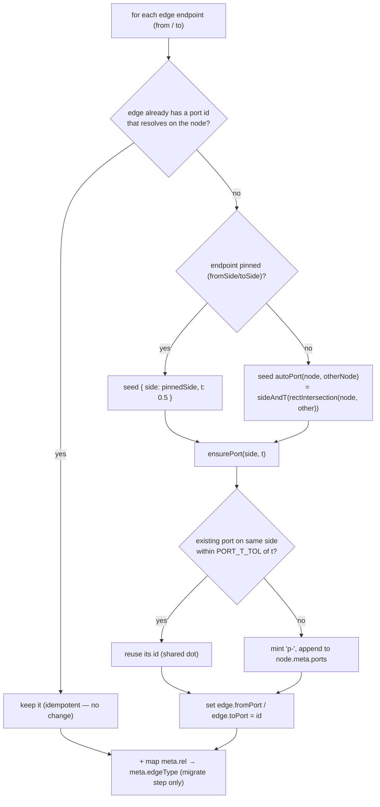

# 006-semantic-edges — Semantic Edges & Connection Ports Implementation Plan

- Reworks the 005-edges floating-endpoint model into dot-anchored **connection ports** (multiple per side, reuse-or-create, drag-to-move), a reusable `<ColorPicker>`, **flow-typed edges** (an `EdgeType` taxonomy bound in one `EDGE_TYPE_STYLE` legend), and Shift-snap angle alignment on waypoint drag — with full agent parity.
- Phases: 4 — Schema, Legend & Pure-Lib Foundation · Ports Rendering & Interaction · Semantic Typing, Legend UI & Reusable ColorPicker · Agent Parity, Contract & Verification.
- Status complete (4/4); dated 2026-06-30.
- Upstream design: `006-semantic-edges-design.md` (status approved 2026-06-30).
- The active phase (Phase 1) is junior-executable: production-ready snippets, a worked migration example, a flow diagram, and named quality checks — per `plan-instructions.md § Active-Phase Completeness Bar`.
- Execution history lives in `006-semantic-edges-log.md` (one entry per phase end + plan end) — not inlined here.

> **FRONTEND-TOUCHING PLAN — UI Design Gate applies.** Phases 2–4 modify `components/canvas/*` and `app/styles/*`. Per `plan-instructions.md § UI Design Gate`, the gate (load `.flowcode/ui/ui-index.md`, confirm `ui-design-system.md` ground truth, run `flowcode:ui-mockups` ×3, operator selects an iteration, write an approved `006-semantic-edges-ui-design.md`) MUST clear **before the first UI implementation phase (Phase 2) begins**. Phase 1 is pure-lib and does not trip the gate. This plan flags the gate; it does not resolve it — the main session gates it with the operator before Phase 2.

---

## Objective

Replace the 005-edges free-form/floating edge model with three operator-locked specs — dot-anchored connection ports, a reusable color picker, and flow-typed edges whose color/line/head encode the relationship — plus Shift-snap angle alignment on bend drag, delivered with schema `0.4 → 0.5` migration and full human↔agent parity.

---

## Phases Catalog

`Depends On` lists the earlier phases that must be `done` first (`[none]` = a root phase). It is the single signal the executor uses to derive parallel waves — phases whose dependencies are all `done` and whose `Files to create / modify:` tables are path-disjoint may run concurrently (`plan-instructions.md § Phase Dependencies & Waves`).

| Phase | Name | Depends On | Summary |
|-------|------|------------|---------|
| 1 | Schema, Legend & Pure-Lib Foundation | [none] | `jsoncanvas` types/constants (`EdgeType`, `EDGE_TYPE_STYLE`, `REL_TO_EDGE_TYPE`, `ConnectionPort`, `meta.ports`, `fromPort`/`toPort`, `meta.edgeType`, `0.5`); new pure `ports.ts`; `edge-geometry.snapAngle`; `migrate` 0.4→0.5 + `normalizePorts`; `validate` enum — all unit-tested. |
| 2 | Ports Rendering & Interaction | [Phase 1] | Dynamic per-port `<Handle>`; adapter emits handles + `sourceHandle`/`targetHandle`; store port actions + reuse-or-create connect; labeled-edge anchors to ports (drop floating math); drag-to-move dots; always-visible dots CSS. |
| 3 | Semantic Typing, Legend UI & Reusable ColorPicker | [Phase 1, Phase 2] | New `components/ui/color-picker.tsx`; edge color override + re-wired node-format-bar; type→default style resolution with per-edge override; on-canvas legend that doubles as the type picker; replace the rel pill/picker with edgeType; Shift-snap wired into the waypoint drag handler. |
| 4 | Agent Parity, Contract & Verification | [Phase 1, Phase 2, Phase 3] | `brief.ts` (`AgentEdge`/`BriefEdge` + `edgeType` + ports threading in `buildBrief`/`applyResponse`); generation-kit contract block + `docs/flowcanvas-agent-contract.md` mirror; MCP passthrough confirmation; end-to-end CDP verification of all four specs. |

**Wave order (honest — mostly sequential; Phases 2–4 all share `labeled-edge`/`store`/`adapter`):** Wave 1 = Phase 1 → Wave 2 = Phase 2 → Wave 3 = Phase 3 → Wave 4 = Phase 4. No two phases are file-disjoint enough to parallelize; the executor runs them one per wave.

> **Agent-parity note (decomposition).** The `[[agent-feature-parity]]` rule requires every human edge capability to land in the agent contract too. Human-facing edge capabilities span Phases 2–3; this plan **consolidates** their agent-contract counterparts into Phase 4 (a single coherent `brief.ts` + `generation-kit` + contract-doc surface) rather than splitting parity across 2–3. This is deliberate: the `EdgeType` taxonomy + port model must be stable (settled in Phase 1, rendered in Phase 2, fully picker-driven in Phase 3) before the contract documents it once, correctly. Parity is satisfied at plan close, not deferred beyond it. Flagged for operator awareness — confirm the consolidation is acceptable, or split parity into Phases 2–3 instead. **Operator confirmed 2026-06-30 (via AskUserQuestion at the Phase 1/2 gate): consolidate parity into Phase 4 — this plan's current shape stands, no change.**

> **Execution record:** this file is the spec. Phase execution history lives in `006-semantic-edges-log.md` (same folder, one entry per phase end + one plan-end entry). The plan file and the log file are separate by design — do not inline execution status here.

---

## Phase 1 — Schema, Legend & Pure-Lib Foundation

**Goal:** Land every pure, side-effect-free foundation the UI phases build on — the `0.5` type system (`ConnectionPort`, the `EdgeType` flow taxonomy + `EDGE_TYPE_STYLE` legend, `REL_TO_EDGE_TYPE`, `fromPort`/`toPort`, `meta.edgeType`, `meta.ports`), a new pure `ports.ts` geometry module, the `snapAngle` helper, the `0.4 → 0.5` migration that seeds ports + maps old `rel → edgeType`, the idempotent `normalizePorts`, and the validator enum — all unit-tested. After this phase, opening any board migrates it to `0.5` with ports seeded and `edgeType` mapped (rendering still floats until Phase 2 — data leads, render follows; non-breaking and independently revertible).

**Phase Status:** done

**Evaluation:** review-agent (pure-lib foundation; no user-facing surface to evaluate — code review + vitest suffice)

**Depends On:** [none]

**Touched Modules:**
- `schema` → `.flowcode/project/modules/schema.md`
- `ports` (new) → `.flowcode/project/modules/ports.md` *(module doc created at phase close by `flowcode:module-explorer-agent` — flagged in the planner report as a new-module placeholder)*
- `edge-geometry` → `.flowcode/project/modules/edge-geometry.md`
- `migrate` → `.flowcode/project/modules/migrate.md`
- `validate` → `.flowcode/project/modules/validate.md`

**Files to create / modify:**

| File | Operation | Description |
|------|-----------|-------------|
| `lib/canvas/jsoncanvas.ts` | modify | Add `ConnectionPort`; `EdgeType` + `EDGE_TYPES`; `EdgeTypeStyle` + `EDGE_TYPE_STYLE`; `REL_TO_EDGE_TYPE`; extend `NodeMeta` (`ports?`), `CanvasEdge` (`fromPort?`/`toPort?`, `meta.edgeType?`); `SCHEMA_VERSIONS` + `'0.5'`; `FlowcanvasExt.schemaVersion` union `+ '0.5'`. |
| `lib/canvas/ports.ts` | create | Pure port geometry: `portPoint`, `sideAndT`, `portAt`, `autoPort`. No DOM/React. |
| `lib/canvas/ports.test.ts` | create | Vitest for all four `ports.ts` functions (perimeter points, nearest side/t, hit-radius reuse, geometric auto-side). |
| `lib/canvas/edge-geometry.ts` | modify | Add `SNAP_STEP_DEG` const + `snapAngle(prev, p, stepDeg?)` (Decision 5). |
| `lib/canvas/edge-geometry.test.ts` | modify | Add `snapAngle` cases (0°/45°/90° snap, length preserved, degenerate zero-length). |
| `lib/canvas/migrate.ts` | modify | Add the `0.4 → 0.5` step (seed ports via `seedEdgePorts`, map `rel → edgeType`, bump); export `normalizePorts(doc)`; add the private `seedEdgePorts`/`ensurePort`/`seedSideT` helpers. |
| `lib/canvas/migrate.test.ts` | modify | Re-target existing ladder assertions `'0.4' → '0.5'`; add a `0.4 → 0.5` test (ports seeded + `edgeType` mapped, worked example); move the idempotent boundary to `'0.5'`; add a `normalizePorts` idempotency test. |
| `lib/canvas/validate.ts` | modify | `schemaVersion` enum `+ '0.5'`. New edge/port fields survive via existing `.passthrough()` — no schema additions. |
| `lib/canvas/validate.test.ts` | modify | Add `'0.5'` to the accepted-version loop; add a passthrough assertion for `fromPort`/`toPort`/`meta.edgeType`/`meta.ports`. |

**Implementation steps:**

- [x] In `lib/canvas/jsoncanvas.ts`, add `export interface ConnectionPort { id: string; side: Side; t: number }` (place before `NodeMeta` at line ~101 since `NodeMeta.ports` references it).
- [x] In `jsoncanvas.ts`, after the 005-edges edge-style block (`EDGE_LINE_STYLES`, ~line 92), add `EdgeType`, `EDGE_TYPES`, `EdgeTypeStyle`, `EDGE_TYPE_STYLE`, and `REL_TO_EDGE_TYPE` exactly as in the design's Enums & Constants (`EdgeTypeStyle` references the existing `CanvasColor`/`EdgeLineStyle`/`EdgeEnd`; `REL_TO_EDGE_TYPE` references the existing `RelationshipType` at line 57 — both already declared earlier in the file).
- [x] In `jsoncanvas.ts`, extend `NodeMeta` (line ~101) with `ports?: ConnectionPort[]` (comment: absent ⇒ no ports yet — legacy/never-connected node).
- [x] In `jsoncanvas.ts`, extend `CanvasEdge` (line ~138): add `fromPort?: string` and `toPort?: string` (port-id geometry source of truth) and `edgeType?: EdgeType` inside the `meta` object. Leave `fromSide`/`toSide` as-is (authoring sugar, normalized into a port at load) and leave `meta.rel` readable (design Open Q default — migrate to `edgeType`, keep `rel` one version).
- [x] In `jsoncanvas.ts`, change `SCHEMA_VERSIONS` (line 82) to `['0.1', '0.2', '0.3', '0.4', '0.5'] as const` and widen `FlowcanvasExt.schemaVersion` (line 188) to `'0.1' | '0.2' | '0.3' | '0.4' | '0.5'`.
- [x] Create `lib/canvas/ports.ts` with `portPoint`, `sideAndT`, `portAt`, `autoPort` per the snippet below — import `Rect`/`Point` from `./edge-geometry` and `ConnectionPort`/`Side` (type-only) from `./jsoncanvas`. No DOM, no React (keeps it on the pure side of the boundary, like `edge-geometry.ts`).
- [x] Create `lib/canvas/ports.test.ts` — assert: `portPoint` for each side at `t=0/0.5/1`; `sideAndT` classifies a point near each side with the correct `t`; `portAt` returns a port within `hitRadius` and `null` beyond it; `autoPort(A,B)` for two horizontally-separated boxes returns `{ side: 'right', t: 0.5 }`.
- [x] In `lib/canvas/edge-geometry.ts`, add `export const SNAP_STEP_DEG = 45` and `export function snapAngle(prev: Point, p: Point, stepDeg: number = SNAP_STEP_DEG): Point` per the snippet (snap the `prev→p` angle to the nearest `stepDeg` multiple, preserve length).
- [x] In `lib/canvas/edge-geometry.test.ts`, add `snapAngle` cases: a near-horizontal segment snaps to `dy≈0`; a 40°-ish segment snaps to 45°; an 85°-ish segment snaps to 90° (`dx≈0`); segment length is preserved (`hypot` unchanged within epsilon); a zero-length input returns `p` unchanged.
- [x] In `lib/canvas/migrate.ts`, add the private `seedEdgePorts(nodes, edges, { setEdgeType })`, `ensurePort(ports, side, t)`, and `seedSideT(node, otherNode, pinnedSide?)` helpers (snippet below); import `autoPort` from `./ports`, `REL_TO_EDGE_TYPE` from `./jsoncanvas`, the `CanvasNode`/`ConnectionPort`/`Side` types, and `v4 as uuid` from `uuid` (the established id-minting dep).
- [x] In `migrate.ts`, add the `if (next.flowcanvas.schemaVersion === '0.4') { … '0.5' … }` ladder step that runs `seedEdgePorts(…, { setEdgeType: true })` and bumps to `'0.5'` (three sequential `if`s already cascade `0.1 → 0.5` in one call — keep that shape).
- [x] In `migrate.ts`, add and export `normalizePorts(doc)` — runs `seedEdgePorts(…, { setEdgeType: false })` and returns a new doc only when something changed (does NOT bump `schemaVersion` or set `edgeType`); it is the load-time guarantee for hand/agent edges, wired into `store.load` in Phase 2.
- [x] In `lib/canvas/migrate.test.ts`, change `docAt`'s `schemaVersion` param type to `'0.1' | '0.2' | '0.3' | '0.4' | '0.5'`; re-target the three existing `expect(...schemaVersion).toBe('0.4')` to `'0.5'`; change the idempotent case from `docAt('0.4')` to `docAt('0.5')`; add the worked `0.4 → 0.5` test (below) asserting ports seeded on both nodes + `meta.edgeType: 'request'`; add a `normalizePorts` idempotency test (second call returns the same reference).
- [x] In `lib/canvas/validate.ts`, change line 24 to `schemaVersion: z.enum(['0.1', '0.2', '0.3', '0.4', '0.5'])`. No other change (new fields ride `.passthrough()`).
- [x] In `lib/canvas/validate.test.ts`, add `'0.5'` to the accepted-version iteration and add one assertion that a doc carrying `edges[0].fromPort`/`toPort`/`meta.edgeType` and `nodes[0].meta.ports` round-trips through `parseFlowcanvasDoc` with those fields intact.
- [x] Run the full vitest suite; if the new ladder terminus (`0.5`) shifts any other version assertion, fix it. Known cross-module sites: `app/api/routes-contract.test.ts:63` reads the demo file from disk (the GET route does NOT migrate — see `app/api/canvas/route.ts`), so it stays `'0.4'` and is **not** affected; `store.test.ts` cases set state directly via `setState` (no `load`), so they are **not** affected — verify both during the run rather than assuming.

**Code & examples:**

`lib/canvas/jsoncanvas.ts` — additive type/constant block (traced verbatim to the design's Data Models + Enums & Constants):

```ts
// ── 006-semantic-edges — connection ports (Decision 1) ──────────────────────
/** A connection dot on a node perimeter. Stable id so edges can share/reuse/drag it. */
export interface ConnectionPort {
  id: string        // 'p-<short>' minted via uuid
  side: Side        // which edge of the node box
  t: number         // 0..1 offset along that side (0 = start corner, 1 = end corner)
}

// ── 006-semantic-edges — flow taxonomy (Decision 2) ─────────────────────────
/** Semantic flow type of an edge — drives the legend visual via EDGE_TYPE_STYLE. */
export type EdgeType =
  | 'data-flow' | 'request' | 'response'
  | 'event' | 'dependency' | 'reference'

/** Ordered allowed set — drives the legend, the type picker, and the agent contract. */
export const EDGE_TYPES: readonly EdgeType[] = [
  'data-flow', 'request', 'response', 'event', 'dependency', 'reference',
]

/** Default {color, line, head} a flow type paints. Single source for legend + picker + renderer. */
export interface EdgeTypeStyle {
  label: string
  color: CanvasColor    // preset id '1'..'6' or hex; resolved by adapter.colorVar
  line: EdgeLineStyle   // 'solid' | 'dashed' | 'dotted'
  fromEnd: EdgeEnd      // marker at the source end
  toEnd: EdgeEnd        // marker at the target end
}

// Presets: '1' rose '2' amber '3' gold '4' lime '5' cyan '6' violet.
// dependency/reference use muted hex (no muted preset). Exact hex tunable (design Open Q — palette).
export const EDGE_TYPE_STYLE: Record<EdgeType, EdgeTypeStyle> = {
  'data-flow':  { label: 'data flow',  color: '5',       line: 'solid',  fromEnd: 'none', toEnd: 'arrow' },
  request:      { label: 'request',    color: '2',       line: 'solid',  fromEnd: 'none', toEnd: 'arrow-open' },
  response:     { label: 'response',   color: '2',       line: 'dotted', fromEnd: 'none', toEnd: 'arrow-open' },
  event:        { label: 'event',      color: '6',       line: 'solid',  fromEnd: 'none', toEnd: 'diamond' },
  dependency:   { label: 'dependency', color: '#8b93a7', line: 'dashed', fromEnd: 'none', toEnd: 'arrow' },
  reference:    { label: 'reference',  color: '#6b7280', line: 'dotted', fromEnd: 'none', toEnd: 'circle' },
}

/** Migration map — old RelationshipType → new EdgeType (Decision 2). */
export const REL_TO_EDGE_TYPE: Record<RelationshipType, EdgeType> = {
  calls: 'request', produces: 'data-flow', 'depends-on': 'dependency',
  references: 'reference', informs: 'event', implements: 'dependency',
  'derives-from': 'reference', related: 'reference',
}

// NodeMeta gains:  ports?: ConnectionPort[]
// CanvasEdge gains:  fromPort?: string;  toPort?: string;  meta.edgeType?: EdgeType
// SCHEMA_VERSIONS = ['0.1','0.2','0.3','0.4','0.5'] as const
// FlowcanvasExt.schemaVersion: '0.1' | '0.2' | '0.3' | '0.4' | '0.5'
```

`lib/canvas/ports.ts` — full new pure module (grounded in `edge-geometry.rectIntersection`):

```ts
// lib/canvas/ports.ts — 006-semantic-edges. Pure port geometry (no DOM/React).
// Ports are the single geometric source of truth for edge endpoints (Decision 1). The edge
// renderer (Phase 2) feeds these helpers live node rects from useInternalNode; this module stays
// on the pure lib/canvas/* side so it is unit-testable under the vitest gate.
import type { ConnectionPort, Side } from './jsoncanvas'
import { rectIntersection, type Point, type Rect } from './edge-geometry'

const clamp01 = (v: number): number => Math.max(0, Math.min(1, v))

/** Absolute perimeter point of a port. t runs start→end corner of the side (L/R top→bottom, T/B left→right). */
export function portPoint(node: Rect, port: ConnectionPort): Point {
  const t = clamp01(port.t)
  switch (port.side) {
    case 'top':    return { x: node.x + t * node.width, y: node.y }
    case 'bottom': return { x: node.x + t * node.width, y: node.y + node.height }
    case 'left':   return { x: node.x,                  y: node.y + t * node.height }
    case 'right':  return { x: node.x + node.width,     y: node.y + t * node.height }
  }
}

/** Nearest {side, t} for an absolute point against a node box (drop → port placement). */
export function sideAndT(node: Rect, p: Point): { side: Side; t: number } {
  const dLeft   = Math.abs(p.x - node.x)
  const dRight  = Math.abs(p.x - (node.x + node.width))
  const dTop    = Math.abs(p.y - node.y)
  const dBottom = Math.abs(p.y - (node.y + node.height))
  const min = Math.min(dLeft, dRight, dTop, dBottom)
  if (min === dLeft)  return { side: 'left',  t: clamp01((p.y - node.y) / node.height) }
  if (min === dRight) return { side: 'right', t: clamp01((p.y - node.y) / node.height) }
  if (min === dTop)   return { side: 'top',   t: clamp01((p.x - node.x) / node.width) }
  return { side: 'bottom', t: clamp01((p.x - node.x) / node.width) }
}

/** Nearest port within hitRadius of p (reuse), else null (create). Uses the live node box for portPoint. */
export function portAt(node: Rect, ports: ConnectionPort[], p: Point, hitRadius: number): ConnectionPort | null {
  let best: ConnectionPort | null = null
  let bestD = hitRadius
  for (const port of ports) {
    const pt = portPoint(node, port)
    const d = Math.hypot(pt.x - p.x, pt.y - p.y)
    if (d <= bestD) { bestD = d; best = port }
  }
  return best
}

/** Geometric default {side, t} for an unpinned endpoint — where the center→center ray crosses `from`. */
export function autoPort(from: Rect, to: Rect): { side: Side; t: number } {
  return sideAndT(from, rectIntersection(from, to))
}
```

`lib/canvas/edge-geometry.ts` — `snapAngle` addition (Decision 5):

```ts
/** Default Shift-snap increment (degrees) — 45° gives horizontal, vertical, AND diagonals. */
export const SNAP_STEP_DEG = 45

/**
 * Snap the angle of the segment prev→p to the nearest `stepDeg` multiple, preserving its length.
 * Used while Shift is held during a waypoint create/drag so adjacent segments align to clean angles.
 */
export function snapAngle(prev: Point, p: Point, stepDeg: number = SNAP_STEP_DEG): Point {
  const dx = p.x - prev.x
  const dy = p.y - prev.y
  const len = Math.hypot(dx, dy)
  if (len === 0) return { x: p.x, y: p.y }
  const step = (stepDeg * Math.PI) / 180
  const snapped = Math.round(Math.atan2(dy, dx) / step) * step
  return { x: prev.x + Math.cos(snapped) * len, y: prev.y + Math.sin(snapped) * len }
}
```

`lib/canvas/migrate.ts` — the seeding core + `0.4 → 0.5` step + `normalizePorts`:

```ts
// add to imports
import type { CanvasEdge, CanvasNode, ConnectionPort, FlowcanvasDoc, Side } from './jsoncanvas'
import { deriveLinkEdges, reconcileEdges } from './edges'
import { REL_TO_EDGE_TYPE } from './jsoncanvas'
import { autoPort } from './ports'
import { v4 as uuid } from 'uuid'

/** Reuse a port within this t-distance on the same side rather than stacking a near-duplicate dot. */
const PORT_T_TOL = 0.04

/** Reuse a port on a node matching {side, t} (within tol), else mint + append one. Returns the port id. */
function ensurePort(ports: ConnectionPort[], side: Side, t: number): string {
  const hit = ports.find((p) => p.side === side && Math.abs(p.t - t) <= PORT_T_TOL)
  if (hit) return hit.id
  const port: ConnectionPort = { id: 'p-' + uuid().slice(0, 8), side, t }
  ports.push(port)
  return port.id
}

/** Seed {side, t} for one endpoint: pinned-side midpoint, else geometric autoPort (faces the other node). */
function seedSideT(node: CanvasNode, otherNode: CanvasNode, pinnedSide?: Side): { side: Side; t: number } {
  if (pinnedSide) return { side: pinnedSide, t: 0.5 }
  return autoPort(node, otherNode)   // CanvasNode is Rect-shaped (x/y/width/height)
}

/** Ensure every edge endpoint resolves to a ConnectionPort on its node. Pure — returns fresh nodes/edges. */
function seedEdgePorts(
  nodes: CanvasNode[],
  edges: CanvasEdge[],
  opts: { setEdgeType: boolean },
): { nodes: CanvasNode[]; edges: CanvasEdge[]; changed: boolean } {
  const byId = new Map(nodes.map((n) => [n.id, n]))
  const portsByNode = new Map<string, ConnectionPort[]>(nodes.map((n) => [n.id, [...(n.meta?.ports ?? [])]]))
  let changed = false

  const nextEdges = edges.map((e) => {
    const from = byId.get(e.fromNode)
    const to = byId.get(e.toNode)
    if (!from || !to) return e   // dangling edge — leave for validate/UI to surface
    let out = e
    const fromPorts = portsByNode.get(e.fromNode)!
    const toPorts = portsByNode.get(e.toNode)!

    if (!e.fromPort || !fromPorts.some((p) => p.id === e.fromPort)) {
      const { side, t } = seedSideT(from, to, e.fromSide)
      out = { ...out, fromPort: ensurePort(fromPorts, side, t) }
      changed = true
    }
    if (!e.toPort || !toPorts.some((p) => p.id === e.toPort)) {
      const { side, t } = seedSideT(to, from, e.toSide)
      out = { ...out, toPort: ensurePort(toPorts, side, t) }
      changed = true
    }
    if (opts.setEdgeType && !out.meta?.edgeType) {
      const edgeType = (e.meta?.rel && REL_TO_EDGE_TYPE[e.meta.rel]) || 'reference'
      out = { ...out, meta: { ...out.meta, edgeType } }
      changed = true
    }
    return out
  })

  const nextNodes = nodes.map((n) => {
    const ps = portsByNode.get(n.id)!
    return ps.length === (n.meta?.ports?.length ?? 0) ? n : { ...n, meta: { ...n.meta, ports: ps } }
  })

  return { nodes: nextNodes, edges: nextEdges, changed }
}

// … inside migrateDoc, after the existing 0.3 → 0.4 step:
if (next.flowcanvas.schemaVersion === '0.4') {
  // 006 — ports become the geometric source of truth. Seed a ConnectionPort for every edge endpoint
  // (pinned fromSide/toSide midpoint, else geometric autoPort) and map legacy meta.rel → meta.edgeType
  // (default 'reference'). The renderer reads ports only afterwards (Decision 4).
  const seeded = seedEdgePorts(next.nodes, next.edges, { setEdgeType: true })
  next = {
    ...next, nodes: seeded.nodes, edges: seeded.edges,
    flowcanvas: { ...next.flowcanvas, schemaVersion: '0.5' as const },
  }
  migrated = true
}

/**
 * Idempotent guarantee that every edge endpoint resolves to a port — invoked from store.load (Phase 2)
 * for hand/agent edges created without a migration pass. Does NOT bump schemaVersion or set edgeType.
 */
export function normalizePorts(doc: FlowcanvasDoc): FlowcanvasDoc {
  const seeded = seedEdgePorts(doc.nodes, doc.edges, { setEdgeType: false })
  return seeded.changed ? { ...doc, nodes: seeded.nodes, edges: seeded.edges } : doc
}
```

`lib/canvas/validate.ts` — one-line enum widen:

```ts
// was: schemaVersion: z.enum(['0.1', '0.2', '0.3', '0.4']),
schemaVersion: z.enum(['0.1', '0.2', '0.3', '0.4', '0.5']),
// New edge fields (fromPort/toPort/meta.edgeType) + node meta.ports are NOT modeled here —
// they ride the existing .passthrough() on the edge object + nodeMeta, by design (import validator
// preserves unmodeled fields; it is not a write-time normalizer).
```

Worked example — a `0.4` board with one floating edge → migrated `0.5` with ports + edgeType (this is the new `migrate.test.ts` case; assert with `toMatchObject` since port ids are uuid-minted):

```text
INPUT  (schemaVersion '0.4'):
  nodes:
    { id:'a', type:'file', file:'a.md', x:0,   y:0, width:100, height:60, meta:{ origin:'user' } }
    { id:'b', type:'file', file:'b.md', x:300, y:0, width:100, height:60, meta:{ origin:'user' } }
  edges:
    { id:'e1', fromNode:'a', toNode:'b', toEnd:'arrow', meta:{ origin:'user', rel:'calls' } }
    // floating — no fromSide/toSide, no fromPort/toPort

migrateDoc(input) computes:
  autoPort(a → b): rectIntersection(a,b) = (100,30) on a's right edge → { side:'right', t:0.5 }
  autoPort(b → a): rectIntersection(b,a) = (300,30) on b's left  edge → { side:'left',  t:0.5 }
  REL_TO_EDGE_TYPE['calls'] = 'request'

OUTPUT (schemaVersion '0.5'):
  nodes:
    { id:'a', …, meta:{ origin:'user', ports:[{ id:'p-…', side:'right', t:0.5 }] } }
    { id:'b', …, meta:{ origin:'user', ports:[{ id:'p-…', side:'left',  t:0.5 }] } }
  edges:
    { id:'e1', fromNode:'a', toNode:'b', fromPort:'p-…(a.right)', toPort:'p-…(b.left)',
      toEnd:'arrow', meta:{ origin:'user', rel:'calls', edgeType:'request' } }
  migrated: true

normalizePorts(output) → returns the SAME doc reference (every endpoint already resolves) — idempotent.
```

**Diagram:** the `seedEdgePorts` reuse-or-create decision per edge endpoint is the one non-obvious flow this phase adds.



**Acceptance criteria:**
- [x] `npx tsc --noEmit` exits 0 — the `'0.5'` literal widens cleanly across `jsoncanvas.ts`, `validate.ts`, `migrate.ts`, and `migrate.test.ts`'s `docAt` signature; no other call site breaks.
- [x] `lib/canvas/ports.test.ts` passes: `portPoint`/`sideAndT`/`portAt`/`autoPort` all assert the documented outputs (incl. `autoPort` of two horizontally-separated boxes → `{ side:'right', t:0.5 }`).
- [x] `lib/canvas/edge-geometry.test.ts` passes the new `snapAngle` cases: angle snaps to the nearest 45° multiple, segment length is preserved, zero-length input returns `p`.
- [x] `lib/canvas/migrate.test.ts` passes: the existing ladder cases now terminate at `'0.5'`; the new `0.4 → 0.5` case seeds a port on each node and sets `meta.edgeType:'request'` for a `rel:'calls'` edge (worked example above); `normalizePorts` is idempotent (second call returns the same reference); a `0.5` doc passes through `migrateDoc` unchanged (`migrated:false`, reference preserved).
- [x] `lib/canvas/validate.test.ts` passes: `'0.5'` is accepted, and `fromPort`/`toPort`/`meta.edgeType`/`meta.ports` survive `parseFlowcanvasDoc` via `.passthrough()`.
- [x] `npx vitest run` is green across the whole suite (232/232; no cross-module version assertion left pointing at `'0.4'` where the new ladder now yields `'0.5'`).
- [x] `EDGE_TYPE_STYLE`, `EDGE_TYPES`, `REL_TO_EDGE_TYPE`, `ConnectionPort`, and `normalizePorts` are exported from their modules and importable (no unused-export lint error; `npm run lint` exits 0).
- [x] `npm run build` succeeds.

**Quality checks (run at phase close):**
- `typecheck` — `npx tsc --noEmit` (exit 0; gate registry: all phases).
- `lint` — `npm run lint` (exit 0; gate registry names lint for phases 1, 7 — Phase 1 here is a lint phase).
- `unit` — `npx vitest run` (pure modules + new tests pass; this phase ships the pure-lib foundation, so `unit` is the primary gate).
- `build` — `npm run build` (exit 0; gate registry: all phases).
- `integration` (MCP smoke) / `e2e` (render smoke): **skipped — phase ships no app surface or MCP/agent flow.** Per the gate registry these smokes are scoped to the verification phase (Phase 4 here); annotate the skip in the `[PHASE]` entry's `Gates` field.

> **Active-phase depth:** Phase 1 is the active phase — it meets `plan-instructions.md § Active-Phase Completeness Bar`. Later phases stay stubs until they become active.

> **Quality gate:** code-review sub-agent runs. See `plan-execution.md § Phase Close Sequence` for the ordered close. Phase-end `[PHASE]` entry is appended to `006-semantic-edges-log.md`, not here.

> **Design confirmations folded into Phase 1 defaults (not blockers).** Two design Open Questions touch Phase 1 and are implemented at the design's stated defaults pending operator confirmation at the approval gate — neither blocks execution: (a) **legend palette** — `EDGE_TYPE_STYLE` ships the design's exact values (cyan/amber/violet presets + `#8b93a7`/`#6b7280` muted hex, request=`arrow-open`, event=`diamond`, reference=`circle`); (b) **`rel` retention** — the migration sets `meta.edgeType` from `rel` and keeps `meta.rel` readable (retire it fully one version later). If the operator changes either at the gate, update the constant table / migration accordingly.

---

## Phase 2 — Ports Rendering & Interaction

**Goal:** Turn the seeded ports into real, interactive dots — one React Flow `<Handle>` per port so arrowheads seat IN the dot, edges anchored to ports (floating math dropped), reuse-or-create on connect, and drag-to-move a dot (every anchored edge follows). First UI phase — the UI Design Gate must clear before this phase begins.

**Phase Status:** done

**Evaluation:** user (operator verifies the connection affordance on the live canvas) — satisfied by live CDP verification (dots render · edge seats in dot 0.4 px · Alt-drag moves a dot · connect reuses/creates).

**Depends On:** [Phase 1]

> **UI Design Gate — cleared.** An approved `006-semantic-edges-ui-design.md` exists; it records the operator's locked visual decisions (§ Reduced Exploration) in place of a 3-mockup exploration round (operator directed direct execution). Visual parity verified live (headless-Chrome CDP), not static-mockup diff.

**Touched Modules:**
- `adapter` → `.flowcode/project/modules/adapter.md`
- `store` → `.flowcode/project/modules/store.md`
- `canvas-nodes` → `.flowcode/project/modules/canvas-nodes.md` *(node frame/group/fallback handles + `labeled-edge` anchoring)*
- `ports` (new) → `.flowcode/project/modules/ports.md` *(consumed; doc created with Phase 1's code at Phase 1 close)*
- `schema` → `.flowcode/project/modules/schema.md` *(read-only; ports/edge fields already landed in Phase 1)*

**Files created / modified (as built):**

| File | Operation | Description |
|------|-----------|-------------|
| `lib/canvas/adapter.ts` | modified | Build a `portIndex`; resolve `fromPort`/`toPort` → `{side,t}` into edge `data.fromPortST`/`toPortST` (lag-free anchoring); `sourceHandle/targetHandle = fromPort ?? fromSide`; pass `edgeType`. |
| `lib/canvas/store.ts` | modified | `addPort`/`movePort` actions; `onConnect` reuse-or-create (`portForConnect`/`firstFreeT`, side-handle spread + body-drop dedup, mints `fromPort`/`toPort` + `edgeType:'reference'`); `load` → `normalizePorts`; `newBoard` at `'0.5'`. |
| `components/canvas/nodes/port-handles.tsx` | **created** | Shared `<PortHandles node>` — one always-visible dot per port (id = port id) + 4 faint side "add" handles; `data-fc-portid`/`data-fc-nodeid`. |
| `components/canvas/nodes/{node-frame,group-node,fallback-node}.tsx` | modified | Render `<PortHandles>` instead of 4 fixed side handles; `NodeResizeFrame` gains a `node` prop. |
| `components/canvas/nodes/{markdown,note,image,link,component}-node.tsx` | modified | Pass `node` to `NodeResizeFrame`. |
| `components/canvas/edges/labeled-edge.tsx` | modified | Anchor endpoints via `portPoint(liveRect, {side,t})` (arrowhead seats in the dot); floating math kept only as the port-less/legacy fallback. |
| `components/canvas/use-canvas-handlers.ts` | modified | One window CAPTURE-phase listener: Alt-drag a `.fc-port` → `movePort`, suppressing RF connect-start via `stopPropagation`. |
| `app/styles/edges.css` | modified | `.fc-port` always-visible subtle dots; `.fc-port-add` keeps at-rest-hidden / hover-reveal. (`nodes.css` not needed.) |

**Deliverables (built):** per-port dots keyed to port ids; arrowheads seat in dots; reuse-or-create connect; Alt-drag-to-move; always-visible dots. Agent counterparts (authoring ports/edgeType) land in Phase 4.

**Acceptance criteria:**
- [x] Dragging a connection reuses a nearby dot or creates a new one; the arrowhead seats in the dot. **(CDP: connect 8→9 edges + 14→16 dots; edge endpoint seats 0.4 px from the nearest dot center.)**
- [x] Dragging a dot moves every edge anchored to it. **(CDP: Alt-drag moved a dot 769→824 px; anchored edges follow via the adapter-resolved `{side,t}`.)**

> **Quality gate:** code-review sub-agent runs. See `plan-execution.md § Phase Close Sequence`. UI-touching phase — visual-parity check per `ui/ui-workflow.md § Phase Close`.

---

## Phase 3 — Semantic Typing, Legend UI & Reusable ColorPicker

**Goal:** Make edges carry meaning — extract a reusable `<ColorPicker>`, resolve edge style as `type default → per-edge override`, add an on-canvas legend that doubles as the type picker (replacing the rel pill/picker), and wire Shift-snap into the waypoint drag handler.

**Phase Status:** done

> **Partially landed early (2026-06-30).** The **Shift-snap** step ("read `e.shiftKey` → `snapAngle` in the waypoint drag handler") was pulled forward and implemented in `components/canvas/edges/labeled-edge.tsx` at operator request — it is decoupled from the Phase 2 port rework (it wires into the existing 005-edges waypoint/line-drag handler). Live CDP-verified: a Shift+drag snaps the segment to 45.1° (length preserved), a no-Shift drag does not snap. The rest of Phase 3 (ColorPicker, type→style resolution, legend) remains pending. When this phase formally executes, this step is already done — its `[PHASE 3]` entry will note the early land.

**Evaluation:** user (operator reads the board by color/line/head and confirms the picker + legend)

**Depends On:** [Phase 1, Phase 2]

**Touched Modules:**
- `canvas-nodes` → `.flowcode/project/modules/canvas-nodes.md` *(`labeled-edge` style resolution + Shift-snap; `node-format-bar` re-wire)*
- `adapter` → `.flowcode/project/modules/adapter.md` *(resolve `EDGE_TYPE_STYLE[type]` with per-edge override)*
- `store` → `.flowcode/project/modules/store.md` *(`setEdgeType`; `setEdgeColor` undefined ⇒ fall back to type color)*
- `edge-geometry` → `.flowcode/project/modules/edge-geometry.md` *(`snapAngle` consumed in the waypoint drag handler)*
- `canvas-shell` → `.flowcode/project/modules/canvas-shell.md` *(mount the legend component)*
- `color-picker` (new) → `.flowcode/project/modules/color-picker.md` *(new module doc created at this phase's close)*
- `legend` (new) → `.flowcode/project/modules/legend.md` *(new module doc created at this phase's close)*

**Files to create / modify (rough — expand to full depth when active):**

| File | Operation | Description |
|------|-----------|-------------|
| `components/ui/color-picker.tsx` | create | Shared `<ColorPicker>` — native `<input type=color>` + preset chips + optional clear. |
| `components/canvas/legend.tsx` (or similar) | create | On-canvas legend listing each `EdgeType` → swatch; click sets the edge's `edgeType`. |
| `components/canvas/edges/labeled-edge.tsx` | modify | Style from `EDGE_TYPE_STYLE[type]` with per-edge override; replace rel pill/picker with edgeType; consume `<ColorPicker>`; read `e.shiftKey` → `snapAngle` in the waypoint drag handler. |
| `components/canvas/nodes/node-format-bar.tsx` | modify | Re-wire node text/fill to the shared `<ColorPicker>`. |
| `lib/canvas/adapter.ts` | modify | Resolve type default + per-edge override into the rendered stroke/markers. |
| `lib/canvas/store.ts` | modify | `setEdgeType` (applies legend defaults, clears superseded overrides); `setEdgeColor` fallback semantics. |

**Rough deliverables:** reusable color picker; type→style resolution with override; legend-as-picker; Shift-snap on bend drag. Agent contract for `edgeType`/color lands in Phase 4.

**Acceptance criteria:**
- [x] Setting an edge type changes color/line/head per `EDGE_TYPE_STYLE`; the picker overrides color per-edge. **(CDP: legend-click `event` → stroke `rgb(163,113,247)` from amber; ColorPicker overrides via the style panel.)**
- [x] Holding Shift while dragging a waypoint snaps segment angles to 45°. **(landed early 2026-06-30 in `labeled-edge.tsx`; CDP-verified — Shift+drag → 45.0°, length preserved; no-Shift → no snap.)**
- [x] `<ColorPicker>` is used by both the edge panel and `node-format-bar`. **(shared `components/ui/color-picker.tsx`; CDP: 6 chips render in the edge style panel.)**

> **Quality gate:** code-review sub-agent runs. See `plan-execution.md § Phase Close Sequence`. UI-touching phase — visual-parity check per `ui/ui-workflow.md § Phase Close`.

---

## Phase 4 — Agent Parity, Contract & Verification

**Goal:** Close the `[[agent-feature-parity]]` rule — give the agent every edge capability the human got (ports + `edgeType` + style) through `brief.ts` and the generation-kit contract + mirror doc — then verify all four specs end-to-end (CDP).

**Phase Status:** done

**Evaluation:** user (operator confirms an agent round-trip carries ports + edgeType, and watches the end-to-end CDP verification of all four specs)

**Depends On:** [Phase 1, Phase 2, Phase 3]

**Touched Modules:**
- `brief` → `.flowcode/project/modules/brief.md`
- `generation-kit` → `.flowcode/project/modules/generation-kit.md`
- `mcp-sidecar` → `.flowcode/project/modules/mcp-sidecar.md` *(passthrough confirmation — likely no code change; verify ports/edgeType ride `buildBrief`/`applyResponse`)*

**Files to create / modify (rough — expand to full depth when active):**

| File | Operation | Description |
|------|-----------|-------------|
| `lib/canvas/brief.ts` | modify | `AgentEdge`/`BriefEdge` gain `edgeType` (+ ports/sides); `buildBrief` emits them; `applyResponse` threads them on the create + update edge branches. |
| `lib/canvas/brief.test.ts` | modify | Round-trip `edgeType` + ports through `buildBrief`/`applyResponse`. |
| `lib/canvas/generation-kit.ts` | modify | `schemaContract` documents the `EdgeType` taxonomy + legend + ports; worked-example edge carries `edgeType`. |
| `docs/flowcanvas-agent-contract.md` | modify | Mirror the generation-kit contract changes (parity rule). |
| `scripts/` (verification) | use | CDP/headless verification of: dots reuse/create + seat, color picker, type→legend visual, Shift-snap. |

**Rough deliverables:** agent can author ports + `edgeType` + edge style; contract + mirror doc updated in the same phase; full end-to-end verification of the four specs.

**Acceptance criteria:**
- [x] An agent round-trip (`buildBrief` → `applyResponse`) preserves `edgeType` and ports. **(brief.test +2: buildBrief echoes `edgeType`; applyResponse threads it on create/update, defaults `'reference'`; ports seed at load via `normalizePorts`.)**
- [x] `generation-kit` contract + `docs/flowcanvas-agent-contract.md` document the taxonomy/legend identically. **(contract doc regenerated from `kitSections().schemaContract` — exact mirror.)**
- [x] CDP verification confirms all four specs on the live canvas (dots, picker, typed-style, Shift-snap). **(ports 5/5 · typed+legend+picker 6/6 · Shift-snap PASS.)**

> **Quality gate:** code-review sub-agent runs. See `plan-execution.md § Phase Close Sequence`. Final phase runs the full gate suite incl. `integration` (`smoke:mcp`) + `e2e` (`smoke:render`) + CDP verification.

> **Within-phase parallelism:** the `create` rows in a phase's `Files to create / modify:` table that are mutually independent (no row imports another) are the unit of within-phase fan-out — the executor may implement them with parallel `flowcode:implementer-agent` workers, while shared/`modify` rows (files many others import) stay in the main session. In Phase 1, `ports.ts` (+ its test) is the lone genuinely-independent `create`; `jsoncanvas.ts`/`migrate.ts`/`validate.ts` are shared roots edited in the main session and serialized by their import graph.

---

## Post-Execution Artifacts

After all phases complete, run the two-phase pipeline (see `flowcode/workflow/flowcode-workflow.md § Generate Artifacts Workflow` and `plan-execution.md § Post-Execution Pipeline`):

**Sequential — audit and authoritative source:**
1. Code Explorer sub-agent (sonnet) audits implementation against plan (`code-explorer-agent.md`)
2. `.flowcode/plans/006-semantic-edges/006-semantic-edges-technical-overview.md` (use `technical-overview-template.md`) — generated from audit findings; feeds the downstream artifacts
3. `.flowcode/plans/006-semantic-edges/006-semantic-edges-qa-report.md` (use `qa-report-template.md`) — requires all gates to pass

**Parallel — finalization (sonnet sub-agents, after technical-overview + QA gates pass):**
- `.flowcode/plans/006-semantic-edges/006-semantic-edges-changelog.md` — finalize Summary and Reconciliation sections; per-phase sections were appended during the plan
- `.flowcode/plans/006-semantic-edges/006-semantic-edges-test-notes.md` (use `test-notes-template.md`)

Update `.flowcode/plans/plan-index.md` row: status → `complete`.

---

## Dependencies

| Dependency | Type | Notes |
|------------|------|-------|
| `006-semantic-edges-design.md` | upstream artifact | Approved 2026-06-30 before execution |
| `006-semantic-edges-ui-design.md` | upstream artifact (UI gate) | Required approved before Phase 2 (first UI phase); not yet created — gated by the operator |
| `uuid` | external (existing) | `v4` used by `migrate.ts` to mint `p-<short>` port ids (already a project dep) |
| `@xyflow/react` | external (existing) | Dynamic `<Handle>` per port (Phase 2); `sourceHandle`/`targetHandle` = port ids |
| `zod` | external (existing) | `validate.ts` enum widen to `'0.5'` |

---

## Revision History

| Date | Change | Reason |
|------|--------|--------|
| 2026-06-30 | Plan created — 4 phases, Phase 1 active at full depth | Initial draft from approved design |
