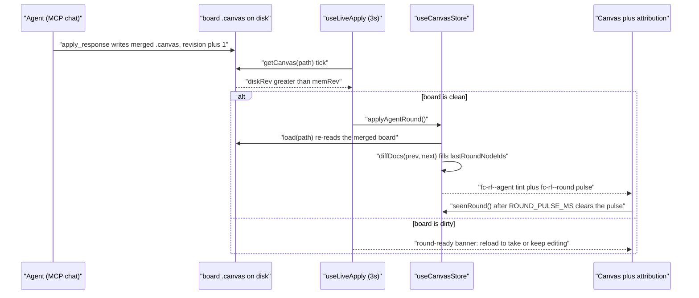

# 007-live-agent-canvas — Live Agent-Round Reflection & Attribution Design

- Make the open canvas reflect agent rounds **live** and mark agent authorship: an always-on disk-watch auto-applies the agent's round when the board is clean (non-blocking banner when dirty), plus a persistent agent-origin node tint and a transient last-round pulse.
- This is a **local canvas live-refresh + attribution** feature — the agent↔board round-trip already exists over MCP (plan 004); nothing here is an "MCP bridge" and no new transport is added.
- Scope — in: always-on live-apply engine (replaces the `pendingReview`-gated manual-reload poll), dirty-guard banner, agent-origin node tint, last-round pulse; out: in-app chat/model, new MCP tools, schema bump, per-change undo/merge (BL-008).
- Key decisions: live-apply = auto-apply-when-clean + non-blocking-banner-when-dirty (never clobber); attribution = persistent tint + transient pulse, reusing the edge-origin accent + the `fc-rf--linked` pattern; no schema change (reuses `meta.origin`; new state is transient).
- Status **approved 2026-06-30**; author human (scope) + `flowcode:designer-agent` (technical depth). Salvages the genuine value of the aborted `005-mcp-live-bridge`, correctly framed.
- Sibling plan: `007-live-agent-canvas-plan.md` (created after this design is approved).

---

## Problem Statement

When the operator drives the agent from their MCP harness (Claude Code / Cursor), the agent's writes already round-trip into the board's files over the existing MCP tools (`get_board` / `write_file` / `apply_response`, shipped in plan 004): the merged `.canvas` and the generated `.md` files land on disk and the on-disk `session.revision` bumps. But the **open Flowcanvas canvas does not reflect any of it live**, and once it does reload, **nothing marks which nodes the agent authored or what the latest round changed**.

The cause is narrow and verified:

- The only in-app disk watcher, `components/canvas/use-round-ready.ts`, polls *only while `session.pendingReview === true`* (`use-round-ready.ts:27`) and only ever offers a manual reload (`:45`). `pendingReview` is set exclusively by the in-app Submit flow (`store.ts:744`); a harness-driven round never passes through in-app Submit, so `pendingReview` stays `false`, the poll never runs, and the generation is invisible until the operator manually reopens the board.
- `adapter.toReactFlow` threads origin onto *edges* only (`adapter.ts:48`). Agent-authored nodes are already stamped `meta.origin:'agent'` (`brief.ts:293`), but that signal never reaches the node UI.

The result: the "design-together, watch it happen" experience the generation loop was built for does not actually happen on screen — the operator generates from the harness and stares at a stale board.

## Scope

**In scope:**

- **Always-on live-apply engine** — replace the `pendingReview`-gated poll with a disk-watch that runs whenever a board `path` is set, auto-applying the agent's round when the in-memory board is clean.
- **Dirty-guard banner** — when disk is ahead *and* the board has unsaved local edits, hold the round and show a non-blocking banner (reload-to-take-the-round / keep-editing); never silently clobber either side.
- **Persistent agent-origin node tint** — thread `meta.origin` through `adapter.toReactFlow` to a node CSS hook, reusing the agent-cyan accent edges already use.
- **Transient last-round pulse** — compute the changed set via the pure `diffDocs` and pulse it once (reusing the `fc-rf--linked` pattern), settling after it has been seen.

**Out of scope:**

- In-app chat / prompt box / in-app model — the cockpit stays the operator's own MCP harness (settled in the aborted 005; not re-litigated here).
- Any new MCP tool or transport — no `create_board`, no WebSocket/SSE/file-watch push (always-on polling is the mechanism; push is a possible later optimization).
- Schema-version bump — reuses `meta.origin`; all new state is transient store-only.
- Per-change cherry-pick / 3-way merge-while-dirty / full undo of agent rounds (**BL-008**).
- The copy-paste Generation Kit's prominence/relabeling (old-005 D6) — cosmetic; dropped.

## Solution Overview

Treat this as what it is — a **local live-refresh of an already-working round-trip**, not a new bridge. The agent already persists its round to disk over MCP; the only missing link is the browser noticing and adopting it. Rename `use-round-ready.ts` → `use-live-apply.ts` and ungate its poll: it runs whenever a board `path` is set, compares the persisted `revision` to the in-memory one, and on `diskRev > memRev` branches on the store's `dirty` flag. **Clean** → call a new `applyAgentRound()` store action that reloads the already-merged board via the existing `load(path)` (disk is authoritative because `apply_response` writes the merged `.canvas` directly through `/api/canvas`, bypassing the client store). **Dirty** → surface the existing non-blocking banner so the operator chooses reload-to-take or keep-editing. This reuses `load`, `getCanvas`, and the revision-compare that already exist; it never auto-yanks an unsaved edit.

For attribution, surface the `meta.origin` that is already on the data. `adapter.toReactFlow` gains one field — `className: n.meta?.origin === 'agent' ? 'fc-rf--agent' : undefined` — mirroring the edge-origin pattern, so the tint rides on `.react-flow__node.fc-rf--agent` with no node-component edits. The persistent tint is a low-alpha agent-cyan left accent (the same hue agent edges use, so origin reads consistently and stays within the accent discipline). The transient pulse reuses the proven `fc-rf--linked` mechanism: `applyAgentRound()` diffs the round with the pure `diffDocs(prev, next)`, stores the changed ids in transient state, and `canvas-shell` injects a one-shot `fc-rf--round` cyan keyframe that a fixed settle timer clears.

This wins because it is almost entirely **reuse over plumbing that already exists and is tested** — no schema change, no new persistence, no new MCP surface — and it honestly scopes the value (live refresh + attribution) instead of dressing a 3-second poll up as an "MCP-native bridge."

## Alternatives Considered

High-level approach alternatives evaluated before this design was locked in. Per-component decisions live under Architecture Decisions.

| Approach | Why considered | Why rejected |
|----------|---------------|--------------|
| Keep the `pendingReview`-gated poll, add a manual "refresh" button | Minimal change | Doesn't solve the actual problem — a harness round still never surfaces without an explicit operator action; "live" is the whole point |
| Auto-merge non-conflicting deltas while the board is dirty | Never blocks the operator | Needs a real per-field 3-way merge (BL-008); ambiguous last-writer; high risk for marginal gain |
| Replace polling with WebSocket / SSE / file-watch push | True push, lower latency | A transport rewrite for marginal gain; always-on 3s polling is "live enough" for a single-user design-together loop |
| Attribution as a transient pulse only (no persistent tint) | Draws the eye to the delta | Nothing marks agent authorship at rest — a returning operator can't tell what the agent owns |
| Frame the whole thing as an "MCP live bridge" (old 005) | Highlights the MCP integration | Misleading — the round-trip already exists; the only new code is a local poll + CSS. Over-framing is what got 005 aborted |

**Chosen:** the local live-apply + attribution reframe in Solution Overview.
**Key rationale:** the value (live refresh + authorship/last-round visibility) is real and un-built; the work is ~3–4 files of reuse with no schema or transport change.

## Architecture Decisions

### Decision 1: Always-on live-apply, dirty-guarded

**Options considered:**

| Option | Pros | Cons |
|--------|------|------|
| A — Keep the `pendingReview`-gated poll + manual reload (today) | Strongest human-in-the-loop; zero change | A harness round never sets `pendingReview`, so it never surfaces live — the bug being fixed |
| B — Always-on poll; auto-apply when clean, non-blocking banner when dirty | Live feel; reuses `load` + `getCanvas` + revision compare; never clobbers unsaved edits | Up to ~3s lag; a dirty board defers the round (operator resolves via the banner) |
| C — Auto-merge non-conflicting deltas while dirty | Never blocks | Needs a real 3-way merge (BL-008); ambiguous last-writer; high risk |

**Decision:** B — ungate the poll (key on `path`, not `pendingReview`); clean → `applyAgentRound()` (reload via `load(path)`), dirty → non-blocking banner.
**Rationale:** disk is authoritative (`apply_response` writes the merged `.canvas` through `/api/canvas`, bypassing the store), so reload-from-disk is the correct, merge-free adoption. The clean/dirty gate is the safety property: auto-apply only when there is nothing local to lose; otherwise the operator explicitly chooses. Merge-while-dirty is deferred to BL-008.

### Decision 2: Dual agent attribution — persistent tint + transient pulse

**Options considered:**

| Option | Pros | Cons |
|--------|------|------|
| A — Persistent origin tint only | Agent-authored nodes always distinguishable | A returning operator can't tell what *this* round changed |
| B — Transient last-round pulse only | Draws the eye to the new delta | Nothing marks agent authorship at rest |
| C — Both | Authorship at rest *and* "what just changed" | Two cyan channels to keep within accent discipline |

**Decision:** C — both, mirroring the proven edge-origin styling.
**Rationale:** the two answer different questions (who owns this node vs. what just landed) and both reuse existing mechanisms — the edge-origin accent for the tint, `fc-rf--linked` for the pulse. The tint is a low-alpha left accent (not a fill); the pulse is one-shot and fades; origin is also shown in the inspector, so color is not the only signal.

### Decision 3: No schema-version bump

**Options considered:**

| Option | Pros | Cons |
|--------|------|------|
| A — Bump the schema to model new fields | Room for new persisted state | Migration churn for fields nothing persists |
| B — Reuse `meta.origin`; keep all new state transient | Zero migration; attribution already on the model | None material |

**Decision:** B — `schemaVersion` is untouched (the board is at `0.4`); attribution reuses `NodeMeta.origin` (already stamped by `nodeFromAgent`); the new live-apply / last-round state is transient Zustand store state, never written to disk.
**Rationale:** this plan only *surfaces* and *adopts* what is already persisted; it introduces no new durable field.

---

## Technical Design

### Data Models

**No persisted types and no schema change — the board stays `'0.4'`** (`newBoard` stamps `schemaVersion: '0.4'`, `store.ts:408`; the `migrateDoc` ladder is untouched). Attribution reuses the `NodeMeta.origin` already stamped on every agent create/update by `nodeFromAgent` (`brief.ts:293`); this plan only *surfaces* it. The `.canvas` JSON on disk gains no field.

Every field this plan adds is **transient Zustand store state**, never written to disk — it lives beside the existing transient fields (`dirty`, `reviewState`, `linkedNodeIds`) and shares their lifecycle.

```ts
// lib/canvas/store.ts — added to interface CanvasState (transient, never persisted)
interface CanvasState {
  // ...existing transient fields: dirty, reviewState, linkedNodeIds, ...
  lastRoundNodeIds: string[]   // node ids added/updated by the last auto-applied round -> fc-rf--round pulse
  lastRoundEdgeIds: string[]   // edge ids added/updated by that round (pulse coverage — see Open Questions)
  lastRoundAt: string | null   // ISO 8601 time the round was applied (diagnostic; no UI is required for it)
}
```

- **Initial values:** `lastRoundNodeIds: []`, `lastRoundEdgeIds: []`, `lastRoundAt: null`, declared in the store seed next to `linkedNodeIds: []` (`store.ts:189-190`).
- **Reset:** the three fields reset to `[]` / `null` in `load` (`store.ts:222`), `newBoard` (`store.ts:414`), and `clearBoard` (`store.ts:436`) — the same sites that already reset `linkedNodeIds`, so a board switch / new / clear never carries a stale pulse.

No `SessionMeta` field, no new `.canvas` JSON key, and no persisted `data-*` attribute are introduced.

### Enums & Constants

```text
POLL_MS = 3000          — use-live-apply.ts disk-watch cadence. VALUE UNCHANGED from use-round-ready.ts,
                          but NO LONGER GATED: the poll runs whenever a board `path` is set
                          (was: only while session.pendingReview === true, use-round-ready.ts:27).

ROUND_PULSE_MS = 1800   — one-shot settle timer. canvas-shell calls seenRound() this long after a round
                          is applied to clear the pulse set. Chosen > the fc-round-pulse keyframe duration
                          so the animation finishes before the class is dropped (exact value is non-blocking
                          — see Open Questions).

CSS classes / keyframe (React-Flow-wrapper convention, mirroring fc-rf--connect / fc-rf--linked):
  fc-rf--agent    — PERSISTENT agent-origin node tint (set by the adapter on the RF node wrapper)
  fc-rf--round    — TRANSIENT last-round pulse (injected by canvas-shell, like fc-rf--linked)
  fc-round-pulse  — the one-shot cyan @keyframes that fc-rf--round runs
  -> live in a NEW partial app/styles/agent-bridge.css, @imported from app/globals.css alongside the
     existing styles/*.css partials (e.g. after studio-spine.css). No node component is edited.

data-testid (no new banner element — the existing one is repurposed):
  round-ready   — REPURPOSED. Was the mandatory "Agent round ready" reload banner (shown while
                  pendingReview && disk-ahead, canvas-shell.tsx:184-195). It NOW means the dirty-collision
                  banner: shown only when disk is ahead AND the board is dirty (reload-to-take /
                  keep-editing). Its child testids round-reload / round-dismiss are unchanged.
```

### API / Interface Contracts

Concrete signatures, grounded in the current code. The clean-path adoption is a **reload, not a second merge**: the agent's `apply_response` already wrote the merged `.canvas` to disk through `/api/canvas`, bypassing the client store, so disk is authoritative and re-reading it via the existing `load(path)` is the correct adoption.

```ts
// ── lib/canvas/store.ts — NEW transient actions (every existing action unchanged) ──

// Clean-path auto-apply: snapshot the in-memory doc, reload the already-merged board from disk,
// diff to find what the round changed, arm the pulse, stamp the time.
applyAgentRound: () => Promise<void>
//   const { path, doc: prev } = get(); if (!path || !prev) return
//   await get().load(path)                                 // reuse the existing adoption path (also resets transient fields)
//   const next = get().doc; if (!next) return
//   const d = diffDocs(prev, next)                         // pure id-keyed diff, lib/canvas/review.ts
//   set({ lastRoundNodeIds: [...d.nodes.added, ...d.nodes.updated],
//         lastRoundEdgeIds: [...d.edges.added, ...d.edges.updated],
//         lastRoundAt: new Date().toISOString() })
//   (the final set touches no `doc`, so it adds no undo-history entry; load() already did __hist:'reset')

// Pulse settled (canvas-shell calls this ROUND_PULSE_MS after a round) — clears the highlight sets only.
seenRound: () => void
//   set({ lastRoundNodeIds: [], lastRoundEdgeIds: [] })
```

```ts
// ── components/canvas/use-live-apply.ts — RENAMES / REPLACES use-round-ready.ts ──
export interface LiveApplyState {
  // Non-blocking dirty-collision banner: shown ONLY when disk is ahead AND the board is dirty.
  banner: {
    show: boolean
    reload: () => void   // take the round: calls applyAgentRound() (discards unsaved local edits)
    dismiss: () => void  // mute the banner for this disk revision (re-arms on the next bump)
  }
}
export function useLiveApply(): LiveApplyState
// Always-on: effect keyed on [path] ONLY (was [pending, path]). Each POLL_MS tick:
//   const disk    = await getCanvas(path)
//   const diskRev = disk.flowcanvas.session.revision
//   const memRev  = useCanvasStore.getState().doc?.flowcanvas.session.revision ?? 0
//   const dirty   = useCanvasStore.getState().dirty           // read fresh, not from the closure
//   diskRev > memRev && !dirty  -> void useCanvasStore.getState().applyAgentRound()
//   diskRev > memRev &&  dirty  -> setPendingRev(diskRev)     // drives banner.show
//   else                        -> no-op (revision compare short-circuits before any reload)
```

```ts
// ── lib/canvas/adapter.ts — toReactFlow: ONE added field on the RF node (signature unchanged) ──
// Inside the nodes.map(...) return object (mirrors the edge data:{origin} thread already at adapter.ts:48):
className: n.meta?.origin === 'agent' ? 'fc-rf--agent' : undefined,
// canvas-shell composes this safely with the transient pulse class, exactly as today's linked-node memo
// (canvas-shell.tsx:130):
//   [n.className, 'fc-rf--round'].filter(Boolean).join(' ')
```

No MCP tool, transport, or schema field changes: `getCanvas`, `load`, `diffDocs`, and `/api/canvas` are all reused as-is.

### Sequence / Flow Diagrams

The always-on poll detects the agent's on-disk revision bump and branches on the store's `dirty` flag — a clean board auto-applies via `applyAgentRound` (tint + pulse, settling after `ROUND_PULSE_MS`); a dirty board defers to the non-blocking banner.



### Module Boundaries

| Module | Responsibility | Changes Required |
|--------|---------------|-----------------|
| `lib/canvas/store.ts` | transient round state + clean-path adoption | add `lastRoundNodeIds` / `lastRoundEdgeIds` / `lastRoundAt`; add `applyAgentRound` + `seenRound`; reset the three fields in `load` / `newBoard` / `clearBoard` beside `linkedNodeIds` |
| `lib/canvas/adapter.ts` | `FlowcanvasDoc` to React Flow translation | one added field in `toReactFlow`: `className: n.meta?.origin === 'agent' ? 'fc-rf--agent' : undefined` |
| `components/canvas/use-live-apply.ts` | always-on disk watcher (renames `use-round-ready.ts`) | ungate the poll (key `[path]`); clean -> `applyAgentRound`, dirty -> banner; export `LiveApplyState` |
| `components/canvas/canvas-shell.tsx` | shell + RF mount + pulse injection | swap `useRoundReady` -> `useLiveApply`; tag `lastRoundNodeIds` nodes with `fc-rf--round` (mirror the `linkedNodeIds` memo at `canvas-shell.tsx:127-131`); `seenRound()` settle timer; render the repurposed dirty banner (`canvas-shell.tsx:184-195`) |
| new `app/styles/agent-bridge.css` (+ `globals.css` `@import`) | agent tint + round-pulse styling | `.react-flow__node.fc-rf--agent` low-alpha cyan left accent; `.fc-rf--round` running `@keyframes fc-round-pulse`; a `prefers-reduced-motion: reduce` guard |

---

## Constraints & Risks

| Constraint / Risk | Impact | Mitigation |
|-------------------|--------|-----------|
| Live apply over unsaved local edits (dirty-clobber) | Could lose operator edits or silently drop the round | Clean/dirty gate: auto-apply only when `dirty === false`; when dirty, hold the round behind the non-blocking banner so the operator picks reload-to-take or keep-editing — never silent |
| Operator Save while disk is ahead | `save()` bumps from `memRev` and overwrites the agent's `diskRev`, losing the round on disk | The banner stays visible while disk is ahead with a one-click reload; single-user design-together loop; a full while-dirty reconcile/merge is deferred to **BL-008** |
| Always-on 3s poll latency + cost | Up to ~3s lag; one `getCanvas(path)` read per 3s per open board | The local `fs` read is cheap and the `diskRev > memRev` compare short-circuits before any reload; no new transport is added (SSE / file-watch push is a possible later optimization, out of scope) |
| `apply_response` bypasses the client store (writes disk directly) | The in-memory store can diverge from the authoritative disk doc | Disk is authoritative; `applyAgentRound` reconciles by re-reading via `load(path)` — a reload, not a client re-merge of the same revision |
| Two cyan attribution channels vs accent discipline | Agent tint + agent pulse + the existing agent-cyan edges could over-saturate cyan | Persistent tint is a low-alpha left accent (not a fill); the pulse is one-shot and fades; `prefers-reduced-motion` is honored; origin is also shown in the inspector, so color is never the only signal |

## Research References

| Topic | File | Key Finding |
|-------|------|-------------|
| MCP cockpit wiring (context only) | `.flowcode/researches/mcp-sampling-research.md` | Justified dropping the in-app cockpit in the aborted 005; **not load-bearing here** — this plan adds no MCP surface. Listed for provenance only. |

## Open Questions

None blocks implementation; each has a safe default the implementer can ship.

- [ ] Exact `ROUND_PULSE_MS` value — default `1800` (must exceed the `fc-round-pulse` keyframe duration); tune once the keyframe lands.
- [ ] Whether the last-round pulse covers edges as well as nodes — `lastRoundEdgeIds` is computed regardless; default is nodes-only (edges already carry the persistent agent-cyan accent). Adding an edge pulse is additive and needs no design change.
- [ ] Dirty-collision banner copy — the repurposed `round-ready` banner currently reads "Agent round ready"; reword toward "disk has a newer agent round — reload to take it or keep editing". Copy-only.
