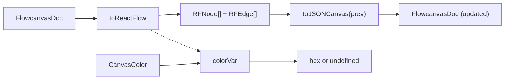

# Adapter

- The React Flow translation boundary for the canvas: owns all conversion between the canonical `FlowcanvasDoc` (extended-JSONCanvas 0.2) and the React Flow `{nodes, edges}` runtime representation.
- Path: `lib/canvas/adapter.ts`; stack: TypeScript 5.
- Public API: `toReactFlow(doc)` · `toJSONCanvas(rfNodes, rfEdges, prev)` · `colorVar(c?)`.
- Generated at depth by `flowcode:module-explorer-agent` (full mode); meets its § Module Doc Completeness Bar — real signatures, a usage example, config/env, traced deps, conventions.
- Status active; generated by bootstrap; last updated 2026-06-30 (006-semantic-edges merge).

---

## Purpose

The adapter is the single translation boundary between the persistent `FlowcanvasDoc` (extended-JSONCanvas 0.2 — the canonical disk format) and the React Flow runtime representation consumed by `<ReactFlow>`. `toReactFlow` converts document nodes into `RFNode[]`, handling the key transforms: `nodeKind` discrimination, `renderType` routing (a node carrying `meta.kind` with `type !== 'group'` maps to `renderType = 'component'`, routing it to `ComponentNode`; all others pass `kind` through; `adapter.ts:18`), absolute→relative child-position conversion, stable parent-before-child ordering, `extent:'parent'` assignment, dangling-`parentId` degradation to top-level, markdown auto-height flag (`autoHeight = renderType === 'markdown'`; `adapter.ts:19`), `--node-accent` injection from `n.color` or from `COMPONENT_KIND_META[kind].accent` for `meta.kind` boundary groups (`adapter.ts:21–22`), and `--fc-body-max` CSS variable injection. For edges, `toReactFlow` maps a pinned `fromSide`/`toSide` to a React Flow `sourceHandle`/`targetHandle` and leaves the handle `undefined` for a floating end (the edge component then recomputes a center-anchored endpoint; 005-edges); it threads every per-edge style field into `data` — `routing`, `line`, `labelT`, `points`, `color`, `fromSide`/`toSide`, `fromEnd`/`toEnd` — and **no longer emits `markerEnd`**, because the edge component now owns markers/stroke/path (`adapter.ts:40-52`). `toJSONCanvas` is the inverse: it maps React Flow geometry back onto the prior doc, restoring absolute positions for grouped children, and treats the doc edge (`prev`) as the source of truth for every edge field — it refreshes only `meta.origin`/`meta.rel` from RF `data` and merges them onto `base.meta`, so `routing`/`line`/`labelT`/`points` survive every sync (005-edges — this fixed the prior bug where an explicit `meta: { origin, rel }` dropped them; `adapter.ts:80-92`). `colorVar` resolves JSONCanvas preset indices ('1'–'6') to the nyx hex palette and passes raw hex strings through unchanged.

After 005-edges (markers moved to the edge component) the module imports **only type-only symbols** from `@xyflow/react` (`Node`/`Edge` as `RFNode`/`RFEdge`; `adapter.ts:1`) — the former `MarkerType` runtime enum import is gone. It stays DOM-free and fully type-only, so it remains unit-testable under the vitest gate.

**006-semantic-edges** added two new type imports from `./jsoncanvas` — `ConnectionPort` and `Side` (`adapter.ts:3`) — and a `portIndex` resolution block inside `toReactFlow`. After the nodes pass, a `portIndex` (`Map<string, Map<string, ConnectionPort>>`) is built from `n.meta.ports` for every node that declares ports (`adapter.ts:42–43`). A local `portST(nodeId, portId?)` helper resolves a port id to its `{ side: Side; t: number }` position without any React Flow handle re-measurement (`adapter.ts:44–47`). Each edge's `sourceHandle`/`targetHandle` is now set to `e.fromPort ?? e.fromSide` / `e.toPort ?? e.toSide` (`adapter.ts:53`) — a port-connected edge wins over a bare side-pin, and a fully floating end still falls back to `undefined`. Edge `data` gains three new fields: `edgeType` (from `e.meta?.edgeType`; drives typed semantic styling in the edge component; `adapter.ts:56`), `fromPort`/`toPort` (the port ids, geometry source of truth; `adapter.ts:60`), and the pre-resolved `fromPortST`/`toPortST` (`{ side, t } | undefined`; `adapter.ts:61`). `toJSONCanvas` is unchanged in behavior — it spreads `...base` for both nodes and edges, so `fromPort`/`toPort`, `meta.ports`, and `meta.edgeType` survive a round-trip without any special handling.

### Internal Architecture



---

## Public API

Concrete signatures only. No prose.

### Functions / Methods

```ts
// lib/canvas/adapter.ts:7
export const colorVar = (c?: CanvasColor): string | undefined

// lib/canvas/adapter.ts:9
export function toReactFlow(doc: FlowcanvasDoc): { nodes: RFNode[]; edges: RFEdge[] }

// lib/canvas/adapter.ts:70
export function toJSONCanvas(rfNodes: RFNode[], rfEdges: RFEdge[], prev: FlowcanvasDoc): FlowcanvasDoc
```

### HTTP Routes

Not applicable.

### Events / Messages

Not applicable.

### Exceptions / Errors

| Name | Raised When | Caught By |
|------|-------------|-----------|
| `Error("unknown node in RF state: {id}")` | `toJSONCanvas` receives an RF node id absent from `prev.nodes` | Caller — not caught internally (`lib/canvas/adapter.ts:60`) |

---

## Usage Examples

Derived from `lib/canvas/adapter.test.ts:83–128` (round-trip suite) — doc → RF and back.

```ts
// lib/canvas/adapter.test.ts:84–128
import { toReactFlow, toJSONCanvas, colorVar } from './adapter'
import type { FlowcanvasDoc } from './jsoncanvas'

const doc: FlowcanvasDoc = {
  nodes: [
    { id: 'n-design', type: 'file', file: 'design.md',
      x: -480, y: -200, width: 380, height: 320, color: '5',
      meta: { origin: 'user' } },
    { id: 'n-plan', type: 'file', file: 'plan.md',
      x: 40, y: -200, width: 380, height: 320,
      meta: { origin: 'user' } },
  ],
  edges: [
    { id: 'e-rel', fromNode: 'n-design', toNode: 'n-plan', toEnd: 'arrow',
      label: 'depends on', meta: { origin: 'user', rel: 'depends-on' } },
  ],
  flowcanvas: {
    schemaVersion: '0.2',
    session: { createdAt: '2026-01-01T00:00:00Z', updatedAt: '2026-01-01T00:00:00Z', revision: 1 },
    comments: [],
  },
}

// FlowcanvasDoc -> React Flow
const { nodes, edges } = toReactFlow(doc)
// nodes[0].type              === 'markdown'              (nodeKind dispatch)
// nodes[0].position          === { x: -480, y: -200 }   (top-level, absolute preserved)
// nodes[0].height            === undefined               (markdown auto-sized)
// nodes[0].style['--node-accent'] === '#5ef2ff'          (preset '5' via colorVar)
// edges[0].data.rel          === 'depends-on'            (meta.rel threaded through)
// edges[0].data.toEnd        === 'arrow'                 (marker shape in data; the edge component renders it)
// edges[0].markerEnd         === undefined               (005-edges: adapter no longer emits markerEnd)
// edges[0].sourceHandle      === undefined               (006: fromPort ?? fromSide; both absent → floating)
// edges[0].data.edgeType     === undefined               (006: no edgeType in this example; drives typed styling)
// edges[0].data.fromPort     === undefined               (006: no port connection in this example)
// edges[0].data.fromPortST   === undefined               (006: portST resolves to undefined — no port declared)

// React Flow -> FlowcanvasDoc (round-trip)
const back = toJSONCanvas(nodes, edges, doc)
// back.nodes[0].x            === -480                   (abs position preserved)
// back.edges[0].meta         deepEquals { origin: 'user', rel: 'depends-on' }
// back.flowcanvas            === doc.flowcanvas          (session identity preserved)

// colorVar preset resolution
colorVar('5')       // => '#5ef2ff'
colorVar('#abcdef') // => '#abcdef'
colorVar(undefined) // => undefined
```

Real call site: `lib/canvas/adapter.test.ts:84` (round-trip), `components/canvas/use-canvas-handlers.ts:36` (`toReactFlow` in production `useMemo`).

---

## Database Schema

Not applicable.

---

## Dependencies

**Upstream modules:**
- `lib/canvas/jsoncanvas` — all domain types (`FlowcanvasDoc`, `CanvasNode`, `CanvasEdge`, `CanvasColor`, `Side`, `EdgeOrigin`, `RelationshipType`, `ConnectionPort`) + `nodeKind` runtime discriminator + `COMPONENT_KIND_META` (per-kind accent table used for boundary-group `--node-accent` injection; `adapter.ts:3–4`). `ConnectionPort` and `Side` are 006-semantic-edges additions used by `portIndex` / `portST`.

**External services:**
- None.

**Key libraries:**
- `@xyflow/react` — `Node`/`Edge` type-only imports aliased to `RFNode`/`RFEdge` (`adapter.ts:1`). After 005-edges the module imports no runtime symbol from `@xyflow/react` (the former `MarkerType` enum left when markers moved to the edge component) — it is now fully type-only.
- `react` — `CSSProperties` type-only import for inline CSS variable injection (`adapter.ts:2`)

---

## Configuration & Environment

Not applicable — the module reads no environment variables and no config files.

---

## Run / Test / Lint

Commands scoped to this module. Cross-reference full project gates in `.flowcode/quality-checks/quality-checks-index.md`.

| Action | Command |
|--------|---------|
| Test (unit) | `npx vitest run lib/canvas/adapter.test.ts` |
| Test (all pure modules) | `npx vitest run` |
| Typecheck | `npx tsc --noEmit` |
| Lint | `npm run lint` |

---

## Key Insights

**Conventions & patterns:** The adapter is the React Flow translation boundary. After 005-edges moved per-edge markers into the edge component, the adapter no longer imports any runtime symbol from `@xyflow/react` (the former `MarkerType` enum is gone) — it is now fully type-only, matching the rest of `lib/canvas/*` which import zero React or RF symbols. The boundary is enforced by convention and the vitest gate (no browser environment): the adapter stays DOM-free so tests run without jsdom. `nodeKind` (from `jsoncanvas.ts`) is called once per node (`adapter.ts:15`) to derive `kind`. `renderType` is then computed at `adapter.ts:18`: if the node carries `meta.kind` and is not a `type:'group'` node, `renderType` is `'component'` (routing to `ComponentNode`); otherwise `renderType === kind`. The RF `type` field is set to `renderType` (`adapter.ts:30`), so React Flow dispatches to the correct renderer at runtime.

**Gotchas & invariants:**

- **Parent-before-child ordering invariant.** React Flow silently mis-renders group containment when a child precedes its parent in the nodes array. `toReactFlow` enforces a stable-sort partition at `adapter.ts:13` — parentless nodes first. Only one nesting level (content nodes inside groups; groups never inside groups) is assumed throughout.
- **Absolute ↔ relative position conversion.** The doc stores all coords as absolute canvas coordinates; React Flow children must be positioned relative to their parent. `toReactFlow` converts absolute→relative at `adapter.ts:23`; `toJSONCanvas` converts relative→absolute at `adapter.ts:54–56`. Forgetting this produces visually correct-looking nodes that save with wrong positions on disk.
- **Dangling `parentId` degradation.** A node whose `parentId` refers to a group absent from the board is silently demoted to a top-level node at its absolute coordinates (`adapter.ts:22–23`). The `parentId` is dropped from the RF output, preventing React Flow from crashing on an unknown parent id.
- **Markdown `height: undefined`.** `autoHeight = renderType === 'markdown'` (`adapter.ts:19`). When true, the node emits `height: undefined` (`adapter.ts:33`) so React Flow auto-measures the rendered body. This is intentional — the collapse toggle visibly shrinks the card only because React Flow re-measures. Component nodes (`renderType === 'component'`) set `autoHeight = false` and keep the authored `height` from the doc. Non-markdown, non-component nodes (`image`, `note`, `link`, `group`, `file`) also keep the authored `height`.
- **`toJSONCanvas` treats the doc edge (`prev`) as the source of truth for every edge field.** Edge endpoint reconnection is not enabled, so the doc edge holds the authoritative geometry, sides, color, marker ends, and 005-edges `meta` (`routing`/`line`/`labelT`/`points`). `toJSONCanvas` spreads `...base` and refreshes only `meta.origin`/`meta.rel` from RF `data`, merging them onto `base.meta` (`adapter.ts:84-88`). This is the 005-edges fix for the prior bug where writing an explicit `meta: { origin, rel }` dropped `routing`/`line`/`labelT`/`points` on every RF state sync. If `prev` is stale relative to the incoming RF edges (e.g. a newly-added edge has no `base`), the defensive fallback emits a minimal `{ toEnd:'arrow', meta:{ origin, rel } }` edge (`adapter.ts:91`) — callers must keep `prev` current.
- **`toJSONCanvas` is only exercised in tests today.** Production write-back after drag goes through `store.applyLayout(updates)`, which writes absolute positions directly into the Zustand doc without calling `toJSONCanvas`. The function is exported as the canonical inverse and is fully correct, but it is not on the production call-path as of plan 002 close.
- **`colorVar` is called in two branches inside `toReactFlow`.** At `adapter.ts:21` for user-authored `n.color` → `--node-accent`; and at `adapter.ts:22` for `meta.kind` boundary-group tinting: `colorVar(COMPONENT_KIND_META[n.meta.kind].accent)` → `--node-accent`. It is exported but no production caller outside `adapter.ts` currently imports it (only the test exercises it directly).

- **`boundary` on a non-group leaf routes to `component`, not the group outline.** A node with `meta.kind:'boundary'` and `type !== 'group'` is a valid (if unusual) shape: `renderType` resolves to `'component'` and `ComponentNode` renders it with a `frame` silhouette. The `.fc-group` SVG outline is only applied to `type:'group'` nodes. Phase 5 `validate.ts` is planned to reject this shape at import so it cannot reach the canvas in production.

- **006-semantic-edges — `portIndex` is rebuilt on every `toReactFlow` call; it is not cached.** The map `nodeId → portId → ConnectionPort` (`adapter.ts:42–43`) is constructed inline from `doc.nodes`. This is deliberate and cheap (linear scan of a typically small node list). Callers must not pass a stale `doc` and expect the index to reflect live port edits.
- **006-semantic-edges — `sourceHandle`/`targetHandle` precedence: port id wins over side.** The expression `e.fromPort ?? e.fromSide` (`adapter.ts:53`) means any edge carrying a `fromPort` binds to that specific connection handle (the dot). A side-only edge (`fromPort` absent) uses the side handle as before. A fully floating edge (both absent) emits `undefined`. This tri-state must be preserved when generating or patching edges — setting only `fromSide` on a port-connected edge will silently ignore the port.
- **006-semantic-edges — `fromPortST`/`toPortST` decouple rendering from React Flow handle positions.** Pre-resolving `{ side, t }` in the adapter (`adapter.ts:61`) means the edge component can draw its arrowhead anchored at the dot's canvas coordinate using only `data.fromPortST` / `data.toPortST` — it never needs to read or wait for a React Flow internal handle rect. If `portST` returns `undefined` (legacy edge, no port), the component falls back to the measured handle position.
- **006-semantic-edges — `toJSONCanvas` round-trip safety.** Because `toJSONCanvas` spreads `...base` for each edge (`adapter.ts:98`), any field present in the doc edge — including `fromPort`, `toPort`, and `meta.edgeType` — survives a React Flow state sync unchanged. No migration or explicit copy is needed when adding new fields to `CanvasEdge` that `toJSONCanvas` should passthrough.

---

## Known Gaps

- None detected.
