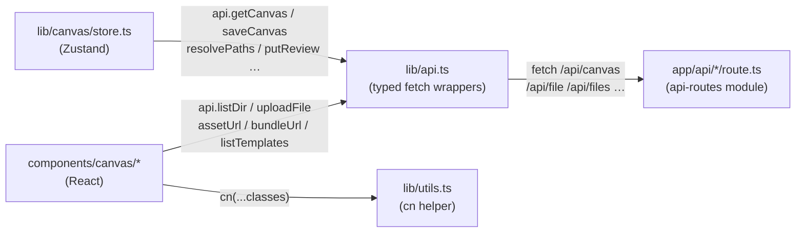

# API Client

- Owns the entire typed browser-side communication surface: `lib/api.ts` (16 exported symbols — 14 async wrappers + 2 synchronous URL builders) and `lib/utils.ts` (`cn()` — the single shared class-composition helper used by all components).
- Path: `lib/api.ts` + `lib/utils.ts`; stack: TypeScript 5, client-side `fetch` (browser), no framework dependency.
- Public API: `getCanvas`, `saveCanvas`, `resolvePaths`, `writeFileApi`, `readFileApi`, `deleteFileApi`, `listDir`, `uploadFile`, `assetUrl`, `getReview`, `putReview`, `clearReview`, `bundleUrl`, `listTemplates`, `getActive`, `putActive`; types: `ActiveBoard`, `ResolvedFile`, `DirEntry`; utility: `cn()`.
- Generated at depth by `flowcode:module-explorer-agent` (full mode); meets its § Module Doc Completeness Bar — real signatures, a usage example, config/env, traced deps, conventions.
- Status active; generated by bootstrap; last updated 2026-06-29.

---

## Purpose

`lib/api.ts` is the sole browser-side communication layer for Flowcanvas. Every call from the Zustand store (`lib/canvas/store.ts`) or a component that needs to reach a guarded Next.js Route Handler goes through a typed wrapper here — never through ad-hoc `fetch` calls scattered across the codebase. This keeps the route contract in one place: when a route changes its path, query parameter, or response shape, only `api.ts` needs updating. The module exports three categories of symbol: async wrappers that call `fetch` and surface typed results, synchronous URL builders (`assetUrl`, `bundleUrl`) used as `` / `<a href>` targets, and shared TypeScript interfaces for the API's request/response shapes.

`lib/utils.ts` is a two-line helper exporting `cn()` — `clsx` followed by `tailwind-merge` — used by every component that needs to compose Tailwind classes conditionally or merge variant overrides without class conflicts.

Both files are client-safe (no Node.js imports, no `fs`, no server-only modules) and have no dependencies on each other.

### Internal Architecture

Simple two-file module; no internal sub-components. Mermaid shows the data-flow position.



---

## Public API

Concrete signatures only. No prose.

### Interfaces

```typescript
// lib/api.ts:6 — active-board pointer read/written by the MCP sidecar (Decision 5)
export interface ActiveBoard {
  canvasRef: string
  baseRevision: number
  intent: string
}

// lib/api.ts:13 — one entry in a /api/canvas/resolve response
export interface ResolvedFile {
  path: string
  exists: boolean
  frontmatter?: Record<string, unknown>
  body?: string
  truncated?: boolean
  error?: string
}

// lib/api.ts:23 — one entry in a /api/files directory listing
export interface DirEntry {
  name: string
  path: string
  type: 'file' | 'directory'
  ext?: string
}
```

### Functions / Methods

```typescript
// lib/api.ts:39 — fetch FlowcanvasDoc by canvas file path
export async function getCanvas(path: string): Promise<FlowcanvasDoc>

// lib/api.ts:46 — POST the full doc; returns the server-bumped revision number
export async function saveCanvas(path: string, doc: FlowcanvasDoc): Promise<number>

// lib/api.ts:56 — batch-resolve markdown file paths to frontmatter + body
export async function resolvePaths(paths: string[]): Promise<ResolvedFile[]>

// lib/api.ts:67 — write agent-generated content to an .md/.mdx file
export async function writeFileApi(path: string, content: string): Promise<void>

// lib/api.ts:77 — read a file's raw content (no BODY_CAP truncation)
export async function readFileApi(path: string): Promise<string>

// lib/api.ts:84 — delete a markdown file (backs discardRound rollback, Decision 6)
export async function deleteFileApi(path: string): Promise<void>

// lib/api.ts:89 — list directory entries; defaults to repo root ('.')
export async function listDir(path?: string): Promise<DirEntry[]>

// lib/api.ts:96 — multipart-upload an image/markdown file; returns the relative path written
export async function uploadFile(file: File, dir?: string): Promise<string>

// lib/api.ts:106 — synchronous: returns the /api/asset URL for an image path (use as img src)
export function assetUrl(path: string): string

// lib/api.ts:113 — read the submit-time review snapshot (null when no round is pending, Decision 6)
export async function getReview(path: string): Promise<ReviewState | null>

// lib/api.ts:120 — write the review snapshot to the sibling .review.json file (Decision 6)
export async function putReview(path: string, review: ReviewState): Promise<void>

// lib/api.ts:129 — clear the review snapshot on accept or discard outcome (Decision 6)
export async function clearReview(path: string): Promise<void>

// lib/api.ts:136 — synchronous: returns the /api/canvas/bundle URL (use as <a download> href)
export function bundleUrl(path: string): string

// lib/api.ts:141 — list available .canvas template fragments from templates/ dir (Decision 8)
export async function listTemplates(): Promise<CanvasTemplate[]>

// lib/api.ts:148 — read the active-board pointer (null when none set, Decision 5)
export async function getActive(): Promise<ActiveBoard | null>

// lib/api.ts:155 — write the active-board pointer on load / openBoard (Decision 5)
export async function putActive(active: ActiveBoard): Promise<void>
```

### lib/utils.ts

```typescript
// lib/utils.ts:4 — compose Tailwind classes with clsx then deduplicate with tailwind-merge
export const cn = (...i: ClassValue[]) => twMerge(clsx(i))
```

### HTTP Routes (if applicable)

This module is the **client-side caller**, not the server. The routes it targets are owned by the `api-routes` module (`app/api/*/route.ts`). Cross-reference that module for server-side shapes.

| Wrapper | Method | Route | api-routes owner |
|---------|--------|-------|-----------------|
| `getCanvas` | GET | `/api/canvas?path=` | `app/api/canvas/route.ts` |
| `saveCanvas` | POST | `/api/canvas` | `app/api/canvas/route.ts` |
| `resolvePaths` | POST | `/api/canvas/resolve` | `app/api/canvas/resolve/route.ts` |
| `writeFileApi` | POST | `/api/file` | `app/api/file/route.ts` |
| `readFileApi` | GET | `/api/file?path=` | `app/api/file/route.ts` |
| `deleteFileApi` | DELETE | `/api/file?path=` | `app/api/file/route.ts` |
| `listDir` | GET | `/api/files?path=` | `app/api/files/route.ts` |
| `uploadFile` | POST | `/api/upload` | `app/api/upload/route.ts` |
| `assetUrl` | — | `/api/asset?path=` (URL only) | `app/api/asset/route.ts` |
| `getReview` | GET | `/api/canvas/review?path=` | `app/api/canvas/review/route.ts` |
| `putReview` | POST | `/api/canvas/review` | `app/api/canvas/review/route.ts` |
| `clearReview` | DELETE | `/api/canvas/review?path=` | `app/api/canvas/review/route.ts` |
| `bundleUrl` | — | `/api/canvas/bundle?path=` (URL only) | `app/api/canvas/bundle/route.ts` |
| `listTemplates` | GET | `/api/templates` | `app/api/templates/route.ts` |
| `getActive` | GET | `/api/canvas/active` | `app/api/canvas/active/route.ts` |
| `putActive` | POST | `/api/canvas/active` | `app/api/canvas/active/route.ts` |

### Events / Messages (if applicable)

Not applicable — no event bus, pub/sub, or WebSocket usage.

### Exceptions / Errors

| Name | Raised When | Caught By |
|------|-------------|-----------|
| `Error` (message from `{ error }` JSON or `"${status} ${statusText}"`) | Any non-2xx response from any route handler | Caller; e.g. store wraps `putActive` in `.catch((e) => console.error(...))` at `lib/canvas/store.ts:134` |

The private `jsonOrThrow<T>` function (`lib/api.ts:31`) is the single error-handling chokepoint for all async wrappers.

---

## Usage Examples

### api.ts — board load sequence (real call site)

```typescript
// From lib/canvas/store.ts:115–134 (load action)
// 1. Fetch the canvas doc
const doc = await api.getCanvas(path)
// -> FlowcanvasDoc with nodes, edges, flowcanvas.session

// 2. If a review round is pending, fetch its snapshot
const reviewState = await api.getReview(path).catch(() => null)
// -> ReviewState | null

// 3. Write the active-board pointer for the MCP sidecar
void api.putActive({ canvasRef: path, baseRevision: rev, intent: '' })
  .catch((e) => console.error('putActive failed', e))
```

Real call site: `lib/canvas/store.ts:116`, `lib/canvas/store.ts:129`, `lib/canvas/store.ts:133`.

### api.ts — applyResponse writes generated files (real call site)

```typescript
// From lib/canvas/store.ts:483
// After the pure merge, write each agent-generated file to disk
for (const g of resp.generatedFiles ?? []) {
  await api.writeFileApi(g.path, g.content)
}
```

Real call site: `lib/canvas/store.ts:483`.

### utils.ts — cn() variant composition (real call site)

```tsx
// From components/canvas/frontmatter-view.tsx:87
<div className={cn('fc-fm', variant === 'reader' ? 'fc-fm--reader' : 'fc-fm--card', className)}>
```

`cn()` merges the base class, a conditional variant class, and any caller-supplied override without producing duplicate or conflicting Tailwind utilities. Real call site: `components/canvas/frontmatter-view.tsx:87`.

### api.ts — listTemplates (real call site)

```typescript
// From components/canvas/template-tray.tsx:27
listTemplates()
  .then(setTemplates)
  .catch(console.error)
// -> CanvasTemplate[]  (each has: kind, id, name, description, nodes[], edges[])
```

Real call site: `components/canvas/template-tray.tsx:27`.

---

## Database Schema

Not applicable — this module issues HTTP requests; it owns no tables or migration files.

---

## Dependencies

**Upstream modules:**
- `lib/canvas/jsoncanvas` — `FlowcanvasDoc` type imported at `lib/api.ts:1`
- `lib/canvas/review` — `ReviewState` type imported at `lib/api.ts:2`
- `lib/canvas/templates` — `CanvasTemplate` type imported at `lib/api.ts:3`
- `api-routes` module (`app/api/*/route.ts`) — every async wrapper in `api.ts` targets a route owned by the api-routes module; both sides must agree on path, method, and JSON shape

**External services:**
- None — all requests target the same-origin Next.js server; no third-party APIs.

**Key libraries:**
- `clsx` ^2 — conditional class string building in `cn()` (`lib/utils.ts:1`)
- `tailwind-merge` ^3 — Tailwind utility deduplication in `cn()` (`lib/utils.ts:2`)
- Browser `fetch` (platform) — all async wrappers in `lib/api.ts`; no polyfill — Next.js 16 provides it in the browser context

---

## Configuration & Environment

### Environment Variables

Not applicable — `lib/api.ts` and `lib/utils.ts` read no environment variables. All route paths are hardcoded string literals. The server-side env var `FLOWCANVAS_ROOT` is consumed by the Route Handlers, not by this client module.

### Config Keys

Not applicable.

---

## Run / Test / Lint

`lib/api.ts` contains browser-only `fetch` calls and is not directly unit-tested in isolation (vitest runs in Node, which has no DOM). Route contract behaviour is verified from the server side via `app/api/routes-contract.test.ts`. `lib/utils.ts` has no dedicated test file — it is a two-line wrapper over well-tested upstream libraries.

| Action | Command |
|--------|---------|
| Typecheck (includes this module) | `npx tsc --noEmit` |
| Lint (includes this module) | `npm run lint` |
| Route contract tests | `npx vitest run app/api/routes-contract.test.ts` |
| Full unit suite | `npx vitest run` |

---

## Key Insights

**Conventions & patterns:**

- **Single error-handling chokepoint.** The private `jsonOrThrow<T>` function at `lib/api.ts:31` wraps every `fetch` response. It reads `{ error }` from a non-2xx JSON body and throws a typed `Error`, so all callers get a consistent surface — no caller needs to inspect `res.ok` itself.
- **Two synchronous URL builders, not async.** `assetUrl` (`lib/api.ts:106`) and `bundleUrl` (`lib/api.ts:136`) return plain strings — they are designed to be set as `` or `<a href download>` attributes directly. They never call `fetch`; the browser streams the response lazily. Changing them to async would break every `<ImageNode>` and the toolbar bundle button.
- **Namespace import in the store.** `lib/canvas/store.ts` imports the module as `import * as api from '../api'` (line 13), which means every call site reads `api.getCanvas(...)`, `api.saveCanvas(...)`, etc. This is intentional for readability given the high call density (20+ call sites in `store.ts`).
- **`writeFileApi` / `readFileApi` / `deleteFileApi` use `/api/file` (singular); `listDir` uses `/api/files` (plural).** These are separate Route Handlers with different shapes. Mixing them up is a frequent source of 404s.
- **cn() applies `twMerge` after `clsx`.** Order matters: `clsx` first resolves conditionals and arrays into a flat string; `twMerge` then deduplicates conflicting Tailwind utilities (last one wins). This enables the variant pattern in `<FrontmatterView>` where a caller-supplied `className` prop can safely override base styles.

**Gotchas & invariants:**

- **`getActive` response disambiguation.** The GET `/api/canvas/active` endpoint returns `ActiveBoard` when a board is set, or `{ active: null }` when none is set. `getActive()` at `lib/api.ts:151` uses `'active' in data` to distinguish the two shapes — not a `data !== null` check. If the server response shape ever changes, this guard must be updated simultaneously.
- **Paths are relative to `FLOWCANVAS_ROOT` but the client never validates them.** All path arguments passed to `getCanvas`, `resolvePaths`, `writeFileApi`, etc. are forwarded verbatim as query parameters or JSON body fields. Sandboxing is enforced server-side by `guardPath` in `lib/fs-guard.ts`. The client trusts the server to reject escaping paths with a 400.
- **`saveCanvas` mutates the doc's `session.revision` at the call site.** In `store.ts:139`, the returned revision is written directly into `doc.flowcanvas.session.revision`. This is a side-effectful pattern — callers that hold a stale doc reference will see an outdated revision.
- **`uploadFile` sends multipart/form-data (no `Content-Type` header set manually).** The `fetch` call at `lib/api.ts:100` passes a raw `FormData` body without setting `Content-Type`, which is correct — the browser must set the boundary automatically. Manually setting `Content-Type: multipart/form-data` would break the upload.
- **`listTemplates` has no path parameter.** It always reads from `templates/*.canvas` relative to `FLOWCANVAS_ROOT`; there is no per-board template override.

---

## Known Gaps

- `readFileApi` and `deleteFileApi` are used exclusively by the MCP sidecar path through the store (`resyncFile`, `discardRound`); no vitest coverage exists for the browser client side of these two wrappers — BL not yet assigned.
- `uploadFile` (`lib/api.ts:96`) does not appear in the Modules table row for `api-client` in `project-overview.md § Modules` — it is implemented and used by `dropzone.tsx` and `canvas-toolbar.tsx` but was not listed in the dispatcher's purpose string. No functional gap; documentation gap only.
