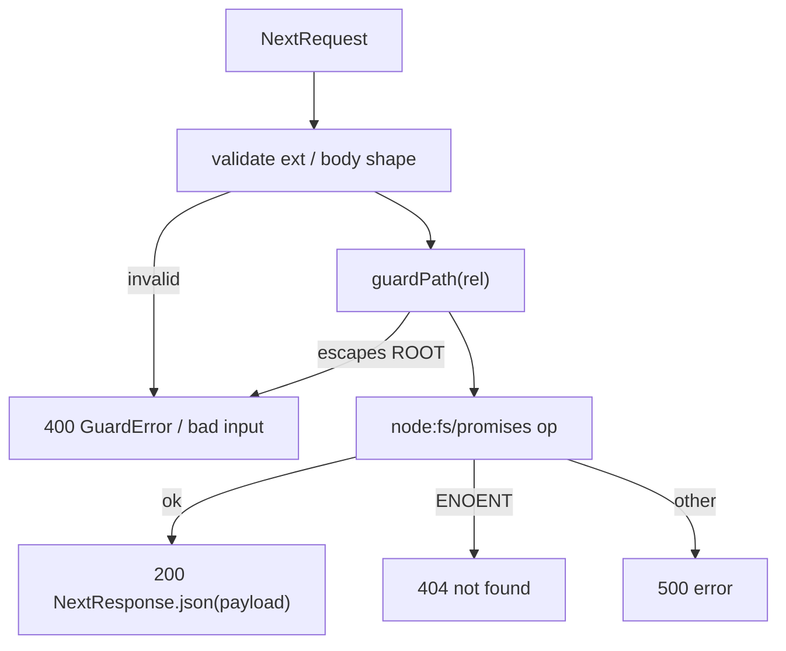

# API Routes

- Eleven Node-runtime Next.js App Router Route Handlers wrapping `node:fs` behind `guardPath`; serve the browser's `lib/api.ts` typed wrappers and the MCP sidecar over HTTP.
- Path: `app/api/`; stack: TypeScript 5 / Next.js 16 App Router — Node runtime (not Edge).
- Public API: 17 method × path combinations — canvas read/write/review/active/bundle, resolve, templates, asset, file CRUD, directory listing, multipart upload, markdown render.
- Generated at depth by `flowcode:module-explorer-agent` (full mode); meets its § Module Doc Completeness Bar — real signatures, a usage example, config/env, traced deps, conventions.
- Status active; generated by bootstrap; last updated 2026-06-29.

---

## Purpose

This module owns every HTTP surface between the browser client and the local filesystem. Each handler is a thin Node-runtime wrapper: it validates the request, calls `guardPath` to confine the operation to `FLOWCANVAS_ROOT`, reads or writes via `node:fs/promises`, and maps the three possible failures uniformly — `GuardError`→400, `ENOENT`→404, unexpected→500 — using typed `NextResponse.json`. No business logic lives here; pure library modules (`lib/canvas/*`, `lib/render-md.ts`) do the work. Consumers are `lib/api.ts` (typed browser fetch wrappers called from Zustand store actions) and `mcp/flowcanvas-mcp.ts` (MCP sidecar calling these routes over HTTP via `FLOWCANVAS_BASE_URL`).

### Internal Architecture



---

## Public API

Concrete signatures only. No prose.

### Functions / Methods

```typescript
// app/api/canvas/route.ts:9 — read FlowcanvasDoc from a .canvas file
export async function GET(req: NextRequest): Promise<NextResponse>

// app/api/canvas/route.ts:22 — write FlowcanvasDoc; bumps session.revision unless bump:false
export async function POST(req: NextRequest): Promise<NextResponse>

// app/api/canvas/resolve/route.ts:7 — batch-resolve paths to {frontmatter, body}
export async function POST(req: NextRequest): Promise<NextResponse>

// app/api/canvas/review/route.ts:14 — read <board-stem>.review.json snapshot (null when absent)
export async function GET(req: NextRequest): Promise<NextResponse>

// app/api/canvas/review/route.ts:27 — persist review snapshot at submit-time
export async function POST(req: NextRequest): Promise<NextResponse>

// app/api/canvas/review/route.ts:43 — delete review snapshot; idempotent
export async function DELETE(req: NextRequest): Promise<NextResponse>

// app/api/canvas/active/route.ts:18 — read .flowcanvas/active-board.json pointer (no params)
export async function GET(): Promise<NextResponse>

// app/api/canvas/active/route.ts:29 — write active-board pointer
export async function POST(req: NextRequest): Promise<NextResponse>

// app/api/canvas/bundle/route.ts:19 — stream fflate zip of board + md files + assets + manifest
export async function GET(req: NextRequest): Promise<Response>

// app/api/templates/route.ts:35 — list all or fetch-by-id CanvasTemplate fragments
export async function GET(req: NextRequest): Promise<NextResponse>

// app/api/asset/route.ts:6 — stream image bytes (IMAGE_EXT allowlist)
export async function GET(req: NextRequest): Promise<NextResponse>

// app/api/file/route.ts:14 — raw file read, no BODY_CAP
export async function GET(req: NextRequest): Promise<NextResponse>

// app/api/file/route.ts:41 — write .md/.mdx file (agent-generated content)
export async function POST(req: NextRequest): Promise<NextResponse>

// app/api/file/route.ts:28 — delete .md/.mdx file; idempotent
export async function DELETE(req: NextRequest): Promise<NextResponse>

// app/api/files/route.ts:6 — directory listing for file-picker
export async function GET(req: NextRequest): Promise<NextResponse>

// app/api/upload/route.ts:10 — multipart upload; image or markdown; 10 MB cap
export async function POST(req: NextRequest): Promise<NextResponse>

// app/api/render/route.ts:11 — render .md body to sanitized shiki HTML
export async function GET(req: NextRequest): Promise<NextResponse>
```

### Classes

Not applicable — no exported classes. `GuardError` is defined in `lib/fs-guard.ts` and caught by every handler; see Dependencies.

### HTTP Routes

| Method | Path | Purpose | Request Shape | Response Shape |
|--------|------|---------|---------------|----------------|
| GET | `/api/canvas` | Read `FlowcanvasDoc` from a `.canvas` file | `?path=<rel>` — `.canvas`/`.json` only | `{ doc: FlowcanvasDoc }` |
| POST | `/api/canvas` | Write `FlowcanvasDoc`; bumps `session.revision` (omit or skip with `bump:false`) | `{ path: string; doc: FlowcanvasDoc; bump?: boolean }` | `{ ok: true; revision: number }` |
| POST | `/api/canvas/resolve` | Batch-resolve paths to frontmatter + body objects | `{ paths: string[] }` | `{ resolved: ResolvedFile[] }` — always 200; per-path errors in array |
| GET | `/api/canvas/review` | Read `<board-stem>.review.json` snapshot | `?path=<board.canvas>` | `{ review: ReviewState \| null }` |
| POST | `/api/canvas/review` | Persist review snapshot at submit | `{ path: string; review: ReviewState }` — `baseRevision` + `snapshot` required | `{ ok: true }` |
| DELETE | `/api/canvas/review` | Clear review snapshot; idempotent | `?path=<board.canvas>` | `{ ok: true }` |
| GET | `/api/canvas/active` | Read `.flowcanvas/active-board.json` pointer | (no params) | `ActiveBoard \| { active: null }` |
| POST | `/api/canvas/active` | Write active-board pointer on `load`/`openBoard` | `{ canvasRef: string; baseRevision: number; intent?: string }` | `{ ok: true }` |
| GET | `/api/canvas/bundle` | Stream portable zip bundle | `?path=<board.canvas>` | `application/zip`; `Content-Disposition: attachment; filename="<stem>-bundle.zip"` |
| GET | `/api/templates` | List all `templates/*.canvas` fragments | (no params) | `{ templates: CanvasTemplate[] }` |
| GET | `/api/templates` | Fetch one template by id | `?id=<templateId>` | `{ template: CanvasTemplate }` (404 if not found) |
| GET | `/api/asset` | Stream image bytes | `?path=<rel>` — `.png .jpg .jpeg .gif .webp .svg .avif` only | binary `image/*`; `Cache-Control: no-store` |
| GET | `/api/file` | Raw file read (no BODY_CAP) | `?path=<rel>` | `{ content: string }` |
| POST | `/api/file` | Write agent-generated `.md`/`.mdx` | `{ path: string; content: string }` — `.md`/`.mdx` only | `{ ok: true }` |
| DELETE | `/api/file` | Delete `.md`/`.mdx` file; idempotent | `?path=<rel>` — `.md`/`.mdx` only | `{ ok: true }` |
| GET | `/api/files` | Directory listing for file-picker | `?path=<rel>` (default `.`) | `{ entries: DirEntry[] }` |
| POST | `/api/upload` | Multipart file upload (image or markdown) | `FormData { file: File; dir?: string }` — max 10 MB | `{ path: string }` — root-relative path written |
| GET | `/api/render` | Render `.md` body to sanitized shiki HTML | `?path=<rel>` — `.md`/`.mdx` only | `{ html: string }` |

**Shared response types** (`lib/api.ts`):

```typescript
// lib/api.ts:13 — one entry of a /api/canvas/resolve response
interface ResolvedFile {
  path: string
  exists: boolean
  frontmatter?: Record<string, unknown>
  body?: string
  truncated?: boolean
  error?: string
}

// lib/api.ts:23 — one entry of a /api/files directory listing
interface DirEntry {
  name: string
  path: string
  type: 'file' | 'directory'
  ext?: string
}

// lib/api.ts:6 — /api/canvas/active pointer shape
interface ActiveBoard {
  canvasRef: string
  baseRevision: number
  intent: string
}
```

### Events / Messages

Not applicable — no pub/sub or message bus. All handlers are synchronous request/response.

### Exceptions / Errors

| Name | Raised When | Caught By |
|------|-------------|-----------|
| `GuardError` | `guardPath(rel)` — path resolves outside `FLOWCANVAS_ROOT` | Every handler; mapped to `{ error: string }` 400 |
| `ENOENT` (`NodeJS.ErrnoException`) | `readFile`/`unlink` on a missing path | Every handler; mapped to 404 (or `{ ok: true }` for idempotent DELETEs) |
| Unhandled `Error` | Any unexpected fs or JSON-parse error | Every handler; mapped to `{ error: String(e) }` 500 |
| Implicit 400 | Wrong file extension, missing required body field, file too large (upload) | Inline validation before `guardPath` is called |

---

## Usage Examples

```typescript
// app/api/routes-contract.test.ts:58 — real test against the demo board
import { GET as canvasGET, POST as canvasPOST } from './canvas/route'
import { NextRequest } from 'next/server'

// GET: read an existing v2 board
const req = new NextRequest(new URL('/api/canvas?path=examples/commerce-platform.canvas', 'http://localhost'))
const res = await canvasGET(req)
// res.status === 200
const { doc } = await res.json()
// doc.flowcanvas.schemaVersion === '0.2'
// doc.edges.some(e => e.meta?.rel === 'calls') === true

// POST with bump:false — stamp session metadata without advancing the revision
// (MCP get_board uses this to write session.lastBriefId, app/api/routes-contract.test.ts:84)
const miniDoc = {
  nodes: [{ id: 'n1', type: 'text', text: 'hi', x: 0, y: 0, width: 100, height: 60 }],
  edges: [],
  flowcanvas: { schemaVersion: '0.2', session: { createdAt: 't', updatedAt: 't', revision: 2 }, comments: [] },
}
const writeReq = new NextRequest(new URL('/api/canvas', 'http://localhost'), {
  method: 'POST',
  body: JSON.stringify({ path: 'tmp/b.canvas', doc: miniDoc, bump: false }),
  headers: { 'content-type': 'application/json' },
})
const { revision } = await (await canvasPOST(writeReq)).json()
// revision === 2  — unchanged because bump:false
```

The example demonstrates the canvas GET + the `bump:false` POST variant. Real test at `app/api/routes-contract.test.ts:58` and `:84`.

---

## Database Schema

Not applicable — no SQL tables. Persisted artifacts are filesystem JSON files:
- `<path>.canvas` — `FlowcanvasDoc` (extended JSONCanvas v2); owned by `canvas/route.ts`.
- `<board-stem>.review.json` — `ReviewState` snapshot; owned by `canvas/review/route.ts`.
- `.flowcanvas/active-board.json` — `ActiveBoard` pointer; owned by `canvas/active/route.ts`.

---

## Dependencies

**Upstream modules:**
- `lib/fs-guard.ts` — `guardPath` + `GuardError`; called first in every handler (`app/api/canvas/route.ts:4`, et al.)
- `lib/canvas/jsoncanvas.ts` — `FlowcanvasDoc` type + `isFileNode` guard; used by `canvas/route.ts:5` and `canvas/bundle/route.ts:6`
- `lib/canvas/frontmatter.ts` — `parseFile` (resolve + render routes) + `stringifyFile` (bundle route bakes projected `links:` into md before zip)
- `lib/canvas/review.ts` — `ReviewState` type; used by `canvas/review/route.ts:5`
- `lib/canvas/templates.ts` — `CanvasTemplate` type; used by `templates/route.ts:5`
- `lib/canvas/edges.ts` — `projectLinksForExport`; used by `canvas/bundle/route.ts:7` to derive per-file `links:` lists from canvas edges
- `lib/render-md.ts` — `renderMarkdown`; used by `render/route.ts:5` to produce shiki HTML

**External services:**
- Local filesystem (`node:fs/promises`) — all read/write/delete/readdir operations; guarded by `FLOWCANVAS_ROOT`

**Key libraries:**
- `fflate` — `zipSync` + `strToU8`; `canvas/bundle/route.ts:4`
- `gray-matter` — `matter` parse for splitting/rejoining frontmatter in bundle; `canvas/bundle/route.ts:3`
- `next/server` — `NextRequest`, `NextResponse`; every handler

**Consumers (not upstream — listed for navigability):**
- `lib/api.ts` — 16 typed fetch wrappers covering every route; the browser's sole entry point
- `mcp/flowcanvas-mcp.ts` — calls routes over HTTP via `FLOWCANVAS_BASE_URL` (default `http://localhost:3000`)

---

## Configuration & Environment

### Environment Variables

| Variable | Required | Default | Read At (`path:line`) | Purpose |
|----------|----------|---------|-----------------------|---------|
| `FLOWCANVAS_ROOT` | No | `process.cwd()` | `lib/fs-guard.ts:7` | Filesystem root for all guarded routes; every `guardPath` call resolves against this; paths escaping it receive 400 |

### Config Keys

Not applicable — no external config store or config file keys. The constant `ACTIVE_POINTER = '.flowcanvas/active-board.json'` is hardcoded at `canvas/active/route.ts:10`.

---

## Run / Test / Lint

| Action | Command |
|--------|---------|
| Test (route contracts only) | `npx vitest run app/api/routes-contract.test.ts` |
| Test (all — 143 tests) | `npx vitest run` |
| Typecheck | `npx tsc --noEmit` |
| Lint | `npm run lint` |
| Build | `npm run build` |

---

## Key Insights

**Conventions & patterns:**

- **Universal guard-then-map pattern** (enforced across all 11 files): every handler calls `guardPath(rel)` before any `fs` operation; the catch block then discriminates `instanceof GuardError` → 400, `.code === 'ENOENT'` → 404, anything else → 500. Any new handler that deviates from this three-way mapping will be inconsistent with the rest of the module.
- **`bump:false` semantics** (`canvas/route.ts:29`): POST `/api/canvas` normally increments `doc.flowcanvas.session.revision`. Passing `bump: false` writes the doc with only `updatedAt` updated, leaving `revision` unchanged. Added in Phase 7 (D3) so the MCP `get_board` tool can stamp `session.lastBriefId` without triggering the change-review round-ready poll (`use-round-ready` hooks on revision changes).
- **Idempotent DELETEs** (`canvas/review/route.ts:51`, `file/route.ts:36`): `ENOENT` on DELETE returns `{ ok: true }`. Callers (`clearReview`, `deleteFileApi`) need not pre-check existence; this matches the "already gone = success" semantic for rollback flows.
- **Review-file naming** (`canvas/review/route.ts:12`): `reviewPathFor` derives the sibling path via `board.replace(/\.(canvas|json)$/, '') + '.review.json'`. The `path` query param must always be the `.canvas` path, never the `.review.json` path directly.
- **`resolve` always returns 200** (`canvas/resolve/route.ts:18`): per-path errors are inlined as `{ exists: false, error: string }` in the `resolved` array. HTTP-level 4xx/5xx are only emitted for total handler failure, not individual missing files.
- **`file` GET has no BODY_CAP** (`file/route.ts:14`): unlike `parseFile` which caps at 40 000 chars for card display, `GET /api/file` reads the full file. Intentional — MCP `read_file` needs the full document for agent extraction.
- **Bundle projects `links:` at export** (`canvas/bundle/route.ts:40-46`): `projectLinksForExport(doc)` derives per-file link lists from canvas edges; the bundle writes these into each markdown file's `links:` frontmatter via `stringifyFile` before zipping. This is the only place `stringifyFile` is used in the route layer.
- **`export const runtime = 'nodejs'`**: the four v2 routes (`canvas/review`, `canvas/active`, `canvas/bundle`, `templates`) plus `file` declare this explicitly. Original routes rely on the project-level Node default; for new route handlers the explicit declaration is the safe convention.

**Gotchas & invariants:**

- `canvas/active` GET accepts **no parameters** (`active/route.ts:18`; signature is `GET()` not `GET(req)`). The pointer path `.flowcanvas/active-board.json` is always fixed relative to `ROOT`. Do not add query-param routing.
- `canvas/bundle` returns a raw `Response` (not `NextResponse`) with a binary body (`canvas/bundle/route.ts:67`). `lib/api.ts:136` exposes `bundleUrl` as an `<a download>` href, not a `fetch` call. Do not change the return to JSON.
- `guardPath` is **lexical only** (`lib/fs-guard.ts:9`): symlinks are not dereferenced. A symlink inside `ROOT` pointing outside `ROOT` will bypass the guard silently.
- **Deleted route:** `canvas/links` (`POST /api/canvas/links` + `patchLinks` write-back) was removed in plan `002` Phase 4 (Decision 4). The store is now canvas-authoritative; `links:` frontmatter is only written at bundle-export time. Any reference to this route in older code or docs is obsolete.
- **No auth or rate-limiting** on any route — designed for single-user local use only.

---

## Known Gaps

- `guardPath` does not dereference symlinks — a symlink inside ROOT pointing outside ROOT bypasses the guard. Not tracked in backlog; low priority for single-user local tool.
- `ACTIVE_POINTER` path (`.flowcanvas/active-board.json`) is hardcoded; not configurable via env. A `FLOWCANVAS_STATE_DIR` variable would be needed for multi-board concurrency.
- No auth or rate-limiting on any route — must be addressed before any networked or multi-user deployment.
- **Deleted route history:** `canvas/links` (Phase-8 `links:` write-back) retired in plan `002` Phase 4 — Decision 4. Noted here for agents reading older git history references.
