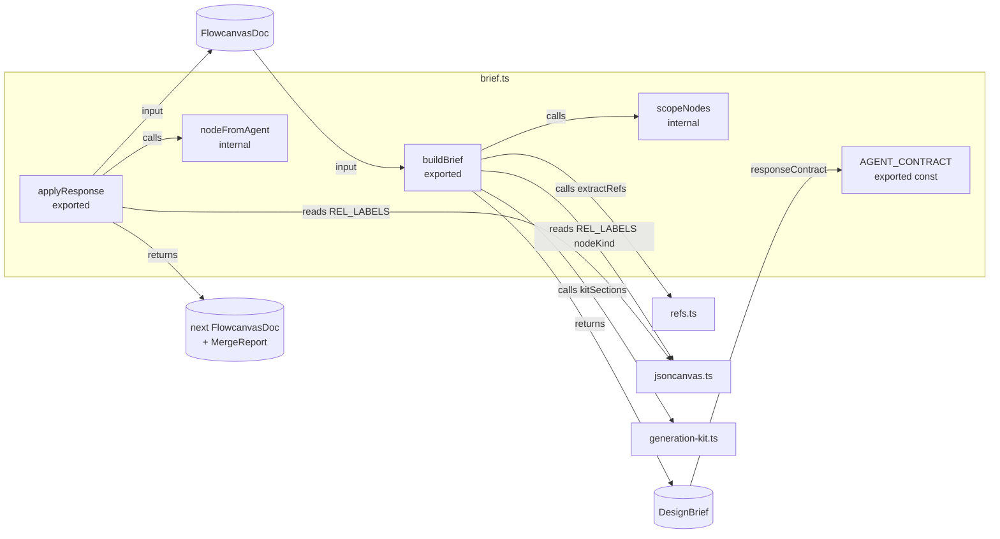

# Brief / Merge

- Human↔agent round-trip core: exports the board as a self-contained `DesignBrief`, receives an `AgentResponse`, and merges it back via an 8-step idempotent pure function. Everything else in the system wraps these two primitives.
- Path: `lib/canvas/brief.ts`; stack: TypeScript 5 — pure (no React, no DOM, no fs, no clock).
- Public API: `buildBrief`, `applyResponse`, `AGENT_CONTRACT` (re-export of `kitSections().schemaContract`); types: `DesignBrief`, `AgentResponse`, `MergeReport`, `BriefNode`, `BriefEdge`, `AgentNode`, `AgentEdge`.
- Generated at depth by `flowcode:module-explorer-agent`; meets its § Module Doc Completeness Bar — real signatures, a usage example, config/env, traced deps, conventions.
- Status active; generated by bootstrap; last updated 2026-06-30.

---

## Purpose

`brief.ts` is the human↔agent contract layer. `buildBrief` serialises the live `FlowcanvasDoc` into a self-contained `DesignBrief` (every file node's frontmatter + body embedded, edges with typed `rel`, comment threads addressed by id, the `AGENT_CONTRACT` verbatim). `applyResponse` performs an 8-step, id-keyed, idempotent merge of the agent's `AgentResponse` back onto the doc, returning both the next doc and a `MergeReport`. Both functions are **100% pure** — no filesystem, no network, no clock — so the store (`lib/canvas/store.ts`) and the MCP sidecar (`mcp/flowcanvas-mcp.ts`) each wrap them with the required I/O. The `AGENT_CONTRACT` constant is now a re-export of `kitSections().schemaContract` from `generation-kit.ts` (`brief.ts:149`). Every brief's `responseContract` field, the MCP resource (Phase 3), and `docs/flowcanvas-agent-contract.md` all render from the same source — manual sync is no longer required.

### Internal Architecture



---

## Public API

Concrete signatures only. No prose.

### Functions / Methods

```typescript
// lib/canvas/brief.ts:197
export function buildBrief(
  doc: FlowcanvasDoc,
  canvasRef: string,
  resolved: Map<string, { frontmatter?: Record<string, unknown>; body?: string; truncated?: boolean }>,
  briefId: string,
  generatedAt: string,
): DesignBrief

// lib/canvas/brief.ts:298
export function applyResponse(
  prev: FlowcanvasDoc,
  resp: AgentResponse,
  mintId: (prefix: string) => string,
  now: string,
): { next: FlowcanvasDoc; report: MergeReport }
```

Internal helpers (not exported):

```typescript
// lib/canvas/brief.ts:174
function scopeNodes(nodes: CanvasNode[], scopeIds: string[]): CanvasNode[]
// Structural closure: selected nodes + their ancestor groups + all descendants of a selected group.

// lib/canvas/brief.ts:265
function nodeFromAgent(an: AgentNode, id: string, existing?: CanvasNode): CanvasNode
// Shallow-merges geometry/content from AgentNode onto any existing CanvasNode, stamps origin:'agent'.
// Group-specific: preserves existing label when agent update omits it.
```

### Classes

Not applicable — pure TypeScript interfaces only.

### Exported Interfaces & Types

```typescript
// lib/canvas/brief.ts:35–50 — Direction A: human → agent
export interface BriefNode {
  id: string
  kind: NodeKind
  position: { x: number; y: number; width: number; height: number }
  path?: string           // markdown/image/file (root-relative)
  url?: string            // link node
  text?: string           // note node
  label?: string          // group display label (v2)
  parentId?: string       // group membership (v2)
  source?: NodeSource     // provenance back to source doc (v2)
  refs?: DocRef[]         // parsed frontmatter + body refs (v2)
  frontmatter?: Record<string, unknown>
  body?: string           // body without frontmatter, embedded
  truncated?: boolean     // body was capped at BODY_CAP
  componentKind?: ComponentKind  // 004 — surfaces meta.kind so the agent preserves it
}

// lib/canvas/brief.ts:55–73
export interface BriefEdge {
  id: string
  from: string
  to: string
  label?: string
  rel?: RelationshipType  // typed relationship (v2) — legacy, kept one version
  edgeType?: EdgeType     // 006 — semantic flow type; drives the legend {color,line,head} (`brief.ts:61`)
  origin: EdgeOrigin
  // 005-edges — echo the current visual style so the agent can preserve or restyle it (parity)
  routing?: EdgeRouting
  line?: EdgeLineStyle
  color?: CanvasColor
  fromSide?: Side
  toSide?: Side
  fromEnd?: EdgeEnd
  toEnd?: EdgeEnd
  labelT?: number
  points?: { x: number; y: number }[]
}

// lib/canvas/brief.ts:57–64
export interface BriefComment {
  id: string
  threadId: string        // root comment id; reply by setting parentId = threadId
  anchorNodeId?: string   // present for node-anchored comments
  author: string
  text: string
  createdAt: string
  resolved: boolean
}

// lib/canvas/brief.ts:68–80 — Direction A: human → agent (top-level envelope)
export interface DesignBrief {
  briefVersion: '0.1'
  briefId: string         // uuid; also written to session.lastBriefId on export
  canvasRef: string       // path of the .canvas file, root-relative
  baseRevision: number    // session.revision at export time (concurrency token)
  generatedAt: string
  intent: string          // session.intent — the framing the agent reads first
  nodes: BriefNode[]
  edges: BriefEdge[]
  comments: BriefComment[]
  responseContract: string  // inline copy of the Agent Contract (kitSections().schemaContract)
  coreDocPath?: string      // 004 — tells the agent which doc is the spine (read it on a round)
}

// lib/canvas/brief.ts:80–83 — Direction B: agent → tool
export interface GeneratedFile {
  path: string
  content: string         // includes YAML frontmatter
}

// lib/canvas/brief.ts:88–104
export interface AgentNode {
  id?: string             // present + known → update; absent or new → create
  type: 'file' | 'link' | 'text' | 'group'
  x: number; y: number; width: number; height: number
  file?: string
  url?: string
  text?: string
  label?: string          // group display label (v2)
  shape?: NodeShape       // group outline shape (v2)
  parentId?: string       // group membership (v2)
  source?: NodeSource     // provenance (v2)
  color?: CanvasColor
  kind?: ComponentKind    // 004 — agent emits the semantic kind; nodeFromAgent → meta.kind
}

// lib/canvas/brief.ts:120–137
export interface AgentEdge {
  id?: string
  fromNode: string
  toNode: string
  fromSide?: Side         // 005-edges: omit ⇒ the endpoint floats from node center
  toSide?: Side
  label?: string
  rel?: RelationshipType  // typed relationship (v2) — legacy, optional
  edgeType?: EdgeType     // 006 — semantic flow type (data-flow|request|response|event|dependency|reference); drives the legend style (`brief.ts:128`)
  // 005-edges — full parity with the human edge Style panel
  routing?: EdgeRouting   // 'bezier' (default) | 'smoothstep' | 'straight'
  line?: EdgeLineStyle    // 'solid' (default) | 'dashed' | 'dotted'
  color?: CanvasColor     // hex "#RRGGBB" or preset "1".."6"; omit ⇒ provenance default
  fromEnd?: EdgeEnd       // start marker shape; omit ⇒ 'none'
  toEnd?: EdgeEnd         // end marker shape; omit ⇒ 'arrow'
  labelT?: number         // 0..1 label position along the path; omit ⇒ 0.5
  points?: { x: number; y: number }[]   // manual line waypoints (absolute canvas coords); omit ⇒ auto-route
}

// lib/canvas/brief.ts:109–115
export interface AgentComment {
  id?: string
  parentId: string | null // null → new annotation; string → reply to that thread
  anchor: CommentAnchor
  author: string
  text: string
  createdAt?: string      // tool stamps if absent
}

// lib/canvas/brief.ts:117–127
export interface AgentResponse {
  responseVersion: '0.1'
  briefId: string         // echoes DesignBrief.briefId (concurrency check)
  summary: string
  upsertNodes?: AgentNode[]
  removeNodeIds?: string[]
  upsertEdges?: AgentEdge[]
  removeEdgeIds?: string[]
  comments?: AgentComment[]
  generatedFiles?: GeneratedFile[]
}

// lib/canvas/brief.ts:129–136
export interface MergeReport {
  stale: boolean                  // resp.briefId !== session.lastBriefId
  generatedFiles: string[]        // paths the caller must POST to /api/file
  created: { nodes: number; edges: number; comments: number }
  updated: { nodes: number; edges: number }
  removed: { nodes: number; edges: number }
  conflicts: string[]             // always [] — per-node revision tracking not yet implemented
}

// lib/canvas/brief.ts:149
export const AGENT_CONTRACT: string  // re-export of kitSections().schemaContract — single source of truth (004)
```

### HTTP Routes (if applicable)

Not applicable — this module is pure; HTTP wrapping is in `app/api/` and `mcp/`.

### Events / Messages (if applicable)

Not applicable — no pub/sub.

### Exceptions / Errors

| Name | Raised When | Caught By |
|------|-------------|-----------|
| none | `buildBrief` and `applyResponse` never throw — they return structured data | n/a |

---

## Usage Examples

The worked example below is derived from `lib/canvas/brief.test.ts:35–118` (the primary test suite).

```typescript
import { buildBrief, applyResponse, AGENT_CONTRACT } from './brief'
import type { FlowcanvasDoc, AgentResponse } from './brief'

// ── 1. Seed a minimal board ──
const doc: FlowcanvasDoc = {
  nodes: [
    { id: 'n-design', type: 'file', file: 'examples/design.md', x: -480, y: -200, width: 380, height: 320,
      meta: { origin: 'user' } },
    { id: 'n-plan', type: 'file', file: 'examples/plan.md', x: 40, y: -200, width: 380, height: 320,
      meta: { origin: 'user' } },
  ],
  edges: [
    { id: 'lk:n-design->n-plan', fromNode: 'n-design', toNode: 'n-plan', label: 'links',
      toEnd: 'arrow', meta: { origin: 'links' } },
  ],
  flowcanvas: {
    schemaVersion: '0.1',
    session: {
      intent: 'Map the design<->plan assets.',
      createdAt: '2026-06-25T10:00:00Z', updatedAt: '2026-06-25T10:42:00Z',
      revision: 7, lastBriefId: 'brief-77a1',
    },
    comments: [],
  },
}

// ── 2. Build the brief (human → agent) ──
const resolved = new Map([
  ['examples/design.md', { frontmatter: { name: 'design', status: 'approved' }, body: '## Problem', truncated: false }],
  ['examples/plan.md', { frontmatter: { name: 'plan' }, body: '## Steps', truncated: false }],
])
const brief = buildBrief(doc, 'board.canvas', resolved, 'brief-77a1', '2026-06-26T00:00:00Z')
// brief.briefVersion === '0.1'
// brief.briefId      === 'brief-77a1'
// brief.responseContract === AGENT_CONTRACT  (verbatim)
// brief.edges[0]     === { id: 'lk:...', from: 'n-design', to: 'n-plan', rel: 'references', origin: 'links' }

// ── 3. Agent returns a response ──
const resp: AgentResponse = {
  responseVersion: '0.1',
  briefId: 'brief-77a1',
  summary: 'Added a tests node + answered the file-API question.',
  upsertNodes: [
    { id: 'ag-tests', type: 'file', file: 'examples/tests.md', x: 460, y: -200, width: 380, height: 320 },
  ],
  upsertEdges: [
    { id: 'ag-e1', fromNode: 'n-plan', toNode: 'ag-tests', label: 'verified by' },
  ],
  generatedFiles: [{ path: 'examples/tests.md', content: '---\nname: tests\n---\n## Tests' }],
  comments: [{ parentId: null, anchor: { kind: 'canvas', x: 0, y: 0 }, author: 'agent:opus-4.8', text: 'Done.' }],
}

// ── 4. Merge (agent → tool) ──
let idSeq = 0
const mintId = (prefix: string) => `${prefix}${(++idSeq).toString(16).padStart(4, '0')}`
const { next, report } = applyResponse(doc, resp, mintId, '2026-06-26T01:00:00Z')

// report === {
//   stale: false,
//   generatedFiles: ['examples/tests.md'],  // caller must POST these to /api/file
//   created: { nodes: 1, edges: 1, comments: 1 },
//   updated: { nodes: 0, edges: 0 },
//   removed: { nodes: 0, edges: 0 },
//   conflicts: [],
// }
// next.flowcanvas.session.revision === 8     (bumped)
// next.nodes.find(n => n.id === 'ag-tests').meta.origin === 'agent'

// ── 5. Idempotency: applying the same response again is a no-op ──
const { report: report2 } = applyResponse(next, resp, mintId, '2026-06-26T02:00:00Z')
// report2.created === { nodes: 0, edges: 0, comments: 0 }  (nothing new; existing items updated in place)
```

Derived from `lib/canvas/brief.test.ts:93–118` (the `applyResponse` happy-path test). The full idempotency property is verified at `lib/canvas/brief.test.ts:120–129`.

---

## Database Schema

Not applicable — this module owns no tables and performs no persistence.

---

## Dependencies

**Upstream modules:**
- `lib/canvas/jsoncanvas.ts` — imports `FlowcanvasDoc`, `CanvasNode`, `CanvasEdge`, `Comment`, `CommentAnchor`, `NodeKind`, `EdgeOrigin`, `CanvasColor`, `Side`, `FileNode`, `LinkNode`, `TextNode`, `RelationshipType`, `EdgeType`, `NodeSource`, `NodeShape`, `ComponentKind`, `nodeKind`, `REL_LABELS`; 005-edges also `EdgeEnd`, `EdgeRouting`, `EdgeLineStyle`; 006 adds `EdgeType` (`brief.ts:11–33`)
- `lib/canvas/refs.ts` — imports `extractRefs`, `DocRef` to populate `BriefNode.refs` for file nodes (`brief.ts:30`)
- `lib/canvas/generation-kit.ts` — imports `kitSections` to provide `AGENT_CONTRACT` and embed `responseContract` in every brief (`brief.ts:31`)

**External services:**
- None — the module is pure.

**Key libraries:**
- None — no third-party imports; only TypeScript built-ins.

**Known callers (not imported by brief.ts, but depend on it):**
- `lib/canvas/store.ts:6` — wraps both exports with uuid mint, `resolvePaths` HTTP fetch, and `POST /api/canvas` persistence
- `mcp/flowcanvas-mcp.ts:15` — wraps both exports behind the MCP `get_board` / `apply_response` tools
- `components/canvas/export-panel.tsx:18–19` — calls via Zustand store actions

---

## Configuration & Environment

Not applicable — this module reads no environment variables and no config keys. It is fully parameterised by its function arguments.

---

## Run / Test / Lint

Commands scoped to this module. Cross-reference full project gates in `.flowcode/quality-checks/quality-checks-index.md`.

| Action | Command |
|--------|---------|
| Run | Not applicable (library module — no entry point) |
| Test (unit) | `npx vitest run lib/canvas/brief.test.ts` |
| Test (integration) | `npm run smoke:mcp` (requires app running; exercises `buildBrief`/`applyResponse` end-to-end via the MCP sidecar) |
| Lint | `npm run lint` (project-wide flat ESLint config) |
| Typecheck | `npx tsc --noEmit` |

---

## Key Insights

**Conventions & patterns:**

- **Pure by contract.** Both `buildBrief` and `applyResponse` accept all their inputs as arguments and return plain data — no side effects, no I/O (`brief.ts:1–10`). The caller is responsible for timestamps (`generatedAt`, `now`), id minting (`mintId`), file reads (the `resolved` map), and all writes. This makes both functions independently unit-testable with zero mocking.
- **8-step merge sequence.** `applyResponse` labels its steps in comments: (1) stale check, (3) upsert nodes, (5) upsert edges, (6) upsert comments, (7) explicit removals, (8) bump revision. Steps (2) — write generated files — and (4) — re-resolve + re-derive — happen in the store/MCP wrapper, not here (`brief.ts:296–298`).
- **Idempotency mechanisms.** (a) Nodes and edges key by `id` — reusing an `ag-*` id is an update, not a create. (b) An id-less `AgentEdge` is skipped when the directed `from→to` pair already exists on the board (`brief.ts:356`). (c) Comments dedup by `id` when present, else by `(parentId, author, text)` content-signature (`brief.ts:288,374–377`). The test at `lib/canvas/brief.test.ts:120` verifies this end-to-end.
- **Scope-aware submit chokepoint.** `scopeNodes` is the single place that resolves selection → structural closure. It covers two use-cases from one code path: the MCP `get_board` tool (scoped extraction) and the clipboard Export button in `export-panel.tsx`. Triggered only when `session.briefScope` is non-empty (`brief.ts:207–209`).
- **Edge `rel` defaults (legacy) and `edgeType` (006 — primary).** `rel` is demoted to legacy/optional; `edgeType` is now the primary semantic edge meaning (drives color+line+head via the legend). During `buildBrief`, `edgeType` is echoed from `e.meta.edgeType` via conditional spread — only present when set (`brief.ts:249`). During `applyResponse` on the **update branch**, `edgeType` is threaded via `...(ae.edgeType !== undefined ? { edgeType: ae.edgeType } : {})` (`brief.ts:382`); on the **create branch**, `edgeType` defaults to `'reference'` when the agent omits it — matching the neutral default applied by the human `onConnect` handler (`brief.ts:408`). `rel` defaults still apply for label resolution: `links`-origin → `'references'`; others → `'related'` (`brief.ts:245`). The `RelationshipType` catalog (8 values) is in `lib/canvas/jsoncanvas.ts`; the `EdgeType` catalog is also there (imported at `brief.ts:25`).
- **Group label preservation.** `nodeFromAgent` checks: if the `AgentNode` has no `label` but the existing `CanvasNode` is a group with a label, the existing label is kept (`brief.ts:267–268`). This prevents an agent update that merely moves a group from silently erasing its display name.
- **Edge style parity (005-edges) + semantic type parity (006).** `buildBrief` emits each edge's visual style onto `BriefEdge` via conditional spreads — only fields actually set on the doc edge appear (`brief.ts:246–259`), so a plain edge stays terse; `edgeType` follows the same pattern (`brief.ts:249`). `applyResponse` threads the same nine style fields (`routing`/`line`/`color`/`fromSide`/`toSide`/`fromEnd`/`toEnd`/`labelT`/`points`) **plus `edgeType`** on BOTH the update branch (`brief.ts:377–387`) and the create branch (`brief.ts:399–413`), so an agent can set or restyle the semantic type of edges at full parity with a human using the Style panel. `toEnd` defaults to `'arrow'` and `edgeType` defaults to `'reference'` on create when the agent omits them.
- **`AgentNode.kind` threads to `NodeMeta.kind` via `nodeFromAgent` (004).** When the agent emits `kind` on an `AgentNode`, `nodeFromAgent` spreads it into `meta: { ...existing.meta, kind: an.kind }` (`brief.ts:261`). `buildBrief` propagates `meta.kind` back in the other direction as `componentKind` on `BriefNode` (`brief.ts:203`). Both directions are additive and optional — a round-trip through an agent that does not know about `ComponentKind` leaves `meta.kind` intact via the `...existing.meta` spread.

**Gotchas & invariants:**

- **`AGENT_CONTRACT` is a re-export, not a standalone string (004 — single source).** The constant at `brief.ts:149` is `kitSections().schemaContract` from `generation-kit.ts`. `DesignBrief.responseContract` and `docs/flowcanvas-agent-contract.md` both render from the same source; no manual sync is required. Edit `generation-kit.ts` to change the contract — all surfaces update automatically.
- **`conflicts` is always `[]`.** `MergeReport.conflicts` is structurally present but never populated (`brief.ts:310`). Per-node revision tracking is not implemented; the merge policy is last-writer-wins with the `stale` flag as the only coarse warning.
- **`generatedFiles` paths must be written by the caller.** `applyResponse` returns `report.generatedFiles` as a path list only — it does **not** write files. The store wrapper (or MCP sidecar) is responsible for `POST /api/file` for each path in that list before the next render cycle.
- **`baseRevision` is a read-only concurrency token.** `buildBrief` embeds `session.revision` at export time. `applyResponse` does not enforce it — the stale flag is informational only. No merge conflict resolution occurs; last `applyResponse` wins.
- **Brief scope filters comments.** When `briefScope` is set, only comments anchored to nodes within the scope (i.e., `anchor.kind === 'node' && inScope.has(anchor.nodeId)`) are included. Canvas-anchored comments (`anchor.kind === 'canvas'`) are silently dropped from scoped briefs (`brief.ts:238`).
- **History context.** The `scopeNodes` function and v2 group/typed-edge surfaces were added in the studio UX follow-ups commit (`0d3244d`). The initial `buildBrief`/`applyResponse` pair shipped in plan `001` phase 6–7 (`f3a92ff`). V2 typed edges, `NodeSource` provenance, and `AgentNode.type:'group'` were integrated in plan `002` (`74f0cc8`).

---

## Known Gaps

- `MergeReport.conflicts` is structurally present but always `[]` — per-node revision tracking needed to populate it.
- Canvas-anchored comments are silently excluded from scoped briefs; this is undocumented in `AGENT_CONTRACT`.
- ~~No automated sync check between `AGENT_CONTRACT` and `docs/flowcanvas-agent-contract.md`~~ — resolved in Phase 1 (004). Both surfaces now render from `kitSections().schemaContract` in `generation-kit.ts` (`brief.ts:149`). Drift on contract edits is no longer possible via this path.

## Update 2026-06-30 — semantic typed edges, agent parity (006-semantic-edges Phase 4)

`BriefEdge` gains `edgeType?: EdgeType` (`brief.ts:61`) — the primary semantic flow type (color+line+head
driven by the legend); `rel` is demoted to legacy/optional. `AgentEdge` gains the same field at
`brief.ts:128`. `buildBrief` echoes `e.meta.edgeType` via conditional spread (`brief.ts:249`).
`applyResponse` threads `edgeType` on the **update branch** as a conditional spread
(`...(ae.edgeType !== undefined ? { edgeType: ae.edgeType } : {})`, `brief.ts:382`) and on the
**create branch** with a `'reference'` neutral default matching the human `onConnect` default
(`edgeType: ae.edgeType ?? 'reference'`, `brief.ts:408`). Agent now has full semantic-edge parity
with human interactions — the agent contract field `edgeType` is load-bearing.

## Update 2026-06-30 — core spec doc card (AgentResponse.coreDocPath)

`AgentResponse` gains `coreDocPath?: string`. New pure exports `ensureCoreDocNode(nodes, coreDocPath,
mintId, pos)` + `CORE_DOC_CARD` geometry. When `resp.coreDocPath` is set, `applyResponse` binds
`session.coreDocPath` and idempotently mints a **kind-less** `type:"file"` card for the core doc (renders
as a plain markdown card via the adapter, never a component widget) — the board's spine entry-point.
Reverses the 004 "spine, not a card" rule (operator decision 2026-06-30). Consumed by `store.md` `load`
(heals pre-existing boards) and the MCP `apply_response`; positioned leftmost by `layout.md`
`organizeByType(nodes, coreDocPath)`.
