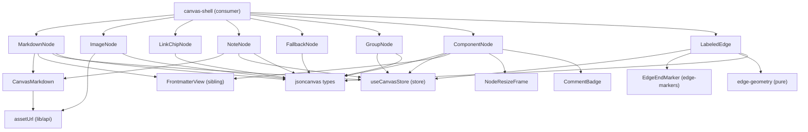

# Canvas Nodes

- Owns all `nodeKind`-keyed React Flow custom node components plus the `renderType`-routed `ComponentNode`, the `LabeledEdge` custom edge, and `CanvasMarkdown` — the lightweight in-node markdown renderer.
- Path: `components/canvas/nodes/*` + `components/canvas/edges/{labeled-edge,edge-markers}.tsx` + `components/canvas/canvas-markdown.tsx`; stack: TypeScript 5 / React 19 / `@xyflow/react` ^12.
- Public API: `MarkdownNode`, `ImageNode`, `LinkChipNode`, `NoteNode`, `FallbackNode`, `GroupNode`, `ComponentNode` (node components); `LabeledEdge` (edge component); `EdgeEndMarker` + `edgeMarkerUrl` (per-edge SVG markers, 005-edges); `CanvasMarkdown` (shared renderer); `normalizeUrl` (URL utility).
- Every component is `memo()`'d; nodes return a React fragment — card element plus four `<Handle>`s as siblings, never nested inside the `overflow:hidden` card.
- No dedicated vitest; React coverage is the headless-Chrome smoke (`npm run smoke:render`); `nodeTypes` / `edgeTypes` registration is the sole call site; generated by bootstrap; last updated 2026-06-29.

---

## Purpose

`canvas-nodes` owns every visual component registered in React Flow's `nodeTypes` and `edgeTypes` maps. It provides seven node renderers — `MarkdownNode` for `.md` files (frontmatter card + collapsible body + reader opener), `ImageNode` for image files (lazy inline `` via `/api/asset`), `LinkChipNode` for URL nodes (external link chip with `normalizeUrl` scheme injection), `NoteNode` for freeform `TextNode` content (double-click inline textarea edit), `GroupNode` for spatial framing (SVG shape outline in rectangle/ellipse/diamond + `NodeResizer` + shape-switcher + inline label edit), `FallbackNode` for any unrecognized file kind, and `ComponentNode` for system-design widgets (kind-aware glyph + name + kind eyebrow + one-line role + optional `§source` chip; routed by adapter `renderType = 'component'` for any kinded non-group node) — plus the `LabeledEdge` edge renderer. As of 005-edges, `LabeledEdge` is a full design-tool edge: floating endpoints (anchored to node centers via `useInternalNode` + `edge-geometry`, re-pinnable per side), a routing-selected path (`smoothstep` default · `bezier` · `straight`), per-edge colored SVG markers (via the new `edge-markers.tsx`), a draggable label along the path, draggable line waypoints (grab-to-bend / move / double-click-to-remove), and a `style ▾` panel (routing · line · color swatches · end markers · pinned sides · clear bends) alongside the typed-relationship picker (`RelationshipType` × 8). `CanvasMarkdown` is a shared sub-component used by `MarkdownNode` and `NoteNode` that resolves relative image paths through the asset API. The sole consumer of this module's exports is `canvas-shell.tsx`, which passes the components to React Flow at mount.

### Internal Architecture



---

## Public API

Concrete signatures only. No prose.

### Functions / Methods

```tsx
// link-node.tsx:10 — prepends https:// to any scheme-less URL; passes through http:, mailto:, tel:, etc.
export function normalizeUrl(url: string): string

// canvas-markdown.tsx:23 — client react-markdown + remark-gfm; resolves relative images via /api/asset
export function CanvasMarkdown({
  children,
  basePath,
}: {
  children: string
  basePath?: string   // source file path used to resolve relative image srcs; default ''
}): JSX.Element
```

### Classes

Not applicable — all components are functional React components.

### Node Components

Each accepts `NodeProps` from `@xyflow/react`. React Flow injects `id`, `data`, `selected`, and position geometry. `data` is always `{ node: <CanvasNodeVariant> }` in this codebase (populated by the adapter; extracted via cast in each component).

```tsx
// markdown-node.tsx:63
// data: { node: FileNode } — .md / .mdx file
// Reads store: bodyFor(id), toggleCollapsed, maximizeReader
export const MarkdownNode: React.NamedExoticComponent<NodeProps>

// image-node.tsx:34
// data: { node: FileNode } — image extension file (.png/.jpg/.webp/.gif/.avif/.svg)
// Local state: errored: boolean (onError fallback)
export const ImageNode: React.NamedExoticComponent<NodeProps>

// link-node.tsx:38
// data: { node: CanvasLinkNode } — LinkNode (type:'link', url: string)
// Applies normalizeUrl to node.url before rendering the <a>
export const LinkChipNode: React.NamedExoticComponent<NodeProps>

// note-node.tsx:59
// data: { node: TextNode } — TextNode (type:'text', text: string)
// Local state: editing: boolean, draft: string
// Reads store: setNodeText
// Double-click -> inline <textarea>; cmd/ctrl+Enter or blur commits; Esc cancels
export const NoteNode: React.NamedExoticComponent<NodeProps>

// fallback-node.tsx:36
// data: { node: CanvasNode } — catch-all for non-md, non-image file kinds
// Calls nodeKind(node) to derive the kind chip label
export const FallbackNode: React.NamedExoticComponent<NodeProps>

// group-node.tsx:117
// data: { node: CanvasGroupNode }, selected: boolean
// Local state: editing: boolean, draft: string
// Reads store: setNodeLabel, setNodeSize, setNodeShape
// Renders: ShapeOutline SVG (private) + NodeResizer (when selected) + 3-button shape-switcher (when selected)
// Double-click label area -> inline <input>; Enter or blur commits; Esc cancels
export const GroupNode: React.NamedExoticComponent<NodeProps>

// component-node.tsx:98
// data: { node: CanvasNode } — any node with meta.kind set (adapter renderType 'component')
// Reads store:
//   bodyFor(id) — one-line role fallback from markdown body (component-node.tsx:50)
//   highlightSpineSection — subscribed and called by the §source chip (component-node.tsx:51, Phase 4)
// Renders: KindGlyph (inline-SVG per COMPONENT_KIND_META[kind].glyph) + name + kind eyebrow +
//          one-line role + optional §source chip (data-testid="component-source-chip")
//          wrapped in NodeResizeFrame (minWidth:180, minHeight:96) + CommentBadge sibling
// §source chip (Phase 4, component-node.tsx:81-90): rendered as <button className="fc-cmp__src nodrag nopan">.
//   Clicking calls highlightSpineSection(anchor) with e.stopPropagation(). Was a static <span> before Phase 4.
// data-testid="component-node"; data-kind={kind}; data-silhouette={meta.silhouette}
// First consumer of NodeResizeFrame (Phase 2, component-node.tsx:65)
export const ComponentNode: React.NamedExoticComponent<NodeProps>
```

### Edge Component

```tsx
// labeled-edge.tsx:343
// Receives standard EdgeProps plus data (005-edges EdgeData, packed by the adapter):
//   { origin?, rel?, routing?, line?, labelT?, color?, fromSide?, toSide?, fromEnd?, toEnd?, points? }
// origin defaults to 'user'; rel → 'related'; routing → 'smoothstep'; line → 'solid' (links ⇒ 'dashed');
// fromEnd → 'none'; toEnd → 'arrow'; labelT → 0.5; color overrides the provenance default stroke.
// Private sub-components (not exported): EdgeLabelEditor, RelPicker, EdgeStylePanel, EdgeActionBar
// Reads store: editingEdgeId, setEditingEdge, relabelEdge, setEdgeRel, removeEdgeWriteback,
//   + setEdgeRouting, setEdgeLine, setEdgeColor, setEdgeMarker, setEdgeSide, setEdgeLabelT, setEdgeWaypoints
// RF hooks: useInternalNode (live node rects for floating endpoints), useReactFlow (screenToFlowPosition)
export const LabeledEdge: React.NamedExoticComponent<EdgeProps>
```

```tsx
// edge-markers.tsx:12 — url(#…) ref for one end, or undefined for none/absent (BaseEdge draws no marker)
export function edgeMarkerUrl(edgeId: string, which: 'start' | 'end', end: EdgeEnd | undefined): string | undefined

// edge-markers.tsx:27 — a colored <marker> def for one edge end; renders null for none/absent. Place in <defs>.
export function EdgeEndMarker(props: { edgeId: string; which: 'start' | 'end'; end: EdgeEnd | undefined; color: string }): JSX.Element | null
```

**Default stroke by provenance** (`labeled-edge.tsx:25-30`) — an explicit `data.color` OVERRIDES this (005-edges):

| `EdgeOrigin` | Stroke CSS var |
|---|---|
| `links` | `--color-outline` (dashed by default) |
| `user` | `--color-primary` |
| `agent` | `--color-neon-cyan` |
| `import` | `--color-secondary` |

**Line style → dash** (`labeled-edge.tsx:399-400`): `solid` ⇒ none · `dashed` ⇒ `7 5` · `dotted` ⇒ `1.5 5`.

**`RelationshipType` values** (`jsoncanvas.ts`, drives `RelPicker`):
`references` · `depends-on` · `implements` · `derives-from` · `calls` · `produces` · `informs` · `related`

### HTTP Routes (if applicable)

Not applicable.

### Events / Messages (if applicable)

Not applicable.

### Exceptions / Errors

Not applicable — no custom error types. Image load errors are handled via `onError` → local `errored: boolean` state in `ImageNode` (`image-node.tsx:12-13`).

---

## Usage Examples

```tsx
// canvas-shell.tsx:49-57 — the registration map that wires this module into React Flow.
// This is the only call site; no direct JSX instantiation exists outside canvas-shell. // constructed

import { MarkdownNode } from './nodes/markdown-node'
import { ImageNode }     from './nodes/image-node'
import { LinkChipNode }  from './nodes/link-node'
import { NoteNode }      from './nodes/note-node'
import { GroupNode }     from './nodes/group-node'
import { FallbackNode }  from './nodes/fallback-node'
import { LabeledEdge }   from './edges/labeled-edge'
import { type NodeTypes, type EdgeTypes } from '@xyflow/react'

// Defined at MODULE SCOPE — never inside a component (new object ref on every render
// triggers React Flow to unmount and remount every node).
const nodeTypes: NodeTypes = {
  markdown: MarkdownNode,  // FileNode with .md/.mdx extension
  image:    ImageNode,     // FileNode with image extension
  link:     LinkChipNode,  // LinkNode (node.url)
  note:     NoteNode,      // TextNode (node.text)
  group:    GroupNode,     // GroupNode (type:'group')
  file:     FallbackNode,  // FileNode with non-md, non-image extension
}
const edgeTypes: EdgeTypes = { labeled: LabeledEdge }
const defaultEdgeOptions = { type: 'labeled' }

// React Flow selects the component by matching node.type (the NodeKind key) against nodeTypes.
// The adapter (lib/canvas/adapter.ts) sets node.type = nodeKind(canvasNode) at load time.
// data.node is always the original CanvasNode from the store.
<ReactFlow
  nodeTypes={nodeTypes}
  edgeTypes={edgeTypes}
  defaultEdgeOptions={defaultEdgeOptions}
/>
```

Registration at `components/canvas/canvas-shell.tsx:49-57`. No direct component instantiation call sites exist beyond this map; the headless-Chrome smoke is the integration test.

---

## Database Schema

Not applicable.

---

## Dependencies

**Upstream modules:**

- `lib/canvas/jsoncanvas` — node type definitions (`FileNode`, `LinkNode`, `TextNode`, `GroupNode`, `CanvasNode`), plus `NodeShape`, `RelationshipType`, `RELATIONSHIP_TYPES`, `EdgeOrigin`, `nodeKind()` discriminator; additionally `ComponentKind` type + `COMPONENT_KIND_META` record (per-kind glyph/label/silhouette/accent) consumed by `ComponentNode` (`component-node.tsx:4-5`); 005-edges `LabeledEdge` also imports `EdgeRouting`/`EdgeLineStyle`/`EdgeEnd`/`Side`/`CanvasColor` types + `EDGE_ROUTINGS`/`EDGE_LINE_STYLES`/`EDGE_ENDS` constants (`labeled-edge.tsx:15-18`); `edge-markers.tsx:7` imports the `EdgeEnd` type; `fallback-node.tsx:5-6`
- `lib/canvas/edge-geometry` — pure floating-edge math (`rectIntersectionToPoint`, `sideOf`, `nearestT`, `nearestSegmentIndex`) consumed by `LabeledEdge` for floating endpoints, label drag, and line-grab bend insertion (`labeled-edge.tsx:20`)
- `lib/canvas/adapter` — `colorVar` (preset/hex → CSS color) consumed by `LabeledEdge` to resolve `data.color` and the swatch chips (`labeled-edge.tsx:19`)
- `components/canvas/edges/edge-markers` — `edgeMarkerUrl` + `EdgeEndMarker` (per-edge colored SVG `<marker>` defs) consumed by `LabeledEdge` (`labeled-edge.tsx:21`)
- `lib/canvas/store` — `useCanvasStore` with actions: `bodyFor`, `toggleCollapsed`, `maximizeReader` (MarkdownNode); `setNodeText` (NoteNode); `setNodeLabel`, `setNodeSize`, `setNodeShape` (GroupNode); `relabelEdge`, `setEdgeRel`, `setEditingEdge`, `editingEdgeId`, `removeEdgeWriteback` + 005-edges `setEdgeRouting`/`setEdgeLine`/`setEdgeColor`/`setEdgeMarker`/`setEdgeSide`/`setEdgeLabelT`/`setEdgeWaypoints` (LabeledEdge); `bodyFor`, `highlightSpineSection` (ComponentNode — body for one-line role fallback; highlightSpineSection for §source chip click, Phase 4); `markdown-node.tsx:5`, `note-node.tsx:5`, `group-node.tsx:5`, `labeled-edge.tsx:14`, `component-node.tsx:6`
- `lib/api` — `assetUrl(path): string` builds `/api/asset?path=` URL; consumed by `ImageNode` (`image-node.tsx:5`) and `CanvasMarkdown` (`canvas-markdown.tsx:4`)
- `components/canvas/frontmatter-view` — `FrontmatterView` component + `basename` helper; consumed by `MarkdownNode` (`markdown-node.tsx:8`) and `ComponentNode` for display name derivation (`component-node.tsx:8`)
- `components/canvas/nodes/node-frame` — `NodeResizeFrame` shared frame (centralised `NodeResizer` + four `Handle` siblings + `commentMode` hide); consumed by `ComponentNode` (`component-node.tsx:9`, `64`)

**External services:**

- `/api/asset` — guarded image-byte route; `ImageNode` and `CanvasMarkdown` resolve all image paths through this route at runtime

**Key libraries:**

- `@xyflow/react` ^12 — `Handle`, `Position`, `NodeResizer`, `NodeProps`, `EdgeProps`, `BaseEdge`, `EdgeLabelRenderer`, `getSmoothStepPath`; 005-edges `LabeledEdge` also uses `getBezierPath`, `getStraightPath`, `useInternalNode` (live node geometry for floating endpoints), and `useReactFlow` (`screenToFlowPosition` for label/waypoint drags)
- `react-markdown` ^10 + `remark-gfm` ^4 — client-side markdown render in `CanvasMarkdown` (`canvas-markdown.tsx:1-2`)
- `react` 19 — `memo`, `useState`, `useRef`, `useEffect`

---

## Configuration & Environment

Not applicable — this module reads no environment variables or config keys directly. The `/api/asset` URL is built by `assetUrl()` in `lib/api.ts`; the underlying `FLOWCANVAS_ROOT` guard is the route handler's concern, not this module's.

---

## Run / Test / Lint

| Action | Command |
|--------|---------|
| Run | `npm run dev` |
| Test (unit) | Not applicable — no vitest for React components |
| Test (integration) | `npm run smoke:render` |
| Lint | `npm run lint` |
| Typecheck | `npx tsc --noEmit` |

Cross-reference full project gates in `.flowcode/quality-checks/quality-gates.md`.

---

## Key Insights

**Conventions & patterns:**

- **Fragment / handle-as-sibling pattern.** Every node returns a `<>...</>` React fragment. The first child is the visible card element; the remaining children are four `<Handle>` elements at `Position.Top/Right/Bottom/Left` (`const SIDES = [Position.Top, Position.Right, Position.Bottom, Position.Left]` in each file). Handles must be siblings of — never nested inside — the card because the card has `overflow:hidden`, which clips the right/bottom handle hit areas. The authoring comment at `markdown-node.tsx:54` documents the invariant. `GroupNode` follows the same rule: `NodeResizer` + shape bar + `fc-group` div + four handles are all flat fragment siblings (`group-node.tsx:59-113`).

- **`memo()` convention.** All six node components are defined as a private `Inner` function and re-exported as `export const X = memo(Inner)`. `LabeledEdge` uses the inline form `memo(function LabeledEdge(...))`. This prevents React Flow from re-rendering a node component when unrelated store slices change. Never remove `memo` from a node or edge export.

- **`nodeTypes` at module scope.** The `nodeTypes` and `edgeTypes` objects in `canvas-shell.tsx` are defined at module scope (outside any component function). Defining them inside a component creates a new object reference on every render; React Flow treats new references as entirely new type registries and unmounts/remounts all nodes. `canvas-shell.tsx:49-57` is the authoritative example.

- **`data.node` cast convention.** `NodeProps.data` is typed as `Record<string, unknown>`. Every node component recovers its specific variant with `(data as { node: XxxNode }).node`. The adapter (`lib/canvas/adapter.ts`) is the only place that populates `data.node`, making the cast safe at runtime.

- **`LabeledEdge` path is routing-selected (005-edges).** `buildPath(routing, …)` picks `getSmoothStepPath` (default, `borderRadius:8`), `getBezierPath`, or `getStraightPath` (`labeled-edge.tsx:89-104`). When the edge has manual waypoints, the renderer builds a polyline/spline through `[source, ...points, target]` instead (`labeled-edge.tsx:381-389`). Stroke color and dash are applied inline on `<BaseEdge>` (not via CSS class) because CSS cannot key off a runtime prop: `colorVar(data.color) ?? STROKE[origin]` resolves the color and `data.line` resolves the dash (`labeled-edge.tsx:398-400`).

- **Floating endpoints read LIVE node geometry (005-edges).** An unpinned end (`data.fromSide`/`toSide` absent) is recomputed each render from the measured node rects pulled via `useInternalNode` (`labeled-edge.tsx:362-378`): `rectIntersectionToPoint` aims the perimeter exit at the next waypoint (or the other node's center) and `sideOf` maps the hit to a React Flow `Position`. A pinned side keeps React Flow's handle-anchored coords. This is why the adapter sets `sourceHandle`/`targetHandle` only for pinned ends.

- **Per-edge colored markers replace shared `context-stroke` markers (005-edges, `edge-markers.tsx`).** Each edge renders its own `<marker>` defs INSIDE its own `<svg>` fragment (the same SVG root as its `<path>`), filled with the edge's resolved stroke color, via `EdgeEndMarker`/`edgeMarkerUrl`. The earlier shared `context-stroke` markers rendered black because `context-fill`/`context-stroke` does not resolve when the marker def lives in a separate `<svg>` root from the referencing path (React Flow's layout). The adapter no longer emits `markerEnd` — the edge component owns markers entirely.

- **Edge action bar is the only delete + style surface.** When an edge is selected, `EdgeActionBar` portals `rel ▾ · style ▾ · ✎ Label · ✕` below the label pill (`labeled-edge.tsx:326-340`). `style ▾` opens `EdgeStylePanel` (routing · line · color swatches incl. an "auto"/clear chip · From/To end markers · From/To pinned sides · clear-bends), each control wired to the matching `setEdge*` store action. Popovers reset to closed on deselection via a render-phase guard (no `setState`-in-effect).

- **`CanvasMarkdown` image resolution.** Without `resolveImageSrc`, a relative `` in a node body resolves against the Next.js page URL and 404s. `CanvasMarkdown` intercepts the `img` renderer and routes the src through `assetUrl()`. External URLs, `data:`, `blob:`, and already-routed `/api/asset` paths bypass the rewrite (checked by `DIRECT` regex at `canvas-markdown.tsx:8`).

**Gotchas & invariants:**

- **GroupNode pointer-events bypass.** `fc-group` has `pointer-events:none` (CSS). Only SVG shape primitives (`ellipse`/`polygon`/`rect`) have `pointer-events:visiblePainted` (`nodes.css:335-336`), making the hit area match the shape, not the bounding box. React Flow applies inline `pointer-events:all` on the node wrapper, which is forcibly overridden by `:has(.fc-group) { pointer-events:none !important }` (`nodes.css:340`). Resize handles restore pointer events via `:has(.fc-group) .react-flow__resize-control { pointer-events:all }` (`nodes.css:341`).

- **GroupNode selection ring suppression.** React Flow's default `.selected` `box-shadow` glow on the node wrapper is suppressed for group nodes (`nodes.css:343`: `.react-flow__node.selected:has(.fc-group) { box-shadow:none !important }`). The shape SVG stroke manages the selection highlight through `ShapeOutline`'s `selected` prop — solid stroke + `drop-shadow` filter when selected, dashed `7 5` stroke at rest (`group-node.tsx:21-28`).

- **`ShapeOutline` uses `vectorEffect:'non-scaling-stroke'`.** The stroke width stays constant in screen pixels regardless of viewport zoom (`group-node.tsx:26`). Omitting this would make the group outline thicker when zoomed in.

- **`EdgeLabelEditor` double-fire guard.** Pressing Enter triggers `onKeyDown` (calls `finish(true)`) followed immediately by an `onBlur` event. A `closed` ref prevents `finish` from executing twice (`labeled-edge.tsx:23-29`). This guard is load-bearing — removing it causes the label to be written then immediately cleared.

- **`FallbackNode` registered as `'file'`, not `'fallback'`.** The key in `nodeTypes` is `'file'` (`canvas-shell.tsx:55`). The `'group'` key maps to `GroupNode`. The internal comment in `fallback-node.tsx:10` mentions group as a former fallback — that role is now fully replaced by `GroupNode`.

- **`normalizeUrl` is publicly exported but has no external callers.** Only `link-node.tsx:19` calls it internally. The export makes it available for tests or specialized callers, but no other module currently imports it.

- **No dedicated vitest.** React component coverage lives entirely in the headless-Chrome smoke (`npm run smoke:render`, `scripts/smoke-render.mjs`). The 143 vitest tests target only pure `lib/canvas/*` modules. There is no React Testing Library or similar setup in this project.

- **CSS spread across two partials (and one studio partial).** Node styles live in `app/styles/nodes.css`; edge stroke + handle + label editor styles live in `app/styles/edges.css` — 005-edges added the edge Style panel (`.fc-edgestyle*`), the waypoint/add-bend dots, and the handle-noise-reduction rules (connect dots hidden at rest, shown on node-hover/connect) to that partial; the rel-picker (`.fc-relpick`) and the `import`-origin edge label sub-element rule live in `app/styles/studio-shell.css:118-272`. The split follows the phase-8 extraction; the studio-shell placement of rel-picker styles is a minor inconsistency.

---

## Known Gaps

- `NodeResizeFrame` (`components/canvas/nodes/node-frame.tsx`) is a shared frame helper implementing the same fragment/handle-as-sibling pattern with a centralized `NodeResizer` and a `commentMode` hide. `ComponentNode` (`component-node.tsx:64`) is its first adopter (Phase 2). The remaining nodes (`MarkdownNode`, `ImageNode`, `LinkChipNode`, `NoteNode`, `FallbackNode`) still implement their own inline `SIDES.map()` and `NodeResizer` blocks; a future consolidation pass should migrate them.
- The `import` origin label sub-element rule (`.fc-edge-label--import .fc-edge-label__rel`) lives in `app/styles/studio-shell.css:126` rather than `app/styles/edges.css` where the other origin modifier classes sit. A future style consolidation pass should move it.
