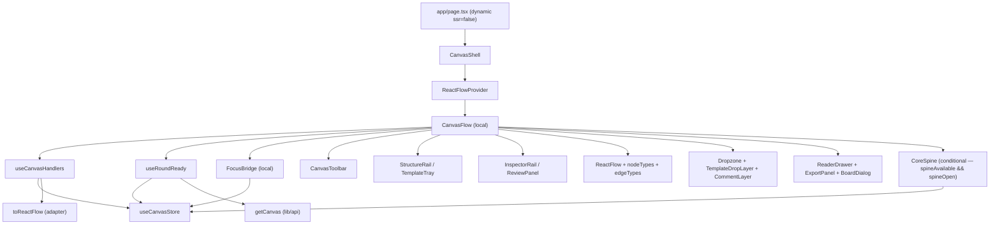

# Canvas Shell

- Owns the tri-pane React Flow workbench shell and the two companion hooks that wire its RF state and detect agent round completion.
- Path: `components/canvas/`; files: `canvas-shell.tsx`, `use-canvas-handlers.ts`, `use-round-ready.ts`; stack: TypeScript 5 / React 19 / `@xyflow/react` ^12 / Zustand.
- Public API: `CanvasShell()` (sole export, consumed by `app/page.tsx`), `useCanvasHandlers()` (RF controlled state + callbacks), `useRoundReady()` (revision-poll + banner signal).
- Registers seven `nodeTypes` (`markdown`, `image`, `link`, `note`, `group`, `file`, `component`) and one `edgeType` (`labeled`); all type maps are module-local constants.
- Loads the board from `?path` query param; falls back to `flowcanvas.canvas`; async load failure is caught in `CanvasFlow` local state and renders a glass error card — the app never leaves a blank void.
- Rail collapse driven by CSS data-attributes (`data-railleft` / `data-railright` on `.fc-studio`) — zero JS layout math; the studio-shell CSS partial reads them.
- `FocusBridge` is an effect-only internal component: reads `focusNodeId` from the store, calls RF `setCenter`, then calls `clearFocus` — renders `null`.
- `CoreSpine` is mounted as a docked flex pane between the canvas and the right inspector when `spineAvailable` is true and `spineOpen` is true; a thin `fc-railstrip--spine` reopen strip replaces it when closed (canvas-shell.tsx:278-294).
- `linkedNodeIds` from the store are applied to the RF node list as the `fc-rf--linked` className via a `rfNodes` useMemo — spine-section highlighting pulses matching component nodes without a store write-back (canvas-shell.tsx:114-118).
- `useCanvasHandlers` bridges Zustand doc → RF controlled state; `onNodeDragStop` commits group-aware absolute positions via `internals.positionAbsolute`.
- `useRoundReady` polls `GET /api/canvas` every 3 s while `pendingReview`; returns `{ show, reload, dismiss }` — never auto-reloads.
- Generated at depth by `flowcode:module-explorer-agent` (full mode); meets its § Module Doc Completeness Bar; last updated 2026-06-29.

---

## Purpose

Canvas Shell is the single React component that assembles the complete Flowcanvas workbench. It wraps `CanvasFlow` (all local logic) in a `ReactFlowProvider`, registers the `nodeTypes` / `edgeTypes` maps, reads the board path from the URL, and mounts all chrome: toolbar, left rail (Structure / Templates tabs), center React Flow canvas, optional docked `CoreSpine` pane (between canvas and inspector, Phase 4), right inspector, and overlay components (Dropzone, CommentLayer, TemplateDropLayer, ReaderDrawer, ExportPanel, BoardDialog). The two companion hooks — `useCanvasHandlers` and `useRoundReady` — are extracted from the shell so `canvas-shell.tsx` remains pure layout. `useCanvasHandlers` owns the RF controlled node/edge state, mirrors Zustand doc mutations into RF, and supplies every interaction callback that `<ReactFlow>` consumes. `useRoundReady` implements Decision 5/6 (revision-poll): while a board is in `pendingReview` it polls the disk revision and surfaces a non-blocking "Agent round ready" banner so the operator can reload and open the change-review panel. The entire module is loaded with `dynamic({ ssr: false })` from `app/page.tsx` because React Flow touches `window`.

### Internal Architecture



---

## Public API

Concrete signatures only. No prose.

### Functions / Methods

```ts
// canvas-shell.tsx:333
export function CanvasShell(): JSX.Element
// Wraps CanvasFlow in a ReactFlowProvider. The sole public export of this module.

// use-canvas-handlers.ts:23
export function useCanvasHandlers(): {
  nodes: RFNode[];
  edges: RFEdge[];
  onNodesChange: (changes: NodeChange[]) => void;
  onEdgesChange: (changes: EdgeChange[]) => void;
  onConnect: UseCanvasStore['onConnect'];
  onNodeDragStop: (e: MouseEvent | TouchEvent, node: RFNode, dragged: RFNode[]) => void;
  onSelectionChange: (sel: { nodes: RFNode[] }) => void;
  onEdgeDoubleClick: (e: React.MouseEvent, edge: RFEdge) => void;
  isValidConnection: (c: RFEdge | Connection) => boolean;
  onNodeClick: (e: React.MouseEvent, node: RFNode) => void;
}
// Returns the exact prop-bag <ReactFlow> consumes; bridges Zustand doc state to RF controlled state.

// use-round-ready.ts:19
export function useRoundReady(): {
  show: boolean;       // true when pendingReview AND disk revision > in-memory revision AND not dismissed
  reload: () => void;  // calls store.load(path), clears readyRev + dismissedRev
  dismiss: () => void; // sets dismissedRev = readyRev; banner hides until the next disk advance
}
// Polls disk revision every 3 s while pendingReview; non-blocking round-ready signal.
```

**Module-local constants (not exported; documented here because they govern observable behaviour):**

```ts
// canvas-shell.tsx:42
const DEFAULT_PATH = 'flowcanvas.canvas'
// Board loaded when the ?path query param is absent.

// canvas-shell.tsx:53-63
// Keyed by NodeKind (exhaustive); 'component' is a non-NodeKind extra entry routed by the adapter
// for any kinded non-group node. The `satisfies` intersection enforces NodeKind exhaustiveness at
// compile time while allowing the extra 'component' key.
const nodeTypes = {
  markdown:  MarkdownNode,
  image:     ImageNode,
  link:      LinkChipNode,
  note:      NoteNode,
  group:     GroupNode,
  file:      FallbackNode,
  component: ComponentNode,
} satisfies Record<NodeKind, NodeTypes[string]> & { component: NodeTypes[string] }
const edgeTypes: EdgeTypes = { labeled: LabeledEdge }
const defaultEdgeOptions    = { type: 'labeled' }

// use-round-ready.ts:17
const POLL_MS = 3000  // revision-poll interval in milliseconds
```

**Local types (canvas-shell.tsx:67-69):**

```ts
type Rail          = 'open' | 'collapsed'
type LeftTab       = 'structure' | 'templates'
type InspectorMode = 'inspector' | 'submit' | 'review'
```

**Agent panel state (canvas-shell.tsx:99):**

```ts
// Inline state type — tab widened in Phase 3 to include 'kit'
const [agent, setAgent] = useState<{ open: boolean; tab: 'export' | 'import' | 'kit' }>({ open: false, tab: 'export' })
```

**Phase 4 — Core Spine state and derived values (canvas-shell.tsx:109-118):**

```ts
// canvas-shell.tsx:109
const [spineOpen, setSpineOpen] = useState(true)
// Whether the docked CoreSpine pane is expanded. Toggled by the pane's onClose and the
// fc-railstrip--spine reopen button. Default true so the spine shows immediately when available.

// canvas-shell.tsx:112
const spineAvailable = !!doc && (!!doc.flowcanvas.session.coreDocPath || citedDocPaths(doc.nodes).length > 0)
// Computed from the loaded doc. True when the board has a bound core doc (session.coreDocPath)
// OR when any node carries a meta.source.path (citedDocPaths returns at least one entry).
// Gates both the CoreSpine mount and the spine-reopen strip.

// canvas-shell.tsx:114-118 (rfNodes useMemo)
const rfNodes = useMemo(() => {
  if (linkedNodeIds.length === 0) return handlers.nodes
  const set = new Set(linkedNodeIds)
  return handlers.nodes.map((n) =>
    set.has(n.id) ? { ...n, className: [n.className, 'fc-rf--linked'].filter(Boolean).join(' ') } : n
  )
}, [handlers.nodes, linkedNodeIds])
// Spine→canvas highlight: appends 'fc-rf--linked' to the RF node className for every id in
// linkedNodeIds (set by store.highlightComponents). Pure useMemo — no store writes, no re-renders
// beyond what linkedNodeIds/handlers.nodes changes already trigger.
```

### Classes

Not applicable — all function components and React hooks; no class definitions.

### HTTP Routes (if applicable)

Not applicable — this module owns no route handlers.

### Events / Messages (if applicable)

Not applicable — no publish/subscribe; all event communication is store-mediated via Zustand.

### Exceptions / Errors

| Name | Raised When | Caught By |
|------|-------------|-----------|
| `load` rejection (string) | `store.load(path)` throws or rejects (ENOENT, GuardError, network) | `CanvasFlow` `useState` error (`canvas-shell.tsx:101-102`); renders glass error card at `canvas-shell.tsx:315-321` |

---

## Usage Examples

**Primary — real call site (`app/page.tsx:6-38`):**

```tsx
// app/page.tsx:6-8 — CanvasShell mounted with ssr:false inside an error boundary
import dynamic from 'next/dynamic'

const CanvasShell = dynamic(
  () => import('@/components/canvas/canvas-shell').then((m) => m.CanvasShell),
  { ssr: false },
)

export default function Page() {
  return (
    <CanvasErrorBoundary>
      <CanvasShell />
    </CanvasErrorBoundary>
  )
}
```

`CanvasShell` requires no props. The `dynamic({ ssr: false })` guard is mandatory because React Flow reads `window`; omitting it causes a hydration error. Call site: `app/page.tsx:6-38`.

**Secondary — `useCanvasHandlers` consumption (`canvas-shell.tsx:86-215`, constructed):**

```tsx
// constructed — distilled from the real usage in CanvasFlow (canvas-shell.tsx:86,192-215)
// Must be called from inside a ReactFlowProvider descendant.
function MyCanvasPane() {
  const handlers = useCanvasHandlers()
  return (
    <ReactFlow
      nodes={handlers.nodes}
      edges={handlers.edges}
      onNodesChange={handlers.onNodesChange}
      onEdgesChange={handlers.onEdgesChange}
      onConnect={handlers.onConnect}
      onNodeDragStop={handlers.onNodeDragStop}
      onSelectionChange={handlers.onSelectionChange}
      onEdgeDoubleClick={handlers.onEdgeDoubleClick}
      isValidConnection={handlers.isValidConnection}
      onNodeClick={handlers.onNodeClick}
    />
  )
}
```

Shows the full prop-bag spread. Real usage is `canvas-shell.tsx:192-215`; only one call site exists in the codebase.

---

## Database Schema

Not applicable — this module owns no tables and performs no direct persistence.

---

## Dependencies

**Upstream modules:**
- `lib/canvas/store` (`useCanvasStore`) — all board state: `doc`, `load`, `mode`, `onConnect`, `removeEdgeWriteback`, `removeNode`, `applyLayout`, `setSelection`, `selectedIds`, `setEditingEdge`, `openReader`, `closeReader`, `readerNodeId`, `clearBoard`, `focusNodeId`, `clearFocus`, `path`, `pendingReview` (via `doc.flowcanvas.session`); Phase 4 adds `linkedNodeIds` (canvas-shell.tsx:95)
- `lib/canvas/spine` (`citedDocPaths`) — called in the `spineAvailable` computed to detect whether any node carries a `meta.source.path`, gating the CoreSpine mount (canvas-shell.tsx:41,112)
- `lib/canvas/adapter` (`toReactFlow`) — converts `FlowcanvasDoc` `{nodes, edges}` → RF `{nodes: RFNode[], edges: RFEdge[]}`; called inside `useMemo` in `useCanvasHandlers` (`use-canvas-handlers.ts:35-38`)
- `lib/canvas/jsoncanvas` (`isFileNode`, `nodeKind`) — type discriminators used in `onNodeClick` to decide whether to open the reader drawer (`use-canvas-handlers.ts:148-151`)
- `lib/api` (`getCanvas`) — typed fetch wrapper: `GET /api/canvas?path=…` → `FlowcanvasDoc`; called in `useRoundReady` tick (`use-round-ready.ts:30-35`)

**Sibling components mounted but not owned by this module:**
- `canvas-toolbar.tsx` (canvas-toolbar module), `structure-rail.tsx` / `template-tray.tsx` / `inspector-rail.tsx` / `review-panel.tsx` (studio-rails module), `nodes/*` / `edges/labeled-edge.tsx` (canvas-nodes module), `comment-layer.tsx` (comments-ui module), `reader-drawer.tsx` (reader module), `export-panel.tsx`, `board-dialog.tsx`, `dropzone.tsx`, `template-drop.tsx`, `core-spine.tsx` (Phase 4 — docked living core-doc spine)

**Key libraries:**
- `@xyflow/react` ^12 — `ReactFlow`, `ReactFlowProvider`, `Background` (`BackgroundVariant.Dots`), `Controls`, `MiniMap`, `useNodesState`, `useEdgesState`, `useReactFlow` (`setCenter`, `getInternalNode`), `ConnectionMode.Loose`, `ConnectionLineType.SmoothStep`, `SelectionMode.Partial`
- `react` 19 — `useEffect`, `useState`, `useCallback`, `useMemo`
- `next/dynamic` — SSR guard (`canvas-shell.tsx` is itself a `'use client'` module but its consumer, `app/page.tsx`, wraps it with `dynamic({ ssr: false })`)

---

## Configuration & Environment

### Environment Variables

Not applicable — this module reads no `process.env` keys directly. Env vars (`FLOWCANVAS_ROOT`, `FLOWCANVAS_BASE_URL`) are consumed by Route Handlers and `lib/fs-guard.ts` respectively.

### Config Keys

| Key | Source | Type | Purpose |
|-----|--------|------|---------|
| `DEFAULT_PATH` | `canvas-shell.tsx:42` (module constant) | `'flowcanvas.canvas'` | Board loaded when no `?path` query param is present |
| `POLL_MS` | `use-round-ready.ts:17` (module constant) | `3000` (ms) | Interval between disk-revision polls while `pendingReview` |

---

## Run / Test / Lint

Commands scoped to this module. Cross-reference full project gates in `.flowcode/quality-checks/quality-checks-index.md`.

| Action | Command |
|--------|---------|
| Typecheck | `npx tsc --noEmit` |
| Lint | `npm run lint` |
| Build | `npm run build` |
| Test (unit) | None — no vitest tests exist for this module |
| Test (integration) | `npm run smoke:render` (`scripts/smoke-render.mjs` — headless Chrome; verifies tri-pane renders, non-zero canvas, typed-edge labels) |

---

## Key Insights

**Conventions & patterns:**

- **Shell = pure layout.** The Phase 8 extraction rule (`canvas-shell.tsx:17-22` comment) mandates the shell be pure layout. All RF wiring lives in `useCanvasHandlers`; the revision-poll lives in `useRoundReady`. Any future logic that is not layout belongs in a hook or the store, not inline in `CanvasFlow`.
- **Rail collapse via CSS data-attributes.** `data-railleft` / `data-railright` are toggled between `"open"` and `"collapsed"` on the `.fc-studio` root div (`canvas-shell.tsx:113-116`). The tri-pane layout and rail widths are driven entirely by the `app/styles/studio-shell.css` partial reading those attributes — zero inline `display:none` or JS width math.
- **`inspectorMode` and `leftTab` are local UI state, not store state.** They are ephemeral (not persisted, not shared across components) so they live in `CanvasFlow`'s `useState`. Anything that needs to trigger a mode change (toolbar, empty-board CTA, round-ready banner) does so through callback props passed down, not through the store.
- **`FocusBridge` is the canonical RF imperative-API bridge pattern.** Any action that needs a RF imperative call (`setCenter`, `fitView`, etc.) from a store event should follow this pattern: a `null`-rendering function component inside `ReactFlowProvider` that reads the store trigger, runs the imperative call, then clears the trigger (`canvas-shell.tsx:65-77`).
- **Board navigation lives in two `CanvasFlow` keydown effects + `panActive`.** `panActive = spacePan || mode === 'pan'` switches `<ReactFlow>` to pan-anywhere (`nodesDraggable`/`elementsSelectable`/`selectionOnDrag` off, `panOnDrag` on) and adds the `fc-rf--pan` class (which neutralises connection dots + edge surfaces in `edges.css`, so a hand-tool drag pans instead of connecting/bending). One effect owns Space-hold (transient) + `H` (sticky toggle via `setMode`); the other owns the Figma-style framing shortcuts — `Shift+1` fit-all · `Shift+2` tight-to-selection · `Shift+3` selection at HALF the tight zoom (context, via manual bounds + `setCenter`) · `Shift+0` 100% (`useReactFlow().fitView`/`zoomTo`/`setCenter`/`getInternalNode`, keyed on `e.code`).
- **`useRoundReady` poll is loop-safe by construction.** The `useEffect` is gated on `pending && path`; `setReadyRev` only fires when `diskRev > memRev`; dismissal sets `dismissedRev = readyRev` so `show` goes false without clearing `readyRev` — a second disk advance re-arms the banner without a page reload (`use-round-ready.ts:26-52`).

**Gotchas & invariants:**

- `useCanvasHandlers` calls `useReactFlow()` and therefore **must** be called from a component that is a descendant of `ReactFlowProvider`. `CanvasShell` ensures this by wrapping `CanvasFlow` (the caller) in `ReactFlowProvider`. Moving the hook outside the provider tree causes a runtime error.
- The `selectedIds` → RF `node.selected` sync (`use-canvas-handlers.ts:77-89`) is equality-guarded (`!!n.selected === want`). The guard prevents an infinite update loop: store mutation → `setNodes` → `onSelectionChange` → `setSelection` → store mutation. Removing the guard causes a render loop in production.
- `onNodeDragStop` reads `getInternalNode(id)?.internals.positionAbsolute`, not `node.position` (`use-canvas-handlers.ts:110-118`). RF child nodes store *relative* coords in `node.position` but absolute coords in `internals.positionAbsolute`. Writing relative coords into the store as absolute would misplace children on the next doc-driven `setNodes` call.
- `deleteKeyCode={['Delete', 'Backspace']}` on `<ReactFlow>` fires `onNodesChange` / `onEdgesChange` remove events. React Flow suppresses the key when an `<input>` or `<textarea>` is focused, so inline label / note editors are safe from accidental deletion (`canvas-shell.tsx:207`; `use-canvas-handlers.ts:54-57`).
- The `readPath()` function checks `typeof window === 'undefined'` before reading `URLSearchParams` (`canvas-shell.tsx:44-47`). This guard is defensive — `CanvasShell` is always loaded with `ssr: false` and never executes on the server — but it prevents a crash if the module is ever imported in a non-browser context.
- `getCanvas` in `useRoundReady` is called inside a try/catch that silently ignores all errors (`use-round-ready.ts:35-41`). Transient poll failures (server restart, path not yet written) do not surface to the user. If the app goes offline while `pendingReview`, the banner simply never appears until connectivity is restored.

---

## Known Gaps

- No vitest unit tests for `useCanvasHandlers` or `useRoundReady`; the headless-Chrome smoke (`npm run smoke:render`) is the only automated behavioral coverage for this module.
- Disk-divergence banner (Decision 10) is deferred: `useRoundReady` covers only the "agent round completed out-of-band via MCP" case; a human directly editing the `.canvas` file on disk is not detected.
