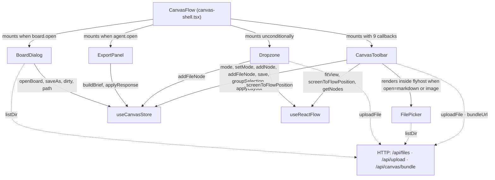

# Canvas Toolbar

- Top chrome and IO surfaces for the Flowcanvas studio: `CanvasToolbar` (single-rail toolbar), `FilePicker` (glass dir-browser popover), `Dropzone` (full-canvas file drag overlay), `ExportPanel` (agent round-trip drawer), `BoardDialog` (Open/Save-as modal). Every board-level user action routes through or is triggered by one of these five components.
- Path: `components/canvas/` (files: `canvas-toolbar.tsx`, `file-picker.tsx`, `dropzone.tsx`, `export-panel.tsx`, `board-dialog.tsx`); styles: `app/styles/toolbar.css`; stack: TypeScript 5 / React 19 / Zustand.
- Public API: `CanvasToolbar` (9-prop component), `useSaveShortcut` (exported keyboard hook), `FilePicker`, `Dropzone`, `ExportPanel`, `BoardDialog` — all named exports, no default exports.
- Generated at depth by `flowcode:module-explorer-agent` (full mode); meets its § Module Doc Completeness Bar — real signatures, a usage example, config/env, traced deps, conventions.
- Status active; generated by bootstrap; last updated 2026-06-29.

---

## Purpose

This module owns the entire top chrome and file-IO surface of the Flowcanvas studio. `CanvasToolbar` is the 56px glass rail that renders the mode-switcher (select / connect / comment / **pan** — the hand tool, `mode:'pan'`, also toggled by `H`), direct insert buttons (note, markdown, image, link, shape flyout), the `[File ▾]` dropdown (upload, new/open/save-as, import/export), multi-select grouping controls, ELK Re-organize, and the v2 agent-surface buttons (Submit, Templates, Bundle download). `useSaveShortcut` is an exported keyboard hook that binds ⌘S/Ctrl+S. `FilePicker` is a glass dir-browser popover over `/api/files` used for the add-markdown and add-image toolbar flyouts. `Dropzone` is a full-canvas window-level drag overlay that uploads dropped files and creates nodes at the projected drop point. `ExportPanel` is the right glass drawer for the agent clipboard/file round-trip (Export → copy/download `DesignBrief`; Import → validate + apply `AgentResponse`). `BoardDialog` is the Open/Save-as centered modal with inline dirty-guard. Everything that touches board-level IO flows through or is triggered by one of these five components. The owning consumer is `canvas-shell.tsx (CanvasFlow)`, which holds all panel-visibility state and passes callbacks down — none of these components own panel lifecycle state themselves.

### Internal Architecture



---

## Public API

Concrete signatures only. No prose.

### Functions / Methods

```typescript
// canvas-toolbar.tsx:24
/** ⌘S / Ctrl+S -> save (clears the dirty dot). Mounted by the toolbar. */
export function useSaveShortcut(): void

// canvas-toolbar.tsx:47
export function CanvasToolbar({
  onOpenAgent,
  onOpenBoard,
  onClearBoard,
  railLeft,
  railRight,
  onToggleRailLeft,
  onToggleRailRight,
  onOpenTemplates,
  onOpenSubmit,
}: CanvasToolbarProps): JSX.Element

// file-picker.tsx:15
export function FilePicker({
  title,
  accept,
  onPick,
  onClose,
}: FilePickerProps): JSX.Element

// dropzone.tsx:10
export function Dropzone(): JSX.Element | null

// export-panel.tsx:17
export function ExportPanel({
  tab,
  onTab,
  onClose,
}: ExportPanelProps): JSX.Element

// board-dialog.tsx:16
export function BoardDialog({
  mode,
  onClose,
}: BoardDialogProps): JSX.Element
```

### Classes

Not applicable — this module uses only function components and one hook.

### HTTP Routes (if applicable)

Not applicable — this module consumes HTTP routes via `lib/api.ts` helpers; it does not define routes.

| Client call site | Route consumed | Purpose |
|------------------|----------------|---------|
| `canvas-toolbar.tsx:148` `dropzone.tsx:26` | `POST /api/upload` (via `uploadFile`) | Upload file bytes; returns path |
| `canvas-toolbar.tsx:341` | `GET /api/canvas/bundle?path=…` (via `bundleUrl`) | `<a download>` bundle zip href |
| `file-picker.tsx:23` `board-dialog.tsx:33` | `GET /api/files?dir=…` (via `listDir`) | Dir listing for browser popover |

### Props Interfaces

```typescript
// canvas-toolbar.tsx:35-45
interface CanvasToolbarProps {
  onOpenAgent: (tab: 'export' | 'import' | 'kit') => void   // widened in Phase 3
  onOpenBoard: (mode: 'open' | 'save') => void
  onClearBoard: () => void
  railLeft: 'open' | 'collapsed'
  railRight: 'open' | 'collapsed'
  onToggleRailLeft: () => void
  onToggleRailRight: () => void
  onOpenTemplates: () => void
  onOpenSubmit: () => void
}

// canvas-toolbar.tsx:21
type Flyout = 'add' | 'markdown' | 'image' | 'link' | 'shape' | 'file' | null

// file-picker.tsx:8-13
interface FilePickerProps {
  title: string
  accept: (entry: DirEntry) => boolean
  onPick: (path: string) => void
  onClose: () => void
}

// export-panel.tsx:13-19  (Phase 3 — 'kit' tab added)
type Tab = 'export' | 'import' | 'kit'
interface ExportPanelProps {
  tab: Tab
  onTab: (tab: Tab) => void
  onClose: () => void
}

// board-dialog.tsx:11-14
interface BoardDialogProps {
  mode: 'open' | 'save'
  onClose: () => void
}
```

### Events / Messages (if applicable)

Not applicable — no message bus. All communication is via React props/callbacks and the Zustand store.

### Exceptions / Errors

| Name | Raised When | Caught By |
|------|-------------|-----------|
| Upload error toast | `uploadFile` rejects (disallowed ext, oversize) | `CanvasToolbar.onUpload` — caught, shown as `<span data-testid="upload-error">`, auto-cleared after 3500ms (`canvas-toolbar.tsx:154-156`) |
| Drop upload console error | `uploadFile` rejects during a non-`.canvas` file drop (disallowed ext, oversize) | `Dropzone.onDrop` — caught, logged to `console.error`; no user-visible toast (`dropzone.tsx:47`) |
| Import drop error toast | `importCanvasFile` throws (`SyntaxError` bad JSON / `ZodError` invalid shape) during a `.canvas` drop | `Dropzone.onDrop` — caught, sets `err` state, shown as `<div data-testid="import-drop-error" role="alert">`; auto-clears after 4500ms (`dropzone.tsx:34-38`) |
| Apply error message | `JSON.parse` fails or `AgentResponse` schema check fails or `applyResponse` throws | `ExportPanel.apply` — caught, set to `applyErr` state, shown as `<p data-testid="apply-error">` (`export-panel.tsx:80-103`) |
| Board error message | `openBoard` or `saveAs` throws | `BoardDialog.doOpen`/`doSave` — caught, set to `err` state, shown as `<div role="alert">` (`board-dialog.tsx:54-56, 70-73`) |

---

## Usage Examples

How `canvas-shell.tsx` mounts and wires all five components — the real integration point.

```tsx
// components/canvas/canvas-shell.tsx:134-144 — CanvasToolbar mount
{doc && (
  <CanvasToolbar
    railLeft={railLeft}
    railRight={railRight}
    onToggleRailLeft={() => setRailLeft((r) => (r === 'open' ? 'collapsed' : 'open'))}
    onToggleRailRight={() => setRailRight((r) => (r === 'open' ? 'collapsed' : 'open'))}
    onOpenTemplates={() => { setLeftTab('templates'); setRailLeft('open') }}
    onOpenSubmit={() => { setInspectorMode('submit'); setRailRight('open') }}
    onOpenAgent={(tab) => setAgent({ open: true, tab })}
    onOpenBoard={(boardMode) => setBoard({ open: true, mode: boardMode })}
    onClearBoard={() => setConfirmClear(true)}
  />
)}

// components/canvas/canvas-shell.tsx:224 — Dropzone (unconditional, runs window-level listeners)
<Dropzone />

// components/canvas/canvas-shell.tsx:283-288 — ExportPanel (conditional on agent.open)
{agent.open && (
  <ExportPanel
    tab={agent.tab}
    onTab={(tab) => setAgent((a) => ({ ...a, tab }))}
    onClose={() => setAgent((a) => ({ ...a, open: false }))}
  />
)}

// components/canvas/canvas-shell.tsx:290 — BoardDialog (conditional on board.open)
{board.open && <BoardDialog mode={board.mode} onClose={() => setBoard((b) => ({ ...b, open: false }))} />}
```

`canvas-shell.tsx` owns all panel-visibility state (`agent`, `board`, `railLeft`, `railRight`) and passes it down as callbacks; the toolbar and dialogs hold no panel lifecycle state of their own.

---

## Database Schema

Not applicable — this module owns no tables and performs no direct persistence. Persistence is delegated to the Zustand store (`save`, `saveAs`, `openBoard`) and the route handlers.

---

## Dependencies

**Upstream modules:**
- `lib/canvas/store` (`useCanvasStore`) — mode, setMode, dirty, save, addNode, addFileNode, newBoard, removeNode, doc, selectedIds, groupSelection, ungroup, applyLayout, clearBoard, buildBrief, applyResponse, openBoard, saveAs, path, importDoc, importCanvasFile (Phase 5 — `export-panel.tsx:26-27`, `dropzone.tsx:13`); read in all five components
- `lib/canvas/validate` (`parseFlowcanvasDoc`) — import tab paste dispatch: validates the pasted blob as a `FlowcanvasDoc` before calling `importDoc` (`export-panel.tsx:6, 139`)
- `lib/canvas/layout` (`computeLayout`, `MeasuredSizes`) — called by `reorganize()` in CanvasToolbar (`canvas-toolbar.tsx:79`)
- `lib/canvas/jsoncanvas` — `CanvasNode`, `NodeShape` type imports (`canvas-toolbar.tsx:6`)
- `lib/canvas/brief` — `AgentResponse`, `MergeReport` type imports (`export-panel.tsx:4`)
- `lib/api` — `uploadFile`, `bundleUrl`, `listDir`, `DirEntry` (`canvas-toolbar.tsx:5`, `file-picker.tsx:3`, `dropzone.tsx:5`, `board-dialog.tsx:3`)
- `./file-picker` — `FilePicker` rendered inside `CanvasToolbar`'s flyhost when `open === 'markdown'` or `open === 'image'` (`canvas-toolbar.tsx:8, 278-284`)

**External services:**
- `/api/upload` — multipart file upload (images, `.md`, `.mdx`)
- `/api/files` — guarded directory listing
- `/api/canvas/bundle` — zip bundle download (linked directly as `<a href>`)

**Key libraries:**
- `@xyflow/react` (`useReactFlow`) — `fitView`, `screenToFlowPosition`, `getNodes` used in `CanvasToolbar` and `Dropzone` (`canvas-toolbar.tsx:3`, `dropzone.tsx:3`)
- React (`useCallback`, `useEffect`, `useRef`, `useState`) — all five files; standard hooks pattern

---

## Configuration & Environment

Module-scoped configuration only. These components read no env vars directly; the underlying route handlers they call respect `FLOWCANVAS_ROOT` (server-side).

### Environment Variables

Not applicable — no `process.env.*` or `os.getenv` calls in any of the five files. The components rely on relative API paths; `FLOWCANVAS_ROOT` is enforced server-side in the route handlers.

### Config Keys

Not applicable — no config store, no file-level config keys read.

---

## Run / Test / Lint

Commands scoped to this module. Cross-reference full project gates in `.flowcode/quality-checks/quality-checks-index.md`.

| Action | Command |
|--------|---------|
| Typecheck | `npx tsc --noEmit` |
| Lint | `npm run lint` |
| Build | `npm run build` |
| Unit (pure deps) | `npx vitest run` — no component unit tests; the store and brief/layout deps are covered |
| Smoke (render) | `npm run smoke:render` — headless Chrome asserts tri-pane renders, canvas height > 200px, both rails present (`scripts/smoke-render.mjs`) |

---

## Key Insights

**Conventions & patterns:**

- **Single active flyout invariant.** `CanvasToolbar` holds a single `open: Flyout` state (one of `'add' | 'markdown' | 'image' | 'link' | 'shape' | 'file' | null`) — opening any flyout closes the rest via `toggle()`. `canvas-toolbar.tsx:21, 96, 102-103`. Adding a new flyout must use this pattern; bypassing it leaves two popovers open simultaneously.

- **20px grid snap for new nodes.** All `placeAt(dx, dy)` calls snap coords to `Math.round(p / 20) * 20` (`canvas-toolbar.tsx:109`). This is not aesthetic — it matches the agent contract's grid rule in `buildBrief`. Nodes inserted without this snap will be off-grid relative to agent-placed nodes.

- **Multi-file stagger offset.** Upload (`onUpload`, `canvas-toolbar.tsx:148`) and drop (`Dropzone.onDrop`, `dropzone.tsx:27`) both offset each subsequent file by `i * 28` and `i * 24` px respectively so multi-file drops don't stack on one point.

- **Keyed listing state prevents stale renders.** Both `FilePicker` and `BoardDialog` use `{ forDir, entries, error }` instead of a plain array. The displayed content is only from the listing whose `forDir` matches the current `dir` (`file-picker.tsx:18-19`, `board-dialog.tsx:23, 28`). This is the safe pattern for async dir fetches with rapid navigation.

- **Escape closes all glass overlays.** Each component (`FilePicker`, `BoardDialog`, `ExportPanel`) binds `window.addEventListener('keydown', ...)` for Escape on mount and removes it on unmount. `CanvasToolbar` does the same for any open flyout.

- **`useSaveShortcut` is a standalone exported hook.** It is called at the top of `CanvasToolbar` but is exported separately so it can be recomposed or tested independently. Do not inline its logic into the render.

- **CSS tokens, not hardcoded values.** All colors, radii, and blur amounts reference `var(--color-*)` and `var(--radius-*)` design tokens from `app/globals.css @theme`. The toolbar CSS lives in `app/styles/toolbar.css` (z-index 30 — above rails/drawers at z-12, below modals at z-40 and the round-ready banner at z-60).

**Gotchas & invariants:**

- **`ExportPanel` import-tab paste dispatch (Phase 5).** The Apply handler (`export-panel.tsx:136-147`) sniffs the pasted blob before routing: if `parsed.flowcanvas && Array.isArray(parsed.nodes) && Array.isArray(parsed.edges) && !parsed.responseVersion` it is a full `FlowcanvasDoc` — `parseFlowcanvasDoc` (zod-validate) then `importDoc` (migrate + save + load). Anything with `responseVersion:'0.1'` routes to the unchanged `applyResponse` merge. This means the Import tab now accepts both an agent reply and a full board dump; the paste placeholder and error messages were updated accordingly. The testid for the textarea was renamed from `response-paste` to `import-paste` (`export-panel.tsx:229`).

- **`ExportPanel` Upload .canvas… control (Phase 5).** A second file input (`data-testid="import-upload-input"`, accept `.canvas,application/json`) is backed by `onCanvasUpload` (`export-panel.tsx:73-86`): reads the `File`, delegates to `importCanvasFile`, closes the panel on success, or writes `applyErr` on failure. Shares the `applying` spinner and `apply-error` display with the Apply path.

- **`Dropzone` .canvas extension dispatch (Phase 5).** `onDrop` (`dropzone.tsx:29-39`) first checks for a file ending in `.canvas`. If found, it is handled **exclusively** — a `window.confirm` dirty-guard fires when `dirty === true`; on acceptance `importCanvasFile` is awaited; if it throws, `err` state is set and a `<div data-testid="import-drop-error" role="alert">` toast auto-clears after 4500ms. The handler returns after this branch; the existing `uploadFile + addFileNode` path is never reached for `.canvas` files. Non-`.canvas` files are unaffected.

- **`ExportPanel` `'kit'` tab (Phase 3).** The Kit tab renders the Agent Generation Kit via `kitSections()` (from `lib/canvas/generation-kit`) split into five named sections: System prompt, Schema contracts, MCP loop, Worked example, and + your markdown. Section nav is driven by `KitNav` local state with one `data-testid="kit-nav-{k}"` button per section (`export-panel.tsx:159-163`). "Copy full kit" calls `buildKit(coreMd ?? undefined)` — if `session.coreDocPath` is set, the attached markdown is read via `readFileApi` and inlined into the copied kit; otherwise the base form (without a doc) is copied (`export-panel.tsx:55-58`). The `coreMd` resolve runs as an effect only while `tab === 'kit'` and `coreDocPath` is truthy (`export-panel.tsx:46-53`).

- **`ExportPanel` builds the brief exactly once per mount.** `builtRef.current` (`export-panel.tsx:72`) guards against re-building the brief when toggling Export↔Import tabs within the same panel session. Re-building would mint a new `session.lastBriefId`, making the user's pasted response appear stale. The panel unmounts and remounts on close+reopen, which resets `builtRef` and mints a fresh brief. Do not move the brief-build into a tab-change effect.

- **`Dropzone` gates on `dataTransfer.types.includes('Files')` to avoid firing on React Flow internal node drags.** `dropzone.tsx:37`. Removing this check will cause the dropzone overlay to flash on every canvas drag.

- **`toolbar-bundle` is an `<a download>` link, not a `<button>`.** It is conditionally rendered only when `path` is truthy (`canvas-toolbar.tsx:340-344`). Changing it to a button will break the native browser download behaviour. It disappears when no board is loaded.

- **`BoardDialog` dirty-guard is inline, not `window.confirm`.** `pendingOpen` holds the path the user clicked; a confirm bar renders in-dialog with "Discard & open" / "Cancel" (`board-dialog.tsx:25, 60-63, 137-143`). Do not add `window.confirm` — it blocks the main thread and breaks headless test environments.

- **`CanvasToolbar` owns no panel-visibility state.** Rail state (`railLeft`, `railRight`), inspector mode (`inspectorMode`), and dialog open booleans all live in `CanvasFlow` in `canvas-shell.tsx`. Toolbar callbacks call setters passed as props. Do not add panel state to the toolbar — it would break the shell's data-attribute collapse system (`data-railleft`/`data-railright` on `.fc-studio`).

- **Load-bearing toolbar `data-testid` attributes.** The smoke tests (`scripts/smoke-render.mjs`) assert structural renders via CSS class selectors, but the following testids are referenced or implicitly assumed by integration-level checks and any future headless E2E expansion:

  | testid | Element | Purpose |
  |--------|---------|---------|
  | `toolbar` | `<header>` | Root toolbar element |
  | `toggle-rail-left` | button | Collapse/expand structure rail |
  | `toggle-rail-right` | button | Collapse/expand inspector rail |
  | `toolbar-select` | button | Select mode |
  | `toolbar-connect` | button | Connect (draw edges) mode |
  | `toolbar-comment-mode` | button | Comment mode |
  | `toolbar-add-note` | button | Insert note node (wide layout) |
  | `toolbar-add-markdown` | button | Insert markdown file (wide) |
  | `toolbar-add-image` | button | Insert image file (wide) |
  | `toolbar-add-link` | button | Insert link node (wide) |
  | `toolbar-add-shape` | button | Shape flyout trigger (wide) |
  | `toolbar-add-node` | button | Narrow-screen "+ Add" fallback |
  | `add-node-menu` | div | Narrow-screen add-node menu |
  | `shape-menu` | div | Shape picker menu |
  | `add-node-link-input` | input | Link URL input field |
  | `file-picker` | div | FilePicker popover root |
  | `toolbar-file-menu` | button | File menu trigger |
  | `file-menu` | div | File menu |
  | `toolbar-new-board` | button | New board |
  | `toolbar-open-board` | button | Open board (opens BoardDialog) |
  | `toolbar-saveas-board` | button | Save as (opens BoardDialog) |
  | `toolbar-upload` | button | Upload file(s) |
  | `toolbar-import` | button | Import response (opens ExportPanel import tab) |
  | `toolbar-export` | button | Export brief (opens ExportPanel export tab) |
  | `upload-error` | span | Upload error toast |
  | `toolbar-group` | button | Group ≥2 selected nodes |
  | `toolbar-ungroup` | button | Ungroup selected container |
  | `toolbar-reorganize` | button | ELK auto-layout |
  | `toolbar-delete` | button | Delete selection |
  | `toolbar-submit` | button | Open inspector Submit mode |
  | `toolbar-templates` | button | Open template tray |
  | `toolbar-bundle` | `<a>` | Bundle zip download |
  | `toolbar-fit-view` | button | Fit view |
  | `toolbar-save` | button | Save board |
  | `dirty-dot` | span | Unsaved-changes indicator |
  | `generation-kit-button` | button | Opens ExportPanel on the Kit tab (`canvas-toolbar.tsx:335`) |
  | `agent-panel` | aside | ExportPanel root |
  | `agent-tab-kit` | button | Kit tab (`export-panel.tsx:139`) |
  | `agent-tab-export` | button | Export tab |
  | `agent-tab-import` | button | Import tab |
  | `agent-close` | button | Close ExportPanel |
  | `generation-kit-modal` | div | Kit tab body container (`export-panel.tsx:147`) |
  | `kit-nav-systemPrompt` | button | Kit section nav — System prompt (`export-panel.tsx:160`) |
  | `kit-nav-schemaContract` | button | Kit section nav — Schema contracts |
  | `kit-nav-mcpHowTo` | button | Kit section nav — MCP loop |
  | `kit-nav-workedExample` | button | Kit section nav — Worked example |
  | `kit-nav-markdown` | button | Kit section nav — + your markdown |
  | `kit-body` | pre | Kit section preview pane (`export-panel.tsx:165`) |
  | `kit-copy` | button | Copy full kit to clipboard (`export-panel.tsx:174`) |
  | `brief-json` | textarea | DesignBrief JSON display |
  | `brief-copy` | button | Copy brief to clipboard |
  | `brief-download` | button | Download brief as JSON |
  | `import-modal` | div | Import tab body container (`export-panel.tsx:223`) |
  | `import-paste` | textarea | AgentResponse or FlowcanvasDoc JSON paste target (renamed from `response-paste` in Phase 5) |
  | `import-upload` | button | Upload .canvas… — validate + migrate + adopt a .canvas file (`export-panel.tsx:236`) |
  | `import-upload-input` | input | Hidden file input backing the Upload .canvas… button (`export-panel.tsx:237`) |
  | `response-load-file` | button | Load .json response file |
  | `response-apply` | button | Apply response |
  | `apply-error` | p | Apply error message |
  | `apply-report` | div | Merge report display |
  | `stale-warning` | p | Stale briefId amber banner |
  | `board-dialog` | div | BoardDialog root |
  | `board-open-row` | button | Clickable board row (open mode) |
  | `board-pick-row` | button | Clickable board row (save mode) |
  | `board-save-name` | input | Filename input (save mode) |
  | `board-save-confirm` | button | Save confirm button |
  | `board-discard-confirm` | div | Dirty-guard confirm bar |
  | `board-discard-yes` | button | Discard & open |
  | `dropzone` | div | Dropzone overlay (visible while dragging files) |
  | `import-drop-error` | div | Dropzone .canvas import error toast — shown when `importCanvasFile` throws; auto-clears after 4500ms (`dropzone.tsx:79`) |

  Never rename or remove these testids without updating the smoke test and any CDP-based harness scripts.

---

## Known Gaps

- Drag-to-canvas template drops are handled by `template-drop.tsx` (`TemplateDropLayer`), not by `Dropzone` — the two file-drop surfaces coexist but do not share logic. If a future drag includes both templates and external files simultaneously the behaviour is undefined.
- `Dropzone` swallows non-`.canvas` upload errors silently (only `console.error`) — no user-visible toast for disallowed ext or oversize files. `.canvas` import errors from `importCanvasFile` now show a `<div data-testid="import-drop-error">` toast (Phase 5), but the upload-path error surface remains inconsistent with the toolbar's `<span data-testid="upload-error">`.
- `toolbar-bundle` is absent (not rendered) when no board is loaded (`path` is falsy). This is intentional but easy to overlook when writing tests that expect the button to be always present.
