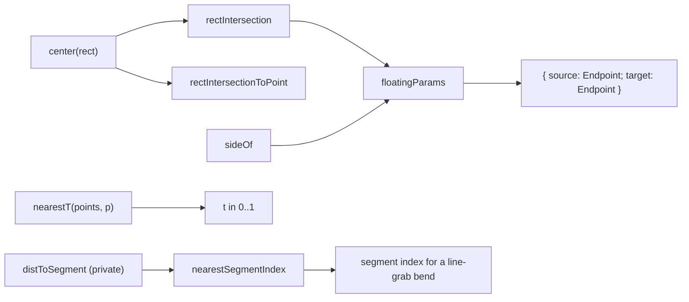

# Edge geometry

- Pure geometry helpers for free-form canvas edges (005-edges): perimeter-intersection math for floating endpoints and a nearest-parameter helper for dragging a label along an edge path.
- Path: `lib/canvas/edge-geometry.ts`; stack: TypeScript 5 — no DOM, no React, no `@xyflow/react` runtime (type-only `Side` import).
- Public API: `rectIntersection`, `rectIntersectionToPoint`, `sideOf`, `floatingParams`, `nearestT`, `nearestSegmentIndex`, `SNAP_STEP_DEG`, `snapAngle`; interfaces `Rect`, `Point`, `Endpoint`.
- Generated at depth by `flowcode:module-explorer-agent` (merge-mode if it exists); meets its § Module Doc Completeness Bar — real signatures, a usage example, config/env, traced deps, conventions.
- Status active; generated by human (005-edges), merged (006-semantic-edges Phase 1); last updated 2026-06-30.

---

## Purpose

`edge-geometry.ts` owns the pure math behind the 005-edges "floating" edge model. A floating edge has no pinned handle side: instead of attaching to a fixed `top`/`right`/`bottom`/`left` handle, each endpoint anchors at the point where the center→center ray crosses the node's perimeter, so the edge always meets the box at the cleanest spot as nodes move. This module computes those perimeter intersections and the side each one lands on, and provides the inverse helper used when a user drags an edge label — mapping a screen point back to a `0..1` parameter along a sampled path. The only consumer is the edge renderer `components/canvas/edges/labeled-edge.tsx`, which feeds it live React Flow node geometry (via `useInternalNode`) and maps the returned `Side` to a React Flow `Position`. The module is deliberately on the pure `lib/canvas/*` side of the architecture boundary — it imports only the `Side` type and touches no DOM or React — so it stays unit-testable under the vitest gate (`lib/canvas/edge-geometry.test.ts`).

### Internal Architecture

Simple leaf module — five pure functions over plain rects/points, no internal component graph. The center-helper feeds the two intersection functions; `floatingParams` composes `rectIntersection` + `sideOf` for both ends.



---

## Public API

Concrete signatures only. No prose.

### Functions / Methods

```ts
// lib/canvas/edge-geometry.ts:17 — perimeter intersection of the rect-center → toward-center ray
export function rectIntersection(rect: Rect, toward: Rect): Point

// lib/canvas/edge-geometry.ts:34 — same, but aimed at an arbitrary point (e.g. the first waypoint)
export function rectIntersectionToPoint(rect: Rect, toward: Point): Point

// lib/canvas/edge-geometry.ts:46 — which side of `rect` a perimeter point sits on (1px tolerance)
export function sideOf(rect: Rect, p: Point): Side

// lib/canvas/edge-geometry.ts:55 — floating endpoints for both ends (each aimed at the other's center)
export function floatingParams(source: Rect, target: Rect): { source: Endpoint; target: Endpoint }

// lib/canvas/edge-geometry.ts:79 — index of the render-path segment nearest `p` (where a line-grab inserts a bend)
export function nearestSegmentIndex(points: Point[], p: Point): number

// lib/canvas/edge-geometry.ts:93 — nearest parameter t∈[0,1] on a polyline sample to point `p`
export function nearestT(points: Point[], p: Point): number

// lib/canvas/edge-geometry.ts:105 — default Shift-snap increment; 45° gives horizontal, vertical, AND diagonals
export const SNAP_STEP_DEG = 45

// lib/canvas/edge-geometry.ts:111 — snaps angle of segment prev→p to nearest stepDeg multiple, preserving length; zero-length input returns p unchanged
export function snapAngle(prev: Point, p: Point, stepDeg?: number): Point
```

`nearestSegmentIndex` is backed by a private `distToSegment(p, a, b)` point-to-segment helper (`edge-geometry.ts:65`), not exported.

`snapAngle` defaults `stepDeg` to `SNAP_STEP_DEG` (45). It is consumed (Phase 3) by the waypoint-drag handler while Shift is held so adjacent segments align to clean angles.

### Classes

Not applicable — plain interfaces only:

```ts
// lib/canvas/edge-geometry.ts:7-9
export interface Rect { x: number; y: number; width: number; height: number }
export interface Point { x: number; y: number }
export interface Endpoint { x: number; y: number; side: Side }   // Side from ./jsoncanvas
```

### HTTP Routes (if applicable)

Not applicable — pure library, no HTTP surface.

### Events / Messages (if applicable)

Not applicable — no publish/subscribe surface.

### Exceptions / Errors

None — every function is total and returns a value for all inputs. Degenerate cases return sensible defaults rather than throwing: a zero-length direction vector (`dx === 0 && dy === 0`) returns the rect center (`edge-geometry.ts:22,38`); a `points` sample shorter than 2 returns `0.5` (`edge-geometry.ts:69`).

---

## Usage Examples

Derived from `lib/canvas/edge-geometry.test.ts:7-36`; the production call site is `components/canvas/edges/labeled-edge.tsx` (imports `rectIntersectionToPoint`, `sideOf`, `nearestT`, `nearestSegmentIndex` at `labeled-edge.tsx:20`). The edge renderer uses `rectIntersectionToPoint` directly for each floating end (aimed at the next waypoint or the other node's center); `rectIntersection`/`floatingParams` are exported and unit-tested but not on the renderer's import path.

```ts
import { rectIntersection, sideOf, floatingParams, nearestT, type Rect } from './edge-geometry'

const A: Rect = { x: 0, y: 0, width: 100, height: 100 }     // center (50,50)
const B: Rect = { x: 300, y: 0, width: 100, height: 100 }   // center (350,50) — directly to the right

// A floating edge from A toward B exits A's RIGHT edge at its mid-height
rectIntersection(A, B)            // => { x: 100, y: 50 }
rectIntersection(A, { ...A })     // => { x: 50, y: 50 }   (degenerate: same center → return center)

// Classify a perimeter point to a Side
sideOf(A, { x: 100, y: 50 })      // => 'right'
sideOf(A, { x: 50, y: 0 })        // => 'top'

// Both endpoints at once (each aimed at the other node's center)
const { source, target } = floatingParams(A, B)
// source => { x: 100, y: 50, side: 'right' }
// target => { x: 300, y: 50, side: 'left' }

// Label drag: nearest 0..1 param along a sampled path (index 0 = source end, last = target end)
const pts = Array.from({ length: 11 }, (_, i) => ({ x: i * 10, y: 0 }))   // sampled 0..100 along x
nearestT(pts, { x: 0,   y: 0 })   // => 0     (start)
nearestT(pts, { x: 100, y: 0 })   // => 1     (end)
nearestT(pts, { x: 50,  y: 6 })   // => 0.5   (midpoint)
nearestT([], { x: 0, y: 0 })      // => 0.5   (too-short sample fallback)
```

The example demonstrates floating-endpoint resolution (`rectIntersection`/`floatingParams`/`sideOf`) and label re-positioning (`nearestT`). Real assertions live in `lib/canvas/edge-geometry.test.ts:7-60` (covering `rectIntersection`, `sideOf`, `floatingParams`, `nearestT`, and `nearestSegmentIndex`); the production call site is the floating-path computation in `components/canvas/edges/labeled-edge.tsx` (which reads live node geometry from `useInternalNode`).

---

## Database Schema

Not applicable — this module owns no tables and performs no persistence.

---

## Dependencies

**Upstream modules:**
- `lib/canvas/jsoncanvas.ts` — type-only import of `Side` (`'top' | 'right' | 'bottom' | 'left'`), the return type of `sideOf` and the `side` field of `Endpoint` (`edge-geometry.ts:5`).

**External services:**
- None.

**Key libraries:**
- None — pure TypeScript plus `Math.abs` / `Math.max`. No npm packages, no `@xyflow/react` runtime.

---

## Configuration & Environment

Not applicable — this module reads no environment variables and no config keys. It is fully parameterised by its function arguments.

---

## Run / Test / Lint

Commands scoped to this module. Cross-reference full project gates in `.flowcode/quality-checks/quality-checks-index.md`.

| Action | Command |
|--------|---------|
| Test (unit) | `npx vitest run lib/canvas/edge-geometry.test.ts` |
| Test (all canvas) | `npx vitest run lib/canvas/` |
| Typecheck | `npx tsc --noEmit` |
| Lint | `npm run lint` |

---

## Key Insights

**Conventions & patterns:** Follows the `lib/canvas/*` pure-module convention — no DOM, no React, no `@xyflow/react` runtime symbol (only the `Side` type). This keeps the module on the testable side of the React Flow boundary; `adapter.ts` remains the lone file in `lib/canvas/*` that imports a runtime RF symbol. The edge renderer is responsible for the impure half: it pulls measured node rects from `useInternalNode`, calls these helpers, and maps the returned `Side` to a React Flow `Position` for the path generators.

**Gotchas & invariants:**

- **Dominant-axis scaling, not true ray-box clipping.** `rectIntersection` scales the center→toward direction by `1 / max(|dx|/hw, |dy|/hh)` (`edge-geometry.ts:26`) — standard React-Flow floating-edge math. It assumes the source point is the rect center; do not reuse it to clip a ray that starts elsewhere.
- **`sideOf` checks left → right → top → bottom in that order** with a 1px tolerance (`edge-geometry.ts:46-51`). A point that satisfies two conditions (e.g. a corner) resolves to the earlier branch (left/right win over top, top wins over bottom). The final `return 'bottom'` is the catch-all, so an interior point (not actually on a perimeter) is reported as `'bottom'` — callers feed it real intersection points, so this is not exercised in practice.
- **Degenerate inputs never throw.** Coincident centers return the center point (`edge-geometry.ts:22,38`); a `points` array shorter than 2 returns `0.5` from `nearestT` (`edge-geometry.ts:69`). Both behaviors are pinned by tests (`edge-geometry.test.ts:14-16,47-50`).
- **`nearestT` is a discrete nearest-sample, not a true projection.** It returns `bestIndex / (length - 1)` over the sampled points (`edge-geometry.ts:72-76`) — it does not interpolate onto the nearest segment. Resolution is therefore bounded by how densely the caller samples the path; the renderer samples the rendered path before calling it.
- **`points[0]` is the source end, `points[length-1]` is the target end.** `nearestT` returns 0 at the source and 1 at the target; this orientation matches the `labelT` field stored on `CanvasEdge.meta` (0.5 = midpoint).
- **`nearestSegmentIndex` operates on the full render path, not the stored waypoints.** The renderer passes `[source, ...waypoints, target]` (`labeled-edge.tsx:452`), so the returned index `i` is the segment `[path[i], path[i+1]]`; the line-grab gesture then `splice`s a new bend at `i` into the waypoint array. It is a true point-to-segment distance (via the private `distToSegment`), not a nearest-vertex test, so a grab anywhere along a long straight segment finds the right insertion slot.

---

## Known Gaps

- `nearestT` is a nearest-sample approximation rather than a per-segment projection; label placement granularity depends on the caller's path sampling density. No `BL-NNN` assigned.
- No standalone test for `rectIntersectionToPoint` — it shares the identical algorithm with `rectIntersection` (which is tested), differing only in aiming at a `Point` vs a `Rect` center. A direct test would improve regression isolation. No `BL-NNN` assigned.
