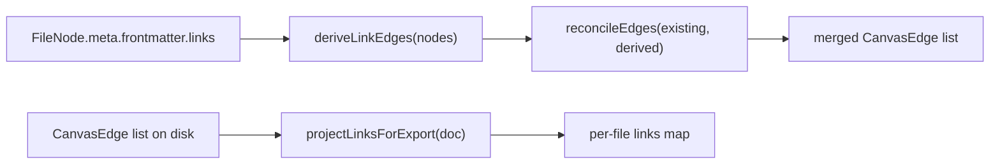

# Edges

- Pure TypeScript edge-lifecycle module: derives `lk:` edges from `links:` frontmatter, reconciles the full edge set preserving user/agent edges, and projects canvas edges back to per-file `links:` lists for bundle export.
- Path: `lib/canvas/edges.ts`; stack: TypeScript 5, pure (no React, no DOM).
- Public API: `deriveLinkEdges`, `reconcileEdges`, `projectLinksForExport`.
- Consumed by `lib/canvas/store.ts` (0.1→0.2 migration + `resyncFile`) and `app/api/canvas/bundle/route.ts` (export projection).
- Generated at depth by `flowcode:module-explorer-agent`; meets its § Module Doc Completeness Bar — real signatures, a usage example, config/env, traced deps, conventions.
- Status active; generated by bootstrap; last updated 2026-06-29.

---

## Purpose

`edges.ts` owns the full lifecycle of derived (frontmatter-sourced) canvas edges. `deriveLinkEdges` reads every file node's `links:` frontmatter and emits deterministic `lk:<from>-><to>` edges for each resolvable file-to-file link, skipping unresolved targets, self-links, and duplicates. `reconcileEdges` merges a fresh derived set into an existing edge list — keeping user and agent edges untouched, dropping all stale `links`-origin edges, and suppressing any derived edge whose directed pair is already covered by a manual or agent edge (the manual edge wins). `projectLinksForExport` is the inverse operation: it maps all canvas file→file edges back into a `Record<string, string[]>` of per-file link lists, used by the bundle-export route to reconstruct frontmatter-compatible `links:` entries. Post-v2 (schema `0.2`), the canvas is authoritative: `deriveLinkEdges` + `reconcileEdges` together are called only during the one-time `0.1→0.2` migration; `projectLinksForExport` remains in active use by the bundle route on every export request.

### Internal Architecture



---

## Public API

Concrete signatures only. No prose.

### Functions / Methods

```ts
// lib/canvas/edges.ts:19
export function deriveLinkEdges(nodes: CanvasNode[]): CanvasEdge[]

// lib/canvas/edges.ts:45
export function reconcileEdges(existing: CanvasEdge[], derived: CanvasEdge[]): CanvasEdge[]

// lib/canvas/edges.ts:58
export function projectLinksForExport(doc: FlowcanvasDoc): Record<string, string[]>
```

Module-internal helpers (not exported):

```ts
// lib/canvas/edges.ts:5
const norm = (p: string) => string  // drops leading ./ or /, unifies path separators to /

// lib/canvas/edges.ts:8
function readLinks(value: unknown): string[]  // coerces array | scalar | absent into string[]
```

### Classes

Not applicable.

### HTTP Routes

Not applicable — pure TypeScript module with no HTTP surface.

### Events / Messages

Not applicable — no messaging, pub/sub, or event emission.

### Exceptions / Errors

Not applicable — this module throws no exceptions. All invalid inputs (unresolved link target, self-link, duplicate link, non-file endpoint) are handled by silent-skip. See Key Insights for the invariants callers depend on.

---

## Usage Examples

Derived from `lib/canvas/edges.test.ts:18-87` (real test fixtures).

```ts
import { deriveLinkEdges, reconcileEdges, projectLinksForExport } from './edges'
import type { CanvasNode, CanvasEdge, FlowcanvasDoc } from './jsoncanvas'

// --- deriveLinkEdges: frontmatter links -> deterministic CanvasEdge list ---
const nodes: CanvasNode[] = [
  {
    id: 'n-design', type: 'file', file: 'examples/design.md',
    x: 0, y: 0, width: 100, height: 100,
    meta: { frontmatter: { links: ['examples/plan.md'] } },
  },
  {
    id: 'n-plan', type: 'file', file: 'examples/plan.md',
    x: 0, y: 0, width: 100, height: 100,
    meta: { frontmatter: { links: ['./examples/design.md'] } }, // leading ./ normalized
  },
]
const derived = deriveLinkEdges(nodes)
// => [
//   { id: 'lk:n-design->n-plan', fromNode: 'n-design', toNode: 'n-plan',
//     toEnd: 'arrow', label: 'links', color: '6', meta: { origin: 'links' } },
//   { id: 'lk:n-plan->n-design', fromNode: 'n-plan',   toNode: 'n-design',
//     toEnd: 'arrow', label: 'links', color: '6', meta: { origin: 'links' } },
// ]

// --- reconcileEdges: manual edge wins; stale links-origin edges are dropped ---
const existing: CanvasEdge[] = [
  { id: 'e-manual', fromNode: 'n-design', toNode: 'n-plan', meta: { origin: 'user' } },
  { id: 'lk:old->gone', fromNode: 'old', toNode: 'gone', meta: { origin: 'links' } },
]
const merged = reconcileEdges(existing, derived)
// 'lk:old->gone'     dropped  (stale links-origin)
// 'lk:n-design->n-plan' suppressed (manual covers same directed pair)
// 'lk:n-plan->n-design' kept    (reverse direction not covered)
// => [e-manual, lk:n-plan->n-design]

// --- projectLinksForExport: canvas edges -> per-file links map for bundle export ---
const doc: FlowcanvasDoc = {
  nodes: [
    { id: 'n1', type: 'file', file: 'a.md', x: 0, y: 0, width: 100, height: 100 },
    { id: 'n2', type: 'file', file: 'b.md', x: 0, y: 0, width: 100, height: 100 },
    { id: 'n3', type: 'file', file: 'c.md', x: 0, y: 0, width: 100, height: 100 },
  ],
  edges: [
    { id: 'e1', fromNode: 'n1', toNode: 'n2' },
    { id: 'e2', fromNode: 'n1', toNode: 'n3' },
    { id: 'e3', fromNode: 'n1', toNode: 'n2' }, // duplicate pair — deduped
  ],
  flowcanvas: { schemaVersion: '0.2', session: { createdAt: '', updatedAt: '', revision: 0 }, comments: [] },
}
projectLinksForExport(doc)
// => { 'a.md': ['b.md', 'c.md'] }
```

Primary call sites: `lib/canvas/store.ts:121` (0.1→0.2 migration: `reconcileEdges(doc.edges, deriveLinkEdges(nodes))`), `lib/canvas/store.ts:637` (`resyncFile`: `deriveLinkEdges` solo, single-node re-derive), and `app/api/canvas/bundle/route.ts:24` (`projectLinksForExport(doc)`).

---

## Database Schema

Not applicable — pure module, no database ownership.

---

## Dependencies

**Upstream modules:**
- `lib/canvas/jsoncanvas.ts` — imports `CanvasNode`, `CanvasEdge`, `FlowcanvasDoc`, and `isFileNode` type guard (`lib/canvas/edges.ts:1-2`)

**External services:**
- None

**Key libraries:**
- None — standard TypeScript only; no npm dependencies

---

## Configuration & Environment

Not applicable — pure module; reads no environment variables and no config keys.

---

## Run / Test / Lint

| Action | Command |
|--------|---------|
| Test (this module) | `npx vitest run lib/canvas/edges.test.ts` |
| Test (all pure modules) | `npx vitest run` |
| Typecheck | `npx tsc --noEmit` |
| Lint | `npm run lint` |

---

## Key Insights

**Conventions & patterns:**

- `edges.ts` strictly follows the project's pure-module convention (`lib/canvas/*`): no DOM, no React, no `fs`, no side effects — typed inputs in, typed outputs out. The module is fully exercised by vitest without any mocks (`lib/canvas/edges.test.ts:1`).
- Path normalization is internal to this module: `norm()` strips a leading `./` or `/` and unifies separators to `/` (`lib/canvas/edges.ts:5`). Both the lookup key (built from `FileNode.file`) and the incoming `links:` value pass through `norm()`, making `./examples/design.md` and `examples/design.md` resolve to the same node. No caller needs to pre-normalize.
- `readLinks` defensively coerces the `links:` frontmatter value from `array | scalar | absent` to `string[]`, filtering out non-string entries (`lib/canvas/edges.ts:8-11`). Malformed frontmatter (e.g. `42`, `null`, mixed arrays) produces zero links without throwing.
- Derived edges carry three fixed display properties: `toEnd: 'arrow'`, `label: 'links'`, `color: '6'` (`lib/canvas/edges.ts:33`). These values are intentionally invariant for all `links`-origin edges and drive the muted-dashed-lock style in `components/canvas/edges/labeled-edge.tsx`. Do not vary them without updating that component's origin-style branch.

**Gotchas & invariants:**

- **Deterministic ID convention** — every derived edge has id `lk:${fromNode}->${toNode}` (`lib/canvas/edges.ts:30`). This convention is load-bearing in two places: (1) `reconcileEdges` detects origin via `e.meta?.origin !== 'links'`, not the `lk:` prefix; (2) the store's `resyncFile` action uses the prefix pattern `lk:${target.id}->` to drop only one node's stale edges before re-deriving (`lib/canvas/store.ts:634-637`). Changing the id shape without updating both call sites breaks the incremental resync.
- **Migration-only post-v2** — `deriveLinkEdges` + `reconcileEdges` called together are the one-time `0.1→0.2` migration path (`lib/canvas/store.ts:120-121`). For v0.2 boards (the current default), the store trusts the persisted edge list on every load and never re-derives. This was an explicit architectural decision (plan `002`, "Decision 4") to make the canvas the authoritative typed-relation graph. The migration writes the updated doc back to disk (`lib/canvas/store.ts:131`), so the bake is permanent.
- **Manual edge wins on exact directed pair** — `reconcileEdges` suppresses a derived edge only when `keep` already contains an edge from the same `fromNode` to the same `toNode` (`lib/canvas/edges.ts:47-48`). The reverse direction is never suppressed. So a manual edge `A→B` blocks `lk:A->B` but leaves `lk:B->A` intact (`lib/canvas/edges.test.ts:79-87`).
- **`projectLinksForExport` is origin-agnostic** — it reads all `doc.edges`, not just `links`-origin ones. Any edge (user, agent, derived, import) whose both endpoints are file nodes contributes a `links:` entry in the output (`lib/canvas/edges.ts:58-70`). The bundle route uses this to reconstruct frontmatter for export; the result is a projection of the canvas-authoritative edge state, not a filtered subset.
- **No error throwing** — every invalid-input condition is silently skipped. Callers cannot distinguish "no links declared" from "all links unresolvable" from an empty return value alone. The design is intentional for the pure-function contract; diagnostics must be added at the call site if needed.

---

## Known Gaps

- No diagnostic path for unresolvable or malformed `links:` values — silent-skip is correct for the runtime path but makes frontmatter typos invisible. A future optional `warn` callback parameter on `deriveLinkEdges` would surface bad links without breaking the pure-function contract.
