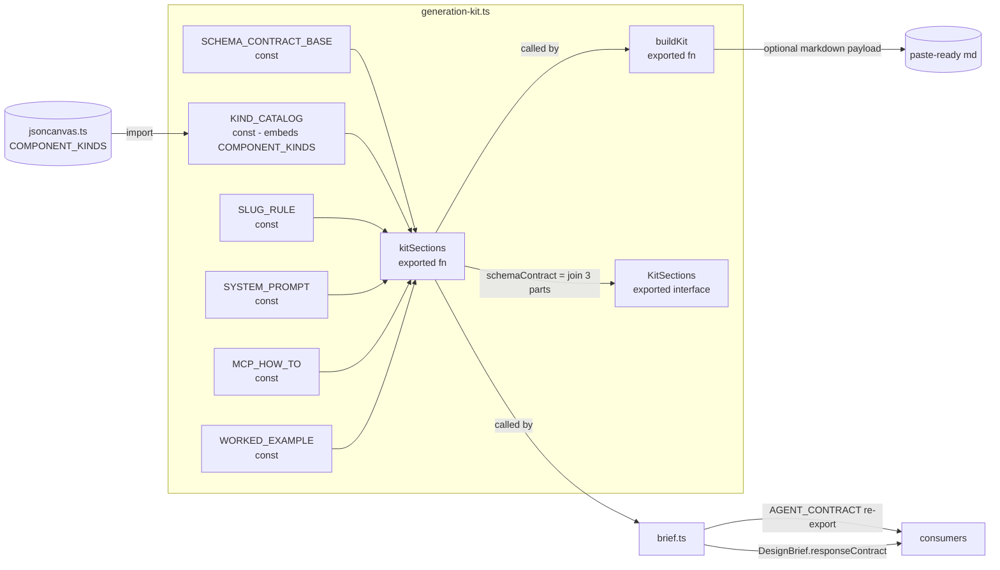

# Generation Kit

- Single source of truth for the Flowcanvas Agent Generation Kit: assembles and exports the system prompt, schema contract, MCP loop instructions, and worked example consumed by `brief.ts`, the MCP sidecar (Phase 3), and `docs/flowcanvas-agent-contract.md`.
- Path: `lib/canvas/generation-kit.ts`; stack: TypeScript 5 — pure (no React, no DOM, no fs, no network, no clock).
- Public API: `kitSections(): KitSections`, `buildKit(markdown?): string`; interface: `KitSections`.
- Generated at depth by `flowcode:module-explorer-agent`; meets its § Module Doc Completeness Bar — real signatures, a usage example, config/env, traced deps, conventions.
- Status active; generated by bootstrap; last updated 2026-06-29.

---

## Purpose

`generation-kit.ts` owns the complete textual content of the Flowcanvas Agent Contract. It assembles four distinct sections — system prompt, schema contract (three sub-clauses joined), MCP loop instructions, and a worked JSON example — and exposes them two ways: as a structured `KitSections` record (for programmatic embedding) and as a single paste-ready markdown string via `buildKit`. Every downstream artifact renders FROM this module: `brief.ts` re-exports `AGENT_CONTRACT` (a thin alias over `kitSections().schemaContract`) and stamps `responseContract` into every `DesignBrief` it builds; `docs/flowcanvas-agent-contract.md` carries a "GENERATED" header and is regenerated from the same source; in Phase 3, the MCP `get_generation_kit` tool, the `flowcanvas://generation-kit` resource, and the UI "Copy full kit" bundle will all call `buildKit`. The module is intentionally pure so it can be tested in isolation with zero setup.

### Internal Architecture



---

## Public API

Concrete signatures only. No prose.

### Functions / Methods

```typescript
// lib/canvas/generation-kit.ts:80
export function kitSections(): KitSections

// lib/canvas/generation-kit.ts:90
export function buildKit(markdown?: string): string
```

`kitSections` — assembles the four contract sections; `schemaContract` is built as:
```
[SCHEMA_CONTRACT_BASE, KIND_CATALOG, SLUG_RULE].join('\n\n')
```
(source: `lib/canvas/generation-kit.ts:83`).

`buildKit` — renders `## 1 · System prompt` through `## 4 · Worked example`; when `markdown != null` appends `## 5 · Your document to convert` wrapping the payload in a fenced markdown block (source: `lib/canvas/generation-kit.ts:90-101`).

### Classes

Not applicable — the module uses a plain interface, not classes.

### HTTP Routes (if applicable)

Not applicable.

### Events / Messages (if applicable)

Not applicable.

### Exceptions / Errors

No custom exceptions. The module is pure and infallible — all constants are static strings; `kitSections()` and `buildKit()` cannot throw under normal TypeScript conditions.

---

## Usage Examples

```typescript
// --- From lib/canvas/brief.ts:149 (real call site) ---

import { kitSections } from './generation-kit'

// Re-export the schema contract for callers that only need the text:
export const AGENT_CONTRACT = kitSections().schemaContract

// Embed it verbatim in every DesignBrief so the agent always has the contract inline:
// lib/canvas/brief.ts:244
responseContract: kitSections().schemaContract,


// --- buildKit with a document payload (from generation-kit.test.ts:22) ---

import { buildKit } from './generation-kit'

const md = '## Order lifecycle\nCheckout calls Payments.'
const full = buildKit(md)
// full contains:
// "## 1 · System prompt\n\n..."
// "## 2 · Schema contract\n\n..."
// "## 3 · MCP loop\n\n..."
// "## 4 · Worked example\n\n..."
// "## 5 · Your document to convert\n\n```markdown\n## Order lifecycle\n...\n```"

const base = buildKit()   // omits section 5
```

Real call sites: `lib/canvas/brief.ts:149` (`AGENT_CONTRACT`), `lib/canvas/brief.ts:244` (`responseContract` in `buildBrief`). Tests: `lib/canvas/generation-kit.test.ts:2-38`.

---

## Database Schema

Not applicable — this module owns no tables and performs no I/O.

---

## Dependencies

**Upstream modules:**
- `lib/canvas/jsoncanvas.ts` — imports `COMPONENT_KINDS` (`readonly ComponentKind[]`), the ordered eight-element tuple `['service', 'datastore', 'queue', 'actor', 'external', 'decision', 'process', 'boundary']`, used to enumerate the allowed kind set in `KIND_CATALOG` and validated by the test (`lib/canvas/generation-kit.ts:4`, `lib/canvas/generation-kit.ts:43`).

**External services:**
- None — the module is pure; all content is static string constants.

**Key libraries:**
- None beyond the TypeScript standard library.

---

## Configuration & Environment

Not applicable — this module reads no environment variables and no config keys. All content is compile-time string constants.

---

## Run / Test / Lint

Commands scoped to this module. Cross-reference full project gates in `.flowcode/quality-checks/quality-checks-index.md`.

| Action | Command |
|--------|---------|
| Run | Not applicable (library module, no entrypoint) |
| Test (unit) | `npx vitest run lib/canvas/generation-kit.test.ts` |
| Test (integration) | Not applicable |
| Lint | `npx eslint lib/canvas/generation-kit.ts` |
| Typecheck | `npx tsc --noEmit` (project-wide; no separate command detected) |

---

## Key Insights

**Conventions & patterns:**

- **Pure by design.** The file-level comment `// Pure: no fs, no network, no DOM` (`lib/canvas/generation-kit.ts:1`) is an enforced invariant — never add I/O. Purity enables Vitest to run the full suite in-process with no mocks and no server.
- **Three-part `schemaContract`.** `SCHEMA_CONTRACT_BASE`, `KIND_CATALOG`, and `SLUG_RULE` are kept as separate `const` strings and joined at call time (`lib/canvas/generation-kit.ts:83`). This separation makes it possible to update the slug rule or kind catalog independently without touching the core extraction rules.
- **`COMPONENT_KINDS` imported, not duplicated.** `KIND_CATALOG` embeds the allowed set by interpolating `COMPONENT_KINDS.join(', ')` (`lib/canvas/generation-kit.ts:43`). The kind list is defined exactly once in `jsoncanvas.ts`; the generation kit always reflects the live set. Adding or removing a kind in `jsoncanvas.ts` automatically propagates into the contract text at runtime.
- **`buildKit` is the paste-ready rendition; `kitSections` is the structured rendition.** Never call `buildKit` in programmatic contexts (e.g. stamping `responseContract`) — use `kitSections().schemaContract` so downstream consumers get a clean string without the `## N ·` markdown headers.
- **`docs/flowcanvas-agent-contract.md` is generated.** Its first line is `<!-- GENERATED — do not hand-edit. Source of truth: kitSections().schemaContract in lib/canvas/generation-kit.ts. -->`. Manual edits to that file will be silently overwritten; changes must be made in `generation-kit.ts`.

**Gotchas & invariants:**

- `boundary` is the only kind that is **GROUP-ONLY** — `meta.kind:"boundary"` is valid exclusively on `type:"group"` nodes, never on leaf nodes. This constraint is stated in `KIND_CATALOG` (`lib/canvas/generation-kit.ts:41-42`) and asserted in the test (`lib/canvas/generation-kit.test.ts:18`). Any future agent editing the kind list must preserve this group-only annotation.
- `schemaContract` concatenates the three sub-strings with `'\n\n'` — two newlines, not one. Tests assert `toContain` on specific strings within the contract; changing the separator can silently break downstream parsing if the agent or a human reader relies on double-newline as a section boundary.
- `buildKit()` (no arg) and `buildKit(undefined)` are identical — the guard is `markdown != null` (`lib/canvas/generation-kit.ts:99`), which is falsy for both `undefined` and `null`. Passing an empty string `buildKit('')` WILL append section 5 with an empty fenced block; callers should pass `undefined` (or no arg) when there is no document.
- `AGENT_CONTRACT` in `brief.ts` is a module-level `const` evaluated once at import time. Mutating the string constants in `generation-kit.ts` after module load (not possible in TS, but relevant if tests stub the module) will not update `AGENT_CONTRACT`; tests must reimport `brief.ts` or mock `kitSections` before the module loads.
- Phase 3 will add the MCP `get_generation_kit` tool and `flowcanvas://generation-kit` resource in `mcp/flowcanvas-mcp.ts`; those calls must use `buildKit()` (no arg), not `buildKit(markdown)`, because the MCP resource represents the kit template, not a kit+document bundle.

---

## Known Gaps

- Phase 3 `get_generation_kit` MCP tool and `flowcanvas://generation-kit` resource are not yet implemented; `generation-kit.ts` is ready to serve them but the sidecar wiring is pending.
- `docs/flowcanvas-agent-contract.md` regeneration is currently manual; no script or CI gate regenerates it from `kitSections().schemaContract` automatically.
- No schema version field in `KitSections` or in the `buildKit` output — if the contract evolves, consumers have no way to detect a stale cached copy without re-calling `kitSections()`.
