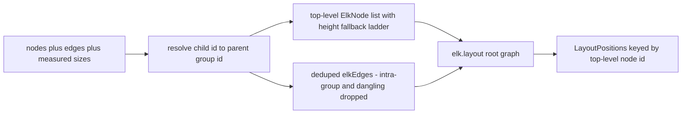

# Layout

- Owns ELK-based auto-layout for the canvas board; the toolbar "Re-organize" button calls `computeLayout` to produce non-overlapping, layered positions for all top-level nodes.
- Path: `lib/canvas/layout.ts`; stack: TypeScript 5 + `elkjs` ^0.11.1 (bundled JS build, no native deps).
- Public API: `computeLayout(nodes, edges, measured?) → Promise<LayoutPositions>` (ELK "Re-organize") and `organizeByType(nodes, coreDocPath?) → OrganizeResult` (pure "Organize by type" — readable wrapped grid + tiered shelf rows); exported types `LayoutPositions`, `MeasuredSizes`; exported budgets `MAX_GROUP_WIDTH`, `MAX_ROW_WIDTH`, `GROUP_PAD`, `GROUP_LABEL_PAD`.
- Pure module — no DOM, no React, no filesystem. Consumers: `canvas-toolbar.tsx` (computeLayout), `store.ts`/MCP `apply_response` (organizeByType).
- Status active; generated by bootstrap; last updated 2026-06-30 (organizeByType → readable wrapped layout).

---

## Purpose

`layout.ts` owns the ELK-based "Re-organize" auto-layout for the canvas board. Given the full set of `CanvasNode` and `CanvasEdge` objects plus a live measured-size map from React Flow, `computeLayout` produces absolute `{x, y}` positions for every **top-level** node (parentless nodes and group containers). Grouped children are never positioned directly — the caller (`canvas-toolbar.tsx:reorganize`) shifts each child by its group's `(dx, dy)` delta so the whole group moves as a rigid unit while doc coordinates remain absolute. The module is a single pure async function over a module-level ELK singleton; it has no DOM, React, or filesystem side-effects.

### Internal Architecture



---

## Public API

Concrete signatures only. No prose.

### Functions / Methods

```ts
// lib/canvas/layout.ts:19-63
export async function computeLayout(
  nodes: CanvasNode[],
  edges: CanvasEdge[],
  measured: MeasuredSizes = {},
): Promise<LayoutPositions>

// exported type aliases — lib/canvas/layout.ts:6-7
export type LayoutPositions = Record<string, { x: number; y: number }>
export type MeasuredSizes   = Record<string, { width: number; height: number }>
```

### Classes

Not applicable — no classes exported.

### HTTP Routes

Not applicable.

### Events / Messages

Not applicable.

### Exceptions / Errors

| Name | Raised When | Caught By |
|------|-------------|-----------|
| ELK internal error (untyped) | Invalid graph (e.g., cycles ELK cannot resolve, malformed option values) | `canvas-toolbar.tsx:90` — `try/catch` with `console.error('Re-organize (ELK) failed', e)` |

---

## Usage Examples

Real test — `lib/canvas/layout.test.ts:34-38`:

```ts
import { computeLayout, type MeasuredSizes } from '@/lib/canvas/layout'
import type { CanvasNode, CanvasEdge } from '@/lib/canvas/jsoncanvas'

// Board: two connected top-level nodes, one island, one group with one child.
const nodes: CanvasNode[] = [
  { id: 'n1', type: 'file', file: 'a.md', x: 0, y: 0, width: 200, height: 120, meta: { origin: 'user' } },
  { id: 'n2', type: 'file', file: 'b.md', x: 0, y: 0, width: 200, height: 120, meta: { origin: 'user' } },
  { id: 'n3', type: 'text', text: 'island', x: 0, y: 0, width: 160, height: 100, meta: { origin: 'user' } },
  { id: 'g1', type: 'group', label: 'box', x: 0, y: 0, width: 300, height: 200, meta: { origin: 'user', shape: 'rectangle' } },
  { id: 'c1', type: 'file', file: 'c.md', x: 0, y: 0, width: 150, height: 100, parentId: 'g1', meta: { origin: 'user' } },
]
const edges: CanvasEdge[] = [
  { id: 'e1', fromNode: 'n1', toNode: 'n2', meta: { origin: 'links' } },
  { id: 'e2', fromNode: 'c1', toNode: 'n2', meta: { origin: 'user' } }, // c1 (child) resolves to g1->n2
]
// n1 is a tall measured card — fallback ladder uses 300, not the authored 120.
const measured: MeasuredSizes = { n1: { width: 200, height: 300 } }

const positions = await computeLayout(nodes, edges, measured)
// positions === { n1: {x, y}, n2: {x, y}, n3: {x, y}, g1: {x, y} }
// c1 is absent — grouped children are never in the output
```

Demonstrates: top-level-only output, group-resolved edge (c1→n2 becomes g1→n2), measured-height override for n1, island separation for n3. Source: `lib/canvas/layout.test.ts:35`.

Production caller pattern — `components/canvas/canvas-toolbar.tsx:77-87`:

```ts
// Collect live React Flow measured sizes
const measured: MeasuredSizes = {}
for (const n of getNodes())
  if (n.measured?.width && n.measured?.height)
    measured[n.id] = { width: n.measured.width, height: n.measured.height }

const top = await computeLayout(doc.nodes, doc.edges, measured)

// Shift each group's children by the group's delta (docs stay ABSOLUTE)
const updates = { ...top }
for (const g of doc.nodes) {
  const np = top[g.id]
  if (!np || g.type !== 'group') continue
  const dx = np.x - g.x, dy = np.y - g.y
  for (const c of doc.nodes)
    if (c.parentId === g.id) updates[c.id] = { x: c.x + dx, y: c.y + dy }
}
applyLayout(updates)
setTimeout(() => fitView({ duration: 320, padding: 0.2 }), 80)
```

---

## Database Schema

Not applicable.

---

## Dependencies

**Upstream modules:**
- `lib/canvas/jsoncanvas.ts` — `CanvasNode` and `CanvasEdge` type imports (`layout.ts:2`)

**External services:**
- None.

**Key libraries:**
- `elkjs` ^0.11.1 — ELK graph layout engine; imported as `elkjs/lib/elk.bundled.js` (bundled WebWorker-free build; runs in Node.js and browser without native deps) (`layout.ts:1`)

---

## Configuration & Environment

Not applicable — this module reads no environment variables and no configuration keys.

---

## Run / Test / Lint

| Action | Command |
|--------|---------|
| Test (unit) | `npx vitest run lib/canvas/layout.test.ts` |
| Test (all) | `npx vitest run` |
| Typecheck | `npx tsc --noEmit` |
| Lint | `npm run lint` |

---

## Key Insights

**Conventions & patterns:**

- Follows the `lib/canvas/*` purity contract: no DOM, no React, no filesystem. The measured-size map bridges the DOM boundary entirely on the caller's side.
- Module-level ELK singleton (`const elk = new ELK()` at `layout.ts:4`) is constructed once at module load. Never re-initialize inside the function — ELK's internal state and any worker/WASM initialization is shared across calls.

**ELK layout options (all set at `layout.ts:46-54`):**

| ELK option key | Value | Effect |
|----------------|-------|--------|
| `elk.algorithm` | `layered` | Sugiyama-style layer assignment |
| `elk.direction` | `RIGHT` | Left-to-right flow matching reading order |
| `elk.edgeRouting` | `ORTHOGONAL` | Right-angle edge bends; no diagonal crossing lines |
| `elk.layered.spacing.nodeNodeBetweenLayers` | `'120'` | 120px horizontal gap between layers |
| `elk.spacing.nodeNode` | `'80'` | 80px vertical gap between nodes in the same layer |
| `elk.separateConnectedComponents` | `'true'` | Islands (unconnected subgraphs) get independent sub-layouts |
| `elk.spacing.componentComponent` | `'120'` | 120px gap between separated island groups |

**Height fallback ladder (`layout.ts:29`):**

1. `measured[n.id]?.height` — live React Flow measured height; highest precedence (handles tall auto-height markdown cards)
2. `n.height` — authored height from the `.canvas` doc node
3. `160` — hard-coded constant for nodes with no authored height (e.g., note nodes before first render)

Width uses only two levels: `measured[n.id]?.width ?? n.width` — no constant fallback, so all doc nodes must carry a `width` field.

**Group-resolved edges (`layout.ts:25, 34-35`):**

- Any edge whose `fromNode` or `toNode` is a grouped child is silently redirected to the child's group via `resolve()`. This prevents ELK from receiving a node id not present in its `children` list.
- After resolution, intra-group edges (`s === t`) and edges referencing unknown top-level ids are dropped.
- Duplicate directed pairs (`s→t`) are deduplicated via a `seen` Set before the ELK call; ELK would otherwise treat them as parallel edges.

**Caller contract — child position shift:**

`computeLayout` returns positions for top-level nodes only. The caller must shift every grouped child by its parent group's `(dx, dy)` delta (see production pattern above). Failing to do this leaves children behind when a group is moved by ELK.

**Gotchas & invariants:**

- ELK option values must be **strings** (e.g., `'120'`, not `120`). Passing numbers silently produces wrong layouts — ELK ignores unrecognised value types without error.
- The bundled build (`elk.bundled.js`) runs synchronously on the JS thread. For very large boards (hundreds of nodes) this may block the UI briefly. The worker-based build (`elk.worker.js`) would avoid blocking but requires WebWorker setup in Next.js — not currently configured.
- After `applyLayout`, the toolbar waits 80ms before calling `fitView` to let the Zustand store → React Flow sync land (`canvas-toolbar.tsx:88`). Calling `fitView` synchronously targets stale node positions.
- `computeLayout` does **not** write anything to the store or doc. All writes go through `applyLayout` in `useCanvasStore` (`store.ts:247`), called by the toolbar after the child-shift pass.

---

## Known Gaps

Not detected — populate manually.

## Update 2026-06-30 — core-doc card pinned leftmost

`organizeByType(nodes, coreDocPath?)` gains an optional second arg: the file node whose `file ===
coreDocPath` ranks -1 (its own band, left of actors) so the core-spec-doc card reads as the first element
on the board. `layoutColumns` gained a `rankOf` override to support this. Callers:
`store.organizeByType` (passes `session.coreDocPath`) and the MCP `apply_response` (passes
`next…coreDocPath`). Omitting the arg preserves prior behavior (a kind-less node ⇒ rightmost band).

## Update 2026-06-30 — readable wrapped layout (no more horizontal strip)

`organizeByType` was rewritten so a generated board is compact and readable instead of an ever-widening
left→right strip (operator: a board MUST be readable). Two levels of wrapping:

- **Within a group:** children are laid into a balanced GRID (`layoutGrid`, replacing the old
  `layoutColumns` one-column-per-kind), band-ranked so same-kind cards cluster, with column count bounded
  by `MAX_GROUP_WIDTH` — a many-child subsystem no longer widens forever. Group still resized to enclose.
- **Top level:** groups + loose leaves are SHELF-PACKED into rows ordered by reading tier — sources
  (actors/externals) → subsystem groups → notes/loose cards — each tier starting a fresh row, rows
  wrapping past `MAX_ROW_WIDTH`. The board reads top→bottom in clear bands. The core-doc card (rank -2)
  remains the top-left entry point.

New exported budgets: `MAX_GROUP_WIDTH` (1200), `MAX_ROW_WIDTH` (2300). Signature/output shape unchanged
(`OrganizeResult` = positions + group sizes); all callers (`store.organizeByType`, MCP `apply_response`,
import) get the readable layout for free. Verified on `boards/msgflow-mvp-design.canvas`: 8000×600 strip →
2168×3254 portrait, 0 overlaps, 0 children escaping their group.
