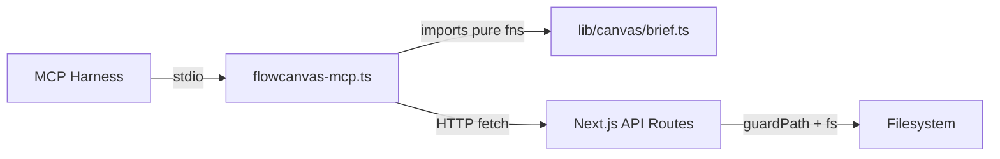

# MCP Sidecar

- Standalone Node.js stdio MCP server (`mcp/flowcanvas-mcp.ts`); registers 8 tools + 1 resource that wrap the guarded HTTP API surface and the pure `buildBrief`/`applyResponse`/`buildKit` functions so a harness can drive agent design rounds.
- Path: `mcp/`; stack: TypeScript 5 / Node.js, run via `tsx mcp/flowcanvas-mcp.ts` (no build step required).
- Public API: 8 MCP tools — `get_board`, `apply_response`, `read_file`, `write_file`, `list_dir`, `resolve_paths`, `get_active_board`, `get_generation_kit`; 1 resource — `flowcanvas://generation-kit`.
- No TypeScript `export` statements; the `server.registerTool`/`server.registerResource` registrations are the entire public surface. The Next.js app must be running at `FLOWCANVAS_BASE_URL` before any tool call.
- All diagnostic output to stderr only — stdout is owned by the MCP JSON-RPC transport.
- Status active; generated by bootstrap; last updated 2026-06-29.

---

## Purpose

`mcp/flowcanvas-mcp.ts` is the stdio MCP sidecar for Flowcanvas (plan 002, Decision 5; extended in plan 004). It is spawned by an MCP-capable harness (e.g. Claude for Desktop) as a subprocess over stdio, and brokers an AI agent's read/write access to the running Next.js app's canvas boards and markdown files. It exposes 8 tools: two high-level round-trip tools (`get_board` / `apply_response`) that invoke the pure `buildBrief`/`applyResponse` from `lib/canvas/brief.ts`, one generation-kit tool (`get_generation_kit`) that returns the Agent Generation Kit from `lib/canvas/generation-kit.ts`, and five lower-level file tools that proxy the guarded HTTP API routes. A static-URI resource `flowcanvas://generation-kit` serves the base kit for passive discovery. The sidecar never touches the filesystem directly — every file operation is delegated to the `/api/*` routes, which enforce `FLOWCANVAS_ROOT` via `lib/fs-guard.ts`. The `get_board` → agent → `apply_response` cycle is the canonical MCP round-trip; the app detects the resulting revision bump and enters change-review (Decision 6).

### Internal Architecture



---

## Public API

This module is a runnable executable, not a library. It has no TypeScript `export` statements. The public surface is the 8 MCP tool registrations and 1 resource registration. Three module-private HTTP helpers are documented below for maintainability.

### Functions / Methods

Module-private helpers — no `export`. All tools call these.

```typescript
// mcp/flowcanvas-mcp.ts:31
async function apiGet<T>(path: string): Promise<T>
// GET BASE+path; throws Error with { error } message on non-2xx

// mcp/flowcanvas-mcp.ts:40
async function apiPost<T>(path: string, body: unknown): Promise<T>
// POST BASE+path with JSON body; throws Error with { error } message on non-2xx

// mcp/flowcanvas-mcp.ts:55
async function resolveRef(canvasRef?: string): Promise<string>
// Returns canvasRef if provided; otherwise GETs /api/canvas/active → returns data.canvasRef
// Throws "No active board — open a board in Flowcanvas first, then retry." when active: null

// mcp/flowcanvas-mcp.ts:26
const rid = (): string => randomUUID().slice(0, 8)
// 8-char random suffix used for minting briefId and the mintId callback in applyResponse
```

### Classes

Not applicable — no classes defined in this module.

### HTTP Routes

Not applicable — this module is an HTTP client (calls Next.js API routes via `apiGet`/`apiPost`), not an HTTP server.

### MCP Tools

Registered via `server.registerTool` at `mcp/flowcanvas-mcp.ts:76,153,219,245,275,307,340,380`. Every tool wraps its handler in `try/catch`; on error it returns `{ error: string }` JSON with `isError: true`. On success it returns the payload JSON as `{ content: [{ type: "text", text: JSON.stringify(payload) }] }` — callers parse `content[0].text`.

| Tool | Zod Input | Returns (`content[0].text` parsed) |
|------|-----------|-------------------------------------|
| `get_board` | `canvasRef?: z.string()` | `DesignBrief` (`lib/canvas/brief.ts:65`) |
| `apply_response` | `canvasRef?: z.string(); response: AgentResponse` | `MergeReport` (`lib/canvas/brief.ts:129`) |
| `read_file` | `path: z.string()` | `{ content: string }` |
| `write_file` | `path: z.string(); content: z.string()` | `{ ok: true }` |
| `list_dir` | `path?: z.string()` (default `"."`) | `DirEntry[]` (`lib/api.ts:23`) |
| `resolve_paths` | `paths: z.array(z.string())` | `ResolvedFile[]` (`lib/api.ts:12`) |
| `get_active_board` | *(none)* | `{ canvasRef: string; baseRevision: number; intent: string }` |
| `get_generation_kit` | `markdownPath?: z.string()` | `string` — the full Agent Generation Kit markdown (not JSON-wrapped; `text` field is the kit itself; `mcp/flowcanvas-mcp.ts:380`) |

**Resource** (registered via `server.registerResource` at `mcp/flowcanvas-mcp.ts:414`):

| URI | MIME | Description |
|-----|------|-------------|
| `flowcanvas://generation-kit` | `text/markdown` | Base Agent Generation Kit (no attached doc) — passive discovery; returns `buildKit()` |

`get_generation_kit` behavior: if `markdownPath` is supplied, the tool reads the file via `GET /api/file` and passes its content to `buildKit(md)` as the doc-to-convert attachment. If omitted, `buildKit()` is called without a doc, returning the base kit. Return value is the raw markdown string (not JSON-wrapped) — `content[0].text` is the kit itself (`mcp/flowcanvas-mcp.ts:400`).

`apply_response.response` zod shape (from `mcp/flowcanvas-mcp.ts:159-181`):

```typescript
z.object({
  responseVersion: z.literal("0.1"),
  briefId: z.string(),          // echo of DesignBrief.briefId — concurrency token
  summary: z.string(),
  upsertNodes:     z.array(z.any()).optional(),
  removeNodeIds:   z.array(z.string()).optional(),
  upsertEdges:     z.array(z.any()).optional(),
  removeEdgeIds:   z.array(z.string()).optional(),
  comments:        z.array(z.any()).optional(),
  generatedFiles:  z.array(z.object({ path: z.string(), content: z.string() })).optional(),
})
```

### Exceptions / Errors

| Name | Raised When | Caught By |
|------|-------------|-----------|
| `Error("No active board...")` | `GET /api/canvas/active` returns `{ active: null }` | Tool `try/catch` → `isError: true` |
| `Error("fetch failed")` / `ECONNREFUSED` | Next.js app not running at `FLOWCANVAS_BASE_URL` | Tool `try/catch` → `isError: true` |
| HTTP 400 / `"path outside root"` | Requested path escapes `FLOWCANVAS_ROOT` (API guard) | Tool `try/catch` → `isError: true` |
| HTTP 422 / `"not a markdown file"` | `write_file` called with a non-`.md`/`.mdx` extension | Tool `try/catch` → `isError: true` |

---

## Usage Examples

Real 7-tool round-trip from `scripts/smoke-mcp.mjs:44-77` — this is the `npm run smoke:mcp` integration smoke.

```javascript
import { Client } from '@modelcontextprotocol/sdk/client/index.js'
import { StdioClientTransport } from '@modelcontextprotocol/sdk/client/stdio.js'

const ROOT = process.cwd()
const BOARD = 'examples/.smoke-mcp.canvas'
const GEN = 'examples/.smoke-mcp-gen.md'

// Spawn the sidecar and connect
const transport = new StdioClientTransport({
  command: 'npx',
  args: ['tsx', 'mcp/flowcanvas-mcp.ts'],
  cwd: ROOT,
  env: { ...process.env, FLOWCANVAS_BASE_URL: 'http://localhost:3000' },
})
const client = new Client({ name: 'smoke-mcp', version: '1.0.0' })
await client.connect(transport)

// 1. Confirm all 8 tools register
const tools = (await client.listTools()).tools.map((t) => t.name).sort()
// → ['apply_response','get_active_board','get_board','get_generation_kit','list_dir','read_file','resolve_paths','write_file']

// 2. Build the DesignBrief (also stamps session.lastBriefId so apply_response is non-stale)
const brief = JSON.parse(
  (await client.callTool({ name: 'get_board', arguments: { canvasRef: BOARD } })).content[0].text
)
// → { briefVersion: '0.1', briefId: 'brief-a1b2c3d4', nodes: [...], ... }

// 3. Inspect the filesystem
const entries = JSON.parse(
  (await client.callTool({ name: 'list_dir', arguments: { path: 'examples' } })).content[0].text
)
// → [{ name: 'welcome.md', path: 'examples/welcome.md', type: 'file', ext: '.md' }, ...]

// 4. Read a file
const { content } = JSON.parse(
  (await client.callTool({ name: 'read_file', arguments: { path: 'examples/welcome.md' } })).content[0].text
)
// → content: '---\nname: Welcome\n---\n...'

// 5. Write a generated file
await client.callTool({ name: 'write_file', arguments: { path: GEN, content: '---\nname: smoke\n---\n' } })
// → { ok: true }

// 6. Apply the agent response — briefId echoed to pass the concurrency check
const report = JSON.parse(
  (await client.callTool({
    name: 'apply_response',
    arguments: {
      canvasRef: BOARD,
      response: {
        responseVersion: '0.1',
        briefId: brief.briefId,
        summary: 'smoke add node',
        upsertNodes: [{ id: 'ag-smoke', type: 'file', file: GEN, x: 240, y: 0, width: 200, height: 120, meta: { origin: 'agent' } }],
        generatedFiles: [{ path: GEN, content: '---\nname: smoke gen\n---\n' }],
      },
    },
  })).content[0].text
)
// → { stale: false, created: { nodes: 1, edges: 0, comments: 0 }, generatedFiles: ['examples/.smoke-mcp-gen.md'], conflicts: [] }

await client.close()
```

Real call site: `scripts/smoke-mcp.mjs:44-77`. Run with `npm run smoke:mcp` (requires `npm run dev` in another terminal first).

---

## Database Schema

Not applicable — no tables owned by this module; no database access.

---

## Dependencies

**Upstream modules:**
- `lib/canvas/brief` — `buildBrief` + `applyResponse` (pure functions called directly, `mcp/flowcanvas-mcp.ts:15`); also imports `AgentResponse` type
- `lib/canvas/generation-kit` — `buildKit` (pure function; produces the Agent Generation Kit markdown string; called by Tool 8 `get_generation_kit` and the `flowcanvas://generation-kit` resource; `mcp/flowcanvas-mcp.ts:17`)
- `lib/canvas/jsoncanvas` — `FlowcanvasDoc`, `FileNode` type imports (`mcp/flowcanvas-mcp.ts:18-19`)
- `lib/api` — `ResolvedFile`, `DirEntry`, `ActiveBoard` type imports (`mcp/flowcanvas-mcp.ts:20`)

**External services:**
- Next.js API routes (HTTP, at `FLOWCANVAS_BASE_URL`) — `GET/POST /api/canvas`, `POST /api/canvas/resolve`, `GET/POST /api/canvas/active`, `GET/POST /api/file`, `GET /api/files` — all file I/O is delegated here; the sidecar never reads/writes the filesystem directly

**Key libraries:**
- `@modelcontextprotocol/sdk` ^1.29.0 — `McpServer`, `StdioServerTransport`, `registerTool` (`mcp/flowcanvas-mcp.ts:11-12`)
- `zod` ^3.25.76 — tool `inputSchema` validation for all 8 tools (`mcp/flowcanvas-mcp.ts:13`)
- `tsx` ^4.22.4 (devDep) — TypeScript runner for no-build spawn via `npm run mcp` / `npx tsx mcp/flowcanvas-mcp.ts` (`package.json:11`)
- `node:crypto` — `randomUUID` for brief/id minting (`mcp/flowcanvas-mcp.ts:14`)

---

## Configuration & Environment

### Environment Variables

| Variable | Required | Default | Read At | Purpose |
|----------|----------|---------|---------|---------|
| `FLOWCANVAS_BASE_URL` | No | `http://localhost:3000` | `mcp/flowcanvas-mcp.ts:23` | Base URL of the running Next.js app; all `apiGet`/`apiPost` calls prepend this |
| `FLOWCANVAS_ROOT` | No | `process.cwd()` | `lib/fs-guard.ts:7` (API layer, not the sidecar) | Filesystem root enforced by guarded API routes; the sidecar is bounded by it indirectly via the HTTP calls it makes |

### Config Keys

Not applicable — no config file or config store is read by this module.

---

## Run / Test / Lint

| Action | Command |
|--------|---------|
| Run (dev) | `npm run mcp` (= `tsx mcp/flowcanvas-mcp.ts`) |
| Run (direct) | `npx tsx mcp/flowcanvas-mcp.ts` |
| Integration smoke | `npm run smoke:mcp` (= `node scripts/smoke-mcp.mjs`) — requires app running |
| Full smoke suite | `npm run smoke` (MCP smoke + render smoke) |
| Typecheck (project-wide) | `npx tsc --noEmit` |
| Lint (project-wide) | `npm run lint` |

No unit tests exist for the sidecar. Integration coverage lives entirely in `scripts/smoke-mcp.mjs`.

---

## Key Insights

**Conventions & patterns:**

- **Stderr-only diagnostics.** Startup banner (`Flowcanvas MCP server running on stdio`) and all `console.error` calls go to stderr (`mcp/flowcanvas-mcp.ts:379`). Stdout is owned by the MCP JSON-RPC transport — any stdout write from application code corrupts the protocol.
- **Uniform error envelope.** Every tool wraps its entire async body in `try/catch`. On any failure it returns `{ content: [{ type: "text", text: JSON.stringify({ error: String(e) }) }], isError: true }` — never throws out of the tool handler (`mcp/flowcanvas-mcp.ts:139-144`).
- **Board resolution via `resolveRef`.** All round-trip tools accept an optional `canvasRef`; if omitted, `resolveRef` falls back to `GET /api/canvas/active`. The active-board pointer is written by the app on every `load`/`openBoard` — the sidecar only reads it (`mcp/flowcanvas-mcp.ts:55-62`).
- **Pure functions from `brief.ts` and `generation-kit.ts`.** `get_board` calls `buildBrief`; `apply_response` calls `applyResponse`; `get_generation_kit` and the `flowcanvas://generation-kit` resource call `buildKit`. These are pure (no fs, no network). The sidecar provides the impure wrappers (HTTP fetches, file writes) around them (`mcp/flowcanvas-mcp.ts:15,17`).
- **No direct filesystem access.** Every file operation (read, write, list, resolve) goes through the guarded API routes. `FLOWCANVAS_ROOT` is enforced server-side.

**Gotchas & invariants:**

- **`get_board` must precede `apply_response` in a round** or the response will be stale. `get_board` stamps `session.lastBriefId` with a `bump:false` POST (`mcp/flowcanvas-mcp.ts:134`). Without this stamp, `applyResponse` sets `MergeReport.stale = true` (the merge still runs, but the app surface flags it). The stamp is non-fatal — if it fails, only `stale:true` is reported.
- **`bump:false` keeps the revision** so `brief.baseRevision` stays valid for the upcoming `apply_response` concurrency check. A regular `bump:true` POST would advance the revision and cause a false stale (`mcp/flowcanvas-mcp.ts:134`).
- **`apply_response` writes `generatedFiles` before persisting the canvas** (`mcp/flowcanvas-mcp.ts:199-204`). This ordering means the next `GET /api/canvas/resolve` can immediately find the freshly written files.
- **`write_file` is `.md`/`.mdx`-only** at the API layer (`app/api/file/route.ts`) — the sidecar description mentions this but zod does not validate the extension client-side. Non-markdown writes fail with an HTTP 422.
- **Scope-aware brief** — if `session.briefScope` is set in the canvas (by `submitToAgent` in the store), `buildBrief` self-narrows the brief to the selection's structural closure. The MCP sidecar does not set `briefScope`; it only reads whatever the app has persisted.
- **Node.js 18+ required** for native `fetch` and `node:crypto` (`mcp/README.md:26`).

---

## Known Gaps

- No unit tests — `scripts/smoke-mcp.mjs` provides integration coverage only; mocking the HTTP layer for unit tests is not set up.
- No compiled build artifact — `npm run mcp` relies on `tsx`; a `build:mcp` script (`tsc` → `node dist/...`) is not configured (`mcp/README.md:39`).
- Disk-divergence banner deferred (Decision 10 from plan 002) — the app has no live probe to detect when the sidecar write-back changes the on-disk `.canvas` outside the current session.
