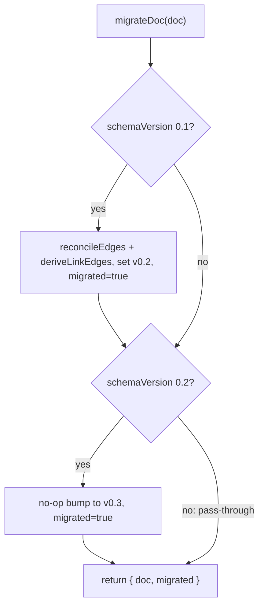

# migrate

- Owns the canonical schema-version upgrade ladder for `FlowcanvasDoc` (`0.1 → 0.2 → 0.3`); returns `{ doc, migrated }` indicating whether the doc was changed.
- Path: `lib/canvas/migrate.ts`; stack: TypeScript.
- Public API: `migrateDoc(doc: FlowcanvasDoc): { doc: FlowcanvasDoc; migrated: boolean }`.
- Generated at depth by `flowcode:module-explorer-agent`; meets § Module Doc Completeness Bar — real signatures, a usage example, config/env, traced deps, conventions.
- Status active; generated by bootstrap; last updated 2026-06-29.

---

## Purpose

`migrate` is the single, pure extraction point for the schema-version upgrade ladder. The `0.1 → 0.2` step bakes the previously-live-only derived `links:` edges into the persisted edge set (via `reconcileEdges(doc.edges, deriveLinkEdges(doc.nodes))`); the `0.2 → 0.3` step is a pure version-string bump with no data change. A `0.3` doc passes through unchanged and returns the **original reference** (not a copy) with `migrated: false`.

The module was extracted from the inline migration in `store.load` (plan 004 Phase 1) so that both `store.load` and the upcoming `importDoc` action (Phase 5) share one ladder and guarantee that every path accepting a `.canvas` file migrates identically. The module is intentionally pure — no fs, no DOM, no side effects. The caller must hydrate node frontmatter via `hydrateFiles` before calling `migrateDoc`, since `deriveLinkEdges` reads `meta.frontmatter.links`.

### Internal Architecture



---

## Public API

Concrete signatures only. No prose.

### Functions / Methods

```typescript
// lib/canvas/migrate.ts:6
export function migrateDoc(doc: FlowcanvasDoc): { doc: FlowcanvasDoc; migrated: boolean }
```

The return `doc` is the upgraded document — immutably reconstructed at each step that fires, or the same object reference if already at `0.3`. `migrated` is `true` whenever any version bump occurred, including the semantically no-op `0.2 → 0.3` bump.

### Classes

Not applicable.

### HTTP Routes

Not applicable.

### Events / Messages

Not applicable.

### Exceptions / Errors

None — the function is pure and does not throw. All inputs are structurally typed by `FlowcanvasDoc` (`lib/canvas/jsoncanvas.ts`).

---

## Usage Examples

```typescript
// lib/canvas/migrate.test.ts:21-31 — 0.1 → 0.3 full ladder (real test)
import { migrateDoc } from './migrate'
import type { CanvasNode, FlowcanvasDoc } from './jsoncanvas'

const nodes: CanvasNode[] = [
  {
    id: 'a', type: 'file', file: 'examples/a.md', x: 0, y: 0, width: 100, height: 100,
    meta: { origin: 'user', frontmatter: { links: ['examples/b.md'] } },
  },
  {
    id: 'b', type: 'file', file: 'examples/b.md', x: 0, y: 0, width: 100, height: 100,
    meta: { origin: 'user', frontmatter: {} },
  },
]
const doc: FlowcanvasDoc = {
  nodes,
  edges: [],
  flowcanvas: {
    schemaVersion: '0.1',
    session: { createdAt: '2026-01-01', updatedAt: '2026-01-01', revision: 0 },
    comments: [],
  },
}

const { doc: upgraded, migrated } = migrateDoc(doc)
// migrated                          => true
// upgraded.flowcanvas.schemaVersion => '0.3'
// upgraded.edges[0]                 => { id: 'lk:a->b', fromNode: 'a', toNode: 'b', meta: { origin: 'links' } }
```

Demonstrates the full `0.1 → 0.3` ladder: bakes derived edge `lk:a->b` from node `a`'s `links: [examples/b.md]`, then bumps version through `0.2 → 0.3`. Real test at `lib/canvas/migrate.test.ts:21`. Idempotence (0.3 doc returns same reference, `migrated: false`) is pinned at `lib/canvas/migrate.test.ts:41-46`.

---

## Database Schema

Not applicable.

---

## Dependencies

**Upstream modules:**
- `edges` (`lib/canvas/edges.ts`) — `deriveLinkEdges` builds the derived `links:` edge set from file-node `meta.frontmatter.links`; `reconcileEdges` merges that set with existing user/agent edges and drops stale `links` edges. Imported at `lib/canvas/migrate.ts:3`.
- `schema` (`lib/canvas/jsoncanvas.ts`) — type `FlowcanvasDoc` (the doc shape accepted and returned). Type-only import at `lib/canvas/migrate.ts:2`.

**External services:** None.

**Key libraries:** None beyond TypeScript.

---

## Configuration & Environment

Not applicable — pure TypeScript module; reads no environment variables and no config keys.

---

## Run / Test / Lint

| Action | Command |
|--------|---------|
| Test (unit) | `npx vitest run lib/canvas/migrate.test.ts` |
| Typecheck | `npx tsc --noEmit` |
| Lint | `npm run lint` |

---

## Key Insights

**Conventions & patterns:** Follows the `lib/canvas/*` pure-module convention (no DOM, no React, no `fs`) — accepts typed inputs, returns typed outputs; fully unit-testable under vitest. Uses structural spread for immutable per-step reconstruction; the input doc is never mutated (`lib/canvas/migrate.ts:10-11`, `14-16`). Sequential `if` (not `else if`) at lines 9 and 13 makes a `0.1` doc pass through both upgrade steps in a single call — `0.1` falls into the first branch, exits with `schemaVersion:'0.2'`, then immediately falls into the second branch and exits at `0.3`.

**Gotchas & invariants:**

- **Hydration must precede this call.** `deriveLinkEdges` reads `node.meta?.frontmatter?.links`; those fields are populated by `hydrateFiles` in `store.load` (`lib/canvas/store.ts:129`). Calling `migrateDoc` before frontmatter is hydrated silently produces an empty or wrong edge set for the `0.1 → 0.2` step — no error is thrown, the data is just wrong. The call order is `hydrateFiles` then `migrateDoc`, not the other way around.
- **`0.3` pass-through preserves the original object reference.** When the input is already `0.3`, neither `if` branch fires; `next` is never reassigned and the original `doc` is returned. The test at `lib/canvas/migrate.test.ts:41-46` asserts `doc === input` (same reference, not just deep-equal) to guard against inadvertent cloning. Callers that compare by identity (e.g. memoization guards) can rely on this.
- **`migrated: true` for the semantically no-op `0.2 → 0.3` bump.** A board persisted at `0.2` will report `migrated: true` after the call. The caller (Phase 5 `store.load`) will therefore save a `0.3` file on first open — by design, advancing every existing board to the current schema exactly once.
- **Coexistence with `store.ts` inline migration.** The current `store.load` still contains an equivalent inline `0.1 → 0.2` check at `lib/canvas/store.ts:132-138`. Phase 5 replaces that block with a `migrateDoc` call; until then both implementations coexist. If either is edited, the other must be kept in sync — divergent migration behavior would cause different boards to receive different edge sets depending on load path.
- **No production call sites yet.** `migrateDoc` is created and tested but not yet consumed by any production code path. Phase 5 wires it into `store.load` and `importDoc`.

---

## Known Gaps

- `store.load` still has the inline `0.1 → 0.2` migration at `lib/canvas/store.ts:132-138`; Phase 5 replaces it with a `migrateDoc` call. Until then the two implementations must stay in sync.
- No production call sites yet — module awaits Phase 5 wiring into `store.load` and `importDoc`.
