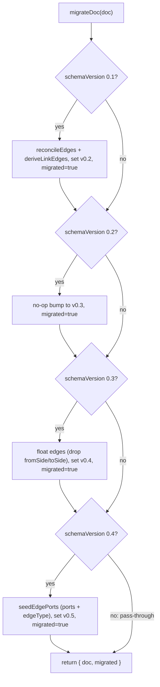

# migrate

- Owns the canonical schema-version upgrade ladder for `FlowcanvasDoc` (`0.1 → 0.2 → 0.3 → 0.4 → 0.5`); returns `{ doc, migrated }` indicating whether the doc was changed. Exports `normalizePorts` for idempotent port seeding at load time without a version bump.
- Path: `lib/canvas/migrate.ts`; stack: TypeScript.
- Public API: `migrateDoc(doc: FlowcanvasDoc): { doc: FlowcanvasDoc; migrated: boolean }`; `normalizePorts(doc: FlowcanvasDoc): FlowcanvasDoc`.
- Generated at depth by `flowcode:module-explorer-agent`; meets § Module Doc Completeness Bar — real signatures, a usage example, config/env, traced deps, conventions.
- Status active; generated by merged; last updated 2026-06-30.

---

## Purpose

`migrate` is the single, pure extraction point for the schema-version upgrade ladder. The `0.1 → 0.2` step bakes the previously-live-only derived `links:` edges into the persisted edge set (via `reconcileEdges(doc.edges, deriveLinkEdges(doc.nodes))`); the `0.2 → 0.3` step is a pure version-string bump with no data change; the `0.3 → 0.4` step (005-edges) **floats every existing edge** — it strips the auto-assigned `fromSide`/`toSide` handle sides so the edge re-routes from the node center, dropping the reading noise the pinned handles caused (additive style fields `routing`/`line`/`labelT`/`points` default in the renderer, so no write is needed for them). The `0.4 → 0.5` step (006-semantic-edges) **seeds `ConnectionPort` records** for every edge endpoint via `seedEdgePorts`: if an edge carries a pinned `fromSide`/`toSide`, a midpoint port (`t = 0.5`) is placed on that side; otherwise `autoPort` computes the geometrically nearest perimeter face toward the other node. It also maps legacy `meta.rel → meta.edgeType` (via `REL_TO_EDGE_TYPE`, defaulting to `'reference'`). A `0.5` doc passes through unchanged and returns the **original reference** (not a copy) with `migrated: false`.

`normalizePorts` (006-semantic-edges) is a companion export for load-time use: it runs the same `seedEdgePorts` logic on any `0.5` doc but does **not** bump `schemaVersion` or set `edgeType`. It is idempotent — when every edge endpoint already resolves to a port the same doc reference is returned unchanged. It is wired into `store.load` in Phase 2 to cover hand-drawn or agent-authored edges created after migration (i.e. edges that arrive without a migration pass).

The module was extracted from the inline migration in `store.load` (plan 004 Phase 1) so that both `store.load` and the upcoming `importDoc` action (Phase 5) share one ladder and guarantee that every path accepting a `.canvas` file migrates identically. The module is intentionally pure — no fs, no DOM, no side effects. The caller must hydrate node frontmatter via `hydrateFiles` before calling `migrateDoc`, since `deriveLinkEdges` reads `meta.frontmatter.links`.

### Internal Architecture



---

## Public API

Concrete signatures only. No prose.

### Functions / Methods

```typescript
// lib/canvas/migrate.ts:71
export function migrateDoc(doc: FlowcanvasDoc): { doc: FlowcanvasDoc; migrated: boolean }

// lib/canvas/migrate.ts:116  [006-semantic-edges]
export function normalizePorts(doc: FlowcanvasDoc): FlowcanvasDoc
```

`migrateDoc`: The return `doc` is the upgraded document — immutably reconstructed at each step that fires, or the same object reference if already at `0.5`. `migrated` is `true` whenever any version bump occurred, including the semantically no-op `0.2 → 0.3` bump, the `0.3 → 0.4` edge-float step, and the `0.4 → 0.5` port-seed step.

`normalizePorts` (006-semantic-edges): Idempotent; seeds ports without bumping `schemaVersion` or setting `edgeType`. Returns the same doc reference when nothing changed — callers can use identity comparison as a change guard.

### Classes

Not applicable.

### HTTP Routes

Not applicable.

### Events / Messages

Not applicable.

### Exceptions / Errors

None — the function is pure and does not throw. All inputs are structurally typed by `FlowcanvasDoc` (`lib/canvas/jsoncanvas.ts`).

---

## Usage Examples

```typescript
// lib/canvas/migrate.test.ts:25-35 — 0.1 → 0.5 full ladder (real test)
import { migrateDoc } from './migrate'
import type { CanvasNode, FlowcanvasDoc } from './jsoncanvas'

const nodes: CanvasNode[] = [
  {
    id: 'a', type: 'file', file: 'examples/a.md', x: 0, y: 0, width: 100, height: 100,
    meta: { origin: 'user', frontmatter: { links: ['examples/b.md'] } },
  },
  {
    id: 'b', type: 'file', file: 'examples/b.md', x: 0, y: 0, width: 100, height: 100,
    meta: { origin: 'user', frontmatter: {} },
  },
]
const doc: FlowcanvasDoc = {
  nodes,
  edges: [],
  flowcanvas: {
    schemaVersion: '0.1',
    session: { createdAt: '2026-01-01', updatedAt: '2026-01-01', revision: 0 },
    comments: [],
  },
}

const { doc: upgraded, migrated } = migrateDoc(doc)
// migrated                          => true
// upgraded.flowcanvas.schemaVersion => '0.5'
// upgraded.edges[0]                 => { id: 'lk:a->b', fromNode: 'a', toNode: 'b', meta: { origin: 'links' } }
```

Demonstrates the full `0.1 → 0.5` ladder: bakes derived edge `lk:a->b` from node `a`'s `links: [examples/b.md]`, bumps through `0.2 → 0.3`, floats edges on `0.3 → 0.4`, then seeds ports on `0.4 → 0.5`. Real test at `lib/canvas/migrate.test.ts:25`. The `0.3 → 0.4` edge-float is pinned at `lib/canvas/migrate.test.ts:44-56`. Idempotence (a `0.5` doc returns the same reference, `migrated: false`) is pinned at `lib/canvas/migrate.test.ts:80-85`.

```typescript
// lib/canvas/migrate.test.ts:58-78 — 0.4 → 0.5: port seeding + rel → edgeType (real test) [006-semantic-edges]
import { migrateDoc } from './migrate'
import type { CanvasEdge, CanvasNode, FlowcanvasDoc } from './jsoncanvas'

const nodes: CanvasNode[] = [
  { id: 'a', type: 'file', file: 'a.md', x: 0,   y: 0, width: 100, height: 60, meta: { origin: 'user' } },
  { id: 'b', type: 'file', file: 'b.md', x: 300, y: 0, width: 100, height: 60, meta: { origin: 'user' } },
]
const edges: CanvasEdge[] = [
  { id: 'e1', fromNode: 'a', toNode: 'b', toEnd: 'arrow', meta: { origin: 'user', rel: 'calls' } },
]
const { doc, migrated } = migrateDoc({ nodes, edges, flowcanvas: { schemaVersion: '0.4', ... } })
// migrated                           => true
// doc.flowcanvas.schemaVersion       => '0.5'
// doc.nodes[0].meta.ports[0]         => { side: 'right', t: 0.5 }  (autoPort: a→b faces right)
// doc.nodes[1].meta.ports[0]         => { side: 'left',  t: 0.5 }  (autoPort: b→a faces left)
// doc.edges[0].fromPort              => doc.nodes[0].meta.ports[0].id
// doc.edges[0].meta.edgeType         => 'request'                   (REL_TO_EDGE_TYPE['calls'])
```

Demonstrates the `0.4 → 0.5` step: geometric `autoPort` places right/left midpoint ports on the two nodes; the floating edge is wired to those ports; `rel: 'calls'` maps to `edgeType: 'request'` via `REL_TO_EDGE_TYPE`. Real test at `lib/canvas/migrate.test.ts:58`.

```typescript
// lib/canvas/migrate.test.ts:88-114 — normalizePorts idempotence + pinned-side override (real test) [006-semantic-edges]
import { normalizePorts } from './migrate'

// First call seeds missing ports; second call detects all ports already present → returns same reference.
const once  = normalizePorts(docAt('0.5', nodes, edges))
const twice = normalizePorts(once)
expect(twice).toBe(once)   // identity equality — nothing changed

// Pinned-side sugar: fromSide: 'bottom' wins over geometric autoPort (which would pick 'right').
const edgesWithPin: CanvasEdge[] = [{ id: 'e1', fromNode: 'a', toNode: 'b', fromSide: 'bottom', meta: { origin: 'user' } }]
const out = normalizePorts(docAt('0.5', nodes, edgesWithPin))
// out.nodes[0].meta.ports[fromPort].side => 'bottom'   (pinned branch in seedSideT)
// out.nodes[1].meta.ports[toPort].side   => 'left'     (geometric autoPort for target)
```

Demonstrates `normalizePorts` idempotence and the `fromSide` pinned-side override. Real tests at `lib/canvas/migrate.test.ts:88` and `100`.

---

## Database Schema

Not applicable.

---

## Dependencies

**Upstream modules:**
- `edges` (`lib/canvas/edges.ts`) — `deriveLinkEdges` builds the derived `links:` edge set from file-node `meta.frontmatter.links`; `reconcileEdges` merges that set with existing user/agent edges and drops stale `links` edges. Imported at `lib/canvas/migrate.ts:4`.
- `schema` (`lib/canvas/jsoncanvas.ts`) — types `CanvasEdge`, `CanvasNode`, `ConnectionPort`, `FlowcanvasDoc`, `Side` (type-only); value `REL_TO_EDGE_TYPE` (maps `RelationshipType → EdgeType` for the `0.4 → 0.5` step). Imported at `lib/canvas/migrate.ts:2-3`.
- `ports` (`lib/canvas/ports.ts`) — `autoPort(node, otherNode)` returns `{ side, t }` for the geometrically nearest perimeter face. Used by `seedSideT` when no `pinnedSide` is supplied. Imported at `lib/canvas/migrate.ts:5`. [006-semantic-edges]

**External services:** None.

**Key libraries:**
- `uuid` (`uuid` npm) — `v4 as uuid` mints `'p-<uuid8>'` port ids in `ensurePort`. Imported at `lib/canvas/migrate.ts:6`. [006-semantic-edges]

---

## Configuration & Environment

Not applicable — pure TypeScript module; reads no environment variables and no config keys.

---

## Run / Test / Lint

| Action | Command |
|--------|---------|
| Test (unit) | `npx vitest run lib/canvas/migrate.test.ts` |
| Typecheck | `npx tsc --noEmit` |
| Lint | `npm run lint` |

---

## Key Insights

**Conventions & patterns:** Follows the `lib/canvas/*` pure-module convention (no DOM, no React, no `fs`) — accepts typed inputs, returns typed outputs; fully unit-testable under vitest. Uses structural spread for immutable per-step reconstruction; the input doc is never mutated (`lib/canvas/migrate.ts:75-108`). Four sequential `if`s (not `else if`) at lines 74, 79, 83, and 98 make a `0.1` doc cascade through every upgrade step in a single call: `0.1 → 0.2 → 0.3 → 0.4 → 0.5`. The `0.4 → 0.5` branch (`migrate.ts:98-108`) delegates all node/edge mutation to the private `seedEdgePorts` helper (pure; returns fresh arrays + `changed` flag), which itself delegates per-endpoint geometry to `seedSideT` → `ensurePort` / `autoPort`. [006-semantic-edges]

**Gotchas & invariants:**

- **Hydration must precede this call.** `deriveLinkEdges` reads `node.meta?.frontmatter?.links`; those fields are populated by `hydrateFiles` in `store.load` (`lib/canvas/store.ts:129`). Calling `migrateDoc` before frontmatter is hydrated silently produces an empty or wrong edge set for the `0.1 → 0.2` step — no error is thrown, the data is just wrong. The call order is `hydrateFiles` then `migrateDoc`, not the other way around.
- **`0.5` pass-through preserves the original object reference.** When the input is already `0.5`, no `if` branch fires; `next` is never reassigned and the original `doc` is returned. The test at `lib/canvas/migrate.test.ts:80-85` asserts `doc === input` (same reference, not just deep-equal) to guard against inadvertent cloning. Callers that compare by identity (e.g. memoization guards) can rely on this. `normalizePorts` applies the same contract — same-reference return when `seeded.changed` is `false` (`migrate.ts:118`).
- **The `0.3 → 0.4` step floats edges by stripping handle sides (005-edges).** It maps over `doc.edges` and, for any edge carrying `fromSide`/`toSide`, returns a clone with both deleted (`migrate.ts:88-94`); edges that already float are returned unchanged (object-identity preserved per edge). All other edge fields — `id`, `color`, `fromEnd`/`toEnd`, `label`, `meta` — survive untouched (pinned at `migrate.test.ts:44-56`).
- **The `0.4 → 0.5` step seeds `ConnectionPort` records and maps `rel → edgeType` (006-semantic-edges).** `seedEdgePorts` (`migrate.ts:27-68`) builds a `portsByNode` map (cloned from existing `meta.ports`), iterates edges, and calls `ensurePort` to reuse a matching port (within `PORT_T_TOL = 0.04` on the same side) or mint a new one. `seedSideT` (`migrate.ts:21-24`) picks the pinned side's midpoint when `fromSide`/`toSide` is set, else delegates to `autoPort`. Dangling edges (missing endpoint node) are left untouched for validate/UI to surface (`migrate.ts:39`).
- **`migrated: true` for every step, including the `0.4 → 0.5` port-seed.** A board persisted at `0.4` reports `migrated: true` after the call, so `store.load` saves a `0.5` file on first open — by design, advancing every existing board to the current schema exactly once.
- **`normalizePorts` does NOT set `edgeType` and does NOT bump `schemaVersion`.** It is strictly a port-geometry safety net for edges that arrive post-migration (hand-drawn or agent-authored). Setting `edgeType` must go through `migrateDoc` (`migrate.ts:117`).
- **Coexistence with `store.ts` inline migration.** The current `store.load` still contains an equivalent inline `0.1 → 0.2` check at `lib/canvas/store.ts:132-138`. Phase 5 replaces that block with a `migrateDoc` call; until then both implementations coexist. If either is edited, the other must be kept in sync — divergent migration behavior would cause different boards to receive different edge sets depending on load path.
- **`migrateDoc` has no production call sites yet; `normalizePorts` is wired in Phase 2.** `migrateDoc` awaits Phase 5 wiring into `store.load` and `importDoc`. `normalizePorts` is specified to be wired into `store.load` in Phase 2 of plan 006.

---

## Known Gaps

- `store.load` still has the inline `0.1 → 0.2` migration at `lib/canvas/store.ts:132-138`; Phase 5 replaces it with a `migrateDoc` call. Until then the two implementations must stay in sync.
- `migrateDoc` has no production call sites yet — awaits Phase 5 wiring into `store.load` and `importDoc`.
- `normalizePorts` is wired into `store.load` in Phase 2 (006-semantic-edges); until then it is tested but not consumed in production.
