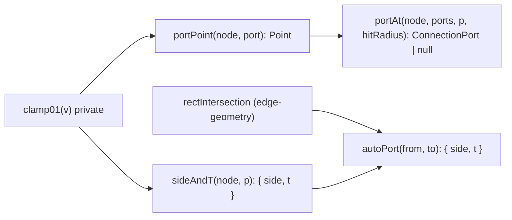

# Ports

- Pure geometric helpers that convert `ConnectionPort` structs to/from absolute canvas points on a node's bounding rectangle — the single source of truth for edge endpoints (006 Decision 1).
- Path: `lib/canvas/ports.ts`; stack: TypeScript 5 — no DOM, no React, no `@xyflow/react` runtime (type-only imports only from `./jsoncanvas`).
- Public API: `portPoint`, `sideAndT`, `portAt`, `autoPort`; consumed by `migrate.ts` (`autoPort` in `seedEdgePorts`/`normalizePorts`) and by the Phase 2 edge renderer (live node rects from `useInternalNode`).
- Generated at depth by `flowcode:module-explorer-agent`; meets its § Module Doc Completeness Bar — real signatures, a usage example, config/env, traced deps, conventions.
- Status active; generated by bootstrap; last updated 2026-06-30.

---

## Purpose

`ports.ts` owns all pure geometry that places and identifies `ConnectionPort` dots on a node perimeter. A `ConnectionPort` is a stable JSON struct (`{ id, side, t }`) that lives in `CanvasNode.meta.ports[]`; edges reference it by id via `CanvasEdge.fromPort`/`toPort`. This module provides the four helpers needed for that contract:

1. **`portPoint`** — given a port's `(side, t)`, emit the absolute canvas `Point`.
2. **`sideAndT`** — given any absolute point, return which side it is nearest to and the normalized offset `t` along that side (used when the user drops a new port on a node).
3. **`portAt`** — hit-test an existing port list for a point within `hitRadius`; returns the port to reuse or `null` to signal "create a new one".
4. **`autoPort`** — geometric default for an unpinned edge endpoint: the side and `t` where the center→center ray from `from` exits toward `to` (delegates to `sideAndT(from, rectIntersection(from, to))`).

The module is the single geometric authority (006 Decision 1); every edge endpoint anchor derives from it. `migrate.ts` seeds ports on every edge during the `0.4→0.5` migration step and in `normalizePorts` (called at load). The Phase 2 edge renderer will feed live React Flow node rects from `useInternalNode` to these helpers at draw time. The module stays on the pure `lib/canvas/*` side of the boundary — no DOM, no React — so it is fully unit-testable under the vitest gate (`lib/canvas/ports.test.ts`).

### Internal Architecture

Small but non-trivial: `autoPort` composes two helpers from different modules; `portAt` loops over `portPoint`.



---

## Public API

Concrete signatures only. No prose.

### Functions / Methods

```ts
// lib/canvas/ports.ts:11 — absolute canvas Point for a port; t clamped to 0..1 before use
// T runs start→end corner of the side: top/bottom go left→right; left/right go top→bottom.
export function portPoint(node: Rect, port: ConnectionPort): Point

// lib/canvas/ports.ts:22 — nearest {side, t} for an absolute point against a node box
// Used for drop → port placement: finds which perimeter edge the drop is closest to.
export function sideAndT(node: Rect, p: Point): { side: Side; t: number }

// lib/canvas/ports.ts:35 — nearest port within hitRadius of p (reuse), else null (create)
// Iterates ports[], computes portPoint for each, returns the closest within hitRadius or null.
export function portAt(
  node: Rect,
  ports: ConnectionPort[],
  p: Point,
  hitRadius: number,
): ConnectionPort | null

// lib/canvas/ports.ts:47 — geometric default endpoint for an unpinned edge
// Returns sideAndT(from, rectIntersection(from, to)) — where the center→center ray exits `from`.
export function autoPort(from: Rect, to: Rect): { side: Side; t: number }
```

Private helper (not exported):

```ts
// lib/canvas/ports.ts:8 — clamps any number to [0, 1]
const clamp01 = (v: number): number => Math.max(0, Math.min(1, v))
```

### Classes

Not applicable — no classes. Relevant interface definitions live in their owning modules:

```ts
// lib/canvas/jsoncanvas.ts:96-100
export interface ConnectionPort {
  id: string   // 'p-<short>' minted via uuid in migrate.ts
  side: Side   // which edge of the node box: 'top' | 'right' | 'bottom' | 'left'
  t: number    // 0..1 offset along that side (0 = start corner, 1 = end corner)
}

// lib/canvas/edge-geometry.ts:7-8
export interface Rect  { x: number; y: number; width: number; height: number }
export interface Point { x: number; y: number }
```

### HTTP Routes (if applicable)

Not applicable — pure library, no HTTP surface.

### Events / Messages (if applicable)

Not applicable — no publish/subscribe surface.

### Exceptions / Errors

None — every function is total. `clamp01` at `ports.ts:8` ensures `t` is always in `[0, 1]` before the `switch` in `portPoint`. `portAt` returns `null` (not a throw) when no port is within `hitRadius` or when the `ports` array is empty. `autoPort` delegates to `sideAndT` and `rectIntersection`, both of which are total (degenerate cases handled in `edge-geometry.ts`).

---

## Usage Examples

Derived from `lib/canvas/ports.test.ts:6-58` (all four functions exercised). The production call site for `autoPort` is `lib/canvas/migrate.ts:23` (inside `seedSideT`).

```ts
import { portPoint, sideAndT, portAt, autoPort } from './ports'
import type { Rect } from './edge-geometry'
import type { ConnectionPort } from './jsoncanvas'

// Two 100x100 nodes: A at origin, B 300px to the right
const A: Rect = { x: 0, y: 0, width: 100, height: 100 }   // center (50,50)
const B: Rect = { x: 300, y: 0, width: 100, height: 100 } // center (350,50)

// 1. portPoint — absolute canvas point for a port on A's top edge at t=0.5
portPoint(A, { id: 'p', side: 'top', t: 0.5 })   // => { x: 50, y: 0 }
portPoint(A, { id: 'p', side: 'right', t: 0.5 }) // => { x: 100, y: 50 }
portPoint(A, { id: 'p', side: 'top', t: -1 })    // => { x: 0, y: 0 }  (t clamped to 0)
portPoint(A, { id: 'p', side: 'top', t: 2 })     // => { x: 100, y: 0 } (t clamped to 1)

// 2. sideAndT — drop point near the right edge, midway down
sideAndT(A, { x: 98, y: 50 }) // => { side: 'right', t: 0.5 }
sideAndT(A, { x: 40, y: 3 })  // => { side: 'top',   t: 0.4 }

// 3. portAt — hit-test: port 'p1' is at right-mid (100,50); point (103,51) is within radius 9
const ports: ConnectionPort[] = [{ id: 'p1', side: 'right', t: 0.5 }]
portAt(A, ports, { x: 103, y: 51 }, 9)?.id   // => 'p1'   (reuse)
portAt(A, ports, { x: 120, y: 50 }, 9)        // => null   (create new port)
portAt(A, [], { x: 100, y: 50 }, 9)           // => null   (no ports yet)

// 4. autoPort — unpinned edge from A toward B exits A's right side at mid-height
autoPort(A, B) // => { side: 'right', t: 0.5 }
autoPort(B, A) // => { side: 'left',  t: 0.5 }
```

Real call site for `autoPort`: `lib/canvas/migrate.ts:23` — inside `seedSideT`, which is called by `seedEdgePorts` for every edge whose `fromPort`/`toPort` is absent. Real assertions: `lib/canvas/ports.test.ts:6-58`.

---

## Database Schema

Not applicable — this module owns no tables and performs no persistence. `ConnectionPort` structs persist inside `CanvasNode.meta.ports[]` in the `.canvas` JSON file, but that schema is owned by `lib/canvas/jsoncanvas.ts`.

---

## Dependencies

**Upstream modules:**
- `lib/canvas/jsoncanvas.ts` — type-only import of `ConnectionPort` and `Side` (`ports.ts:5`). No runtime value is taken from `jsoncanvas`.
- `lib/canvas/edge-geometry.ts` — runtime import of `rectIntersection` used by `autoPort` (`ports.ts:6`); type-only imports of `Point` and `Rect`.

**External services:**
- None.

**Key libraries:**
- None — pure TypeScript arithmetic (`Math.abs`, `Math.max`, `Math.min`, `Math.hypot`). No npm packages required.

---

## Configuration & Environment

Not applicable — this module reads no environment variables and no config keys. It is fully parameterised by its function arguments.

---

## Run / Test / Lint

Commands scoped to this module. Cross-reference full project gates in `.flowcode/quality-checks/quality-checks-index.md`.

| Action | Command |
|--------|---------|
| Test (unit) | `npx vitest run lib/canvas/ports.test.ts` |
| Test (all canvas) | `npx vitest run lib/canvas/` |
| Typecheck | `npx tsc --noEmit` |
| Lint | `npm run lint` |

---

## Key Insights

**Conventions & patterns:** Follows the `lib/canvas/*` pure-module convention strictly — the only import from `./jsoncanvas` is `type`-only (`ConnectionPort`, `Side`), so no runtime symbol is pulled in from the schema barrel. `Rect` and `Point` are type-imported from `./edge-geometry` (not `./jsoncanvas`), keeping the module on the same geometry layer as its sibling. The private `clamp01` helper is intentionally not exported; it is an implementation detail of port normalization and not part of the public surface. The exhaustive `switch (port.side)` in `portPoint` (`ports.ts:13-18`) means the TypeScript compiler will flag a missing branch if a new `Side` value is ever added to `jsoncanvas.ts`.

**Gotchas & invariants:**

- **`t` direction convention.** For `left`/`right` sides, `t=0` is the **top** corner and `t=1` is the **bottom** corner. For `top`/`bottom` sides, `t=0` is the **left** corner and `t=1` is the **right** corner (`ports.ts:14-18`). This is the "start→end corner of the side" contract stated in the JSDoc. `autoPort` produces a `t` via `sideAndT`, which clamps to `[0,1]` via `clamp01` (`ports.ts:28-31`), so the returned `t` always satisfies the constraint even for points slightly outside the box.
- **`portAt` uses `<=` for the distance test** (`ports.ts:41`). A point exactly at `hitRadius` distance reuses the port (inclusive boundary). If `ports` is empty the function returns `null` immediately after the loop (`ports.ts:43`).
- **`autoPort` is NOT idempotent across node moves.** It computes a fresh geometric default each call. `migrate.ts` calls it once to seed an initial port and then pins that port by id (`fromPort`/`toPort`). If nodes subsequently move, the edge continues to use the seeded port, not a recomputed geometric default. The Phase 2 renderer is responsible for dynamically re-computing floating endpoints using live rects.
- **`sideAndT` picks the nearest edge by Euclidean distance to the four perimeter lines.** Ties are broken by the check order: `left` wins over `right` over `top`, with `bottom` as the catch-all (`ports.ts:28-31`). A point exactly equidistant from, e.g., `left` and `right` will always resolve to `left`. Corner points (equidistant from two adjacent sides) resolve deterministically — whichever of the two enclosing sides appears first in the `if` chain.
- **`migrate.ts` reuses ports within `PORT_T_TOL = 0.04`** (`migrate.ts:9`). Two edge endpoints whose computed `t` values differ by less than 0.04 on the same side share a single `ConnectionPort`. This prevents stacking near-duplicate dots when many edges converge on the same perimeter location (e.g. several edges leaving the right side near mid-height all share `t=0.5`).
- **`CanvasNode` satisfies `Rect` structurally.** `CanvasNode` carries `x`, `y`, `width`, `height` at the top level (JSONCanvas spec fields), so `migrate.ts:23` passes a `CanvasNode` directly as the `node: Rect` argument without any adapter — TypeScript accepts it because the shapes are compatible. The edge renderer will feed React Flow `InternalNode` rects (obtained via `useInternalNode`) which also carry these fields.

---

## Known Gaps

- Phase 2 (edge renderer) is not yet implemented; the live-rect path through these helpers (`portPoint` fed by `useInternalNode`) is constructed but not yet wired in `labeled-edge.tsx`. Until Phase 2 lands, `portPoint` and `portAt` are exercised only by the unit tests and `migrate.ts`. No `BL-NNN` assigned.
- No test covers the exact tie-breaking behavior of `sideAndT` for corner points or equidistant walls. The current behavior is deterministic (order-of-evaluation), but the contract is undocumented. No `BL-NNN` assigned.
