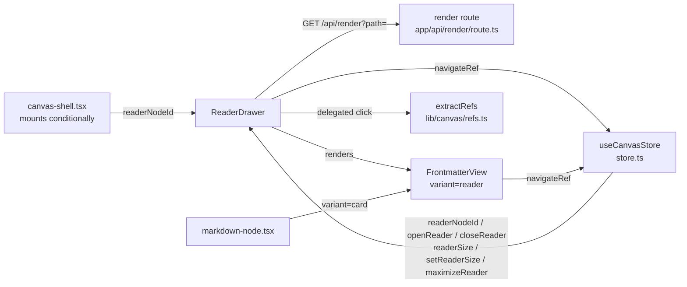

# Reader

- Owns two React components: `ReaderDrawer` (full-fidelity shiki-rendered markdown drawer) and `FrontmatterView` (shared status-pill / tag-chip / link-chip bar used by both the node card and the drawer). No other component owns these files.
- Path: `components/canvas/reader-drawer.tsx` + `components/canvas/frontmatter-view.tsx`; styles in `app/styles/reader.css` + `app/styles/frontmatter.css`; stack: TypeScript 5 / React 19.
- Public API: `ReaderDrawer({ nodeId, onClose })`, `FrontmatterView({ frontmatter, variant, className?, sourceNodeId? })`, `statusClass(value): string`, `basename(p): string`.
- Generated at depth by `flowcode:module-explorer-agent` (full mode); meets § Module Doc Completeness Bar.
- Status active; generated by bootstrap; last updated 2026-06-29.

---

## Purpose

The reader module owns the right-side glass drawer that opens a markdown node in full-fidelity — syntax-highlighted HTML produced by the server `GET /api/render` pipeline — and the shared frontmatter presentation bar that appears both inside node cards and at the top of the drawer. `ReaderDrawer` fetches the rendered HTML for the opened node, shows the node's `FrontmatterView` as a sticky header, and intercepts prose anchor clicks to trigger `navigateRef` for relative `.md`/asset targets instead of navigating away. `FrontmatterView` is a pure-presentation component (reads only `useCanvasStore.navigateRef`) that renders a semantic status pill, violet tag chips, and `↗` link chips; when `sourceNodeId` is supplied the link chips become buttons that call `navigateRef(sourceNodeId, ref)`. Both components are `'use client'` components mounted on the canvas screen. Outside dependants: `canvas-shell.tsx` mounts `<ReaderDrawer>` conditioned on `readerNodeId`; `markdown-node.tsx` uses `<FrontmatterView variant="card" sourceNodeId={node.id}>` and re-exports `basename`.

### Internal Architecture



---

## Public API

Concrete signatures only. No prose.

### Functions / Methods

```tsx
// components/canvas/reader-drawer.tsx:23
export function ReaderDrawer({ nodeId, onClose }: ReaderDrawerProps): JSX.Element

// components/canvas/frontmatter-view.tsx:67
export function FrontmatterView({
  frontmatter,
  variant,
  className,
  sourceNodeId,
}: FrontmatterViewProps): JSX.Element | null

// components/canvas/frontmatter-view.tsx:27
export const basename = (p: string) => string        // last path segment; re-exported by markdown-node

// components/canvas/frontmatter-view.tsx:30
export function statusClass(value: string): string   // '' | 'fc-pill--ok' | 'fc-pill--act' | 'fc-pill--warn'
```

### Classes

Not applicable — no class-based components in this module.

### Component Props

```tsx
// components/canvas/reader-drawer.tsx:18-21
interface ReaderDrawerProps {
  nodeId: string    // id of the canvas node to open (must be a FileNode)
  onClose: () => void
}

// components/canvas/frontmatter-view.tsx:59-65
interface FrontmatterViewProps {
  frontmatter: Record<string, unknown>
  variant?: 'card' | 'reader'  // default 'card'
  className?: string
  /** When set, ↗ link chips become clickable buttons calling navigateRef(sourceNodeId, ref). */
  sourceNodeId?: string
}
```

### Internal Helpers (module-private)

```tsx
// components/canvas/frontmatter-view.tsx:8-13
function frontmatterRef(link: string): DocRef
// Constructs a DocRef from a frontmatter links: entry (root-relative by convention).

// components/canvas/frontmatter-view.tsx:41-57
function FmValue({ value }: { value: unknown }): JSX.Element
// Renders a non-priority frontmatter field: arrays → chips (max MAX_CHIPS), objects → {…}, scalars → text.
```

### HTTP Routes

| Method | Path | Purpose | Request Shape | Response Shape |
|--------|------|---------|---------------|----------------|
| GET | `/api/render?path=<encoded-path>` | Render a markdown file to sanitized shiki HTML | query: `path` (string) | `{ html: string }` or `{ error: string }` |

This route is consumed by `ReaderDrawer` at `reader-drawer.tsx:50`; it is owned by `app/api/render/route.ts` and `lib/render-md.ts` (cross-reference — not documented here).

### Events / Messages

Not applicable — no message bus; state transitions are synchronous store calls.

### Exceptions / Errors

| Name | Raised When | Caught By |
|------|-------------|-----------|
| Fetch network/HTTP error | `GET /api/render` returns `!res.ok` or rejects | `reader-drawer.tsx:56` catch — sets `result.error`; displayed as `fc-reader__msg--err` |

---

## Usage Examples

### Opening the reader drawer (real call site)

```tsx
// components/canvas/canvas-shell.tsx:227 (real call site)
// canvas-shell reads readerNodeId from the store and mounts ReaderDrawer when it is non-null.
const readerNodeId = useCanvasStore((s) => s.readerNodeId)
const closeReader  = useCanvasStore((s) => s.closeReader)

{readerNodeId && <ReaderDrawer nodeId={readerNodeId} onClose={closeReader} />}

// A markdown-node's "maximize" button triggers the drawer:
// components/canvas/nodes/markdown-node.tsx:31
const maximizeReader = useCanvasStore((s) => s.maximizeReader)
<button onClick={(e) => { e.stopPropagation(); maximizeReader(id) }}>⤢</button>
```

`maximizeReader(id)` sets `readerNodeId = id` and `readerSize = 'full'`; `openReader(id)` sets only `readerNodeId` (keeps current size).

### FrontmatterView card variant (real call site)

```tsx
// components/canvas/nodes/markdown-node.tsx:48 (real call site)
// sourceNodeId activates clickable ↗ link chips via navigateRef.
<FrontmatterView frontmatter={fm} variant="card" sourceNodeId={node.id} />

// Without sourceNodeId (static chips, no navigation):
<FrontmatterView frontmatter={{ status: 'active', tags: ['api', 'v2'] }} variant="card" />
// Returns null if no displayable keys exist.
```

### statusClass helper (constructed)

```tsx
import { statusClass } from '@/components/canvas/frontmatter-view'

statusClass('active')    // → 'fc-pill--act'   (neon-cyan)
statusClass('shipped')   // → 'fc-pill--ok'    (neon-lime)
statusClass('blocked')   // → 'fc-pill--warn'  (amber)
statusClass('unknown')   // → ''               (default violet)
// constructed
```

### Store test exercising openReader / closeReader

```ts
// lib/canvas/store.test.ts:180-184 (real call site)
it('openReader / closeReader toggle the reader node id', () => {
  useCanvasStore.getState().openReader('a')
  expect(useCanvasStore.getState().readerNodeId).toBe('a')
  useCanvasStore.getState().closeReader()
  expect(useCanvasStore.getState().readerNodeId).toBeNull()
})
```

---

## Database Schema

Not applicable — this module renders markdown; it owns no tables.

---

## Dependencies

**Upstream modules (store):**
- `lib/canvas/store` — reads `doc`, `readerSize`, `setReaderSize`, `navigateRef`; store state `readerNodeId`/`openReader`/`closeReader`/`maximizeReader` drives mount/unmount lifecycle (`store.ts:28-29,57-60,383-395`).

**Upstream modules (lib):**
- `lib/canvas/jsoncanvas` — `isFileNode` type guard used at `reader-drawer.tsx:29` to discriminate `FileNode` from the node union.
- `lib/canvas/refs` — `extractRefs` used at `reader-drawer.tsx:68` to synthesize a `DocRef` from a clicked prose link href; `DocRef` type imported at `frontmatter-view.tsx:5`.
- `lib/utils` — `cn()` class composition utility used throughout both components.

**External services:**
- `GET /api/render?path=` — the render route handler (`app/api/render/route.ts` → `lib/render-md.ts`); fetched at `reader-drawer.tsx:50`; returns `{ html: string }` with syntax-highlighted, sanitized HTML.

**Key libraries:**
- `react` — `useCallback`, `useEffect`, `useState`, `Fragment`, `type MouseEvent` (`reader-drawer.tsx:2`, `frontmatter-view.tsx:2`).
- `@xyflow/react` — not imported directly; the drawer is mounted inside the React Flow provider tree in `canvas-shell.tsx` but accesses store, not RF hooks.
- `tailwindcss` v4 + CSS custom properties — all visual tokens consumed via `var(--color-*)` in `reader.css` / `frontmatter.css`.

---

## Configuration & Environment

Not applicable — this module reads no environment variables and no config keys. Reader size preference (`readerSize`) is transient Zustand state, never persisted.

---

## Run / Test / Lint

Commands scoped to this module. Cross-reference full project gates in `.flowcode/quality-checks/quality-checks-index.md`.

| Action | Command |
|--------|---------|
| Typecheck | `npx tsc --noEmit` |
| Lint | `npm run lint` |
| Build | `npm run build` |
| Unit (store reader actions) | `npx vitest run lib/canvas/store.test.ts` |
| Integration (render smoke) | `npm run smoke:render` (requires running app + Chrome) |

No dedicated unit test file exists for `reader-drawer.tsx` or `frontmatter-view.tsx`; the reader store actions (`openReader`/`closeReader`) are covered by `lib/canvas/store.test.ts:180-184`.

---

## Key Insights

**Conventions & patterns:**

- **Delegated prose click handler (Decision 9):** `ReaderDrawer` attaches a single `onClick` on the `.fc-reader__prose` wrapper rather than transforming the server-rendered HTML (`reader-drawer.tsx:62-70`). The handler walks up via `.closest('a[href]')`, passes the href to `extractRefs(file, undefined, \`[l](\${href})\`)`, and calls `navigateRef(nodeId, ref)` — external `http(s):` schemes and `#` in-doc anchors are allowed to fall through to default browser behavior.
- **Stale-result guard:** the `result` state is keyed by `forFile` (`reader-drawer.tsx:36-37`). Switching nodes before the fetch completes shows "Rendering…" rather than the old content because `result.forFile !== file` until the new fetch lands; the `live = false` cleanup flag aborts inflight state updates (`reader-drawer.tsx:49,57`).
- **`FrontmatterView` returns `null` when empty:** if `keys.length === 0` after filtering `SKIP` + empty values, the component returns `null` — safe to render unconditionally from both `MarkdownNode` and `ReaderDrawer` (`frontmatter-view.tsx:76-77`).
- **Priority key ordering:** `status` → `tags` → `links` are always displayed first (constant `PRIORITY` at `frontmatter-view.tsx:23`); `name` is skipped because it is already the card/drawer title (`SKIP` set at line 24). Everything else falls into the mono key/value `<dl>` grid.
- **Variant CSS split:** `variant="card"` maps to `fc-fm--card` (bordered, compact, inside node); `variant="reader"` maps to `fc-fm--reader` (sticky, `top:0`, roomier padding, opaque `var(--color-surface-low)` background) — `frontmatter.css:10-25`. The inner composition is identical so both variants stay pixel-consistent.
- **`fc-link-chip--btn` class is defined in the component but absent from `frontmatter.css`:** the `<button>` element for clickable link chips adds `fc-link-chip fc-link-chip--btn` (`frontmatter-view.tsx:115`) but `frontmatter.css` only defines `.fc-link-chip` (line 78) and `.fc-link-chip__arrow` (line 90). The `--btn` modifier has no dedicated CSS rule; button reset must come from a global or Tailwind base reset.

**Gotchas & invariants:**

- **`ReaderDrawer` requires a `FileNode`:** if `nodeId` resolves to a non-file node (e.g. `NoteNode`, `GroupNode`, `LinkChipNode`), `isFileNode` returns false, `file` is `null`, and the component renders the "This node has no readable markdown." message. It does not crash (`reader-drawer.tsx:29`).
- **`maximizeReader` always forces `readerSize = 'full'`:** calling it from the node's ⤢ button bypasses the current `readerSize` setting. Use `openReader` if you want to preserve the user's last chosen size (`store.ts:383,394`).
- **`navigateRef` is async; errors are not surfaced in UI:** the prose-click handler calls `void navigateRef(...)` — any rejection (e.g. `addFileNode` API error) is swallowed silently (`reader-drawer.tsx:69`). The same pattern is used in `frontmatter-view.tsx:118`.
- **`MAX_CHIPS = 8`:** both `tags` and `links` arrays are capped at 8 visible items; overflow is shown as `+N`. This constant is module-private (`frontmatter-view.tsx:25`).
- **`BODY_CAP` is enforced server-side, not here:** the drawer renders whatever HTML the `/api/render` endpoint returns; truncation logic lives in `lib/canvas/frontmatter.ts` + `lib/render-md.ts`, not in this module.
- **Esc key closes the reader:** `ReaderDrawer` binds `keydown` on `window` for `Escape` (`reader-drawer.tsx:40-44`). If multiple drawers were ever mounted simultaneously they would each close on Esc — currently only one reader can be open (guarded by the single `readerNodeId` store field).
- **Drawer shell CSS lives in `toolbar.css`, not `reader.css`:** the shared glass drawer shell (`.fc-reader` position/width/background/border/z-index) is defined in `app/styles/toolbar.css:235-249` alongside `.fc-agent`. `reader.css` owns only the width overrides (`[data-size]` selectors) and prose typography. This split is historically derived from `.fc-agent` and `.fc-reader` sharing a common shell class.

---

## Known Gaps

- `fc-link-chip--btn` CSS modifier has no dedicated rule in `frontmatter.css` — the button appearance relies entirely on `.fc-link-chip` base styles + browser/Tailwind button reset. A dedicated hover/focus-visible rule for the interactive variant would improve accessibility. Not tracked in backlog.
- No dedicated vitest for `ReaderDrawer` or `FrontmatterView` render behavior (props → HTML shape). Covered only by the smoke render (`npm run smoke:render`) and the store unit for `openReader`/`closeReader`. — Not detected in backlog.
