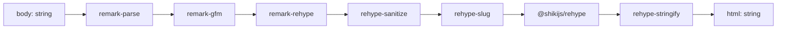

# render-md

- Server-only unified pipeline that converts a stripped markdown body to sanitized, syntax-highlighted HTML. The sole consumer is `GET /api/render`, which the reader drawer calls; no other surface uses it.
- Path: `lib/render-md.ts`; stack: TypeScript 5, server-only (Node runtime — no DOM, no React).
- Public API: one function — `renderMarkdown(body: string): Promise<string>`.
- Generated at depth by `flowcode:module-explorer-agent`; meets its § Module Doc Completeness Bar — real signatures, a usage example, config/env, traced deps, conventions.
- Status active; generated by bootstrap; last updated 2026-06-29.

---

## Purpose

`render-md.ts` owns the full-fidelity markdown rendering path for the reader drawer. It builds a singleton `unified` processor at module load — `remark-parse` → `remark-gfm` → `remark-rehype` → `rehype-sanitize` → `rehype-slug` → `@shikijs/rehype` (WASM shiki, `github-dark-default` theme) → `rehype-stringify` — and exposes a single async function that feeds a body string through that processor and returns an HTML string. It is deliberately isolated from the per-node path: node card bodies render with the lightweight client `react-markdown` in `canvas-markdown.tsx` (no shiki, no server call); this heavier pipeline runs only when a user opens the reader drawer, so the shiki WASM cost is amortized across the session. Downstream: `app/api/render/route.ts` is the sole caller; `components/canvas/reader-drawer.tsx` fetches that route and injects the result via `dangerouslySetInnerHTML`.

### Internal Architecture

Plugin order is load-bearing — see Key Insights.



---

## Public API

Concrete signatures only. No prose.

### Functions / Methods

```ts
// lib/render-md.ts:27
export async function renderMarkdown(body: string): Promise<string>
// Render a markdown body (frontmatter already stripped) to sanitized,
// slug-annotated, syntax-highlighted HTML. Returns the full HTML string.
```

### Classes

Not applicable — no classes exported.

### HTTP Routes (if applicable)

Not applicable — this module exports a pure function; HTTP routing lives in `app/api/render/route.ts`.

### Events / Messages (if applicable)

Not applicable.

### Exceptions / Errors

| Name | Raised When | Caught By |
|------|-------------|-----------|
| `unified` pipeline errors | Malformed hast/mdast (rare — unified is lenient) | `app/api/render/route.ts` catch block → 500 response |

---

## Usage Examples

Real call site at `app/api/render/route.ts:14-17`:

```ts
// app/api/render/route.ts — the only production caller
import { parseFile } from '@/lib/canvas/frontmatter'
import { renderMarkdown } from '@/lib/render-md'

const raw = await readFile(guardPath(rel), 'utf8')
const { body } = parseFile(raw)          // strip YAML frontmatter first
const html = await renderMarkdown(body)  // body-only → sanitized shiki HTML
return NextResponse.json({ html })
```

Demonstrates: caller strips frontmatter before passing the body; `renderMarkdown` returns a plain HTML string that the route wraps in a JSON envelope. Real call site: `app/api/render/route.ts:17`.

---

## Database Schema

Not applicable — this module owns no tables and performs no persistence.

---

## Dependencies

**Upstream modules:**
- None — `render-md.ts` is a pure utility; it imports only npm packages.

**External services:**
- None — shiki runs as WASM in-process; no network calls.

**Key libraries:**

| Library | Version | Role |
|---------|---------|------|
| `unified` | ^11.0.5 | Processor pipeline host |
| `remark-parse` | ^11.0.0 | Markdown string → mdast (Markdown AST) |
| `remark-gfm` | ^4.0.1 | GFM extensions (tables, strikethrough, task lists) |
| `remark-rehype` | ^11.1.2 | mdast → hast (Hypertext AST); raw HTML dropped (no `allowDangerousHtml`) |
| `rehype-sanitize` | ^6.0.0 | Strip unsafe HTML from hast; runs before slug and shiki so `language-*` on `<code>` survives |
| `rehype-slug` | ^6.0.0 | Adds `id` attributes to heading elements equal to their `slugify()` slug; runs after sanitize, before shiki (004 — three-way slug parity with `meta.source.anchor`) |
| `@shikijs/rehype` | ^4.3.0 | WASM-backed syntax highlighting — tokenizes after sanitize and slug so its inline `<span>`s are trusted output |
| `shiki` | ^4.3.0 | Shiki core (grammars + WASM runtime) |
| `rehype-stringify` | ^10.0.1 | hast → final HTML string |

---

## Configuration & Environment

### Environment Variables

Not applicable — `render-md.ts` reads no environment variables.

### Config Keys

| Key | Source | Type | Purpose |
|-----|--------|------|---------|
| `theme` | Hardcoded at `lib/render-md.ts:23` | `string` | Shiki color theme; currently `'github-dark-default'` |

The theme is not externally configurable — it is a literal argument in the `rehypeShiki` plugin call. Changing it requires editing `lib/render-md.ts:23`.

---

## Run / Test / Lint

| Action | Command |
|--------|---------|
| Typecheck | `npx tsc --noEmit` |
| Lint | `npm run lint` |
| Build | `npm run build` |
| Test (unit) | No dedicated test — `renderMarkdown` is not covered by vitest at plan-002 close; the render route is exercised by the headless-Chrome smoke (`npm run smoke:render`) |
| Test (integration) | `npm run smoke:render` (requires running app + Chrome) |

Cross-reference full project gates in `.flowcode/quality-checks/quality-checks-index.md`.

---

## Key Insights

**Conventions & patterns:**

- **Singleton processor.** The `unified` processor is built once at module load (`lib/render-md.ts:17-24`) as a module-level `const processor`. It is NOT rebuilt per request. This means plugin initialization and WASM loading happen once; subsequent `processor.process(body)` calls reuse the compiled pipeline. Do not move the processor inside `renderMarkdown` — doing so would rebuild and reload WASM on every reader open.
- **Caller strips frontmatter first.** `renderMarkdown` only accepts the markdown body with YAML frontmatter already removed. The route handler (`app/api/render/route.ts:15-16`) is responsible for calling `parseFile(raw)` and passing `body` to this function. Passing raw file content including frontmatter would render the YAML as a fenced block.
- **Plugin ordering is load-bearing — three constraints in one sequence.** (1) `rehype-sanitize` must run before `rehype-slug` and `@shikijs/rehype`: it strips unsafe HTML and preserves `language-*` on `<code>` for Shiki, but would also strip Shiki's inline `style=""` and slug `id=""` attributes if run after. (2) `rehype-slug` runs after sanitize so it adds `id` attributes that sanitize would otherwise remove. (3) `@shikijs/rehype` runs last so its trusted inline-styled `<span>`s are never touched by sanitize. See `lib/render-md.ts:20-23`.
- **Three-way slug parity (004, design Q2).** `rehype-slug` stamps each heading with `id = slugify(headingText)`. This matches the slug computed by `generation-kit.ts`'s `SLUG_RULE` instruction (github-slugger convention) and the `meta.source.anchor` stored on `NodeMeta.source`. All three surfaces — rendered HTML heading `id`, agent contract anchor rule, and canvas `NodeMeta.source.anchor` — now use the same slug algorithm, enabling bidirectional heading-to-node deep-linking. See `lib/render-md.ts:22`.

**Gotchas & invariants:**

- **WASM shiki migration rationale.** Legacy `rehype-shiki@0.1` uses native Node bindings that fail to compile on Node 26. `@shikijs/rehype` ^4 ships a pure-WASM Shiki and compiles cleanly on any modern Node version. Do not revert to `rehype-shiki@0.1` — it is broken on the project's target runtime. This change landed in plan 001 Phase 1 (2026-06-26).
- **Heavy path, intentionally rare.** This pipeline (WASM shiki, full hast traversal) is the expensive markdown path. It runs ONLY when a user opens the reader drawer, not per node card. Node bodies use `react-markdown` + `remark-gfm` in `components/canvas/canvas-markdown.tsx` — a client-side, no-shiki path. Blurring this boundary (e.g. calling `renderMarkdown` from a per-node endpoint) would serialize shiki WASM work across every visible node on board load.
- **No `allowDangerousHtml` in `remark-rehype`.** Raw HTML inside markdown source is silently dropped by `remark-rehype` (default). `rehype-sanitize` adds a second layer. The result is always safe to inject via `dangerouslySetInnerHTML` in the reader drawer — shiki `<span>` output is generated server-side by trusted code, not from user markdown.
- **Theme is dark-only.** The hardcoded `'github-dark-default'` theme matches the app's dark-only design language (`<html class="dark">`). If light mode support is added, the theme must be made conditional.
- **No tests in the vitest suite.** `renderMarkdown` is not unit-tested as of plan-002 close; coverage comes only from the headless-Chrome smoke (`npm run smoke:render`). If the pipeline is changed (e.g. theme, plugin order, or a new plugin), manually verify the smoke passes.

---

## Known Gaps

- No vitest unit test for `renderMarkdown` — a fast test with a fixture body string would catch pipeline ordering regressions without needing a running app. Not tracked in backlog yet.
- Shiki theme is hardcoded; dark-mode assumption is implicit — if light mode is ever added this requires a dual-theme or dynamic-theme configuration change.
