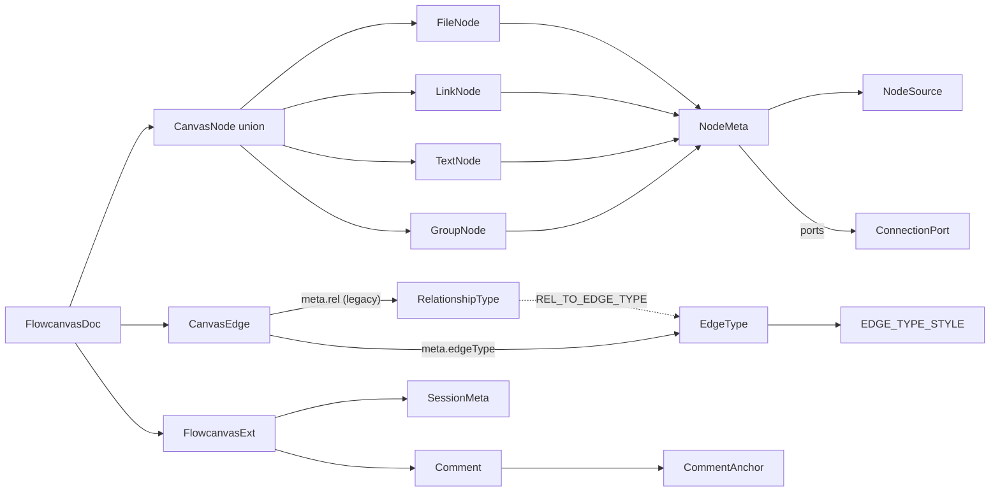

# Schema

- Dependency root for the entire canvas: owns every TypeScript type, interface, union, and runtime constant for the extended-JSONCanvas 0.4 format; every other `lib/canvas/*` module, all UI components, and the MCP sidecar import from here — nothing is imported into it.
- Path: `lib/canvas/jsoncanvas.ts`; stack: TypeScript 5 — pure types, zero runtime imports.
- Public API: `CanvasNode` union + 4 concrete node interfaces, `CanvasEdge`, `FlowcanvasDoc`, `Comment`, `SessionMeta`; `nodeKind()` discriminator; `isFileNode()` type guard; `ComponentKind` union + `COMPONENT_KINDS` + `ComponentKindMeta` + `COMPONENT_KIND_META`; `RELATIONSHIP_TYPES`, `REL_LABELS`, `EDGE_ORIGINS`, `SCHEMA_VERSIONS` constants; 005-edges `EdgeEnd`/`EDGE_ENDS`, `EdgeRouting`/`EDGE_ROUTINGS`, `EdgeLineStyle`/`EDGE_LINE_STYLES`; 006-semantic-edges `ConnectionPort`, `EdgeType`/`EDGE_TYPES`/`EdgeTypeStyle`/`EDGE_TYPE_STYLE`, `REL_TO_EDGE_TYPE`; `NodeMeta.ports`, `CanvasEdge.fromPort`/`toPort`/`meta.edgeType`.
- Generated at depth by `flowcode:module-explorer-agent` (merge-mode if it exists); meets its § Module Doc Completeness Bar — real signatures, a usage example, config/env, traced deps, conventions.
- Status active; generated by bootstrap; last updated 2026-06-30 (merged: 006-semantic-edges Phase 1).

---

## Purpose

This module is the single source of truth for every shared data structure in Flowcanvas. It defines the extended-JSONCanvas 0.2 wire format: the `CanvasNode` tagged union (`FileNode | LinkNode | TextNode | GroupNode`) sharing a non-exported `NodeBase`; `CanvasEdge` (with `meta.rel` for typed relationships); `FlowcanvasDoc` (the in-memory and on-disk document root); `Comment` + `CommentAnchor` (canvas annotation threads); `SessionMeta` (revision + change-review state + brief scope); and the v2 catalog constants (`RELATIONSHIP_TYPES`, `REL_LABELS`, `EDGE_ORIGINS`, `SCHEMA_VERSIONS`). The only two runtime exports are `nodeKind()` (maps a `CanvasNode` to a `NodeKind` string for the React Flow component registry) and `isFileNode()` (type guard narrowing `CanvasNode` to `FileNode`). All other exports are `type`, `interface`, or `const` value constants. Every other `lib/canvas/*` module, all canvas UI components (`components/canvas/*`), `lib/api.ts`, and `mcp/flowcanvas-mcp.ts` import from this file.

### Internal Architecture



---

## Public API

Concrete signatures only. No prose.

### Functions / Methods

```ts
// lib/canvas/jsoncanvas.ts:173
// Discriminates a CanvasNode to its rendered kind.
// 'file' type + .md/.mdx extension → 'markdown'; IMAGE_EXT set → 'image'; other 'file' → 'file'
// 'text' type → 'note'; 'link' type → 'link'; 'group' type → 'group'
export function nodeKind(n: CanvasNode): NodeKind

// lib/canvas/jsoncanvas.ts:183
// Type guard — narrows CanvasNode to FileNode; safe before accessing .file
export const isFileNode = (n: CanvasNode): n is FileNode => n.type === 'file'
```

### Classes

This file uses `interface` and `type` aliases exclusively — no classes. Key structural definitions:

```ts
// lib/canvas/jsoncanvas.ts:3-10 — primitive aliases
export type Side       = 'top' | 'right' | 'bottom' | 'left'
export type CanvasColor = string   // hex "#RRGGBB" or preset "1".."6"
export type NodeOrigin = 'user' | 'agent' | 'import'
export type NodeShape  = 'rectangle' | 'ellipse' | 'diamond'

// lib/canvas/jsoncanvas.ts:5-7 — edge marker shapes (005-edges widened from 'none'|'arrow')
export type EdgeEnd = 'none' | 'arrow' | 'arrow-open' | 'circle' | 'diamond'
export const EDGE_ENDS: readonly EdgeEnd[]   // ['none','arrow','arrow-open','circle','diamond']

// lib/canvas/jsoncanvas.ts:85-92 — edge path + line style (005-edges, default-first)
export type EdgeRouting = 'bezier' | 'smoothstep' | 'straight'
export const EDGE_ROUTINGS: readonly EdgeRouting[]   // ['smoothstep','bezier','straight'] — smoothstep default
export type EdgeLineStyle = 'solid' | 'dashed' | 'dotted'
export const EDGE_LINE_STYLES: readonly EdgeLineStyle[]   // ['solid','dashed','dotted']

// lib/canvas/jsoncanvas.ts:96–100 — connection port (006-semantic-edges, Decision 1)
// Stable id lets multiple edges share and reuse the same dot; dragging a port moves all attached edges.
export interface ConnectionPort {
  id: string        // 'p-<short>' minted via uuid
  side: Side        // which edge of the node box ('top'|'right'|'bottom'|'left')
  t: number         // 0..1 offset along that side (0 = start corner, 1 = end corner)
}

// lib/canvas/jsoncanvas.ts:104–111 — flow taxonomy (006-semantic-edges, Decision 2)
// Semantic flow type of an edge — resolves default {color, line, head} via EDGE_TYPE_STYLE.
export type EdgeType =
  | 'data-flow' | 'request' | 'response'
  | 'event' | 'dependency' | 'reference'

/** Ordered allowed set — drives the legend, the type picker, and the agent contract. */
export const EDGE_TYPES: readonly EdgeType[]   // ['data-flow','request','response','event','dependency','reference']

// lib/canvas/jsoncanvas.ts:114–120 — per-type visual defaults
// Single source of truth for the legend, picker UI, and renderer.
// Presets: '1' rose · '2' amber · '3' gold · '4' lime · '5' cyan · '6' violet.
// dependency/reference use muted hex (no preset) to indicate non-behavioral flows.
export interface EdgeTypeStyle {
  label: string
  color: CanvasColor    // preset id '1'..'6' or hex; resolved by adapter.colorVar
  line: EdgeLineStyle   // 'solid' | 'dashed' | 'dotted'
  fromEnd: EdgeEnd      // marker at the source end
  toEnd: EdgeEnd        // marker at the target end
}

export const EDGE_TYPE_STYLE: Record<EdgeType, EdgeTypeStyle>
// Concrete legend (lib/canvas/jsoncanvas.ts:124–131):
//   'data-flow'  → { label:'data flow',  color:'5',       line:'solid',  fromEnd:'none', toEnd:'arrow'       }
//   'request'    → { label:'request',    color:'2',       line:'solid',  fromEnd:'none', toEnd:'arrow-open'  }
//   'response'   → { label:'response',   color:'2',       line:'dotted', fromEnd:'none', toEnd:'arrow-open'  }
//   'event'      → { label:'event',      color:'6',       line:'solid',  fromEnd:'none', toEnd:'diamond'     }
//   'dependency' → { label:'dependency', color:'#8b93a7', line:'dashed', fromEnd:'none', toEnd:'arrow'       }
//   'reference'  → { label:'reference',  color:'#6b7280', line:'dotted', fromEnd:'none', toEnd:'circle'      }

// lib/canvas/jsoncanvas.ts:134–138 — migration map (006-semantic-edges, Decision 2)
// Maps old RelationshipType → new EdgeType so existing edges survive the 0.4→0.5 schema bump.
export const REL_TO_EDGE_TYPE: Record<RelationshipType, EdgeType>
// calls→'request' · produces→'data-flow' · 'depends-on'→'dependency' · references→'reference'
// informs→'event' · implements→'dependency' · 'derives-from'→'reference' · related→'reference'

// lib/canvas/jsoncanvas.ts:49–52 — v2 relationship catalog (Decision 7)
// 'contains' is excluded: containment = parentId group membership, not an edge
export type RelationshipType =
  | 'references' | 'depends-on' | 'implements' | 'derives-from'
  | 'calls' | 'produces' | 'informs' | 'related'

// lib/canvas/jsoncanvas.ts:54–69 — catalog constants
export const RELATIONSHIP_TYPES: readonly RelationshipType[]   // ordered, drives rel picker
export const REL_LABELS: Record<RelationshipType, string>      // default display labels

// lib/canvas/jsoncanvas.ts:15–23 — semantic system-design kind (004, Decision 1)
// DISTINCT from NodeKind (the derived render kind). See Key Insights.
export type ComponentKind =
  | 'service' | 'datastore' | 'queue' | 'actor'
  | 'external' | 'decision' | 'process' | 'boundary'

/** Ordered allowed set — drives the kind picker UI and the agent contract. */
export const COMPONENT_KINDS: readonly ComponentKind[]

// lib/canvas/jsoncanvas.ts:26–44 — per-kind render hints
export interface ComponentKindMeta {
  label: string
  glyph: string
  silhouette: 'box' | 'cylinder' | 'lane' | 'circle' | 'cloud' | 'diamond' | 'gear' | 'frame'
  accent: CanvasColor   // nyx preset id '1'..'6' → --node-accent
}
export const COMPONENT_KIND_META: Record<ComponentKind, ComponentKindMeta>

// lib/canvas/jsoncanvas.ts:80–82 — edge provenance + schema versions
export type EdgeOrigin = 'links' | 'user' | 'agent' | 'import'
export const EDGE_ORIGINS: readonly EdgeOrigin[]
export const SCHEMA_VERSIONS = ['0.1', '0.2', '0.3', '0.4', '0.5'] as const   // 006-semantic-edges += '0.5'

// lib/canvas/jsoncanvas.ts:77–80 — node provenance (v2, Decision 2)
export interface NodeSource {
  path: string      // root-relative source document
  anchor?: string   // heading slug within the source
}

// lib/canvas/jsoncanvas.ts:147–168 — node extension block (always safe to drop)
export interface NodeMeta {
  origin?: NodeOrigin
  collapsed?: boolean
  shape?: NodeShape                          // only meaningful on GroupNode
  frontmatter?: Record<string, unknown>     // CACHE ONLY — disk is source of truth
  source?: NodeSource                       // v2 (Decision 2)
  template?: string                         // v2 — originating template id (Decision 8)
  kind?: ComponentKind                      // 004 — optional, additive; absent ⇒ legacy card render
  ports?: ConnectionPort[]                  // 006 — connection dots on this node's perimeter; absent ⇒ no ports yet (legacy/never-connected node)
  align?: 'left' | 'center' | 'right'      // horizontal text/label alignment
  valign?: 'top' | 'middle' | 'bottom'     // vertical text/label alignment
  fill?: CanvasColor                        // custom background fill (text/note/shape nodes); distinct from color (foreground/stroke)
}

// lib/canvas/jsoncanvas.ts:99–106 — shared base (NOT exported)
interface NodeBase {
  id: string
  x: number; y: number        // ABSOLUTE canvas coords — even for grouped children
  width: number; height: number
  color?: CanvasColor
  parentId?: string           // id of the containing group node; absent = top-level
  meta?: NodeMeta
}

// lib/canvas/jsoncanvas.ts:108–112 — four concrete node variants
export interface FileNode  extends NodeBase { type: 'file';  file: string; subpath?: string }
export interface LinkNode  extends NodeBase { type: 'link';  url: string }
export interface TextNode  extends NodeBase { type: 'text';  text: string }
export interface GroupNode extends NodeBase { type: 'group'; label?: string; background?: string; backgroundStyle?: 'cover' | 'ratio' | 'repeat' }
export type CanvasNode = FileNode | LinkNode | TextNode | GroupNode

// lib/canvas/jsoncanvas.ts:185–202 — edge (v2: meta.rel; 005-edges: floating sides + style meta; 006: ports + edgeType)
export interface CanvasEdge {
  id: string
  fromNode: string; toNode: string
  fromSide?: Side; toSide?: Side   // 005-edges: authoring sugar — normalized into a port at load (006). PRESENT = seed a pinned-side port · ABSENT = geometric autoPort
  fromPort?: string; toPort?: string   // 006 — ConnectionPort id; geometry source of truth; the rendered endpoint anchors here
  fromEnd?: EdgeEnd; toEnd?: EdgeEnd   // marker shape per end; default toEnd:'arrow', fromEnd:'none'
  color?: CanvasColor              // 005-edges: now drives the rendered stroke (overrides the provenance default)
  label?: string
  meta?: {
    origin?: EdgeOrigin
    rel?: RelationshipType         // v2 — typed relationship (Decision 1); 006: readable one more version, superseded by edgeType
    edgeType?: EdgeType            // 006 — semantic flow type; resolves default {color,line,head} via EDGE_TYPE_STYLE
    routing?: EdgeRouting          // 005-edges — path style; absent ⇒ renderer default 'smoothstep'
    line?: EdgeLineStyle           // 005-edges — stroke dash; absent ⇒ 'solid' (derived links edge ⇒ 'dashed')
    labelT?: number                // 005-edges — 0..1 label position along the path; absent ⇒ 0.5 (midpoint)
    points?: { x: number; y: number }[]   // 005-edges — manual waypoints (absolute coords) the line bends through
  }
}

// lib/canvas/jsoncanvas.ts:126–129 — comment anchor union
export type CommentAnchor =
  | { kind: 'node';   nodeId: string; offsetX: number; offsetY: number }
  | { kind: 'canvas'; x: number; y: number }

// lib/canvas/jsoncanvas.ts:130–139 — annotation thread entry
export interface Comment {
  id: string
  anchor: CommentAnchor
  parentId: string | null   // null = root thread; string id = reply
  author: string            // "human:<name>" | "agent:<model>"
  text: string
  createdAt: string
  resolvedAt?: string | null
  badge?: number            // root-only display counter
}

// lib/canvas/jsoncanvas.ts:143–154 — session + change-review state
export interface SessionMeta {
  title?: string
  intent?: string
  createdAt: string
  updatedAt: string
  revision: number
  lastBriefId?: string
  baseRevision?: number     // v2 — revision at submit (review window start)
  pendingReview?: boolean   // v2 — agent round landed; open review on next load
  briefScope?: string[]     // v2 — node ids for scope-aware submit; absent = whole board
  coreDocPath?: string      // 004 — root-relative path of the living core-markdown spine
}

// lib/canvas/jsoncanvas.ts:236–240 — document root
export interface FlowcanvasExt {
  schemaVersion: '0.1' | '0.2' | '0.3' | '0.4' | '0.5'   // 006-semantic-edges boards persist '0.5'
  session: SessionMeta
  comments: Comment[]
}

export interface FlowcanvasDoc {
  nodes: CanvasNode[]
  edges: CanvasEdge[]
  flowcanvas: FlowcanvasExt
}

// lib/canvas/jsoncanvas.ts:170
export type NodeKind = 'markdown' | 'image' | 'file' | 'link' | 'note' | 'group'
```

### HTTP Routes (if applicable)

Not applicable — pure type module, no HTTP surface.

### Events / Messages (if applicable)

Not applicable — pure type module, no messaging surface.

### Exceptions / Errors

Not applicable — `nodeKind` and `isFileNode` do not throw. The `nodeKind` function falls through to `'file'` for any unrecognised extension rather than throwing.

---

## Usage Examples

FlowcanvasDoc construction pattern from `lib/canvas/adapter.test.ts:6-33`; `nodeKind` / `isFileNode` usage constructed from real signatures (both are called at `lib/canvas/edges.ts:2`, `lib/canvas/store.ts:4`, `lib/canvas/adapter.ts:4`).

```ts
import type { FlowcanvasDoc } from './jsoncanvas'
import { nodeKind, isFileNode, RELATIONSHIP_TYPES, REL_LABELS, EDGE_TYPE_STYLE, REL_TO_EDGE_TYPE } from './jsoncanvas'

// Construct a v0.2 FlowcanvasDoc (real pattern from adapter.test.ts:6-33)
const doc: FlowcanvasDoc = {
  nodes: [
    {
      id: 'n-design', type: 'file', file: 'docs/design.md',
      x: -480, y: -200, width: 380, height: 320, color: '5',
      meta: { origin: 'user', frontmatter: { name: 'design', status: 'approved' } },
    },
    {
      id: 'n-note', type: 'text', text: '## Open question',
      x: -480, y: 200, width: 320, height: 160, meta: { origin: 'user' },
    },
    {
      id: 'g-1', type: 'group', label: 'Subsystem',
      x: 0, y: 0, width: 600, height: 400,
      meta: { origin: 'user', shape: 'ellipse' },
    },
  ],
  edges: [
    {
      id: 'e-1', fromNode: 'n-design', toNode: 'n-note',
      toEnd: 'arrow', meta: { origin: 'user', rel: 'informs' },
    },
  ],
  flowcanvas: {
    schemaVersion: '0.2',
    session: { createdAt: '2026-06-29T10:00:00Z', updatedAt: '2026-06-29T10:00:00Z', revision: 1 },
    comments: [],
  },
}

// nodeKind() discriminator — drives React Flow node component selection  // constructed
doc.nodes.map(nodeKind)
// => ['markdown', 'note', 'group']
// n-design → 'markdown'  (.md extension on a 'file' node)
// n-note   → 'note'      ('text' type)
// g-1      → 'group'     ('group' type)

// isFileNode() type guard — narrows CanvasNode to FileNode  // constructed
const fileNodes = doc.nodes.filter(isFileNode)
// fileNodes: FileNode[] — .file property accessible without a cast
// fileNodes[0].file === 'docs/design.md'

// v2 relationship catalog constants  // constructed
console.log(RELATIONSHIP_TYPES)
// ['references','depends-on','implements','derives-from','calls','produces','informs','related']
console.log(REL_LABELS['depends-on'])  // 'depends on'

// 006-semantic-edges — look up visual defaults for a flow type  // constructed
const style = EDGE_TYPE_STYLE['data-flow']
// => { label: 'data flow', color: '5', line: 'solid', fromEnd: 'none', toEnd: 'arrow' }

// 006-semantic-edges — migrate a legacy rel to its EdgeType  // constructed
const edgeType = REL_TO_EDGE_TYPE['calls']
// => 'request'
```

FlowcanvasDoc construction: real pattern from `lib/canvas/adapter.test.ts:6-33`. `nodeKind`/`isFileNode`/catalog constant calls are constructed from the real exported signatures; identical call patterns exist at `lib/canvas/store.ts:4` and `lib/canvas/adapter.ts:4`.

---

## Database Schema

Not applicable — this module owns no tables. `FlowcanvasDoc` serialises to a `.canvas` JSON file on disk; there is no database layer.

---

## Dependencies

**Upstream modules:**
- None — `lib/canvas/jsoncanvas.ts` has zero imports. It is the dependency root of the entire `lib/canvas/*` graph.

**External services:**
- None.

**Key libraries:**
- None — the module is pure TypeScript type declarations plus two tiny runtime functions and four constant arrays. No npm packages are imported.

---

## Configuration & Environment

Not applicable — this module reads no environment variables and no configuration files. It is a pure declaration file with no Node.js or browser runtime dependency.

---

## Run / Test / Lint

There is no dedicated test file for this module; the schema types are exercised transitively by every `lib/canvas/*` consumer test suite. Run commands from the project root.

| Action | Command |
|--------|---------|
| Typecheck | `npx tsc --noEmit` |
| Test (unit — consumer suites) | `npx vitest run lib/canvas/` |
| Lint | `npm run lint` |

---

## Key Insights

**Conventions & patterns:**

- **`ComponentKind` is DISTINCT from `NodeKind` — never reuse the name (Decision 1, load-bearing).** `ComponentKind` (`'service'|'datastore'|'queue'|'actor'|'external'|'decision'|'process'|'boundary'`) is a semantic system-design annotation stored on `NodeMeta.kind` (004, optional, additive). `NodeKind` (`'markdown'|'image'|'file'|'link'|'note'|'group'`) is the derived render kind returned by `nodeKind()` and consumed by the React Flow component registry, the adapter, and `BriefNode.kind`. Conflating the two (e.g., renaming either to just `kind`) would silently break the component registry or the agent contract. The comment block at `jsoncanvas.ts:12–14` documents this distinction.
- **Zero imports — the dependency root.** `jsoncanvas.ts` imports nothing. Every `lib/canvas/*` module depends on it; a circular import here would break the entire graph. Traced: `adapter.ts:3-4`, `brief.ts:27-28`, `edges.ts:1-2`, `review.ts:2`, `store.ts:3-4`, `templates.ts:3`, `layout.ts:2`, `comments.ts:1`.
- **`NodeBase` is not exported.** Only the four concrete interfaces and the `CanvasNode` union are public. Consumers must name a concrete variant or the union — never the base — which keeps the type surface intentionally narrow.
- **`IMAGE_EXT` is private.** The `Set` that drives the `'markdown'` vs `'image'` branch inside `nodeKind()` is module-private (`const IMAGE_EXT`, no `export`). It is an implementation detail of the discriminator; callers must not attempt to replicate this logic.
- **`nodeKind()` return values are keyed to `nodeTypes` in `canvas-shell.tsx`.** The six `NodeKind` strings (`'markdown'`, `'image'`, `'file'`, `'link'`, `'note'`, `'group'`) map 1-to-1 to the React Flow `nodeTypes` registry. Adding or renaming a `NodeKind` value requires a matching change in the component registry or React Flow will fall back to its default node type silently.
- **`type` discriminant vs `nodeKind()` discriminator.** TypeScript structural narrowing uses the `type` literal property (`n.type === 'file'`, `isFileNode(n)`). `nodeKind()` is a runtime helper for the adapter and UI that further sub-discriminates `'file'` nodes by extension. Never use `nodeKind()` in TypeScript conditional types — use `n.type`.

**Gotchas & invariants:**

- **Coordinates in `FlowcanvasDoc` are ALWAYS absolute.** `NodeBase.x` / `NodeBase.y` store absolute canvas coordinates even when `parentId` is set. The adapter (`lib/canvas/adapter.ts`) converts between absolute storage and React Flow's parent-relative position on every `toReactFlow` / `toJSONCanvas` call. Writing a grouped child's position as parent-relative directly into a `FlowcanvasDoc` is a silent geometry bug — see `jsoncanvas.ts:66`.
- **`NodeMeta.frontmatter` is cache-only.** The parsed YAML frontmatter cached in `meta.frontmatter` is repopulated on every board load via `POST /api/canvas/resolve`. It must never be treated as authoritative; the `.md` file on disk is the source of truth. See `jsoncanvas.ts:57-59`.
- **`Comment.parentId` is `string | null`, never `undefined`.** `null` = root comment thread; a string id = reply to that root comment. Code that checks `if (!comment.parentId)` correctly identifies roots. Code that checks `comment.parentId === undefined` will never match — all `Comment` objects carry `parentId` explicitly as part of the spec. See `jsoncanvas.ts:98`.
- **`contains` is absent from `RelationshipType` by design.** Group containment is expressed via `NodeBase.parentId`, not via a `CanvasEdge`. Attempting to add a `contains` edge rel for groups would be semantically incorrect. See the comment block at `jsoncanvas.ts:12-13`.
- **`schemaVersion` is a discriminated literal, not a plain string.** `FlowcanvasExt.schemaVersion` is typed `'0.1' | '0.2' | '0.3' | '0.4' | '0.5'` (006-semantic-edges boards persist `'0.5'`). The store runs one-time migrations on load to advance older boards (the `0.3→0.4` step floated existing edges; the `0.4→0.5` step migrates `meta.rel` → `meta.edgeType` via `REL_TO_EDGE_TYPE` and seeds `fromPort`/`toPort` from `fromSide`/`toSide`). Widening this to `string` would break the discriminated-union discipline across the codebase. See `jsoncanvas.ts:237`.
- **`SessionMeta.briefScope` controls scope-aware submit.** An absent `briefScope` means the whole board is sent to the agent. A non-empty `string[]` narrows `buildBrief` to that structural closure. The store stamps it at submit time and clears it after; never persist a stale `briefScope` across sessions. See `jsoncanvas.ts:232`.
- **`fromPort`/`toPort` are the geometry source of truth; `fromSide`/`toSide` are now authoring sugar.** (006-semantic-edges, `jsoncanvas.ts:188–189`) On load, any edge with `fromSide`/`toSide` but no `fromPort`/`toPort` has ports synthesized for it and those ids written back. After the migration pass, the renderer reads only `fromPort`/`toPort` to determine where the connection dot sits. Writing `fromSide`/`toSide` without also minting/assigning a `ConnectionPort` on `node.meta.ports` is a silent geometry bug in 006 boards.
- **`meta.edgeType` supersedes `meta.rel` — never write both.** (006-semantic-edges, `jsoncanvas.ts:195–196`) On a `'0.5'` board, `edgeType` drives `{color, line, fromEnd, toEnd}` via `EDGE_TYPE_STYLE`. `rel` is preserved for one version for backwards-read compatibility but the store migrates it out on first save. Writing a new edge with only `meta.rel` set (and no `meta.edgeType`) produces a visually unstyled edge on `'0.5'` boards. Use `REL_TO_EDGE_TYPE` to translate if migrating programmatically.
- **`EDGE_TYPE_STYLE` is the single source of truth for legend, picker, and renderer.** (006-semantic-edges, `jsoncanvas.ts:124–131`) Do not duplicate the color/line/head values in any UI component or agent prompt — import `EDGE_TYPE_STYLE[edgeType]` instead. The two muted-hex entries (`'#8b93a7'`, `'#6b7280'`) are intentional: `dependency` and `reference` have no nyx preset equivalent, so they use raw hex. These are design Open Qs (palette finalization) — mark them if the palette changes.

---

## Known Gaps

- No dedicated unit test for `nodeKind()` or `isFileNode()` — coverage is only via consumer suites (`adapter.test.ts`, `edges.test.ts`, `brief.test.ts`). A direct test for the two runtime exports (including all six `NodeKind` branches and the `isFileNode` guard) would improve regression isolation. No `BL-NNN` assigned.
