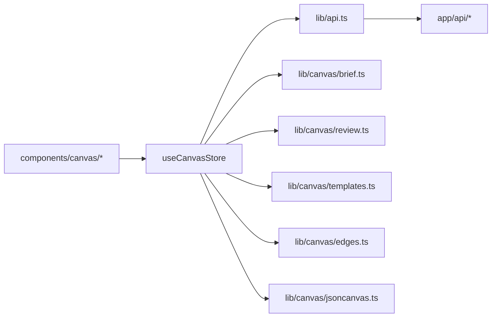

# Store

- Central Zustand `useCanvasStore` — owns the entire canvas document (`FlowcanvasDoc`), all transient UI state, and every mutation action; all 19 `components/canvas/*` consumer files depend on it.
- Path: `lib/canvas/store.ts`; stack: TypeScript 5 / Zustand ^5 (single-file module, no React, no DOM).
- Public API: `useCanvasStore` store + `CanvasMode` + `ReaderSize` exported types; 42+ actions grouped by lifecycle: load/save, node editing, edge editing, comments, reader, selection/group/layout, v2 agent round-trip, v2 navigation/templates/reconcile, Phase 5 board import, 006 port management (addPort/movePort).
- Generated at depth by `flowcode:module-explorer-agent`; meets its § Module Doc Completeness Bar — real signatures, a usage example, config/env, traced deps, conventions.
- Status active; last merged 006-semantic-edges 2026-06-30.

---

## Purpose

`lib/canvas/store.ts` is the single source of truth for Flowcanvas. It holds the loaded `FlowcanvasDoc` (the extended-JSONCanvas 0.2 graph on disk), the transient `bodies` cache (nodeId → resolved markdown body, never persisted to disk), and all interaction state — mode, open editor, reader drawer, multi-selection, review snapshot, and viewport-focus signal. Every action that mutates the board runs through this store. All consumer components in `components/canvas/*` subscribe to it via Zustand selectors; the store is the only module that calls `lib/api.ts` (the typed HTTP fetch layer), keeping all pure library modules (`brief.ts`, `review.ts`, `templates.ts`, `edges.ts`) free of async I/O and independently testable.

The v2 source-of-truth shift (plan `002`) made the store canvas-authoritative: on `load`, the `.canvas` file's edge array is taken as truth with no per-load `reconcileEdges` call. Phase 5 extracted the version upgrade logic into `lib/canvas/migrate.ts` (`migrateDoc`), a shared ladder called by both `load` and the new `importDoc`: `0.1→0.2` calls `reconcileEdges(doc.edges, deriveLinkEdges(nodes))` exactly once to bake previously live-only `lk:` edges into the persisted list; `0.2→0.3` is a no-op version bump. Any board opened or imported persists `schemaVersion: '0.3'` after a one-time re-save. Seven new v2 actions (`submitToAgent`, `reviewDiff`, `acceptRound`, `discardRound`, `navigateRef`, `addTemplate`, `resyncFile`) complete the agent round-trip, change-review, and reference-navigation surfaces. Phase 5 adds `importDoc` and `importCanvasFile` — the frictionless import path that accepts a pasted or dropped `FlowcanvasDoc`, runs it through the same migration ladder, writes it to a fresh collision-safe path, and adopts it through the normal `load` flow.

### Internal Architecture



---

## Public API

Concrete signatures only. No prose.

### Exported Types

```ts
// lib/canvas/store.ts:16
export type CanvasMode = 'select' | 'connect' | 'comment'

// lib/canvas/store.ts:19
export type ReaderSize = 'drawer' | 'half' | 'full'
```

### State Shape

```ts
// lib/canvas/store.ts:22-39 (CanvasState — persisted + transient fields)
interface CanvasState {
  // --- Persisted (written to .canvas on save) ---
  path: string | null             // active board file path
  doc: FlowcanvasDoc | null       // the full extended-JSONCanvas 0.2 graph
  dirty: boolean                  // unsaved changes flag

  // --- Transient (in-memory only, never written to disk) ---
  bodies: Record<string, string>  // nodeId -> resolved markdown body
  mode: CanvasMode                // UI interaction mode; never persisted
  editingEdgeId: string | null    // edge whose inline label editor is open
  readerNodeId: string | null     // node id open in the reader drawer
  readerSize: ReaderSize          // reader drawer width preset
  selectedIds: string[]           // ids in the current multi-selection
  reviewState: ReviewState | null // v2: submit-time snapshot; loaded when pendingReview
  focusNodeId: string | null      // v2: viewport-center request; FocusBridge consumes + clears
  revealCommentsNodeId: string | null  // comment badge → shell opens inspector "Comments on this node"; UI consumes + clears

  // --- Phase 4 transient (004 living core-doc spine + bidirectional linking; never persisted) ---
  coreDocBody: string | null           // resolved markdown of session.coreDocPath (spine render source)
  coreDocDraft: string | null          // in-progress edit buffer for the spine textarea
  coreDocDirty: boolean                // coreDocDraft !== coreDocBody
  spineHighlightAnchor: string | null  // component-selected → spine scrolls/pulses this anchor
  linkedNodeIds: string[]              // spine-section-selected → canvas pulses these node ids
}
```

### Store

```ts
// lib/canvas/store.ts:108
export const useCanvasStore: StoreApi<CanvasState>
// Zustand store. Use as a hook inside React: const mode = useCanvasStore((s) => s.mode)
// Use outside React (tests): useCanvasStore.getState() / useCanvasStore.setState()
```

### Functions / Methods

#### Load / Save / Board I/O

```ts
// lib/canvas/store.ts:242
load(path: string): Promise<void>
// Canvas-authoritative load. Routes through migrateDoc (0.1→0.2→0.5 shared ladder); if migrated,
// calls save() once to persist the bumped schemaVersion (store.ts:275). Writes active-board pointer;
// loads ReviewState when session.pendingReview is true.
// Phase 4: when session.coreDocPath is set, resolves its markdown via api.readFileApi and
// seeds coreDocBody/Draft; resets all five Phase 4 transient fields on every load.
// 006: after migrateDoc, runs normalizePorts(migratedDoc) (store.ts:250) to seed ConnectionPort dots
// for every edge endpoint that lacks one. portsSeeded triggers a one-time save (store.ts:275) so
// pre-006 boards acquire their endpoint dots on first open (Decision 4).

// lib/canvas/store.ts:136
save(): Promise<void>
// Persist current doc to disk via api.saveCanvas; bumps session.revision; clears dirty.

// lib/canvas/store.ts:258
saveAs(path: string): Promise<void>
// Write to a new path, adopt it as current, update URL ?path= without reload, write active-board pointer.

// lib/canvas/store.ts:273
openBoard(path: string): Promise<void>
// Switch to a different board (caller owns the dirty guard): load + update URL ?path=.

// lib/canvas/store.ts:458
newBoard(): Promise<void>
// Create and adopt a fresh empty `untitled-*.canvas` board with schemaVersion: '0.5' (006: bumped;
// store.ts:464); resets all transient state including the five Phase 4 fields
// (coreDocBody/Draft/Dirty/spineHighlightAnchor/linkedNodeIds) (store.ts:470).

// lib/canvas/store.ts:338
clearBoard(): void
// Wipe nodes/edges/comments from current board, keep session identity; mark dirty.
// Also resets all five Phase 4 transient fields (store.ts:347).

// lib/canvas/store.ts:749
importDoc(doc: FlowcanvasDoc, path?: string): Promise<void>
// Phase 5 — adopt an in-memory FlowcanvasDoc as the active board: migrateDoc (0.1→0.2→0.3) →
// saveCanvas to a fresh collision-safe `<stem>-<rid>.canvas` path (stem from the optional `path`
// arg, defaulting to 'imported') → load() (hydrate, active pointer, core-doc resolve, transient
// reset, ?path= update). Like openBoard but for a doc not yet on disk.

// lib/canvas/store.ts:763
importCanvasFile(file: File): Promise<void>
// Phase 5 — read a dropped/uploaded .canvas file: JSON.parse(await file.text()) →
// parseFlowcanvasDoc (zod-validate; throws SyntaxError on bad JSON or ZodError on invalid shape)
// → importDoc. The board is replaced only after validation succeeds. Caller surfaces the error.
```

#### Node Editing

```ts
// lib/canvas/store.ts:399
addNode(node: CanvasNode): void
// Append a fully-formed node (text/link/group). File nodes use addFileNode instead.

// lib/canvas/store.ts:407
addFileNode(path: string, x: number, y: number): Promise<string>
// Add a markdown or image file node; hydrates frontmatter/body via hydrateFiles.
// Returns the new node id (used by navigateRef to draw a references edge).

// lib/canvas/store.ts:177
removeNode(id: string): void
// Delete node + all touching edges + anchored comments.
// Orphans group children (clears parentId). Closes reader if open node is deleted.

// lib/canvas/store.ts:142
toggleCollapsed(id: string): void
// Toggle meta.collapsed on any node (drives MarkdownNode card collapse).

// lib/canvas/store.ts:320
setNodePosition(id: string, x: number, y: number): void
// Write drag-dropped absolute coordinates back to the doc node; marks dirty.

// lib/canvas/store.ts:327
setNodeSize(id: string, width: number, height: number): void
// Persist resize from NodeResizer (group nodes only in practice); marks dirty.

// lib/canvas/store.ts:334
setNodeText(id: string, text: string): void
// Edit NoteNode markdown body inline (double-click textarea). No-op for non-text nodes.

// lib/canvas/store.ts:341
setNodeLabel(id: string, label: string): void
// Edit GroupNode label inline. No-op for non-group nodes.

// lib/canvas/store.ts:348
setNodeShape(id: string, shape: NodeShape): void
// Change group node shape (rectangle|ellipse|diamond). No-op for non-group nodes.
```

#### Edge Editing

```ts
// lib/canvas/store.ts:298
onConnect(conn: Connection): void
// 006: connections anchor to DOTS (ConnectionPorts). portForConnect resolves each endpoint:
//   - handle is an existing port id  → reuse the dot (no new port minted)
//   - handle is a Side ('top'|'right'|'bottom'|'left') → create a dot at firstFreeT on that side
//   - handle is null (body drop) → autoPort geometric placement, reusing a nearby dot within PORT_SLOT_TOL
// The minted edge carries fromPort/toPort (port ids) and meta.edgeType:'reference'.
// Prior behavior (meta.rel:'related', floating fromSide/toSide) is retired for new connections.
// Rejects self-connections (source === target). v2: no links: write-back (Decision 4).

// lib/canvas/store.ts:168
removeEdgeWriteback(id: string): void
// Durable edge delete from doc; no-op for unknown ids; never touches the filesystem.

// lib/canvas/store.ts:354
relabelEdge(id: string, label: string): void
// Set edge label; promotes origin:'links' -> 'user' so reconcile no longer rewrites it.

// lib/canvas/store.ts:367
setEdgeRel(id: string, rel: RelationshipType): void
// Set typed relation (v2 rel picker). Defaults display label from REL_LABELS when no
// free-form label exists; promotes origin:'links' -> 'user'.

// lib/canvas/store.ts:377
setEditingEdge(id: string | null): void
// Open (pass id) or close (pass null) the inline edge-label editor (sets editingEdgeId).
```

#### Edge Type (006-semantic-edges)

```ts
// lib/canvas/store.ts:604
setEdgeType(id: string, type: EdgeType): void
// Set meta.edgeType to `type` (one of 'data-flow'|'request'|'response'|'event'|'dependency'|'reference').
// CLEARS the four per-edge overrides that the type supersedes — `color`, `meta.line`, `fromEnd`, `toEnd` —
// so the edge immediately reads its semantic defaults from EDGE_TYPE_STYLE[type] in the renderer.
// The reusable <ColorPicker> can re-override colour AFTER the type is set (design Decision 3).
// EdgeType imported from lib/canvas/jsoncanvas.ts:104.
```

#### Edge Style (005-edges)

Seven actions backing the Style panel; each maps a doc edge field. The agent reaches the same fields
through the contract (`AgentEdge`), keeping human/agent parity.

```ts
// lib/canvas/store.ts:567
setEdgeRouting(id: string, routing: EdgeRouting): void
// Set meta.routing ('smoothstep' | 'bezier' | 'straight'); marks dirty.

// lib/canvas/store.ts:573
setEdgeLine(id: string, line: EdgeLineStyle): void
// Set meta.line ('solid' | 'dashed' | 'dotted'); marks dirty.

// lib/canvas/store.ts:588
setEdgeColor(id: string, color?: CanvasColor): void
// Set edge.color (hex or preset '1'..'6'); undefined DELETES the field → reverts to the provenance stroke.

// lib/canvas/store.ts:600
setEdgeMarker(id: string, which: 'from' | 'to', end: EdgeEnd): void
// Set per-end marker shape (from = start marker, to = end marker); EdgeEnd ∈ none|arrow|arrow-open|circle|diamond.

// lib/canvas/store.ts:607
setEdgeSide(id: string, which: 'from' | 'to', side?: Side): void
// Pin an endpoint to a side; undefined DELETES that side → the endpoint floats (anchors to node center).

// lib/canvas/store.ts:580
setEdgeLabelT(id: string, t: number): void
// Set meta.labelT — 0..1 label position along the path (drag-to-move); clamped to [0,1].

// lib/canvas/store.ts:621
setEdgeWaypoints(id: string, points: { x: number; y: number }[]): void
// Set meta.points — manual line bends (absolute coords). An empty array DELETES the field → auto-route.
```

#### Connection Ports (006-semantic-edges)

Ports are stable `ConnectionPort` dots (`{ id: string; side: Side; t: number }`) stored on `node.meta.ports`.
Edges reference them by id via `fromPort`/`toPort`. `addPort` and `movePort` are the public mutations; the private
helpers `portForConnect`, `firstFreeT`, `PORT_SLOT_TOL`, `PORT_T_SLOTS`, and `portIdMint` service `onConnect`.
`normalizePorts` (in `migrate.ts`) back-fills dots for boards that pre-date 006 (called by `load`).

```ts
// lib/canvas/store.ts:667
addPort(nodeId: string, side: Side, t: number): string
// Mint a new ConnectionPort dot on nodeId's meta.ports at the given side and t (clamped [0,1]).
// Returns the new port id ('p-' prefix). The dot immediately anchors any connection drawn from it.

// lib/canvas/store.ts:678
movePort(nodeId: string, portId: string, side: Side, t: number): void
// Slide an existing dot to a new {side, t} (Alt-drag). Every edge whose fromPort or toPort equals
// portId follows automatically — the renderer resolves the endpoint from the port's {side, t}.
```

Private helpers (not exported; used only within `onConnect`):

```ts
// lib/canvas/store.ts:133
portIdMint(): string   // 'p-' + 8-char UUID suffix

// lib/canvas/store.ts:138-140
const PORT_SLOT_TOL = 0.06   // dedup / slot-freedom tolerance (distinct from migrate.ts's reuse tolerance)
const PORT_T_SLOTS = [0.5, 0.3, 0.7, 0.2, 0.8, 0.15, 0.85, 0.4, 0.6, 0.1, 0.9]  // preferred spread order

// lib/canvas/store.ts:143
firstFreeT(ports: ConnectionPort[], side: Side): number
// First slot in PORT_T_SLOTS not occupied within PORT_SLOT_TOL on the given side; falls back to 0.5.

// lib/canvas/store.ts:154
portForConnect(
  nodes: CanvasNode[], targetNodeId: string, handle: string | null | undefined, otherNode: CanvasNode,
): { portId: string; nodes: CanvasNode[] }
// Resolve one connection endpoint to a port id — reusing the existing port when handle is a port id,
// creating a dot at firstFreeT when handle is a Side, or placing via autoPort (from ./ports) for a
// body drop (null handle), reusing a nearby dot within PORT_SLOT_TOL. Returns portId + updated nodes.
```

#### Mode

```ts
// lib/canvas/store.ts:380
setMode(mode: CanvasMode): void
// Switch canvas interaction mode; drives toolbar mode group + comment layer click capture.
```

#### Reader

```ts
// lib/canvas/store.ts:383
openReader(id: string): void
// Set readerNodeId — triggers reader drawer mount at current readerSize.

// lib/canvas/store.ts:386
closeReader(): void
// Clear readerNodeId.

// lib/canvas/store.ts:390
setReaderSize(size: ReaderSize): void
// Bound to the reader header segmented control (drawer=440px / half=50vw / full=100vw).

// lib/canvas/store.ts:394
maximizeReader(id: string): void
// Open reader for a node at full width (readerSize='full'). Used by MarkdownNode maximize button.
```

#### Comments

```ts
// lib/canvas/store.ts:420
addComment(anchor: CommentAnchor, text: string, author: string): string
// Append a root comment; badge = sequential count across existing roots; returns new comment id.

// lib/canvas/store.ts:435
replyComment(rootId: string, text: string, author: string): void
// Append a reply; copies root anchor; carries no badge.

// lib/canvas/store.ts:451
resolveComment(rootId: string): void
// Stamp resolvedAt on the root comment.
// No-op (stays clean) for unknown id, reply id, or already-resolved root.
```

#### Selection / Group / Layout (Phase 10)

```ts
// lib/canvas/store.ts:202
setSelection(ids: string[]): void
// Equality-guarded to prevent churn from React Flow onSelectionChange firing on every render.

// lib/canvas/store.ts:210
groupSelection(ids: string[]): void
// Wrap >=2 ungrouped non-group nodes in a new container sized to bounds + 28px padding.
// Group node prepended in doc order (parent-before-child); members get parentId; group selected.

// lib/canvas/store.ts:232
ungroup(groupId: string): void
// Dissolve container; clear children's parentId; absolute coords unchanged.

// lib/canvas/store.ts:247
applyLayout(positions: Record<string, { x: number; y: number }>): void
// Bulk absolute-coord write shared by ELK 'Re-organize' result and group-aware drag write-back.
```

#### Agent Round-trip

```ts
// lib/canvas/store.ts:463
buildBrief(): Promise<DesignBrief>
// Resolve every file node fresh, build DesignBrief via buildBriefPure, stamp session.lastBriefId.

// lib/canvas/store.ts:479
applyResponse(resp: AgentResponse): Promise<MergeReport>
// (1) 8-step pure merge; (2) write generated files; (3) re-hydrate nodes; (4) save. Returns MergeReport.

// lib/canvas/store.ts:497
submitToAgent(intent: string, scopeNodeIds?: string[]): Promise<void>
// Save + open review window (ReviewState snapshot) + update active-board pointer.
// scopeNodeIds -> stamps session.briefScope for scope-aware brief (Decision 5/6).

// lib/canvas/store.ts:530
reviewDiff(): ReviewDiff | null
// Diff reviewState.snapshot vs current doc. Augments with files[] (round-added file-node paths).
// Returns null when no round is pending.

// lib/canvas/store.ts:541
acceptRound(): Promise<void>
// Keep merged doc; clear pendingReview + briefScope + reviewState; save.

// lib/canvas/store.ts:554
discardRound(): Promise<void>
// Restore submit-time snapshot; delete round-generated files (api.deleteFileApi); clear review window; save.
```

#### Navigation / Templates / Reconcile (v2)

```ts
// lib/canvas/store.ts:575
focusNode(id: string): void
// Select node and request viewport center via focusNodeId (FocusBridge consumes + calls clearFocus).

// lib/canvas/store.ts:571
clearFocus(): void
// Reset focusNodeId to null. Called by FocusBridge after centering.

// lib/canvas/store.ts:923
navigateRef(sourceNodeId: string, ref: DocRef): Promise<void>
// If target node already on board: focus it. Else: add it near source + draw a references edge.
// 006 (Phase 3): the minted edge now also carries `meta.edgeType: 'reference'` (store.ts:952) in
// addition to `rel: 'references'`, keeping the contract uniform with onConnect-drawn edges.

// lib/canvas/store.ts:613
addTemplate(t: CanvasTemplate, x: number, y: number): Promise<void>
// Instantiate template fragment: clone with fresh ids + rebased coords, write doc scaffolds, hydrate, append.

// lib/canvas/store.ts:623
resyncFile(path: string): Promise<void>
// Re-read one file from disk, refresh its frontmatter cache + body, re-derive only its lk: edges.
```

#### Core Doc / Bidirectional Linking (Phase 4)

```ts
// lib/canvas/store.ts:701
setCoreDoc(path: string): Promise<void>
// Bind the spine to `path`. If session.coreDocPath differs, stamps it on the doc (dirty: true).
// Resolves the file's markdown via api.readFileApi into coreDocBody/Draft; resets coreDocDirty,
// spineHighlightAnchor, linkedNodeIds. Drives the spine switcher (Q4).

// lib/canvas/store.ts:714
editCoreDoc(markdown: string): void
// Update the spine edit buffer: coreDocDraft = markdown; coreDocDirty = (markdown !== coreDocBody).

// lib/canvas/store.ts:720
submitCoreDocEdit(summary: string): Promise<void>
// GUARD: throws Error('A review round is already open…') if session.pendingReview is true (single
// open-round invariant, Decision 3). Also throws if no session.coreDocPath is bound.
// Writes coreDocDraft to disk via api.writeFileApi(coreDocPath, draft), adopts draft as coreDocBody
// (coreDocDirty: false), then calls submitToAgent(summary) to snapshot + set pendingReview + publish
// active pointer (store.ts:728-730).

// lib/canvas/store.ts:733
highlightSpineSection(anchor: string): void
// Component → spine direction: set spineHighlightAnchor to `anchor`.
// CoreSpine observes this field and scrolls to / pulses the matching heading.

// lib/canvas/store.ts:737
highlightComponents(anchor: string): void
// Spine → canvas direction: resolve all node ids whose meta.source.anchor === `anchor` under the
// current coreDocPath via buildSourceIndex(doc.nodes, coreDocPath), then set linkedNodeIds.
// CanvasShell tags those RF nodes with the `fc-rf--linked` className (canvas-shell.tsx:117).
// No-op (sets linkedNodeIds: []) when doc or coreDocPath is absent.

// lib/canvas/store.ts:743
clearLinkHighlight(): void
// Reset both highlight channels: spineHighlightAnchor = null, linkedNodeIds = [].
```

#### Query

```ts
// lib/canvas/store.ts:134
bodyFor(id: string): string | undefined
// Look up the transient markdown body string for a node id from the bodies cache.
```

### HTTP Routes

Not applicable — the store calls `lib/api.ts` which wraps the HTTP routes. The store exposes no HTTP surface.

### Events / Messages

Not applicable — no pub/sub; state changes propagate via Zustand subscriptions.

### Exceptions / Errors

| Name | Raised When | Caught By |
|------|-------------|-----------|
| `Error('no board loaded')` | `buildBrief`, `applyResponse`, `submitToAgent` called with no `doc`/`path` | Caller |
| `Error('no board loaded')` | `saveAs` called with no `doc` | Caller |
| `Error('A review round is already open…')` | `submitCoreDocEdit` called while `session.pendingReview` is true (store.ts:723-725) | Caller (CoreSpine submit handler) |
| `Error('No core doc bound…')` | `submitCoreDocEdit` called with no `session.coreDocPath` (store.ts:725) | Caller |
| `SyntaxError` | `importCanvasFile`: `JSON.parse` fails — the file is not valid JSON (store.ts:764) | Caller (`onCanvasUpload` in export-panel, `onDrop` in dropzone) |
| `ZodError` | `importCanvasFile`: `parseFlowcanvasDoc` validation fails — the JSON is not a valid `FlowcanvasDoc` (store.ts:765) | Caller |

---

## Usage Examples

```ts
// lib/canvas/store.test.ts:25-44 — seed the store outside React and exercise 006 onConnect
import { useCanvasStore } from './store'
import type { FlowcanvasDoc } from './jsoncanvas'

// 1. Seed Zustand directly (outside React; the store supports .getState()/.setState())
useCanvasStore.setState({
  path: 'x.canvas',
  doc: {
    nodes: [
      { id: 'a', type: 'file', file: 'a.md', x: 0, y: 0, width: 100, height: 100,
        meta: { origin: 'user', frontmatter: { links: ['b.md'] } } },
      { id: 'b', type: 'file', file: 'b.md', x: 200, y: 0, width: 100, height: 100,
        meta: { origin: 'user', frontmatter: {} } },
    ],
    edges: [
      { id: 'lk:a->b', fromNode: 'a', toNode: 'b', label: 'links',
        color: '6', toEnd: 'arrow', meta: { origin: 'links' } },
    ],
    flowcanvas: {
      schemaVersion: '0.1',
      session: { createdAt: '2026-06-26T00:00:00Z', updatedAt: '2026-06-26T00:00:00Z', revision: 0 },
      comments: [],
    },
  } as FlowcanvasDoc,
  bodies: {}, dirty: false, mode: 'select', editingEdgeId: null,
  readerNodeId: null, readerSize: 'drawer', selectedIds: [], reviewState: null, focusNodeId: null,
})

// 2. Draw a connection via a side "add" handle — 006: creates a dot on each side, anchors the edge to them
useCanvasStore.getState().onConnect({ source: 'b', target: 'a', sourceHandle: 'right', targetHandle: 'left' })

// 3. Assert the resulting state
const { doc, dirty, editingEdgeId } = useCanvasStore.getState()
const minted = doc!.edges.find((e) => e.fromNode === 'b' && e.toNode === 'a')!
const nodeB = doc!.nodes.find((n) => n.id === 'b')!
const nodeA = doc!.nodes.find((n) => n.id === 'a')!
// minted.id starts with 'e-'  (user-drawn edge prefix)
// minted -> { fromNode:'b', toNode:'a', fromPort:'p-...', toPort:'p-...',
//             label:'', meta:{ origin:'user', edgeType:'reference' } }
// nodeB.meta.ports contains {id: minted.fromPort, side:'right', t:0.5}  (first free slot)
// nodeA.meta.ports contains {id: minted.toPort, side:'left',  t:0.5}
// editingEdgeId === minted.id   (inline label editor opens immediately)
// dirty === true
```

Real call site: `lib/canvas/store.test.ts:25-44`. Demonstrates: Zustand store seeded outside React, `onConnect` (006) minting a port-anchored edge with `meta.edgeType:'reference'`, dots created on both sides via `portForConnect`, and the inline-editor signal.

---

## Database Schema

Not applicable — no database; the board is persisted as a `.canvas` JSON file on disk via `lib/api.ts`.

---

## Dependencies

**Upstream modules:**
- `lib/canvas/jsoncanvas.ts` — `FlowcanvasDoc`, `CanvasNode`, `CanvasEdge`, `Comment`, `CommentAnchor`, `NodeShape`, `RelationshipType`, `NodeMeta`, `isFileNode`, `nodeKind`, `REL_LABELS`; 005-edges adds `Side`, `CanvasColor`, `EdgeEnd`, `EdgeRouting`, `EdgeLineStyle`; 006 adds `ConnectionPort` (the `{id, side, t}` dot type stored in `node.meta.ports`) (store.ts:3-4)
- `lib/canvas/edges.ts` — `deriveLinkEdges` only (store.ts:5); `reconcileEdges` was extracted to `lib/canvas/migrate.ts` in Phase 5 — the store uses `deriveLinkEdges` only in `resyncFile` now
- `lib/canvas/ports.ts` — `autoPort` (006; store.ts:6); geometric port placement — given source and target node bounding boxes, returns `{side, t}` for the endpoint closest to the straight-line between node centres; consumed by `portForConnect` for body-drop connections (null handle)
- `lib/canvas/migrate.ts` — `migrateDoc` + `normalizePorts` (006; store.ts:12); `migrateDoc` is the shared `0.1→0.2→0.5` upgrade ladder called by both `load` and `importDoc`; `normalizePorts` seeds `ConnectionPort` dots on pre-006 boards (called by `load` only, after migration)
- `lib/canvas/validate.ts` — `parseFlowcanvasDoc` (store.ts:13); zod-validates an untrusted JSON blob into a typed `FlowcanvasDoc`; called by `importCanvasFile`
- `lib/canvas/brief.ts` — `buildBriefPure`, `applyResponsePure`, `AgentResponse`, `DesignBrief`, `MergeReport` (store.ts:7-8)
- `lib/canvas/review.ts` — `diffDocs`, `ReviewState`, `ReviewDiff` (store.ts:9-10)
- `lib/canvas/layout.ts` — `organizeByType as organizeByTypePure` (store.ts:14); type-banded ELK layout consumed by `organizeByType` and the post-`applyResponse` auto-arrange (#7/#8)
- `lib/canvas/templates.ts` — `instantiateTemplate`, `CanvasTemplate` (store.ts:15-16)
- `lib/canvas/spine.ts` — `buildSourceIndex` (resolves anchor → node-id list in `highlightComponents`) + `normPath` (canonical path comparison for `navigateRef` and `resyncFile`; centralised here in Phase 4) + `citedDocPaths` (load's auto-bind: returns doc paths cited by any node's `meta.source`; drives the single-document auto-adopt on load) (store.ts:11)
- `lib/canvas/refs.ts` — `DocRef` type-only import for `navigateRef` parameter (store.ts:17)
- `lib/api.ts` — all HTTP wrappers: `getCanvas`, `saveCanvas`, `resolvePaths`, `writeFileApi`, `readFileApi`, `deleteFileApi`, `getReview`, `putReview`, `clearReview`, `putActive` (store.ts:18; `readFileApi` added in Phase 4 for core-doc body resolution in `load` and `setCoreDoc`)

**External services:**
- HTTP routes (`app/api/*`) — all state persistence flows through guarded route handlers; the store never calls `fs` directly.

**Key libraries:**
- `zustand` ^5 — `create<CanvasState>()` at store.ts:1,108
- `@xyflow/react` — `Connection` type-only import at store.ts:2; no RF runtime import in the store itself
- Web Crypto API (`crypto.randomUUID()`) — id minting for edges, comments, nodes, briefs (built-in; no npm import)

---

## Configuration & Environment

Not applicable — `store.ts` reads no environment variables or config keys directly. All configuration (`FLOWCANVAS_ROOT`, `FLOWCANVAS_BASE_URL`) is consumed by the HTTP route handlers that `lib/api.ts` calls.

---

## Run / Test / Lint

| Action | Command |
|--------|---------|
| Test (this module) | `npx vitest run lib/canvas/store.test.ts` |
| Test (all pure modules) | `npx vitest run` |
| Typecheck | `npx tsc --noEmit` |
| Lint | `npm run lint` |
| Build | `npm run build` |

---

## Key Insights

**Conventions & patterns:**

- **Canvas-authoritative load — Phase 5 migration ladder** (`store.ts:144-163`, `migrate.ts:6-19`): Since plan `002`, `load()` takes `doc.edges` from disk as the authoritative edge set — no `reconcileEdges` call on every open. Phase 5 extracted the upgrade logic into `lib/canvas/migrate.ts:migrateDoc`, a shared ladder called by both `load` and `importDoc`. `0.1→0.2` calls `reconcileEdges(doc.edges, deriveLinkEdges(nodes))` exactly once to bake previously live-only `lk:` edges into the persisted list; `0.2→0.3` is a no-op version bump that stamps `schemaVersion:'0.3'`. If `migrated` is true, `save()` is called immediately — any board opened or imported exits as `'0.3'` on disk. `reconcileEdges` is no longer imported into `store.ts`; in the store, `deriveLinkEdges` is used only by `resyncFile` (per-file, on demand).

- **Transient vs persisted state split** (`store.ts:22-39`): `doc`, `path`, and `dirty` are the persisted hull; everything else is ephemeral. `bodies` (the markdown body cache) is the most performance-sensitive transient field: it is never written to `.canvas` and is rebuilt by `hydrateFiles` on every `load`, `addFileNode`, `addTemplate`, `applyResponse`, and `discardRound`. `reviewState` is re-loaded from the `.review.json` snapshot file on `load` when `session.pendingReview` is set; `focusNodeId` is a one-shot signal consumed and cleared by `FocusBridge` after `setCenter`. The five Phase 4 fields (`coreDocBody`, `coreDocDraft`, `coreDocDirty`, `spineHighlightAnchor`, `linkedNodeIds`) are also purely transient — `coreDocBody`/`Draft` are seeded on `load`/`setCoreDoc` and zeroed by `newBoard`/`clearBoard`; the two highlight fields are momentary UI signals that `clearLinkHighlight` resets to null/`[]`.

- **ID-prefix conventions** (`store.ts:81-85`): User-drawn edge ids start with `e-` (8-char uuid suffix); comment ids with `c-`; user-created node ids with `n-`. Deterministic derived link-edge ids use `lk:${fromNode}->${toNode}` (from `edges.ts`). Agent-minted ids use `ag-` prefix (from `brief.ts`). Brief ids use `brief-` prefix (`store.ts:469`). This lets the store distinguish origins without inspecting `meta.origin`.

- **Immutable `set` pattern:** Every action spreads into `set({ ... })` rather than mutating the existing doc reference. The sole exception is `doc.flowcanvas.session.revision = await api.saveCanvas(...)` — a deliberate in-place mutation before `set` to keep the revision in sync with the server response without triggering an extra Zustand notification cycle.

- **`normPath` moved to `lib/canvas/spine.ts` in Phase 4** (`spine.ts:9`): Prior to Phase 4, `normPath` was a private helper inlined inside `store.ts`. When Phase 4 introduced `lib/canvas/spine.ts` (which also needs canonical path comparison), `normPath` was centralised there. Both `navigateRef` (`store.ts:644`) and `resyncFile` (`store.ts:684`) now import it from `./spine`; there is no longer a local copy in `store.ts`.

- **Equality guard on `setSelection`** (`store.ts:232-235`): React Flow's `onSelectionChange` fires on every render pass. Without the identity check (`cur.length === ids.length && cur.every((id, i) => id === ids[i])`), every render would call `set`, causing Zustand to re-notify all subscribers and produce an infinite render loop. No other action has this guard.

- **`groupSelection` uses ABSOLUTE coordinates** (`store.ts:210-228`): The store keeps all node coordinates absolute at rest — there is no relative-child coordinate system in the persistence layer. `groupSelection` only sets `parentId`; it never adjusts `x`/`y`. React Flow handles the visual parent-relative display; the adapter (`toJSONCanvas`) converts back to absolute on save.

**Gotchas & invariants:**

- `onConnect` (`store.ts:164`) opens `editingEdgeId` on the new edge immediately. Components must call `setEditingEdge(null)` to close the editor — it is never auto-closed by any subsequent action.
- `relabelEdge` (`store.ts:358`) promotes `origin:'links'` to `'user'` permanently. Once promoted, the edge will never be rewritten by `reconcileEdges` or `resyncFile`.
- `resolveComment` (`store.ts:451-458`) is idempotent and true no-op safe: passing a reply id, an unknown id, or an already-resolved root id leaves `dirty` unchanged. No guard needed at the call site.
- `discardRound` (`store.ts:554`) deletes files from disk via `api.deleteFileApi`. It reads the round-generated file paths from `reviewDiff().files`, which diffs `reviewState.snapshot` vs the current doc for added file-node paths. If `reviewState` is null, it returns immediately without side effects.
- `submitToAgent` (`store.ts:497`) stamps `pendingReview: true` and saves before constructing the `ReviewState`. If the component calls `buildBrief` after `submitToAgent`, the brief will include `session.briefScope` when a scope was passed, narrowing the brief to the selection's structural closure.
- `hydrateFiles` (`store.ts:91`) is the only place `api.resolvePaths` is called for frontmatter hydration. It runs on `load`, `addFileNode`, `addTemplate`, `applyResponse`, and `discardRound`. Stale `bodies` entries persist until the next hydration run — there is no per-save cache invalidation.

---

## Known Gaps

- `resyncFile` implements Decision 10 — per-file reconcile for disk-divergence detection. The disk-divergence banner (surfacing when a watched `.md` file changes on disk while the board is open) is explicitly deferred per plan `002` evolution log.
- `submitToAgent` scoped brief: `session.briefScope` is stamped, but there is no UI feedback after submit indicating that a scope is active. The MCP sidecar and clipboard Export paths both honour it via `buildBriefPure`, but a reviewer has no visual cue.

- **006-semantic-edges: port system design** (`store.ts:133-174`, `ports.ts:47-49`, `migrate.ts:116+`): Every edge endpoint is now a `ConnectionPort` dot (`{id, side, t}`) stored in `node.meta.ports`. Three minting paths in `portForConnect`: (1) handle matches an existing port id → reuse; (2) handle is a Side string → `firstFreeT` picks the next open slot from `PORT_T_SLOTS` (so repeated draws on the same side spread at 0.5, 0.3, 0.7 … rather than stacking); (3) handle is null (body drop) → `autoPort` (from `ports.ts`) computes the geometric nearest-side intersection, reusing a nearby dot within `PORT_SLOT_TOL` to avoid duplicates. The edge carries `fromPort`/`toPort` ids, not `fromSide`/`toSide` — the renderer resolves geometry from the port's `{side, t}` live. `normalizePorts` in `migrate.ts` back-fills dots for boards created before 006; `load` calls it after `migrateDoc` and triggers a one-time save when any ports were seeded (`portsSeeded`). `portIdMint` uses the same `p-${uuid8}` pattern as other id minters.

- **006 edge-type rename** (`store.ts:313`): New connections carry `meta.edgeType:'reference'` (the neutral default) instead of `meta.rel:'related'`. The `edgeType` field is the 006 typed-edge vocabulary (set from the legend after connect); `rel` is the older v2 typed-rel vocabulary still present on pre-006 boards and on `navigateRef`-drawn edges (`rel:'references'`). `setEdgeRel` continues to write to `meta.rel`; the two fields co-exist on migrated boards.

## Update 2026-06-30 — load heals the core-doc card; organize is coreDocPath-aware

`load` now heals boards generated before the core-doc-card change: when a board has a bound `coreDocPath`
but no file node references it, `load` mints (via `ensureCoreDocNode` from `brief.md`) + hydrates (one
`resolvePaths`) a markdown card placed left of the content bbox and persists it (idempotent; fires once).
The `organizeByType` action passes `session.coreDocPath` to the pure layout so the healed/generated card
pins leftmost. Part of the 004 "spine, not a card" reversal (operator decision 2026-06-30).

## Update 2026-06-30 — 006-semantic-edges: port-anchored connections (Phase 1 & 2)

006 rewrites `onConnect` to anchor every drawn edge to `ConnectionPort` dots on each node's perimeter.
Key changes to behavior verified in source and tests:

- `onConnect` (`store.ts:298`): mints dots via `portForConnect` for both endpoints; edge carries `fromPort`/`toPort` ids and `meta.edgeType:'reference'` (replaces `meta.rel:'related'` for new connections).
- `addPort` (`store.ts:667`): public action — mint a dot on demand; returns its `p-` id.
- `movePort` (`store.ts:678`): public action — slide a dot; anchored edges follow via live port resolution.
- `load` (`store.ts:250`): calls `normalizePorts(migratedDoc)` after the migration ladder; `portsSeeded` flag triggers a one-time save.
- `newBoard` (`store.ts:464`): emits `schemaVersion:'0.5'` (was `'0.4'`).
- New dependency: `lib/canvas/ports.ts` (`autoPort`), `normalizePorts` added to `lib/canvas/migrate.ts` imports.
- Note: pre-006 line refs in earlier sections (001/002/004/005) shifted upward; the 006-specific line refs above are current.

## Update 2026-06-30 — 006-semantic-edges Phase 3: setEdgeType + navigateRef consistency

Phase 3 adds the `setEdgeType` action and makes `navigateRef` carry `meta.edgeType` explicitly.

- `setEdgeType(id, type)` (`store.ts:604`): new public action — sets `meta.edgeType` to the chosen `EdgeType` (`'data-flow'|'request'|'response'|'event'|'dependency'|'reference'`) and **clears** the four per-edge overrides that the type supersedes (`color`, `meta.line`, `fromEnd`, `toEnd`), so the edge immediately reads its semantic defaults from `EDGE_TYPE_STYLE[type]` in the renderer/adapter. The reusable `<ColorPicker>` can re-override `color` afterward (design Decision 3) — that is why only these four fields are cleared and not `color` permanently.
- `navigateRef` (`store.ts:952`): the reference edge it mints now also carries `meta.edgeType: 'reference'` in addition to `rel: 'references'`. This makes ref-nav edges consistent with `onConnect`-drawn edges, which have always set `edgeType` since Phase 1.
- `EdgeType` is imported from `lib/canvas/jsoncanvas.ts:3` (already present in the import line; no new import added).
