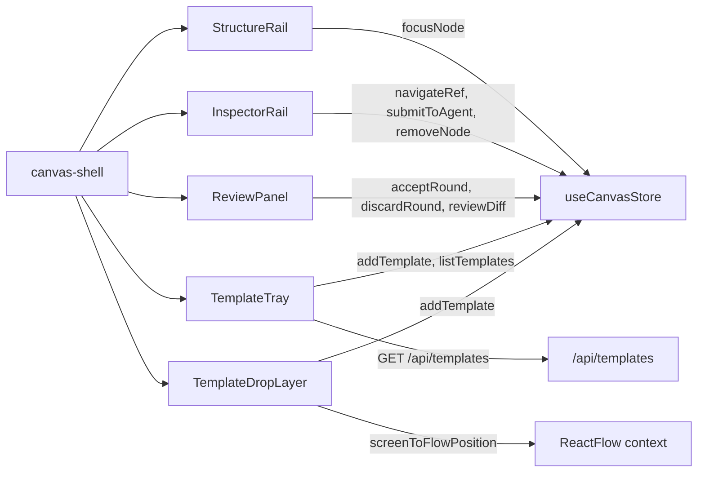

# Studio Rails

- Owns the five v2 tri-pane studio surfaces: left structure-rail outline, right inspector rail (inspect / submit / review modes), change-review stepper panel, template library tray, and the drag-to-canvas template drop overlay.
- Path: `components/canvas/` (files: `structure-rail.tsx`, `inspector-rail.tsx`, `review-panel.tsx`, `template-tray.tsx`, `template-drop.tsx`); stack: TypeScript 5 / React 19 / Zustand; CSS in `app/styles/studio-{structure,inspector,review,template}.css` + `studio-shell.css`.
- Public API: five exported React components (`StructureRail`, `InspectorRail`, `ReviewPanel`, `TemplateTray`, `TemplateDropLayer`) and one exported constant (`TEMPLATE_MIME`).
- Generated at depth by `flowcode:module-explorer-agent` (full mode); meets its § Module Doc Completeness Bar — real signatures, a usage example, config/env, traced deps, conventions.
- Status active; generated by bootstrap; last updated 2026-06-29.

---

## Purpose

Studio Rails provides the three-pane chrome around the React Flow canvas introduced in plan `002` (Phase 6). The left rail hosts two tabs — an outline tree (`StructureRail`) and a template library (`TemplateTray`). The right rail is a tri-mode pane that flips between an inspect view, a submit-to-agent form, and a change-review stepper, with `InspectorRail` covering inspect/submit and `ReviewPanel` covering review. `TemplateDropLayer` is a full-canvas overlay that intercepts template drags from the tray and drops them at the projected flow-space position. All five components are thin React shells over `useCanvasStore`; none own persistent state beyond UI transients (filter text, expand/collapse sets, instantiation-in-progress flag). The collapse state of both rails is driven entirely by the parent `canvas-shell` via CSS data-attributes — the components themselves are never told whether they are visible.

### Internal Architecture



---

## Public API

Concrete signatures only. No prose.

### Functions / Methods

```tsx
// structure-rail.tsx:183 — left rail outline tree; no props; reads doc/selectedIds/focusNode from store
export function StructureRail(): JSX.Element | null

// inspector-rail.tsx:22 — right inspector; mode driven by canvas-shell; returns null when mode==='review'
export function InspectorRail({
  mode,
  setMode,
}: {
  mode: 'inspector' | 'submit' | 'review'
  setMode: (m: 'inspector' | 'submit' | 'review') => void
}): JSX.Element | null

// review-panel.tsx:122 — change-review stepper; replaces InspectorRail when mode==='review'
export function ReviewPanel({ onClose }: { onClose: () => void }): JSX.Element

// template-tray.tsx:16 — template library; fetches listTemplates() on mount; onClose optional
export function TemplateTray({ onClose }: { onClose?: () => void }): JSX.Element

// template-drop.tsx:16 — full-canvas drag target; must render inside ReactFlow provider
export function TemplateDropLayer(): JSX.Element | null

// template-drop.tsx:10 — private MIME type for the drag handshake; consumed by TemplateTray + TemplateDropLayer
export const TEMPLATE_MIME = 'application/x-flowcanvas-template'
```

### Store Actions Consumed

```tsx
// store.ts:633 — select a node + set focusNodeId so FocusBridge calls setCenter
focusNode(id: string): void

// store.ts:638 — focus-or-add referenced node + draw rel:'references' edge
navigateRef(sourceNodeId: string, ref: DocRef): Promise<void>

// store.ts:555 — save board + capture snapshot + set pendingReview; scopeNodeIds narrows the brief
submitToAgent(intent: string, scopeNodeIds?: string[]): Promise<void>

// store.ts:588 — diffDocs(snapshot, doc); returns null when no round is pending
reviewDiff(): ReviewDiff | null

// store.ts:599 — keep merged doc, clear reviewState + pendingReview, persist
acceptRound(): Promise<void>

// store.ts:612 — restore snapshot, delete round's generated files, clear reviewState
discardRound(): Promise<void>

// store.ts:671 — instantiateTemplate(t, x, y) + hydrateFiles + append to doc
addTemplate(t: CanvasTemplate, x: number, y: number): Promise<void>

// store.ts:207 — delete node from board; does not touch the file on disk
removeNode(id: string): void

// store.ts:733 — Phase 4: component → spine direction; set spineHighlightAnchor (inspector-rail.tsx:23)
highlightSpineSection(anchor: string): void
```

### Store State Subscribed

```tsx
// Each component subscribes only to slices it renders — individual selectors, not full store
doc:         FlowcanvasDoc | null   // all five components
selectedIds: string[]              // StructureRail (highlight), InspectorRail (node + scope)
bodies:      Record<string, string> // InspectorRail (extractRefs needs body text)
reviewState: ReviewState | null    // InspectorRail (diff badge count), ReviewPanel (entries)
focusNodeId: string | null         // consumed by FocusBridge in canvas-shell, not the rails directly
```

### Classes

Not applicable — this module exports only function components and a string constant.

### HTTP Routes

Not applicable — no route handlers in this module. The only outbound fetch is `listTemplates()` called via `lib/api.ts`.

### Events / Messages

Not applicable — no pub/sub, Kafka, SQS, or EventEmitter usage.

### Exceptions / Errors

No custom exception classes. Error handling:

| Site | Behavior |
|------|----------|
| `TemplateTray` mount effect (`template-tray.tsx:29`) | `listTemplates()` rejection caught; tray collapses to empty state silently |
| `InspectorRail` submit handler (`inspector-rail.tsx:88-98`) | `try/finally` resets `sending` flag; no error message shown to user — fires-and-forgets |

---

## Usage Examples

```tsx
// canvas-shell.tsx:186, 225, 257-258
// Left rail: StructureRail and TemplateTray are tab-switched by canvas-shell's leftTab state
<aside className="fc-studio__rail" aria-label="Structure">
  <div className="fc-studio__rail-tabs">
    <button aria-selected={leftTab === 'structure'} onClick={() => setLeftTab('structure')}>Structure</button>
    <button aria-selected={leftTab === 'templates'} onClick={() => setLeftTab('templates')}>Templates</button>
  </div>
  <div className="fc-studio__rail-body">
    {leftTab === 'structure'
      ? <StructureRail />
      : <TemplateTray onClose={() => setLeftTab('structure')} />}
  </div>
</aside>

// Center canvas: TemplateDropLayer must render inside the ReactFlow provider
<TemplateDropLayer />

// Right inspector: ReviewPanel replaces InspectorRail when inspectorMode === 'review'
<aside className="fc-studio__inspector" aria-label="Inspector">
  {inspectorMode === 'review'
    ? <ReviewPanel onClose={() => setInspectorMode('inspector')} />
    : <InspectorRail mode={inspectorMode} setMode={setInspectorMode} />}
</aside>
```

Real call sites: `components/canvas/canvas-shell.tsx:186`, `225`, `257–258`. Demonstrates the tab-switching left rail, the mode-switched right rail, and the always-mounted drop layer.

---

## Database Schema

Not applicable.

---

## Dependencies

**Upstream modules:**

- `lib/canvas/store` (`useCanvasStore`) — all five components; provides `doc`, `selectedIds`, `bodies`, `reviewState`, `focusNode`, `navigateRef`, `submitToAgent`, `reviewDiff`, `acceptRound`, `discardRound`, `addTemplate`, `removeNode`; Phase 4 adds `highlightSpineSection` to `InspectorRail` (inspector-rail.tsx:23)
- `lib/canvas/refs` (`extractRefs`, `DocRef`) — `inspector-rail.tsx:4–5`; computes `DocRef[]` from a file node's frontmatter + body for the References section
- `lib/canvas/jsoncanvas` (`nodeKind`, `isFileNode`, `CanvasNode`, `NodeKind`) — `structure-rail.tsx:5–6`, `inspector-rail.tsx:6–7`, `review-panel.tsx:4`; Phase 4 adds `COMPONENT_KIND_META` to `InspectorRail` for the component-kind eyebrow (`inspector-rail.tsx:6`)
- `lib/canvas/spine` (`normPath`) — `inspector-rail.tsx:7` (Phase 4); used in the `isOnBoard` helper for canonical path comparison (mirrors the same call in `store.navigateRef`)
- `lib/canvas/node-name` (`nodeDisplayName`) — `inspector-rail.tsx:8`; derives the display name shown in the inspector header
- `lib/canvas/review` (`ReviewState`, `ReviewDiff`) — types only; `review-panel.tsx:4` via `CanvasNode`/`CanvasEdge` + `reviewState` slice
- `lib/canvas/templates` (`CanvasTemplate`, `TemplateKind`) — `template-tray.tsx:5`, `template-drop.tsx:5`
- `lib/api` (`listTemplates`) — `template-tray.tsx:3`; only outbound HTTP call in this module

**External services:**

- `GET /api/templates` — `TemplateTray` fetches on mount; returns `{ templates: CanvasTemplate[] }`

**Key libraries:**

- `@xyflow/react` (`useReactFlow`) — `template-drop.tsx:3`; `screenToFlowPosition` converts drop `clientX/Y` to flow coordinates; `TemplateDropLayer` **must** render inside a `<ReactFlow>` provider
- React 19 (`useState`, `useEffect`, `useCallback`, `useMemo`) — standard hooks; all five files are `'use client'` components

---

## Configuration & Environment

Not applicable — none of the five files read `process.env`, `os.getenv`, config files, or any other configuration source.

---

## Run / Test / Lint

No module-isolated test files exist for these components (vitest covers pure `lib/canvas/*` only; React render coverage lives in the headless-Chrome `scripts/smoke-render.mjs` smoke). Use project-level gates:

| Action | Command |
|--------|---------|
| Typecheck | `npx tsc --noEmit` |
| Lint | `npm run lint` |
| Build | `npm run build` |
| Unit (pure modules) | `npx vitest run` |
| Render smoke (needs app running) | `npm run smoke:render` |

Cross-reference full gate definitions in `.flowcode/quality-checks/quality-checks-index.md`.

---

## Key Insights

**Conventions & patterns:**

- All five files open with `'use client'` — they are React 19 client components with no server rendering path.
- Store subscriptions use individual per-slice selectors (`useCanvasStore((s) => s.X)`) to prevent re-renders on unrelated store mutations. Every slice is subscribed in a separate call — never destructured from a single `useCanvasStore()` call (`structure-rail.tsx:184–186`, `inspector-rail.tsx:30–37`).
- CSS class names follow a `fc-<component>__<element>` BEM-like pattern: `fc-srail__*`, `fc-insp__*`, `fc-review__*`, `fc-tpl__*`, `fc-tpldrop__*`. Styles are imported project-centrally via `app/globals.css` — the component files themselves contain no `import '*.css'` calls.
- Each file duplicates a `displayName` helper locally (no shared util). This is intentional — node-type handling differs slightly per context.

**Gotchas & invariants:**

- **Data-attribute rail-collapse contract.** Rail visibility is driven purely by CSS. `canvas-shell` sets `data-railleft="open"|"collapsed"` and `data-railright="open"|"collapsed"` on the `.fc-studio` root element (`canvas-shell.tsx:113–114`). `studio-shell.css:46` collapses `.fc-studio__rail` to `width:0` when `data-railleft="collapsed"`, and `studio-shell.css:112` collapses `.fc-studio__inspector` to `width:0` when `data-railright="collapsed"`. The rail components themselves are never told they are hidden — they remain mounted and continue updating. Collapsed state also renders thin `.fc-railstrip` icon columns for restoring a specific tab without the toolbar toggle (`canvas-shell.tsx:150–177`, `262–280`).

- **Drag-to-canvas MIME handshake.** The private constant `TEMPLATE_MIME = 'application/x-flowcanvas-template'` (`template-drop.tsx:10`) is the sole discriminator separating a template drag from an OS file drag (the `Dropzone` component uses the `'Files'` MIME type). `TemplateTray.onDragStart` writes the serialized `CanvasTemplate` under this key (`template-tray.tsx:94`). `TemplateDropLayer` reads it on `drop` (`template-drop.tsx:26`), parses it, projects the drop point via `screenToFlowPosition`, and calls `addTemplate`. Drop coordinates snap to the 20 px grid (`Math.round(p.x / 20) * 20` — `template-drop.tsx:32`). The `+ Instantiate` button in `TemplateTray` (`template-tray.tsx:104–110`) is the keyboard/a11y fallback; it places the fragment at the fixed near-origin point `(320, 220)`.

- **InspectorRail mode is canvas-shell state, not store state.** `mode: 'inspector' | 'submit' | 'review'` lives in canvas-shell's local `useState` (type `InspectorMode`). When `mode === 'review'`, `InspectorRail` returns `null` immediately (`inspector-rail.tsx:102`) and canvas-shell renders `ReviewPanel` in its place (`canvas-shell.tsx:256–258`). Agents that need to switch the inspector to review mode must call `setInspectorMode('review')` via the prop, not a store action.

- **focusNode sets both selectedIds and focusNodeId; FocusBridge mediates the viewport.** `store.focusNode(id)` sets `{ selectedIds: [id], focusNodeId: id }` (`store.ts:575–576`). The `FocusBridge` component inside `canvas-shell` detects `focusNodeId`, calls `setCenter` on the RF viewport, then calls `clearFocus()` (`canvas-shell.tsx:65–76`). `StructureRail` never imports or interacts with the RF instance — it calls `focusNode` and the shell mediates the animation.

- **InspectorRail computes refs on every render without memoization.** `extractRefs` is called inline each render cycle for file nodes (`inspector-rail.tsx:67–73`). For nodes whose body text is large, this can be non-trivial. If board nodes with very large bodies cause jank in the inspector, memoizing this with `useMemo([selectedNode, bodies[selectedNode.id]])` is the straightforward fix.

- **ReviewPanel entries are memoized.** `buildEntries` is wrapped in `useMemo([getReviewDiff, doc, reviewState])` (`review-panel.tsx:134–143`). `getReviewDiff` is a stable Zustand action reference, so the memo re-runs only when `doc` or `reviewState` changes — not on every render.

- **TemplateDropLayer requires ReactFlow context.** It calls `useReactFlow()` at the top level (`template-drop.tsx:17`). Rendering it outside a `<ReactFlow>` provider throws. It is always mounted inside the center canvas div in canvas-shell (`canvas-shell.tsx:225`), which is inside the `<ReactFlow>` element.

- **Scope-aware submit (Decision 5 follow-up).** `InspectorRail` derives `scopeIds` from `selectedIds` when scope is `'selection'` and passes them to `submitToAgent(intent, scopeIds)` (`inspector-rail.tsx:92`). An empty selection falls back to the whole board (the store treats `undefined` as unscoped). `submitToAgent` stamps `session.briefScope` on the doc before saving so `buildBrief` can self-narrow to the structural closure of those ids.

- **Phase 4 — component-kind eyebrow in the inspector header** (`inspector-rail.tsx:244-248`): When the selected node has `meta.kind` set, a `<span className="fc-insp__ckind" data-testid="inspector-kind">` appears beside the nodeKind chip. Its text is `COMPONENT_KIND_META[meta.kind].label ?? meta.kind`. This eyebrow is additive — the existing `fc-insp__kind` (nodeKind) span is unchanged.

- **Phase 4 — `§` affordance button in the inspector source section** (`inspector-rail.tsx:292-300`): When the selected node has `meta.source.anchor` set, a `<button data-testid="inspector-spine-section">§</button>` appears inside the source provenance row (beside the existing `↗` navigate button). Clicking it calls `highlightSpineSection(anchor)` to scroll and pulse the matching section in `CoreSpine`. The button is absent when `meta.source` has no `anchor`; the `↗` navigate button is always shown when `meta.source` is present, independent of the anchor.

- **Phase 4 — `normPath` import replaces inline path normalisation** (`inspector-rail.tsx:7`): The `isOnBoard` helper in `InspectorRail` previously compared file paths with a direct string equality check. Phase 4 replaces this with `normPath` imported from `lib/canvas/spine`, matching the same canonical comparison used in `store.navigateRef` (`store.ts:644`). Without this, a path with a leading `./` would be considered not-on-board even when the node exists.

---

## Known Gaps

- No isolated vitest tests for these components — render coverage relies solely on `npm run smoke:render` (headless-Chrome CDP). A dedicated React Testing Library suite would increase safety for mode-switch and drag-drop logic.
- `InspectorRail` refs extraction is not memoized (`inspector-rail.tsx:67–73`) — potential jank on large file nodes.
- Disk-divergence banner (Decision 10) is still deferred — flagged in `project-overview.md § Evolution Log (2026-06-28)`.
