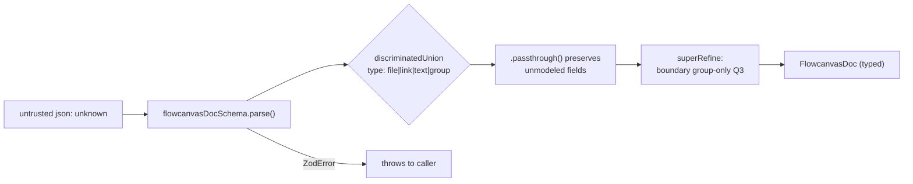

# Validate

- Pure TypeScript module that owns all runtime zod validation of `FlowcanvasDoc`. Nothing that touches an untrusted `.canvas` file enters the canvas without passing through `parseFlowcanvasDoc`.
- Path: `lib/canvas/validate.ts`; stack: TypeScript (zod).
- Public API: `flowcanvasDocSchema` (`z.ZodType<FlowcanvasDoc>`) and `parseFlowcanvasDoc(json: unknown): FlowcanvasDoc`.
- Generated at depth by `flowcode:module-explorer-agent`; meets its § Module Doc Completeness Bar — real signatures, a usage example, config/env, traced deps, conventions.
- Status active; generated by bootstrap; last updated 2026-06-30.

---

## Purpose

`validate.ts` is the single runtime gatekeeper for every `FlowcanvasDoc` value that enters the canvas from an untrusted source (clipboard paste, `.canvas` file upload, drag-drop). It defines `flowcanvasDocSchema` — a `z.discriminatedUnion` over the four node types, edges, and the `flowcanvas` extension block — and exports `parseFlowcanvasDoc` which runs `schema.parse(json)` and lets `ZodError` propagate to the caller to render. The module was created in plan-004 Phase 1 alongside `migrate.ts`; Phase 5 (`importDoc`/`importCanvasFile`) chains `parseFlowcanvasDoc → migrateDoc` as the canonical import pipeline. The module has no fs/DOM/network dependencies; it is pure and side-effect-free.

### Internal Architecture



---

## Public API

Concrete signatures only. No prose.

### Functions / Methods

```typescript
// flowcanvasDocSchema — z.ZodType<FlowcanvasDoc>
// Discriminated union over file/link/text/group nodes, edges, flowcanvas ext.
// Every member carries .passthrough() so unmodeled fields are never stripped.
// superRefine rejects meta.kind:'boundary' on any non-group node.
export const flowcanvasDocSchema: z.ZodType<FlowcanvasDoc>  // lib/canvas/validate.ts:20-39

// parseFlowcanvasDoc(json: unknown): FlowcanvasDoc
// Runs flowcanvasDocSchema.parse(json). Throws ZodError on invalid input — caller renders message.
export function parseFlowcanvasDoc(json: unknown): FlowcanvasDoc  // lib/canvas/validate.ts:42-44
```

The full literal schema (lines 6–39) for reference:

```typescript
// lib/canvas/validate.ts:6-39
const componentKind = z.enum(COMPONENT_KINDS as unknown as [string, ...string[]])
const nodeMeta = z.object({ kind: componentKind.optional() }).passthrough().optional()

const nodeBase = { id: z.string(), x: z.number(), y: z.number(), width: z.number(), height: z.number(),
  color: z.string().optional(), parentId: z.string().optional(), meta: nodeMeta }

const node = z.discriminatedUnion('type', [
  z.object({ type: z.literal('file'),  file: z.string(), subpath: z.string().optional(), ...nodeBase }).passthrough(),
  z.object({ type: z.literal('link'),  url: z.string(), ...nodeBase }).passthrough(),
  z.object({ type: z.literal('text'),  text: z.string(), ...nodeBase }).passthrough(),
  z.object({ type: z.literal('group'), label: z.string().optional(), ...nodeBase }).passthrough(),
])

export const flowcanvasDocSchema = z.object({
  nodes: z.array(node),
  edges: z.array(z.object({ id: z.string(), fromNode: z.string(), toNode: z.string() }).passthrough()),
  flowcanvas: z.object({
    // 006: new edge fields (fromPort/toPort/meta.edgeType) + node meta.ports are NOT modeled here —
    // they ride the existing .passthrough() on the edge object + nodeMeta, by design (the import
    // validator preserves unmodeled fields; it is not a write-time normalizer).
    schemaVersion: z.enum(['0.1', '0.2', '0.3', '0.4', '0.5']),   // 006-semantic-edges += '0.5'
    session: z.object({ createdAt: z.string(), updatedAt: z.string(), revision: z.number() }).passthrough(),
    comments: z.array(z.unknown()),
  }).passthrough(),
}).superRefine((doc, ctx) => {
  doc.nodes.forEach((n, i) => {
    if (n.meta?.kind === 'boundary' && n.type !== 'group') {
      ctx.addIssue({ code: z.ZodIssueCode.custom, path: ['nodes', i, 'meta', 'kind'],
        message: "meta.kind:'boundary' is valid only on a type:'group' node" })
    }
  })
}) as unknown as z.ZodType<FlowcanvasDoc>
```

### Classes

Not applicable — this module exports no classes.

### HTTP Routes (if applicable)

Not applicable — pure library, no HTTP surface.

### Events / Messages (if applicable)

Not applicable — no publish/subscribe surface.

### Exceptions / Errors

| Name | Raised When | Caught By |
|------|-------------|-----------|
| `ZodError` (from `zod`) | `parseFlowcanvasDoc` receives input that fails schema validation (wrong node type, unknown `schemaVersion`, unknown `ComponentKind`, `boundary` on non-group) | Phase 5 `importDoc`/`importCanvasFile` caller — renders error message to the user |

---

## Usage Examples

Real tests from `lib/canvas/validate.test.ts:22-49`:

```typescript
// lib/canvas/validate.test.ts:5-48
import { parseFlowcanvasDoc } from './validate'
import type { FlowcanvasDoc } from './jsoncanvas'

// Minimal valid doc factory used throughout the test suite
const docAt = (schemaVersion: string, nodes: unknown[] = []): unknown => ({
  nodes,
  edges: [],
  flowcanvas: {
    schemaVersion,
    session: { createdAt: '2026-01-01', updatedAt: '2026-01-01', revision: 0 },
    comments: [],
  },
})

// 1. Happy path — all three schema versions accepted
const doc = parseFlowcanvasDoc(docAt('0.3')) as FlowcanvasDoc
doc.flowcanvas.schemaVersion  // => '0.3'

// 2. boundary on a group node passes Q3
parseFlowcanvasDoc(docAt('0.3', [
  { id: 'g', type: 'group', x: 0, y: 0, width: 9, height: 9, meta: { kind: 'boundary' } },
]))  // => FlowcanvasDoc (no throw)

// 3. boundary on a file node is rejected (Q3 invariant)
parseFlowcanvasDoc(docAt('0.3', [
  { id: 'f', type: 'file', file: 'a.md', x: 0, y: 0, width: 9, height: 9, meta: { kind: 'boundary' } },
]))  // throws ZodError: "meta.kind:'boundary' is valid only on a type:'group' node"

// 4. Unknown schemaVersion rejected
parseFlowcanvasDoc(docAt('0.9'))  // throws ZodError

// 5. Unknown ComponentKind rejected
parseFlowcanvasDoc(docAt('0.3', [
  { id: 'f', type: 'file', file: 'a.md', x: 0, y: 0, width: 9, height: 9, meta: { kind: 'gateway' } },
]))  // throws ZodError
```

Real call site: `lib/canvas/validate.test.ts:2` (import) and lines 24–48 (every test case).

---

## Database Schema

Not applicable — this module owns no tables and performs no persistence.

---

## Dependencies

**Upstream modules:**
- `lib/canvas/jsoncanvas` — provides `FlowcanvasDoc` (the typed contract), `COMPONENT_KINDS` (the allowlist fed into `z.enum`), and `ComponentKind` type (`lib/canvas/validate.ts:3-4`)

**External services:**
- None — purely in-process, no network or filesystem calls.

**Key libraries:**
- `zod` — schema declaration and runtime parsing (`lib/canvas/validate.ts:2`); `z.discriminatedUnion`, `z.object`, `z.enum`, `z.array`, `.passthrough()`, `.superRefine()`, `ZodError`, `ZodIssueCode.custom`

---

## Configuration & Environment

Not applicable — this module reads no environment variables or config keys.

---

## Run / Test / Lint

Commands scoped to this module. Cross-reference full project gates in `.flowcode/quality-checks/quality-checks-index.md`.

| Action | Command |
|--------|---------|
| Test (unit) | `npx vitest run lib/canvas/validate.test.ts` |
| Test (all canvas) | `npx vitest run lib/canvas/` |
| Test (full suite) | `npm test` |
| Lint | `npm run lint` |
| Typecheck | `npx tsc --noEmit` |

---

## Key Insights

**Conventions & patterns:**

- `.passthrough()` on every node variant and the edge object is a **deliberate design decision**, not an oversight. Import validation must be non-destructive: unmodeled fields (`GroupNode.background`, `backgroundStyle`, edge `fromSide`/`toSide`) must survive a parse round-trip unchanged. Removing `.passthrough()` from any node member silently strips those fields — a data-loss bug that was found and fixed during Phase 1 design (`lib/canvas/validate.ts:11` comment).
- The `superRefine` callback enforces the "boundary is group-only" invariant (Q3) at the zod level (`lib/canvas/validate.ts:28-36`). This is intentionally not a TypeScript type constraint — it is a runtime rule that guards against agent-generated or user-crafted JSON violating the semantic contract.
- `parseFlowcanvasDoc` is intentionally thin — it calls `schema.parse(json)` and lets `ZodError` propagate. The caller owns error presentation. This keeps the module free of UI concerns.

**Gotchas & invariants:**

- The double cast `as unknown as z.ZodType<FlowcanvasDoc>` at `lib/canvas/validate.ts:39` is required because `superRefine()` widens the inferred type and `.passthrough()` loosens structural assignability — the zod-inferred type is not directly assignable to `FlowcanvasDoc`. This is a type-level workaround; the runtime behavior is correct. Do not remove the cast without verifying the full type chain compiles.
- `COMPONENT_KINDS` is a `readonly ComponentKind[]` array, not a tuple, so it cannot be passed directly to `z.enum()` (which requires `[string, ...string[]]`). The cast `as unknown as [string, ...string[]]` at `lib/canvas/validate.ts:6` is required and correct; the values themselves are correct because `COMPONENT_KINDS` is the authoritative source in `jsoncanvas.ts`.
- `flowcanvasDocSchema` is exported as a `z.ZodType<FlowcanvasDoc>`, meaning callers can call `.parse()`, `.safeParse()`, or `.parseAsync()` on it directly — not just `parseFlowcanvasDoc`. The export is intentional for consumers that need the raw schema (e.g., future MCP tool input validation).
- Phase 5 pipeline (`importDoc` / `importCanvasFile`, plan-004) chains `parseFlowcanvasDoc(json) → migrateDoc(doc)`. The validate step must come first — `migrateDoc` assumes a structurally valid doc.
- The schema accepts `schemaVersion '0.1' | '0.2' | '0.3' | '0.4' | '0.5'` (all historical versions; 005-edges added `'0.4'`, 006-semantic-edges added `'0.5'` at `lib/canvas/validate.ts:27`) so that older `.canvas` files can pass through `parseFlowcanvasDoc` before `migrateDoc` upgrades them. This is by design; the schema is an import validator, not a write-time normalizer. The 005-edges style fields (`color`, `fromSide`/`toSide`, `fromEnd`/`toEnd`, `meta.routing`/`line`/`labelT`/`points`) and the 006-semantic-edges fields (`fromPort`/`toPort`/`meta.edgeType` on edges, `meta.ports` on nodes) are intentionally NOT modeled individually — they all survive via `.passthrough()` on the edge object and `nodeMeta` respectively (`lib/canvas/validate.ts:22`, `lib/canvas/validate.ts:7`, comment at `lib/canvas/validate.ts:24-26`).

---

## Known Gaps

- Phase 5 (`importDoc`/`importCanvasFile`) is planned but not yet implemented as of plan-004 Phase 1 close; `parseFlowcanvasDoc` is defined and tested but has no in-tree caller outside `validate.test.ts` until Phase 5 lands.
- The `flowcanvas.comments` field is validated as `z.array(z.unknown())` — individual comment shape is not validated at the schema level. A stricter `Comment` schema could be added when comment integrity at import time becomes a requirement.
