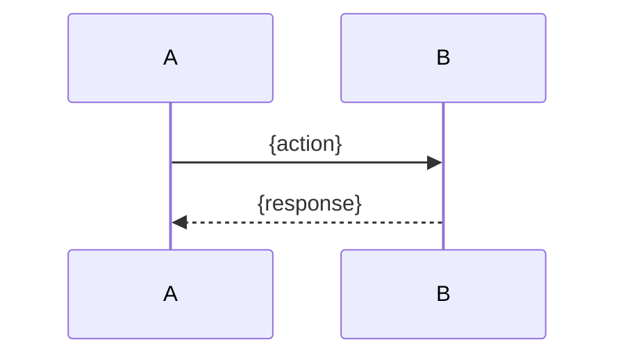

# {PREFIX} — {Feature Name} Design

- {One-line digest of the chosen solution and why it wins.}
- Scope — in: {essentials}; out: {essentials}.
- Key architecture decisions: {decision} → {choice}.
- Status {draft|approved}; author {agent | human}; dated {DATE}.
- Sibling plan: `{PREFIX}-plan.md` (created after this design is approved).

---

## Problem Statement

{What problem does this solve? Who is affected? What breaks or remains impossible without this change?}

## Scope

**In scope:**
- {item}

**Out of scope:**
- {item}

## Solution Overview

{1–3 paragraphs describing the chosen approach. Explain the *why*, not just the *what*. What makes this approach better than the alternatives considered below?}

## Alternatives Considered

High-level approach alternatives evaluated before this design was locked in. Per-component decisions live under Architecture Decisions.

| Approach | Why considered | Why rejected |
|----------|---------------|--------------|
| {Approach A} | | |
| {Approach B} | | |

**Chosen:** {reference to Solution Overview above}
**Key rationale:** {1–2 sentences — constraints, tradeoffs, or deciding factors}

## Architecture Decisions

### Decision 1: {Title}

**Options considered:**

| Option | Pros | Cons |
|--------|------|------|
| A — {name} | | |
| B — {name} | | |

**Decision:** {chosen option}
**Rationale:** {why — be specific, reference constraints or requirements}

### Decision 2: {Title}

{same structure — add as many decisions as needed}

---

## Technical Design

### Data Models

```sql
-- Tables, columns, types, indexes, constraints
-- Or TypeScript types / Go structs / Pydantic models with full field specs
{DDL, schema definitions, or type signatures — complete, not placeholder}
```

### Enums & Constants

```text
{Full enum catalog — every value and its meaning. No "add later".}
```

### API / Interface Contracts

```text
{Endpoint signatures, function signatures, Protocol / ABC / interface definitions}
{Include request/response shapes, error codes, and constraints}
```

### Sequence / Flow Diagrams



### Module Boundaries

| Module | Responsibility | Changes Required |
|--------|---------------|-----------------|
| | | |

---

## Constraints & Risks

| Constraint / Risk | Impact | Mitigation |
|-------------------|--------|-----------|
| | | |

## Research References

| Topic | File | Key Finding |
|-------|------|-------------|
| | `.flowcode/researches/{slug}-research.md` | |

## Open Questions

- [ ] {question that must be resolved before implementation begins}
