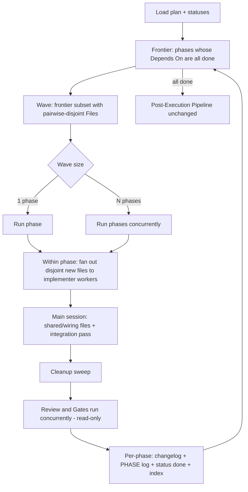

# Plan 008 — Parallel-Aware Plan Execution

**Status:** Draft
**Date:** 2026-06-26
**Scope:** `flowcode/agent-tools/agents/flowcode/implementer-agent.md` (new), `flowcode/templates/plan-template.md`, `flowcode/agent-tools/agents/flowcode/planner-agent.md`, `flowcode/plans/plan-instructions.md`, `flowcode/agent-tools/skills/flowcode/execute/SKILL.md`, `flowcode/workflow/flowcode-workflow.md`, `flowcode/flowcode-index.md`, `flowcode/changelog.md`, `flowcode/framework-manifest.json` (version)
**Type:** Plan lifecycle redesign (dev-plan for building flowcode itself)
**Related prior plans:** none directly; touches the execute/plan/planner surfaces
**Framework version:** bumps `0.9.1 → 0.10.0`
**Decisions (locked with user):** within-phase fan-out + inter-phase waves, no git worktrees · dedicated implementer workers · advisory/judgment enforcement (sequential fallback always valid)

---

## Context

Plan execution in flowcode is slow because it is strictly linear, and it is linear because plans were never *designed* to be parallel. Two coupled gaps cause this:

1. **Design-time (root cause).** `planner-agent.md` decomposes a design into phases optimized for *review-ability, revertibility, scope coherence* — never *independence*. The plan template (`plan-template.md`) carries no field expressing which phases or which work units inside a phase are independent. The structure reaching execution is therefore an implicitly-linear chain.
2. **Execution-time.** `execute/SKILL.md` is a strict sequential loop ("Repeat steps 2–3 until every phase is `done`"); the 6-step Phase Close Sequence runs serially within each phase. `flowcode-workflow.md § Parallelism Rules` even *excludes* phase work from flowcode's own parallelism doctrine ("Within a single phase's implementation work … is sequential by definition").

Flowcode already fans out aggressively for research, module exploration, docs, and post-exec artifacts — phases are the one place it doesn't. The real example (`flowcanvas/.flowcode/plans/001-initial-architecture/`) also exposes a trap: nearly every phase funnels through `store.ts` + `canvas-shell.tsx`, so coarse phase-parallelism alone helps little there — the larger safe win is *within-phase* fan-out of disjoint files plus overlapping the read-only close steps.

**Outcome:** plans become parallel-aware. The planner emits one new primitive (`Depends On`); the executor derives parallel **waves** of independent phases, fans out disjoint file creation to **implementer workers**, and overlaps the read-only close steps — all **advisory** (judgment-based, sequential fallback always valid, never a framework breach). No git worktrees: concurrency is allowed only when file targets are provably disjoint in a shared tree.

---

## Approach

### The single new primitive: `Depends On` (per phase)

One field added to each phase block. It expresses *ordering/semantic* dependency (which earlier phases must be `done` first). Default `[none]` = a root phase.

```markdown
**Depends On:** [none]            # root — nothing blocks it
**Depends On:** [Phase 1]         # needs Phase 1 done
**Depends On:** [Phase 1, Phase 3]
```

Two **independent** signals gate concurrency — both must hold to run two phases together:
- **Dependency (explicit):** neither phase lists the other (transitively) in `Depends On`.
- **Conflict (derived, write-safety):** their `Files to create / modify:` tables share **no** path. Computed from the existing Files tables — no new primitive. Two dependency-independent phases that nonetheless write the same file are **serialized** to avoid write races.

This reuses the existing `Touched Modules` + `Files` tables for conflict detection, keeping it to one authored field (matches the "prefer single primitive" rule).

### Waves (inter-phase parallelism, shared tree)

The executor repeatedly computes a **frontier** (phases not `done` whose `Depends On` are all `done`), then greedily selects a **wave** = a frontier subset whose Files tables are pairwise path-disjoint. A single-phase wave behaves exactly like today (zero behavior change); a multi-phase wave runs concurrently and **closes once**:

- Implementation of all wave phases runs concurrently.
- **One** Phase Close Sequence for the wave: review covers the union of changed files; gates (`build`/`test`/`lint`) run **once** on the integrated tree (this is what we want — integration correctness).
- **Per-phase bookkeeping is preserved:** each phase still gets its own `[PHASE]` log entry, its own `## Phase N` changelog section, its own `Phase Status → done` flip, and its own `plan-index.md` progress increment. Revertibility holds because wave phases are file-disjoint by construction.

### Within-phase fan-out: `flowcode:implementer-agent` (new sonnet worker)

Inside any phase (wave size 1 or N), disjoint **new-file** work is dispatched to parallel implementer workers; **shared/wiring files** (modify-ops on existing files imported by many — e.g. `store.ts`, `canvas-shell.tsx`) stay in the main session and are written serially *after* workers return.

Coherence guardrails (the quality risk the user accepted):
- Every worker receives the **same** phase design slice + module contracts (signatures/types it must conform to) + conventions, so all workers build to one contract.
- **Exclusive file ownership:** the executor partitions the Files table; a path is never assigned to two workers, and shared files are reserved for the main session.
- A worker that discovers it needs an unowned/shared file **stops and reports** — it never touches it.
- Workers return a **compact report** (files written, exported symbols + signatures, deviations) — never full code back into context.
- The main session does the **integration pass** (wiring, imports, cross-file consistency) using the workers' exported-symbol reports; the close-sequence review is the safety net.

### Read-only close overlap

Within the close sequence, after the mutating **cleanup sweep**, dispatch **code review ∥ gates** concurrently — both are read-only on source. Advisory: on a clean review the parallel gate run stands; if review yields `critical`/`high` requiring a code fix, re-run gates after the fix (same effective ordering as today, just optimistically overlapped).

### Advisory, not mandatory

Phase-execution parallelism is **opt-in/judgment-based** — explicitly unlike flowcode's 5 *mandatory* parallelism rules. The executor falls back to sequential whenever files aren't cleanly disjoint, context is tight, or confidence is low. Running phases sequentially is **never** a framework breach. This divergence is stated where it could otherwise contradict `flowcode-workflow.md § Parallelism Rules`.

### Capability surface

No new command/skill. `implementer-agent` is an internal worker (same pattern as `code-reviewer-agent`/`qa-runner-agent`/`artifact-updater-agent` — workers with no standalone command). The user-facing capability rides the **existing** dual-surface `/flowcode:execute` command + `flowcode:execute` skill, satisfying the dual-surface rule.

### Diagram



---

## Phases

### Phase 1 — New worker: `implementer-agent`
- [ ] Create `flowcode/agent-tools/agents/flowcode/implementer-agent.md` — sonnet worker. Frontmatter (`name: flowcode:implementer-agent`, `model: sonnet`, `tools: Read, Glob, Grep, Write, Edit`) + ≤10-bullet summary per `file-conventions.md`. Spec: input contract (phase design slice, **exclusive** owned-file list, module contracts, conventions, slice acceptance criteria); hard rules (write only owned files; stop+report on any unowned/shared-file need; never run gates or git); compact return format (files written, exported symbols + signatures, deviations). Mirror structure/tone of `code-reviewer-agent.md` / `qa-runner-agent.md`.

### Phase 2 — Authored primitive + planner
- [ ] `flowcode/templates/plan-template.md` — add `**Depends On:** [none]` to each `## Phase N` block (right after `**Evaluation:**`); add a `Depends On` column to the **Phases Catalog**; one guidance line that disjoint new files in `Files to create / modify` are the unit of within-phase fan-out.
- [ ] `flowcode/agent-tools/agents/flowcode/planner-agent.md` — Step 2: after the existing criteria, **annotate each phase's `Depends On`** and *prefer decompositions that surface genuinely independent phases* where the design allows — **without** padding or inventing independence (advisory). Step 3: emit the `Depends On` field per phase.

### Phase 3 — The law + executor
- [ ] `flowcode/plans/plan-instructions.md` (non-overridable — edit precisely): new section **`§ Phase Dependencies & Waves`** (define `Depends On`, frontier→wave derivation, disjoint-Files conflict guard, combined wave-close with per-phase bookkeeping, **advisory** clause stating sequential fallback is valid and not a breach); update `§ Phase Execution` for wave-granularity close + **review ∥ gates** overlap + implementer fan-out; note the QA `## Check` heading may name multiple phases (`— Phase 1+2`), `qa-probe-gate.js` unaffected. Keep Phase-Close Minimum + Halt Conditions unchanged.
- [ ] `flowcode/agent-tools/skills/flowcode/execute/SKILL.md` — rewrite the Procedure loop: **compute frontier → select wave → fan out implementation → integrate → overlapped close → recompute**. Stay a thin sequencer that points at `plan-instructions.md` (never restate the law). Single-phase waves must read identically to today.

### Phase 4 — Doctrine + registry
- [ ] `flowcode/workflow/flowcode-workflow.md` — `§ Parallelism Rules`: add 6th entry **"Phase Execution (advisory)"**, explicitly contrasting the 5 mandatory rules; revise the "within a single phase's implementation work … is sequential" line (disjoint new-file creation within a phase **may** fan out; only the implement→review→fix cycle *for a given file* stays sequential). Register `flowcode:implementer-agent` in the **Sub-Agent Dispatch Table** + **Model Routing** (sonnet).
- [ ] `flowcode/flowcode-index.md` — register `implementer-agent.md` in the agent-tools roster + dispatch table with its load type. Verify/update any `agents/flowcode/` index if one exists.
- [ ] Bump version `0.9.1 → 0.10.0` and add a `flowcode/changelog.md` entry (Added/Changed list) per the changelog-driven convention.

---

## Reuse (don't reinvent)

- **Conflict detection** = path overlap across the existing `Files to create / modify:` tables. No new structure.
- **Worker dispatch pattern** = copy the existing parallel-dispatch idiom used for `module-explorer-agent` (bootstrap Step 3.5, batches of ~6) and the research/docs skills — "share scoped context, return a short report."
- **Combined-close bookkeeping** reuses the existing per-phase changelog/log/status/index writes via `artifact-updater-agent` — invoked per phase within one wave close.
- **Capability surface** reuses the existing `/flowcode:execute` dual surface — no new command/skill.

---

## Verification

1. **Static/lint:** every edited/new `.md` passes the hooks — `frontmatter-summary-check.js`, `harness-leak-check.js` (wired names only, no harness paths), `markdown-quality-check.js` (valid mermaid/fences), `artifact-naming-check.js`.
2. **Bundle integrity:** run `./bundle.sh` (or `node bundle.js`) — kernel build + fail-closed self-check still pass with the new agent file present (no allowlist drift; adding files only inside existing dirs needs no `bundle.js` change — confirm).
3. **Doc-consistency self-review:** `plan-instructions.md` (law), `execute/SKILL.md` (sequencer), `flowcode-workflow.md` (doctrine/registry), `plan-template.md`, `planner-agent.md` agree on the `Depends On` field name/format, wave derivation, advisory status, and the implementer-agent contract. No rule stated twice.
4. **End-to-end dry run on the host example:** against `flowcanvas/.flowcode/plans/001-initial-architecture/`, hand-derive `Depends On` for its 7 phases and confirm the algorithm (a) **serializes** the store.ts/canvas-shell.tsx-sharing phases (proves the conflict guard on a real shared-file case) and (b) still **fans out** disjoint within-phase file sets (Phase 4's 6 node components, Phase 3's 8 API routes). Validates the design against the exact slowness reported.
5. **Backward-compat check:** a plan whose phases are fully chained (or pre-`Depends On` legacy) executes identically to today (single-phase waves), confirming the change is additive and the sequential fallback is real.
