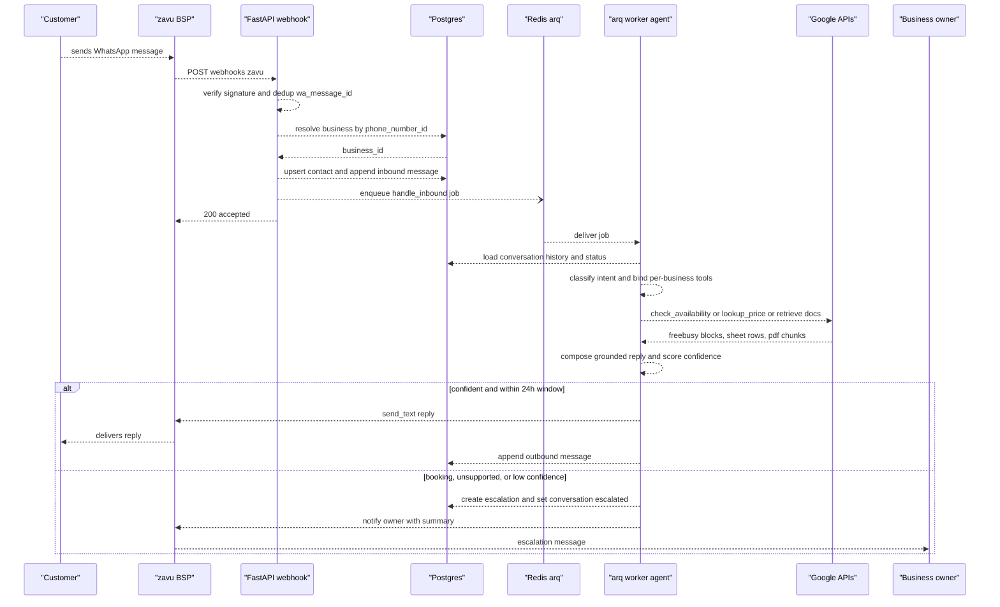
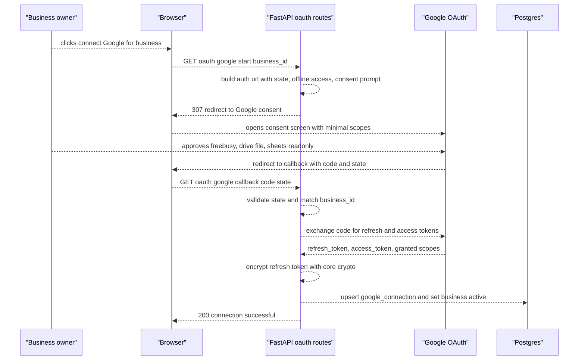

# msgflow-mvp — WhatsApp AI Customer Assistant Design

- A business connects its WhatsApp number (via zavu.dev) and its Google Workspace; an AI agent identifies the customer and auto-answers business/availability/price/Q&A questions grounded in that business's own Google data, escalating bookings and low-confidence cases to the owner on WhatsApp.
- Scope — in: multi-tenant data + central FastAPI app, zavu channel adapter, build-contacts-over-time identity, per-business Google OAuth, LangGraph+OpenRouter agent with Calendar/Drive/Sheets grounding tools, hybrid automation. Out: appointment booking, billing/self-signup, proactive outbound, admin UI, extra channels.
- Key decisions: channel → zavu.dev behind an adapter; deployment → central multi-tenant app + shared Postgres; LLM → LangGraph + OpenRouter (model-agnostic); identity → build-over-time; calendar → read-only now; prices → Google Sheet; escalation → notify owner on WhatsApp.
- Stack: Python 3.12 · FastAPI · LangGraph · OpenRouter · PostgreSQL + pgvector · SQLAlchemy/Alembic · Pydantic v2 · Google API clients · Docker Compose.
- Status: approved; author human (scope) + designer-agent (technical depth); dated 2026-06-28. Implementation decisions made while writing the plan at full depth are recorded in § Resolved Implementation Decisions (2026-06-28) so this design and `msgflow-mvp-plan.md` stay in agreement.
- Sibling plan: `msgflow-mvp-plan.md` (created after this design is approved).

---

## Problem Statement

A business receives a steady stream of inbound WhatsApp messages from customers asking the same recurring questions: what the business does, when it is available (agenda), how much its services cost, and general document-based questions about the company. Answering these manually is slow, doesn't scale, and consumes the owner's time during and outside working hours.

Without msgflow, every inbound message needs a human to read it, look up the answer (in a calendar, a price list, or company documents), and reply — so response times are slow, the owner is constantly interrupted, and prospective customers go unanswered. msgflow removes that toil by auto-answering routine questions from the business's own source-of-truth data, while still routing anything that needs a human (a booking, an unusual request, a low-confidence answer) to the owner.

## Success Criteria

- A customer messaging a connected business's WhatsApp receives a **correct, grounded** reply (business info, availability, service price, or PDF-based Q&A) within seconds, in the customer's language.
- Replies are **grounded** in the business's own Google data — no hallucinated prices or hours. When the data does not cover the question, or the request is a booking / complex / low-confidence case, the bot **escalates to the owner on WhatsApp** and pauses auto-replies for that conversation.
- **Returning customers are recognized** — a contact record is built over time (phone + WhatsApp profile name + conversation history) and reused on the next contact.
- A **new business is onboarded without code changes**: connect zavu, complete Google OAuth, and point the system at the prices Sheet and the company-PDF Drive folder via configuration.
- **Low run cost**: zavu free tier (2,000 WhatsApp msgs/mo) + cheap models via OpenRouter ≈ pennies per conversation.
- Measurable targets to validate post-MVP: share of inbound messages resolved without escalation; grounding accuracy (answers traceable to source); median reply latency.

## Scope

**In scope:**

- Multi-tenant data model (`business_id` on every record) on a single shared PostgreSQL.
- A single central FastAPI application (multi-tenant) that ingests zavu webhooks and routes by business.
- **Channel adapter** abstraction with one concrete adapter: **zavu.dev** (inbound webhook ingest + outbound send).
- Customer identity via **build-contacts-over-time** (phone + WhatsApp profile name + conversation history).
- **Per-business Google OAuth** onboarding with securely stored refresh tokens. Minimal scopes: `calendar.freebusy`/`calendar.readonly`, `drive.file`, `sheets.readonly`.
- **AI agent** (LangGraph orchestration + OpenRouter model) with grounding tools: Calendar free/busy (availability), Drive-PDF Q&A (retrieval), price lookup (Google Sheet), and escalate-to-human.
- **Hybrid automation**: auto-reply for info/availability/price/Q&A; escalate bookings and low-confidence cases to the owner.

**Out of scope:**

- Appointment booking / Calendar write (deferred to a later phase; design leaves room for it).
- SaaS billing, subscriptions, and tenant self-signup.
- Proactive / marketing outbound messaging.
- A full admin web UI / inbox (escalation is WhatsApp-native, so the MVP is backend-only).
- Additional channels (Telegram, Email) — zavu supports them, but they are deferred.

## Solution Overview

msgflow is a backend service that sits between a business's WhatsApp (hosted by zavu.dev) and its Google Workspace. When a customer messages the business, zavu delivers the message to msgflow via webhook. msgflow resolves which business the message belongs to, upserts the customer contact and appends the message to the conversation, then hands the conversation to a LangGraph agent. The agent — running on a cheap, swappable model through OpenRouter — classifies the intent and calls grounding tools that read the business's own Google data (Calendar free/busy for availability, a designated Google Sheet for prices, and the business's company PDFs in Drive for document Q&A). It composes a grounded reply and, when confident, sends it back through zavu; when the request is a booking, is unsupported, or the agent's confidence is low, it escalates to the business owner on WhatsApp and pauses auto-replies for that conversation.

The architecture is deliberately **light and central**. Because zavu hosts the WhatsApp session, msgflow runs no stateful messaging process of its own — it is a stateless FastAPI app plus a shared multi-tenant PostgreSQL. That makes a single central deployment far cheaper to operate than one box per business, while a **channel adapter** interface and **config-driven per-business setup** keep the door open to (a) swapping zavu for the official Cloud API on a per-business basis if a number is ever at risk, and (b) peeling a heavy business onto its own deployment later. The LLM is held behind a provider abstraction so the model can be swapped (or upgraded for the hard reasoning step) without touching agent logic.

## Alternatives Considered

High-level product-shape alternatives evaluated before this design was locked. Per-component decisions live under Architecture Decisions.

| Approach | Why considered | Why rejected |
|----------|---------------|--------------|
| Single-tenant appliance (one full stack per business on its own VPS) | Simplest code; strong physical isolation; cheap VPS | Once the channel is hosted by zavu there is no heavy session to isolate, so N boxes are pure ops overhead; shared multi-tenant DB already requires `business_id` scoping anyway |
| Multi-tenant SaaS, fully central | Least ops; best economics at scale | Adopted in essence — this is the chosen shape; the only thing dropped is self-hosting the channel |
| Self-hosted Evolution API + per-business compute | Free software; community-popular; multi-instance | Baileys mode carries account-ban risk; running a stateful session process reintroduces the ops/isolation problem zavu removes |

**Chosen:** Central multi-tenant FastAPI app + shared PostgreSQL, with a hosted channel (zavu) behind a swappable adapter — see Solution Overview.
**Key rationale:** A hosted official channel removes the only strong reason to distribute compute, so the cheapest-to-operate shape (one central, stateless app) wins without sacrificing isolation or reversibility.

## Architecture Decisions

### Decision 1: WhatsApp channel

**Options considered:**

| Option | Pros | Cons |
|--------|------|------|
| A — zavu.dev (hosted, official, multi-channel) | Free tier (2k msgs/mo); low ban risk; WhatsApp+Email+Telegram via one API; no session to host | Third-party dependency; exact official-API delivery to confirm at integration |
| B — Meta Cloud API (direct) | Lowest cost at scale; full control; official | Heavier setup (Meta app, WABA, webhooks); more to operate |
| C — Self-hosted Evolution API (Baileys) | Free software; popular | Account-ban risk; stateful process to run and isolate |

**Decision:** zavu.dev, accessed only through a `ChannelAdapter` interface so it is swappable.
**Rationale:** Lowest operational burden and cost for an MVP, official (low ban risk), and the adapter preserves the option to move a business to the Cloud API later without touching the core. See `whatsapp-connectivity-options-research.md`.

### Decision 2: Deployment topology

**Options considered:**

| Option | Pros | Cons |
|--------|------|------|
| A — Central multi-tenant app + shared Postgres | One deployment to run/patch/monitor; cheapest at low N | Shared blast radius (mitigated: channel is hosted, app is stateless) |
| B — Per-business VPS + shared Postgres | Strong per-business isolation | N boxes to provision and update; each needs secure DB access; unnecessary once channel is hosted |

**Decision:** Central multi-tenant app + shared PostgreSQL; every record carries `business_id`.
**Rationale:** With zavu hosting the channel, the app is stateless and light, so a single central deployment is the least to operate while the shared DB already enforces tenant scoping.

### Decision 3: LLM / agent orchestration

**Options considered:**

| Option | Pros | Cons |
|--------|------|------|
| A — LangGraph + OpenRouter | Framework handles tool-calling + conversation state; cheap, swappable models | Tool-calling reliability depends on the chosen model |
| B — Hand-rolled tool loop + direct provider API | Minimal dependencies | Reimplements agent loop and conversation parsing; more to maintain |
| C — Claude API | Strong tool-use/reasoning | Cost — explicitly out per owner's decision |

**Decision:** LangGraph for orchestration, OpenRouter as the model gateway, behind an internal `LlmProvider` abstraction.
**Rationale:** Meets the owner's "easy and effective, don't hand-roll tool-calling" requirement at a fraction of Claude's cost; the abstraction allows per-step model selection and a stronger fallback for the hard reasoning step.

### Decision 4: Customer identity

**Decision:** Build contacts over time — on first inbound message, upsert a contact keyed by phone number, capture the WhatsApp profile name, and accumulate conversation history; reuse on return.
**Rationale:** No existing CRM to integrate; lowest-friction path that still recognizes returning customers and gives the agent context.

### Decision 5: Calendar capability

**Decision:** Read-only availability now (Calendar free/busy); appointment booking (Calendar write) deferred to a later phase.
**Rationale:** Lowest risk to ship; `freebusy.query` exposes availability without leaking event details; the data model and tool interface leave room to add `events.insert` later. See `google-workspace-integration-research.md`.

### Decision 6: Price source

**Decision:** A designated **Google Sheet** is the canonical price source, read via the Sheets API (`sheets.readonly`).
**Rationale:** The Forms API is not a price store (it exposes questions and submitted responses, not a clean price list); a Sheet is robust, owner-maintainable, and trivial to read. Forms-as-source rejected as brittle.

### Decision 7: Human escalation

**Decision:** Notify the owner on WhatsApp with the conversation + a take-over prompt, and pause auto-replies for that conversation (no web UI).
**Rationale:** Keeps the MVP backend-only and fastest to ship; the owner replies from their own WhatsApp. A web inbox is deferred.

## Technology Stack

The foundational stack for the greenfield project — this is the source bootstrap uses to scaffold the structure and populate `project-overview.md`.

| Layer | Technology | Why |
|-------|------------|-----|
| Language | Python 3.12+ | Best ecosystem for LLM/agent + Google API clients + PDF parsing |
| Web / API | FastAPI + Uvicorn | Async webhook ingestion; clean typing with Pydantic |
| Agent orchestration | LangGraph (+ langchain-core) | Manages the tool-calling loop and conversation state |
| LLM gateway | OpenRouter (OpenAI-compatible) | One endpoint to cheap, swappable models (DeepSeek/Qwen/GLM) |
| WhatsApp channel | zavu.dev (hosted) | Official, free tier, multi-channel; behind a channel adapter |
| Database | PostgreSQL + pgvector | Shared multi-tenant store; pgvector for PDF-chunk embeddings |
| ORM / migrations | SQLAlchemy (async, asyncpg) + Alembic | Typed data access and versioned schema |
| Models / validation | Pydantic v2 + pydantic-settings | Typed DTOs and env-driven config |
| Google APIs | google-api-python-client, google-auth-oauthlib | Calendar, Drive, Sheets access |
| PDF extraction | pypdf (fallback pdfplumber) | Drive PDF bytes to text before retrieval |
| Async jobs | Redis + arq | Process webhooks off the request path (ACK fast, work async) |
| Packaging | uv | Fast, modern Python dependency management |
| Container | Docker + Docker Compose | App + Postgres + Redis as one deployable stack |
| Testing | pytest + pytest-asyncio + httpx | Unit and API tests |
| Quality | Ruff + mypy | Lint/format and static typing |

---

## Technical Design

### Data Models

All domain tables carry `business_id` for tenant scoping and are always queried with an explicit `WHERE business_id = :bid` predicate. Primary keys are UUIDs (`gen_random_uuid()`); timestamps are `TIMESTAMPTZ` (`created_at` defaults to `now()`, `updated_at` maintained by SQLAlchemy `onupdate`). Secret material (zavu API keys, Google refresh/access tokens) is stored as `BYTEA` ciphertext produced by the application-level envelope encryption in `core.crypto` (AES-256-GCM under a key-encryption-key from the environment); a `secret_key_version` column on each secret-bearing table supports key rotation without a data migration. The pgvector and pgcrypto extensions are enabled by the first migration.

```sql
CREATE EXTENSION IF NOT EXISTS vector;
CREATE EXTENSION IF NOT EXISTS pgcrypto;

-- ── Enum types (map 1:1 to the Python enums in § Enums & Constants) ──
CREATE TYPE business_status        AS ENUM ('onboarding', 'active', 'suspended');
CREATE TYPE channel_provider       AS ENUM ('zavu');
CREATE TYPE google_token_status    AS ENUM ('active', 'expired', 'revoked');
CREATE TYPE knowledge_source_kind  AS ENUM ('prices_sheet', 'pdf_drive_folder');
CREATE TYPE document_ingest_status AS ENUM ('pending', 'processing', 'ready', 'failed');
CREATE TYPE conversation_status    AS ENUM ('auto', 'escalated', 'paused');
CREATE TYPE message_direction      AS ENUM ('inbound', 'outbound');
CREATE TYPE message_status         AS ENUM ('queued', 'sent', 'delivered', 'read', 'failed');
CREATE TYPE agent_intent           AS ENUM ('business_info', 'availability', 'pricing', 'document_qa', 'booking', 'other');
CREATE TYPE escalation_reason      AS ENUM ('booking_request', 'low_confidence', 'unsupported', 'explicit_request');
CREATE TYPE escalation_status      AS ENUM ('open', 'resolved');

-- ── business: the tenant ──
CREATE TABLE business (
    id              UUID PRIMARY KEY DEFAULT gen_random_uuid(),
    name            TEXT            NOT NULL,
    slug            TEXT            NOT NULL,
    status          business_status NOT NULL DEFAULT 'onboarding',
    owner_phone     TEXT            NOT NULL,            -- E.164, WhatsApp number escalations are sent to
    default_language TEXT           NOT NULL DEFAULT 'pt-BR',  -- BCP-47
    timezone        TEXT            NOT NULL DEFAULT 'America/Sao_Paulo',  -- IANA tz for availability math
    business_hours  JSONB           NOT NULL DEFAULT '{}'::jsonb,  -- {weekday: [{open,close}]} for free-slot derivation
    created_at      TIMESTAMPTZ     NOT NULL DEFAULT now(),
    updated_at      TIMESTAMPTZ     NOT NULL DEFAULT now(),
    CONSTRAINT uq_business_slug UNIQUE (slug)
);

-- ── channel_credential: per-business zavu config (secret encrypted) ──
CREATE TABLE channel_credential (
    id                    UUID PRIMARY KEY DEFAULT gen_random_uuid(),
    business_id           UUID NOT NULL REFERENCES business (id) ON DELETE CASCADE,
    provider              channel_provider NOT NULL DEFAULT 'zavu',
    wa_phone_number       TEXT NOT NULL,                -- business WhatsApp number, E.164
    wa_phone_number_id    TEXT NOT NULL,                -- provider id used to route inbound webhooks
    api_key_encrypted     BYTEA NOT NULL,
    webhook_secret_encrypted BYTEA,                     -- for inbound signature verification
    secret_key_version    SMALLINT NOT NULL DEFAULT 1,
    status                business_status NOT NULL DEFAULT 'active',
    created_at            TIMESTAMPTZ NOT NULL DEFAULT now(),
    updated_at            TIMESTAMPTZ NOT NULL DEFAULT now(),
    CONSTRAINT uq_channel_route UNIQUE (provider, wa_phone_number_id)
);
CREATE INDEX idx_channel_credential_business ON channel_credential (business_id);

-- ── google_connection: per-business OAuth (refresh token encrypted) ──
CREATE TABLE google_connection (
    id                       UUID PRIMARY KEY DEFAULT gen_random_uuid(),
    business_id              UUID NOT NULL REFERENCES business (id) ON DELETE CASCADE,
    google_account_email     TEXT NOT NULL,
    refresh_token_encrypted  BYTEA NOT NULL,
    access_token_encrypted   BYTEA,                     -- cached short-lived token (optional)
    access_token_expires_at  TIMESTAMPTZ,
    granted_scopes           TEXT[] NOT NULL,           -- exact scope strings granted at consent
    calendar_id              TEXT NOT NULL DEFAULT 'primary',  -- calendar queried for freebusy
    secret_key_version       SMALLINT NOT NULL DEFAULT 1,
    token_status             google_token_status NOT NULL DEFAULT 'active',
    connected_at             TIMESTAMPTZ NOT NULL DEFAULT now(),
    last_refreshed_at        TIMESTAMPTZ,
    created_at               TIMESTAMPTZ NOT NULL DEFAULT now(),
    updated_at               TIMESTAMPTZ NOT NULL DEFAULT now(),
    CONSTRAINT uq_google_connection_business UNIQUE (business_id)
);

-- ── knowledge_source: per-business pointers to Sheet + Drive folder ──
CREATE TABLE knowledge_source (
    id              UUID PRIMARY KEY DEFAULT gen_random_uuid(),
    business_id     UUID NOT NULL REFERENCES business (id) ON DELETE CASCADE,
    kind            knowledge_source_kind NOT NULL,
    google_file_id  TEXT NOT NULL,                      -- Sheet id or Drive folder id
    display_name    TEXT,
    config          JSONB NOT NULL DEFAULT '{}'::jsonb, -- e.g. prices: {range, name_col, price_col, unit_col}
    last_synced_at  TIMESTAMPTZ,
    status          document_ingest_status NOT NULL DEFAULT 'pending',
    created_at      TIMESTAMPTZ NOT NULL DEFAULT now(),
    updated_at      TIMESTAMPTZ NOT NULL DEFAULT now(),
    CONSTRAINT uq_knowledge_source UNIQUE (business_id, kind, google_file_id)
);
CREATE INDEX idx_knowledge_source_business ON knowledge_source (business_id);

-- ── contact: per-business customer, built over time ──
CREATE TABLE contact (
    id              UUID PRIMARY KEY DEFAULT gen_random_uuid(),
    business_id     UUID NOT NULL REFERENCES business (id) ON DELETE CASCADE,
    phone           TEXT NOT NULL,                      -- E.164
    wa_profile_name TEXT,
    display_name    TEXT,                               -- owner-editable later
    locale          TEXT,                               -- detected language, BCP-47
    first_seen_at   TIMESTAMPTZ NOT NULL DEFAULT now(),
    last_seen_at    TIMESTAMPTZ NOT NULL DEFAULT now(),
    created_at      TIMESTAMPTZ NOT NULL DEFAULT now(),
    updated_at      TIMESTAMPTZ NOT NULL DEFAULT now(),
    CONSTRAINT uq_contact_business_phone UNIQUE (business_id, phone)
);

-- ── conversation: one rolling thread per contact ──
CREATE TABLE conversation (
    id                    UUID PRIMARY KEY DEFAULT gen_random_uuid(),
    business_id           UUID NOT NULL REFERENCES business (id) ON DELETE CASCADE,
    contact_id            UUID NOT NULL REFERENCES contact (id) ON DELETE CASCADE,
    status                conversation_status NOT NULL DEFAULT 'auto',
    last_inbound_at       TIMESTAMPTZ,                  -- drives the 24h service-window check
    last_activity_at      TIMESTAMPTZ NOT NULL DEFAULT now(),
    auto_reply_paused_until TIMESTAMPTZ,                -- nullable manual pause window
    created_at            TIMESTAMPTZ NOT NULL DEFAULT now(),
    updated_at            TIMESTAMPTZ NOT NULL DEFAULT now(),
    CONSTRAINT uq_conversation_contact UNIQUE (business_id, contact_id)
);
CREATE INDEX idx_conversation_status ON conversation (business_id, status);

-- ── message: per-conversation, idempotent on provider id ──
CREATE TABLE message (
    id              UUID PRIMARY KEY DEFAULT gen_random_uuid(),
    business_id     UUID NOT NULL REFERENCES business (id) ON DELETE CASCADE,
    conversation_id UUID NOT NULL REFERENCES conversation (id) ON DELETE CASCADE,
    contact_id      UUID NOT NULL REFERENCES contact (id) ON DELETE CASCADE,
    direction       message_direction NOT NULL,
    body            TEXT,
    wa_message_id   TEXT,                               -- provider message id (inbound + outbound)
    status          message_status,                     -- delivery status for outbound
    intent          agent_intent,                       -- classification for inbound after agent runs
    created_at      TIMESTAMPTZ NOT NULL DEFAULT now()
);
CREATE INDEX idx_message_conversation ON message (conversation_id, created_at);
-- Idempotency: a provider message id is unique per business; NULLs allowed before send.
CREATE UNIQUE INDEX uq_message_wa_id ON message (business_id, wa_message_id)
    WHERE wa_message_id IS NOT NULL;

-- ── document: a Drive PDF tracked for ingestion ──
CREATE TABLE document (
    id                  UUID PRIMARY KEY DEFAULT gen_random_uuid(),
    business_id         UUID NOT NULL REFERENCES business (id) ON DELETE CASCADE,
    knowledge_source_id UUID NOT NULL REFERENCES knowledge_source (id) ON DELETE CASCADE,
    drive_file_id       TEXT NOT NULL,
    name                TEXT,
    mime_type           TEXT,
    drive_modified_time TIMESTAMPTZ,                    -- change detection vs Drive
    checksum            TEXT,                           -- content hash for re-ingest decisions
    page_count          INTEGER,
    ingest_status       document_ingest_status NOT NULL DEFAULT 'pending',
    ingest_error        TEXT,
    ingested_at         TIMESTAMPTZ,
    created_at          TIMESTAMPTZ NOT NULL DEFAULT now(),
    updated_at          TIMESTAMPTZ NOT NULL DEFAULT now(),
    CONSTRAINT uq_document_drive_file UNIQUE (business_id, drive_file_id)
);
CREATE INDEX idx_document_business ON document (business_id);

-- ── document_chunk: embedded text chunks for retrieval ──
CREATE TABLE document_chunk (
    id           UUID PRIMARY KEY DEFAULT gen_random_uuid(),
    business_id  UUID NOT NULL REFERENCES business (id) ON DELETE CASCADE,
    document_id  UUID NOT NULL REFERENCES document (id) ON DELETE CASCADE,
    chunk_index  INTEGER NOT NULL,
    content      TEXT NOT NULL,
    token_count  INTEGER,
    embedding    vector(1024) NOT NULL,                 -- bge-m3 dense vector, see § Retrieval
    created_at   TIMESTAMPTZ NOT NULL DEFAULT now(),
    CONSTRAINT uq_chunk_document_index UNIQUE (document_id, chunk_index)
);
-- Tenant filter index + ANN index (cosine). pgvector >= 0.8 iterative scans keep
-- recall acceptable when the HNSW scan is filtered by business_id.
CREATE INDEX idx_document_chunk_business ON document_chunk (business_id);
CREATE INDEX idx_document_chunk_embedding ON document_chunk
    USING hnsw (embedding vector_cosine_ops) WITH (m = 16, ef_construction = 64);

-- ── escalation: a conversation handed to the owner ──
CREATE TABLE escalation (
    id                 UUID PRIMARY KEY DEFAULT gen_random_uuid(),
    business_id        UUID NOT NULL REFERENCES business (id) ON DELETE CASCADE,
    conversation_id    UUID NOT NULL REFERENCES conversation (id) ON DELETE CASCADE,
    contact_id         UUID NOT NULL REFERENCES contact (id) ON DELETE CASCADE,
    trigger_message_id UUID REFERENCES message (id) ON DELETE SET NULL,
    reason             escalation_reason NOT NULL,
    agent_confidence   NUMERIC(4, 3),                   -- confidence at escalation time
    summary            TEXT NOT NULL,                   -- short context sent to the owner
    status             escalation_status NOT NULL DEFAULT 'open',
    owner_notified_at  TIMESTAMPTZ,
    resolved_at        TIMESTAMPTZ,
    created_at         TIMESTAMPTZ NOT NULL DEFAULT now(),
    updated_at         TIMESTAMPTZ NOT NULL DEFAULT now()
);
CREATE INDEX idx_escalation_open ON escalation (business_id, status);
CREATE INDEX idx_escalation_conversation ON escalation (conversation_id);
```

**Forward compatibility — appointment booking (deferred, purely additive).** Adding Calendar write later is a non-destructive migration: append `'booking'` is already present in `agent_intent`; append a Calendar write scope to `google_connection.granted_scopes` (no schema change — it is a `TEXT[]`); and create one new table. No existing table is altered.

```sql
-- NOT created in the MVP — shown to prove additivity.
CREATE TABLE appointment (
    id              UUID PRIMARY KEY DEFAULT gen_random_uuid(),
    business_id     UUID NOT NULL REFERENCES business (id) ON DELETE CASCADE,
    conversation_id UUID NOT NULL REFERENCES conversation (id) ON DELETE CASCADE,
    contact_id      UUID NOT NULL REFERENCES contact (id) ON DELETE CASCADE,
    google_event_id TEXT,
    starts_at       TIMESTAMPTZ NOT NULL,
    ends_at         TIMESTAMPTZ NOT NULL,
    status          TEXT NOT NULL DEFAULT 'pending',
    created_at      TIMESTAMPTZ NOT NULL DEFAULT now(),
    updated_at      TIMESTAMPTZ NOT NULL DEFAULT now()
);
```

### Enums & Constants

Enums are Python `enum.StrEnum` classes that map 1:1 to the Postgres enum types above; SQLAlchemy binds them with `native_enum=True`. Adding a value later is a non-destructive `ALTER TYPE ... ADD VALUE` plus a new enum member.

```python
from enum import StrEnum


class BusinessStatus(StrEnum):
    ONBOARDING = "onboarding"   # connected channel, Google not yet authorized
    ACTIVE = "active"           # fully onboarded, auto-replying
    SUSPENDED = "suspended"     # disabled by operator


class ChannelProvider(StrEnum):
    ZAVU = "zavu"               # only adapter in the MVP


class GoogleTokenStatus(StrEnum):
    ACTIVE = "active"
    EXPIRED = "expired"         # refresh failed (password change / 6-mo inactivity)
    REVOKED = "revoked"         # owner revoked app access


class KnowledgeSourceKind(StrEnum):
    PRICES_SHEET = "prices_sheet"
    PDF_DRIVE_FOLDER = "pdf_drive_folder"


class DocumentIngestStatus(StrEnum):
    PENDING = "pending"
    PROCESSING = "processing"
    READY = "ready"
    FAILED = "failed"


class ConversationStatus(StrEnum):
    AUTO = "auto"               # bot auto-replies
    ESCALATED = "escalated"     # open escalation, owner notified, auto-reply suspended
    PAUSED = "paused"           # owner took over / manual pause, auto-reply suspended
    # Transitions: auto -> escalated (on escalate_to_human); escalated/paused -> auto
    # (owner resolves); any -> paused (manual). Worker auto-replies only when AUTO.


class MessageDirection(StrEnum):
    INBOUND = "inbound"
    OUTBOUND = "outbound"


class MessageStatus(StrEnum):
    QUEUED = "queued"
    SENT = "sent"
    DELIVERED = "delivered"
    READ = "read"
    FAILED = "failed"


class AgentIntent(StrEnum):
    BUSINESS_INFO = "business_info"
    AVAILABILITY = "availability"
    PRICING = "pricing"
    DOCUMENT_QA = "document_qa"
    BOOKING = "booking"          # escalated in MVP (no write); handled natively later
    OTHER = "other"


class EscalationReason(StrEnum):
    BOOKING_REQUEST = "booking_request"   # customer wants to book (no write capability yet)
    LOW_CONFIDENCE = "low_confidence"     # agent confidence below threshold
    UNSUPPORTED = "unsupported"           # outside grounded data / no tool can answer
    EXPLICIT_REQUEST = "explicit_request" # customer asked for a human


class EscalationStatus(StrEnum):
    OPEN = "open"
    RESOLVED = "resolved"
```

**Google OAuth scopes (exact strings requested at consent).**

```python
GOOGLE_SCOPES: list[str] = [
    "openid",
    "https://www.googleapis.com/auth/userinfo.email",          # identify the connected account
    "https://www.googleapis.com/auth/calendar.freebusy",       # availability without event details
    "https://www.googleapis.com/auth/drive.file",              # app-scoped files, avoids restricted-scope review
    "https://www.googleapis.com/auth/sheets.readonly",         # read the prices Sheet
]
# Auth request also sets access_type="offline" and prompt="consent" to guarantee a refresh token.
# Deferred (booking phase, additive): "https://www.googleapis.com/auth/calendar.events".
```

**Tunable constants (pydantic-settings fields — never hardcoded in agent/tool code).**

```python
# OpenRouter — model ids are configuration, swappable without code changes.
OPENROUTER_BASE_URL: str = "https://openrouter.ai/api/v1"
OPENROUTER_MODEL_AGENT: str = "deepseek/deepseek-chat"     # primary tool-calling model (example default)
OPENROUTER_MODEL_FALLBACK: str = "openai/gpt-4o-mini"      # stronger reasoning fallback (example default)
OPENROUTER_MODEL_CLASSIFY: str | None = None              # None -> reuse the agent model

# Embeddings (see § Retrieval) — served by a local TEI sidecar.
EMBEDDING_MODEL: str = "BAAI/bge-m3"
EMBEDDING_DIM: int = 1024
EMBEDDING_BASE_URL: str = "http://embeddings:80"

# Retrieval + agent decision thresholds.
CHUNK_TOKENS: int = 512
CHUNK_OVERLAP_TOKENS: int = 64
RETRIEVAL_TOP_K: int = 5
RETRIEVAL_MIN_COSINE: float = 0.30      # below -> treat as "no grounded context"
LOW_CONFIDENCE_THRESHOLD: float = 0.60  # agent confidence below -> escalate low_confidence
SERVICE_WINDOW_HOURS: int = 24          # free-form reply only within this window of last inbound
```

### API / Interface Contracts

All request/response bodies are Pydantic v2 models; all I/O is async. `BusinessId` is an alias for `uuid.UUID`. The webhook ACKs fast and pushes work to arq; the agent never runs on the request path.

```python
from __future__ import annotations
from abc import ABC, abstractmethod
from datetime import date, datetime
from uuid import UUID
from pydantic import BaseModel, Field

BusinessId = UUID

# ───────────────────────── HTTP routes (FastAPI) ─────────────────────────
# POST /webhooks/zavu
#   - Verify the zavu signature; on failure -> 403.
#   - Parse + persist (upsert contact, append inbound message, dedup on
#     wa_message_id), enqueue an arq job, return 200 within the provider
#     retry budget. Duplicate wa_message_id -> 200 {"status": "duplicate"}.
#     If enqueue fails (Redis down) -> 503 so the provider retries.
#   - Request body: provider-shaped JSON (parsed by ZavuAdapter.parse_inbound).
#   - Response: WebhookAck (200).
#
# GET /webhooks/zavu        -> provider verification handshake (echo challenge), 200.
# GET /oauth/google/start   -> 307 redirect to Google consent; 404 unknown business.
# GET /oauth/google/callback-> exchange code, store encrypted refresh token; 200
#                              OAuthResult or a success page; 400 state mismatch;
#                              502 token-exchange failure.
# GET /health               -> 200 HealthResponse (liveness, no dependencies).
# GET /ready                -> 200 ReadyResponse or 503 (checks DB + Redis + embeddings).

class WebhookAck(BaseModel):
    status: str = "accepted"          # "accepted" | "duplicate"
    accepted: int = 0                 # number of inbound messages enqueued

class OAuthStart(BaseModel):
    business_id: BusinessId
    authorization_url: str

class OAuthResult(BaseModel):
    business_id: BusinessId
    google_account_email: str
    granted_scopes: list[str]
    connected: bool

class HealthResponse(BaseModel):
    status: str = "ok"

class ReadyResponse(BaseModel):
    database: bool
    redis: bool
    embeddings: bool
    ready: bool

# ───────────────────────── Channel adapter ─────────────────────────
class InboundMessage(BaseModel):
    provider: ChannelProvider
    route_key: str                    # wa_phone_number_id -> resolves to a business
    wa_message_id: str
    from_phone: str                   # E.164, the customer
    to_phone: str                     # E.164, the business number
    profile_name: str | None = None
    text: str
    timestamp: datetime
    raw: dict = Field(default_factory=dict)   # original payload, kept for audit

class OutboundMessage(BaseModel):
    to_phone: str
    text: str
    template_name: str | None = None  # set for out-of-window / owner notifications
    template_params: dict | None = None

class SendResult(BaseModel):
    wa_message_id: str
    status: MessageStatus

class ChannelAdapter(ABC):
    @abstractmethod
    async def verify_webhook(self, headers: dict[str, str], body: bytes) -> bool:
        """Validate the provider signature before any processing."""

    @abstractmethod
    async def parse_inbound(self, payload: dict) -> list[InboundMessage]:
        """Normalize a webhook payload into zero or more InboundMessages."""

    @abstractmethod
    async def resolve_business(self, payload: dict) -> BusinessId:
        """Look up the business by the payload route key (wa_phone_number_id).
        Raises BusinessNotFound when no channel_credential matches."""

    @abstractmethod
    async def send_text(self, business: BusinessId, to: str, text: str) -> SendResult:
        """Send a free-form text using that business's decrypted zavu key.
        Returns the provider message id so the outbound row can be tracked.
        Callers must confirm the 24h service window is open (see § Constraints)."""

# ───────────────────────── LLM provider ─────────────────────────
# LangChain BaseChatModel is returned so LangGraph can bind tools to it.
from langchain_core.language_models import BaseChatModel

class LlmProvider(ABC):
    @abstractmethod
    def chat_model(self, *, model: str | None = None, temperature: float = 0.0) -> BaseChatModel:
        """Return a tool-capable chat model. The OpenRouter implementation returns
        ChatOpenAI(base_url=OPENROUTER_BASE_URL, api_key=..., model=model or OPENROUTER_MODEL_AGENT).
        The graph binds tools via model.bind_tools(tools)."""

# ───────────────────────── Agent state + tools ─────────────────────────
from typing import Annotated, TypedDict
from langchain_core.messages import AnyMessage
from langgraph.graph.message import add_messages

class RetrievedChunk(BaseModel):
    document_name: str
    chunk_id: UUID
    content: str
    score: float                      # cosine similarity

class AgentDecision(StrEnum):  # type: ignore[misc]
    REPLY = "reply"
    ESCALATE = "escalate"

class AgentState(TypedDict):
    messages: Annotated[list[AnyMessage], add_messages]
    business_id: BusinessId
    conversation_id: UUID
    contact_phone: str
    locale: str
    retrieved_context: list[RetrievedChunk]
    intent: AgentIntent | None
    confidence: float
    decision: AgentDecision
    escalation_reason: EscalationReason | None
    reply_text: str | None

# Tools receive business context via a per-request closure / RunnableConfig —
# business_id is NEVER an LLM-supplied argument (prevents cross-tenant access).
class AvailabilitySlot(BaseModel):
    start: datetime
    end: datetime

class PriceItem(BaseModel):
    name: str
    price: str
    unit: str | None = None
    notes: str | None = None

class DocAnswer(BaseModel):
    answer: str
    sources: list[RetrievedChunk]
    confidence: float

class EscalationResult(BaseModel):
    escalation_id: UUID
    owner_notified: bool

# Signatures as bound for the model (business_id injected by the tool factory):
async def check_availability(date_from: date, date_to: date) -> list[AvailabilitySlot]:
    """Free windows within business hours, derived by subtracting Google freebusy busy blocks."""

async def lookup_price(query: str | None = None) -> list[PriceItem]:
    """Rows from the business's prices Sheet, optionally filtered by a service name."""

async def answer_from_documents(question: str) -> DocAnswer:
    """ANN retrieval over this business's PDF chunks + grounded synthesis; low score -> low confidence."""

async def escalate_to_human(reason: EscalationReason, summary: str) -> EscalationResult:
    """Create an escalation, set the conversation non-auto, and notify the owner on WhatsApp."""

# ───────────────────────── Google client ─────────────────────────
class BusyBlock(BaseModel):
    start: datetime
    end: datetime

class DriveFile(BaseModel):
    file_id: str
    name: str
    mime_type: str
    modified_time: datetime

class GoogleClient:
    """Constructed per-business from google_connection: decrypt refresh token ->
    google.oauth2.credentials.Credentials (auto-refresh). On RefreshError, set
    token_status='expired'|'revoked' and raise GoogleAuthExpired."""

    async def freebusy(self, calendar_id: str, time_min: datetime, time_max: datetime) -> list[BusyBlock]: ...
    async def list_drive_pdfs(self, folder_id: str) -> list[DriveFile]: ...
    async def download(self, file_id: str) -> bytes: ...
    async def read_prices_sheet(self, spreadsheet_id: str, range_a1: str) -> list[list[str]]: ...
```

### Retrieval & Knowledge Ingestion (RAG)

**Ingestion (arq job per `pdf_drive_folder` knowledge source).** List the folder's PDFs (`drive.file`, `files.list`). For each file, compare `drive_modified_time` / `checksum` against the `document` row; skip unchanged files. For new or changed files: download bytes (`files.get` with `alt=media`), extract text per page with `pypdf` (fallback `pdfplumber` for tricky layouts), normalize whitespace, then token-chunk at `CHUNK_TOKENS` (512) with `CHUNK_OVERLAP_TOKENS` (64). Embed each chunk through the `EmbeddingProvider`, delete-and-replace that document's `document_chunk` rows in one transaction, and set `ingest_status='ready'`. A daily arq cron re-runs the job so edits to the Drive folder propagate; ingestion can also be triggered on demand at onboarding.

**Query time.** Embed the customer's question with the same model, then ANN-search scoped to the tenant: `SELECT ... WHERE business_id = :bid ORDER BY embedding <=> :q LIMIT :k` (cosine, HNSW). Drop chunks below `RETRIEVAL_MIN_COSINE`. If nothing survives, `answer_from_documents` returns low confidence, which routes the turn to `escalate_to_human(reason=unsupported|low_confidence)`. Otherwise the top-k chunks are handed to the agent as `retrieved_context`, and the grounded answer cites its `sources`.

**Decision — embedding model: bge-m3 served by a local Text Embeddings Inference (TEI) sidecar, behind an `EmbeddingProvider` ABC.** `BAAI/bge-m3` is multilingual (100+ languages including Portuguese), strong on retrieval benchmarks, emits 1024-dim dense vectors, has no per-call cost, and keeps customer document text off a third-party embeddings endpoint. Running it in a TEI container (added to Docker Compose) rather than in-process keeps the FastAPI/arq workers light, and the `EmbeddingProvider` abstraction lets us swap implementations without touching ingestion or retrieval. This resolves the open embedding-model question.

**Rejected alternative — hosted OpenAI `text-embedding-3-*`.** English-centric (weaker on Portuguese), adds a per-call cost and a second customer-data egress path, and OpenRouter does not reliably proxy embeddings — so it would mean wiring a separate vendor purely for embeddings. Rejected for the MVP; the `EmbeddingProvider` seam keeps it available later.

### Sequence / Flow Diagrams

**Inbound message — customer to grounded reply or escalation.**



**Per-business Google OAuth onboarding.**



### Module Boundaries

Greenfield package layout under `src/msgflow/`. Every package is new.

| Package | Responsibility | Key modules |
|---------|----------------|-------------|
| `src/msgflow/api` | FastAPI app, routers, dependency wiring | `app.py`, `routes/webhooks_zavu.py`, `routes/oauth_google.py`, `routes/health.py` |
| `src/msgflow/channel` | `ChannelAdapter` ABC + zavu adapter + DTOs | `base.py`, `zavu.py`, `dto.py`, `registry.py` |
| `src/msgflow/agent` | LangGraph graph, tools, `LlmProvider`, state, prompts | `graph.py`, `tools.py`, `state.py`, `llm.py`, `prompts.py` |
| `src/msgflow/google` | OAuth flow + per-business `GoogleClient` (calendar/drive/sheets) + token lifecycle | `oauth.py`, `client.py`, `calendar.py`, `drive.py`, `sheets.py` |
| `src/msgflow/knowledge` | PDF ingest, chunking, embeddings, retrieval, price lookup | `ingest.py`, `chunk.py`, `embeddings.py`, `retrieval.py`, `prices.py` |
| `src/msgflow/contacts` | Contact / conversation / message models, repos, service | `models.py`, `repository.py`, `service.py` |
| `src/msgflow/tenancy` | Business, channel_credential, google_connection, knowledge_source models/repos + business resolution | `models.py`, `repository.py`, `resolver.py` |
| `src/msgflow/core` | Settings, async DB session, secret crypto, arq queue/worker, logging | `config.py`, `db.py`, `crypto.py`, `queue.py`, `worker.py`, `logging.py` |

Alembic migrations live in `migrations/`; shared SQLAlchemy `DeclarativeBase` in `src/msgflow/core/db.py`.

### Resolved Implementation Decisions (during plan msgflow-mvp)

Writing all five plan phases at full depth surfaced decisions the sections above intentionally left open ("LangGraph manages the tool-calling loop" without a topology; a "structured-output guard" without a mechanism; "pre-approved utility template" with none named). They are recorded here so this design and `msgflow-mvp-plan.md` agree — the plan's ⚠ **Design gap** callouts cross-reference these rows. Items marked *(confirm at integration)* depend on external specifics (the exact zavu payload, template pre-approval) and are validated when that dependency is wired, not guessed.

| Area | Left open in the design above | Resolved decision (plan msgflow-mvp) |
|------|-------------------------------|--------------------------------------|
| Agent graph topology | "LangGraph manages the tool-calling loop" (no node set) | `classify → agent ⇄ tools → finalize → route → {reply \| escalate}`; `classify` short-circuits `booking`/explicit-human to escalate; `finalize` is the single structured-output decision point |
| Confidence scoring | `confidence` + `LOW_CONFIDENCE_THRESHOLD` + "structured-output guard" (no mechanism) | `finalize` calls `with_structured_output(FinalAnswer)`; the model self-reports a calibrated `confidence`; a `ValidationError` collapses to `escalate(low_confidence)`; `document_qa` confidence floored to `0.0` on empty retrieval |
| Classify model wiring | `OPENROUTER_MODEL_CLASSIFY=None` (use unstated) | `classify` calls `chat_model(model=OPENROUTER_MODEL_CLASSIFY)`; `None` transparently reuses `OPENROUTER_MODEL_AGENT` |
| Agent tools layout | `agent/tools.py` (single module) | realized as an `agent/tools/` package (one module per tool + `_context.py`) so the four tools are path-disjoint; public `make_tools(ctx)` unchanged |
| OAuth state storage | unspecified | stateless signed-state token `urlsafe_b64(encrypt(json{business_id, nonce, iat}))` via `core.crypto`, 10-min TTL — no new table/dependency |
| Google access-token cache | `access_token_encrypted` column "optional" | write-through cache with a 60-s expiry skew; each refresh persists ciphertext + expiry; `RefreshError`/re-auth clear it |
| PDF chunk tokenizer | "token-chunk at CHUNK_TOKENS" (tokenizer unstated) | tiktoken `cl100k_base` |
| pdfplumber fallback trigger | "fallback pdfplumber for tricky layouts" (trigger unstated) | per document when pypdf text is empty OR printable-char ratio `< 0.60`; both empty ⇒ `document.ingest_status='failed'` |
| Embedding batch size | unspecified | 32 inputs per TEI `POST /embed` |
| `RetrievedChunk` / `PriceItem` DTO home | colocated under "Agent state + tools" | defined in `knowledge/dto.py` (producer), imported by `agent` (consumer) — keeps the phase dependency chain acyclic |
| zavu webhook verification | "exact official-API delivery to confirm at integration" | app-level `ZAVU_WEBHOOK_SECRET`, `HMAC-SHA256(raw_body)` vs `x-zavu-signature: sha256=<hex>` (constant-time); per-credential `webhook_secret_encrypted` reserved for a future Cloud-API-direct migration *(confirm at integration)* |
| zavu inbound/send payload shape | deferred to integration | assumed Meta Cloud API envelope (`entry[].changes[].value.{metadata, contacts, messages}`) + `POST /messages`; blast radius confined to `parse_inbound`/`send_text` *(confirm at integration)* |
| `business_hours` JSONB shape | comment only `{weekday: [{open, close}]}` | weekday keys `mon..sun`, `HH:MM` 24h in `business.timezone`, multiple windows/day; typed by `tenancy.schemas.BusinessHours` |
| Conversation lifecycle | `uq_conversation_contact` (one per contact), no open/close semantics | one rolling conversation per contact for its lifetime; `status` carries state, never a new row |
| Webhook→worker idempotency | "no-op if the outbound for that inbound already exists" (no FK exists) | inbound `message.intent IS NOT NULL` is the processed-anchor; `SELECT … FOR UPDATE` on the inbound row at job start; `intent` set once per terminal branch inside the committing transaction |
| Escalation persistence ownership | `escalation` table defined, no owning module | persisted inline by the agent's `escalate_to_human` via a parameterized `text()` INSERT deriving `contact_id` from `conversation`; `trigger_message_id` populated by the Phase 5 worker; the worker owns the single commit |
| Out-of-window + owner notifications | "pre-approved utility template (`OutboundMessage.template_name`)" (none named) | `ChannelAdapter.send_template` + settings `OWNER_ESCALATION_TEMPLATE` (owner notices, always template) and `OUT_OF_WINDOW_TEMPLATE` (unset ⇒ out-of-window customer reply dropped with a logged reason). Template pre-approval with zavu remains an external dependency *(confirm at integration)* |

---

## Constraints & Risks

| Constraint / Risk | Impact | Mitigation |
|-------------------|--------|-----------|
| Webhook idempotency — zavu retries on non-2xx / timeout, so the same message can arrive 2+ times | Duplicate contacts, duplicate replies, double escalation | Partial-unique `uq_message_wa_id (business_id, wa_message_id)`; dedup at ingest before enqueue; arq job is idempotent (no-op if the outbound for that inbound already exists) |
| 24-hour service window — a free-form reply is only allowed within 24h of the customer's last inbound | A delayed reply (worker backlog) or a follow-up after 24h cannot be sent as plain text | `conversation.last_inbound_at` checked before `send_text`; inside window -> free-form; outside -> send an approved utility **template** (`OutboundMessage.template_name`) or drop with a logged reason |
| Owner escalation is business-initiated to the owner (the owner has not messaged the bot) | Escalation notification can fall outside any service window and silently fail as free-form text | Send owner notifications via a pre-approved utility template by default; treat the owner's reply as opening a 24h window for follow-ups |
| Cheap models vary on tool-calling reliability | Agent may mis-call tools or mis-escalate | Pick strong tool-calling models (configurable `OPENROUTER_MODEL_*`); structured-output guard; `OPENROUTER_MODEL_FALLBACK` for the hard reasoning step |
| arq / Redis failure — queue unavailable or job lost | Inbound accepted but never processed; customer gets no reply | Webhook returns 503 on enqueue failure so zavu retries; arq `max_tries` with backoff + dead-letter logging; `/ready` reports Redis health; idempotent jobs make retries safe |
| pgvector index / scale — HNSW recall degrades when filtered by `business_id`; index build cost grows | Wrong or missing retrieval for a tenant; slow ingestion at scale | Tenant `business_id` btree + HNSW cosine index; rely on pgvector >= 0.8 iterative index scans for filtered ANN; cap chunks per document; revisit IVFFlat/partitioning only if a tenant's corpus grows large |
| Secret-encryption key management — KEK in env decrypts every zavu key + Google refresh token | KEK leak = full tenant credential compromise; KEK loss = unrecoverable secrets | App-level AES-256-GCM envelope encryption in `core.crypto`; KEK from a secret manager / env, never in the repo or DB; `secret_key_version` column enables rotation; restrict DB + env access |
| Cross-tenant data leakage — agent tools could read another business's data | Privacy / compliance breach | `business_id` is injected into tools via closure/`RunnableConfig`, never an LLM argument; every repo query is `business_id`-scoped; ANN search always filters by `business_id` |
| zavu WhatsApp delivery must be via the official API to keep ban risk low | Channel reliability / account safety | Confirmed official Meta BSP (zero ban risk) per research; adapter still allows swap to Cloud API |
| Google OAuth consent-screen verification for external (non-owner) tenants | "Unverified app" warning + 100-user cap until the app is published | `drive.file`/`sheets.readonly`/`calendar.freebusy` are non-restricted (no security assessment); publish the consent screen / brand verification before onboarding beyond the test-user cap |
| Customer PII sent to third-party model provider | LGPD/GDPR disclosure / lawful-basis obligations | `LlmProvider` abstraction allows routing; document the data flow; send the minimum context needed; keep PDF text on the self-hosted embeddings sidecar |
| Refresh-token expiry (password change, 6-mo inactivity, revocation) | Grounding tools fail for that business | Detect `RefreshError`, set `google_connection.token_status`; notify the owner to re-auth; degrade gracefully (escalate instead of guessing) |

## Research References

| Topic | File | Key Finding |
|-------|------|-------------|
| WhatsApp connectivity | `.flowcode/researches/whatsapp-connectivity-options-research.md` | Service window makes reply-bots near-free; zavu official + free tier; channel-adapter to hedge ban risk |
| Google Workspace integration | `.flowcode/researches/google-workspace-integration-research.md` | OAuth refresh-token for single owner; `freebusy` for availability; `drive.file` avoids restricted review; prices belong in a Sheet not Forms |

## Open Questions

- [x] RESOLVED — zavu.dev is a certified official Meta BSP delivering over the official WhatsApp Cloud API (zero ban risk), per `whatsapp-connectivity-options-research.md` (Update 2026-06-28). The low-ban-risk basis holds.
- [x] RESOLVED — Embedding model: `BAAI/bge-m3` (1024-dim, multilingual) served by a local TEI sidecar behind an `EmbeddingProvider` ABC. See § Retrieval.
- [x] RESOLVED — Async processing: Redis + arq (locked in the stack); the webhook ACKs fast and enqueues, the agent runs in the worker.
- [ ] Customer language(s) to optimize prompts/templates for (assumed `pt-BR` + multilingual via the model) — the plan wires `OWNER_ESCALATION_TEMPLATE` / `OUT_OF_WINDOW_TEMPLATE` settings, but the specific utility templates and the target language set still need pre-approval with zavu. **External dependency — confirm before onboarding.**
- [ ] Timing of publishing/verifying the Google OAuth consent screen relative to onboarding the first external (non-owner) business — non-restricted scopes avoid the security assessment, but the 100 test-user cap and branding still gate external onboarding. **External onboarding gate — unaffected by the build.**
- [x] RESOLVED — Business provisioning is an operator CLI: `python -m msgflow.cli.provision` encrypts the zavu API key via `core.crypto` and inserts the `business` (status `onboarding`) + `channel_credential` (status `active`) rows. Specified at full depth in plan `msgflow-mvp` Phase 1; no admin UI needed.
